# Chapter 2. Visualization of Qualitative Data

      

:::

      

##### [[\[book\]]{.underline}](pdf/book02.pdf){target="_blank"}    [[\[eStat YouTube Channel\]]{.underline}](https://www.youtube.com/channel/UCw2Rzl9A4rXMcT8ue8GH3IA){target="_blank"}

**CHAPTER OBJECTIVES

In this chapter, we introduce graphs to visualize qualitative data such
as a bar graph, a pie chart, a band graph and a line graph in Section
2.1.

In Section 2.2, we discuss visualization of summary data of single
categorical variable using 『eStat』. Visualization of summary data of a
categorical variable by a group is also discussed.

In Section 2.3, we discuss visualization of raw data of a categorical
variable using 『eStat』. Visualization of raw data of a categorical
variable by a group is also discussed.

::: 

             

## 2.1 Visualization of Qualitative Data

::: presentation-video-link
[presentation](pdf/0201.pdf){.presentation-link target="_blank"}   
[video](https://youtu.be/2GpZCkUi0lM){.video-link target="_blank"}
:::

::: mainTable
Data of gender for students in a classroom, which are either a male or a
female, are referred to as qualitative data. Data of marital status for
employees in a company, which are either single or married, are also
qualitative data. A bar graph, a pie chart, a band graph, and a line
graph are used to visualize the qualitative data. These graphs are
frequently used as an exploratory data analysis of the qualitative data.

{.imgIcon}\
A bar chart (or bar graph) is a graph that presents the qualitative data
with rectangular bars in a way that their heights (or lengths) are
proportional to frequencies of their categories. Therefore, the
frequencies of all categories in a categorical variable can be easily
compared by watching the heights (or lengths) of the rectangular bars.
We usually put some space between the rectangular bars to emphasize that
they represent the distinct categories of a variable.

The rectangular bars of the bar chart can be plotted either vertically
or horizontally. One axis of the chart shows all categories of a
variable, and the other axis represents the frequencies of each
category. If the frequency of each category is represented as a vertical
height of a bar drawn up and down in the bar graph, it is called a
vertical bar graph. A bar can also be drawn left and right whose length
is proportional to the frequency of each category and it is called a
horizontal bar graph.

{.imgIcon}
{.imgIcon}
{.imgIcon}
{.imgIcon}
{.imgIcon}\
A bar graph can be drawn after counting frequencies of all categories of
a variable. If there is another categorical variable, frequencies of all
categories of the first categorical variable can be counted for each
category of the second categorical variable. For example, we can count
the number of single and married employees for both a male and a female
category. We can draw two bar graphs of the marital status for both the
male and the female categories so that both graphs have the same scale
of Y-axis to compare the frequencies of the male category with the
frequencies of the female category easily. This graph is called a
separated bar graph of the marital status by gender variable. In this
case, the gender variable is called a group variable and the marital
status is called an analysis variable.

If a variable is analysed by using a group variable, there are many
variants of bar graphs which compare visually well all categories of the
group variable. A stacked bar graph divides a single bar, which
represents the frequency of a category of the analysis variable, into
pieces with different colors which are proportional to the frequency of
each category of the group variable. A ratio bar graph draws that all
bars (rectangles) of each category of the analysis variable have the
same height and divides each bar into pieces with different colors which
are proportional to the frequencies of each category of the group
variable. A side by side bar graph is that in each category of the
analysis variable rectangular bars of all categories of the group
variable are drawn side by side ways for comparison using the same
scale. If there are only two categories of the group variable, a
two-sided bar graph (or a bi-lateral bar graph) can be used which draws
bars of one category of the group variable in one side and bars of the
other category of the group variable in the opposite direction. The
direction can be either the left and right side of the Y-axis or the
above and below of the X-axis.

{.imgIcon}
{.imgIcon}\
A pie chart is a graph that shows frequencies of all categories of the
analysis variable by dividing a pie (circle) into pieces with different
colors depending on angle which is proportional to the frequency of each
category. We usually draw the largest piece of category in a clockwise
order starting from 12 oclock so that the ratio can be compared well.

A doughnut chart which removes a center circle of the pie chart can also
be used.

{.imgIcon}\
A band graph is similar to the ratio bar graph that shows frequencies of
all categories of the analysis variable by dividing a rectangle into
square pieces with different colors which are proportional to
frequencies of all categories. It is also similar to the pie chart. The
square pieces can be sorted in descending order by the frequencies of
each category, but 『eStat』 draw the square pieces in the order of
category values of a categorical variable.

{.imgIcon}\
A line graph shows frequencies (or values) of all categories of an
analysis variable in a two-dimensional graph. The X-axis shows names of
categories and the Y-axis represents the scale of frequencies (or
values) of all categories. Each pair of the values, the category name
and its frequency, is marked as a point in a two-dimensional coordinate
plane and two adjacent points are connected with a line. The line graph
may be similar to the vertical bar graph which connects only top centers
of each bar. The line graph is usually used to visualize time dependent
data to watch its trend over time. For example, the yearly amount of
export in a country can be visualized using the line graph.
:::

::: mainTableYellow
**Graphs for Qualitative Data**

**Bar chart** (or bar graph) is a graph that shows qualitative data with
rectangular bars with heights or lengths proportional to frequencies of
their categories.

**Pie chart** is a graph that shows frequencies of all categories of an
analysis variable by dividing a pie (circle) into pieces with different
colors depending on angle which is proportional to the frequency of each
category.

**Band graph** is similar to the ratio bar graph that shows frequencies
of all categories of an analysis variable by dividing a rectangle into
square pieces with different colors which are proportional to
frequencies of all categories.

**Line graph** shows frequencies (or values) of all categories of an
analysis variable in a two-dimensional graph.
:::

::: mainTable
This chapter discusses how qualitative data are visualized using
『eStat』 by dividing the case of summary data (Section 2.2) and raw
data (Section 2.3) and by dividing the case of single analysis variable
and the case of an analysis varible with the group variable.
:::

             
:::

::: 

      
:::

      

## 2.2 Visualization of Summary Data

::: presentation-video-link
[presentation](pdf/0202.pdf){.presentation-link target="_blank"}   
[video](https://youtu.be/1wNOF7ewKdw){.video-link target="_blank"}
:::

In this section visualization of summary data without a group variable
and visualization of summary data with a group variable are discussed.

### 2.2.1 Summary Data of Categorical Variable

::: mainTable
If you investigated a gender of students in a class and reported the
result as follows.

\'male\', \'female\', \'male\', 'female', \'male\'. \'male\', .\'male\',
'female', 'female', \'male\'\...

This data is called the raw data of the gender variable which is a
categorical variable.

If you counted the number of 'male' students and 'female' students in
the above raw data and reported the result as shown in Table 2.2.1.

Table 2.2.1 Summary data of the gender in a class

  Gender   Students
  -------- ----------
  Male     6
  Female   4

This data is called the summary data of the gender variable.

If the number of data increases, counting the number of cases in each
category from the raw data of a categorical variable in order to make
the summary data is not an easy task. One of the important functions of
a statistical package is to organize the raw data into the summary data
by counting the number of cases in each category. Because of this
difficult task to generate the summary data from the raw data,
governmental institutions usually provide statistics of a census to the
public in the form of the summary data such as the number of population
by gender or the number of population by region. These summary data can
be downloaded from the governmental home page as an Excel file.

An Excel file can be saved as a text file in CSV (comma separated value)
format (refer \<Figure A.2.6\> in Appendix A) which can be loaded by
『eStat』 for data processing and analysis (refer Appendix A).

This section discusses visualization of the summary data of a
categorical variable which can also be found in textbooks of an
elementary, a middle school, a high school and in governmental
publications.
:::

::: mainTableGrey
**Example 2.2.1(Gender Summary Data)**

Enter the summary data of Table 2.2.1 to the sheet of 『eStat』 and save
it as a file in CSV format. Using this data, draw a bar graph, a pie
chart and a band graph with 『eStat』. Analyze the graphs and prepare a
report using the MS Word (or any word processor you prefer).

**Answer**

Enter the data of Table 2.2.1 to the sheet of 『eStat』 as in \<Figure
2.2.1\> and enter a variable name of V1 as 'Gender' and of V2 as
'Number' using \[Edit Var\] button located above the sheet (refer
Appedix A.2).

{.imgFig300200}

::: figText
\<Figure 2.2.1\> Data input in 『eStat』
:::

Click the first variable name \'Gender\' and then the second variable
name \'Number\'. Selected variables will be appeared in the box of the
\'Selected Var\' located above the sheet. You can select the variable
'1: Gender' using the combo box of the \'Analysis Var\' and the variable
'2: Number' using the combo box of the \'By Group\' located above the
sheet as shown in \<Figure 2.2.1\>.

When variables are selected, a vertical bar graph which is the default
graph of 『eStat』 is drawn as in \<Figure 2.2.2\>. The height of each
bar (rectangle) is proportional to the frequency of each category in the
gender variable and therefore the frequencies of both the male and the
female categories can be easily compared by watching the heights of
bars. The bar graph shows that the number of male students is larger
than the number of female students.

A vertical bar graph which draws bars up and down as in \<Figure 2.2.2\>
is widely used, but a horizontal bar graph which draws bars from left to
right is often used if there are many categories. By clicking on the
horizontal bar graph icon located above the Graph Area, a horizontal bar
graph as in \<Figure 2.2.3\> will be appeared in the Graph Area. By
checking the 'Frequency' box located below of the graph, the frequency
of each bar. will be displayed.

<input class="qrBtn" onclick="window.open(addrStr[7])" src="QR/EX020201.svg" type="image"/>

::: figText
\<Figure 2.2.2\> Vertical bar graph of the number of male and female
students.
:::

{.imgFig600540}

::: figText
\<Figure 2.2.3\> Horizontal bar graph of the number of male and female
students.
:::

{.imgIcon}\
By clicking the 'Graph Save' icon located above the Graph Area, the
current graph of the Graph Area will be saved with a file name
'eStatGraph.png' which is shown at the bottom left corner of the main
screen as in \<Figure 2.2.4\> (Refer Appendix A.4).

{.imgFig600540}

::: figText
\<Figure 2.2.4\> Graph is saved by clicking the 'Graph Save' icon
:::

The location of the saved graph file is the download folder specified in
your computer system. If you save another graph, eStatGraph(1).png will
be created in the download folder. Number in parentheses of the file
name will be increased whenever you save a new graph.

{.imgIcon}\
You can copy this graph file from the download folder and paste to the
MS Word as in \<Figure 2.2.5\>. You can also write comments about the
graph if necessary.

{.imgFig600540}

::: figText
\<Figure 2.2.5\> Copied graph file of 『eStat』 to MS Word
:::

Click on the pie chart icon
{.imgIcon} to display a pie chart as
in \<Figure 2.2.6\> and click on the doughnut graph icon
{.imgIcon} to display a
doughnut graph as in \<Figure 2.2.7\> which is a pie chart but a small
middle circle is cut off. The pie chart shows frequencies of the number
of both male and female students by dividing a pie (circle) into pieces
with two colors depending on angles which are proportional to the
frequencies of each category.

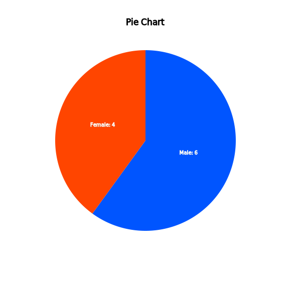{.imgFig600540}

::: figText
\<Figure 2.2.6\> Pie chart of the number of male and female students.
:::

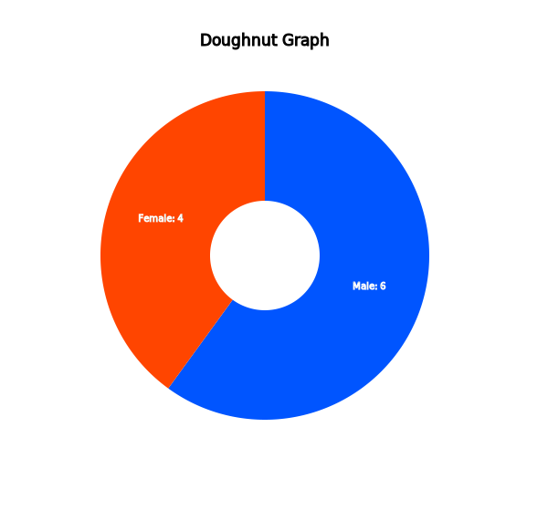{.imgFig600540}

::: figText
\<Figure 2.2.7\> Doughnut chart of the number of male and female
students.
:::

Click on the band graph icon
{.imgIcon} to display a band graph
as in \<Figure 2.2.8\>. A band graph is a variant of the pie chart by
dividing a rectangle into square pieces which are proportional to
frequencies of each category. It is named after a rectangular shape with
multiple square pieces which looks like a band.

{.imgFig600540}

::: figText
\<Figure 2.2.8\> Band graph of the number of male and female students.
:::
:::

::: mainTable
International institutions such as UN, OECD and EU release their
statistics to the public in the form of summary data and this data can
be downloaded as an Excel file or a text file in CSV format. The
following example shows how to download a file from the OECD and how to
draw graphs using this file.
:::

::: mainTableGrey
**Example 2.2.2(Life Expectancy at Birth : Source OECD)**

From the home page of the OECD, https://www.oecd.org, download a data
file of the life expectancy at birth. Copy the columns of the country
name and 2017 data located at the last column to 『eStat』 system and
save it as a file in CSV format. Using this data, draw a vertical bar
graph and a horizontal bar graph in descending order of the life
expectancy. Analyze the graphs.

**Answer**

The main screen of the OECD website as of December 2020,
https://www.oecd.org, looks like as in \<Figure 2.2.9\>.

{.imgFig600400}

::: figText
\<Figure 2.2.9\> OECD home page
:::

Select the menu Topics \> Health, then the screen as in \<Figure
2.2.10\> will be appeared.

{.imgFig600400}

::: figText
\<Figure 2.2.10\> OECD 'Topic' \> 'Health' menu
:::

If you click on 'Explore all our data on health', the screen as in
\<Figure 2.2.11\> will be appeared.

{.imgFig600300}

::: figText
\<Figure 2.2.11\> OECD Statistics for life expectancy at birth
:::

If you click on '\> OECD Health Statistics 2020: Frequently Requested
Data', an Excel file of
OECD-Health-Statistics-2020-Frequently-Requested-Data.xls is downloaded.
If you open the Excel file, the menu as in \<Figure 2.2.12\> is
appeared.

{.imgFig600400}

::: figText
\<Figure 2.2.12\> OECD Statistics for life expectancy at birth
:::

If you click on 'Life expectancy at birth, total population' in Health
status (Mortality), an Excel file as in \<Figure 2.2.13\> will be
appeared on the screen.

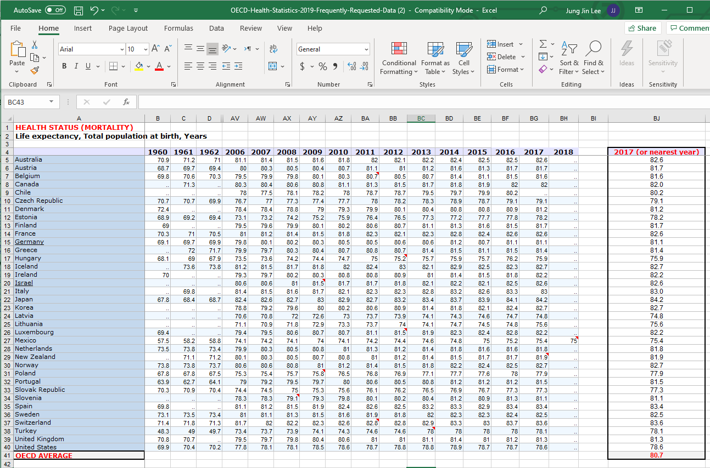{.imgFig600400}

::: figText
\<Figure 2.2.13\> OECD Statistics for life expectancy at birth
:::

The easiest way to make a file in CSV format is to copy the country name
to the first column of the sheet of 『eStat』 and the column of 2017
data located at the last column of this Excel file to the second column
of the sheet of 『eStat』 as in \<Figure 2.2.14\>. After you provide
variable names 'Country' and 'Years' by using \[Edit Var\] of 『eStat』
, save the data as a file, for example,
'EX020202_OECD_LifeExpectancy.csv' in CSV format,.

{.imgFig300400}

::: figText
\<Figure 2.2.14\> OECD life expectancy at birth in 2017
:::

Another way is to edit the Excel file in \<Figure 2.2.13\> with only two
columns, the country name and 2017 data similar to \<Figure 2.2.14\>,
and save it as a file in CSV format. In this case, the first row should
have variable names such as 'Country' and 'Number' (refer Appendix
A.2).. In order to save this file in CSV format, select the Excel menu
'File' \> 'Save As', then a dialogue box as in \<Figure 2.2.15\> will be
appeared. Select the option 'CSV Utf-8', then the file will be saved in
CSV format in the download folder of your computer. Note that, if you
are using an European version of Excel, you have to change the delimiter
of semicolon ';' with comma ',' before you save the file (refer Excel
option).

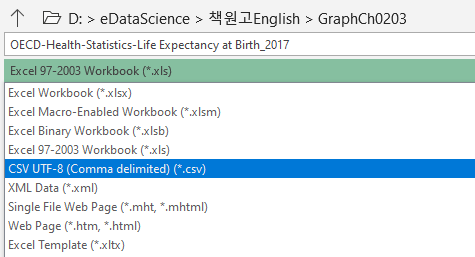{.imgFig300200}

::: figText
\<Figure 2.2.15\> OECD
:::

Click the variable names 'Country' and 'Number' on the sheet of
『eStat』 , then a vertical bar graph of the life expectancy will be
appeared as in \<Figure 2.2.16\>. If the characters of the country name
are too small to see, you can enlarge the screen by holding the \[Ctrl\]
key and rolling up the wheel mouse. You can click on the horizontal bar
graph icon located above the Graph Area to draw a horizontal bar graph
as in \<Figure 2.2.17\>.

It is sometimes convenient to compare data using a horizontal bar graph
after sorting. If you check a sorting option 'Descending' located below
the graph, a horizontal bar graph sorted by descending order of the life
expectancy at the birth will be appeared as in \<Figure 2.2.17\>. It is
easy to check that Japan is the longest life expectancy, Switzerland is
the second and Latvia is the shortest.

{.imgFig600540}

::: figText
\<Figure 2.2.16\> Vertical bar graph of OECD life expectancy at birth in
2017
:::

{.imgFig600540}

::: figText
\<Figure 2.2.17\> Horizontal bar graph of OECD life expectancy at birth,
2017
:::
:::

::: mainTablePink

<input class="qrBtn" onclick="window.open(addrStr[40])" src="QR/PR020201.svg" type="image"/>

**Practice 2.2.1** **(Alcohol Expenditure: OECD)**

Draw a bar graph using the following data in 『eStat』 system and
analyze the graph.

\[Ex\] ⇨ eBook ⇨ PR020201_OECD_AlcoholExpenditure_2013.csv

:::

::: mainTablePink

<input class="qrBtn" onclick="window.open(addrStr[41])" src="QR/PR020202.svg" type="image"/>

**Practice 2.2.2** **(Obesity Ratio: World)**

Draw a bar graph using the following data in 『eStat』 system and
analyze the graph.

\[Ex\] ⇨ eBook ⇨ PR020202_WORLD_ObesityRatio_Age15over\_\_2017

:::

### 2.2.2 Summary Data of Categorical Variable with Group

::: mainTable
The summary data as in Table 2.2.1 can be easily extended if you survey
the gender of two classes in a school as in Table 2.2.2. It is the
summary data of the gender variable for two classes (groups), classes of
5-1 and 5-2. In this case, we usually want to compare the summary data
between two classes (groups) using graphs as the following example.

Table 2.2.2 Summary data of two classes

  Gender   5-1   5-2
  -------- ----- -----
  Male     16    12
  Female   14    18
:::

::: mainTableGrey
**Example 2.2.3** **(Gender Summary Data of Two Classes)**

A file of the summary data in Table 2.2.2 is saved at the following
location of 『eStat』 system.

\[Ex\] ⇨ eBook ⇨ EX020203_Summary_StudentByGender

Using this data, draw a bar graph, a pie chart and a band graph. Use
『eStat』.

**Answer**

If you load the data file from 『eStat』 , it looks like as in \<Figure
2.2.18\>.

<input class="qrBtn" onclick="window.open(addrStr[9])" src="QR/EX020203.svg" type="image"/>

{.imgFig300200}

::: figText
\<Figure 2.2.18\> Load file of summary data
:::

Click the variable names \'Gender\', '5-1' and '5-2' sequentially, then
the selected variables will be appeared at the box of \'Selected Var\'
located above the sheet. You can select the variable '1: Gender' using
the combo box of the \'Analysis Var\' and the variable '2: 5-1' and '3:
5-2' using the combo box of the \'By Group\' located above the sheet.

When the variables are selected, a vertical bar graph
{.imgIcon} which is the
default graph of 『eStat』 is drawn using the number of male and female
students in both classes as in \<Figure 2.2.19\>. A bar graph is drawn
for each class and the heights of bars are the frequencies of male and
female students. Two bar graphs has the same scale of Y-axis and
therefore the frequencies of each class can be easily compared. This bar
graph is called a separated vertical bar graph for each class. By
clicking the horizontal bar graph icon
{.imgIcon}, a separated
horizontal bar graph can be drawn as in \<Figure 2.2.20\>

{.imgFig600540}

::: figText
\<Figure 2.2.19\> Separated vertical bar graph of the gender
distribution by class.
:::

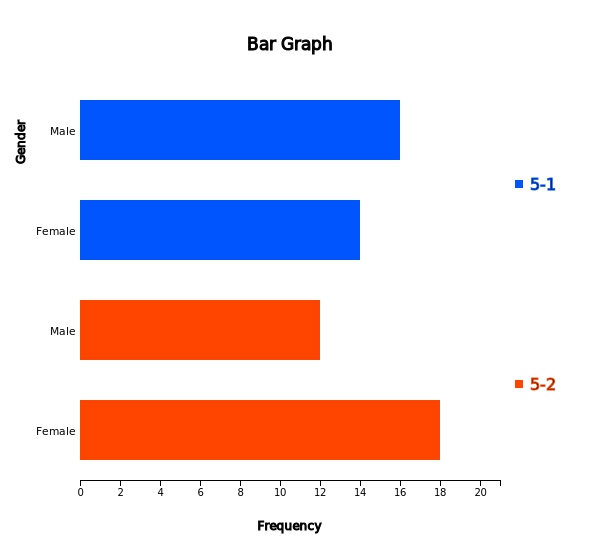{.imgFig600540}

::: figText
\<Figure 2.2.20\> Separated horizontal bar graph of the gender
distribution by class.
:::

For the summary data of two groups, there are many variants of showing
bar graphs in order to compare two groups visually well. If you click on
the stacked bar icon either vertical
{.imgIcon} or horizontal
{.imgIcon}, a stacked bar
graph is drawn that divides a single bar into pieces with different
colors which are proportional to the frequencies of male and female
students (\<Figure 2.2.21\> and \<Figure 2.2.22\>).

{.imgFig600540}

::: figText
\<Figure 2.2.21\> Stacked vertical bar graph of the gender by class
:::

{.imgFig600540}

::: figText
\<Figure 2.2.22\> Stacked horizontal bar graph of the gender by class
:::

If you click on the ratio bar graph icon either vertical
{.imgIcon} or horizontal
{.imgIcon}, a ratio bar graph
is drawn in which bars with the same height are divided into pieces with
different colors which are proportional to the frequencies of male and
female students (\<Figure 2.2.23\> and \<Figure 2.2.24\>).

{.imgFig600540}

::: figText
\<Figure 2.2.23\> Ratio vertical bar graph of the gender by class.
:::

{.imgFig600540}

::: figText
\<Figure 2.2.24\> Ratio horizontal bar graph of the gender by class.
:::

If you click on the side-by-side icon either vertical
{.imgIcon} or horizontal
{.imgIcon}, a side-by-side bar
graph is drawn which draws the bars of each group category sideways for
comparison (\<Figure 2.2.25\> and \<Figure 2.2.26\>).

{.imgFig600540}

::: figText
\<Figure 2.2.25\> Side-by-side vertical bar graph of the gender by
class.
:::

{.imgFig600540}

::: figText
\<Figure 2.2.26\> Side-by-side horizontal bar graph of the gender by
class.
:::

If there are only two categories of the group variable like this
example, then by clicking on the bi-lateral bar icon either vertical
{.imgIcon} or horizontal
{.imgIcon}, a two-sided
(or bi-lateral) bar graph is drawn which draws the bars in the opposite
direction either the above and below of X-axis (\<Figure 2.2.27\>), or
the left and right of Y-axis (\<Figure 2.2.28\>).

{.imgFig600540}

::: figText
\<Figure 2.2.27\> Two-sided vertical bar graph of the gender by class.
:::

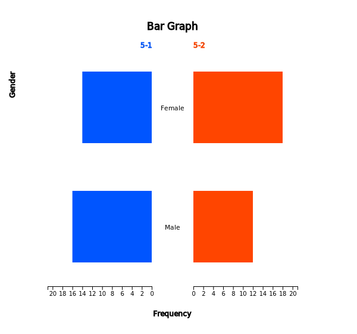{.imgFig600540}

::: figText
\<Figure 2.2.28\> Bi-lateral horizontal bar graph of the gender by
class.
:::

By clicking on the pie chart icon
{.imgIcon}, a pie chart is drawn as
in \<Figure 2.2.29\> which has two pie charts for classes of '5-1' and
'5-2'. Each pie chart shows the frequencies of the number of male and
female students by dividing a pie (circle) into pieces with two colors
depending on angles which are proportional to the frequencies of each
category.

By clicking on the band graph icon
{.imgIcon}, a band graph is drawn
as in \<Figure 2.2.30\> which has two band graphs for classes of '5-1'
and '5-2'. Each band graph shows the frequencies of the number of male
and female students by dividing a rectangle into squares with two colors
which are proportional to the frequencies of each category.

{.imgFig600540}

::: figText
\<Figure 2.2.29\> Pie charts for gender distribution in two classes.
:::

{.imgFig600540}

::: figText
\<Figure 2.2.30\> Band graphs for gender distribution in two classes.
:::
:::

::: mainTableGrey
**Example 2.2.4** **(Male and Female Population by Age Groups)**

In 2015, the male and female populations by age groups in Korea are
shown in Table 2.2.3. Using this data, draw a vertical bar graph by age
groups and then find appropriate graphs to analyze the characteristics
of this data easily.

Table 2.2.3 male and female populations by age groups in Korea\
(KOSTAT Census 2015, unit 10,000 persons)

  Age Interval   2015 Male   2015 Female
  -------------- ----------- -------------
  00 - 04        115         109
  05 - 09        116         109
  10 - 14        126         116
  15 - 19        166         151
  20 - 24        181         158
  25 - 29        158         145
  30 - 34        158         176
  35 - 39        193         186
  40 - 44        214         207
  45 - 49        215         212
  50 - 54        209         205
  55 - 59        192         194
  60 - 64        134         141
  65 - 69        102         110
  70 - 74        79          97
  75 - 79        55          80
  80 - 84        28          54
  over 85        13          39

**Answer**

<input class="qrBtn" onclick="window.open(addrStr[10])" src="QR/EX020204.svg" type="image"/>

The data of Table 2.2.3 can be loaded from 『eStat』 using the following
address.

::: textLeft
\[Ex\] ⇨ eBook ⇨ EX020204_Summary_PopulationByGender.csv.
:::

Click on the variable name of the first variable, \'AgeInterval\'
followed by the second variable '2015_Male' and the third variable
'2015_Female\'. As shown in \<Figure 2.2.31\>, you may select the
'AgeInterval' variable from the \'Analysis Var\' box and '2015_Male\'
and '2015_Female' variables sequentially from the \'By Group box. When
these variables are selected, a separated vertical bar graph
{.imgIcon} as shown in
\<Figure 2.2.32\> which separates the male and female populations with
the same scale of Y-axis will be appeared in the Graph Area.

{.imgFig300100}

::: figText
\<Figure 2.2.31\> Variable selection for analysis
:::

{.imgFig600540}

::: figText
\<Figure 2.2.32\> Separated vertical bar graph of population by age
group and by gender
:::

Among ten possible bar graphs, a side-by-side bar graph
{.imgIcon} as \<Figure 2.2.33\>
would be useful, because it shows the comparison of the number of male
and female populations in each age interval. A ratio bar graph
{.imgIcon} as \<Figure
2.2.34\> which shows directly the proportions of male and female
populations in each age interval can also be useful. In each of the
graphs, you can easily see that the female population is getting larger
than the male population after the age interval of 50s and more.

{.imgFig600540}

::: figText
\<Figure 2.2.33\> Side-by-side vertical bar graph of population by age
and by gender
:::

{.imgFig600540}

::: figText
\<Figure 2.2.34\> Proportional horizontal bar graph of population by age
and by gender
:::

A line graph {.imgIcon} as in
\<Figure 2.2.35\> can also be used to see this kind of patterns.
{.imgFig600540}

::: figText
\<Figure 2.2.35\> Line graph of population by age and by gender
:::

An overall distribution of the male and female populations by age group
can be observed by using a two-sided (bi-lateral) horizontal bar graph
{.imgIcon} as in \<Figure
2.2.36\> which is usually called a population pyramid. Currently, Korea
has an age-specific population structure which looks like a jar. In
other words, the population in age intervals of 40 to 50 is higher than
the population in age intervals of 30 or less which is gradually
decreasing. It would cause many problems in the future society such as
the population decrease, the medicare budget increase etc.

{.imgFig600540}

::: figText
\<Figure 2.2.36\> Bi-lateral horizontal bar graph of population by age
and by gender
:::
:::

::: mainTablePink

<input class="qrBtn" onclick="window.open(addrStr[42])" src="QR/PR020203.svg" type="image"/>

**Practice 2.2.3** **(Death rates in Virginia)**

For each of five age groups (50--54, 55--59, 60--64, 65--69, 70--74),
death rates are measured per 1000 population per year in Virginia. They
are cross-classified by population group such as Rural/Male,
Rural/Female, Urban/Male and Urban/Female. This data are saved at the
following location of 『eStat』system.

\[Ex\] ⇨ eBook ⇨ PR020203_Rdatasets_VADeaths.csv

Draw appropriate graphs to analyze characteristics of the data.

:::

::: mainTable
In general, if there are many groups (columns) on the summary data, you
can compare the difference between groups for each category of the
analysis variable using different kinds of graphs. If there are many
groups, it is recommended that you draw several kinds of graphs, because
each graph can show you different characteristics of data.

If data are observed over time, it is called a time series and a line
graph is usually used to observe a trend over time. The X-axis includes
values of a time variable which are spaced equally and Y-axis represents
a scale of all time series data. Each pair of data, time and value is
marked as a point in a two-dimensional coordinate plane and two adjacent
points are connected with a line.
:::

::: mainTableGrey
**Example 2.2.5** **(OECD Export -- Import by Country)**

In 2017, import and export data of OECD countries are stored at the
following location of 『eStat』 system.

\[Ex\] ⇨ eBook ⇨ EX020205_OECD_ExportImport_2017.csv.

Draw a line graph to find out characteristics of export and import by
country.

**Answer**

<input class="qrBtn" onclick="window.open(addrStr[11])" src="QR/EX020205.svg" type="image"/>

Retrieve the file from 『eStat』 which will show the data as in \<Figure
2.2.37\>.

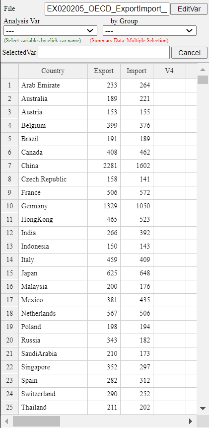{.imgFig300400}

::: figText
\<Figure 2.2.37\> Export-Import data of OECD countries
:::

Click on the line graph icon
{.imgIcon}, then click the variable
names of \'Country\', 'Export\', \'Import\' to draw a line graph as in
\<Figure 2.2.38\>.

Looking in the Graph, we can see that China and Germany have lots of
surplus in trade and USA has lots of loss.

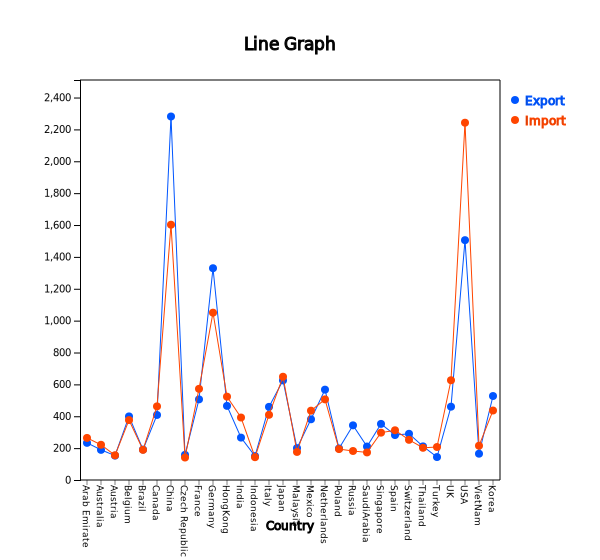{.imgFig600540}

::: figText
\<Figure 2.2.38\> Line graph of Export-Import of OECD countries
:::
:::

::: mainTablePink

<input class="qrBtn" onclick="window.open(addrStr[43])" src="QR/PR020204.svg" type="image"/>

**Practice 2.2.4** **(Income of OECD Countries)**

National incomes of OECD countries in 2000, 2005, 2010 and 2015 are
saved at the following location of 『eStat』 system.

\[Ex\] ⇨ OECD ⇨ PR020204_OECD_NationalIncome_2017.csv.

Draw a line graph of the national incomes for each country.

:::

::: mainTablePink

<input class="qrBtn" onclick="window.open(addrStr[44])" src="QR/PR020205.svg" type="image"/>

**Practice 2.2.5** **(Average Temperatures by Season in Korea)**

Average temperatures of each season were observed from 1973 to 2016 in
Korea and data are saved at the following location of 『eStat』 system.

\[Ex\] ⇨ eBook ⇨ PR020205_Summary_TemperatureBySeason.csv

Draw a line graph of the temperatures by season and observe their
characteristics.

:::

      

      

::: 

             

## 2.3 Visualization of Raw Data

::: presentation-video-link
[presentation](pdf/0203.pdf){.presentation-link target="_blank"}   
[video](https://youtu.be/ntqyCxJ-_sg){.video-link target="_blank"}
:::

::: mainTable
Section 2.2 describes how to visualize the summary data of a categorical
variable. This section describes how to visualize qualitative data in
the form of raw data. In general, the raw data are processed by counting
the number of data in each category of a categorical variable using a
statistical package and the resulted summary data are visualized as in
Section 2.2. 『eStat』 system enables this kind of work easily.

This section describes how to visualize the raw data in the case of
qualitative data without groups and with groups.
:::

### 2.3.1 Raw Data of Categorical Variable

::: mainTableGrey
**Example 2.3.1** **(Survey on Gender -- Raw Data)**

There are 10 students in a class and gender (male or female) data are
collected as follows. This kind of data are called as raw data.

male, female, male, female, male, male, male, female, male, female

In order to use a statistical package, the raw data are usually arranged
as a column as in Table 2.3.1 with numeric coding (1: male, 2: female).
Coding is not compulsory depending on packages, but 『eStat』 system
allows the raw data of both with coding and without coding (character
data).

Table 2.3.1 Gender Survey (1:Male, 2:Female)

  Gender
  --------
  1
  2
  1
  2
  1
  1
  1
  2
  1
  2

Data of Table 2.3.1 are saved at the following address in 『eStat』
system.

\[Ex\] ⇨ eBook ⇨ EX020301_Raw_Gender.csv

Use 『eStat』 to draw a bar graph, a pie chart, and a band graph to find
out characteristics of the raw data.

**Answer**

Enter the gender data of Table 2.3.1 on the sheet of 『eStat』 system or
load the file from \[Ex\] ⇨ eBook ⇨ EX020301_Raw_Gender.csv.

If you enter the data, give a variable name \'Gender\' using \[Edit
Var\] button as shown in \<Figure 2.3.1\> and provide value labels to
values 1 and 2 (1 for Male and 2 for Female). If the data are edited
using the value labels, it must be saved with JSON format file (click on
the JSON Save icon) to ensure that the edited information is not lost.
If you want to load a file in JSON format to 『eStat』 system, you must
also use the JSON Open icon.

<input class="qrBtn" onclick="window.open(addrStr[12])" src="QR/EX020301.svg" type="image"/>

{.imgFig300400}

::: figText
\<Figure 2.3.1\> Value label using \[Edit Var\]
:::

Click on the variable name \'Gender\' to draw a vertical bar graph as
shown in \<Figure 2.3.2\>. A bar graph was drawn after counting
frequencies of each gender category, i.e. six males and four females. A
basic function of statistical packages such as 『eStat』 is to examine a
frequency distribution of the raw data and draw a graph using this
frequency distribution.

The vertical bar graph {.imgIcon}
such as \<Figure 2.3.2\> is frequently used. If there are a large number
of categories, a horizontal bar graph
{.imgIcon} as in \<Figure
2.3.3\> can also be used (click on the horizontal bar graph icon in
『eStat』 ).

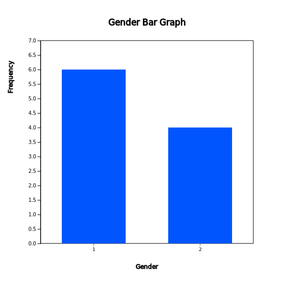{.imgFig600540}

::: figText
\<Figure 2.3.2\> Vertical bar graph of gender
:::

{.imgFig600540}

::: figText
\<Figure 2.3.3\> Horizontal bar graph of gender
:::

Click on the pie chart icon
{.imgIcon} in 『eStat』 to draw a
pie chart (\<Figure 2.3.4\>) and click on the band graph icon
{.imgIcon} to draw a band graph
(\<Figure 2.3.5\>). Click on the icon to draw a doughnut graph.

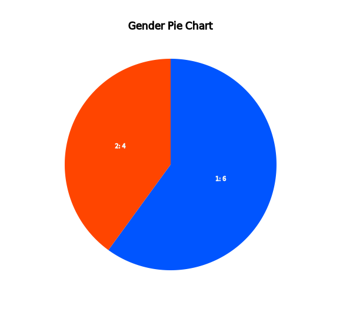{.imgFig600540}

::: figText
\<Figure 2.3.4\> Pie chart of gender
:::

{.imgFig600540}

::: figText
\<Figure 2.3.5\> Band graph of gender
:::
:::

::: mainTablePink

<input class="qrBtn" onclick="window.open(addrStr[45])" src="QR/PR020301.svg" type="image"/>

**Practice 2.3.1** **(Preference of Mathematics)**

In an elementary school, gender (1: male, 2: female) and math preference
(1: good, 2: ordinary, 3: no) of students were surveyed and saved at the
following location of 『eStat』 system.

\[Ex\] ⇨ eBook ⇨ PR020301_Raw_MathPreferenceByGender.csv.

Draw a bar graph, a pie chart, a band graph of the math preference.

:::

### 2.3.2 Raw Data of Categorical Variable with Group

::: mainTableGrey
**Example 2.3.2** **(Survey on Gender and Marital Status -- Raw Data
with Group)**

In addition to the gender data of Example 2.3.1, marital status (1:
Single 2: Married, 3: Other) was also surveyed as in Table 2.3.2.
Compare characteristics of marital status by gender (male and female)
using a bar graph, a pie chart, a band graph, and a line graph. Data are
saved at the following location of 『eStat』.

\[Ex\] ⇨ eBook ⇨ EX020302_Raw_MaritalByGender.csv

Table 2.3.2 Survey of gender and Marital status

  -----------------------------------------------------------------------
  Gender\                             Marital Status\
  (1:Male, 2:Female)                  (1:Single, 2:Married, 3:Other)
  ----------------------------------- -----------------------------------
  1                                   1

  2                                   2

  1                                   1

  2                                   1

  1                                   2

  1                                   1

  1                                   1

  2                                   2

  1                                   3

  2                                   1
  -----------------------------------------------------------------------

**Answer**

<input class="qrBtn" onclick="window.open(addrStr[13])" src="QR/EX020302.svg" type="image"/>

Enter the gender and marital status data of Table 2.3.2 on the sheet of
『eStat』 system. Use \[Edit Var\] button to enter a variable name as
\'Gender\' and its value labels as \'Male\' for value 1 and \'Female\'
for value 2. Similarly, enter a variable name as 'Marital' and its value
labels as 'Single' for 1, 'Married' for 2 and 'Other' for 3.

The data edited for their variable names and value labels must be saved
in JSON format file (click on the JSON Save icon ) to ensure that the
information is not lost. When recalling again, you must also click on
the JSON Open icon .

If you click on the 'marital' and 'gender' variable names sequentially,
a separated vertical bar graph
{.imgIcon} of marital
status by gender is drawn as in \<Figure 2.3.6\>.

{.imgFig600540}

::: figText
\<Figure 2.3.6\> Vertical bar graph of marital status by gender
:::

This separated bar graph by gender can be modified in a different form
using the icons below the main icons which are a vertical stacked
{.imgIcon} (\<Figure
2.3.7\>), a ratio (\<Figure 2.3.8\>),
{.imgIcon} a side-by-side
(\<Figure 2.3.9\>) {.imgIcon},
a bi-lateral (Figure 2.3.10)
{.imgIcon} and a
horizontal separated
{.imgIcon} (\<Figure
2.3.11\>), a stacked
{.imgIcon} (\<Figure
2.3.12\>), a ratio {.imgIcon}
(\<Figure 2.3.13\>), a side-by-side
{.imgIcon} (\<Figure 2.3.14\>),
a bi-lateral {.imgIcon}
(\<Figure 2.3.15\>).

{.imgFig600540}

::: figText
\<Figure 2.3.7\> Vertical stacked bar graph of marital status by gender
:::

{.imgFig600540}

::: figText
\<Figure 2.3.8\> Vertical proportional bar graph of marital status by
gender
:::

{.imgFig600540}

::: figText
\<Figure 2.3.9\> Vertical side by side bar graph of marital status by
gender
:::

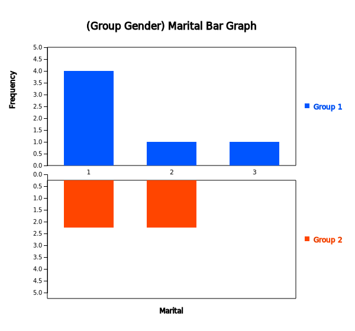{.imgFig600540}

::: figText
\<Figure 2.3.10\> Vertical bi-lateral bar graph of marital status by
gender
:::

{.imgFig600540}

::: figText
\<Figure 2.3.11\> Horizontal bar graph of marital status by gender
:::

{.imgFig600540}

::: figText
\<Figure 2.3.12\> Horizontal stacked bar graph of marital status by
gender
:::

{.imgFig600540}

::: figText
\<Figure 2.3.13\> Horizontal proportional bar graph of marital status by
gender
:::

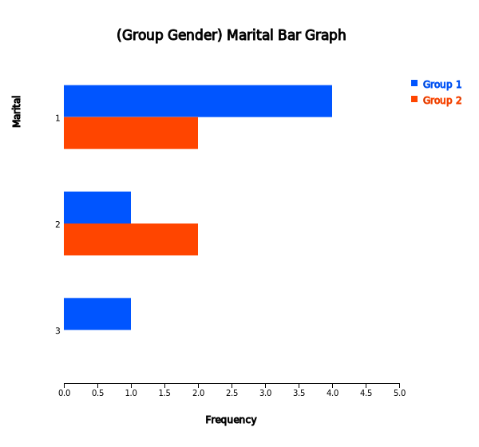{.imgFig600540}

::: figText
\<Figure 2.3.14\> Horizontal side by side bar graph of marital status by
gender
:::

{.imgFig600540}

::: figText
\<Figure 2.3.15\> Horizontal bi-lateral bar graph of marital status by
gender
:::

Click on the pie chart {.imgIcon}
and band graph icons {.imgIcon} and
in 『eStat』 to draw a pie chart as in \<Figure 2.3.16\> and a band
graph as in \<Figure 2.3.17\>. It is easy to observe which categories in
each group account for a large percentage of the total data.

{.imgFig600540}

::: figText
\<Figure 2.3.16\> Pie chart of marital status by gender
:::

{.imgFig600540}

::: figText
\<Figure 2.3.17\> Band graph of marital status by gender
:::
:::

::: mainTablePink

<input class="qrBtn" onclick="window.open(addrStr[46])" src="QR/PR020301.svg" type="image"/>

**Practice 2.3.2** **(Preference of Mathematics by Gender)**\
n an elementary school, gender (1: male, 2: female) and math preference
(1: good, 2: ordinary, 3: no) of students were surveyed and saved at the
following location of 『eStat』 system.

::: textLeft
\[Ex\] ⇨ eBook ⇨ PR020302_Raw_MathPreferenceByGender.csv.
:::

Draw a bar graph, a pie chart and a band graph of the math preference by
gender.

:::

             
:::

::: 

             

## 2.4 Word Cloud

::: presentation-video-link
[presentation](pdf/0204.pdf){.presentation-link target="_blank"}   
[video](https://youtu.be/lVjwz0VcJCs){.video-link target="_blank"}
:::

::: mainTable
A word cloud is a visual representation of text data. It is a
visualization of word frequency in a given text as a weighted list. The
importance of each word is shown with font size or color in the word
cloud. Bigger term means greater weight.

The word cloud is useful for quickly perceiving the most prominent words
to determine its relative prominence. It has been recently used to
visualize the topical content of political speeches. It can be used as
website navigation aids to determine hyperlink to items associated with
the word in social software. The keyword in the cloud is sometimes used
as a search engine marketing term that refers to a group of keywords
that are relevant to a specific website.

There are many algorithms to generate a word cloud. eStat adopted the
algorithm of d3 open software. There are some evolving approaches to
construct a word cloud by applying word co-occurrences in documents.
:::

::: mainTableGrey
**Example 2.4.1** **(Word Cloud)**

Generate a word cloud on the following description on data science and
analyze important words.

+-----------------------------------------------------------------------+
| The development of these technologies has created massive data,       |
| simply called 'Big Data', that were unimaginable in the past. Typical |
| examples of the big data include data from Google\'s search records,  |
| social media messages by mobile phones, web logs by internet          |
| connections, and telephone records of global telecom companies. The   |
| big data are expected to grow and increase exponentially in the       |
| future and the hyper-forecasting is also expected to be possible. The |
| success or failure of each individual, group, company and even        |
| country would depend on how to utilize the big data efficiently.      |
|                                                                       |
| The analysis of the big data that emerged this century is so enormous |
| and diverse in the amount of data that can not be fully utilized just |
| by traditional statistical approaches. For the analysis and           |
| utilization of the big data, theories of statistics, computer         |
| science, mathematics, management or related disciplines must also be  |
| applied simultaneously. Data Science is a new area of study in which  |
| statistics, mathematics, computer science and other disciplines are   |
| fused to analyze and utilize the big data that emerged this century.  |
+-----------------------------------------------------------------------+

**Answer**

<input class="qrBtn" onclick="window.open(addrStr[124])" src="QR/eStatU050.svg" type="image"/>

Click eStaU icon and click 'Word Cloud' in the menu or you can use the
QR code at the left.

Copy the sample text to \[Data Input\] text area and click \[Execute\]
button. Then, a word cloud on data science is drawn as in \<Figure
2.4.1\>.

'Data' is the highest frequency word in the word cloud,'big' is the next
in this word cloud.

{.imgFig600540}

::: figText
\<Figure 2.4.1\> Word cloud on the description of data science
:::
:::

::: mainTablePink

<input class="qrBtn" onclick="window.open(addrStr[124])" src="QR/eStatU050.svg" type="image"/>

**Practice 2.4.1** **(Inaugural Address of US President: Jonh F.
Kennedy))**

Generate a word cloud on the following part of inaugural address by US
president John F. Kennedy and analyze important words.

+-----------------------------------------------------------------------+
| In the long history of the world, only a few generations have been    |
| granted the role of defending freedom in its hour of maximum danger.  |
| I do not shrink from this responsibility\--I welcome it. I do not     |
| believe that any of us would exchange places with any other people or |
| any other generation. The energy, the faith, the devotion which we    |
| bring to this endeavor will light our country and all who serve       |
| it\--and the glow from that fire can truly light the world.           |
|                                                                       |
| And so, my fellow Americans: ask not what your country can do for     |
| you\--ask what you can do for your country.                           |
|                                                                       |
| My fellow citizens of the world: ask not what America will do for     |
| you, but what together we can do for the freedom of man.              |
+-----------------------------------------------------------------------+

:::

             
:::

::: 

## 2.5 Exercise

::: mainTablePink
### Multiple Choice Exercise

Choose one answer and click Submit button

::: textL30M30
2.1 How do you call the following form of organized data?
:::

  Gender   Students
  -------- ----------
  Male     6
  Female   4

<form name="Q1">
<label><input name="item" type="radio" value="1"/> Discrete Data</label> 
<label><input name="item" type="radio" value="2"/> Summary Data</label> 
<label><input name="item" type="radio" value="3"/> Raw Data</label> 
<label><input name="item" type="radio" value="4"/> Continuous Data</label> 

<input onclick="radio(2,1,Q1)" type="button" value="Submit"/>    
    <input id="ansQ1" size="15" type="text"/>

</form>

::: textL30M30
2.2 How do you call the following type of data?
:::

  -----------------------------------------------------------------------
  Gender\                             Marital Status\
  (1:Male, 2:Female)                  (1:Single, 2:Married, 3:Other)
  ----------------------------------- -----------------------------------
  1                                   1

  2                                   2

  1                                   1

  2                                   1

  1                                   2

  1                                   1

  1                                   1

  2                                   2

  1                                   3

  2                                   1
  -----------------------------------------------------------------------

<form name="Q2">
<label><input name="item" type="radio" value="1"/> Discrete Data</label> 
<label><input name="item" type="radio" value="2"/> Summary Data</label> 
<label><input name="item" type="radio" value="3"/> Raw Data</label> 
<label><input name="item" type="radio" value="4"/> Continuous Data</label> 

<input onclick="radio(2,2,Q2)" type="button" value="Submit"/>    
    <input id="ansQ2" size="15" type="text"/>

</form>

::: textL30M30
2.3 Which of the following graphs is used for visualizing qualitative
data?
:::

<form name="Q3">
<label><input name="item" type="radio" value="1"/> bar graph</label> 
<label><input name="item" type="radio" value="2"/> histogram</label> 
<label><input name="item" type="radio" value="3"/> stem and leaf plot</label> 
<label><input name="item" type="radio" value="4"/> scatter plot</label> 

<input onclick="radio(2,3,Q3)" type="button" value="Submit"/>    
    <input id="ansQ3" size="15" type="text"/>

</form>

::: textL30M30
2.4 Which of the following graphs is NOT used for visualizing
qualitative data?
:::

<form name="Q4">
<label><input name="item" type="radio" value="1"/> bar graph</label> 
<label><input name="item" type="radio" value="2"/> histogram</label> 
<label><input name="item" type="radio" value="3"/> pie chart</label> 
<label><input name="item" type="radio" value="4"/> band graph</label> 

<input onclick="radio(2,4,Q4)" type="button" value="Submit"/>    
    <input id="ansQ4" size="15" type="text"/>

</form>

::: textL30M30
2.5 Which graph is useful for data observed over time, such as annual
exports?
:::

<form name="Q5">
<label><input name="item" type="radio" value="1"/> bar graph</label> 
<label><input name="item" type="radio" value="2"/> histogram</label> 
<label><input name="item" type="radio" value="3"/> pie chart</label> 
<label><input name="item" type="radio" value="4"/> line graph</label> 

<input onclick="radio(2,5,Q5)" type="button" value="Submit"/>    
    <input id="ansQ5" size="15" type="text"/>

</form>

:::

::: mainTablePink
### Exercise

2.1 Describe qualitative data and give examples.

2.2 Describe summary data and raw data using examples.

2.3 From the home page of the OECD, download any interesting data for
you in Excel format and do the following:

::: textL50M30
1\) Save data as an Excel file in CSV format.
:::

::: textL50M30
2\) Retrieve the file in 1) to 『eStat』 system.
:::

::: textL50M30
3\) Draw appropriate graphs using 『eStat』 and save results as graph
files.
:::

::: textL50M30
4\) Prepare a report using the MS Word.
:::
:::

:::
