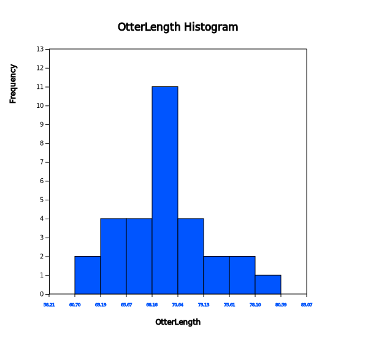
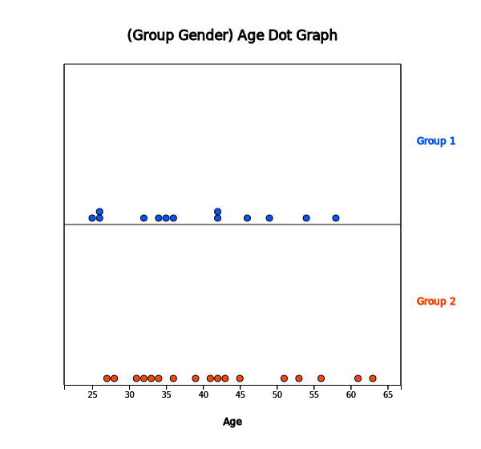
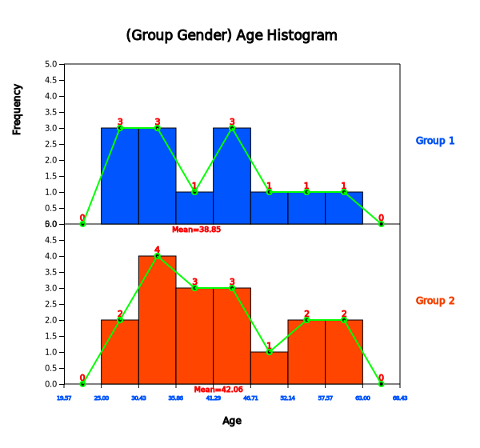
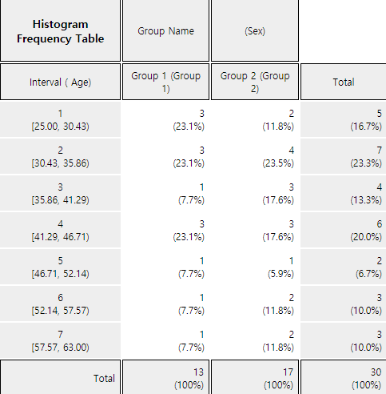
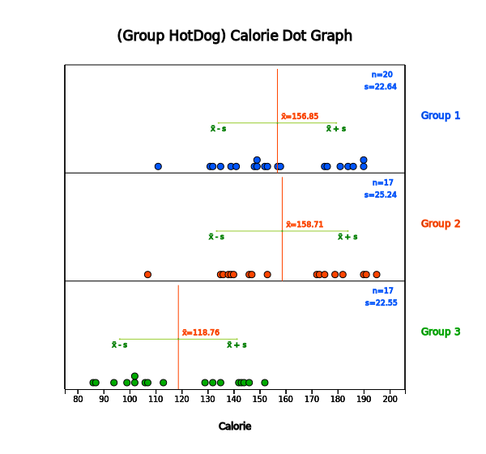
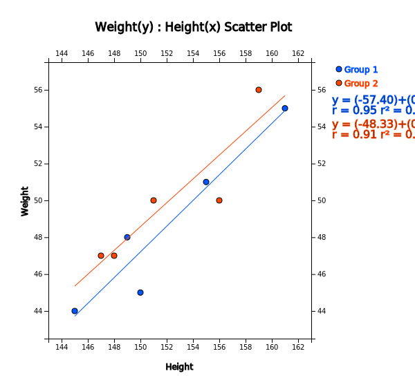

::: container-fluid
:::

::: {.col-sm-9 .col-sm-offset-3 .col-md-10 .col-md-offset-2 .main}
# Chapter 3. Visualization of Quantitative Data

       ❮   **Chapter 2**       

-   [3.1 Visualization of Quantitative Data](../chapter03/0301.html)
-   [3.2 Visualization of Single Quantitative
    Variable](../chapter03/0302.html)
-   [  3.2.1 Visualization of Quantitative Data without
    Group](../chapter03/0302.html)
-   [  3.2.2 Visualization of Quantitative Data with
    Group](../chapter03/0302.html)
-   [3.3 Visualization of Two Quantitative
    Variables](../chapter03/0303.html)
-   [3.4 Exercise](../chapter03/0304.html)

##### [[\[book\]]{.underline}](book03.pdf){target="_blank"}    [[\[eStat YouTube Channel\]]{.underline}](https://www.youtube.com/channel/UCw2Rzl9A4rXMcT8ue8GH3IA){target="_blank"}

## CHAPTER OBJECTIVES

In this chapter, we introduce graphs to visualize the quantitative data
such as dot graph, histogram, stem and leaf plot and scatter plot.

In Section 3.2, we discuss visualization of single quantitative variable
using 『eStat』. Visualization of the quantitative data both without
group and with group is discussed.

In Section 3.3, we discuss visualization of two quantitative variables
using the scatter plot of 『eStat』.

       ❮   **Chapter 2**       
:::
::: container-fluid
:::

::: {.col-sm-9 .col-sm-offset-3 .col-md-10 .col-md-offset-2 .main}
# Chapter 3. Visualization of Quantitative Data

      

## 3.1 Visualization of Quantitative Data

::: presentation-video-link
[presentation](0301.pdf){.presentation-link target="_blank"}   
[video](https://youtu.be/-OlsEFOcRMk){.video-link target="_blank"}
:::

::: mainTable
Data such as height and weight whose possible values are real numbers
are called quantitative data. In order to visualize the quantitative
data of a variable, a dot graph, a histogram, a stem and leaf plot are
used. In order to visualize the quantitative data of two variables, a
scatter plot which utilizes two-dimensional coordinate is used.

{.imgIcon}\
A dot graph is used to visualize the quantitative data with smaller
number of data counts. In order to draw the dot graph, we first draw the
horizontal line and set its scale so that all data can be displayed on
the horizontal line by considering minimum and maximum of the data, then
mark each of the data values in dot corresponding to its scale. The dot
graph makes it easy to see distribution patterns and anomalies of the
data.

{.imgIcon} If there are too many
observations of the quantitative data and therefore there are too many
possible values of the data, the dot graph may not have enough space to
show all data. In such cases, we divide usually all possible values of
the data into several intervals and count the number of data belonging
to each of intervals. Using the frequencies of each interval, we draw a
histogram which is similar to the bar graph with no spacing between
bars.

You might ask a question, \'How many intervals do I need to have?\'
There is no exact answer for the number of intervals, but 52 number of
intervals is usually used when there are small number of data. A square
root of the number of data is also often used as the number of
intervals, but, if the number of intervals is too many, it is not easy
to analyze the data sometimes. As far as the number of intervals is
concerned, it depends on the analyst\'s judgement.

{.imgIcon}\
A stem and leaf plot is a variation of the histogram which is recently
used to visualize the quantitative data. The stem and leaf plot can
easily tell range of observations, shape of distribution, and
concentration. The name literally shows the data in the form of stems
and leaves by considering digits of data values, the first few digits
form the stems and the remaining digits form the leaves. In 『eStat』 ,
the last digit of the data values forms the leaves and the digits in
front of them forms the stems. For each number of the data, first we
investigate where it belongs to a stem and then write down the last
digit of the number as a leaf corresponding to the stem. After
investigating all numbers in the data, rearrange the values of the
leaves on each stem in ascending order. The stem and leaf plot have been
commonly used in recent years as both an interval-specific frequency
distribution and a histogram for the quantitative data.

{.imgIcon}\
A Scatter plot is to visualize data of two quantitative variables using
two dimensional coordinates. The scatter plot can be considered as an
extension of the dot graph for single quantitative variable. Each pair
of the data of two quantitative variables is expressed as a dot with one
value on the X-axis and the other value on the Y-axis in the XY plane.
By using the scatter plot, relationship between two quantitative
variables can be observed efficiently.

In this chapter, visualization of the quantitative data is discussed by
separating cases of the data without group and with group. Visualization
of the quantitative data is a basic step of statistical analysis that
will be described over the next chapters 7 to 12. It is an exploratory
data analysis before you get into some statistical analysis. Estimation
and testing hypothesis for the quantitative data of single population
are described in Chapter 6 and 7. Testing hypothesis for the
quantitative data of two populations are described in Chapter 8. Testing
hypothesis for the quantitative data of three or more populations are
described in Chapter 9.
:::

::: mainTableYellow
**Graphs for Quantitative Data**

**Dot graph** marks each of the data values in dot on a horizontal line
corresponding to its scale. The dot graph makes it easy to see
distribution patterns and anomalies of the data.

**Histogram** divides all possible data values into several intervals,
count the number of data belonging to each interval, and draws a bar
graph using this frequencies with no spacing between bars.

**Stem and leaf plot** is a variation of the histogram which is recently
used to visualize quantitative data. The stem and leaf plot shows the
data in the form of stems and leaves by considering digits of data
values, the first few digits form the stems and the remaining digits
form the leaves.

**Scatter plot** is to visualize the data of two quantitative variables
using two dimensional coordinates. The scatter plot can be considered as
an extension of the dot graph.
:::

      
:::
::: container-fluid
:::

::: {.col-sm-9 .col-sm-offset-3 .col-md-10 .col-md-offset-2 .main}
# Chapter 3. Visualization of Quantitative Data

             

## 3.2 Visualization of Single Quantitative Variable

::: presentation-video-link
[presentation](0302.pdf){.presentation-link target="_blank"}   
[video](https://youtu.be/j_13J_lIAok){.video-link target="_blank"}
:::

In case of the quantitative data, raw data are directly used to
visualize the data. Visualization of the quantitative data is discussed
by separating cases of the data without group and with group.

### 3.2.1 Visualization of Quantitative Data without Group

::: mainTable
If the quantitative data are the sample data from a population,
visualization of this sample data is used as a basic exploratory data
analysis for estimation and testing hypothesis of population parameters
such as population mean and population variance (Chapters 6 and 7).
:::

::: mainTableGrey
**Example 3.2.1** **(Otter Length -- single continuous data)**\
The following data show lengths of 30 otters. Use 『eStat』 to draw a
dot graph, a histogram, a stem and leaf plot. (unit cm)

::: textLeft
63.2 65.3 67.6 68.7 69.7 60.7 72.4 75.2 64.4 76.5
:::

::: textLeft
68.3 69.3 70.2 71.3 74.2 63.6 66.1 67.9 68.7 70.5
:::

::: textLeft
72.3 72.8 77.6 78.1 69.7 69.4 68.6 68.2 67.2 61.7
:::

**Answer**

<input class="qrBtn" onclick="window.open(addrStr[14])" src="QR/EX030201.svg" type="image"/>

Enter all 30 data into V1 column of the sheet in 『eStat』 system and
specify the variable name of V1 as 'OtterLength'. This data can also be
found at the following location

\[Ex\] ⇨ eBook ⇨ EX030201_Continuous_OtterLength.csv

Click on the dot graph icon
{.imgIcon} and click the variable
name, \'OtterLength\', then a dot graph of the otter length will be
appeared in the Graph Area as in \<Figure 3.2.1\>. You can also select
\'OtterLength\' variable at the selection box of the Analysis Variable.

{.imgFig600540}

::: figText
\<Figure 3.2.1\> Dot graph of otter lengths without group
:::

Checking the \'Mean/Std Dev\' in the options window below the graph
shows the average of the data and the (average) ± (one standard
deviation) interval as in \<Figure 3.2.2\>. We can observe that large
number of data can be found around the aveage and the data are
distributed symmetrically around the average.

{.imgFig600540}

::: figText
\<Figure 3.2.2\> Dot graph of otter lengths with MeanStdDev interval
:::

Click on the histogram icon
{.imgIcon} to display the graph as
in \<Figure 3.2.3\>. If you check the options of 'Mean', 'Frequency' and
'Frequency Polygon' below the graph, the histogram is changed as in
\<Figure 3.2.4\>. You can also observe that there are large amount of
data near the mean and the data are distributed in almost symmetrical
form around the mean.

{.imgFig600540}

::: figText
\<Figure 3.2.3\> Histogram of otter lengths
:::

{.imgFig600540}

::: figText
\<Figure 3.2.4\> Histogram polygon of otter lengths with mean
:::

Click on the \[Frequency Table\] button
{.imgIcon} in the options window
below the graph (Figure 3.2.5) to output a frequency table by intervals
based on the histogram currently drawn in the Log Area as in \<Figure
3.2.6\>.

{.imgFig30050}

::: figText
\<Figure 3.2.5\> Options of the histogram
:::

{.imgFig300400}

::: figText
\<Figure 3.2.6\> Frequency table of the histogram
:::

The number and the width of the intervals in the histogram are
automatically calculated by 『eStat』 system, but you can redraw them by
specifying the 'Interval Start' and 'Interval Width' from the option
below the graph and then clicking \[Execute New Interval\] button in
\<Figure 3.2.5\>.

Click on the stem and leaf plot icon
{.imgIcon} to display the graph
shown in \<Figure 3.2.7\>. This graph is a variant of the histogram
where intervals are \[60, 61), \[61, 62), \... , \[78, 79). After
finding the number of data belonging to each interval, the digits of 60,
61, \... , 78 become the stem of the graph and the last digits of all
data values belonging to each interval become the leaves of each stem.
The leaves (last digits) of each stem are sorted in ascending order from
small to large.

{.imgFig600540}

::: figText
\<Figure 3.2.7\> Stem and leaf plot of otter length
:::
:::

::: mainTablePink

<input class="qrBtn" onclick="window.open(addrStr[47])" src="QR/PR030201.svg" type="image"/>

**Practice 3.2.1** **(Bicycle Road in Seoul)**\
The following data are the lengths of bike-only roads in Seoul\'s 25
administrative districts as of 2016. Use 『eStat』 to draw a dot graph,
a histogram, a stem and leaf plot. Analyze the graphs.

::: textLeft
0.0 0.0 1.5 0.6 0.0 1.4 3.1 0.3 0.1 0.7 0.8 0.0 0.4 2.8 16.1
:::

::: textLeft
8.1 1.5 3.8 4.6 0.0 2.9 0.0 4.4 18.4 3.3
:::

::: textLeft
(unit km, Seoul City information system, 2016)
:::

Saved at \[Ex\] ⇨ eBook ⇨ PR030201_Continuous_BikeRoad.csv

:::

::: mainTablePink

<input class="qrBtn" onclick="window.open(addrStr[48])" src="QR/PR030202.svg" type="image"/>

**Practice 3.2.2** **(Lengths of Major North American Rivers)**\
The lengths (in miles) of 141 major rivers in North America compiled by
the US ecological Survey are saved at the following location of
『eStat』.

\[Ex\] ⇨ eBook ⇨ PR030202_Rdatasets_rivers.csv

Use 『eStat』 to draw a dot graph, a histogram, a stem and leaf plot.
Analyze the graphs.

:::

::: mainTablePink

<input class="qrBtn" onclick="window.open(addrStr[49])" src="QR/PR030203.svg" type="image"/>

**Practice 3.2.3** **(Annual Precipitation in US Cities)**\
The average amount of precipitation (rainfall) in inches for each of 70
United States (and Puerto Rico) cities are saved at the following
location of 『eStat』.

\[Ex\] ⇨ eBook ⇨ PR030203_Rdatasets_Precip.csv

Use 『eStat』 to draw a dot graph, a histogram, a stem and leaf plot.
Analyze the graphs.

:::

### 3.2.2 Visualization of Quantitative Data with Group

::: mainTable
If you can visualize the quantitative data by several groups using the
same scale, it is easy to compare characteristics of groups. If the data
are the sample data taken from two or more populations (groups), this
comparison by visualization can be used as a basic exploratory data
analysis for testing hypothesis in Chapter 8 and Chapter 9.
:::

::: mainTableGrey
**Example 3.2.2** **(Teacher's Age by Gender)**\
In a middle school, the age and gender of all teachers are surveyed. The
data are saved at the following location of 『eStat』.

\[Ex\] ⇨ eBook ⇨ EX030202 Continuous_TeacherAgeByGender.csv.

Using this data, draw a dot graph, a histogram, a stem and leaf plot of
the age by gender.

**Answer**

<input class="qrBtn" onclick="window.open(addrStr[15])" src="QR/EX030202.svg" type="image"/>

Select the file from 『eStat』 by clicking

\[Ex\] ⇨ eBook ⇨ EX030202 Continuous_TeacherAgeByGender.csv.

or scan the QR.

Click on the dot graph icon
{.imgIcon} and click the variable
names \'age\' and \'gender\' to draw the dot graph of the age by gender
as in \<Figure 3.2.8\>. You can select 'Age' from the selection box of
\'Analysis Var\' and 'Gender' from the selection box of 'By Group'
variable.

{.imgFig600540}

::: figText
\<Figure 3.2.8\> Dot graph of the age by gender: Group 1 is for male and
Group 2 for female
:::

By checking the \'Mean/StdDev' in the options window below the graph,
the mean line and (average) ± (one standard deviation) intervals are
shown on the graph as in \<Figure 3.2.9\>.

{.imgFig600540}

::: figText
\<Figure 3.2.9\> Dot graph of the age by gender with interval of mean /
std dev
:::

By looking at the dot graph in \<Figure 3.2.9\>, the average age of the
female teachers is higher than the male teachers. If this data are
sampled from two populations, a statistical analysis of testing
hypothesis to compare two population means can be applied. It will be
discussed in Chapter 8.

If you click on the histogram icon
{.imgIcon}, the histogram as in
\<Figure 3.2.10\> appears in the Graph Area. By checking the options
below the graph, you can draw the mean lines, frequencies, and frequency
polygons on the histogram (\<Figure 3.2.11\>). If you click \[Frequency
Table\] button, the frequency table of the histogram can be displayed in
the Log Area as in \<Figure 3.2.12\>.

『eStat』 calculates the number and the width of the intervals
automatically, but you can redraw them by specifying the 'Interval
Start' and 'Interval Width' in the options window below the graph.

{.imgFig600540}

::: figText
\<Figure 3.2.10\> Histogram of age by gender: Group 1 is for male and
Group 2 for female
:::

{.imgFig600540}

::: figText
\<Figure 3.2.11\> Histogram of age by gender with polygon
:::

{.imgFig400300}

::: figText
\<Figure 3.2.12\> Frequency table of age by gender
:::

If you click on the stem and leaf plot icon
{.imgIcon}, the graph as in
\<Figure 3.2.13\> will be displayed in the Graph Area. This stem and
leaf plot is a variant of the histogram in which the age data are
divided into intervals as \[20, 30), \[30, 40), \... \[60,70) by using
the possible decimal digits of 10s as the stem. The age data belonging
to each interval are investigated and displayed using the last digit of
the age as the leaf. The last digits (leaf) of the age are sorted in
ascending order from small to large.

In case of two groups, a bi-lateral stem and leaf plot as in \<Figure
3.2.14\> can be drawn by clicking on the bi-lateral stem and leaf icon
{.imgIcon}.

{.imgFig600540}

::: figText
\<Figure 3.2.13\> Stem and leaf plot of age by sex
:::

{.imgFig600540}

::: figText
\<Figure 3.2.14\> Both direction stem and leaf plot of age by sex
:::
:::

::: mainTableGrey
**Example 3.2.3** **(Comparison Hotdog Calories -- Three Groups)**\
The calorie data of the hot dogs made by three ingredients (1: beef, 2:
pork, 3: chicken) are surveyed and saved at the following location of
『eStat』.

\[Ex\] ⇨ eBook ⇨ EX030203_Continuous_CalorieByHotdog.csv.

Using 『eStat』 , compare the calories of the three hotdog types using a
dot graph, a histogram and, a stem and leaf plot.

**Answer**

<input class="qrBtn" onclick="window.open(addrStr[16])" src="QR/EX030203.svg" type="image"/>

Retrieve the file from 『eStat』 by clicking

\[Ex\] ⇨ eBook ⇨ EX030203_Continuous_CalorieByHotdog.csv.

or scan the QR on the left.

Click on the dot graph icon
{.imgIcon} and then select the
variable \'Calorie\' and \'Hot Dog\' to draw a dot graph as in\<Figure
3.2.15\>. You can also select 'Calorie' in the \'Analysis Var\'
selection box and 'HotDog' in the \'By Group\' selection box.

{.imgFig600540}

::: figText
\<Figure 3.2.15\> Dot graph of calories of hot dog by type
:::

Checking \'Mean/StdDev\' in the options window below the graph will show
(mean) ± (one standard deviation) intervals as shown in \<Figure
3.2.16\>.

If you look at the dot graph of the calories of the hot dog, the hot
dogs made from chicken are lower calories than those made from beef and
pork. If this data are sampled from three populations, a statistical
analysis of testing hypothesis to compare several population means can
be applied. It will be discussed in Chapter 9.

{.imgFig600540}

::: figText
\<Figure 3.2.16\> Dot graph of calories of hot dog by type with mean
interval
:::

Click on the histogram icon
{.imgIcon} to display the graph
shown in \<Figure 3.2.17\>. Under the options below the graph, you can
draw means, frequency, and frequency polygon as in \<Figure 3.2.18\> and
frequency table as in \<Figure 3.2.19\> in the Log Area.

{.imgFig600540}

::: figText
\<Figure 3.2.17\> Histogram of calories of hot dog by type
:::

{.imgFig600540}

::: figText
\<Figure 3.2.18\> Histogram of calories of hot dog by type
:::

{.imgFig400300}

::: figText
\<Figure 3.2.19\> Frequency table of the histogram
:::

The histogram of 『eStat』 calculates the number of intervals and the
width of the intervals automatically, but you can redraw them by
specifying the \'Interval Start\' and \'Interval Width.

Click on the stem and leaf plot icon
{.imgIcon} to display the graph
shown in \<Figure 3.2.20\> This graph is a variant of the histogram
which the calories are divided into intervals \[80, 90), \[90, 100),
\... , \[190, 200) as the stem in each group. The data belonging to each
interval are investigated and displayed as the leaves with the last
digits of the data values. The leaves in each interval are sorted in
ascending order from small to large. In case of many groups, the stem
and leaf plot may overflow the screen as shown in \<Figure 3.2.20\>
(only two groups are visible here). You can move the scroll bar of the
screen to watch all the stem and leaf plot.

{.imgFig600540}

::: figText
\<Figure 3.2.20\> Stem and leaf plot of hot dot calories.\
Move scroll bar to see all graph
:::
:::

::: mainTablePink

<input class="qrBtn" onclick="window.open(addrStr[50])" src="QR/PR030204.svg" type="image"/>

**Practice 3.2.4** **(Oral Cleanliness by Brushing Methods)**\
Oral cleanliness scores according to the brushing method (1:basic
method, 2: rotation method) are examined and stored at the following
location of 『eStat』.

\[Ex\] ⇨ eBook ⇨ PR030204_Continuous_ToothCleanByBrushMethod.csv.

Using 『eStat』 , draw a dot graph, a histogram, a stem and leaf plot of
the oral cleanliness by the brushing method.

:::

::: mainTablePink

<input class="qrBtn" onclick="window.open(addrStr[51])" src="QR/PR030205.svg" type="image"/>

**Practice 3.2.5** **(Plant Growth by Condition)**\
Results from an experiment to compare yields (as measured by dried
weight of plants) are obtained under a control (leveled 'ctrl') and two
different treatment conditions (leveled 'trt1' and 'trt2'). The weights
data with 30 observations on each of control and two treatments ('crtl',
'trt1', 'trt2') are saved at the following location of 『eStat』.

\[Ex\] ⇨ eBook ⇨ PR030205_Rdatasets_PlantGrowth.csv

Use 『eStat』 to draw a dot graph, a histogram, a stem and leaf plot of
the weights by three groups.

:::

::: mainTablePink

<input class="qrBtn" onclick="window.open(addrStr[52])" src="QR/PR030206.svg" type="image"/>

**Practice 3.2.6** **(Effectiveness of Insect Sprays)**\
The counts of insects in agricultural experimental units treated with
six different insecticides. Data with 72 observations on 2 variables,
insect count and sprays (A, B, C, D, E, F), are saved at the following
location of 『eStat』. (Source: Beall, G., (1942) The Transformation of
data from entomological field experiments, Biometrika, 29, 243--262.)

\[Ex\] ⇨ eBook ⇨ PR030206_Rdatasets_InsectSprays.csv

Use 『eStat』 to draw a dot graph, a histogram, a stem and leaf plot of
the insect counts by the types of sprays.

:::

             
:::
::: container-fluid
:::

::: {.col-sm-9 .col-sm-offset-3 .col-md-10 .col-md-offset-2 .main}
# Chapter 3. Visualization of Quantitative Data

             

## 3.3 Visualization of Two Quantitative Varaibles

::: presentation-video-link
[presentation](0303.pdf){.presentation-link target="_blank"}   
[video](https://youtu.be/M8slek6jD94){.video-link target="_blank"}
:::

::: mainTable
In general, we investigate several characteristics from one subject or
one observation. For example, when we investigate students in an
elementary school, we examine their gender, height and weight
simultaneously which are one categorical and two quantitative variables.

If you have data on two quantitative variables, a scatter plot can be
used to analyze the data. A scatter plot displays the data on a
two-dimensional plane with values for one variable being X-axis and
values for the other being Y-axis. If a categorical variable such as
gender is also collected together, a scatter plot by differenciating the
colors of the dots by gender can be drawn.

If data are sampled from a population, the scatter plot can be used to
analyze correlation and regression which will be discussed in Chapter
12.
:::

::: mainTableGrey
**Example 3.3.1** **(Height and Weight by Gender)**\
Data on gender, height and weight of 10 elementary school students are
saved at the following location of 『eStat』.

\[Ex\] ⇨ eBook ⇨ EX030301_Continuous_HeightWeightByGender.csv.

1\) Draw a scatter plot of height and weight using 『eStat』.\
2) Draw a scatter plot of height and weight by gender using 『eStat』.

**Answer**

<input class="qrBtn" onclick="window.open(addrStr[17])" src="QR/EX030301.svg" type="image"/>

Retrieve the file from 『eStat』 by clicking

\[Ex\] ⇨ eBook ⇨ EX030301_Continuous_HeightWeightByGender.csv.

or scan the QR on the left.

By clicking on the scatter plot icon
{.imgIcon} and clicking on the
\'weight\' and \'height' variable names, a scatter plot with the weight
on Y-axis (the first selected variable) and the height on X-axis (the
second selected variable) will appear in the Graph Area as in \<Figure
3.3.1\>. You can also select \'weight\' in the \'Y-variable\' selection
box and \'height in the \'by X-variable\' selection box.

{.imgFig600540}

::: figText
\<Figure 3.3.1\> Scatter plot of height and weight
:::

By checking the \'Regression\' in the options window below the graph
shows a scatter plot with a regression line as in \<Figure 3.3.2\> which
indicates a relationship between weight and height. If you look at the
scatter plot, you can see that the larger the height, the heavier the
weight is. See Chapter 12 for more discussion on the regression
analysis.

By checking the \'Regression\' in the options window below the graph
shows a scatter plot with a regression line as in \<Figure 3.3.2\> which
indicates a relationship between weight and height. If you look at the
scatter plot, you can see that the larger the height, the heavier the
weight is. See Chapter 12 for more discussion on the regression
analysis.

{.imgFig600540}

::: figText
\<Figure 3.3.2\> Scatter plot of height and weight with a regression
line
:::

In order to draw a scatter plot by gender, select \'Gender\' in the
\'Group\' box of options. It shows a scatter plot with different colors
of gender as in \<Figure 3.3.3\>. By checking the \'Regression\' in the
options will show the regression lines to each gender as in \<Figure
3.3.4\>.

{.imgFig600540}

::: figText
\<Figure 3.3.3\> Scatter plot of height and weight by gender groups
:::

{.imgFig600540}

::: figText
\<Figure 3.3.4\> Scatter plot of height and weight by gender with
regression lines
:::

If you select the height as a \'Size Var\' in the option, the dots in
the scatter plot are proportional to the height as in \<Figure 3.3.5\>.

{.imgFig600540}

::: figText
\<Figure 3.3.5\> Scatter plot of height and weight by gender with size
variable of height
:::
:::

::: mainTablePink

<input class="qrBtn" onclick="window.open(addrStr[53])" src="QR/PR030301.svg" type="image"/>

**Practice 3.3.1** **(Old Faithful Geiser)**\
Waiting time between eruptions and the duration of the eruption for the
Old Faithful geyser in Yellowstone National Park, Wyoming, USA were
collected. There are 272 observations on 2 variables, time between
eruptions (in seconds) and waiting time to next eruption (in mins). The
data are saved at the following location of 『eStat』.****

\[Ex\] ⇨ eBook ⇨ PR030301_Rdatasets_Faithful.csv\
(Source: Applied Statistics, 39, 357--365. doi: 10.2307/2347385)

Draw a scatter plot of the time between eruptions and the waiting time
to next eruption.

:::

::: mainTablePink

<input class="qrBtn" onclick="window.open(addrStr[54])" src="QR/PR030302.svg" type="image"/>

**Practice 3.3.2** **(Age and Income by Gender)**\
A survey of age, monthly income and gender (1: man, 2: woman) was
conducted and the data are saved at the following location of 『eStat』.

\[Ex\] ⇨ eBook ⇨ PR030302_Continuous_IncomeAge.csv.

Draw a scatter plot of the age and the monthly income by gender.

:::

::: mainTablePink

<input class="qrBtn" onclick="window.open(addrStr[55])" src="QR/PR030303.svg" type="image"/>

**Practice 3.3.3** **(Motor Trend Car Road Tests)**\
The data of 32 observations were extracted from the 1974 Motor Trend US
magazine, and comprises fuel consumption and 10 aspects of automobile
design and performance for 32 automobiles. The data have 11 variables as
follows.

  ----- ------ ------------------------------------------
  V1    mpg    Miles/(US) per gallon
  V2    cyl    Number of cylinders
  V3    disp   Displacement (cu.in.)
  V4    hp     Gross horsepower
  V5    drat   Rear axle ratio
  V6    wt     Weight (1000 lbs)
  V7    qsec   1/4 mile time
  V8    vs     Engine (0 = V-shaped, 1 = straight)
  V9    am     Transmission (0 = automatic, 1 = manual)
  V10   gear   Number of forward gears
  V11   carb   Number of carburetors
  ----- ------ ------------------------------------------

(Source: Henderson and Velleman (1981), Building multiple regression
models interactively. Biometrics, 37, 391--411.)

This data are saved at the following location of 『eStat』.

\[Ex\] ⇨ eBook ⇨ PR030303_Rdatasets_Mtcars.csv

Draw a scatter plot of the miles per gallon and the weight of a car by
the number of cylinders.

:::

             
:::
::: container-fluid
:::

::: {.col-sm-9 .col-sm-offset-3 .col-md-10 .col-md-offset-2 .main}
# Chapter 3. Visualization of Quantitative Data

              **Chapter 4**   ❯

## 3.4 Exercise

::: mainTablePink
### Multiple Choice Exercise

\*\*\* Choose one answer and click \[Submit\] button

::: textL30M30
3.1 A class of students is as tall as follows. What is this data called?
:::

::: textLeft
170 173 168 175 181 185 176 177
:::

<form name="Q1">
<label><input name="item" type="radio" value="1"/> discrete data</label> 
<label><input name="item" type="radio" value="2"/> summary data</label> 
<label><input name="item" type="radio" value="3"/> raw data</label> 
<label><input name="item" type="radio" value="4"/> continuous data</label> 

<input onclick="radio(3,1,Q1)" type="button" value="Submit"/>    
      <input id="ansQ1" size="15" type="text"/>

</form>

::: textL30M30
3.2 Which of the following graphs is used for quantitative data
visualization?
:::

<form name="Q2">
<label><input name="item" type="radio" value="1"/> bar graph</label> 
<label><input name="item" type="radio" value="2"/> histogram</label> 
<label><input name="item" type="radio" value="3"/> pie chart</label> 
<label><input name="item" type="radio" value="4"/> band graph</label> 

<input onclick="radio(3,2,Q2)" type="button" value="Submit"/>    
      <input id="ansQ2" size="15" type="text"/>

</form>

::: textL30M30
3.3 Which of the following graphs is NOT used for visualization of
quantitative data?
:::

<form name="Q3">
<label><input name="item" type="radio" value="1"/> stem and leaf plot</label> 
<label><input name="item" type="radio" value="2"/> histogram</label> 
<label><input name="item" type="radio" value="3"/> pie chart</label> 
<label><input name="item" type="radio" value="4"/> dot graph</label> 

<input onclick="radio(3,3,Q3)" type="button" value="Submit"/>    
      <input id="ansQ3" size="15" type="text"/>

</form>

::: textL30M30
3.4 What is the graph of displaying data with the last number of
quantitative data as a leaf and the front part as a stem?
:::

<form name="Q4">
<label><input name="item" type="radio" value="1"/> dot graph</label> 
<label><input name="item" type="radio" value="2"/> histogram</label> 
<label><input name="item" type="radio" value="3"/> scatter plot</label> 
<label><input name="item" type="radio" value="4"/> stem and leaf plot</label> 

<input onclick="radio(3,4,Q4)" type="button" value="Submit"/>    
      <input id="ansQ4" size="15" type="text"/>

</form>

::: textL30M30
3.5 What is the graph used for visualization of two quantitative
variable?
:::

<form name="Q5">
<label><input name="item" type="radio" value="1"/> scatter plot</label> 
<label><input name="item" type="radio" value="2"/> histogram</label> 
<label><input name="item" type="radio" value="3"/> stem and leaf plot</label> 
<label><input name="item" type="radio" value="4"/> bar graph</label> 

<input onclick="radio(3,5,Q5)" type="button" value="Submit"/>    
      <input id="ansQ5" size="15" type="text"/>

</form>

:::

::: mainTablePink
### Exercise

3.1 Consider the data at the following location of 『eStat』.

\[Ex\] ⇨ eBook ⇨ Ch3_Ex_Mixed_Survey.csv.

::: textL50M30
1\) Draw a dot graph, a histogram, a stem and leaf plot of the age.
:::

::: textL50M30
2\) Draw a dot graph, a histogram, a stem and leaf plot of the age by
gender.
:::

::: textL50M30
3\) Draw a scatter plot of the income (Y) and the age (X) by gender and
save it as a file.
:::

3.2 Conduct a survey for students who are currently taking the Data
Science (or any other course) to investigate their gender, height, and
weight.

::: textL50M30
1\) Make a file in CSV format on gender, height, and weight.
:::

::: textL50M30
2\) Load the data file in 1) to 『eStat』 system and draw a dot graph, a
histogram, a stem and leaf plot of the height and save them as graph
files.
:::

::: textL50M30
3\) Draw a dot graph, a histogram, a stem and leaf plot of the height by
gender and save them as graph files.
:::

::: textL50M30
4\) Draw a scatter plot of the height and the weight by gender and save
it as a graph file.
:::

::: textL50M30
5\) Load the saved graphs into the MS Word and prepare a survey report
for the students of Data Science.
:::

<input class="qrBtn" onclick="window.open(addrStr[6])" src="QR/CH3_EX_MIXED SURVEY.svg" type="image"/>

:::

              **Chapter 4**   ❯
:::
