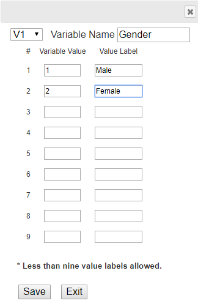
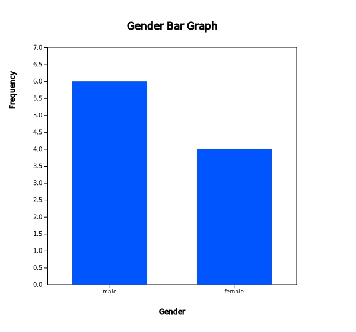
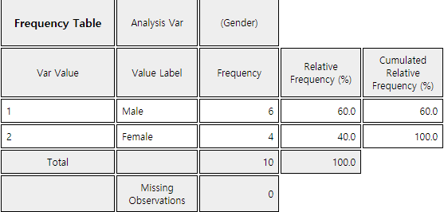
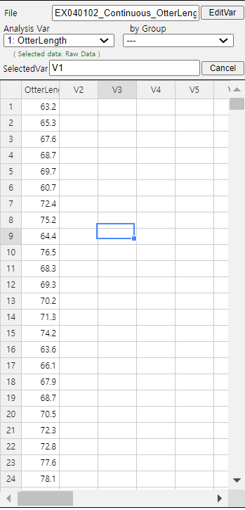
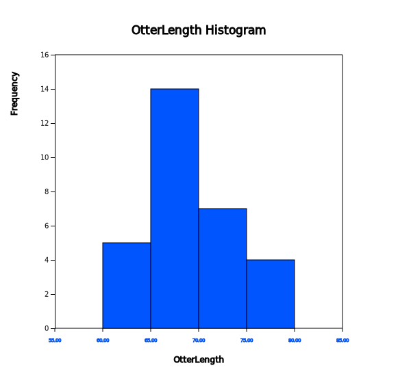
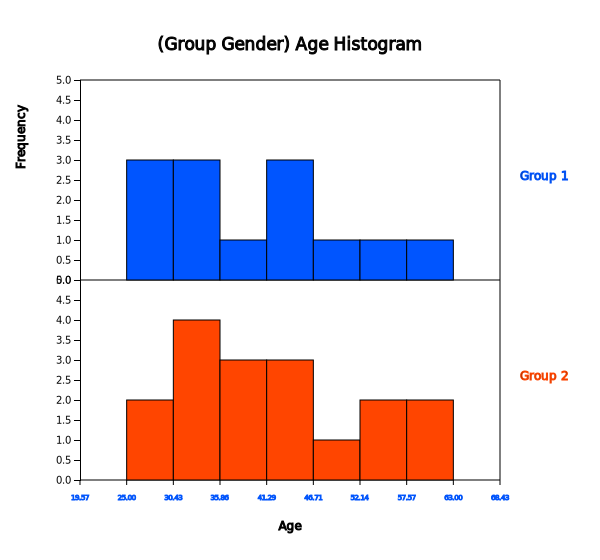
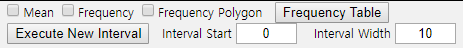
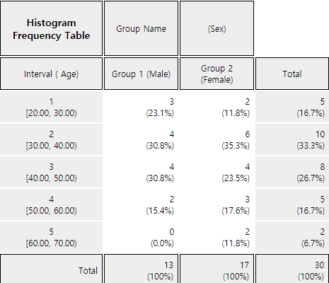
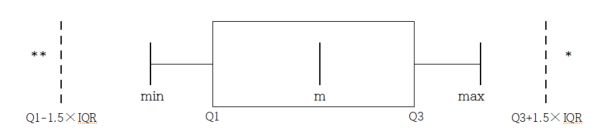
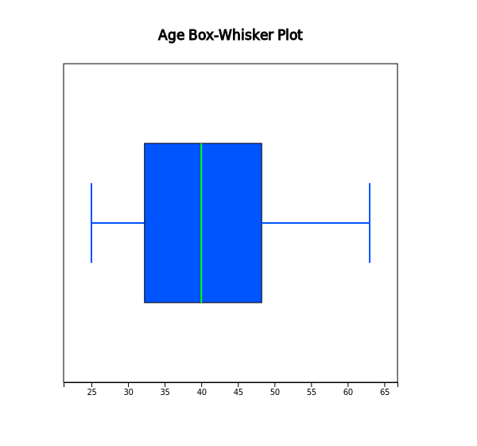

# Data Summary Using Tables and Measures

[book](pdf/book04.pdf){target="_blank"}
[eStat YouTube Channel](https://www.youtube.com/channel/UCw2Rzl9A4rXMcT8ue8GH3IA){target="_blank"}

**CHAPTER OBJECTIVES**

Chapter 2 and 3 discussed how to visualize both the qualitative data and
the quantitative data using graphs. Visualizing data using graphs makes
easy and fast to see any information that is nested in data. However, if
you want more detailed information, it is better to summarize data by
using tables or measures.

In section 4.1, we introduce a frequency table as a summary of single
variable.

In section 4.2, we introduce a contingency table as a summary of two
variables.

In section 4.3, we introduced measures to summarize the quantitative
data and a box plot.

:::

::: 

             

## Frequency Table for Single Variable

::: presentation-video-link
[presentation](pdf/0401.pdf){.presentation-link target="_blank"}   
[video](https://youtu.be/R761krGIxBM){.video-link target="_blank"}
:::

::: mainTable
{.imgIcon}\
A frequency table of qualitative data summarizes frequencies of each
possible value of a categorical variable. A frequency table is the most
commonly used tool to summarize qualitative data. The frequency table
also shows relative frequencies (percents) which are calculated by
dividing the frequency of each category with the number of observations
belong to the category, and cumulative relative frequencies accumulated
in the order of the categories. The bar graph, the pie chart and the
band graph in Chapter 2 are drawn by using this frequency table of
qualitative data. The frequency table is usually used to summarize
qualitative data, but it can also be used to summarize quantitative data
by transforming it to qualitative data. All possible values of the
quantitative data are divided into several intervals which are not
overlapped with each other and the number of observations belong to each
interval is counted to make a frequency table.
:::

::: mainTableYellow
**Frequency Table**

**Frequency table** of qualitative data summarizes frequencies of each
possible value of a categorical variable.

The frequency table can also be used to summarize quantitative data by
transforming it to qualitative data. All possible values of the
quantitative data are divided into several intervals which are not
overlapped with each other and the number of observations belong to each
interval is counted to make a frequency table.
:::

::: mainTable
A frequency table of sample data can be used to test the goodness of fit
of data whether data follow a particular distribution as described in
Chapter 11.
:::

### Frequency Table for Categorical Variable

::: mainTableGrey
**Example 4.1.1** **(Gender Raw Data)**

In Example 2.3.1, a bar graph of the gender variable in a class was
drawn by using the raw data shown in Table 4.1.1. The bar graph was able
to be drawn by using the frequencies of male and female students. Use
『eStat』 to create a frequency table for this raw data of the gender
variable.

Table 4.1.1 Gender raw data

  Gender
  --------
  1
  2
  1
  2
  1
  1
  1
  2
  1
  2

\[Ex\] ⇨ eBook ⇨ EX040101_Categorical_Gender.csv.

**Answer**

<input class="qrBtn" onclick="window.open(addrStr[18])" src="QR/EX040101.svg" type="image"/>

Enter the gender data of Table 4.1.1 to 『eStat』 as in \<Figure
4.1.1\>. Use \[Edit Var\] button to enter the variable name 'Gender' and
its value labels as 1 for 'Male' and 2 for 'Female' as in \<Figure
4.1.2\>. The data that were edited for their value labels must be saved
in JSON format to ensure that the entered information is not lost. When
you load a file in JSON format, you must also use the JSON Open icon
which is for opening a file in JSON format.

{.imgFig300400}

::: figText
\<Figure 4.1.1\> Input gender data of a class
:::

{.imgFig300400}

::: figText
\<Figure 4.1.2\> Input variable name and value label
:::

If you select the gender variable as the \'Analysis Var\' in the
variable selection box as shown in \<Figure 4.1.1\>, a bar graph of the
gender is drawn as in \<Figure 4.1.3\>. Then, if you click the Frequency
Table icon, the frequency table of the gender variable will appear in
the Log Area, as in \<Figure 4.1.4\>. This frequency table is used to
draw the bar graph or the pie chart.

{.imgFig600540}

::: figText
\<Figure 4.1.3\> Bar graph of the gender
:::

{.imgFig300200}

::: figText
\<Figure 4.1.4\> Frequency table of the gender
:::
:::

::: mainTablePink

<input class="qrBtn" onclick="window.open(addrStr[56])" src="QR/PR040101.svg" type="image"/>

**Practice 4.1.1** **(Vegetable Preference)**\
Data that examined gender (1: male, 2: female) and vegetable
preference(1: lettuce, 2: spinach, 3: pumpkin, 4: eggplant) of an
elementary school class can be found at the following location of
『eStat』.

\[Ex\] ⇨ eBook ⇨ PR040101_Categorical_VegetablePrefByGender.csv.

By using 『eStat』 , find a frequency table of the vegetable preference.

:::

### Frequency Table for Quantitative Variable

::: mainTable
The quantitative data can have too many possible values and a frequency
table of the quantitative data may not be easy to analyze. In order to
make a frequency table for quantitative data which can be analyzed
easily, possible values of the data are divided into several intervals
and frequencies of each interval are investigated. Generally, the
intervals are not overlapped with each other and the number of data in
each interval is counted. For this purpose, the maximum and the minimum
of data are first investigated to calculate the range of the data and
then determine the number of intervals. The number of intervals is
typically between 5 and 10, but it may depend on a researcher's choice.
Some researchers prefer to use the square root of the number of
observations. If the number of intervals is determined, the range of
data (maximum - maximum) is divided by the number of intervals to
calculate the width of the interval. Starting and ending points of each
interval are usually described as 'from greater than or equal (≥)
$a$\'to less than (\<) $b$ ' which means a one-sided closed interval
\[$a$ ,$b$ ).
:::

::: mainTableGrey
**Example 4.1.2** **(Otter length)**

Data of 30 otter lengths can be found at the following location of
『eStat』.

\[Ex\] ⇨ eBook ⇨ EX040120_Continuous_OtterLength.csv.

Draw a histogram and frequency table of the otter lengths by using
『eStat』.

**Answer**

<input class="qrBtn" onclick="window.open(addrStr[19])" src="QR/EX040102.svg" type="image"/>

Retrieve the data from 『eStat』 as in \<Figure 4.1.5\>.

{.imgFig300400}

::: figText
\<Figure 4.1.5\> Data of Otter Length
:::

Click the Histogram Icon and then select the variable name
\'OtterLength\' to draw a histogram as shown in \<Figure 4.1.6\>.

{.imgFig600540}

::: figText
\<Figure 4.1.6\> Histogram of the otter length
:::

Click on the \[Frequency Table\] button in the options window below the
histogram (\<Figure 4.1.7\>). Then a frequency table of the histogram
intervals is shown as in \<Figure 4.1.8\> in the Log Area.

{.imgFig30050}

::: figText
\<Figure 4.1.7\> Options of the histogram
:::

{.imgFig300400}

::: figText
\<Figure 4.1.8\> Frequency table of histogram for otter length
:::

If you want to adjust the histogram intervals from 60kg with an interval
length of 5kg, set 'Interval Start' to 60 and 'Interval Width' to 5 in
the graph options. Press \[Execute New Interval\] button to display the
adjusted histogram as shown in \<Figure 4.1.9\>. Click on \[Frequency
Table\] button to reveal a new frequency table as in \<Figure 4.1.10\>.

{.imgFig600540}

::: figText
\<Figure 4.1.9\> Adjusted histogram of otter length
:::

{.imgFig300300}

::: figText
\<Figure 4.1.10\> Adjusted frequency table of the otter length
:::
:::

::: mainTablePink

<input class="qrBtn" onclick="window.open(addrStr[57])" src="QR/PR040102.svg" type="image"/>

**Practice 4.1.2** **(Age of Library Visitors)**\
The following data is a survey on the age of 30 people who visited a
library in the morning. Draw an appropriate histogram and its frequency
table using 『eStat』.

::: textLeft
28 55 26 35 43 47 47 17 35 36 48 47 34 28 43
:::

::: textLeft
20 30 53 27 32 34 43 18 38 29 44 67 48 45 43
:::

::: textLeft
\[Ex\] ⇨ eBook ⇨ PR040102_Continuous_LibraryVisitorAge.csv.
:::

:::

             
:::

::: 

             

## Contingency Table for Two Variables

::: presentation-video-link
[presentation](pdf/0402.pdf){.presentation-link target="_blank"}   
[video](https://youtu.be/Vvn1IikPr9M){.video-link target="_blank"}
:::

::: mainTable
{.imgIcon}\
A contingency table or cross table is used to summarize two categorical
variables and is also used to study an association of two variables. A
cross table divides a table into rows and columns to create cells by
using possible values of two categorical variables, and then counts the
number of observations (frequency) belonging to the corresponding cell.
Percentage of each cell for the sum of rows, or percentage of each cell
for the sum of columns can be shown in a contingency table for further
analysis. Percentage of each cell for the total number of data can also
be shown in a cross table.

A contingency table is usually made for two qualitative data. In case of
two quantitative data, the quantitative data can be transformed into
qualitative data by using intervals, and then a contingency table for
these qualitative data can be created.
:::

::: mainTableYellow
**Contingency Table**

**Contingency table** or cross table divides a table into rows and
columns to create cells by using possible values of two categorical
variables, and then counts the number of observations (frequency)
belonging to the corresponding cells.

In case of two quantitative data, the data can be transformed into
qualitative data by using intervals, and then a contingency table for
these qualitative data can be created.
:::

### Contingency Table for Two Categorical Variables

::: mainTable
Let us discuss how to create a contingency table from the raw data of
two categorical variables using the following example.
:::

::: mainTableGrey
**Example 4.2.1** **(Survey on Gender and Marital Status)**\
Table 4.2.1 shows survey data on gender (1: Male, 2: Female) and marital
status (1: Single, 2: Married, 3: Other) which are used in Example
2.2.3. Create a contingency table of the marital status by gender using
『eStat』

Table 4.2.1 Survey data on gender and marital status

  Gender   Marital Status
  -------- ----------------
  1        1
  2        2
  1        1
  2        1
  1        2
  1        1
  1        1
  2        2
  1        3
  2        1

\[Ex\] ⇨ eBook ⇨ EX040201_Categorical_MaritalByGender.csv.

**Answer**

<input class="qrBtn" onclick="window.open(addrStr[20])" src="QR/EX040201.svg" type="image"/>

Enter the data of the gender and the marital status in Table 4.2.1 to
the sheet of 『eStat』 as in \<Figure 4.2.1\>. Use \[Edit Var\] button
to enter a variable name \'Gender\' and value labels \'Male\' for 1 and
\'Female\' for 2. In the same way, enter a variable name \'Marital\' and
value labels \'Single\' for 1, \'Married\' for 2 and \'Other\' for 3.
The data that were edited for their value labels should be saved in JSON
format file by clicking on the JSON Save icon. If you want to load this
file in JSON format, you must also click on the JSON Open icon which is
for loading a file in JSON format.

{.imgFig300300}

::: figText
\<Figure 4.2.1\> Data input on gender and marital status
:::

Click on the variable name 'Marital' (\'Analysis Var\'), and then the
variable name 'Gender' (\'by Group\'). Then you will see a bar graph of
the marital status by gender as in \<Figure 4.2.2\> which is a default
graph. Click the Frequency Table icon to display a contingency table of
the marital status by gender in the Log Area as in \<Figure 4.2.3\>. In
this contingency table, the 'by Group' variable becomes the row variable
and the 'Analysis Var' becomes the column variable. This contingency
table was used to draw the bar graph of the marital status by gender as
in \<Figure 4.2.2\>.

{.imgFig600540}

::: figText
\<Figure 4.2.2\> Bar graph on marital status by gender
:::

{.imgFig400300}

::: figText
\<Figure 4.2.3\> Contingency table on marital status and gender
:::
:::

::: mainTablePink

<input class="qrBtn" onclick="window.open(addrStr[58])" src="QR/PR040201.svg" type="image"/>

**Practice 4.2.1** **(Survey on Gender and Vegetable Preference)**\
In a class of an elementary school, a survey on gender (1: male, 2:
female) and favorite vegetable (1: lettuce, 2: spinach, 3: pumpkin, 4:
eggplant) was conducted. The survey data can be found at the following
location of 『eStat』.

::: textLeft
\[Ex\] ⇨ eBook ⇨ PR040201_Categorical_VegetablePrefByGender.csv.
:::

Create a contingency table of the favorite vegetable by gender.

:::

### Contingency Table for Two Quantitative Variables

::: mainTable
In order to create a contingency table for two quantitative variables,
we need to divide all possible values of each quantitative variable into
some number of intervals as we did when creating a frequency table of
single quantitative variable.

If both variables are quantitative, it is advisable to use a statistical
software such as R, SPSS, and SAS etc. If one variable is categorical
and the other one is quantitative, then a contingency table can be made
by using 『eStat』. Let\'s take a look at the following example.
:::

::: mainTableGrey
**Example 4.2.2** **(Teacher's Age by Gender)**\
In a middle school, the age and gender of all teachers are surveyed. The
data are saved at the following location of 『eStat』.

\[Ex\] ⇨ eBook ⇨ EX040202 Continuous_TeacherAgeByGender.csv.

By using the histogram module of 『eStat』 , create a contingency table
of the age by gender.

**Answer**

<input class="qrBtn" onclick="window.open(addrStr[21])" src="QR/EX040202.svg" type="image"/>

Retrieve the data from 『eStat』 as in \<Figure 4.2.4\> and enter value
labels of \'Gender\' as \'Male\' for 1 and \'Female\' for 2.

{.imgFig300400}

::: figText
\<Figure 4.2.4\> Data input on gender and age
:::

After clicking the histogram icon, select the 'Age' variable as
\'Analysis Var\', and then the 'Gender' variable as \'by Group\'. A
histogram will appear as shown in \<Figure 4.2.5\>.

{.imgFig600540}

::: figText
\<Figure 4.2.5\> Histogram on age by gender
:::

If you click the button of \'Frequency Table\' in the options window
below the graph (\<Figure 4.2.6\>), a contingency table will appear in
the Log Area as shown in \<Figure 4.2.7\>.

{.imgFig30050}

::: figText
\<Figure 4.2.6\> Options of the histogram
:::

{.imgFig300400}

::: figText
\<Figure 4.2.7\> Contingency table of age by gender
:::

If the intervals of the histogram in \<Figure 4.2.5\> are to be
readjusted, for example, from 20 to 10 years apart, set \'Interval
Start\' to 20 and 'Interval Width' to 10 in the graph options and press
\[Execute New Interval\] button. Then a histogram with the adjusted
intervals is appeared as in \<Figure 4.2.8\>, and a contingency table
with the adjusted intervals can be obtained by clicking on \[Frequency
Table\] button as shown in \<Figure 4.2.9\>.

{.imgFig600540}

::: figText
\<Figure 4.2.8\> Histogram with adjusted intervals
:::

{.imgFig300300}

::: figText
\<Figure 4.2.9\> Contingency table with adjusted intervals
:::
:::

::: mainTablePink

<input class="qrBtn" onclick="window.open(addrStr[59])" src="QR/PR040202.svg" type="image"/>

**Practice 4.2.2** **(Oral Cleanliness by Brushing Methods)**\
Oral cleanliness scores according to the brushing method (1:basic
method, 2: rotation method) are examined and stored at the following
location of 『eStat』.

\[Ex\] ⇨ eBook ⇨ PR040202_Continuous_ToothCleanByBrushMethod.csv.

Create a contingency table of oral cleanliness by brushing method.

:::

             
:::

::: 

             

## Summary Measures for Quantitative Variable

::: presentation-video-link
[presentation](pdf/040301.pdf){.presentation-link target="_blank"}   
[video](https://youtu.be/Nk8VnTiKybo){.video-link target="_blank"}
:::

::: mainTable
The quantitative data can be summarized by using measures of central
tendancy in section 4.3.1 and measures of dispersion in 4.3.2.
:::

### Measures of Central Tendency

::: mainTable
Average, median and mode are the most frequently used measures of
central tendency to summarize the quantitative data.

A **mean or average** is the sum of all data values divided by the
number of data. If data $x_1 ,x_2 ,\cdots, x_N$ are from a population,
the mean of this data is referred to as a population mean and is usually
denoted as $\mu$ in Greek letter. The calculation formula can be defined
as follows. $$
        \small \mu = \frac{1}{N} \sum_{i=1}^N x_i 
      $$ If data $x_1 ,x_2 ,\cdots,x_n$ are sampled from a population,
the mean of this data is referred as a sample mean and denoted as
$\overline x$ (read as \'x bar\'). then the mean $\overline x$ is
defined as follows. $$
        \small \overline x = \frac{1}{n} \sum_{i=1}^n x_i 
      $$ Note that both the population mean and sample mean have the
same formula except notation. Also, note that the mean is heavily
influenced by an extreme point where one data value is either very large
or very small.

The sample mean can be understood as the center of gravity representing
sample data. Therefore, the sum of deviations which subtract the sample
mean from each of the sample data is zero as follows. $$
        \small \sum_{i=1}^n (x_i - \overline x ) = 0 
      $$

The sample mean has many good characteristics (Chapter 6) and is
frequently used to estimate the population mean.

A **median** is the value placed in the middle when data are listed in
ascending order of their values and is denoted as $M$ if data are from a
population or $m$ if data are sampled from a population. If the number
of sample data, $n$, is an odd number, the median is the data value
located at the ${\left( n+1 \above 1pt 2 \right)}^\text{th}$ when data
are arranged in ascending order. If $n$ is an even number, then the
median is the average of the data values located at the
${\left( n \above 1pt 2 \right)}^\text{th}$ and
${\left( n+2 \above 1pt 2 \right)}^\text{th}$.

$$
        \begin{align}
        m &= \left( \frac{n+1}{2}\right)^\text{th} \text{ data } & \text{if $n$ is odd}\\
          &= \frac{ (\frac{n}{2})^\text{th} + \left(\frac{n+2}{2} \right)^\text{th} \text{ data }}{2} & \text{if $n$ is even}
        \end{align}
      $$

The median is not sensitive even if there is an extreme point in data,
so it is often used as a measure of the central tendency when there is
an extreme point.

A **mode** is the most frequently occurred value among data values. $$
        \small \textit{Mode} = \text{the most frequently occurred value among data values}
      $$ In case of the quantitative data, since there might be so many
possible values, it is not reasonable to set a mode value as the most
frequently occurred data value. In this case, we usually transform the
quantitative data into the qualitative data by dividing the data values
into several not-overlapped intervals and count frequencies of each
interval. The middle value of an interval which has the highest
frequency is set to the mode.
:::

::: mainTableYellow
**Mean, Median and Mode**

**Mean** or **average** is the sum of all observed data divided by the
number of data. The mean can be understood as the center of gravity
representing data. The population mean is denoted as $\mu$ and the
sample mean is denoted as $\overline x$.

**Median** is the value placed in the middle when data are listed in
ascending order of their values. The population median is usually
denoted as $M$ and the sample median is denoted as $m$.

**Mode** is the most frequently occurred value among data values.
:::

::: mainTableGrey
**Example 4.3.1** **(Quiz scores)**\
Quiz scores of seven students in a class of Statistics are sampled
randomly as follows.

::: textLeft
5, 6, 3, 7, 9, 4, 8
:::

::: textLeft
\[Ex\] ⇨ eBook ⇨ EX040301_Continuous_QuizScore.csv.
:::

Calculate the mean and median of this data and compare the result with
『eStat』 output.

**Answer**

The sample mean is calculated as follows.

$\qquad \small \overline x ~=~ { {5 + 6 + 3 + 7 + 9 + 4 + 8} \over 7} ~=~ 6$

In order to find the sample median, first arrange the data in ascending
order of data values as follows:

::: textLeft
3, 4, 5, 6, 7, 8, 9
:::

Since the sample size, 7, is an odd number, median is
$\small {\left( 7+1 \over 2 \right)}^{th} ~=~4^{th}$ data in the
arranged data as above which is 6.

<input class="qrBtn" onclick="window.open(addrStr[22])" src="QR/EX040301.svg" type="image"/>

In order to use 『eStat』 , enter the data in column V1 of the sheet as
in \<Figure 4.3.1\>. Click the Dot Graph icon and click the variable
name 'Quiz' to see the dot graph of data as in \<Figure 4.3.2\>. If you
check the option 'Mean/StdDev', you can see the location of mean and the
length of standard deviation.

{.imgFig300200}

::: figText
\<Figure 4.3.1\> Data input
:::

{.imgFig600540}

::: figText
\<Figure 4.3.2\> Dot graph with mean and standard deviation.
:::

If you click the Descriptive Statistics icon , then a table of all
descriptive statistics will result in the Log Area as shown in \<Figure
4.3.3\>. It shows not only mean and median, but also other statistics
such as the standard deviation, minimum, and maximum etc.

{.imgFig500100}

::: figText
\<Figure 4.3.3\> Basic statistics of data
:::

You can also use 『eStatU』 to calculate the descriptive statistics and
simulate an influence of extreme point. Select 'Dot Graph -- Box Plot --
Descriptive Statistics' from the menu of 『eStatU』 and enter data as in
\<Figure 4.3.4\>. 『eStatU』 calculates all statistics while you are
entering data.

{.imgFig500200}

::: figText
\<Figure 4.3.4\> 『eStatU』 basic statistics of data
:::

If you click the \[Execute\] button, two sets of dot graph and box plot
appear as in \<Figure 4.3.5\>. The first graph is for the data you
entered and the second one is for simulation. On the second bar graph of
\<Figure 4.3.5\>. you can click a point (circle) using your mouse and
move to other far side location of axis (make an extreme point) to check
its influence on mean and median. You can see that the mean is changed a
lot by the extreme point, but the median is not changed by the extreme
point.

{.imgFig600400}

::: figText
\<Figure 4.3.5\> 『eStatU』 with simulation of an extreme point
:::
:::

::: mainTablePink

<input class="qrBtn" onclick="window.open(addrStr[60])" src="QR/PR040301.svg" type="image"/>

**Practice 4.3.1** **(Otter Length)**\
The lengths of 30 otters are measured (in cm) and the data are saved at
the following location of 『eStat』.

::: textLeft
\[Ex\] ⇨ eBook ⇨ PR040301_Continuous_OtterLength.csv
:::

::: textL20M20
1\) Use 『eStat』 to obtain the mean, median, minimum and maximum of
this data.
:::

::: textL20M20
2\) Copy this data to 『eStatU』 and draw a dot graph and a box plot.
Simulate the influence of an outlier.
:::

:::

::: mainTableGrey
**Example 4.3.2** **(Library Visitor)**\
If a frequency table of visitors' age in a library is as shown in Table
4.3.1, find the mode of the age based on this frequency table.

::: textLeft
Table 4.3.1 Frequency table of visitor\'s age in a libray
:::

  Age Interval      Frequency
  ----------------- -----------
  \[20.00, 30.00)   2 ( 6.7%)
  \[30.00, 40.00)   7 (23.3%)
  \[40.00, 50.00)   7 (23.3%)
  \[50.00, 60.00)   9 (30.0%)
  \[60.00, 70.00)   3 (10.0%)
  \[70.00, 80.00)   2 ( 6.7%)
  Total             30 (100%)

**Answer**

The interval \[50.00, 60.00) has the highest frequency which is 9 and
median is the mid value of the interval \[50.00, 60.00) is 55.
:::

::: mainTable
There are several variants to compensate the disadvantage of the mean,
one of which is a trimmed mean. This is to list the data in order and
then average the data except for a constant number of large and small
values respectively in order to eliminate the extremes. The trimmed mean
is often used to prevent biased judging by referees in sports such as
gymnastics and figure skating at the Olympics. You may remove the top
few percent data instead of the maximum and the bottom few percent data
instead of the minimum.

Another variant is a weighted mean in which each measurement is
multiplied by a constant weight to obtain the mean. The grade point
average for college students which uses the weights of credit hours is
an example of the weighted mean. The price index which uses the weights
of the total amount of sales of the goods is another example of the
weighted mean. If $x_{1} ,x_{2}, \dots , x_{n}$ are the data values and
their weights are $w_{1} , w_{2} ,\dots , w_{n}$, then the weighted mean
is defined as the following. $$
        \text{Weighted Mean} ~=~ { {w_{1} x_{1} +w_{2} x_{2} + \cdots + w_{n} x_{n}} \over {w_{1} + w_{2} + \cdots + w_{n}} } ~=~ { {\sum _{i=1} ^{n} w_{i} x_{i}} \over {\sum _{i=1} ^{n} w_{i}} }
      $$
:::

::: mainTableYellow
**Trimmed Mean and Weighted Mean**

**Trimmed mean** is the average of data except for a constant number of
large and small values respectively in order to eliminate extremes.

**Weighted mean** is the average of weighted sum in which each
measurement is multiplied by some weight and divided by the sum of all
weights.
:::

::: mainTableGrey
**Example 4.3.3** **(Olympic Gymnastics Game)**\
An Olympic Gymnastics Game was judged by eight referees and their result
are as follows:

::: textLeft
9.0 9.5 9.3 7.2 10.0 9.1 9.4 9.0
:::

Find the mean and median of this data. Also, find the trimmed mean which
excludes the minimum and the maximum. Compare both results.

**Answer**

This data is not a sample but a population of eight. The mean is as
follows.

$\qquad \small \mu ~=~ (9.0 + 9.5 + 9.3 + 7.2 + 10.0 + 9.1 + 9.4 + 9.0) / 8 ~=~ 72.5 / 8 ~=~ 9.063$

Since the number of data is $\small N$ = 8 which is an even number, the
median is the average of the 4th and the 5th data in the ordered list as
follows:

::: textLeft
7.2 9.0 9.0 9.1 9.3 9.4 9.5 10.0
:::

Therefore, the median is the average of 9.1 and 9.3 which is 9.2.

The trimmed mean is the average of the remaining numbers, except the
minimum of 7.2 and the maximum of 10.0.

$\qquad \small \text{Trimmed Mean} ~=~ (9.0 + 9.0 + 9.1 + 9.3 + 9.4 + 9.5) / 6 ~=~ 55.3 / 6 ~=~ 9.217$

In this data, the median or the trimmed mean is more representative of
the data than the arithmetic mean.
:::

::: mainTableGrey
**Example 4.3.4** **(Weighted Mean)**\
A student took three courses in History (two credits), Math (four
credits), and English (three credits) in last semester, and got A in
History, B in math and C in English. Calculate the mean and the weighted
mean with the number of credits if A is rated 4 points, B is 3 points,
and C is 2 points.

**Answer**

$\small  \qquad \text{Mean = } \frac{4 + 3 + 2 }{3} = 3$

$\small  \qquad \text{Weighted Mean = } \frac { 2×4 + 4×3 + 3×2 } { 2 + 4 + 3 } = \frac{ 8 + 12 + 6} {9} = 2.89$

Weighted mean is less than mean, because although the grade of History
which has two credits was A, the grade of English which has three
credits was relatively poor C.
:::

::: mainTablePink
### Multiple Choice Exercise

Choose one answer and click Submit button

::: textL30M30
4.1 Which of the following data is an average of 28, a median of 30, and
a maximum of 40?
:::

<form name="Q1">
<label><input name="item" type="radio" value="1"/> 12, 20, 30, 40</label> 
<label><input name="item" type="radio" value="2"/> 12, 30, 30, 40</label> 
<label><input name="item" type="radio" value="3"/> 12, 40, 30, 40</label> 
<label><input name="item" type="radio" value="4"/> 12, 40, 20, 40</label> 

<input onclick="radio(4,1,Q1)" type="button" value="Submit"/>    
        <input id="ansQ1" size="15" type="text"/>

</form>

::: textL30M30
4.2 Six statistical scores are 70, 60, 80, 90, 90, 70. What is the
median value of these scores?
:::

<form name="Q2">
<label><input name="item" type="radio" value="1"/> 70</label> 
<label><input name="item" type="radio" value="2"/> 75</label> 
<label><input name="item" type="radio" value="3"/> 80</label> 
<label><input name="item" type="radio" value="4"/> 90</label> 

<input onclick="radio(4,2,Q2)" type="button" value="Submit"/>    
        <input id="ansQ2" size="15" type="text"/>

</form>

::: textL30M30
4.3 There are cards that write each and every one of them as Numbers 1,
2, 3, \... $n$. What is the average of these numbers?
:::

<form name="Q3">
<label><input name="item" type="radio" value="1"/> \( \frac{(n+1)(2n+1)}{2}\)</label> 
<label><input name="item" type="radio" value="2"/> \( \frac{2n+1}{3} \)</label> 
<label><input name="item" type="radio" value="3"/> \( \frac{n(n+1)}{2} \)</label> 
<label><input name="item" type="radio" value="4"/> \( \frac{n+1}{2} \)</label> 

<input onclick="radio(4,3,Q3)" type="button" value="Submit"/>    
        <input id="ansQ3" size="15" type="text"/>

</form>

::: textL30M30
4.4 I bought 10 tomatoes which cost 1 dollar each and 10 tomatoes which
cost 2 dollars each. How much is its cost in average for each?
:::

<form name="Q4">
<label><input name="item" type="radio" value="1"/> 1.5</label> 
<label><input name="item" type="radio" value="2"/> 1</label> 
<label><input name="item" type="radio" value="3"/> 2</label> 
<label><input name="item" type="radio" value="4"/> 1.3</label> 

<input onclick="radio(4,4,Q4)" type="button" value="Submit"/>    
        <input id="ansQ4" size="15" type="text"/>

</form>

::: textL30M30
4.5 If the averages of two data sets are $\overline x_1$,
$\overline x_2$ and their data sizes are $n_1$, $n_2$ what is the
average of the total data combined?
:::

<form name="Q5">
<label><input name="item" type="radio" value="1"/> \( \frac{n_1 {\overline x}_1 + n_2 {\overline x}_2}{n_1 + n_2} \)</label> 
<label><input name="item" type="radio" value="2"/> \( \frac{n_1 {\overline x}_2 + n_2 {\overline x}_1}{n_1 + n_2} \)</label> 
<label><input name="item" type="radio" value="3"/> \( \frac{{\overline x}_1 + {\overline x}_2}{n_1 + n_2} \)</label> 
<label><input name="item" type="radio" value="4"/> \( \frac{n_1 n_2 {\overline x}_1 + {\overline x}_2 }{n_1 + n_2} \)</label> 

<input onclick="radio(4,5,Q5)" type="button" value="Submit"/>    
        <input id="ansQ5" size="15" type="text"/>

</form>

::: textL30M30
4.6 If data are $x_1 , x_2 , ... , x_n$ and its mean is $\overline x$,
what is the value of $\sum_{i=1}^{n} {x_i - \overline x}$ ?
:::

<form name="Q6">
<label><input name="item" type="radio" value="1"/> 1</label> 
<label><input name="item" type="radio" value="2"/> 0</label> 
<label><input name="item" type="radio" value="3"/> -1</label> 
<label><input name="item" type="radio" value="4"/> n</label> 

<input onclick="radio(4,6,Q6)" type="button" value="Submit"/>    
        <input id="ansQ6" size="15" type="text"/>

</form>

::: textL30M30
4.7 Which of the following properties of the mean is incorrect?
:::

<form name="Q7">
<label><input name="item" type="radio" value="1"/> The mean is greatly influenced by the extreme value of the data.</label> 
<label><input name="item" type="radio" value="2"/> The sum of the deviations from the mean is not zero.</label> 
<label><input name="item" type="radio" value="3"/> The sum of the deviations from the mean is zero.</label> 
<label><input name="item" type="radio" value="4"/> The mean is a measure of the central tendency.</label> 

<input onclick="radio(4,7,Q7)" type="button" value="Submit"/>    
        <input id="ansQ7" size="15" type="text"/>

</form>

::: textL30M30
4.8 The following table is the evaluation scores of a university
student. What is the weighted average of the scores using the credits as
weights?
:::

  ------------- ---- ---- ---- ---- ---- ----
  Course Name   A    B    C    D    E    F
  Credit        4    3    3    2    2    1
  Score         80   90   85   95   75   90
  ------------- ---- ---- ---- ---- ---- ----

<form name="Q8">
<label><input name="item" type="radio" value="1"/> 82.85</label> 
<label><input name="item" type="radio" value="2"/> 85.00</label> 
<label><input name="item" type="radio" value="3"/> 83.25</label> 
<label><input name="item" type="radio" value="4"/> 80.00</label> 

<input onclick="radio(4,8,Q8)" type="button" value="Submit"/>    
        <input id="ansQ8" size="15" type="text"/>

</form>

:::

             
:::

::: 

             

### Measures of Dispersion

::: presentation-video-link
[presentation](pdf/040302.pdf){.presentation-link target="_blank"}   
[video](https://youtu.be/QRodnAJRAZI){.video-link target="_blank"}
:::

::: mainTable
In a gymnastics competition, four judges scored 3, 4, 6, and 7 points
for a player A and 2, 4, 6, and 8 points for a player B. Both players
have the same mean of 5, but it is easy to see that the player B has a
large deviation in the scores compared to the player A. Degree of data
dispersion is calculated using a numerical value to compare two sets of
data and it is called a measure of dispersion. The most commonly used
measure of dispersion is a variance (or standard deviation) and other
measures include a mean absolute deviation, a range, and an
inter-quartile range.

A variance is an average of all squared distances from each data to the
mean. Therefore, if data are spread widely around their mean, the
variance will be large, and if data are concentrated around the mean,
the variance will be small. A population variance is denoted as
$\sigma^2$, and a sample variance is denoted as $s^2$. Formulas to
calculate the population variance and the sample variance are slightly
different as follows. $$
        \begin{align}
          &\text{Population variance} &\quad \sigma^{2} ~&=~ { {1 \over N} {\sum _{i=1} ^{N} (x_{i} - \mu )^{2}}  } ~~~~    (N:~number~ of~ population~ data)  \\
          &\text{Sample variance} &\quad s^{2} ~&=~ { { 1 \over {n-1} }{\sum _{i=1} ^{n} (x_{i} - {\overline x } )  ^{2}}  } ~~~~       (n:~ number~ of~ sample~ data)  
        \end{align}
      $$ There are important reasons for using $n-1$ instead of $n$ when
calculating the sample variance which will be discussed in Chapter 6.
Meaning of the population variance, which is an average of all squared
distances from each data to the population mean, is illustrated in
\<Figure 4.3.6\>. In this Figure, dot mark represents each data value.
$\sigma^2$ = 2.5 is calculated as the sum of squared distances (10)
divided by the number of data, $n$ = 4 in this example.

{.imgFig400300}

::: figText
\<Figure 4.3.6\> Calculation of a population variance
:::

A standard deviation is defined as the square root of the variance. A
population standard deviation is denoted as $\sigma$, and a sample
standard deviation is denoted as $\s$. The variance is not easy to
interpret, because it is an average of the squared distances. However,
since the standard deviation is the square root of the variance, it is
interpreted as an average distance from each data value to the mean. $$
        \begin{align}
          \sigma &=~ \sqrt {\sigma^2} \\
          s &=~ \sqrt {s^2}
        \end{align}
      $$
:::

::: mainTableYellow
**Variance and Standard Deviation**

**Variance** is an average of all squared distances from each data to
the mean. A population variance is denoted as $\sigma^2$, and a sample
variance is denoted as $s^2$.

**Standard deviation** is defined as the square root of the variance. A
population standard deviation is denoted as $\sigma$, and a sample
standard deviation is denoted as $s$.
:::

::: mainTableGrey
**Example 4.3.5** **(Quiz scores)**\
In Example 4.3.1, the mean of the following sample data was calculated
as 6.

::: textLeft
5, 6, 3, 7, 9, 4 and 8
:::

Calculate a sample variance and a sample standard deviation of this
data.

**Answer**

The sample mean was calculated as follows.

$\small \qquad  \overline x ~=~ { { 5 + 6 + 3 + 7 + 9 + 4 + 8 } \over 7 } ~=~ 6.$

Since this data are sampled, the sample variance is calculated as
follows. Note that it is divided by (7-1).

$\small \qquad  s^{2} ~=~ { {(5-6)^{2} +(6-6)^{2} +(3-6)^{2} +(7-6)^{2} +(9-6)^{2} +(4-6)^{2} +(8-6)^{2}} \over {(7-1)} } =~ { {28} \over {6} } ~=~4.667$

The sample standard deviation is the square root of the sample variance
.

$\small \qquad  s~=~ \sqrt {s ^{2}} ~=~ \sqrt {4.667} ~=~2.16$

These values coincide with the output of 『eStat』 in \<Figure 4.3.3\>
and the output of 『eStatU』 in \<Figure 4.3.4\>.
:::

::: mainTable
When there are more than two quantitative variables, if units of data
measurement are different from each other, comparing their standard
deviations is meaningless. In this case, a coefficient of variation
which is a division of the standard deviation by the mean, is used to
compare several variables. The coefficient of variation is usually
calculated as a percent value of the standard deviation to its mean. $$ 
        \begin{align}
          &\text{Population coefficient of variation} &C = \frac{\sigma}{\mu} \times 100    \quad \text{(unit %)} \\
          &\text{Sample coefficient of variation}  &c = \frac {s}  {\overline {x}} \times 100  \quad \text {(unit %)}  
        \end{align}
      $$
:::

::: mainTableYellow
**Coefficient of Variation**

**Coefficient of variation** is a division of the standard deviation by
the mean and it is used to compare several variables. The coefficient of
variation is usually calculated as a percent value of the standard
deviation to its mean.
:::

::: mainTableGrey
**Example 4.3.6** **(Sales data)**\
In a company, the average weekly sales was 1.36 billion dollar and its
standard deviation was 0.28 billion dollar. If the same data were made
in monthly sales, the average was 5.44 billion dollar and its standard
deviation was 0.5 billion dollar. Calculate a coefficient of variation
for each case and compare.

**Answer**

The coefficient of variation in weekly sales is as follows.

$\qquad \small  \frac{0.28}{1.36} \times 100 ~=~ 20.6\%,$

The coefficient of variation in monthly sales is as follows.

$\qquad \small  \frac{0.50}{5.44} \times 100 ~=~ 9.2\%.$

Therefore, we can see that the variation in monthly sales is smaller
than the variation in weekly sales.
:::

::: mainTable
A range is the difference between the maximum and the minimum value of
data. The range is easy to calculate, but it is not a good measure of
dispersion if there are extreme points. $$ 
        \text{Range = Maximum - Minimum}
      $$ A $p$-percentile implies roughly the percent data when data are
arranged in ascending order from small to large. $$ 
        p\text{-percentile} = p\%~ \text{of observations} \le \text{to this value and} ~(100-p)\% ~\ge~ \text{this value.}
      $$

Note that, if data size is small, a single observation may fall into
several percentiles according to this definition.

An inter-quartile range is a measure to complement the disadvantage of
the range. The 25 percentile of the data is called the 1st quartile
(Q1), the 50 percentile is called the 2nd quartile (Q2) or median, and
the 75 percentile is called the 3rd quartile (Q3). The inter-quartile
range (IQR) is the range between the 3rd quartile and the 1st quartile.
$$
        \text{Inter-quartile range  (IQR)  = Q3 - Q1 }
      $$

One simple way to calculate Q1 and Q3 is that, after we arrange the data
in ascending order, we divide the data into two pieces which have equal
number of data. In case of odd number of data, we include the median to
each piece of data. Q1 is the median of the 1st piece of data and Q3 is
the median of the 2nd piece of data.
:::

::: mainTableYellow
**Range, percentile, Quartile and Inter-quartile Range**

**Range** is the difference between the maximum and the minimum value of
data.

**$p$-percentile** is that there are p% of data less than or equal to
($\le$) this value and (100-p)% of data located above or equal to
($\ge$) this value. The 25 percentile of the data is called the 1st
quartile (Q1), the 50 percentile is called the 2nd quartile (Q2) or
median, and the 75 percentile is called the 3rd quartile (Q3).

**Inter-quartile range (IQR)** is the range between the 3rd quartile and
the 1st quartile.
:::

::: mainTableGrey
**Example 4.3.7** If you have data 5, 3, 7, 9, find a range and an
inter-quartile range.

**Answer**

The maximum of the data is 9 and the minimum is 3, therefore range is as
follows.

$\qquad \small  \text{Range} ~=~ 9 – 3 ~=~ 6.$

In order to find the quartiles of the data, first arrange the data in
ascending order as follows.

::: textLeft
3, 5, 7, 9
:::

The median of these numbers is the average of $({4 \over 2})^\text{th}$
and $({4 \over 2 + 1})^\text{th}$ data.

$\qquad \small  \text{Median} ~=~ \frac{(5 + 7)}{2} ~=~ 6.$

In order to calculate quartiles, since the number of data is even, we
divide data into two pieces as follows:

::: textLeft
3, 5
:::

::: textLeft
7, 9
:::

The first quartile Q1 is the median of {3, 5} which is Q1 = 4. The third
quartile Q3 is the median of {7. 9} which is Q3 = 8. So, the
inter-quartile range IQR is as follows.

$\qquad \small  \text{IQR = Q3 - Q1 = 8 - 4 = 4.}$
:::

::: mainTableGrey
**Example 4.3.8** Using the data of Example 4.3.1 which are as follows,
calculate a range and an inter-quartile range and compare it with the
output of 『eStat』.

::: textLeft
5, 6, 3, 7, 9, 4 and 8
:::

**Answer**

The maximum of the data is 9 and the minimum is 3. Therefore, the range
is as follows.

$\qquad \small  \text{Range} ~=~ 9 – 3 ~=~ 6.$

In order to find quartiles of data, first arrange the data in ascending
order as follows.

::: textLeft
3, 4, 5, 6, 7, 8, 9
:::

The median of the data is the data value of
$({{7+1} \over 2})^\text{th} ~=~4^\text{th}$ which is 6.

In order to calculate the quartiles, since the number of data is odd,
divide the data into two pieces as follows. Note that the median is
included in both pieces of data.

::: textLeft
3, 4, 5, 6
:::

::: textLeft
6, 7, 8, 9
:::

The first quartile Q1 is the median of {3, 4, 5, 6} which is Q1 = 4.5.
The third quartile Q3 is the median of \[6, 7. 8, 9\] which is Q3 = 7.5.
So, the inter-quartile range IQR is as follows.

$\qquad \small  \text{IQR = Q3 - Q1 = 7.5 – 4.5 = 3.}$

These values of Q1, Q3 and IQR coincide with the output of 『eStat』 in
\<Figure 4.3.3\> and the output of 『eStatU』 in \<Figure 4.3.4\>.
:::

::: mainTable
{.imgIcon}\
A box plot is a graph to show the minimum, the 1st quartile, the median,
the 3rd quartile, and the maximum of the data simultaneously that has
been used recently. The box plot first marks the 1st quartile (Q1) and
the 3rd quartile (Q3) at a horizontal line and connects with a square
box. Then displays the median (Q2) at the location proportional to Q1
and Q3 in the box and connects the box with the minimum and the maximum.
Also, draw a vertical line at (minimum - 1.5 IQR) and at (maximum + 1.5
IQR) as in \<Figure 4.3.3\>. Using the box plot, you can check a
symmetry of data, a central location of data (median), and a degree of
dispersion (IQR). Data which are less than the line (minimum - 1.5 IQR)
or greater than (maximum + 1.5 IQR) are considered as extremes (marked
\* in \<Figure 4.3.7\>). Some statistical packages display the left line
which is to check an extreme point as Max(minimum, Q1 - 1.5 IQR) and the
right line as Min( maximum, Q3 + 1.5 IQR).

{.imgFig500100}

::: figText
\<Figure 4.3.7\> box plot
:::
:::

::: mainTableYellow
**Box Plot**

**Box plot** is a graph to show minimmum, Q1, median, Q3, maximum of
data simultaneously that has recently begun to be widely used.
:::

::: mainTableGrey
**Example 4.3.9** Using the following data, draw a dot plot and a box
plot using 『eStatU』.

::: textLeft
5, 6, 3, 7, 9, 4, 15
:::

**Answer**

Using the menu 'Dot Graph -- Box Plot -- Descriptive Statistics' in
『eStatU』 , if you enter the data and click the \[Execute\] button, the
dot plot and the box plot appear as in \<Figure 4.3.8\>.

{.imgFig600400}

::: figText
\<Figure 4.3.8\> Dot graph and box plot of the data
:::
:::

::: mainTableGrey
**Example 4.3.10** **(Ages of teachers by gender)**\
In a middle school, ages of all teachers with their gender were surveyed
and the data can be found at the following location of 『eStat』.

\[Ex\] ⇨ eBook ⇨ EX040310Continous_TeacherAgeByGender.csv

::: textL20M20
1\) Draw a box plot of the age using 『eStat』 and examine a median, a
range, a quartile and an inter-quartile range.
:::

::: textL20M20
2\) Draw a box plot of the age by gender using 『eStat』 and compare
medians, ranges, quartiles and IQRs by gender.
:::

**Answer**

<input class="qrBtn" onclick="window.open(addrStr[23])" src="QR/EX040310.svg" type="image"/>

::: textL20M20
1\) After loading the data to 『eStat』 , enter the value labels of
'Gender' as 'Male' for 1 and 'Female' for 2 using \[EditVar\] button.
Click on the box plot icon and then \'Age\' variable, then the
horizontal box plot is appeared as in \<Figure 4.3.9\>. If you select
'Vertical' from the options below the graph, the vertical box plot shown
as in \<Figure 4.3.10\> is appeared. Based on this box plot, we can see
that the upper half of data is more scattered than the lower half of
data which implies there are more aged teachers.
:::

{.imgFig600540}

::: figText
\<Figure 4.3.9\> Horizontal box plot of age variable
:::

{.imgFig600540}

::: figText
\<Figure 4.3.10\> Vertical box plot of age variable
:::

::: textL20
If you click button of \[Descriptive Statistics\] in the options, the
basic statistics of the age is displayed as shown in \<Figure 4.3.11\>.
:::

{.imgFig400100}

::: figText
\<Figure 4.3.11\> Descriptive statistics of age variable
:::

::: textL20M20
2\) If you click on \'Gender\' after \'Age\' variable, the horizontal
box plot by gender appears as shown in \<Figure 4.3.12\>. If you select
'Vertical' from the options below the graph, the vertical box plot by
gender appears as shown in \<Figure 4.3.13\>. You can observe that
dispersion of female teachers\' ages is greater than that of male
teachers'.
:::

{.imgFig600540}

::: figText
\<Figure 4.3.12\> Horizontal box plot of age by gender
:::

{.imgFig600540}

::: figText
\<Figure 4.3.13\> Vertical box plot of age by gender
:::

::: textL20
If you click the button of \[Basic Statistics\] in the options, the
basic statistics of the age by gender is displayed in the Log Area as in
\<Figure 4.3.14\>.
:::

{.imgFig600200}

::: figText
\<Figure 4.3.14\> Descriptive statistics of age by gender
:::
:::

::: mainTablePink

<input class="qrBtn" onclick="window.open(addrStr[61])" src="QR/PR040302.svg" type="image"/>

**Practice 4.3.2** **(Effect of Vitamin C on Tooth Growth in Guinea
Pigs)**\
The effect of Vitamin C on tooth growth in Guinea Pigs was examined. The
response is the length of odontoblasts (cells responsible for tooth
growth) in 60 guinea pigs. Each animal received one of three dose levels
of vitamin C (0.5, 1, and 2 mg/day) by one of two delivery methods,
orange juice or ascorbic acid (a form of vitamin C and coded as VC).
Data can be found at the following location of 『eStat』.

\[Ex\] ⇨ eBook ⇨ PR040302_Rdatasets_ToothGrowth.csv

Data format:

  ---- -------- --------- -----------------------------
  V1   length   numeric   Tooth length
  V2   supp     factor    Supplement type (VC or OJ).
  V3   dose     numeric   Dose in milligrams/day
  ---- -------- --------- -----------------------------

::: textL20M20
1\) Draw a box plot of the length using 『eStat』 and find the median,
the range, the quartiles and the IQR. Analyze the graph and the basic
statistics.
:::

::: textL20M20
2\) Draw a box plot of the length by the supplement using 『eStat』 and
find the median, the range, the quartiles and the IQR by the supplement.
Analyze the graphs and the basic statistics.
:::

::: textL20M20
3\) Draw a box plot of the length by the dose using 『eStat』 and find
the median, the range, the quartiles and the IQR by the doset. Analyze
the graphs and the basic statistics.
:::

:::

::: mainTablePink
### Multiple Choice Exercise

Choose one answer and click Submit button

::: textL30M30
4.9 Which of the following statistical analysis is wrong if the 1st
quartile is 68.25 and the 2nd quartile is 79.06 and the 3rd quartile is
90.75?
:::

<form name="Q9">
<label><input name="item" type="radio" value="1"/> 25% of the total number is 68.25 or less.    </label> 
<label><input name="item" type="radio" value="2"/> 50% of the total frequency is 68.25 or less.</label> 
<label><input name="item" type="radio" value="3"/> 50% of the total frequency is 79.06 or less.</label> 
<label><input name="item" type="radio" value="4"/> 75% of the total frequency is 90.75 or below.</label> 

<input onclick="radio(4,9,Q9)" type="button" value="Submit"/>    
        <input id="ansQ9" size="15" type="text"/>

</form>

::: textL30M30
4.10 What is a convenient measure to compare the dispersion of data
which has different units?
:::

<form name="Q10">
<label><input name="item" type="radio" value="1"/> relative frequency </label> 
<label><input name="item" type="radio" value="2"/> standard deviation   </label> 
<label><input name="item" type="radio" value="3"/> coefficient of variation</label> 
<label><input name="item" type="radio" value="4"/> correlation coefficient</label> 

<input onclick="radio(4,10,Q10)" type="button" value="Submit"/>    
        <input id="ansQ10" size="15" type="text"/>

</form>

:::

             
:::

::: 

## Exercise

::: mainTablePink
4.1 Mid term scores of a Statistics course are 70, 60, 80, 90, 90, 70.
What is the mean and the median of this data?

4.2 There are cards that write numbers 1, 2, 3, \... , n. What is the
average of these numbers?

4.3 For data measured as 2, 3, 7, 7, 7, 7, 8, find the mean, the median
and the mode.

4.4 The following table is the evaluation scores of the courses taken by
a student this semester. What is the weighted mean of these scores by
using the credits as their weights?

  ------------- ---- ---- ---- ----
  Course Name   A    B    C    D
  Credit        4    3    3    2
  Score         80   90   75   90
  ------------- ---- ---- ---- ----

4.5 Test scores of 10 students which we sampled from all students of
Statistics course were 6, 8, 7, 8, 5, 9, 7, 10, 9, 4. What is the sample
mean and the sample standard deviation?

4.6 Life expectancies of 10 different automobiles sampled from a
population were investigated as follows: (unit year)

3 3 8 7 4 6 5 2 5 10

::: textL30
Calculate
:::

::: textL30
1\) mean, 2) median, 3) mode, 4) variance and standard deviation,
:::

::: textL30
5\) coefficient of variation, 6) range, 7) inter-quartile range.
:::

4.7 After sampling 10 employees from a company, we examined commuting
distances (km) from their home to the company and found the following
data.

3 16 12 11 14 5 7 14 9 8

::: textL30
Calculate
:::

::: textL30
1\) mean, 2) median, 3) mode, 4) variance and standard deviation,
:::

::: textL30
5\) coefficient of variation, 6) range, 7) inter-quartile range.
:::

4.8 The following is a list of stock prices of a company during the last
25 days of closing. (Unit: US\$)

::: textLeft
131, 135, 129, 123, 130, 136, 134, 140, 146, 150,
:::

::: textLeft
153, 150, 148, 151, 153, 158, 161, 165, 160, 155,
:::

::: textLeft
157, 163, 159, 160, 160.
:::

::: textL30
Use 『eStat』 to do the followings.
:::

::: textL50M30
1\) Calculate the mean, the median and the mode for the above data.
:::

::: textL50M30
2\) Obtain the weighted average by weighting 25 on the stock price of
the most recent work, then 24 on the next stock price, \... and 1 on the
stock price of the first date. Compare the mean value obtained in 1)
with that value.
:::

::: textL50M30
3\) Calculate the variance and the standard deviation, the coefficient
of variation, the range, the inter-quartile range.
:::

::: textL50M30
4\) Calculate the 1st quartile (Q1) and the 3rd quartile (Q3).
:::

::: textL50M30
5\) Draw a box plot.
:::

4.9 Scores of two bowling players playing 10 games were as follows.

  Player A   Player B
  ---------- ----------
  198        196
  119        159
  174        162
  235        178
  134        188
  192        169
  124        173
  241        183
  158        177
  176        152

::: textL30
Use 『eStat』 to do the followings.
:::

::: textL50M30
1\) Calculate the mean and the median for each player.
:::

::: textL50M30
2\) Find the standard deviation, the range, the 1st quartile, the 3rd
quartile and the inter-quartile range for each player.
:::

::: textL50M30
3\) Draw a box plot.
:::

::: textL50M30
4\) Who do you think is the better player? Why?
:::

4.10 To test the effectiveness of a memory improvement technique
developed by a psychologist, 30 samples observed the difference in time
taken to memorize 10 numerical sequences of 10 pairs before and after
learning the technique, as shown below. (Unit: Minutes)

::: textLeft
5, 10, 15, 11, 13, 20, 14, 5, 23, 18, 17, 4, 19, 5, 24, 18, 15, 21,
:::

::: textLeft
24, 16, 2, 15, 19, 22, 24, 21, 14, 18, 26, 10
:::

::: textL30
Use 『eStat』 to do the followings.
:::

::: textL50M30
1\) Draw a histogram of the above data. Find the frequency table of the
histogram.
:::

::: textL50M30
2\) Calculate the mean and the median and compare their values.
:::

::: textL50M30
3\) Calculate the quartiles and draw a box plot.
:::
:::

:::
