::: container-fluid
:::

::: {.col-sm-9 .col-sm-offset-3 .col-md-10 .col-md-offset-2 .main}
# Chapter 5. Probability Distribution

       ❮   **Chapter 4**       

-   [5.1 Definition of Probability](../chapter05/0501.html)
-   [5.2 Calculation of Probability](../chapter05/0502.html)
-   [5.3 Discrete Random Variable](../chapter05/0503.html)
-   [  5.3.1 Binomial Distribution](../chapter05/050301.html)
-   [  5.3.2 Poissson Distribution](../chapter05/050302.html)
-   [  5.3.3 Geometric Distribution](../chapter05/050303.html)
-   [  5.3.4 Hypergeometric Distribution](../chapter05/050304.html)
-   [5.4 Continuous Random Variable](../chapter05/0504.html)
-   [  5.4.1 Normal Distribution](../chapter05/050401.html)
-   [  5.4.2 Exponential Distribution](../chapter05/050402.html)
-   [5.5 Exercise](../chapter05/0505.html)

##### [[\[book\]]{.underline}](book05.pdf){target="_blank"}    [[\[eStat YouTube Channel\]]{.underline}](https://www.youtube.com/channel/UCw2Rzl9A4rXMcT8ue8GH3IA){target="_blank"}

## CHAPTER OBJECTIVES

Similar events occur repeatedly in our everyday life. We describe a
chance of the event using a concept of the probability.

In this chapter, we describe a definition of the probability in Section
5.1. Several rules of calculating the probability is described in
Section 5.2.

There are many possible events in our everyday life which we can
calculate the probability of the event. We focus on events which occur
frequently and can be modeled as a random variable. Probability of all
possible events of the random variable is called a probability
distribution function.

In section 5.3, probability distributions of the discrete random
variable such as Binomial Distribution, Poisson distribution, Geometric
Distribution, Hypergeometric Distribution are described.

In section 5.4, probability distributions of continuous random variables
such as Normal Distribution, and Exponential Distribution are described.

       ❮   **Chapter 4**       
:::
::: container-fluid
:::

::: {.col-sm-9 .col-sm-offset-3 .col-md-10 .col-md-offset-2 .main}

             

## 5.1 Definition of Probability

::: presentation-video-link
[presentation](0501.pdf){.presentation-link target="_blank"}   
[video](https://youtu.be/F-pJi4L3fMw){.video-link target="_blank"}
:::

Similar events occur repeatedly or are carried out in our everyday life.
Let us consider following examples.

::: textL30M10
\- A machine produces products repeatedly at a production plant. The
product can be either a normal product or a defective product, but it is
not known in advance.
:::

::: textL30M10
\- I have ordered pizza at home every Sunday. It usually takes about 30
minutes for a pizza to be delivered to the house, but the exact time is
not known.
:::

These examples have common characteristics as follows.

::: textL30M10
\- There is repetition of similar events, such as the production of
products or pizza deliveries.
:::

::: textL30M10
\- We know all possibile outcomes of events that the product will be
defective or normal, and the pizza delivery time will be 10 minute, 20
minutes, 30 minutes and so on.
:::

::: textL30M10
\- But we do not know which outcome exactly will happen.
:::

Events with these three characteristics are subject to study and to
apply statistics.

An experiment in which a particular outcome occurs among known possible
outcomes is called a **statistical experiment**. In a statistical
experiment, the resulting outcome is uncertain and is determined by
chance. For example, if you throw a coin, possible outcomes are either
the head or tail, but the resulting outcome will come out by chance, so
the experiment of tossing a coin is a statistical experiment. If a
production plant produces products at one machine and their possible
outcomes are either defective or normal, then the experiment of
producing a product is a statistical experiment. Also, a pizza delivery
time to your home which takes between 20 and 60 minutes is a statistical
experiment.

::: mainTableYellow
**Statistical experiment**

An experiment in which a particular outcome occurs among known possible
outcomes. The outcome is uncertain and is determined by chance.
:::

In a statistical experiment, the set of all possible outcomes is
referred to as a **sample space**, and a subset of this sample space is
referred to as an **event**. The sample space is usually denoted by S,
and events of the sample space are denoted by English capital letters as
A, B, and C \... In the example above that a machine produces a product,
the sample space is S = {normal, defective} and a subset of the sample
space such as A = {defective} is an event. As such, when the number of
elements in a sample space is either finite or countably infinite, it is
called a **discrete sample space**. In a statistical experiment of the
pizza delivery time to home, the sample space is all possible time
between 20 minutes and 60 minutes, i.e. S = { (20,60) }. Delivery time
between 20 minutes and 30 minutes ({20,30}) is called an event. As such,
when the number of elements in a sample space is uncountably infinite,
it is called a **continuous sample space**.

::: mainTableYellow
**Sample space and event**

A set of all possible outcomes in a statistical experiment is referred
to as a **sample space**. If the number of elements in a sample space is
finite or countably infinite, it is called a **discrete sample space**.
If the number of elements in a sample space is uncountably infinite, it
is called a **continuous sample space**.

A subset of the sample space is referred to as an **event**.

A concept of probability is used to indicate the possibility of an event
occurring in a statistical experiment. The **probability** is a
representation of the likelihood of an event occurring using a number
between 0 and 1. If an event is likely to occur, the probability is
expressed as a number close to 1. If it is unlikely to occur, the
probability is expressed as a number close to zero. Specifically, there
are several ways to define the probability of an event using a number
between zero and one. We introduce two definitions of the probability,
one is a classical definition and the other is a relative definition of
the probability.
:::

::: mainTableYellow
**Classical definition of probability**

Assume that all elements in sample space are likely to occur equally.
The probability of an event A will occur, denoted as P(A), in case of
the discrete sample space is defined as follows: $$ \small
        P(A) = \frac {\text {Number of elements belonging to an event A}} {\text {Total number of elements in sample space}}    
      $$

The probability of an event A will occur in case of the continuous
sample space is defined as follows. $$ \small
        P(A) = \frac {\text {Measurement of elements belonging to an event A}} {\text {Measurement of the total elements of a sample space} }    
      $$ where measurement here can be the length, area and volume etc.
:::

::: mainTableGrey
**Example 5.1.1** An office worker went on a business trip to a city and
there are two restaurants (Restaurant A and B) near his lodging. He was
hesitating about which restaurant to go, and threw a dice to count the
number of points that appear on the top. If he had odd numbers, he would
go to the Restaurant A, and if he had even numbers, he would go to the
Restaurant B. What is the probability that the Restaurant A would be
picked?

**Answer**

The sample space in this statistical experiment, which counts the number
of points on the top by throwing a dice, is {1, 2, 3, 4, 5, 6}, and the
number of odd events is {1, 3, 5}, so there are three elements.
Therefore, the probability that restaurant A will be selected is 3/6 =
1/2.
:::

::: mainTableGrey
**Example 5.1.2** I ordered a pizza from home every Sunday. The time it
takes for a pizza to be delivered my home has the same possibility for
any time from 10 to 30 minutes (you may have a decimal number). What is
the probability that a pizza will be delivered between 20 and 25
minutes?

**Answer**

The sample space in this example is all values from 10 to 30 minutes
collectively { (10,30) }, and where a pizza is delivered between 20 and
25 minutes is the event { (20,25) }. Therefore, the probability of this
event is $\small \frac {(25-20)} { (30-10)} = 0.25$ by measuring the
distance of the interval.
:::

The classical definition of the probability does not usually have a
major problem in calculating the probability of a real problem. However,
in the classical definition of the probability, it may not be possible
to assume that all elements of the sample space are likely to occur. For
example, tossing a coin usually results in 'Head\' and \'Tail\' but can
be very rarely 'Edge'. Considering this, the assumption that the sample
space {\'Head', \'Tail\' and \'Edge\'} does not make sense that at this
time each element of the sample space is likely to occur equally. The
relative frequency definition of the probability is to solve these
problems.

::: mainTableYellow
**Relative frequency definition of probability**

The probability that an event A will occur, denoted by P(A), is the rate
at which the event A occurs when many statistical experiments are
conducted under the same condition repeatedly.
:::

::: mainTable
If this definition is used, it can be explained that the coin tossing
stands as an \'Edge.\' If a coin has been thrown 10,000 times and
\'Head\' is appeared 4980 times, \'Tail\' 5018 times, \'Edge\' twice,
then P({Head}) = 4980/10000, P({Tail}) = 5018/10000, P({Edge}) =
2/10000. More iterative runs make the definition of the probability
using the relative frequency almost approximates to the probability
values by the classical definition.

\<Figure 5.1.1\> shows a simulation of a coin toss experiment using
『eStatU』 which shows the probability of 'Head' occurrence converges to
one-half. This convergence of the probability is called the **law of
large numbers**.
:::

<input class="qrBtn" onclick="window.open(addrStr[94])" src="QR/eStatU630_LawOfLarge.svg" type="image"/>

{.imgFig500500}

::: figText
\<Figure 5.1.1\> Law of large number simulation
:::

             
:::
::: container-fluid
:::

::: {.col-sm-9 .col-sm-offset-3 .col-md-10 .col-md-offset-2 .main}

             

## 5.2 Calculation of Probability

::: presentation-video-link
[presentation](0502.pdf){.presentation-link target="_blank"}   
[video](https://youtu.be/CNga9xRKVwg){.video-link target="_blank"}
:::

::: mainTable
In order to calculate the probability of an event in a discrete sample
space, the number of elements in the sample space and the number of
elements included in the event should be counted. If all possible
outcomes of the sample space is not large, the probability can be simply
calculated, but it is generally not easy to count the number of possible
outcomes. Effective methods for counting the number of complex cases
include the permutation and combination.
:::

::: mainTableYellow
**Permutation**

The number of cases to select r objects out of n objects considering the
order is called the **permutation** and is calculated as follows: $$ 
        _{n} P_{r} =  n (n-1) (n-2)  \cdots (n-r+1) = \frac {n!} {(n-r)!}
      $$ Therefore, the number of cases to list all n objects is as
follows: $$ 
        _{n} P_{n} = n(n-1)(n-2) \cdots 2 \cdot 1 = n!
      $$ Note: 0! = 1
:::

::: mainTableYellow
**Combination**

The number of cases to select r objects out of n objects without
considering the order is called the **combination** and is calculated as
follows. $$ 
        _{n} C_{r} = \frac { _{n} P_{r} } {r!} = \frac {n!} {r!(n-r)!}
      $$
:::

::: mainTableGrey
**Example 5.2.1** Four people A, B, C and D are intended to be placed on
four side-by-side chairs. Calculate the total number of cases in which
four people are placed, and the number of cases in which A is placed on
the leftmost. What is the probability that A is placed on the leftmost
side?

**Answer**

The number of elements in the sample space in this example is as
follows. $$ \small 
        \begin{multline}
          \shoveleft\text { (number of people that can be placed on the leftmost) } × \\ 
          \shoveleft\text { (number of people except left who can be placed in the second position) } × \\
          \shoveleft\text { (number of people who can be placed in the third place except for two left people) } × \\
          \shoveleft\text { (number of people, excluding the three on the left, who can be positioned to the right) } \\
          \shoveleft = 4 × 3 × 2 × 1 = 4! = 24 
        \end{multline}
      $$ The event in which A is placed on the left is the number of
people placed in the second, third, and right positions except A, so
3×2×1 = 3!. Therefore, the probability that A will be placed to the left
is as follows.

$\qquad \small  \frac {3!} {4!} = \frac {6} {24} = 0.25$
:::

::: mainTableGrey
**Example 5.2.2** A company has four security guards (A, B, C, D). Each
morning, two of these guards are randomly selected, one at the front
gate and the other at the rear guard. Obtain the total number of cases
in which four people are placed at the front and rear gates and the
number of cases in which A is placed at the front gate. What is the
probability that A will be placed at the front gate?

**Answer**

The number of elements in the sample space in this problem is as
follows.

$\qquad \small \text { (number of people who can be placed at the front gate) } ×$\
$\qquad \small \text { (number of people who can be placed in the rear except those placed in the front) }$\
$\qquad \small = 4 × 3 = {}_{4}P_{2} = 12$

The number of elements in the event where A will be placed at the front
gate is $_{3} P_{1} = 3$, since A can be placed at the front gate and
one of the other three can be placed at the rear gate. That is, the
probability that A will be placed at the front gate one day is as
follows.

$\qquad \small  \frac { {}_{3}P_{1}} { {}_{4}P_{2}} = \frac {3 \times 1} {4 \times 3} = \frac {1} {4}$
:::

::: mainTable
There are several calculation rules for calculating complex
probabilities other than the permutation and the combination. Let us
consider the examples below to explain the rules.
:::

::: mainTableGrey
**Example 5.2.3** Out of 40 sophomores in a Statistics Department this
semester, 25 students are taking Economics, 30 students are taking
Political Science and 20 students are taking both courses. When I meet
one of the sophomores, what is the probability of this student taking
either Economics or Political Science (that is one or both)?

**Answer**

<input class="qrBtn" onclick="window.open(addrStr[126])" src="QR/eStatU_40AdditionRule.svg" type="image"/>

Since there are 25 students who take Economics and 20 students taking
both courses, 25 - 20 = 5 students take only Economics. Also, since
there are 30 students who take Political Science, 30 - 20 = 10 students
take only Political Science. Thus, as shown in \<Figure 5.2.1\>, the
number of students taking either Economics or Political Science is 5 +
10 + 20 = 35. Therefore, the probability of students taking either
Economics or Political Science is 35 / 40.

{.imgFig400300}

::: figText
\<Figure 5.2.1\> Students who take either economics or political science
:::

Consider the case of students taking both Economics (A) and Political
Science (B). The event that a student takes both courses are denoted as
A ∩ B and is called an intersection event of A and B (\<Figure 5.2.2\>).

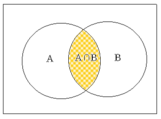{.imgFig400300}

::: figText
\<Figure 5.2.2\> Intersection events A ∩ B
:::

The event that a student takes either Economics or Political Science
(one or both) is denoted as A ∪ B and is called an union event of A and
B (\<Figure 5.2.3\>).

{.imgFig400300}

::: figText
\<Figure 5.2.3\> Union Event A ∪ B
:::

Probabilities of these events on this example are as follows:

::: textL40
P(A) = 25 / 40\
P(B) = 30 / 40\
P(A ∩ B) = 20 / 40\
P(A ∪ B) = 35 / 40\
:::

The probability of P(A ∪ B) can also be calculated as follows if you
look at the \<Figure 5.2.1\>.

::: textL40
P(A ∪ B) = P(A) ＋ P(B) － P(A ∪ B) = 25/40 ＋ 30/40 － 20/40 = 35/40
:::

That is, the probability of taking either Economics or Political
Science, P(A ∪ B), can be calculated by adding the probability of taking
each course and then by subtracting the probability of taking both
courses.
:::

::: mainTable
The rule discussed on \[Example 5.2.3\] is called the addition rule of
probability.
:::

::: mainTableYellow
**Addition Rule of Probability**

$$\ P(A ∪ B) = P(A) + P(B) - P(A ∩ B) $$

If A ∩ B = ∅, then the rule becomes as follows:

$$ P(A ∪ B) = P(A) + P(B)$$

In this case, the events A and B are called **mutually exclusive
events**.
:::

::: mainTableGrey
**Example 5.2.4** In \[Example 5.2.3\], if there are 10 students taking
Economics, 20 students taking Political Science, and if there are no
students taking both courses, what is the probability of a student is
taking either Economics or Political Science?

**Answer**

In this case, because there are no students taking both courses, the
events in which they take Economics (A) and Political Science (B) are
mutually exclusive. Thus, the probability to take either Economics or
Political Science, P(A U B), is as follows:

::: textL40
P(A U B) = P(A) + P(B) = 10/40 + 20/40 = 0.75
:::
:::

Let us consider the example below to find out the multiplication rule of
probability.

::: mainTableGrey
**Example 5.2.5** Students of ADA University come from either Baku or a
province. Among the 30 sophomores in the Department of Economics, there
are 10 males and 20 females, one of males and five of females are from
the province.

::: textL20M20
1\) When selecting a student, what is the probability that he is from
the province?
:::

::: textL20M20
2\) When I selected a student, she was a female. What is the probability
that this student is from the province?
:::

::: textL20M20
3\) When I selected a student, he was from the province. What is the
probability of this student being a male?
:::

::: textL20M20
4\) When selecting a student, what is the probability that he is a male
and from Baku?
:::

**Answer**

To solve this problem, it is convenient to organize the information
given into a cross table as shown below.

Baku

Province

Total
:::
:::

Male

1

10

Female

5

20

Total

10

20

30

If we calculate and insert the blanks on the above table, it is as
follows. Let us call the event of male as M, the female as F, from Baku
as B, from the province as C.

Baku(B)

Province(C)

Total

Male(M)

9

1

10

Female)F

15

5

20

Total

10

20

30

1\) $\small P(C) =$ 6/30.

2\) The probability that this student is from the province among females
is 5/20. This probability is denoted as $\small P(C∣F)$ and is called a
conditional probability.

3\) The probability of a male from the province is $\small P(M∣C) =$
1/6.

4\) The probability is $\small P(M ∩ B)$ and the cross table shows that
the answer is 9/30. Alternatively, the probability of being a male among
all students can be first obtained as $\small P(M) =$ (10/30) and then
multiplied by the conditional probability of being from Baku among
males, $\small P(B∣M)$ = 9/10. Namely

$\qquad \small  P(M ∩ B) = P(M) P(B∣M) = (10/30) \times (9/10) = 9/30$

This expression shows that the conditional probability $\small P(B∣M)$
can be calculated by dividing $\small P(M ∩ B)$ by $\small P(M)$.

$\qquad \small  P(B ∣ M) = \frac {P(M ∩ B)} {P(M)} = \frac { 9/30} {10/30} = \frac {9} {10}$

In addition, the probability $\small P(M ∩ B)$ can be obtained first by
the probability of being a student from Baku, $\small P(B) =$ 24/30, and
then multiplied by the probability of being a male from Baku
($\small P(M∣B) =$ 9/24).

$\qquad \small  P(M ∩ B) = P(B) P(M∣B) = (24/30) × (9/24)$

Conditional probability is generally defined as follows.

::: mainTableYellow
**Conditional Probability**

$$ \small
        P(A ∣ B) = \frac {P(A ∩ B)} {P(B)}  \qquad \qquad  \textrm{if} \quad P(B) ≠ 0       
      $$

<input class="qrBtn" onclick="window.open(addrStr[130])" src="QR/eStatU_40MultiplicationRule.svg" type="image"/>

:::

In the above example, the probability of an intersection event is
expressed by multiplying the probabilities of other events and it is
called the **multiplication rule of probability**.

::: mainTableYellow
**Multiplication Rule of Probability**

$$ \small
        P(A ∩ B) = P(A) P(B∣A)       
      $$ If $\small P(B∣A) = P(B)$, then the rule becomes as follows:
$$ \small
        P(A ∩ B) = P(A) P(B)                               
      $$ In this case, the events $\small A$ and $\small B$ are called
**independent events**.
:::

::: mainTableGrey
**Example 5.2.6** Tiger team of professional baseball has the
probability of 0.7 to beat Lion team recently. What is the probability
that Tiger is winning both games in this evening's double match? Assume
that winning one game does not affect winning the next.

**Answer**

Let us call the event that the Tiger wins the first game is $\small A$
and the event that the Tiger wins the second game is $\small B$. Since A
and B are independent of each other, the probability that the Tiger is
winning both games is as follows.

$\qquad \small  P(A ∩ B) = P(A) P(B) = 0.7 × 0.7 = 0.49$
:::

::: mainTableGrey
**Example 5.2.7** The following is a table of 30 second-year students by
gender and region of origin. Are the events of male and Baku origin
independent of each other?

Baku(B)

Province(C)

Total
:::

Male(M)

5

5

10

Female)F

10

10

20

Total

15

15

30

**Answer**

Let us call the event of male as $\small M$, female as $\small F$, from
Baku as $\small B$, and from province as $\small C$. From the table,
probabilities of $\small P(M ∩ B)$, $\small P(M)$ and $\small P(B)$ are
as follows:

$\qquad \small  P(M ∩ B) = 5/30 \\  P(M) = 10/30 \\  P(B) = 15/30$

Therefore, the following relationship is satisfied:

$\qquad \small  P(M ∩ B) = P(M) P(B)$

The events of male and Baku origin are independent of each other. Note
that

$\qquad \small  P(M∣B) = 5/15 = 1/3 \\  P(M)=10/30 \\  \text{so,} P(M∣B) = P(M).$

In this case, all events of both $\small M$ and $\small C$ , $\small F$
and $\small B$ , $\small F$ and $\small C$ are independent of each
other. We call the two attributes, gender and region are independent of
each other. In \[Example 5.2.5\], gender and region are not independent
of each other.

The following is an example of how to calculate the probability of a
complementary event.

::: mainTableGrey
**Example 5.2.8** There is a box of six products, two of which are
defective. What is the probability that at least one defective product
will be found when three have been extracted for product testing? Assume
that the product is extracted once for inspection without replacement.

**Answer**

The probability of finding one defective in the three product tests is
as follows.

$\qquad \small  \frac { _4 C_2 \times _2 C_1 } {_6 C_3 } = \frac {3}{5}.$

The probability of finding two defective products is as follows.

$\qquad \small  \frac { _4 C_1 \times _2 C_2 } {_6 C_3 } = \frac {1}{5}.$

Thus, the probability that at least one defect will be found is 3/5 +
1/5 = 4/5. Another way to calculate this probability is to obtain the
probability of an event in which there will be no defect (this is called
a complementary event) and then, subtract it from 1. In other words, the
probability that at least one defective product can be calculated as
follows.

$\qquad \small  1 - \frac { _4 C_3 } {_6 C_3 } = 1 - \frac {4}{20} = \frac {4}{5}.$
:::

::: mainTable
The method used in the above example is called a rule of probability
calculation using a complementary event, and is often used to obtain the
probability that the word \'at least\' is contained. \<Figure 5.2.4\> is
a picture of an event.

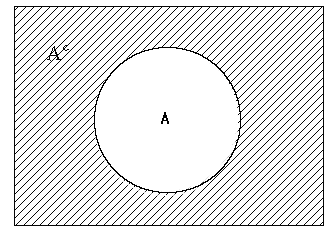{.imgFig400300}

::: figText
\<Figure 5.2.4\> Complementary event
:::
:::

::: mainTableYellow
**Probability of a complementary event**

if $\small A^C$ denotes a complementary event of the event $\small A$,
then $\small P(A^C )$ can be calculated as follows. $$ \small
        P(A^C) = 1 - P(A)   
      $$
:::

::: mainTablePink
### Multiple Choice Exercise

\*\*\* Choose one answer and click \[Submit\] button

::: textL30M30
5.1 When two events A and B are mutually exclusive, what is the
probability of an event A∪B?
:::

<form name="Q1">
<label><input name="item" type="radio" value="1"/> P(A)－P(B)</label> 
<label><input name="item" type="radio" value="2"/> P(A)P(B)</label> 
<label><input name="item" type="radio" value="3"/> P(A)＋P(B)</label> 
<label><input name="item" type="radio" value="4"/> P(A)/P(B)</label> 

<input onclick="radio(5,1,Q1)" type="button" value="Submit"/>    
    <input id="ansQ1" size="15" type="text"/>

</form>

::: textL30M30
5.2 Let the probability that event A will occur be P(A) and the
probability that event B will occur be P(B). Which of the following is
wrong?
:::

<form name="Q2">
<label><input name="item" type="radio" value="1"/> 0 ≤ P(A) ≤ 1</label> 
<label><input name="item" type="radio" value="2"/> -1 ≤ P(B) ≤ 0 </label> 
<label><input name="item" type="radio" value="3"/> P(A∪B)=P(A)+P(B)-P(A∩B)</label> 
<label><input name="item" type="radio" value="4"/> P(A∩B)=P(A)․P(B) </label> 

<input onclick="radio(5,2,Q2)" type="button" value="Submit"/>    
    <input id="ansQ2" size="15" type="text"/>

</form>

::: textL30M30
5.3 The value of P(A)=0.4, P(B)=0.2, P(A\|B)=0.6. What is the
probability of P(A∩B)?
:::

<form name="Q3">
<label><input name="item" type="radio" value="1"/> 0.08</label> 
<label><input name="item" type="radio" value="2"/> 0.12</label> 
<label><input name="item" type="radio" value="3"/> 0.24</label> 
<label><input name="item" type="radio" value="4"/> 0.48</label> 

<input onclick="radio(5,3,Q3)" type="button" value="Submit"/>    
    <input id="ansQ3" size="15" type="text"/>

</form>

::: textL30M30
5.4 If A ⊂ B, what is the comparison between the conditional probability
P(A\|B) and P(A)?
:::

<form name="Q4">
<label><input name="item" type="radio" value="1"/> equal or greater</label> 
<label><input name="item" type="radio" value="2"/> smaller</label> 
<label><input name="item" type="radio" value="3"/> equal or smaller</label> 
<label><input name="item" type="radio" value="4"/> There is no comparison</label> 

<input onclick="radio(5,4,Q4)" type="button" value="Submit"/>    
    <input id="ansQ4" size="15" type="text"/>

</form>

::: textL30M30
5.5 How likely are 2 and 5 to appear at the same time when throwing 2
dice?
:::

<form name="Q5">
<label><input name="item" type="radio" value="1"/> 1/3</label> 
<label><input name="item" type="radio" value="2"/> 1/6</label> 
<label><input name="item" type="radio" value="3"/> 1/12</label> 
<label><input name="item" type="radio" value="4"/> 1/18</label> 

<input onclick="radio(5,5,Q5)" type="button" value="Submit"/>    
    <input id="ansQ5" size="15" type="text"/>

</form>

::: textL30M30
5.6 When throwing a dice three times, what is the probability that the
number of eyes is 5 at the first throw, 3 at the second, and an even
number of eyes at the third?
:::

<form name="Q6">
<label><input name="item" type="radio" value="1"/> 1/30</label> 
<label><input name="item" type="radio" value="2"/> 1/72</label> 
<label><input name="item" type="radio" value="3"/> 1/108</label> 
<label><input name="item" type="radio" value="4"/> 1/276</label> 

<input onclick="radio(5,6,Q6)" type="button" value="Submit"/>    
    <input id="ansQ6" size="15" type="text"/>

</form>

::: textL30M30
5.7 When you extract three light bulbs randomly without replacement one
by one from a barrel containing five good bulbs and two defective bulbs,
what is the probability that one bulb is a defective item?
:::

<form name="Q7">
<label><input name="item" type="radio" value="1"/> 1/7</label> 
<label><input name="item" type="radio" value="2"/> 2/7</label> 
<label><input name="item" type="radio" value="3"/> 3/7.</label> 
<label><input name="item" type="radio" value="4"/> 4/7</label> 

<input onclick="radio(5,7,Q7)" type="button" value="Submit"/>    
    <input id="ansQ7" size="15" type="text"/>

</form>

::: textL30M30
5.8 When P(B)=0.2, P(A∩B)= 0.12, what is the value of P(A\|B)?
:::

<form name="Q8">
<label><input name="item" type="radio" value="1"/> 0.20</label> 
<label><input name="item" type="radio" value="2"/> 0.60</label> 
<label><input name="item" type="radio" value="3"/> 0.12</label> 
<label><input name="item" type="radio" value="4"/> 0.24</label> 

<input onclick="radio(5,8,Q8)" type="button" value="Submit"/>    
    <input id="ansQ8" size="15" type="text"/>

</form>

::: textL30M30
5.9 When P(A)=0.4, P(B)=0.2, P(A\|B)=0.6, what is the value of P(B\|A)?
:::

<form name="Q9">
<label><input name="item" type="radio" value="1"/> 0.08</label> 
<label><input name="item" type="radio" value="2"/> 0.24</label> 
<label><input name="item" type="radio" value="3"/> 0.30</label> 
<label><input name="item" type="radio" value="4"/> 0.40</label> 

<input onclick="radio(5,9,Q9)" type="button" value="Submit"/>    
    <input id="ansQ9" size="15" type="text"/>

</form>

::: textL30M30
5.10 Mark the result of throwing two dice as ( $x_1 , x_2$ ) and let
$B = \{ (x_{1} ,x_{2} ) | x_{1} > x_{2} \}$ . What is the value of P(B)?
:::

<form name="Q10">
<label><input name="item" type="radio" value="1"/> 1/3</label> 
<label><input name="item" type="radio" value="2"/> 1/12</label> 
<label><input name="item" type="radio" value="3"/> 5/12</label> 
<label><input name="item" type="radio" value="4"/> 1/36</label> 

<input onclick="radio(5,10,Q10)" type="button" value="Submit"/>    
    <input id="ansQ10" size="15" type="text"/>

</form>

::: textL30M30
5.11 Mark the result of throwing two dice as ( $x_1 , x_2$ ) and let
$A = \{ (x_{1} ,x_{2} ) | x_{1} + x_{2} =10 \}$,
$B = \{ (x _{1} ,x _{2} ) | x _{1} > x _{2} \}$. What is the value of
P(B\|A)?
:::

<form name="Q11">
<label><input name="item" type="radio" value="1"/> 1/3</label> 
<label><input name="item" type="radio" value="2"/> 1/12</label> 
<label><input name="item" type="radio" value="3"/> 5/12</label> 
<label><input name="item" type="radio" value="4"/> 1/2</label> 

<input onclick="radio(5,11,Q11)" type="button" value="Submit"/>    
    <input id="ansQ11" size="15" type="text"/>

</form>

:::

             
::: container-fluid
:::

::: {.col-sm-9 .col-sm-offset-3 .col-md-10 .col-md-offset-2 .main}

             

## 5.3 Discrete Random Variable

::: presentation-video-link
[presentation](0503.pdf){.presentation-link target="_blank"}   
[video](https://youtu.be/DDISKMo7Iho){.video-link target="_blank"}
:::

::: mainTable
In case of statistical experiments which are frequently observed around
us, there are many similar probability calculations. For example, the
problem of tossing coins several times to see how many times the head
comes out is similar to counting how many defective products are made
from a product line. This problem is also similar to counting the number
of voters who support a particular candidate for the president. In this
section, the probability calculations as the previous examples, in
general the discrete sample spaces are discussed.

Consider a statistical experiment in which a coin is thrown repeatedly
two times. If the coin is ideal, the sample space for this experiment is
{\'Tail-Tail\', \'Tail-Head\', \'Head-Tail\', \'Head-Head'}. The
probability of an event in which each element of the sample space is
produced is 1/4 by the classical definition. In most cases, the fact
that we are interested in this example will be counting the number of
heads or tails. If $\small X$ is defined as \'the number of heads\' in
this experiment, the possible value of $\small X$ can be 0, 1, or 2 and
we are interested in calculating probabilities that $\small X$=0,
$\small X$=1 or $\small X$=2. As such, a function that corresponds to
one real number between \[0,1\] for each element of the sample space is
called a random variable (see Table 5.3.1).
:::

Table 5.3.1 Random variable $\small X$ = \'Number of Heads' when tossing
a coin twice\'

  -----------------------------------------------------------------------
  Sample space                        $\small X$ = \'Number of Heads'
  ----------------------------------- -----------------------------------
  Tail-Tail\                          0\
  Tail-Head\                          1\
  Head-Tail\                          1\
  Head-Head                           2

  -----------------------------------------------------------------------

::: mainTable
When possible values of a random variable are finite or countably
infinite, it is called a discrete random variable. If possible values of
a random variable are uncountably infinite, it is called a continuous
random variable and discussed in more detail in Section 5.4.
:::

::: mainTableYellow
**Random Variable**

**Random variable** is a function from the sample space to a real number
in \[0, 1\].

When possible values of a random variable are finite or countably
infinite, it is called a **discrete random variable**. If possible
values of a random variable are uncountably infinite, it is called a
**continuous random variable**.
:::

::: mainTable
The probability that the random variable $\small X$ defined as in Table
5.3.1 will be zero, denoted as $\small P(X=0)$, is 1/4, because it is
the probability of an event {Tail-Tail}. The probability that $\small X$
being 1, $\small P(X=1)$, is 2/4, because, P({Tail-Head, Head-Tail}) is
2/4. Also, the probability that $\small X$ being 2, $\small P(X=2)$, is
1/4 because P({Head-Head}) is 1/4. The probabilities for each value of
the random variable $\small X$ can be summarized as shown in Table
5.3.2, and it is called a probability distribution function of
$\small X$ usually denoted as f(x). \<Figure 5.3.1\> is a graph of f(x).
:::

Table 5.3.2 Probability distribution function of $\small X$ = \'Number
of Heads' when tossing a coin twice\'

+-----------------------------------+-----------------------------------+
| 1\) Table style of the            | 2\) Function style of the         |
| probability distribution function | probability distribution function |
+===================================+===================================+
|   -----                           | $$ \small                         |
| ----------- --------------------- |               \begin{align}       |
|   $\s                             |                 f(x) &            |
| mall X = x$   $\small P(X \le x)$ | = 1/4, \qquad \text{if } x = 0 \\ |
|                                   |                      &            |
|   0\               1/4\           | = 2/4, \qquad \text{if } x = 1 \\ |
|   1\               2/4\           |                      &            |
|   2                1/4            | = 1/4, \qquad \text{if } x = 2 \\ |
|   -----                           |               \end{align}         |
| ----------- --------------------- |             $$                    |
+-----------------------------------+-----------------------------------+

{.imgFig400300}

::: figText
\<Figure 5.3.1\> Probability distribution function of the random
variable $\small X$ = \'Number of Heads' when tossing a coin twice\'
:::

::: mainTable
The cumulative probability of $\small P(X \le x)$ as the value of random
variable $\small X$ increases is referred to as a cumulative
distribution function and denoted as F(x). In the previous example, the
cumulative distribution function of the random variable $\small X$ =
\'Number of Heads' when tossing a coin twice\' is shown as in Table
5.3.3.
:::

Table 5.3.3 Cumulative distribution function of the random variable
$\small X$ = \'Number of Heads' when tossing a coin twice\'

1\) Table style of the cumulative distribution function

2\) Function style of the cumulative distribution function
:::

  ----------------------------------- -----------------------------------
  $\small X = x$                      $\small P(X \le x)$

  0\                                  1/4\
  1\                                  3/4\
  2                                   4/4=1
  ----------------------------------- -----------------------------------

$$ 
              \begin{align}
                F(x) &= 0,   \qquad\quad \text{if } x < 0 \\
                     &= 1/4, \qquad \text{if } 0 \le x < 1 \\
                     &= 3/4, \qquad \text{if } 1 \le x < 2 \\
                     &= 1,   \qquad\quad \text{if } 2 \le x
              \end{align}
            $$

{.imgFig400300}

::: figText
\<Figure 5.3.2\> Cumulative distribution function of the random variable
$\small X$ = \'Number of Heads' when tossing a coin twice\'
:::

::: mainTableYellow
**Probability Distribution Function**

If probability for each value of the random variable $X$ is summarized
as a function, it is called a **probability distribution function** of
$X$ and usually denoted as f(x).

The cumulative probability of $P(X \le x)$ as the value of random
variable $X$ increases is referred to as a **cumulative distribution
function** and denoted as F(x).
:::

::: mainTableGrey
**Example 5.3.1** There are 200 families living in a village. The number
of visits to hospitals by each household over the past year is as
follows. Obtain the probability distribution function and the cumulative
distribution function of the random variable $\small X$ = \'hospital
visit count\'.

  ---------------- ---- ---- ---- ---- ---
  Hospital visit   0    1    2    3    4
  Houshold         74   80   30   10   6
  ---------------- ---- ---- ---- ---- ---

**Answer**

1\) Probability distribution function

$\small X = x$

$\small P(X = x)$
:::

0\
1\
2\
3\
4

0.37\
0.40\
0.15\
0.05\
0.03

Total

1.00

2\) Cumulative distribution function

$\small X = x$

$\small P(X \le x)$

0\
1\
2\
3\
4

0.37\
0.77\
0.92\
0.97\
1.00

::: mainTable
If possible values of a discrete random variable $\small X$ are
$x_1 , x_2 , ... , x_n$, a mean and variance of $\small X$ are also used
as measures of the central tendency and dispersion. The mean of
$\small X$ called an expectation of $\small X$, denoted $E(X)$ or \\mu,
and the variance of $\small X$, denoted as $\small V(X)$ or $\sigma_X^2$
, are defined as follows: The standard deviation of $\small X$, denoted
σ , is the square root of the variance $\small X$.
:::

::: mainTableYellow
**Expectation and Variance of $X$**

$$ 
        \begin{align}
         E(X) &= \mu  = \sum _{i=1} ^{n} x_{i} P(\textrm{X}= x_{i} ) \\
         V(X) &= \sigma^2 = \sum_{i=1} ^{n} ( x_i - \mu )^2  P(\textrm{X}= x_i ) =  \sum_{i=1}^{n} x_i  ^2 P(\textrm{X}= x_i ) - \mu^2 
        \end{align}
      $$
:::

::: mainTableGrey
**Example 5.3.2** Find the expected value and variance of the random
variable $\small X$ = \'Number of Heads' when tossing a coin twice\'
which described in Table 5.3.2.

**Answer**

Expectation and variance of $\small X$ are as follows:

$$ \small
        \begin{align}
          E(X) &= \mu = \sum_{i=1}^{n} x_{i} \text{P(X } = x_{i} ) = 0 \times \frac{1}{4} + 1 \times \frac{2}{4} + 2 \times \frac{1}{4} = 1 \\
          V(X) &= \sigma^2 = \sum_{i=1}^{n} x_{i}^{2} \textrm{ P(X} = x_{i} )- \mu^{2} = 0^{2} \times \frac{1}{4} + 1^{2} \times \frac{2}{4} + 2^{2} \times \frac{1}{4} - 1^{2} = \frac{1}{2}
        \end{align}
      $$
:::

::: mainTable
When knowing the expected value $E(X)$ and variance $\small V(X)$ of a
random variable $\small X$, it is often necessary to obtain the expected
value and variance of $aX + b$ where $a$ and $b$ are constants. The
expected value and variance of the new random variable $aX + b$ are as
follows: This formula applies equally to a continuous random variable.
:::

::: mainTableYellow
**Expectation and variance of $a X + b$ where $a,b$ are constant.**

$$ 
        \begin{align}
        E(aX + b) &= a E(X) + b \\
        V(aX + b) &= a^2 V(X)
        \end{align}
      $$
:::

::: mainTableGrey
**Example 5.3.3** The mean of midterm exam scores in a Statistics course
was 60 points and the variance was 100. In order to adjust the scores,
professor is thinking of following alternatives. Find the mean and
variance of each alternative.

::: textL20M20
1\) Add 20 points to each student\'s score.
:::

::: textL20M20
2\) Each student\'s score is multiplied by 1.4.
:::

::: textL20M20
3\) Multiply each student\'s score by 1.2 and add 10 points.
:::

**Answer**

The random variable $\small X$ is the mid-term score and its mean and
variance are $\small E(X)$ = 60 and $\small V(X)$ = 100.

1\) The mean and variance of the new random variable $\small X$ + 20 are
as follows.

$\qquad \small E(X ＋ 20) = E(X) ＋ 20 = 60 ＋ 20$
$\qquad \small V(X ＋ 20) = V(X) = 100$

::: textL20
In other words, if you add 20 points to each score, the mean is
increased 20 points but there is no change on the variance.
:::

2\) The mean and variance of the new random variable 1.4$\small X$ are
as follows.

$\qquad \small E(1.4X) = 1.4 E(X) = 1.4 × 60 = 84$
$\qquad \small V(1.4X) = 1.4^2 V(X) = 1.96 × 100 = 196$

::: textL20
In other words, if you multiply 1.4 to each score, the mean is increased
1.4 times and the variance is increased $\small 1.4^2$= 1.96 times.
:::

3\) The mean and variance of the new random variable 1.2X + 10 are as
follows:

$\qquad \small E(1.2X ＋ 10) = 1.2 E(X) ＋ 10 = 1.2 × 60 ＋ 10 = 82$
$\qquad \small V(1.2X ＋ 10) = 1.2^2 V(X) = 1.44 × 100 = 144$

::: textL20
In other words, adding 10 points after multiplying by 1.2 increases the
mean by 1.2 times and the variance by $\small 1.2^2$= 1.44 times. Note
that adding scores will change the mean, but not the variance.
:::
:::

::: mainTable
Let the mean of random variable $\small X$ be \\mu and the standard
deviation σ. Then $Z = \frac{X-\mu}{\sigma}$ is a new random variable
with the mean of 0 and the variance of 1. This new random variable is
referred to as a **standardized random variable**.
:::

::: mainTableYellow
**Standardized random variable**

If the mean of a random variable $X$ is \\mu, and the standard deviation
is σ, then $Z = \frac{X-\mu}{\sigma}$ is a new random variable with the
mean of 0 and the variance of 1. This new random variable is referred to
as a **standardized random variable**.
:::

::: mainTable
Let us discuss about binomial, Poisson, geometrical, and
hyper-geometrical distributions which are used widely as discrete
probability distributions.
:::

::: mainTablePink
### Multiple Choice Exercise

\*\*\* Choose one answer and click \[Submit\] button

::: textL30M30
5.12 What is the standard deviation when we multiply five times each of
the values of one random variable?
:::

<form name="Q12">
<label><input name="item" type="radio" value="1"/> It is five times as much.</label> 
<label><input name="item" type="radio" value="2"/> It is one-fifth the size.    </label> 
<label><input name="item" type="radio" value="3"/> It is ten times as much. </label> 
<label><input name="item" type="radio" value="4"/> Four-tenths the size. </label> 

<input onclick="radio(5,12,Q12)" type="button" value="Submit"/>    
      <input id="ansQ12" size="15" type="text"/>

</form>

::: textL30M30
5.13 In a class, the average of mid-term scores was 24 points and its
standard deviation was 3. Because of poor grades, professor doubled the
mid-term scores and then add 10 points for all the students in the
class. What is the average and standard deviation of new scores?
:::

<form name="Q13">
<label><input name="item" type="radio" value="1"/> 24, 3</label> 
<label><input name="item" type="radio" value="2"/> 48, 3</label> 
<label><input name="item" type="radio" value="3"/> 48, 6</label> 
<label><input name="item" type="radio" value="4"/> 58, 6</label> 

<input onclick="radio(5,13,Q13)" type="button" value="Submit"/>    
      <input id="ansQ13" size="15" type="text"/>

</form>

::: textL30M30
5.14 If the mean of a random variable $\small X$ is 20, what is the mean
of $Y=2X+3$?
:::

<form name="Q14">
<label><input name="item" type="radio" value="1"/> 20</label> 
<label><input name="item" type="radio" value="2"/> 40</label> 
<label><input name="item" type="radio" value="3"/> 23</label> 
<label><input name="item" type="radio" value="4"/> 43</label> 

<input onclick="radio(5,14,Q14)" type="button" value="Submit"/>    
      <input id="ansQ14" size="15" type="text"/>

</form>

::: textL30M30
5.15 If the variance of a random variable $\small X$ is 2, what is the
variance of $Y=2X+1$?
:::

<form name="Q15">
<label><input name="item" type="radio" value="1"/> 2</label> 
<label><input name="item" type="radio" value="2"/> 3</label> 
<label><input name="item" type="radio" value="3"/> 8</label> 
<label><input name="item" type="radio" value="4"/> 18</label> 

<input onclick="radio(5,15,Q15)" type="button" value="Submit"/>    
      <input id="ansQ15" size="15" type="text"/>

</form>

::: textL30M30
5.16 Which of the following is wrong?
:::

<form name="Q16">
<label><input name="item" type="radio" value="1"/> \(\small E(aX＋b) = aE(X)＋b\)</label> 
<label><input name="item" type="radio" value="2"/> \(\small E(X＋Y) = E(X)＋E(Y)\)</label> 
<label><input name="item" type="radio" value="3"/> \(V(aX＋b) =  a^2 V(X)\)</label> 
<label><input name="item" type="radio" value="4"/> \(V(aX＋b) =  a^2 V(X)+b\)</label> 

<input onclick="radio(5,16,Q16)" type="button" value="Submit"/>    
      <input id="ansQ16" size="15" type="text"/>

</form>

::: textL30M30
5.17 If the expected value of $\small X$ is $\small E(X)=5$ and
$\small E(X^2)$=25, and what is the variance $\small V(X)$?
:::

<form name="Q17">
<label><input name="item" type="radio" value="1"/> -5</label> 
<label><input name="item" type="radio" value="2"/> 0</label> 
<label><input name="item" type="radio" value="3"/> 5</label> 
<label><input name="item" type="radio" value="4"/> 25</label> 

<input onclick="radio(5,17,Q17)" type="button" value="Submit"/>    
      <input id="ansQ17" size="15" type="text"/>

</form>

:::

             
::: container-fluid
:::

::: {.col-sm-9 .col-sm-offset-3 .col-md-10 .col-md-offset-2 .main}

             

### 5.3.1 Binomial Distribution

::: presentation-video-link
[presentation](050301.pdf){.presentation-link target="_blank"}   
[video](https://youtu.be/HtpDnuM12ys){.video-link target="_blank"}
:::

::: mainTable
Examples that are similar to experiments which examine how many times
the head comes out by tossing coins are observed around us. Let us take
a look at following examples.
:::

::: textL30M10
\- Products produced in a factory machine are inspected and classified
as either defective or normal.
:::

::: textL30M10
\- In an election survey, ask voters whether he would vote for a
candidate (pro) or not (con).
:::

::: mainTable
In these examples there are two possible outcomes such as {defective,
normal} and {pro, con} in each experiment and this experiment is
repeated, but we do not know what the outcome of each experiment. Each
experiment which has two possible outcomes is specifically called a
Bernoulli trial, and one outcome of interest in the two is often
referred to as \'success\' and the other outcome as \'failure\'. This
Bernoulli trial is usually repeated several times and the number of
'success' is counted as following.
:::

::: textL30M10
\- Throw a coin five times and examine the number of heads.
:::

::: textL30M10
\- Inspect 100 products produced in a factory and count the number of
defective products.
:::

::: textL30M10
\- Count the number of voters in favor of a particular candidate for the
president among 50 eligible voters.
:::

::: mainTable
Counting the number of success on repeated Bernoulli trials can be
simulated using the module of 'Binomial Experiment' in 『eStatU』. In
this module, a ball is dropped from the top and if it hits a blue box,
it has one-half chance to fall to the left (get zero point) or right
(get one point). The dropped ball again falls to the left and right with
a 1/2 chance such as \<Figure 5.3.3\>. The same experiment is repeated
100 times (drop 100 balls), and we examine the number of balls which got
points 0, 1, and 2. It is similar to tossing a coin two times and
counting the number of heads.
:::

<input class="qrBtn" onclick="window.open(addrStr[81])" src="QR/eStatU410_BinomialSim.svg" type="image"/>

{.imgFig600540}

::: figText
\<Figure 5.3.3\> Simulation of Binomial distribution
:::

::: mainTable
The \'counting of success\' when performing the independently repeated
Bernoulli trial with the same probability of success is called a binary
random variable, and its distribution is called a binomial distribution.
The probability calculation of the binomial distribution will be found
by the example below.
:::

::: mainTableGrey
**Example 5.3.4** Four more games will be played by the Tiger baseball
team this season. If the Tiger team has a 60% chance of winning every
game, what is the probability of the followings.

::: textL20M20
1\) losing all of them?
:::

::: textL20M20
2\) winning only once?
:::

::: textL20M20
3\) winning twice?
:::

::: textL20M20
4\) winning three times?
:::

::: textL20M20
5\) winning all four times?
:::

::: textL20M20
6\) Find the probability distribution function of the random variable
$\small X$ = 'the number of games the tiger wins'.
:::

**Answer**

This problem is the enforcement of Bernoulli trial in each game of
\'win\' and \'fail\'. This Bernoulli trial is repeated four times. The
sample space is all about winning or losing game and there are elements
shown as follows by marking the winning in O and the losing in X.

S = {'XXXX', 'OXXX', 'XOXX', 'XXOX', 'XXXO', 'OOXX', 'OXOX', 'OXXO',
'XOOX', 'XOXO', 'XXOO', 'OOOX', 'OOXO', 'OXOO', 'XOOO', 'OOOO'}

1\) The event that the Tiger will loose all games is {\'XXXX\'} and the
probability of this event is (0.4)×(0.4)×(0.4)×(0.4) = $\small (0.4)^4$.

2\) There are four events that the Tiger is winning once and losing
three times such as {'OXXX', 'XOXX', 'XXOX', 'XXXO'}. These four cases
are equal to the number of O\'s in a single seat when there are four
seats which is $\small{}_4C_1$. Since the probability of each event is
(0.6)×(0.4)×(0.4)×(0.4), the probability of the Tiger winning once is
$\small{}_4C_1 (0.6)(0.4)^3$.

3\) There are six events that the Tiger is winning two times and losing
two times such as {'OOXX', 'OXOX', 'OXXO', 'XOOX', 'XOXO', 'XXOO'}.
These six cases are equal to the number of O\'s in two seats when there
are four seats which is $\small{}_4C_2$. Since the probability of each
event is (0.6)×(0.6)×(0.4)×(0.4), the probability of the Tiger winning
twice is $\small{}_4C_2 (0.6)^2(0.4)^2$.

4\) There are four events that the Tiger is winning three times and
losing one time such as {'OOOX', 'OOXO', 'OXOO', 'XOOO'}. These four
cases are equal to the number of O\'s in three seats when there are four
seats which is $\small{}_4C_3$. Since the probability of each event is
(0.6)×(0.6)×(0.6)×(0.4), the probability of the Tiger winning three
times is $\small{}_4C_3 (0.6)^3(0.4)^1$.

5\) There is one event that the Tiger is winning four times such as
{'OOOO'}. This one case is equal to the number of O\'s in four seats
when there are four seats which is $\small{}_4C_4$. Since the
probability of each event is (0.6)×(0.6)×(0.6)×(0.6), the probability of
the Tiger winning all four times is $\small{}_4C_4 (0.6)^4$.

6\) The probability distribution function of the random variable X =
'the number of games the Tiger wins' is a summary of the above
probabilities.

$\small X = x$

$\small P(X=x)$
:::
:::

0

$\small {}_{4}C_0 (0.4)^4 = 0.0256$

1

$\small {}_{4}C_1 (0.6) (0.4)^3 = 0.1536$

2

$\small {}_{4}C_2 (0.6)^2 (0.4)^2 = 0.3456$

3

$\small {}_{4}C_3 (0.6)^3 (0.4) = 0.3456$

4

$\small {}_{4}C_4 (0.6)^4 = 0.1296$

::: mainTableGrey
**Example 5.3.5** By using 『eStatU』, find the probability and the
probability distribution function of \[Example 5.3.4\].

**Answer**

Select 'Binomial Distribution' from the menu of 『eStatU』 and enter
$\small n = 4, p = 0.6$ and press the \[Execute\] button to display a
binomial function graph as shown in \<Figure 5.3.4\>. Table 5.3.4 shows
the table when you click the \[Binomial Prob Table\] button. This table
makes it easy to obtain Binomial distribution probabilities from
\[Example 5.3.4\].

<input class="qrBtn" onclick="window.open(addrStr[82])" src="QR/eStatU420_Binomial.svg" type="image"/>

{.imgFig600540}

::: figText
\<Figure 5.3.4\> 『eStatU』 Binomial distribution graph when
$\small n = 4, p = 0.6$
:::

Table 5.3.4 『eStatU』 Binomial distribution table when
$\small n = 4, p = 0.6$

  $n = 4$   $p = 0.600$                               
  --------- ------------------- --------------------- ---------------------
  $x$       $\small P(X = x)$   $\small P(X \le x)$   $\small P(X \ge x)$
  0         0.0256              0.0256                1.0000
  1         0.1536              0.1792                0.9744
  2         0.3456              0.5248                0.8208
  3         0.3456              0.8704                0.4752
  4         0.1296              1.0000                0.1296
:::

::: mainTable
In general, the probability of 'success' when a Bernoulli trial is
repeated n times, i.e., the probability of the binomial distribution, is
as the following definition.
:::

::: mainTableYellow
**Binomial Distribution**

If the probability of success is $p$ in a Bernoulli trial and the trial
is repeated $n$ times independently, the probability distribution
function that the random variable $X$ = the number of success' is $x$ is
as follows: It is called a **binomial distribution** and denoted as
$B(n,p)$. $$ 
        f(x) = {}_n C_x  p^x (1-p)^{n-x} , \qquad  x = 0,1,2, ... , n
      $$ The expectation and variance of the binomial distribution are
as follows. $$ 
        E(X) = np, V(X) = np(1-p)
      $$
:::

::: mainTable
In the binomial distribution function, $n$ (number of trials) and $p$
(success probability) are called parameters. \<Figure 5.3.5\> shows a
binomial distribution of different $n$ and $p$.
:::

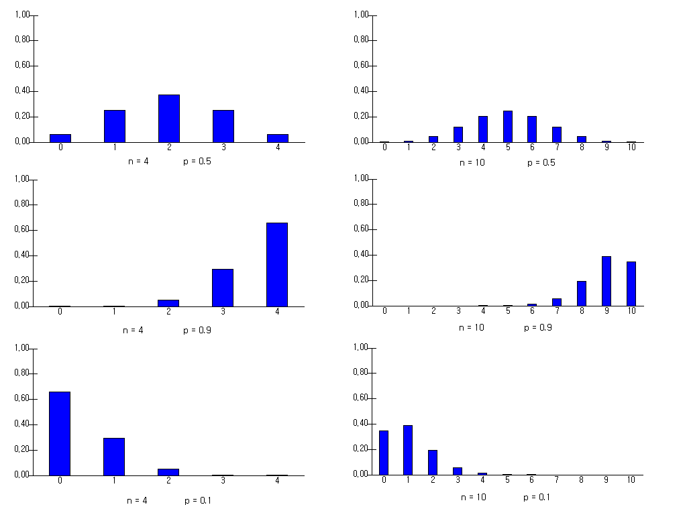{.imgFig600540}

::: figText
\<Figure 5.3.5\> Binomial distribution for various n and p
:::

::: mainTableGrey
**Example 5.3.6** Past experience shows that a salesperson from an
insurance company has a 20% chance of insuring a customer when he meets.
The salesperson is scheduled to meet 10 customers this morning.
Calculate the following probabilities directly and check using
『eStatU』.

::: textL20M20
1\) What is the probability that three customers will get insurance?
:::

::: textL20M20
2\) What is the probability that two or more customers will get
insurance?
:::

::: textL20M20
3\) How many people on average would sign up? And what is its standard
deviation?
:::

**Answer**

This is a Binomial distribution with $n = 10, p = 0.2$.

::: textL20M20
1\) The probability that three customers will get insurance is as
follows:
:::

$\qquad \quad \small  P(X=3) = {}_{10} C_3 (0.2)^3 (1-0.2)^{10-3} = 0.2013$

::: textL20M20
2\) The probability that two or more customers will get insurance may
use the complement event as follows:
:::

$$ \small
          \begin{multline}
          \shoveleft P(X \ge 2) = 1 - P(X=0) - P(X=1) \\
          \shoveleft = 1 - {}_{10} C_0 (0.2)^0 (1-0.2)^10 - {}_{10} C_1 (0.2)^1 (1-0.2)^10-1 = 1 - 0.1074 - 0.2684  = 0.6242\\
          \end{multline}
        $$

::: textL20M20
3\) Expectation and standard deviation are as follows:
:::

$\qquad \quad \small E(X) = np = 10 × 0.2 = 2$\
$\qquad \quad \small V(X) = np(1-p) = 10 × 0.2 × 0.8 = 1.6$\
$\qquad \quad \small \sigma(X) = 1.265$

Select 'Binomial Distribution' from the menu of 『eStatU』, enter
$n=10, p=0.2$, and click on the \[Execute\] button to display the graph
shown in \<Figure 5.3.6\>. Checking \'Show Probability\' option shows
the probability on each bar where you can see the values in the above
calculations.

<input class="qrBtn" onclick="window.open(addrStr[82])" src="QR/eStatU420_Binomial.svg" type="image"/>

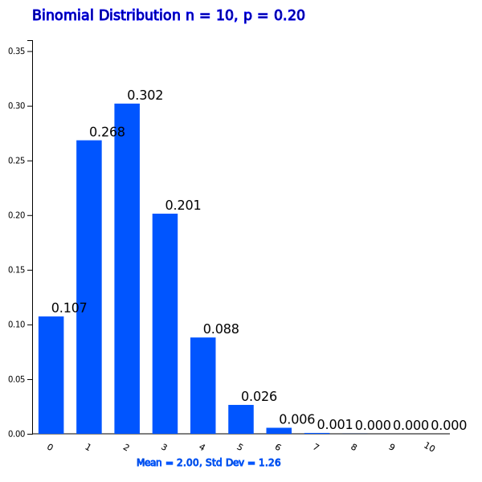{.imgFig600540}

::: figText
\<Figure 5.3.6\> 『eStatU』 Binomial distribution when $n = 10, p = 0.2$
:::

Pressing the \[Binary Prob Table\] button will show the Binomial
distribution table shown in Table 5.3.6. From here you can see that
$\small P(X \ge 2)$ = 0.6242

Table 5.3.5 『eStatU』 Binomial Distribution Table when
$n = 10, p = 0.2$

  $n = 10$   $p = 0.200$                               
  ---------- ------------------- --------------------- ---------------------
  $x$        $\small P(X = x)$   $\small P(X \le x)$   $\small P(X \ge x)$
  0          0.1074              0.1074                1.0000
  1          0.2684              0.3758                0.8926
  2          0.3020              0.6778                0.6242
  3          0.2013              0.8791                0.3222
  4          0.0881              0.9672                0.1209
  5          0.0264              0.9936                0.0328
  6          0.0055              0.9991                0.0064
  7          0.0008              0.9999                0.0009
  8          0.0001              1.0000                0.0001
  9          0.0000              1.0000                0.0000
  10         0.0000              1.0000                0.0000
:::

::: mainTablePink

<input class="qrBtn" onclick="window.open(addrStr[82])" src="QR/eStatU420_Binomial.svg" type="image"/>

**Practice 5.3.1** It is said that 60% of car drivers usually use a seat
belt. When you select 15 drivers randomly, find the following
probabilities for the number of drivers who normally use the seat belt.
Check the calculation using 『eStatU』.

::: textL20M20M20
1\) Probability of 10 or more drivers.
:::

::: textL20M20M20
2\) Probability of 8 or less drivers.
:::

::: textL20M20M20
3\) Probability of at least 11 drivers.
:::

::: textL20M20M20
4\) Probability of at least 7 drivers.
:::

:::

::: mainTable
If the value of $n$ increases, it is not easy to calculate the
probability of Binomial probability distribution even with a calculator.
In 『eStatU』, the probability of a case $n \le 100$ is readily
available.
:::

::: mainTableGrey
**Example 5.3.7** The defect rate of electronic parts produced in a
factory is 5 percent. When you have a box containing 50 of these parts,
use 『eStatU』 to obtain the following probabilities.

::: textL20M20M20
1\) What is the probability of having no defective product?
:::

::: textL20M20M20
2\) What is the probability of having 1 to 3 defective products?
:::

::: textL20M20M20
3\) What is the probability of having more than three defective
products?
:::

**Answer**

When you select $n=50, p=0.05$ from the 'Binomial Distribution' of
『eStatU』 and click on the \[Execute\] button, the graph such as
\<Figure 5.3.7\> appears. If you click the \[Binomial Prob Table\]
button, then Table 5.3.6 appears.

1\) You can check $\small P(X=0)$ = 0.0769 easily from the table.

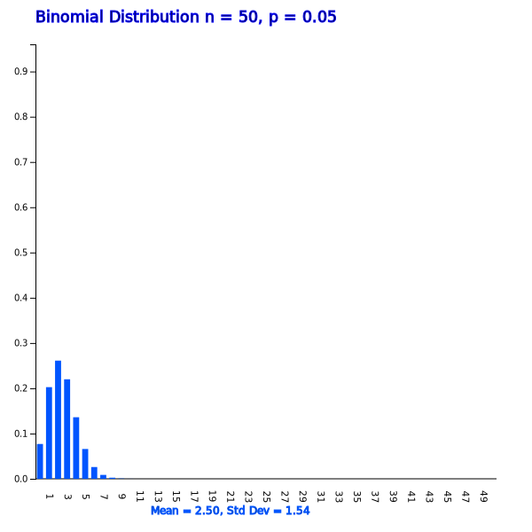{.imgFig600600}

::: figText
\<Figure 5.3.7\> 『eStatU』 Binomial Distribution when
$n = 50, p = 0.05$
:::

::: textLeft
Table 5.3.6 『eStatU』 Binomial Distribution Table when
$n = 50, p = 0.05$ (in part)
:::

  $n = 50$   $p = 0.050$                               
  ---------- ------------------- --------------------- ---------------------
  $x$        $\small P(X = x)$   $\small P(X \le x)$   $\small P(X \ge x)$
  0          0.0769              0.0769                1.0000
  1          0.2025              0.2794                0.9231
  2          0.2611              0.5405                0.7206
  3          0.2199              0.7604                0.4595
  4          0.1360              0.8964                0.2396
  $\cdots$   $\cdots$            $\cdots$              $\cdots$

::: textL20M20
2\) The probability of having 1 to 3 defective products is
$P( 1 \le X \le 3)$ and it can be calculated as follows:
:::

$\qquad \small  P( 1 \le X \le 3) = P( X \le 3) - P( X \le 0) = 0.7604 – 0.0769 = 0.6835$

::: textL20
You may calculate this probability as $\small P(X=1) + P(X=2) + P(X=3)$.
:::

::: textL20M20
3\) The probability of having more than three defective products can be
calculated by using the Table 5.3.6 as P(X \\ge 3) = 0.4595. You may
calculate this probability by using the complementary event as follows:
:::

$\qquad \small  P(X \ge 3) = 1 - P( X \le 2) = 1 – 0.5405 = 0.4595$
:::

::: mainTablePink

<input class="qrBtn" onclick="window.open(addrStr[82])" src="QR/eStatU420_Binomial.svg" type="image"/>

**Practice 5.3.2** A salesperson found that there was a 30% chance of
selling a product when a customer visited. If one day ten customers
visit this salesman, calculate following probabilities using 『eStatU』.

::: textL20M20
1\) Exactly how likely is it to sell three products?
:::

::: textL20M20
2\) What is the probability of selling three or more products?
:::

::: textL20M20
3\) What is the probability of selling less than 3 products?
:::

::: textL20M20
4\) What are the odds that none of them could be sold?
:::

::: textL20M20
5\) What is the probability of selling 5 products?
:::

:::

::: mainTable
If the number of trials $n$ of the Binomial Distribution is greater than
100, the probability calculation can not be obtained even using
『eStatU』. In such cases, you can use a normal approximation with the
mean $np$ and variance $np(1-p)$ which is described in Section 5.4.2.
:::

::: mainTablePink
### Multiple Choice Exercise

\*\*\* Choose one answer and click \[Submit\] button

::: textL30M30
5.26 What is the mean and variance of the binomial distribution
$B(100, \frac{1}{5} )$?
:::

<form name="Q26">
<label><input name="item" type="radio" value="1"/> 20, 4</label> 
<label><input name="item" type="radio" value="2"/> 100, 16</label> 
<label><input name="item" type="radio" value="3"/> 100, 4</label> 
<label><input name="item" type="radio" value="4"/> 20, 16</label> 

<input onclick="radio(5,26,Q26)" type="button" value="Submit"/>    
      <input id="ansQ26" size="15" type="text"/>

</form>

::: textL30M30
5.27 What is the variance of a random variable $\small X$ which follows
a binomial distribution $P(X) = {}_4 C _x (0.2)^x (1-0.2) ^{4-x}$
:::

<form name="Q27">
<label><input name="item" type="radio" value="1"/> 0.16</label> 
<label><input name="item" type="radio" value="2"/> 0.80</label> 
<label><input name="item" type="radio" value="3"/> 0.32</label> 
<label><input name="item" type="radio" value="4"/> 0.64</label> 

<input onclick="radio(5,7,Q27)" type="button" value="Submit"/>    
      <input id="ansQ27" size="15" type="text"/>

</form>

::: textL30M30
5.28 There are 10 multiple choice problems and only one of the four
answers is the right answer. What is the probability that four questions
are correct when answering 10 questions?
:::

<form name="Q28">
<label><input name="item" type="radio" value="1"/> 0.0162</label> 
<label><input name="item" type="radio" value="2"/> 0.0487</label> 
<label><input name="item" type="radio" value="3"/> 0.1460</label> 
<label><input name="item" type="radio" value="4"/> 0.2050</label> 

<input onclick="radio(5,28,Q28)" type="button" value="Submit"/>    
      <input id="ansQ28" size="15" type="text"/>

</form>

:::

             
::: container-fluid
:::

::: {.col-sm-9 .col-sm-offset-3 .col-md-10 .col-md-offset-2 .main}

             

### 5.3.2 Poisson Distribution

::: presentation-video-link
[presentation](050302.pdf){.presentation-link target="_blank"}   
[video](https://youtu.be/ljIcZIJSTQo){.video-link target="_blank"}
:::

::: mainTable
Consider the following examples that are frequently observed in many
areas around us.
:::

::: textL30M10
\- The number of calls made to an office of the Economics Department
between 9 am and 10 am daily for one month.
:::

::: textL30M10
\- The number of traffic accidents occurring at a certain intersection
every day is investigated for one year.
:::

::: textL30M10
\- The number of defective spots per each one square meter of the fabric
is investigated for 100 square meters.
:::

::: textL30M10
\- The number of typing errors that occur on each page of a book.
:::

::: textL30M10
\- The number of accidents occurring during a week in a factory for one
year
:::

::: mainTable
What these statistical experiments have in common is to investigate the
number of events per unit time or unit area. A random variable that
represents this \'occurrence of events per unit time or unit area\' is
called a Poisson random variable and its distribution is called a
Poisson distribution.

Probability of the Poisson distribution can be calculated using the
following formula.
:::

::: mainTableYellow
**Poisson Distribution**

The distribution of a Poisson random variable $X$ = \'Occurrence of
success event per unit time or unit area\' is as follows when the
average number of success is λ. $$
        f(x) = \frac { e^{-\lambda} \lambda^x } { x! } , \qquad x = 0, 1, 2, ...
      $$

The expectation and variance of the Poisson random variable are as
follows. $$
        E(X) = \lambda, \quad V(X) = \lambda
      $$
:::

::: mainTable
The average number of success λ in the Poisson distribution function is
called a parameter of the Poisson distribution. Note that the mean and
variance of the Poisson distribution are the same as &lambda. \<Figure
5.3.8\> to \<Figure 5.3.11\> show the Poisson distributions for
different values of λ by using 『eStatU』.

<input class="qrBtn" onclick="window.open(addrStr[83])" src="QR/eStatU440_Poisson.svg" type="image"/>

{.imgFig600600}

::: figText
\<Figure 5.3.8\> Poisson Distribution when λ = 0.4
:::

:::

{.imgFig600600}

::: figText
\<Figure 5.3.9\> Poisson Distribution when λ = 1.0
:::

{.imgFig600600}

::: figText
\<Figure 5.3.10\> Poisson Distribution when λ = 1.5
:::

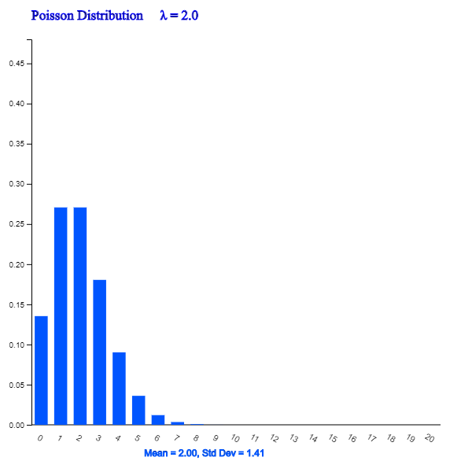{.imgFig600600}

::: figText
\<Figure 5.3.11\> Poisson Distribution when λ = 2.0
:::

::: mainTableGrey
**Example 5.3.8** Assume that cars arriving at a highway toll gate per
one minute during rush hour is the Poisson distribution with an average
of five cars. One day, if you observe the toll gate for one minute
during rush hour, calculate the following probabilities.

::: textL20M20
1\) What is the probability that none of cars will arrive?
:::

::: textL20M20
2\) What is the probability of five cars arriving?
:::

::: textL20M20
3\) What is the probability of more than two cars arriving?
:::

**Answer**

Let $\small X$ be the Poisson random variable with λ = 5.

1\) $\small P(X = 0) = f(0) = \frac { e^{-5} {5}^{0} } { 0! }$ = 0.0067

2\) $\small P(X = 5) = f(5) = \frac { e^{-5} {5}^{5} } { 5! }$ = 0.1755

3\) $\small P(X \ge 2) = 1 - P(X \le 1) = 1 - P(X=0) - P(X=1)$ = 1 -
0.0067 - 0.0337 = 0.9596
:::

::: mainTableGrey
**Example 5.3.9** Assume that the average number of Typhoons passing
through the southern part of the country per year is a Poisson
distribution with λ = 2.5. Check the following probabilities using
『eStatU』.

::: textL20M20
1\) What is the probability that a Typhoon will pass once this year?
:::

::: textL20M20
2\) What is the probability that Typhoons will pass twice or three times
or four times this year?
:::

::: textL20M20
3\) What is the probability that Typhoons will pass more than once this
year?
:::

**Answer**

<input class="qrBtn" onclick="window.open(addrStr[83])" src="QR/eStatU440_Poisson.svg" type="image"/>

Select \'Poisson distribution\' from the menu of 『eStatU』 and select λ
= 2.5. Then click on the \[Execute\] button to display a graph such as
\<Figure 5.3.12\> and click the \[Poisson Prob Table\] button to see the
Table 5.3.7.

{.imgFig600600}

::: figText
\<Figure 5.3.12\> 『eStatU』 Poisson Distribution when λ = 2.5
:::

::: textLeft
Table 5.3.7 Poisson Distribution when λ = 2.5
:::

  λ = 2.5                                              
  ---------- ------------------- --------------------- ---------------------
  $x$        $\small P(X = x)$   $\small P(X \le x)$   $\small P(X \ge x)$
  0          0.0821              0.0821                1.0000
  1          0.2052              0.2873                0.9179
  2          0.2565              0.5438                0.7127
  3          0.2138              0.7576                0.4562
  4          0.1336              0.8912                0.2424
  $\cdots$   $\cdots$            $\cdots$              $\cdots$

1\) $\small P(X=1)$ = 0.2052.

2\) $\small P( 2 \le X \le 4)$ can be calculated as follows:

$\qquad \small P( 2 \le X \le 4 ) = P( X \le 4) - P( X \le 1)$= 0.8912
-- 0.2873 = 0.6039

::: textL20
This event can be calculated as $\small P(X=2) + P(X=3) + P(X=4)$.
:::

::: textL20M20
3\) If you use Table 5.3.7, $\small P(X \ge 2)$ = 0.7127. Then the
probability can be calculated by using the complementary event as
follows:
:::

$\qquad \small P(X \ge 2) = 1 - P( X \le 1)$= 1 -- 0.2873 = 0.7127
:::

::: mainTablePink

<input class="qrBtn" onclick="window.open(addrStr[83])" src="QR/eStatU440_Poisson.svg" type="image"/>

**Practice 5.3.3** The number of defects per 1 square meter of the
fabric follows a Poisson distribution with the average number of defects
λ = 0.2. When 1 square meter of the fabric is investigated for quality
inspection, find the following probabilities using 『eStatU』.

::: textL20M20
1\) What is the probability that the number of defects is zero?
:::

::: textL20M20
2\) What is the probability that the number of defects is greater than
2?
:::

:::

::: mainTable
Binomial distribution and Poisson distribution are very closely related.
Mathematically, if $n$ is very large and $p$ is very small, the binomial
distribution function converges to the Poisson distribution function. If
you are interested in proofing this theory in detail, please refer to a
book of mathematical statistics.
:::

             
:::
::: container-fluid
:::

::: {.col-sm-9 .col-sm-offset-3 .col-md-10 .col-md-offset-2 .main}

             

### 5.3.3 Geometric Distribution

::: presentation-video-link
[presentation](050303.pdf){.presentation-link target="_blank"}   
[video](https://youtu.be/SPWZNCW2mdg){.video-link target="_blank"}
:::

::: mainTable
The binomial distribution is a probability distribution which counts the
number of heads when a coin is thrown n times. On the other hand, the
number of trials until the head of a coin appears may be of interest.
Let us consider the following examples.
:::

::: textL30M10
\- A candidate has 40 percent approval rating in an election. When
interviewing voters to hear opinions, what is the probability of meeting
one person who abstains from voting the candidate at the fifth trial?
:::

::: textL30M10
\- The defect rate in products of a factory is said to be about 5%. If
you continue to inspect the product until you find a defect product to
investigate the cause, what is the probability of finding it at the 10th
trial?
:::

::: mainTable
In these examples, as with the binomial distribution, we don\'t know
what the outcome of each trial will be, but there are only two possible
outcomes such as {pro, con} and {defective, normal}. If we denote one
outcome of interest as 'success' and the other as 'failure', the
experiment is the repetition of Bernoulli trials until we have one
'success'. \'The number of Bernoulli trials until success\' is called a
**geometric random variable** and its distribution is called a
**geometrical distribution**.

The probability of success $p$ in the geometrical distribution is called
a parameter of the geometric distribution. The probability distribution
function of the geometric distribution is as follows:
:::

::: mainTableYellow
**Geometric Distribution**

When the probability of \'success\' in a Bernoulli trial is $p$ and $X$
is the number of Bernoulli trials until the first success, the
probability distribution of $X$ is called a geometric distribution and
its probability distribution function is as follows. $$
        f(x) = (1-p)^{x-1} p, \qquad x=1,2, ...
      $$

The expectation and variance of the geometric random variable are as
follows. $$ 
        E(X) =  \frac {1}{p}, \quad  V(X) = \frac {1-p}{p^2 }
      $$
:::

::: mainTable
\<Figure 5.3.13\> to \<Figure 5.3.15\> show the distribution of
geometric distribution for different values of $p$.
:::

<input class="qrBtn" onclick="window.open(addrStr[84])" src="QR/eStatU450_Geometric.svg" type="image"/>

{.imgFig600600}

::: figText
\<Figure 5.3.13\> Geometric distribution when $p$ = 0.2
:::

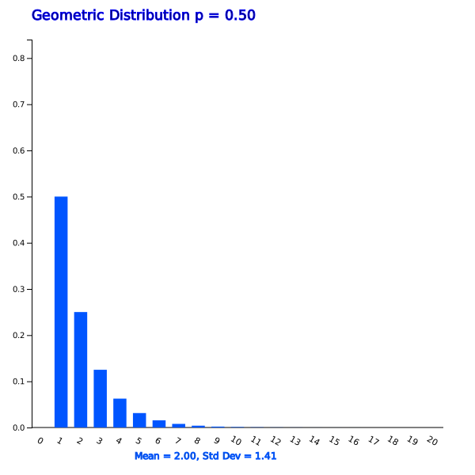{.imgFig600600}

::: figText
\<Figure 5.3.14\> Geometric distribution when $p$ = 0.5
:::

{.imgFig600600}

::: figText
\<Figure 5.3.15\> Geometric distribution when $p$ = 0.8
:::

::: mainTableGrey
**Example 5.3.10** A candidate has 40% approval rating in an election.
When interviewing voters to hear the opinions of those who oppose the
candidate, calculate the following probabilities.

::: textL20M20
1\) What is the probability of finding someone who is opposed in the
first interview?
:::

::: textL20M20
2\) What is the probability of finding someone who is opposed in the
fifth interview?
:::

**Answer**

Let $\small X$ be the geometric random variable with $p$ = 0.4.

1\) $\small P(X = 1) = f(1) = \small (1-0.4)^{1-1} 0.4$ = 0.4

2\) $\small P(X = 5) = f(5) = \small (1-0.4)^{5-1} 0.4$ = 0.0518
:::

::: mainTableGrey
**Example 5.3.11** The defect rate of a product produced by a factory is
said about 5 percent. Use 『eStatU』 to obtain the following
probabilities when continuing to inspect the product until it finds a
defective product to investigate the cause of defective.

::: textL20M20
1\) The probability of finding a defective product at the third trial.
:::

::: textL20M20
2\) The probability of finding a defective product at the third and more
trial.
:::

**Answer**

<input class="qrBtn" onclick="window.open(addrStr[84])" src="QR/eStatU450_Geometric.svg" type="image"/>

Select \'Geometric Distribution\' from the 『eStatU』 menu, select
parameter $p$ = 0.05, and click the \[Execute\] button to display the
graph shown in \<Figure 5.3.16\>, and click the \[Geometric Prob Table\]
button to display Table 5.3.8.

{.imgFig600600}

::: figText
\<Figure 5.3.16\> Geometric distribution when $p$ = 0.05
:::

::: textLeft
Table 5.3.8 Part of Geometric distribution when $p$ = 0.05
:::

  $p$ = 0.05                                             
  ------------ ------------------- --------------------- ---------------------
  $x$          $\small P(X = x)$   $\small P(X \le x)$   $\small P(X \ge x)$
  1            0.0500              0.0500                1.0000
  2            0.0475              0.0975                0.9500
  3            0.0451              0.1426                0.9025
  4            0.0429              0.1855                0.8574
  5            0.0407              0.2262                0.8145
  $\cdots$     $\cdots$            $\cdots$              $\cdots$

1\) We can easily find $\small P(X=3)$ = 0.0451.

2\) We can easily find $\small P(X \ge 3)$ = 0.9025.

::: textL20
We can use the complementary probability as follows:
:::

$\qquad \small P(X \ge 3) = 1 - P( X \le 2)$ = 1 -- 0.0975 = 0.9025
:::

::: mainTablePink

<input class="qrBtn" onclick="window.open(addrStr[84])" src="QR/eStatU450_Geometric.svg" type="image"/>

**Practice 5.3.4** The defect rate of products produced in a factory is
about 1 percent. Use 『eStatU』 to obtain the following probabilities
when continuing to inspect the product until it finds a defective
product to investigate the cause of defective.

::: textL20M20
1\) The probability of finding a defective product at the second trial.
:::

::: textL20M20
2\) The probability of finding a defective product at the third or more
trial.
:::

:::

             
:::
::: container-fluid
:::

::: {.col-sm-9 .col-sm-offset-3 .col-md-10 .col-md-offset-2 .main}

             

### 5.3.4 Hypergeometric Distribution

::: presentation-video-link
[presentation](050304.pdf){.presentation-link target="_blank"}   
[video](https://youtu.be/WRVXMF0xlm0){.video-link target="_blank"}
:::

::: mainTable
Consider a statistical experiment to examine products in a factory to
determine whether a box of the products includes defects or not. For
example, consider a box consisting of 20 products and 15 of them are
normal products and 5 are defective products. When three of the 20
products are sampled, the probability of having two normal products and
one defective product can be calculated using the combination studied in
section 5.1 as follows.
:::

$$
     \frac { { }_{15} C_2 \times {}_{5} C_1  } { {}_{20} C_3 } 
    $$

::: mainTable
A random variable that counts the number of 'success' in a finite
population consisting of only 'success' and 'failure' is called a
hypergeometric random variable and its distribution is called a
hypergeometric distribution. The probability distribution function of
the hypergeometric distribution is as follows.
:::

::: mainTableYellow
**Hypergeometric Distribution**

Consider a population of size $N$ which consists of $D$ 'success' and
$N-D$ 'failure'. If we collect a sample of size without replacement and
$X$ is the number of 'success' in the sample, then the distribution of
$X$ is called hypergeometric distribution and its probability
distribution function is as follows. $$
        \frac { {}_{D} C_x \times {}_{N-D} C_{n-x}  } { {}_{N} C_{n} } 
      $$ If we let $p = \frac{D}{N}$, the expectation and variance of
the hypergeometric random variable are as follows. $$
        E(X) = np , \quad V(X) = np(1-p) \frac{N-n}{N-1}
      $$
:::

::: mainTable
In the hypergeometric probability distribution function,$N, D, n$ are
called parameters of the distribution and \<Figure 5.3.17\> to \<Figure
5.3.19\> show the distributions for various parameters.
:::

<input class="qrBtn" onclick="window.open(addrStr[85])" src="QR/eStatU460_HyperGeo.svg" type="image"/>

{.imgFig600600}

::: figText
\<Figure 5.3.17\> Hypergeometric distribution when
$N = 30, D = 5, n = 10$
:::

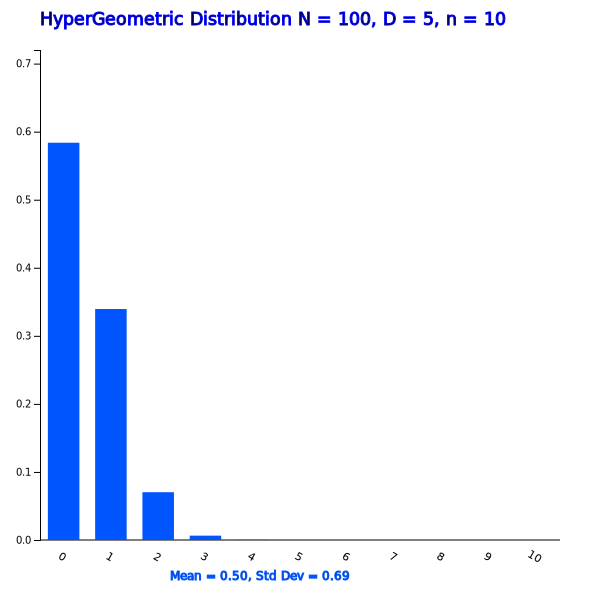{.imgFig600600}

::: figText
\<Figure 5.3.18\> Hypergeometric distribution when
$N = 100, D = 5, n = 10$
:::

{.imgFig600600}

::: figText
\<Figure 5.3.19\> Hypergeometric distribution when
$N = 100, D = 5, n = 20$
:::

::: mainTable
Be aware that when the size of population $N$ is very large or when we
select the sample with replacement, the number of 'success' in the
sample will follow the binomial distribution. If the size of population
is finite and the sample is selected without replacement, the number of
'success' in the sample follows the hypergeometric distribution. Note
that, when the number of products is finite and a selected product is
not replaced, the failure rate changes.
:::

::: mainTableGrey
**Example 5.3.12** Sample of size 3 is selected from a box containing 20
tobacco products of which there are 15 normal products and 5 defective
products. What is the probability of having one, two, or three defective
products in the sample?

**Answer**

These probability calculations have already been studied using
combinations in section 5.1. This is the hypergeometric distribution
with $N$ = 20, $D$ = 15, $n$ = 3, so the probabilities are as follows.

$$ \small
        \begin{multline}
        \shoveleft P(X=1) = \frac { {}_{15} C_{2} \times  {}_{5} C_{1} } {{}_{20} C_{3}} = \frac {15 \times 10} {1140} = 0.460 \\  
        \shoveleft P(X=2) = \frac { {}_{15} C_{1} \times  {}_{5} C_{2} } {{}_{20} C_{3}} = \frac {105 \times 5} {1140} = 0.132 \\  
        \shoveleft P(X=3) = \frac { {}_{15} C_{0} \times  {}_{5} C_{3} } {{}_{20} C_{3}} = \frac {455 \times 1} {1140} = 0.099 \\  
        \end{multline}
      $$
:::

::: mainTableGrey
**Example 5.3.13** Use 『eStatU』 to obtain the probability of \[Example
5.3.12\].

**Answer**

Select \'Hypergeometric Distribution\' from the menu of 『eStatU』,
select $N = 20, D = 15, n = 3$ and click on the \[Execute\] button to
display a graph such as \<Figure 5.3.20\>. If you click the
\[Hypergeometric Prob Table\] button, Table 5.3.9 appears. This table
shows the probabilities of $\small P(X=0), P(X=1), P(X=2)$, and
$\small P(X=3)$.

<input class="qrBtn" onclick="window.open(addrStr[85])" src="QR/eStatU460_HyperGeo.svg" type="image"/>

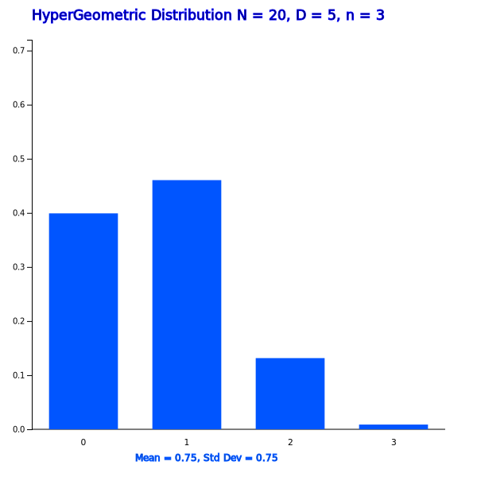{.imgFig600600}

::: figText
\<Figure 5.3.20\> Hypergeometric distribution when
$N = 20, D = 5, n = 3$
:::

::: textLeft
Table 5.3.9 Hypergeometric distribution when $N = 20, D = 5, n = 3$
:::

  $\small N = 20$   $\small D = 5$      $\small n = 3$        
  ----------------- ------------------- --------------------- ---------------------
  $x$               $\small P(X = x)$   $\small P(X \le x)$   $\small P(X \ge x)$
  0                 0.3991              0.3991                1.0000
  1                 0.4605              0.8596                0.6009
  2                 0.1316              0.9912                0.1404
  3                 0.0088              1.0000                0.0088
:::

::: mainTablePink

<input class="qrBtn" onclick="window.open(addrStr[85])" src="QR/eStatU460_HyperGeo.svg" type="image"/>

**Practice 5.3.5** Sample of size 5 is selected from a box containing 20
cookie products of which there are 17 normal products and 3 defective
products. Find the probability of having one, two, or three defective
products in the sample using 『eStatU』.

:::

             
:::
::: container-fluid
:::

::: {.col-sm-9 .col-sm-offset-3 .col-md-10 .col-md-offset-2 .main}

             

## 5.4 Continuous Random Variable

::: presentation-video-link
[presentation](0504.pdf){.presentation-link target="_blank"}   
[video](https://youtu.be/hBynC_wR19E){.video-link target="_blank"}
:::

::: mainTable
Consider a statistical experiment that measures how long it takes for an
office worker to get to work from home. Past experience shows that the
commuting time usually takes about 30 minutes to get to the work place
if the traffic is not congested. While the result of this experiment
will have a real number near 30 minutes, we can assume generally that
the sample space is larger than zero, and define a random variable
$\small X$ as the \'commuting time to work place\'. As such, if a random
variable has an infinite number of possible values and it is
uncountable, it is called a **continuous random variable**.

In case of the continuous random variable, calculating probability at
each value of the random variable is meaningless, because there are
infinite possible values and the probability at each value is considered
zero. Instead of calculating the probability at a single value, the
probability of an interval is of interest in case of the continuous
random variable. For example, \'What is the probability of a commuting
time between 25 and 35 minutes?\' In order to obtain this probability,
we can divide the sample space of the commuting time into several
intervals and count the number of their frequencies and probabilities
for 100 days as in Table 5.4.1. \<Figure 5.4.1\> is a histogram of this
table.
:::

Table 5.4.1 Frequency table of the commuting time for 100 days
$\small X$ = 'commuting time' (unit: minute)

  -----------------------------------------------------------------------
  Interval                Frequency               Probability
  $(a \le X \lt b)$                               
  ----------------------- ----------------------- -----------------------
  $10 \le X \lt 30$\      5\                      5/100\
  $30 \le X \lt 50$\      30\                     30/100\
  $50 \le X \lt 60$\      40\                     40/100\
  $60 \le X \lt 70$\      20\                     20/100\
  $70 \le X \lt 90$       5                       5/100

  Total                   100 (days)              1
  -----------------------------------------------------------------------

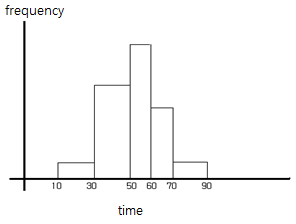{.imgFig400300}

::: figText
\<Figure 5.4.1\> Histogram of $\small X$ = 'commuting time'
:::

::: mainTable
Using this frequency table, the probability of commuting time between 30
and 60 minutes can be calculated as follows.

$$ P(30 \le X \lt 60) = 30/100 + 40/100 = 70/100 $$
:::

::: mainTable
However, if you use this table, you can not calculate, for example, the
probability of the commuting time between 25 and 35 minutes. In order to
calculate this probability, calculation will require a detail frequency
table and a histogram such as \<Figure 5.4.2\> which has narrower
intervals by obtaining more data. If you increase the number of data and
make the width of the interval close to zero, this histogram will be
approximated to a continuous function as shown in \<Figure 5.4.3\>. This
function is called a **probability distribution function of the
continuous random variable**. As shown in this Figure, many real world
data have a bell shape, large amount of data are observed near the mean,
symmetrical about the mean. It is called a normal distribution.
:::

{.imgFig400300}

::: figText
\<Figure 5.4.2\> Histogram with narrower intervals on many data
:::

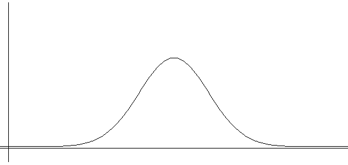{.imgFig400300}

::: figText
\<Figure 5.4.3\> Probability distribution function of a continuous
random variable
:::

::: mainTable
If the probability distribution function of a continuous random variable
can be expressed as a mathematical function f(x), the desired
probability can be obtained without finding the frequency table and
histogram. The probability of the random variable $\small X$ at interval
($a,b)$, denoted as $P( a \lt X \lt b)$, can be obtained as the area
between ($a,b)$ of f(x) as \<Figure 5.4.4\> which is the integral over
($a,b)$ as follows: $$
        P(a \lt X \lt b)=  \int_{a} ^{b} {} f(x)dx
      $$
:::

{.imgFig400300}

::: figText
\<Figure 5.4.4\> $P(a \lt X \lt b)$ of the continuous random variable
$\small X$
:::

::: mainTable
The area under this function f(x) should be 1, because the addition of
all probabilities is 1. $$
        P(-∞ \lt X \lt ∞)=  \int_{-∞} ^{∞} {} f(x)dx = 1
      $$ The integral over ($a,b$ ) of a function f(x) is generally
difficult to obtain. For a normal distribution function, we use a table
to calculate the probability which is discussed in Section 5.4.1. The
following is an example to calculate the probability of the uniform
distribution.
:::

::: mainTableGrey
**Example 5.4.1** The delivery time to order a pizza and getting home
have the same possibility as any time between 10 to 30 minutes (it is
called a uniform distribution). Let the random variable X be the time
takes to deliver a pizza to home. Find a probability distribution
function of X and draw a graph. Find the probability of the delivery
time between 15 and 20 minutes.

**Answer**

Since the random variable $\small X$ has the same possibility as any
number between 10 and 30, the probability distribution function (uniform
distribution) is as follows.

$\quad \small  f(x) = \Big\{ \array { \frac {1}{30-10}, &\quad \text{if  10 < }x \text { < 30} \cr 0, &\qquad \text{elsewhere} }$

\<Figure 5.4.5\> is the shape of this probability distribution function
and it is called a uniform distribution between 10 and 30 denoted as
Uniform(10,30).

{.imgFig300100}

::: figText
\<Figure 5.4.5\> Uniform distribution on (10,30) and the probability of
$P(15 \lt X \lt 20)$
:::

The probability of the delivery time between 15 and 20 minutes is the
area of the shaded rectangle of the \<Figure 5.4.5\> which can be
calculated as follows.

$\quad \small  P(15 \lt X \lt 20) = (20 - 15) × \frac {1}{20} = 0.25$
:::

::: mainTablePink
### Multiple Choice Exercise

\*\*\* Choose one answer and click \[Submit\] button

::: textL30M30
5.18 Which one of the followings is suitable as a probability
distribution function?
:::

<form name="Q18">
<label><input name="item" type="radio" value="1"/> \(f(x) = \frac {x} {5} , \qquad(x = -1, 0, 1, 2, 3) \)</label> 
<label><input name="item" type="radio" value="2"/> \(f(x) = \frac {(5-x)} {14} , \qquad(x = 0, 1, 2, 3) \)</label> 
<label><input name="item" type="radio" value="3"/> \(f(x) = x^2 - 1 ,\qquad(x = 0, 1, 2, 3) \)</label> 
<label><input name="item" type="radio" value="4"/> \(f(x) = x^3 - x^2 + 5 ,\qquad(x = 0, 1, 2, 3) \)</label> 

<input onclick="radio(5,18,Q18)" type="button" value="Submit"/>    
      <input id="ansQ18" size="15" type="text"/>

</form>

::: textL30M30
5.19 Which of the followings is NOT a probability distribution function?
:::

<form name="Q19">
<label><input name="item" type="radio" value="1"/> \( f(x) \ge 0\)</label> 
<label><input name="item" type="radio" value="2"/> \( \int_{-∞}^{∞} f(x) dx = 1 \)</label> 
<label><input name="item" type="radio" value="3"/> \( P(a &lt; X &lt; b) = \int_a^b f(x)dx \)</label> 
<label><input name="item" type="radio" value="4"/> \( \int_{-∞}^{∞} xf(x) dx = 1 \)</label> 

<input onclick="radio(5,19,Q19)" type="button" value="Submit"/>    
      <input id="ansQ19" size="15" type="text"/>

</form>

::: textL30M30
5.20 What is the average value of $\small X$ when the variables
$\small X$ take values of 0, 1, 2 and 3 and the probability function
$f(x) = \frac{x}{6}$
:::

<form name="Q20">
<label><input name="item" type="radio" value="1"/> 5/3</label> 
<label><input name="item" type="radio" value="2"/> 6/3</label> 
<label><input name="item" type="radio" value="3"/> 7/3</label> 
<label><input name="item" type="radio" value="4"/> 8/3</label> 

<input onclick="radio(5,20,Q20)" type="button" value="Submit"/>    
      <input id="ansQ20" size="15" type="text"/>

</form>

::: textL30M30
5.21 Which of the following is incorrect for the probability
distribution function f(x) defined for all values of a continuous random
variable $\small X$?
:::

<form name="Q21">
<label><input name="item" type="radio" value="1"/> \( f(x) \ge 0\)</label> 
<label><input name="item" type="radio" value="2"/> \( \int_{-∞}^{∞} f(x) dx = 1 \)</label> 
<label><input name="item" type="radio" value="3"/> \( P(a &lt; X &lt; b) = \int_a^b f(x)dx \)</label> 
<label><input name="item" type="radio" value="4"/> \( \int_{0}^{∞} f(x) dx = \frac{1}{2} \)</label> 

<input onclick="radio(5,21,Q21)" type="button" value="Submit"/>    
      <input id="ansQ21" size="15" type="text"/>

</form>

::: textL30M30
5.22 What is the mean value of $\small E(X)$ and the standard deviation
$σ(X)$ when the probability distribution of a random variable $\small X$
is as follows?
:::

  ----------------- ---------------- ---------------- ---------------- -------
  $x$               0                1                2                Total
  $\small P(X=x)$   $\frac{3}{10}$   $\frac{6}{10}$   $\frac{1}{10}$   1
  ----------------- ---------------- ---------------- ---------------- -------

<form name="Q22">
<label><input name="item" type="radio" value="1"/> \(\small E(X)=0.8, σ(X)=0.6\)</label> 
<label><input name="item" type="radio" value="2"/> \(\small E(X)=0.6, σ(X)=0.8\)</label> 
<label><input name="item" type="radio" value="3"/> \(\small E(X)=0.7, σ(X)=0.1\)</label> 
<label><input name="item" type="radio" value="4"/> \(\small E(X)=0.1, σ(X)=0.7\)</label> 

<input onclick="radio(5,22,Q22)" type="button" value="Submit"/>    
      <input id="ansQ22" size="15" type="text"/>

</form>

::: textL30M30
5.23 The number of eyes when we throw one dice is from 1 to 6. If
$\small X$ is a random variable which represents the number of eyes,
what is the expected value of $\small E(X)$?
:::

<form name="Q23">
<label><input name="item" type="radio" value="1"/> 2</label> 
<label><input name="item" type="radio" value="2"/> 2.5</label> 
<label><input name="item" type="radio" value="3"/> 3</label> 
<label><input name="item" type="radio" value="4"/> 3.5</label> 

<input onclick="radio(5,23,Q23)" type="button" value="Submit"/>    
      <input id="ansQ23" size="15" type="text"/>

</form>

::: textL30M30
5.24 What is the expected value of scores if you square the number of
eyes appeared when you throw one dice?
:::

<form name="Q24">
<label><input name="item" type="radio" value="1"/> 23/6</label> 
<label><input name="item" type="radio" value="2"/> 41/6</label> 
<label><input name="item" type="radio" value="3"/> 53/6</label> 
<label><input name="item" type="radio" value="4"/> 91/6</label> 

<input onclick="radio(5,24,Q24)" type="button" value="Submit"/>    
      <input id="ansQ24" size="15" type="text"/>

</form>

::: textL30M30
5.25 Assuming that a random variable $\small X$ take three values 0, 1,
and 2, and their probabilities are 1/2, 1/3, 1/6 respectively. What is
the value of the cumulative distribution function F(x) if 1 ≤ x \< 2?
:::

<form name="Q25">
<label><input name="item" type="radio" value="1"/> 0</label> 
<label><input name="item" type="radio" value="2"/> 5/6</label> 
<label><input name="item" type="radio" value="3"/> 1/3</label> 
<label><input name="item" type="radio" value="4"/> 2/3</label> 

<input onclick="radio(5,25,Q25)" type="button" value="Submit"/>    
      <input id="ansQ25" size="15" type="text"/>

</form>

:::

             
:::
::: container-fluid
:::

::: {.col-sm-9 .col-sm-offset-3 .col-md-10 .col-md-offset-2 .main}

             

### 5.4.1 Normal Distribution

::: presentation-video-link
[presentation](050401.pdf){.presentation-link target="_blank"}   
[video](https://youtu.be/GQ43bFGRcU8){.video-link target="_blank"}
:::

::: mainTable
In real life, there are many continuous data that appears in the form of
bell-shape as in \<Figure 5.4.3\>. The graph shows that large amount of
data are located around their mean, fewer data located as it moves away
from the mean, and is symmetrical around the mean. This type of data is
called a normal distribution. Data obtained from measurements such as
the height, weight, and length of bolt often follow the normal
distribution. \<Figure 5.4.6\> shows a simulation of data which follow a
normal distribution with the mean 0 and variance 1 using 『eStatU』.
:::

<input class="qrBtn" onclick="window.open(addrStr[87])" src="QR/eStatU510_NormalSim.svg" type="image"/>

{.imgFig600540}

::: figText
\<Figure 5.4.6\> Simulation of data which follow a Normal distribution
with mean 0 and variance 1 using 『eStatU』
:::

::: mainTable
To make it easier to calculate probability for this type of data in the
form of a normal distribution, many mathematicians tried to find a
function to describe this distribution type. Abraham de Moivre
(1667-1754) was the first who discovered the function, and then Carl
Friedrich Gauss (1777-1855) extensively applied to physics and
astronomy. This function is called a normal distribution function or a
Gaussian distribution function and the functional form is as follows. $$
        f(x) = \frac{1}{\sqrt{2 π} \, \sigma } exp \{ - \frac {(x-\mu)^2 } {2 \sigma^2} \}
      $$
:::

::: mainTableYellow
**Normal Distribution**

A normal distribution function or a Gaussian distribution function is as
follows. $$
        f(x) = \frac{1}{\sqrt{2 π} \, \sigma } exp \{ - \frac {(x-\mu)^2 } {2 \sigma^2} \}
      $$ This distribution function has two parameters μ and σ, each
representing the mean and standard deviation of the normal distribution.
:::

::: mainTable
This distribution function has two parameters μ and σ, each representing
the mean and standard deviation of the normal distribution. If
$\small X$ is a normal random variable with mean μ and variance
$\sigma^2$ , it is often denoted by a symbol $\small X$ ～
$N(\mu, \sigma^2)$. \<Figure 5.4.7\> shows three normal distributions,
N(-2,0.25), N(0,1), and N(2,4) simultaneously.

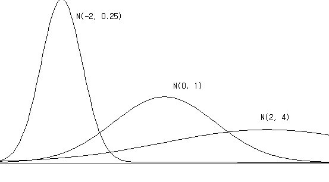{.imgFig400300}

::: figText
\<Figure 5.4.7\> Three Normal distribution N(-2,0.25), N(0,1), N(2,4)
:::

Characteristics of the normal distribution can be summarized as
following.

::: textL20M20
1\) It is a continuous function in the shape of a bell.
:::

::: textL20M20
2\) It is symmetrical with respect to the mean μ. So the probability of
the left and right side of the mean is 0.5 each.
:::

::: textL20M20
3\) There are infinite number of normal distributions according to the
value of μ and σ.
:::

::: textL20M20
4\) The probability of the interval \[ μ - σ , μ + σ \] is 0.68, and the
probability of the interval \[ μ - 2 σ , μ + 2 σ \] is 0.95, and the
probability of the interval \[ μ - 3 σ , μ + 3 σ \] is 0.997. It implies
that the Normal random variable has the most of values (99.7%) around
the interval of (mean) ± 3 (standard deviation) and there are a few
values outside of this interval.
:::
:::

### Probability Calculation of the Normal Distribution

::: mainTable
The normal distribution is the most frequently used distribution in
statistics. If $\small X$ is a normal random variable with mean μ and
variance $\sigma^2$ , it requires a probability calculation in the
interval $(a,b)$. As described earlier, the probability of $\small X$ on
the interval $(a,b)$, is the area of f(x) surrounding the X-axis and
interval $(a,b)$ as shown in \<Figure 5.4.8\>.

{.imgFig400300}

::: figText
\<Figure 5.4.8\> Probability of $\small X$ on the interval $(a,b)$
:::

Mathematically, this area must be obtained with the following definite
integral over $(a,b)$, but it is impossible to calculate by hand and can
only be calculated using a computer. $$
        P(a \lt X \lt b)=  \int_{a} ^{b} {} \frac{1}{\sqrt{2 π} \, \sigma } exp \{ - \frac {(x-\mu)^2 } {2 \sigma^2} \}dx
      $$ If X is a normal random variable with the mean μ and variance
$\sigma^2$, a standardized random variable $Z = \frac {X - \mu}{\sigma}$
is a normal random variable with the mean 0 and variance 1, i.e.,
$Z ∼ N(0,1)$. This fact implies that, if we can find probabilities of
all types of intervals in N(0,1) distribution, then we can also find
probabilities of all types of intervals in $N(\mu, \sigma^2 )$.
Therefore, $N(0,1)$ is called a standard normal distribution or simply
$\small Z$ distribution.
:::

::: mainTableYellow
**\[Theorem 5.4.1\]   Distribution of the Standardized Normal Random
Variable**

If $X$ is a normal random variable with the mean μ and variance
$\sigma^2$, i.e. $X ∼ N(\mu,\sigma^2)$, then the standardized random
variable $Z$, $\frac{X-\mu}{\sigma}$ follows a Normal distribution with
the mean 0 and variance 1, i.e. $Z ∼ N(0,1)$
:::

::: mainTable
For the standard normal distribution function, the probability
$P(Z \lt z)$ which is the area from the left end(-∞) to the value z is
calculated by using a computer and summarized as Table 5.4.2. It is
called the standard normal distribution table and Table 5.4.2 is a part
of this table obtained using 『eStatU』. This table covers values of z
between --3.99 and 3.99 by increment of 0.01 and four decimal digits of
the probability for an interval (&-infin;, z) in the standard normal
distribution is calculated. Calculation of the probability by using this
table is usually enough approximation for practical application.

<input class="qrBtn" onclick="window.open(addrStr[88])" src="QR/eStatU520_Normal.svg" type="image"/>

::: figText
Table 5.4.2 Standard normal distribution table by using 『eStatU』
:::

{.imgFig600400}

In 『eStatU』, the calculation of probability $P( a \lt X \lt b )$ for
the interval $(a , b)$ of any normal distribution $N(\mu,\sigma^2)$ can
be done as in \<Figure 5.4.9\>, and the percentile $x$ for a given
probability $p$, which is $P( X \lt x) = p$, can also be easily
calculated. In 『eStatU』, the probability of any interval on \[μ - 4σ,
μ + 4σ \] can be calculated. The probability of $P(Z \lt z)$ is near 0
if z is less than μ - 4σ and is 1 if z is greater than μ + 4σ. Table
5.4.3 shows percentiles of the standard normal distribution by using
『eStatU』.

<input class="qrBtn" onclick="window.open(addrStr[88])" src="QR/eStatU520_Normal.svg" type="image"/>

{.imgFig600600}

::: figText
\<Figure 5.4.9\> Normal probability calculation using 『eStatU』
:::

::: figText
Table 5.4.3 Percentiles of standard normal distribution by using
『eStatU』
:::

{.imgFig600400}
:::

::: mainTableGrey
**Example 5.4.2** When $\small Z$ is a standard normal random variable,
find the following probability using standard normal distribution table.
Then use 『eStatU』 to confirm the probability.

1\) $\small P(Z \lt 1.96)$\
2) $\small P(-1.96 \lt Z \lt 1.96)$\
3) $\small P(Z \gt 1.96)$

**Answer**

By using standard normal distribution table,

1\) $\small P(Z \lt 1.96)$ = 0.975.\
2) $\small P(-1.96 \lt Z \lt 1.96) = P(Z \lt 1.96) - P(Z \lt -1.96)$ =
0.975 - 0.025 = 0.95\
3) $\small P(Z \gt 1.96) = 1 - P(Z \lt 1.96)$ = 1 - 0.975 = 0.025

<input class="qrBtn" onclick="window.open(addrStr[88])" src="QR/eStatU520_Normal.svg" type="image"/>

By using normal distribution module of 『eStatU』 (\<Figure 5.4.9\>),

::: textL20M20
1\) Enter 1.96 on the second option below the graph, then click the
\[Execute\] button. The answer is shown at the yellow box in the right
hand side
:::

::: textL20M20
2\) Enter an interval from -1.96 and 1.96 on the first option below the
graph, then click the \[Execute\] button.
:::

::: textL20M20
3\) Enter 1.96 on the third option below the graph, then click the
\[Execute\] button. The answer is shown at the yellow box in the right
hand side
:::

:::

::: mainTableGrey
**Example 5.4.3** When $\small Z$ is a standard normal random variable,
obtain x that satisfies the following formula by using percentile table
of the standard normal distribution. Then use 『eStatU』 to find this
value x.

::: textL20M20
1\) $\small P(Z \lt x)$ = 0.90
:::

::: textL20M20
2\) $\small P(-x \lt Z \lt x)$ = 0.99
:::

::: textL20M20
3\) $\small P(Z \gt x)$ = 0.05
:::

**Answer**

By using percentile table of the standard normal distribution,

::: textL20M20
1\) The value of x is 1.2826
:::

::: textL20M20
2\) The percentile of 0.995 is 2.575.
:::

::: textL20M20
3\) The value of x is 1.645.
:::

<input class="qrBtn" onclick="window.open(addrStr[88])" src="QR/eStatU520_Normal.svg" type="image"/>

By using normal distribution module of 『eStatU』 (\<Figure 5.4.9\>),

::: textL20M20
1\) Enter $p =$ 0.90 at the right box of the fifth option below the
graph, then click the \[Execute\] button. It shows that the exact 90
percentile is 1.282 at the yellow box.
:::

::: textL20M20
2\) Enter $p =$ 0.99 at the right box of the fourth option below the
graph, then click the \[Execute\] button. You can see that the exact
two-sided value is --2.576 and 2.576 at the yellow boxes .
:::

::: textL20M20
3\) Enter $p =$ 0.05 at the right box of the sixth option below the
graph, then click the \[Execute\] button. It shows that the right 5
percentile is 1.645 at the yellow box.
:::

:::

::: mainTablePink

<input class="qrBtn" onclick="window.open(addrStr[88])" src="QR/eStatU520_Normal.svg" type="image"/>

**Practice 5.4.1** When $\small Z$ is a standard normal random variable,
find following probabilities using 『eStatU』.

::: textL20M20
1\) Calculate the probability that $\small Z$ is beween 0 and 1.5.
:::

::: textL20M20
2\) Calculate the probability that $\small Z$ is between --1.5 and 0.
:::

::: textL20M20
3\) $\small P(Z \lt -1.5)$
:::

::: textL20M20
4\) $\small P(Z \gt 1.5)$
:::

::: textL20M20
5\) $\small P(Z \gt -1.5)$
:::

::: textL20M20
6\) $\small P(Z \lt 1.5)$
:::

::: textL20M20
7\) $\small P(-1.5 \lt Z \lt 1.5)$
:::

:::

::: mainTablePink

<input class="qrBtn" onclick="window.open(addrStr[88])" src="QR/eStatU520_Normal.svg" type="image"/>

**Practice 5.4.2** When Z is a standard normal random variable, find x
that satisfies the following formula using 『eStatU』.

::: textL20M20
1\) $\small P(Z \lt x)$ = 0.80
:::

::: textL20M20
2\) $\small P(-x \lt Z \lt x)$ = 0.80
:::

::: textL20M20
3\) $\small P(Z \gt x)$ = 0.80
:::

:::

::: mainTable
It is recommended that you remember probabilities of some intervals in
the standard normal distribution which are frequently used. \<Figure
5.4.10\> shows percentiles that cumulated probabilities become 95%,
97.5%, and 99.5% from the left end of the standard normal distribution.
:::

{.imgFig400300}

::: figText
\<Figure 5.4.10\> Percentile with a cumulative probability of 95%,
97.5%, and 99.5% from the left end of N(0,1)
:::

::: mainTable
\<Figure 5.4.11\> shows a value of 95% and 99% when two ends are
excluded equally.
:::

{.imgFig400300}

::: figText
\<Figure 5.4.11\> Percentile with a probability of 95%, 97.5%, and 99.5%
when the two ends are excluded equally in N(0,1).\
i.e., $P(-1.96 \lt Z \lt 1.96)$ = 0.95, $P(-2.575 \lt Z \lt 2.575)$ =
0.99
:::

::: mainTable
The probability of a normal distribution in general can be obtained by
using standard normal distribution table. As we studied, if $\small X$
is a normal random variable with the mean μ and variance $\sigma^2$,
$Z = \frac{X-\mu}{\sigma}$ follows the standard normal distribution.
Therefore, the probability $P( a \lt X \lt b )$ of the interval
$( a, b )$ of $\small X$ can be obtained from the standard normal
distribution as follows.
:::

::: mainTableYellow
**\[Theorem 5.4.1\]   Calculation of Normal Probability**

When $X$ is a normal random variable with a mean μ and variance
$\sigma^2$, $Z = \frac{X-\mu}{\sigma}$ follows the standard normal
distribution. Therefore, the probability $P( a \lt X \lt b )$ of the
interval $(a,b)$ of $X$ is as follows: $$ 
        P( a \lt X \lt b ) = P( \frac {a - \mu}{\sigma} \lt Z \lt \frac {b - \mu}{\sigma}  ) 
      $$
:::

::: mainTableGrey
**Example 5.4.4** If mid-term scores (\\\\small (X)\\) of a statistics
course follow a normal distribution with the average of 70 points and
the standard deviation of 10, calculate following probabilities. Check
the calculated values by using 『eStatU』.

1\) $\small P(X \lt 94.3)$\
2) $\small P(X \gt 57.7)$\
3) $\small P(57.7 \lt X \lt 94.3)$

**Answer**

By using transformation to the standardized normal random variable,
probability calculations are as follows:

1\)
$\small P (X \lt 94.3) = P( \frac {X - 70}{10} \lt \frac {94.3 - 70}{10} ) = P( Z \lt 2.43) = 0.9925$\
2)
$\small P (X \gt 57.7) = P( \frac {X - 70}{10} \gt \frac {57.7 - 70}{10} ) = P( Z \gt -1.23 = 0.8907$\
3)
$\small P (57.7 \lt X \lt 94.3) = P( \frac {57.7 - 70}{10} \lt \frac {X - 70}{10} \lt \frac {94.3 - 70}{10} ) = P(-1.23 \lt Z \lt 2.43 ) = 0.8832$

By using 『eStatU』, to obtain a probability of the normal distribution
, enter the mean as 70 and the standard deviation as 10 at the top of
the screen as \<Figure 5.4.12\>.

::: textL20M20
1\) Enter 94.3 at the second option below the graph and then click the
\[Execute\] button.
:::

<input class="qrBtn" onclick="window.open(addrStr[88])" src="QR/eStatU520_Normal.svg" type="image"/>

{.imgFig600600}

::: figText
\<Figure 5.4.12\> Probability calculation of $N(70,10^2 )$ distribution
:::

::: textL20M20
2\) Enter 57.7 at the third option below the graph and then click the
\[Execute\] button.
:::

::: textL20M20
3\) Enter the interval as (57.7, 94.3) at the first option below the
graph and then click the \[Execute\] button.
:::
:::

::: mainTableGrey
**Example 5.4.5** In \[Example 5.4.4\], obtain the following percentiles
by using normal probability table and also by using 『eStatU』.

1\) What is the 95% percentile of the mid-term test scores?\
2) What is the 95% percentile of two-sided type of the mid-term scores?

**Answer**

By using normal probability table, percentile calculations are as
follows:

::: textL20M20
1\) The 95 percentile z, $\small P(Z \lt z) = 0.95$, in the N(0,1)
probability table is 1.645, so the percentile in the
$\small N(70,10^2 )$ is 70 + 1.645 × 10 = 86.45.
:::

::: textL20M20
2\) The 95 percentile z of two-sided type,
$\small P(z \lt Z \lt z) = 0.95$ , in the $\small N(0,1)$ table, can be
calculated from $P(Z \lt z) = 0.975$ which is 1.96. So the two-sided 95%
percentile interval is \[70 -- 1.96 × 10, 70 + 1.96 × 10\], i.e., (50.4,
89.6).
:::

By using 『eStatU』, to obtain the probability of normal distribution ,
enter the mean as 70 and the standard deviation as 10 at the top of the
screen as \<Figure 5.4.13\>.

::: textL20M20
1\) Enter 0.95 at the box of the fifth option below the graph and click
the \[Execute\] button to display the 95 percentile as 86.449.
:::

<input class="qrBtn" onclick="window.open(addrStr[88])" src="QR/eStatU520_Normal.svg" type="image"/>

{.imgFig600600}

::: figText
\<Figure 5.4.13\> Percentile calculation of $N(70,10^2 )$ distribution
:::

::: textL20M20
2\) Enter 0.95 at the box of the fourth option below the graph and click
the \[Execute\] button to display the two-sided 95 percentile as
(50.400, 89.600).
:::
:::

::: mainTablePink

<input class="qrBtn" onclick="window.open(addrStr[88])" src="QR/eStatU520_Normal.svg" type="image"/>

**Practice 5.4.3** The length of time a customer waits to receive a
service at a bank follows a normal distribution with an average of 5
minutes and standard deviation of 1 minute. Calculate the following
probability using 『eStatU』.

::: textL20M20
1\) The probability that a customer waits between 2 and 3 minutes.
:::

::: textL20M20
2\) The probability that a customer will wait less than 1 minute.
:::

::: textL20M20
3\) The probability that a customer waits at least 7 minutes to receive
a service.
:::

:::

::: mainTablePink

<input class="qrBtn" onclick="window.open(addrStr[88])" src="QR/eStatU520_Normal.svg" type="image"/>

**Practice 5.4.4** If total scores earned by students in a Statistics
course follow a normal distribution with the average of 75 points and
standard deviation of 10, find the following scores using 『eStatU』.

::: textL20M20
1\) Top 10% of the scores that will get A grade. What is the minimum
score to get A grade?
:::

::: textL20M20
2\) Top 30% to 10% of the scores will get B grade. What is the score
range to get B grade?
:::

:::

### Normal Approximation of Binomial Distribution

::: mainTable
In case of large $n$ (approximately 100 or more) in a binomial
distribution with $n$ and $p$, a direct probability calculation is not
possible. In such cases, a normal distribution with the average $np$ and
variance $np(1-p)$ is used to calculate an approximated probability as
shown in the following example.
:::

::: mainTableGrey
**Example 5.4.6** The defect rate of products produced in a factory is 5
percent. One day, a sample of 100 products was collected. Answer the
following questions.

::: textL20M20
1\) What is the probability that there are less than two defective
products?
:::

::: textL20M20
2\) What is the probability that there are defective products between 3
and 7?
:::

**Answer**

If the number of defective products is $\small X$, $\small X$ is a
binomial distribution with $n = 100, p = 0.05$. When $n$ is this large,
we calculate the probability approximately using normal distribution.
Since the mean of this binomial distribution is $np$ = 100 × 0.05 = 5,
and the variance is $np(1-p)$ = 100 × 0.05 x (1-0.05) = 4.75, we use the
normal distribution $\small N(5, 4.75)$ to calculate the probability
approximately as follows.

1\)
$\small P( X \lt 2) = P( Z \lt \frac{2-5}{\sqrt{4.75}} ) = P(Z \lt -1.376) = 0.0845$\
2)
$\small P( 3 \lt X \lt 7) = P( \frac{3-5}{\sqrt{4.75}} \lt Z \lt \frac{7-5}{\sqrt{4.75}} ) = P( -0.918 \lt Z \lt 0.918) = 0.642$
:::

::: mainTablePink
### Multiple Choice Exercise

\*\*\* Choose one answer and click \[Submit\] button

::: textL30M30
5.29 According to the nature of the normal distribution, what is the
probability of taking a value between μ ± 3σ
:::

<form name="Q29">
<label><input name="item" type="radio" value="1"/> Approximately 99.73%</label> 
<label><input name="item" type="radio" value="2"/> Approximately 97.73%</label> 
<label><input name="item" type="radio" value="3"/> Approximately 95.73%</label> 
<label><input name="item" type="radio" value="4"/> Approximately 68.73%</label> 

<input onclick="radio(5,29,Q29)" type="button" value="Submit"/>    
    <input id="ansQ29" size="15" type="text"/>

</form>

::: textL30M30
5.30 There was a job test and the distribution of its scores is normal
with the mean of 400 and standard deviation of 50. Scores between 450
and 500 are said to be suitable for the job. What percentage of scores
do you think is appropriate for the job?
:::

<form name="Q30">
<label><input name="item" type="radio" value="1"/> 80%</label> 
<label><input name="item" type="radio" value="2"/> about 50%</label> 
<label><input name="item" type="radio" value="3"/> about 30%</label> 
<label><input name="item" type="radio" value="4"/> about 14%</label> 

<input onclick="radio(5,30,Q30)" type="button" value="Submit"/>    
    <input id="ansQ30" size="15" type="text"/>

</form>

::: textL30M30
5.31 Using the standard normal distribution table $P( -∞ < Z < z )$
below, what is the probability of $P(-0.41 \le Z \le 2.21)$?
:::

$\small z$
:::
:::

$P( -∞ < Z < z )$

0.40

0.6554

0.41

0.6591

2.20

0.9861

2.21

0.9864

<form name="Q31">
<label><input name="item" type="radio" value="1"/> 0.6415</label> 
<label><input name="item" type="radio" value="2"/> 0.6455</label> 
<label><input name="item" type="radio" value="3"/> 0.6452</label> 
<label><input name="item" type="radio" value="4"/> 0.6418</label> 

<input onclick="radio(5,31,Q31)" type="button" value="Submit"/>    
    <input id="ansQ31" size="15" type="text"/>

</form>

             
::: container-fluid
:::

::: {.col-sm-9 .col-sm-offset-3 .col-md-10 .col-md-offset-2 .main}

             

### 5.4.2 Exponential Distribution

::: presentation-video-link
[presentation](050402.pdf){.presentation-link target="_blank"}   
[video](https://youtu.be/kYBBzATB9VI){.video-link target="_blank"}
:::

::: mainTable
Most of continuous data obtained in real life follows a normal
distribution, but sometimes it is not. Let\'s take a look at the
following examples.

::: textL30M10
\- Inter-arrival time of coming calls between 9 am and 10 am in an
office.
:::

::: textL30M10
\- Time interval between defective products appearing in a factory
production line.
:::

These examples appear when events occur at the same rate at a given time
(e.g., three calls per hour, etc.). If the average number of events per
unit hour is λ and $\small X$ is the random variable of the time between
events,then $\small X$ is an **exponential random variable**. λ is a
parameter of the exponential distribution and the formula for the
exponential probability distribution function is as follows:
:::

::: mainTableYellow
**Exponential Distribution**

When the average number of events per unit hour is λ and the random
variable $X$ is the time between events, the probability distribution
function of $X$ is as follows.

$$ 
        f(x) = \lambda \, exp(-\lambda  x ), \qquad  x \gt 0 
      $$ It is called an **exponential distribution** and its
expectation and variance are as follows. $$ 
        E(X) = \frac{1}{\lambda } , \quad V(X) = \frac{1}{\lambda^2}    
      $$
:::

::: mainTable
The exponential distribution is similar to the geometric distribution in
discrete probability distributions. \<Figure 5.4.14\> and \<Figure
5.4.15\> show the exponential distribution function for different
parameters.
:::

<input class="qrBtn" onclick="window.open(addrStr[86])" src="QR/eStatU500_Exponential.svg" type="image"/>

{.imgFig600540}

::: figText
\<Figure 5.4.14\> Exponential distribution when λ = 1.0
:::

{.imgFig600540}

::: figText
\<Figure 5.4.15\> Exponential distribution when λ = 5.0
:::

::: mainTable
『eStatU』 can easily calculate a probability for various values of the
exponential distribution.
:::

::: mainTableGrey
**Example 5.4.7** If the life span of a product has the average of 10
hours and follows an exponential distribution, obtain the following
probabilities using 『eStatU』.

::: textL20M20
1\) What is the probability of a product having a lifespan of less than
5 hours?
:::

::: textL20M20
2\) What is the probability of a product having a lifespan more than 10
hours?
:::

**Answer**

In 『eStatU』, select \'Exponential Distribution\' and enter λ = 10.
Click the \[Execute\] button to reveal the graph shown as \<Figure
5.4.16\>.

<input class="qrBtn" onclick="window.open(addrStr[86])" src="QR/eStatU500_Exponential.svg" type="image"/>

{.imgFig600540}

::: figText
\<Figure 5.4.16\> Exponential distribution when λ = 10.0
:::

::: textL20M20
1\) Enter 5 at the box of the second option below the distribution graph
as \<Figure 5.4.16\> and click the \[Execute\] button. The probability
is 0.3935.
:::

::: textL20M20
2\) Similarly, enter 10 at the box of the third option below the
distribution graph as \<Figure 5.4.16\> and click the \[Execute\]
button. The probability is 0.3679.
:::
:::

::: mainTablePink

<input class="qrBtn" onclick="window.open(addrStr[86])" src="QR/eStatU500_Exponential.svg" type="image"/>

**Practice 5.4.5** A product has an average life expectancy of 1000
hours and follows an exponential distribution. Use 『eStatU』 to obtain
the following probabilities.

::: textL20M20
1\) What is the probability that the lifespan of the product is less
than 700 hours?
:::

::: textL20M20
2\) What is the probability that the product has a lifespan of 1000
hours or more?
:::

:::

             
:::
::: container-fluid
:::

::: {.col-sm-9 .col-sm-offset-3 .col-md-10 .col-md-offset-2 .main}

              **Chapter 6**   ❯

## 5.5 Exercise

::: mainTablePink
5.1   Calculate the following.

::: textL30
1\) ${}_{8}P_{2}$\
2) ${}_{5}P_{3}$\
3) ${}_{9}P_{9}$\
4) ${}_{10}P_{4}$\
5) ${}_{6}P_{2}$\
6) ${}_{10}C_{3}$\
7) ${}_{10}C_{7}$\
8) ${}_{7}C_{3}$\
9) ${}_{5}C_{1}$\
10) ${}_{8}C_{4}$
:::

5.2   When four offices are located side by side, they are run by four
middle-level executives. How many ways are these four executives
assigned to four offices?

5.3   A manager employs seven employees and four of them are to form a
production team. How many ways can seven people form different
production teams?

5.4   An advertising designer wants to design pages of a magazine by
selecting three of eight photos. Page location is said to be
unimportant. How many designs can be made using different combinations
of photos?

5.5   The president of a company that produces five kinds of soap wants
to display each sample soap in a row at a show case in his office. How
many ways can you display five soaps?

5.6   A salesperson has seven items and wants them on display at the
counter. He can only display four. If the order in which he displays the
item is not important, how many ways can he display?

5.7   An airline company which has six airplanes plans to advertise each
airplane\'s operation in the Sunday newspaper for six weeks.

::: textL50M30
1\) How many ways are there to advertise flight operations?
:::

::: textL50M30
2\) If you have decided to advertise only four times, how many ways are
there?
:::

5.8   A company said that five applicants have applied to fill five
different positions. If all applicants are given equal qualifications
for five positions, how many ways are there to fill five positions?

5.9   A company which has 231 employees and employees are classified by
age and rank as the following table.

  ------------------------------------------------------------------------------
               Age                                                    
  ------------ ---------- ---------- ---------- ---------- ---------- ----------
  Rank         A1\        A2\        A3\        A4\        A5\        Total
               \< 20      21 - 25    26 - 30    31 - 35    \> 35      

  B1 Clerk     20         20         15         10         5          70

  B2 Manager   3          6          3          2          1          15

  B3           15         30         35         20         10         110
  Technician                                                          

  B4 Salesman  1          5          10         5          2          23

  B5 Director  0          1          5          2          0          8

  B6 Executive 0          0          2          2          1          5

  Total        39         62         70         41         19         231
  ------------------------------------------------------------------------------

::: textL30
Refer to this table to explain the meaning of the following sets and
find the number of each employee.
:::

::: textL30
1\) B1 ∩ A5 2) A2 ∩ B6 3) B4 ∩ A5 4) A1 ∪ B6 5) A3 ∪ A5
:::

::: textL30
6\) B2 ∪ B3 7) A4 8) (A1 ∪ A2) ∩ B3 9) (B3 ∪ B4) ∩ A5
:::

::: textL30
What is the number of employees who meet each of the following
conditions?
:::

::: textL50M30
10\) The number of persons who are neither Director nor Executive.
:::

::: textL50M30
11\) The number of persons in charge of both Director and Executive.
:::

::: textL50M30
12\) The number of persons aged older than 30 and in charge of Clerk or
Manager.
:::

::: textL50M30
13\) The number of persons who are both Salesman and 21-25 years of age.
The number of persons who are either Salesman or 21-25 years of age.
:::

::: textL50M30
14\) The number of Technicians under the age of 35.
:::

::: textL50M30
15\) The number of persons between the ages of 21 and 30 who are
Technician or Salesman.
:::

::: textL50M30
16\) The number of persons who are Clerk or Manager and are over 30.
:::

5.10 A store which has three types of goods, A, B and C, has received
orders from 200 customers for a certain period of time.

::: textL30
Goods A: 100
:::

::: textL30
Goods B: 95
:::

::: textL30
Goods C: 85
:::

::: textL30
Goods A and C: 55
:::

::: textL30
Goods B and C: 30
:::

::: textL30
Goods A and B: 50
:::

::: textL30
Goods A and B and C: 20
:::

::: textL30
Find the number of customers ordered using the Van diagram as follows:
:::

::: textL50M30
1\) Number of customers who have ordered at least one product.
:::

::: textL50M30
2\) Number of customers who have not ordered any product.
:::

::: textL50M30
3\) The exact number of customers who ordered one product.
:::

::: textL50M30
4\) The exact number of customers who have ordered two products.
:::

::: textL50M30
5\) The exact number of customers who have ordered three products.
:::

5.11 Two executive positions in a company are vacant. Seven men and
three women are fully qualified and equally eligible. The company
decided to pick two of these ten people at random. Find the following
odds.

::: textL50M30
1\) The probability that a woman will be selected for both seats.
:::

::: textL50M30
2\) The probability that at least one of the two seats will be selected
by a woman.
:::

::: textL50M30
3\) The probability that neither of the two seats will be selected by a
woman.
:::

5.12 There are 300 households living in a neighborhood. One hundred of
them are said to be out of the house in the evening. Of the remaining
households, 50 do not respond to telephone surveys. When a person
randomly selects a household in the neighborhood and conducts a
telephone survey, ask for the following odds.

::: textL50M30
1\) Probability that no one will be present when an investigator calls a
house.
:::

::: textL50M30
2\) When an investigator calls a house, there is someone, but there is a
chance that they will not respond to the investigation.
:::

::: textL50M30
3\) Probability of responding to a telephone survey.
:::

5.13 When an employee is selected randomly by a company, there is a 0.58
chance that the person is over the age of 31. What is the probability
that an employee who is hired randomly is under 30?

5.14 The following table shows the number of absent days due to diseases
of 100 workers over the year in a company. Answer the following
questions based on this table.

  ------------------------------------ --- --- ---- ---- ---- ---- ---- --- --- --- ----
  $\small X$ (Number of absent days)   0   1   2    3    4    5    6    7   8   9   10
  Number of workers                    5   8   10   12   18   14   10   9   8   4   2
  ------------------------------------ --- --- ---- ---- ---- ---- ---- --- --- --- ----

::: textL50M30
1\) Display the probability distribution of absent days due to disease.
:::

::: textL50M30
2\) Draw the cumulative probability distribution.
:::

::: textL50M30
3\) Calculate the expectation and variance.
:::

5.15 When selecting one worker at random in question 5.14, obtain the
following probabilities.

::: textL50M30
1\) Probability that the selected person was absent for 3 days.
:::

::: textL50M30
2\) Probability that the selected person has been absent for more than
five days.
:::

::: textL50M30
3\) Probability that the selected person was absent from 6 to 8 days.
:::

5.16 In question 5.14, obtain the following.

::: textL50M30
1\) $\small P(X = 0)$
:::

::: textL50M30
2\) $\small P(X = 10)$
:::

::: textL50M30
3\) $\small P(X \ge 6)$
:::

::: textL50M30
4\) $\small P(X \lt 6)$
:::

::: textL50M30
5\) $\small P(3 \le X \le 7)$
:::

5.17 A department store surveyed 80 customers about their purchasing
habits and asked, \'How many times did you buy at this department store
last month?\' The answer to the question is as follows.

  --------------------------------- ---- ---- ---- ---- --- --- --- ---
  $\small X$(Number of purchases)   0    1    2    3    4   5   6   7
  Number of customers               15   27   14   12   6   4   1   1
  --------------------------------- ---- ---- ---- ---- --- --- --- ---

::: textL50M30
1\) If $\small X$ = \'Number of purchases\', draw the probability
distribution function of $\small X$.
:::

::: textL50M30
2\) Draw the cumulative distribution function of $\small X$.
:::

::: textL50M30
3\) When selecting one of customers, obtain the following probability.
:::

::: textL50M30
    ① Probability that a person who purchased more than once will be
selected.
:::

::: textL50M30
    ② Probability that a person who has never purchased will be
selected.
:::

::: textL50M30
    ③ Probability that a person who has purchased more than 4 times will
be selected.
:::

::: textL50M30
    ④ Probability that a person who purchased less than 3 will be
selected.
:::

::: textL50M30
4\) Find the expectation and variance of $\small X$.
:::

5.18 Over the years, a salesperson found that there was a 50% chance of
selling the product when a customer visited. If one day five customers
visit this salesman, calculate the following odds. Check the calculation
using 『eStatU』.

::: textL50M30
1\) Exactly how likely is it to sell three product?
:::

::: textL50M30
2\) What is the probability of selling three or more products?
:::

::: textL50M30
3\) What is the probability of selling less than 3 products?
:::

::: textL50M30
4\) What is the probability that none of products could be sold?
:::

::: textL50M30
5\) What is the probability of selling 5 products?
:::

5.19 If a random variable $\small X$ follows a binomial distribution
with $n = 6, p = 0.2$, find the following probabilities using
『eStatU』.

::: textL50M30
1\) $\small P(X \gt 2)$
:::

::: textL50M30
2\) $\small P(X \le 4)$
:::

::: textL50M30
3\) $\small P(2 \le X \le 4)$
:::

5.20 In some cities, 35% of residents are said to be opposed to the idea
of expanding the main street. Obtain the following probabilities and
check them using 『eStatU』.

::: textL50M30
1\) Probability that the number of residents who oppose the idea of
expansion is 10 or more.
:::

::: textL50M30
2\) Probability that the number of residents who oppose the idea of
expansion is between 15 and 18.
:::

::: textL50M30
3\) Probability that the number of residents who oppose the idea of
expansion is less than 8.
:::

::: textL50M30
4\) Probability that the number of residents who oppose the idea of
expansion is at least 12.
:::

::: textL50M30
5\) The probability that the number of residents who oppose the idea of
expansion is only 13.
:::

5.21 It is said that 72% of drivers usually use a seat belt. When you
select 15 drivers randomly and calculate the following probabilities of
drivers who use a seat belt and check the calculation using 『eStatU』.

::: textL50M30
1\) Probability of 10 or more drivers.
:::

::: textL50M30
2\) 8 or less probability drivers.
:::

::: textL50M30
3\) Probability of at least 11 drivers.
:::

::: textL50M30
4\) Probability of at least 7 drivers.
:::

5.22 One producer claims that 6% of his product is defective. If you
sample 20 products randomly, what is the probability that the number of
defective products is as follows. Check the calculation using
『eStatU』.

::: textL50M30
1\) 2 defective products
:::

::: textL50M30
2\) more than 2(\\ge) products
:::

::: textL50M30
3\) 0 product
:::

::: textL50M30
4\) less than 5 products
:::

::: textL50M30
5\) between 2 and 5 products
:::

5.23 The defect rate of products in a factory is said to be about 3%.
When an employee continues to inspect the product until he finds a
defective product to investigate the cause of defective products, find
the following probabilities and check them using 『eStatU』.

::: textL50M30
1\) The probability of finding a defective product at the third trial.
:::

::: textL50M30
2\) The probability of finding a defective product at least the third
trial?
:::

5.24 The number of defects per 1 $m^2$in a fabric follows a Poisson
distribution with the average defect = 0.2. When 1 $m^2$of this fabric
is investigated for quality inspection, find the following probabilities
and check the calculation using 『eStatU』.

::: textL50M30
1\) What is the probability that the defect count is zero?
:::

::: textL50M30
2\) What is the probability that the defect count is greater than 2?
:::

5.25 Assume that the average number of Hurricanes passing through the
southern part of the country is = 3 times per year. Check the following
probabilities using 『eStatU』.

::: textL50M30
1\) What is the probability that a Hurricane will pass once this year?
:::

::: textL50M30
2\) What is the probability that more than 2 Hurricanes will pass this
year?
:::

::: textL50M30
3\) What is the probability that two or three Hurricanes will pass this
year?
:::

5.26 A candidate has a 60% approval rating in an election. When
interviewing voters to hear the opinions of those who oppose the
candidate, look for the next probabilities.

::: textL50M30
1\) What is the probability of finding someone who is opposed in the
first interview?
:::

::: textL50M30
2\) What is the probability of finding someone who is opposed in the
fifth interview?
:::

5.27 Five samples are selected randomly from a box containing 20 tobacco
products of which there are 15 normal products and 5 defective products.
What is the probability of having one, two, or three defectives in the
samples?

5.28 If $\small Z$ is the standard normal random variable, obtain the
following and check the calculation using 『eStatU』.

::: textL50M30
1\) Calculate an area between $\small Z$ = 0 and $\small Z$ = 1.54.
:::

::: textL50M30
2\) Calculate the probability that $\small Z$ is between -2.07 and 2.33.
:::

::: textL50M30
3\) $\small P(Z \ge 0.65 )$
:::

::: textL50M30
4\) $\small P(Z \ge -0.65 )$
:::

::: textL50M30
5\) $\small P(Z \lt -2.33 )$
:::

::: textL50M30
6\) $\small P(Z \lt 2.33 )$
:::

::: textL50M30
7\) $\small P(-1.96 \le Z \le 1.96)$
:::

::: textL50M30
8\) $\small P(-2.58 \le Z \le 2.58)$
:::

::: textL50M30
9\) $\small P(-3.10 \le Z \le1.25)$
:::

::: textL50M30
10\) $\small P(1.47 \le Z \le 3.44)$
:::

5.29 It is said that a tin can lid produced by a company follows a
normal distribution with the average diameter of 4 and the standard
deviation of 0.012. Calculate the probability that the lids are between
3.97 and 4.03. Check the calculation using 『eStatU』.

5.30 It is said that the weight of a melon follows a normal distribution
with the average of 250g and standard deviation of 12g. Find the
probability that the weight of the melon is less than 260 grams. Check
the calculation using 『eStatU』.

5.31 A bank employee found that the length of waiting time of a customer
to receive a service follows a normal distribution with the average of 3
minutes and the standard deviation of 1 minute. Calculate the following
probabilities and check the calculation using 『eStatU』.

::: textL50M30
1\) Probability that a customer will wait between 2 and 3 minutes.
:::

::: textL50M30
2\) Probability that a customer will wait less than 1 minute.
:::

::: textL50M30
3\) Probability that a customer will wait at least 5 minutes.
:::

5.32 It takes an average of 10 minutes for a production worker to finish
a job at a factory and time follows a normal distribution with a
standard deviation of 3 minutes. Calculate the following probabilities
and check the calculation using 『eStatU』.

::: textL50M30
1\) Probability of workers completing the work in 4 minutes.
:::

::: textL50M30
2\) Probability of workers completing the work at least 5 minutes.
:::

::: textL50M30
3\) Probability of workers completing the work within 3 minutes.
:::

5.33 An average product has a life expectancy of 100 hours and follows
an exponential distribution. Calculate the following probabilities and
check the calculation using 『eStatU』.

::: textL50M30
1\) What is the probability that a product has a lifespan less than 50
hours?
:::

::: textL50M30
2\) What is the probability that a product has a lifespan of 120 hours
or more?
:::
:::

              **Chapter 6**   ❯
:::
