# Sampling Distribution and Estimation

[book](pdf/book06.pdf){target="_blank"}
[eStat YouTube Channel](https://www.youtube.com/channel/UCw2Rzl9A4rXMcT8ue8GH3IA){target="_blank"}

**CHAPTER OBJECTIVES**

The power of modern statistics lies in the ability to predict the
characteristics of a population with a small number of samples. The
simple random sampling is introduced to collect a sample from the
population in Section 6.1.

Section 6.2 describes the distribution of all possible sample means and
its application to estimate the population mean.

Section 6.3 describes the distribution of all possible sample variances
and its application to estimate the population variance.

Section 6.4 describes the distribution of all possible sample
proportions and its application to estimate the population proportion.

Section 6.5 describes how to determine the sample size to estimate the
population mean and population proportion.

:::

::: 

             

## Simple Random Sampling

::: presentation-video-link
[presentation](pdf/0601.pdf){.presentation-link target="_blank"}   
[video](https://youtu.be/9y_TRAs08bk){.video-link target="_blank"}
:::

::: mainTable
Since a population is generally very large, a survey of the entire
population takes lots of time and money. Hence we are trying to estimate
characteristics of the population using a set of samples. Estimation of
population characteristics using samples is called an inferential
statistics. However, there may be some difference between the
characteristic of the population and the characteristic of the sample.
In order to reduce the difference, several methods of sampling have been
studied. The most commonly used one is a simple random sampling which
collects samples with the same probability of all elements of the
population being selected.
:::

::: mainTableYellow
**Simple Random Sampling**

Samples are collected so that all elements of the population are likely
to be selected equally.
:::

::: mainTable
In case of the simple random sampling, there are two possible ways to
collect samples. One is to include an element selected once again in the
population (with replacement), and the other is not to include the
selected element back into the population (without replacement).
However, in practice, almost all sampling is made without replacement.

Some tools may be needed to ensure that each element of the population
is selected equally. We usually use a random number table which is a
table of numbers from 0 to 9 without special regularity or partiality.
Recently, a random number generator by using a computer which uses the
uniform distribution on \[0, 1\] is widely used to produce a random
number. \<Figure 6.1.1\> shows 10 random numbers from 0 to 9 generated
using a random number generator in 『eStatU』.

<input class="qrBtn" onclick="window.open(addrStr[78])" src="QR/eStatU110_RandomNum.svg" type="image"/>

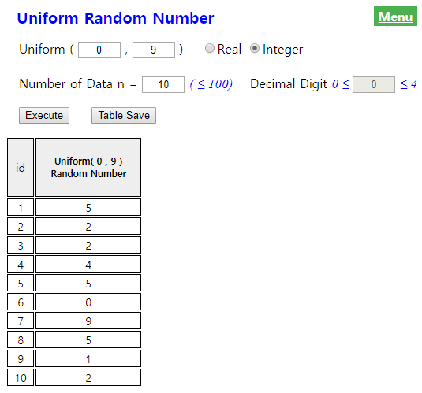{.imgFig300300}

::: figText
\<Figure 6.1.1\> 『eStatU』 Uniform random number
:::

Consider the following example of simple random sampling using this
random number generator.
:::

::: mainTableGrey
**Example 6.1.1** A class has 50 students. Select three of 50 students
as samples without replacement by using 『eStatU』.

**Answer**

In order to select three samples randomly from 50 students, a list of
students which assigned serial numbers from one to fifty must be made
first. In order to collect samples, select 'Uniform Random Number' in
『eStatU』 menu. Enter (1 and 50) at the box of 'Uniform', check
'Integer', enter 10 at the box of 'Number of Data' and click the
\[Execute\] button as shown in \<Figure 6.1.2\>. These are the random
numbers to select students, but your computer might generate different
numbers, because it depends on computer.

<input class="qrBtn" onclick="window.open(addrStr[78])" src="QR/eStatU110_RandomNum.svg" type="image"/>

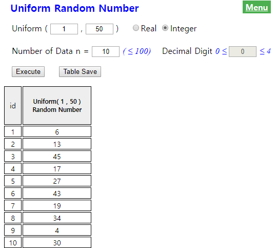{.imgFig300300}

::: figText
\<Figure 6.1.2\> 『eStatU』 Uniform(1,50) random number generation
:::

If you read the three numbers from located above, there are 6, 13 and 45
which are not overlapped and you will choose these student numbers as
samples.

Generated random numbers may have same numbers. If it is a sampling
without replacement, discard the following same number.
:::

::: mainTablePink

<input class="qrBtn" onclick="window.open(addrStr[78])" src="QR/eStatU110_RandomNum.svg" type="image"/>

**Practice 6.1.1** In a university, a survey was planned for students
and the list of students which has an id numbered 1 to 1000 was made.
Select ten students randomly using 『eStatU』 without replacement.

:::

             
:::

::: 

             

## Sampling Distribution of Sample Means and Estimation of the Population Mean

::: presentation-video-link
[presentation](pdf/060201.pdf){.presentation-link target="_blank"}   
[video](https://youtu.be/uVXqqTDdYa8){.video-link target="_blank"}
:::

::: mainTable
The purpose of statistical experiments or surveys is to find out some
information about a population. Information about the population usually
refers to a characteristic value of the population, such as the mean and
variance which are called parameters. Since it is so difficult or costly
to investigate the population parameters, they are usually estimated by
using characteristic values of a set of samples such as the sample mean
and sample variance. \<Figure 6.2.1\> is a simulation to show the
relationship between population data of size 10,000 and sample data
(approximately 10%) using 『eStatU』 which shows characteristic values
of a population are similar to characteristic values of a set of
samples.

<input class="qrBtn" onclick="window.open(addrStr[92])" src="QR/eStatU610_PopSample.svg" type="image"/>

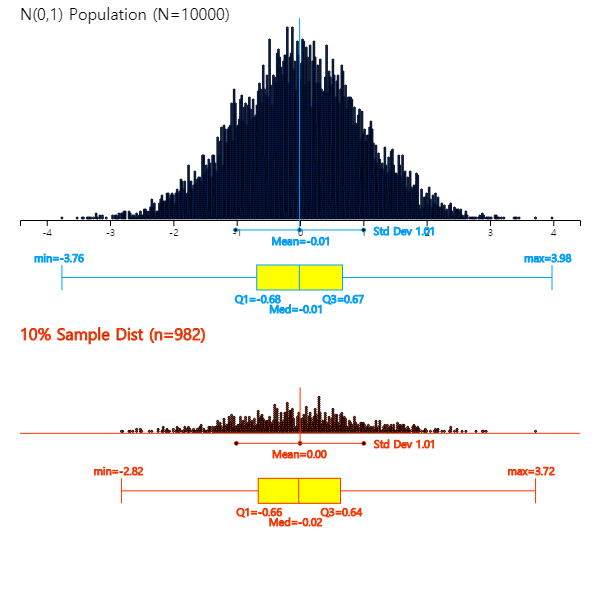{.imgFig600600}

::: figText
\<Figure 6.2.1\> Simulation to show the relationship between population
data and sample data
:::

Characteristic values of a set of samples are called sample statistic
and the distribution of the sample statistic is called a sampling
distribution. The sampling distribution identifies the relationship
between the sample statistic and the population parameter and it makes
possible to estimate and test a population parameter. In this section,
let's first look at the sampling distribution of sample means and find
out how to estimate the population mean.
:::

### Sampling Distribution of Sample Means

::: mainTable
The following example is to find out the sampling distribution of sample
means.
:::

::: mainTableGrey
**Example 6.2.1** Suppose there is a population consisting of five
salesman from a company. (Although such a small population does not
actually need to be sampled, this is an example to illustrate the
sampling distribution of sample means). Consider the number of years of
service at this company as a characteristic value of the population and
data of five salesman are as follows.

::: textLeft
6, 2, 4, 8, 10
:::

::: textL20M20
1\) Obtain the mean and variance of this population.
:::

::: textL20M20
2\) Obtain all possible samples of size two by simple random sampling
with replacement from this population and calculate means of each
sample. In addition, calculate the mean and variance of all these
possible sample means and compare them with the mean and variance of the
population.
:::

::: textL20M20
3\) Prepare a frequency distribution of all possible sample means and
draw a bar graph. Compare this bar graph with the bar graph of the
population distribution.
:::

**Answer**

::: textL20M20
1\) The mean and variance of the population is μ = 6, $σ^2$ = 8.
:::

::: textL20M20
2\) The number of all possible samples with replacement is 5 × 5 = 25.
Table 6.2.1 shows all possible samples and their sample means
($\overline x$).
:::

::: textLeft
Table 6.2.1 All possible samples of size 2 with replacement from the
population and their sample means
:::

  Sample   Sample Mean $\overline X$
  -------- ---------------------------
  2, 2     2
  2, 4     3
  2, 6     4
  2, 8     5
  2,10     6
  4, 2     3
  4, 4     4
  4, 6     5
  4, 8     6
  4,10     7
  6, 2     4
  6, 4     5
  6, 6     6
  6, 8     7
  6,10     8
  8, 2     5
  8, 4     6
  8, 6     7
  8, 8     8
  8,10     9
  10,2     6
  10,4     7
  10,6     8
  10,8     9
  10,10    10

::: textL20
Some of these sample means are exactly the same as the population mean μ
= 6, but some others such as 2 or 10 are significantly different. The
mean of all possible 25 sample means (indicated by $μ_{\overline X}$) in
Table 6.2.1 is also 6 and the variance (indicated by
$σ_{\overline X}^2$) is 4 as follows:
:::

$\qquad \small \mu_{\overline X} = \frac { 2 + 3×2 + 4×3 + 5×4 + 6×5 + 7×4 + 8×3 + 9×2 + 10} { 25} = 6$\
$\qquad \small \sigma_{\overline X}^2 = \frac {(2-6)^{2} +(3-6)^{2} \times 2 + (4-6)^{2} \times 3 + (5-6)^{2} \times 4 + (6-6)^{2} \times 5 + (7-6)^{2} \times 4 + (8-6)^{2} \times 3 + (9-6)^{2} \times 2 + (10-6)^{2}} {25} = 4$

::: textL20
What can be observed here is that the mean of all 25 possible sample
means is the same as the population mean. This fact explained that the
sample mean $\small \overline X$ is an unbiased estimator of the
population mean μ. In addition, the variance of the sample means
$σ_{\overline X}^2$ is the population variance $σ^2$ divided by the
sample size ($n$=2).
:::

::: textL20M20
3\) Table 6.2.2 shows the frequency distribution of sample means in
Table 6.2.1. The frequency distribution of all possible sample means is
called a sampling distribution of sample means when n = 2. \<Figure
6.2.2\> shows a bar graph of the population distribution and \<Figure
6.2.3\> shows the distribution of all possible sample means. As shown in
the table, the population mean is 6 and some of sample means are the
same or close to the population mean, but some of sample means are much
more different from 6. However, you can see that all possible sample
means are concentrated around the population mean 6 and, as discussed in
2), the average of all 25 sample means is 6. Also the distribution of
all possible sample means is symmetrical about the population mean 6.
:::

::: textLeft
Table 6.2.2 Frequency table of sample means
:::

  Sample Mean   Frequency   Relative Frequency
  ------------- ----------- --------------------
  2             1           0.04
  3             2           0.08
  4             3           0.12
  5             4           0.16
  6             5           0.20
  7             4           0.16
  8             3           0.12
  9             2           0.08
  10            1           0.04
                25          1.00

{.imgFig400300}

::: figText
\<Figure 6.2.2\> Population distribution
:::

{.imgFig400300}

::: figText
\<Figure 6.2.3\> Sampling distribution of 's
:::
:::

::: mainTableYellow
**Parameter, Estimator and Estimate**

The population mean is a single value, but there are many possible
sample means. The population mean μ is called a **parameter**, which is
a characteristic value of the population, and the sample mean is a
random variable that can have many different values and is usually
expressed with a capital letter such as $\overline X$ which is called an
**estimator** of the parameter μ. An observed sample mean, marked
$\overline x$ with a lowercase letter, is called an **estimate** of μ.

An **estimator** of the population variance $σ^2$ is the sample variance
$S^2$ and its observed value which is an **estimate** of $S^2$ is
denoted as $s^2$.
:::

::: mainTable
The relationship between the population mean and all possible sample
means in \[Example 6.2.1\] is observed even if the population has a
different shape of distribution. If the population is very large, it is
not possible to find all possible samples as shown in \[Example 6.2.1\]
and to find a distribution of sample means. Therefore, the following
theoretical research has been developed.

If a population is normally distributed with $N(μ, σ^2 )$, the
distribution of all possible sample means is exactly a normal
distribution such as $N(μ, \frac {σ^2 }{n} )$. If the population is an
infinite population with the mean μ and variance $σ^2$, then the
distribution of all possible sample means is approximately a normal
distribution such as $N(μ, \frac {σ^2 }{n} )$ if the sample size is
large enough. This is referred to as the Central Limit Theorem, which is
a key theory in statistics, specifically summarized as follows.
:::

::: mainTableYellow
**\[Theorem 6.2.1\]   Central Limit Theorem**

Suppose a population is not a normal distribution and its mean and
variance are μ and $σ^2$. If we select samples of size with replacement,
the distribution of all possible sample means has following
characteristics:

::: textL20M20
1\) The average of all possible sample means, $μ_{\overline X}$, is
equal to the population mean μ. (i.e., $μ_{\overline X} = μ$ )
:::

::: textL20M20
2\) The variance of all possible sample means, $σ_{\overline X}^2$, is
the population variance divided by $n$. (i.e.,
$σ_{\overline X}^2 = \frac {σ^2}{n}$ )
:::

::: textL20M20
3\) The distribution of all possible sample means is approximately a
normal distribution.
:::

The above facts can be briefly written as
$\overline {X} \sim N(μ, \frac {σ^2}{n} )$.
:::

::: mainTable
The central limit theorem is very important as a theory underlying
modern statistics. \<Figure 6.2.4\> shows a simulation using 『eStatU』
that, when a population is a normal distribution, the distribution of
sample means is also normal, but variances become smaller as the sample
size increases. .

<input class="qrBtn" onclick="window.open(addrStr[93])" src="QR/eStatU620_CLT.svg" type="image"/>

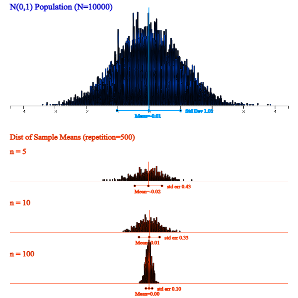{.imgFig600600}

::: figText
\<Figure 6.2.4\> Sampling distribution of sample means with different
sample sizes when population is not a normal distribution
:::

\<Figure 6.2.5\> shows a simulation using 『eStatU』 that, although a
population is skewed from its mean, the distribution of sample means is
closer to normal as the sample size increases.

<input class="qrBtn" onclick="window.open(addrStr[93])" src="QR/eStatU620_CLT.svg" type="image"/>

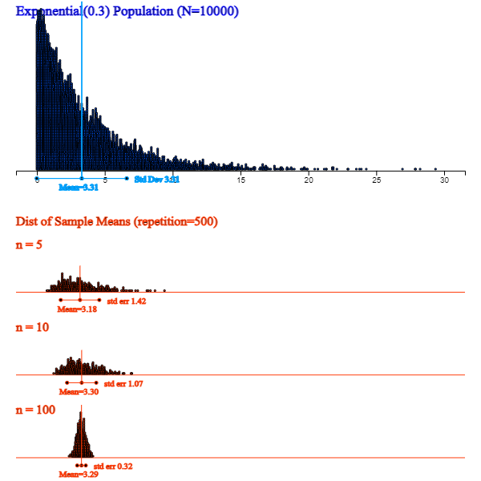{.imgFig600600}

::: figText
\<Figure 6.2.5\> 『eStatU』 Simulation of the central limit theorem
:::

:::

::: mainTablePink
### Multiple Choice Exercise

Choose one answer and click Submit button

::: textL30M30
6.1 When the population size is infinite and variance is $\sigma^2$,
what is the variance of all possible sample means,
$\sigma^2_{\overline x}$? (n is the sample size)
:::

<form name="Q1">
<label><input name="item" type="radio" value="1"/> \(\sigma^2_{\overline x}=\sigma^2\)</label> 
<label><input name="item" type="radio" value="2"/> \(\sigma^2_{\overline x}=n\sigma^2\)</label> 
<label><input name="item" type="radio" value="3"/> \(\sigma^2_{\overline x}=\frac{\sigma^2}{n}\)</label> 
<label><input name="item" type="radio" value="4"/> \(\sigma^2_{\overline x}=\frac{n\sigma^2}{n-1}\)</label> 

<input onclick="radio(6,1,Q1)" type="button" value="Submit"/>    
      <input id="ansQ1" size="15" type="text"/>

</form>

::: textL30M30
6.2 What is the quantitative measure of the characteristic of a
population?
:::

<form name="Q2">
<label><input name="item" type="radio" value="1"/> parameter</label> 
<label><input name="item" type="radio" value="2"/> variation</label> 
<label><input name="item" type="radio" value="3"/> representative</label> 
<label><input name="item" type="radio" value="4"/> statistic</label> 

<input onclick="radio(6,2,Q2)" type="button" value="Submit"/>    
      <input id="ansQ2" size="15" type="text"/>

</form>

::: textL30M30
6.3 What is the quantitative measure of the characteristic of a sample?
:::

<form name="Q3">
<label><input name="item" type="radio" value="1"/> probability</label> 
<label><input name="item" type="radio" value="2"/> statistic</label> 
<label><input name="item" type="radio" value="3"/> parameter</label> 
<label><input name="item" type="radio" value="4"/> variable</label> 

<input onclick="radio(6,3,Q3)" type="button" value="Submit"/>    
      <input id="ansQ3" size="15" type="text"/>

</form>

:::

             
:::

::: 

             

### Estimation of the Population Mean

::: presentation-video-link
[presentation](pdf/060202.pdf){.presentation-link target="_blank"}   
[video](https://youtu.be/l5tBWw6E4cM){.video-link target="_blank"}
:::

::: mainTable
When a sample survey is conducted, only one set of samples is selected
from the population to estimate a characteristic value of the
population, such as the population mean. In general, we consider the
sample mean of selected samples as an estimate of the population mean.
Do you think this sample mean can estimate the population mean well even
if it is only one set of samples?

This is a basic question on the estimation that everyone can think about
at least once. The sampling distribution of all possible sample means
which we studied in the previous section is the answer to this question.
That is, whatever a population distribution is, if the sample size is
large enough, all possible sample means are clustered around the
population mean in the form of a normal distribution. Therefore, the
sample mean obtained from one set of samples is usually close to the
population mean. Even in the worst case, the difference between the
population mean and sample mean, known as an error, is not so
significant, and it is possible to estimate the population mean by using
the sample mean. The larger the sample size, the more sample means are
concentrated around the population mean based on the central limit
theorem and hence we can reduces the error of the estimation.
:::

### Point Estimation of the Population Mean

::: mainTable
A value of one observed sample mean is called a **point estimate** of
the population mean.

In general, the sample statistic used to estimate a population parameter
must have good characteristics, so that the estimate can be accurate. If
the average of all possible sample statistics is equal to the population
parameter, then the sample statistic has a good chance to estimate the
population parameter and it is called an unbiased estimator. In the
previous section we found that a sample mean is an **unbiased
estimator** of the population mean.

If the value of a sample statistic becomes closer and closer to the
population parameter when the sample size grows, the sample statistic is
called a **consistent estimator**. The variance of all possible sample
means is closer to zero as the sample size increases by the central
limit theorem studied in the previous section, so the sample mean is
closer to the population mean. Therefore, the sample mean is a
consistent estimator of the population mean.

If a sample statistic has the least variance when there are several
unbiased estimators for the population parameter, it is called an
**efficient estimator**. The sample mean is also an efficient estimator.
Consequently, a sample mean has all good characteristics necessary to
estimate the population mean.
:::

::: mainTableYellow
**Point Estimate, Unbiased, Consistent, and Efficient Estimator**

A value of one observed sample mean is called a **point estimate** of
the population mean.

If the average value of all possible sample statistics is equal to the
population parameter, then the sample statistic is called an **unbiased
estimator** of the population parameter. The sample mean is an unbiased
estimator of the population mean.

When a sample size grows, if the value of the sample statistic becomes
closer and closer to the population parameter, the sample statistic is
called a **consistent estimator**. The sample mean is a consistent
estimator of the population mean.

If a sample statistic has the least variance when there are several
unbiased estimators for the population parameter, it is called an
**efficient estimator**. The sample mean is an efficient estimator.
:::

::: mainTableYellow
**\[Theorem 6.2.2\]**   Point estimation of the population mean μ is the
sample mean $\overline X$

(Note that $\overline X$ is an unbiased, consistent, efficient estimator
of μ).
:::

### Interval Estimation of the Population Mean -- Known Population Variance

::: mainTable
In contrast to the point estimate for the population mean, estimating by
using an interval is called an **interval estimation**. If the
population is a normal distribution with the mean μ and variance $σ^2$,
the distribution of all possible sample means is a normal distribution
with the mean μ and variance $\frac {σ^2}{n}$, so the probability that
one sample mean will be included in the interval
$μ ± 1.96 \times \frac {σ}{\sqrt{n}}$ is 95% as follows. $$ 
        P(\mu - 1.96 \times \frac {σ}{\sqrt{n}} < \overline X < \mu + 1.96 \times \frac {σ}{\sqrt{n}} ) = 0.95
      $$ We can rewrite this formula as follows. $$
        P(\overline X - 1.96 \times \frac {σ}{\sqrt{n}} < \mu < \overline X + 1.96 \times \frac {σ}{\sqrt{n}} ) = 0.95
      $$ Assuming σ is known, the meaning of the above formula is that
95% of intervals obtained by applying the formula
$[ \overline {X} - 1.96 \times \frac {σ}{\sqrt{n}}, \overline {X} + 1.96 \times \frac {σ}{\sqrt{n}} ]$
for all possible sample means include the population mean. The formula
of this interval is referred to as the 95% confidence interval of the
population mean. $$
        \left[ \overline {X} - 1.96 \times \frac {σ}{\sqrt{n}}, \overline {X} + 1.96 \times \frac {σ}{\sqrt{n}} \right]
      $$

Generally, since $\overline {X} \sim N(μ, \frac {σ^2}{n} )$, the
standardized random variable of $\overline X$,
$Z = \frac {\overline X - \mu}{\frac {\sigma}{\sqrt n}}$, follows the
standard normal distribution $N(0,1)$. Therefore, the following
probability of the standard normal random variable $Z$ is $1-α$ . $$
        P \left( -z_{\alpha/2} < \frac {\overline{X} - \mu } {\sigma/\sqrt{n}} < z_{\alpha/2} \right) = P ( -z_{\alpha/2} < Z < z_{\alpha/2} ) =  1 - \alpha
      $$ This formula can be written as follows: $$
        P \left( \mu - z_{\alpha/2} \frac {\sigma} {\sqrt{n}} <  \overline X  < \mu - z_{\alpha/2} \frac {\sigma} {\sqrt{n}} \right) =  1 - \alpha
      $$ This formula can also be written as follows: $$
        P \left( \overline X - z_{\alpha/2} \frac {\sigma} {\sqrt{n}} <  \mu  < \overline X - z_{\alpha/2} \frac {\sigma} {\sqrt{n}} \right) =  1 - \alpha
      $$ The confidence interval for the population mean μ is as follows
if the population is normally distributed and the population variance
$\sigma^2$ is known.
:::

::: mainTableYellow
**\[Theorem 6.2.3\]   100(1-α)% Confidence Interval for Population Mean
μ**

Assume a population is a normal distribution and the population variance
is known. $$
        \left[ \overline X - z_{\alpha/2} \frac {\sigma} {\sqrt{n}} , \overline X + z_{\alpha/2} \frac {\sigma} {\sqrt{n}} \right]
      $$
:::

::: mainTable
100(1-α)% here is called a **confidence level**, which refers to the
probability of intervals that will include the population mean among all
possible intervals calculated by the confidence interval formula.
Usually, we use 0.01 or 0.05 for α. $z_{α}$ is the upper α percentile of
the standard normal distribution. In other words, if $Z$ is the random
variable which follows the standard normal distribution, the probability
that $Z$ is greater than $z_{α}$ is α, i.e., $$
        P(Z > z_{α} ) = α
      $$ For example, $z_{0.025;}$ = 1.96, $z_{0.95}$ = -1.645,
$z_{0.005}$ = 2.575.

\<Figure 6.2.6\> shows a simulation of the 95% confidence interval for
the population mean by extracting 100 sets of samples with the sample
size $n$ = 20 from a population of 10,000 numbers which follow the
standard normal distribution N(0,1). In this case, 96 of the 100
confidence intervals contain the population mean 0. This result might be
different on your computer, because the program use a random number
generator which depends on computer. Whenever we repeat these
experiments, the result may also vary slightly.

<input class="qrBtn" onclick="window.open(addrStr[95])" src="QR/eStatU640_ConfIntSim.svg" type="image"/>

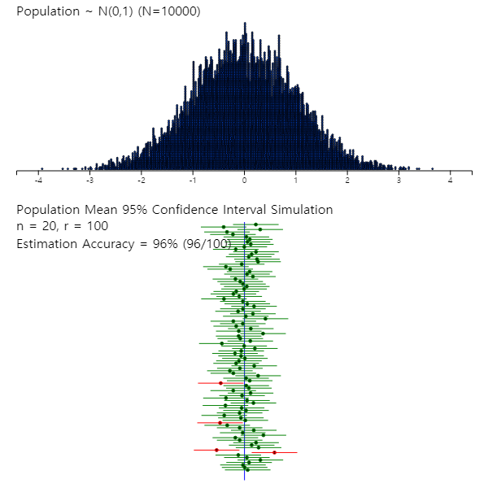{.imgFig600600}

::: figText
\<Figure 6.2.6\> 『eStatU』 Simulation of the 95% confidence interval
:::

:::

::: mainTableGrey
**Example 6.2.2** The average starting salary per month of college
graduates was 275 (unit: 10,000 KRW) after a simple random sampling of
100 college graduates this year. Assume that the starting salary for all
college graduates is a normal distribution and its standard deviation is
50.

::: textL20M20
1\) What is the point estimate the average starting salary of all
college graduates.
:::

::: textL20M20
2\) Estimate a 95% confidence interval of the average starting salary of
college graduates.
:::

::: textL20M20
3\) Estimate a 99% confidence interval of the average starting salary of
college graduates. Compare the width of this interval to the 95%
confidence interval.
:::

::: textL20M20
4\) If the sample size is increased to 400 and its average is the same,
estimate a 95% confidence interval of the average starting salary for
all college graduates. Compare the width of the interval to question 2).
:::

**Answer**

::: textL20M20
1\) Point estimation of the average starting salary is the sample mean
which is 275 (unit: 10,000 KRW).
:::

::: textL20M20
2\) Since the 95％ confidence interval implies α = 0.05, z value is as
follows.
:::

$\qquad \small z_{α/2} = z_{0.05/2} = 1.96$

::: textL20
Therefore, the 95％ confidence interval is as follows.
:::

$\qquad \small \left[ \overline X - z_{\alpha/2} \frac {\sigma} {\sqrt{n}} , \overline X + z_{\alpha/2} \frac {\sigma} {\sqrt{n}} \right]$\
$\qquad \small ⇔ [ 275 － 1.96 \frac{5}{10}, 275 ＋ 1.96 \frac{5}{10} ]$\
$\qquad \small ⇔ [274.02, 275.98]$

::: textL20M20
3\) Since the 99％ confidence interval implies = 0.01, z value is as
follows.
:::

$\qquad \small z_{α/2} = z_{0.01/2} = 2.575$

::: textL20
Hence, the 99％ confidence interval is as follows:
:::

$\qquad \small ⇔ [ 275 － 2.575 \frac{5}{10}, 275 ＋ 2.575 \frac{5}{10} ]$\
$\qquad \small ⇔ [273.71, 276.29]$

::: textL20
Therefore, if the confidence level is increasing, the width of the
confidence interval becomes wider.
:::

::: textL20M20
4\) If the sample size is 400, the 95％ confidence interval is as
follows:
:::

$\qquad \small ⇔ [ 275 － 1.96 \frac{5}{20}, 275 ＋ 1.96 \frac{5}{20} ]$\
$\qquad \small ⇔ [274.51, 275.49]$

::: textL20
Therefore, if the sample size is increasing, the width of the confidence
interval becomes narrower which is more accurate.
:::
:::

::: mainTablePink
**Practice 6.2.1** The quality manager of a large manufacturer wants to
know the average weight of raw materials. 25 samples were collected by
simple random sampling and their sample mean was 60 kg. Assume the
population standard deviation is 5 kg. Use 『eStatU』 to answer the
followings.

::: textL20M20
1\) What is the point estimation of the population mean weight of raw
materials.
:::

::: textL20M20
2\) Estimate a 95% confidence interval of the population mean weight of
raw materials.
:::

::: textL20M20
3\) Estimate a 99% confidence interval of the population mean weight of
raw materials. Compare the width of this interval to the 95% confidence
interval.
:::

::: textL20M20
4\) If the sample size is increased to 100 and its average is the same,
estimate a 95% confidence interval of the population mean weight of raw
materials. Compare the width of the interval to question 2).
:::
:::

### Interval Estimation of the Population Mean -- Unknown Population Variance

::: mainTable
One problem in estimating the unknown population mean by using the
formula of the confidence interval in the previous section is that
either the population variance may not be known or the population is not
normally distributed. If the sample size is large enough, a confidence
interval of the population mean can be obtained approximately using the
sample variance instead of the population variance on the previous
formula. However, if the sample size is small and the sample variance is
used, a confidence interval based on the t distribution should be used.

The $t$ distribution was studied by a statistician W. S. Gosset, who
worked for a brewer in Ireland, and published his study result in 1907
under the alias Student. So $t$ distribution is often referred to as
Student's $t$ distribution. The $t$ distribution is not just a single
distribution, but it is a family of distributions under a parameter
called a degree of freedom, 1,2, \... , 30, \... and denoted as
$t_1 ,t_2 , ... , t_{30} , ...$

The shape of the $t$ distribution is symmetrical about zero (y axis),
similar to the standard normal distribution, but it has a tail that is
flat and longer than the standard normal distribution. \<Figure 6.2.7\>
shows the standard normal distribution N(0,1) and $t$ distribution with
3 degrees of freedom at the same time by using the $t$ distribution
module of 『eStatU』.

<input class="qrBtn" onclick="window.open(addrStr[89])" src="QR/eStatU540_T.svg" type="image"/>

{.imgFig600400}

::: figText
\<Figure 6.2.7\> Comparison of and N(0,1)
:::

:::

::: mainTable
The $t$ distribution is closer to the standard normal distribution as
degrees of freedom increase above 30. This is why a confidence interval
can be obtained approximately by using the standard normal distribution
if the sample size is greater than 30. Denote $t_{n:α}$ as the 100(1-α)%
percentile of the $t$ distribution with $n$ degrees of freedom. For
example, $t_{7:0.05}$ is the 100(1-0.05)=95% percentile of the $t$
distribution and its value is 1.895 as \<Figure 6.2.8\>. In the standard
normal distribution, this value was 1.645. Since the $t$ distribution is
symmetrical, $t_{n:α} = -t_{n:1-α}$.

In order to find a percentile value of the $t_{7}$ distribution using
『eStatU』, click on '$t$ distribution' in the main menu of 『eStatU』
and then set the degree of freedom (df) to 7, and set the probability
value in the fifth option below the $t$ distribution graph to 0.95, then
$t_{7:0.05}$ = 1.895 will appear as \<Figure 6.2.8\>.

<input class="qrBtn" onclick="window.open(addrStr[89])" src="QR/eStatU540_T.svg" type="image"/>

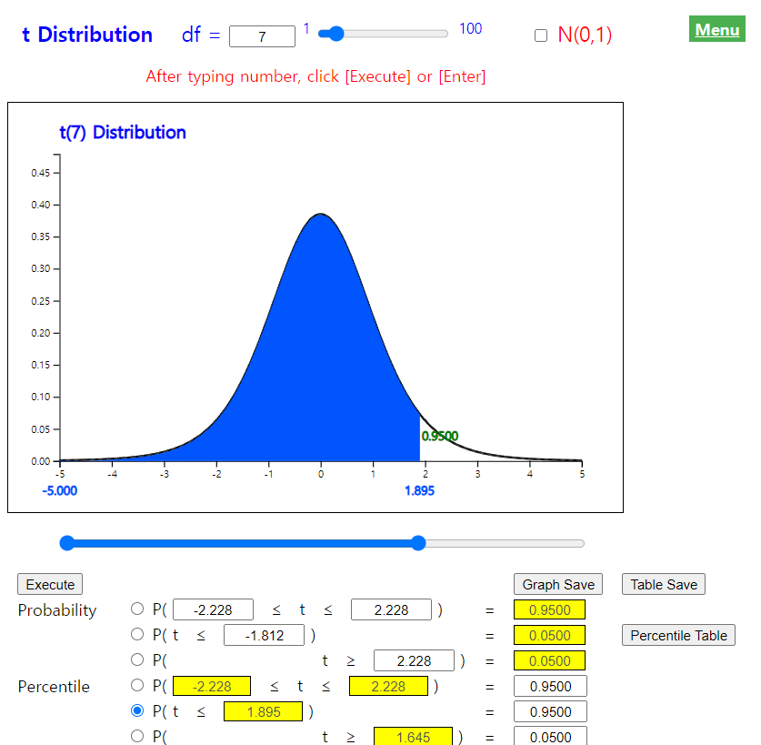{.imgFig600600}

::: figText
\<Figure 6.2.8\> Upper 5 percentile of distribution = 1.8946
:::

Consider the interval estimation of the population mean when you do not
know the population variance, but assume that the population is a normal
distribution. If $X_1 , X_2 , ... , X_n$ is the random sample of size
$n$ from the normal population, then it can be shown that the
distribution of $\frac {\overline X -\mu}{S/\sqrt{n}}$, where σ is
replaced with S, is the $t$ distribution with $n-1$ degrees of freedom.
$$
        \frac {\overline X -\mu}{\frac{S}{\sqrt{n}}} \sim t_{n-1}
      $$ Hence the probability of the (1 - α)% interval is as follows.
$$
        P \left( -t_{n-1;\alpha/2} < \frac {\overline{X} - \mu } {\sigma/\sqrt{n}} < t_{n-1:\alpha/2} \right) = 1 - \alpha
      $$ The left hand side of the above formula can be summarized as
the confidence interval for the population mean when the population
variance is unknown as follows:
:::

::: mainTableYellow
**\[Theorem 6.2.4\]  100(1-α)% Confidence Interval for Population Mean
μ**

Assume a population is a normal distribution and the population variance
$σ^2$ is unknown. $$
        \left[ \overline X - t_{n-1:\alpha/2} \frac {S} {\sqrt{n}} , \overline X + t_{n-1:\alpha/2} \frac {S} {\sqrt{n}} \right] 
      $$

where $n$ is the sample size and $S$ is the sample standard deviation.
:::

::: mainTableGrey
**Example 6.2.3** Suppose we do not know the population variance in
Example 6.2.2. If the sample size is 25 and the sample standard
deviation is 50 (unit: 10,000 KRW), estimate the mean of the starting
salary of college graduates at the 95% confidence level.

**Answer**

Since we do not know the population variance, $t$ distribution should be
used for interval estimation of the population mean.

Since $t_{n-1:\alpha/2} = t_{25-1:0.05/2} = t_{25-1:0.025} = 2.0639$,
the 95% confidence interval of the population mean is as follows.
$$ \small
        \begin{multline}
        \shoveleft \left[ \overline X - t_{n-1:\alpha/2} \frac {S} {\sqrt{n}} , \overline X + t_{n-1:\alpha/2} \frac {S} {\sqrt{n}} \right] \\
        \shoveleft ⇔ [ 275 － 2.0639(5/5) , 275 ＋ 2.0639(5/5) ] \\
        \shoveleft ⇔ [ 272.9361, 277.0639 ]
        \end{multline}
      $$ Note that the smaller the sample size, the wider the interval
width.
:::

::: mainTableGrey
**Example 6.2.4** The following data shows a simple random sampling of
10 new male students in a college this year to investigate their
heights. Use 『eStatU』 to make a 95% confidence interval of the height
of the college freshmen.

171 172 185 169 175 177 174 179 168 173

**Answer**

Click 'Estimation : μ Confidence Interval' on the menu of 『eStatU』 and
enter data at the \[Sample Data\] box as \<Figure 6.2.9\>. Then the
confidence intervals \[170.68, 177.92\] are calculated using the $t_9$
distribution.

<input class="qrBtn" onclick="window.open(addrStr[96])" src="QR/eStatU650_ConfIntMu.svg" type="image"/>

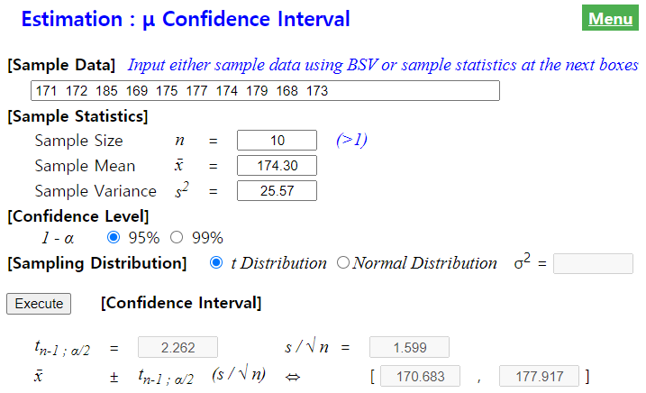{.imgFig600400}

::: figText
\<Figure 6.2.9\> 『eStatU』 Estimation for population mean
:::

In this module of 『eStatU』, a simulation experiment to investigate the
size of the confidence interval can be done by changing the sample size
$n$ and the confidence level 1 - α as in \<Figure 6.2.10\>. If you
increase $n$, the interval size becomes narrower. If you increase 1 -
&alpah, the interval size becomes wider.

{.imgFig500200}

::: figText
\<Figure 6.2.10\> Simulation experiment to investigate the size of the
confidence interval
:::

In this 『eStatU』 module, confidence intervals can be obtained by
entering the sample sizes, sample mean, and sample variance without
entering data.
:::

::: mainTablePink
**Practice 6.2.2** A salesperson found that there was a 30% chance of
selling a product when a customer visited. If one day ten customers
visit this salesman, calculate following probabilities using 『eStatU』.

In \[Practice 6.2.1\], suppose you do not know the population standard
deviation and the sample standard deviation is 5 kg. Answer the same
questions in \[Practice 6.2.1\] using 『eStatU』.
:::

::: mainTablePink
### Multiple Choice Exercise

Choose one answer and click Submit button

::: textL30M30
6.4 Which distribution is used to estimate the population mean in a
small sample with a small number of samples?
:::

<form name="Q4">
<label><input name="item" type="radio" value="1"/> Normal distribution</label> 
<label><input name="item" type="radio" value="2"/> Exponential distribution</label> 
<label><input name="item" type="radio" value="3"/> \(t\) distribution</label> 
<label><input name="item" type="radio" value="4"/> F distribution</label> 

<input onclick="radio(6,4,Q4)" type="button" value="Submit"/>    
      <input id="ansQ4" size="15" type="text"/>

</form>

::: textL30M30
6.5 The following is a description about estimation. Which explanation
is wrong?
:::

<form name="Q5">
<label><input name="item" type="radio" value="1"/> Estimation is a quantitative estimate using a sample of the characteristics of a population. </label> 
<label><input name="item" type="radio" value="2"/> There are two kinds of estimation, one is point estimation and the other is interval estimation. </label> 
<label><input name="item" type="radio" value="3"/> An estimator which is unbiased, consistent and efficient is desirable.</label> 
<label><input name="item" type="radio" value="4"/> The population standard deviation is an estimator of the sample standard deviation.</label> 

<input onclick="radio(6,5,Q5)" type="button" value="Submit"/>    
      <input id="ansQ5" size="15" type="text"/>

</form>

::: textL30M30
6.6 The weight of products produced by a company follows a normal
distribution. In order to estimate the average weight, 49 products
collected by simple random sampling and examined for their weights,
resulting in an average of 6200 grams and a standard deviation of 140
grams. What is the 95% confidence interval for the average weight of
this product?
:::

<form name="Q6">
<label><input name="item" type="radio" value="1"/> 6200 ± 32.8</label> 
<label><input name="item" type="radio" value="2"/> 6200 ± 39.2</label> 
<label><input name="item" type="radio" value="3"/> 6200 ± 52.6</label> 
<label><input name="item" type="radio" value="4"/> 6200 ± 77.4</label> 

<input onclick="radio(6,6,Q6)" type="button" value="Submit"/>    
      <input id="ansQ6" size="15" type="text"/>

</form>

::: textL30M30
6.7 Population variance of a normal population was $\sigma^2$. A sample
of size n was taken from this population to obtain a sample mean
$\overline x$. What is the 99% confidence interval for the population
mean $\mu$?
:::

<form name="Q7">
<label><input name="item" type="radio" value="1"/> \(\overline x ± 1.96\frac{\sigma}{\sqrt{n}}\)</label> 
<label><input name="item" type="radio" value="2"/> \(\overline x ± 1.96\frac{\sigma}{\sqrt{n-1}}\)</label> 
<label><input name="item" type="radio" value="3"/> \(\overline x ± 2.58\frac{\sigma}{\sqrt{n}}\)</label> 
<label><input name="item" type="radio" value="4"/> \(\overline x ± 2.58\frac{\sigma^2}{\sqrt{n}}\)</label> 

<input onclick="radio(6,7,Q7)" type="button" value="Submit"/>    
      <input id="ansQ7" size="15" type="text"/>

</form>

::: textL30M30
6.8 Out of 2,000 products made by a company, 400 were randomly extracted
to measure the weight and the sample mean was $\overline x = 25.0$ and
sample standard deviation was $s = 4.99$. Obtain a 95% confidence
interval of the population mean?
:::

<form name="Q8">
<label><input name="item" type="radio" value="1"/> \(24.5 \le \mu \le 25.5\)</label> 
<label><input name="item" type="radio" value="2"/> \(24.0 \le \mu \le 26.0\)</label> 
<label><input name="item" type="radio" value="3"/> \(24.3 \le \mu \le 25.7\)</label> 
<label><input name="item" type="radio" value="4"/> \(23.6 \le \mu \le 26.4\)</label> 

<input onclick="radio(6,8,Q8)" type="button" value="Submit"/>    
      <input id="ansQ8" size="15" type="text"/>

</form>

::: textL30M30
6.9 The average monthly income of 5,000 households which were randomly
selected in a city was 3600 US\$ and the standard deviation was 500
US\$. Obtain a 95% confidence interval of the city's monthly income.
:::

<form name="Q9">
<label><input name="item" type="radio" value="1"/> \(3600 ± 1.96 \times \frac{500}{\sqrt{5000}}\)</label> 
<label><input name="item" type="radio" value="2"/> \(3600 ± 2.58 \times \frac{500}{\sqrt{5000}}\)</label> 
<label><input name="item" type="radio" value="3"/> \(3600 ± 1.64 \times \frac{500}{\sqrt{5000}}\)</label> 
<label><input name="item" type="radio" value="4"/> \(3600 ± 2.33 \times \frac{500}{\sqrt{5000}}\)</label> 

<input onclick="radio(6,9,Q9)" type="button" value="Submit"/>    
      <input id="ansQ9" size="15" type="text"/>

</form>

::: textL30M30
6.10 A sample of size 49 was taken from a population with a population
standard deviation $\sigma$ = 5. If the sample mean is $\overline x$ =
16.2, what is a 95% confidence interval for the population mean ?
:::

<form name="Q10">
<label><input name="item" type="radio" value="1"/> (13.8, 16.6) </label> 
<label><input name="item" type="radio" value="2"/> (13.4, 17.0) </label> 
<label><input name="item" type="radio" value="3"/> (13.6, 16.8) </label> 
<label><input name="item" type="radio" value="4"/> (13.2, 17.2) </label> 

<input onclick="radio(6,10,Q10)" type="button" value="Submit"/>    
      <input id="ansQ10" size="15" type="text"/>

</form>

::: textL30M30
6.11 When a population follows a normal distribution and a random sample
of size 25 was selected, the sample mean was 14.6 and sample standard
deviation was 5. What if we get a 95% confidence interval for the
population mean?
$t_{24: 0.05} = 2.064, t_{24: 0.01} = 2.797, t_{25: 0.05} = 2.060, t_{25: 0.01} = 2.787, t_{26: 0.05} = 2.056, t_{26: 0.01} = 2.779$
:::

<form name="Q11">
<label><input name="item" type="radio" value="1"/> 14.6 ± 2.787</label> 
<label><input name="item" type="radio" value="2"/> 14.6 ± 2.056</label> 
<label><input name="item" type="radio" value="3"/> 14.6 ± 2.064</label> 
<label><input name="item" type="radio" value="4"/> 14.6 ± 2.779</label> 

<input onclick="radio(6,11,Q11)" type="button" value="Submit"/>    
      <input id="ansQ11" size="15" type="text"/>

</form>

:::

             
:::

::: 

             

## Sampling Distribution of Sample Variances and Estimation of the Population Variance

::: presentation-video-link
[presentation](pdf/060301.pdf){.presentation-link target="_blank"}   
[video](https://youtu.be/tp65U_JACQg){.video-link target="_blank"}
:::

::: mainTable
If we know the relationship between the population variance and the
sample variance, it is possible to estimate the population variance. In
this section, the distribution of all possible sample variances is
discussed in section 6.3.1 and the estimation of the population variance
using the sample variance is discussed in section 6.3.2.
:::

### Sampling Distribution of Sample Variances

::: mainTable
Consider the following example to understand the sampling distribution
of sample variances.
:::

::: mainTableGrey
**Example 6.3.1** Let's consider the data again in Example 6.2.1 which
is the number of years of service for five salespeople in a company.

6, 2, 4, 8, 10

::: textL20M20
1\) Calculate the population variance.
:::

::: textL20M20
2\) Find all possible samples of size 2 with replacement and calculate
the sample variance of each sample. In addition, calculate the average
and variance of all sample variances and compare them to the population
variance.
:::

::: textL20M20
3\) Find the frequency distribution of all possible sample variances and
draw its bar graph.
:::

**Answer**

::: textL20M20
1\) The population mean is μ = 6 and the population variance is $σ^2$ =
8.
:::

::: textL20M20
2\) All possible samples of size 2 with replacement from the population
and the sample variance of each sample are as in Table 6.3.1.
:::

::: textLeft
Table 6.3.1 All possible samples of size 2 with replacement from the
population and the sample variance of each sample
:::

  Sample   Sample Variance $s^2$
  -------- -----------------------
  2, 2     0
  2, 4     2
  2, 6     8
  2, 8     18
  2,10     32
  4, 2     2
  4, 4     0
  4, 6     2
  4, 8     8
  4,10     18
  6, 2     8
  6, 4     2
  6, 6     0
  6, 8     2
  6,10     8
  8, 2     18
  8, 4     8
  8, 6     2
  8, 8     0
  8,10     2
  10,2     32
  10,4     18
  10,6     8
  10,8     2
  10,10    0

::: textL20
As discussed in \[Example 6.2.1\], the sample variance is also a random
variable that can have many values, so it is denoted as $S^2$ and the
observed sample variance as $s^2$. Table 6.3.1 shows that some of these
sample variances are exactly the same as the population variance $σ^2$ =
8, others such as 0 or 32 are significantly different from 8. The
average of all possible sample variances, denoted as $\mu_{s^2}$, is as
follows.

$\qquad \small \mu_{s^2} = \frac {0 \times 5 + 2 \times 8 + 8 \times 6 + 18 \times 4 + 32 \times 2} {25} = 8$

Note that the average of all possible sample variances is the same as
the population variance which means the sample variance is an unbiased
estimate of the population variance.
:::

::: textL20M20
3\) Table 6.3.2 shows the frequency distribution of all possible sample
variances and \<Figure 6.3.1\> is its bar graph. This is called the
sampling distribution of sample variances. The fact that can be observed
in this Figure is that there are many small sample variances and there
are few large sample variances. In addition, the average of all sample
variances, , is equal to the population variance . In other words, the
sample variance is an unbiased estimate of the population variance.
:::

::: textLeft
Table 6.3.2 Frequency table of sample variances
:::

  Sample Variance   Frequency   Relative Frequency
  ----------------- ----------- --------------------
  0                 5           0.20
  2                 8           0.32
  8                 6           0.24
  18                4           0.16
  32                2           0.08
  total             25          1.00

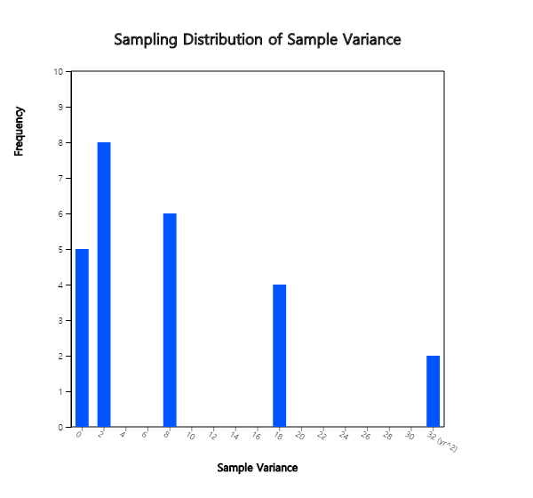{.imgFig400300}

::: figText
\<Figure 6.3.1\> Sampling distribution of sample variances
:::
:::

::: mainTable
As observed in the above example, the sampling distribution of the
sample variances is an asymmetric distribution with many small sample
variances and a few large sample variances. In general, when the
population is normally distributed and the population variance is $σ^2$,
all possible sample variances scaled by a constant follow the chi-square
$χ^2$ distribution. More accurately, the sample statistic $$
       \frac {(n-1)S^2}{\sigma^2}
      $$ follows a chi-square distribution with $n-1$ degrees of
freedom.

This chi-square distribution is a family of distributions depending on
the degree of freedom, such as
$χ^2_{1} , χ^2_{2} , ... , χ^2_{27} , ...$ etc. The chi-square
distribution is an asymmetrical distribution as \<Figure 6.3.2\>. If the
degree of freedom is small, the shape of the chi-square distribution is
much skewed to the right.

{.imgFig400300}

::: figText
\<Figure 6.3.2\> Chi-square distributions for different degrees of
freedoms
:::

A cumulated probability and a percentile of the chi-square distribution
can be calculated by using 『eStatU』 as in \<Figure 6.3.3\>.

<input class="qrBtn" onclick="window.open(addrStr[90])" src="QR/eStatU560_Chi.svg" type="image"/>

{.imgFig600600}

::: figText
\<Figure 6.3.3\> 『eStatU』 Chi-square distribution
:::

The sampling distribution of all sample variances is summarized as
follows:
:::

::: mainTableYellow
**\[Theorem 6.3.1\]   The sampling distribution of sample variances**

When the population is normally distributed and the sample of size $n$
is selected randomly with replacement, the distribution of all sample
variances multiplied by a specific constant follows the chi-square
distribution with $n-1$ degrees of freedom as follows. $$
       \frac {(n-1)S^2}{\sigma^2} \sim \chi^2_{n-1}
      $$
:::

             
:::

::: 

      
:::

      

### Estimation of the Population Variance

::: presentation-video-link
[presentation](pdf/060302.pdf){.presentation-link target="_blank"}   
[video](https://youtu.be/VwHehPGGBx4){.video-link target="_blank"}
:::

::: mainTable
Examples of estimating the population variance are as follows.

::: textL30M10
- Two companies supply bolts to an automobile maker. Bolts are
defective if they are too large or too small in diameter. The automobile
maker wants to know the variance of bolt diameters supplied by each bolt
company and use them as data for selecting the better one.

- In order to evaluate the difficulty of the college entrance exam
conducted this year, the variance of exam scores is calculated and
compared with the variance of exam scores in previous year.
:::

In order to estimate the population variance, the sampling distribution
of all possible sample variances should be used. As discussed in
\[Example 6.3.1\], for an infinite population, the mean of all possible
sample variances is the population variance. That is, the sample
variance $S^2$ is an unbiased estimator of the population variance
$σ^2$. Therefore, the sample variance is used to estimate the population
variance. In addition, estimation of the population standard deviation
$σ$uses the sample standard deviation $S$, but it should be noted that
the sample standard deviation is not an unbiased estimator of the
population standard deviation. However, as the sample size increases,
there is no significant error in using $S$ as an estimator of $σ$.
:::

::: mainTableYellow
**\[Theorem 6.3.2\]** **Point estimation of the population variance
$σ^2$**\
⇒ Sample variance $S^2$ ($S^2$ is an unbiased estimator of $σ^2$)

**Point estimation of the population standard deviation $σ$**\
⇒ Sample standard deviation $s$ ($s$ is not an unbiased estimator of
$σ$)
:::

::: mainTable
In the previous section, when a population was normally distributed, we
found that the sample variance multiplied by a constant,
$\frac {(n-1)S^2}{\sigma^2}$, follows the chi-square distribution with
$n-1$ degrees of freedom. Using this, we can find the confidence
interval of the population variance $σ^2$ as follows:
:::

::: mainTableYellow
**\[Theorem 6.3.3\]** **100(1-α)% Confidence interval of the population
variance $σ^2$**

Assume that a population is normally distributed. $$
        \left[ \frac {(n-1)S^2}{\chi^2_{n-1: α/2} }, \frac {(n-1)S^2}{\chi^2_{n-1: 1-α/2} } \right]
      $$ where $S^2$ is the sample variance, $χ^2_{k:p}$ is the
100$(1-p)$ percentile of the chi-square distribution with $k$ degrees of
freedom.

**100(1-α)% Confidence interval of the population standard deviation
$σ$**

Assume a population is normally distributed and the sample size is
large. $$
        \left[ \sqrt { \frac {(n-1)S^2}{\chi^2_{n-1: α/2} } }, \sqrt { \frac {(n-1)S^2}{\chi^2_{n-1: 1-α/2} } }\right]
      $$
:::

::: mainTableGrey
**Example 6.3.2** A survey for the starting salary of 25 college
graduates this year shows the sample standard deviation is 5 (unit
10000won). Find point estimation and 95% confidence interval of the
population variance and the population standard deviation of the
starting salary. Assume that the population is normally distributed.

**Answer**

The point estimate of the population variance for the starting salary of
college graduate is the sample variance, so $s^2 = 5^2 =$ 25. Since the
point estimate of the population standard deviation is the sample
standard deviation, so $s =$ 5.

The 95% confidence interval of the population variance is as follows.
$$ \small
        \begin{multline}
        \shoveleft \left[ \frac {(n-1)S^2}{\chi^2_{25-1: 0.05/2} }, \frac {(n-1)S^2}{\chi^2_{25-1: 1-0.05/2} } \right] \\
        \shoveleft ⇒ \left[ \frac {(25-1)5^2}{39.364}, \frac {(25-1)5^2}{12.401} \right] \\
        \shoveleft ⇒ \left[ 15.242, 48.383 \right]
        \end{multline}
      $$ The 95% confidence interval of the population standard
deviation is as follows. $$ \small
        \begin{multline}
        \shoveleft ⇒ \left[ \sqrt{15.242}, \sqrt{48.383} \right] \\
        \shoveleft ⇒ \left[ 3.904, 6.956 \right]
        \end{multline}
      $$
:::

::: mainTableGrey
**Example 6.3.3** The height data of 10 male samples from freshmen in a
college is as follows:

171 172 185 169 175 177 174 179 168 173

Using 『eStatU』, find a 95% confidence interval for estimating the
population variance of college freshmen.

**Answer**

On the menu of 『eStatU』, click 'Estimation : $σ^2$ Confidence
Interval' and enter data in the \[Sample Data\] box as shown in \<Figure
6.3.4\>. The system will show the confidence interval \[12.10, 85.21\]
immediately by using the chi-square distribution.

<input class="qrBtn" onclick="window.open(addrStr[98])" src="QR/eStatU660_ConfIntSigma.svg" type="image"/>

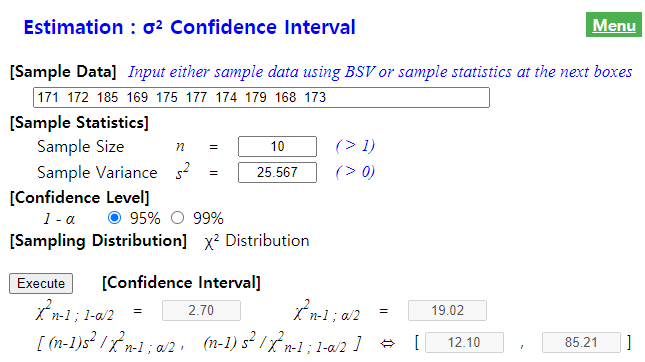{.imgFig600400}

::: figText
\<Figure 6.3.4\> 『eStatU』 Estimation of population variance
:::

In this module of 『eStatU』, a simulation experiment to investigate the
size of the confidence interval can be done by changing the sample size
$n$ and the confidence level 1 - α as in \<Figure 6.3.5\>. If you
increase $n$, the interval size becomes narrower. If you increase 1 - α,
the interval size becomes wider.

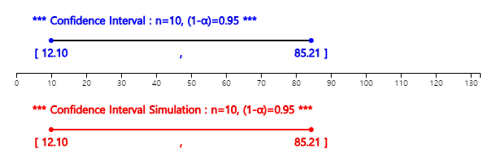{.imgFig500200}

::: figText
\<Figure 6.3.5\> 『eStatU』 simulation for the confidence interval of
the population variance
:::

You can enter only the sample size and sample variance to calculate the
confidence interval in this 『eStatU』 module without entering data.
:::

::: mainTablePink

<input class="qrBtn" onclick="window.open(addrStr[98])" src="QR/eStatU660_ConfIntSigma.svg" type="image"/>

**Practice 6.3.1** A team of health researchers wants to measure the
average amount of oxygen consumed after a certain standard exercise for
men between ages of 17 and 21. Data of a simple random sampling of 10
persons are as follows.

2.87 2.05 2.90 2.41 2.93 2.94 2.26 2.21 2.20 2.88

Use 『eStatU』 to find a 95% confidence interval of the population
variance of oxygen consumed.

:::

::: mainTablePink
### Multiple Choice Exercise

Choose one answer and click Submit button

::: textL30M30
6.12 What is the most appropriate sample statistic to estimate the
population variance when we collect $n$ samples by simple random
sampling from a normal population?
:::

<form name="Q12">
<label><input name="item" type="radio" value="1"/> standard deviation   </label> 
<label><input name="item" type="radio" value="2"/> sample variance</label> 
<label><input name="item" type="radio" value="3"/> sum of squares</label> 
<label><input name="item" type="radio" value="4"/> \(\frac{1}{n}\) of sum of squares</label> 

<input onclick="radio(6,12,Q12)" type="button" value="Submit"/>    
      <input id="ansQ12" size="15" type="text"/>

</form>

::: textL30M30
6.13 If the measured values of a sample collected randomly are
$x_1 , x_2 , ... , x_n$ and their sample mean is $\overline x$, which of
the following is an unbiased estimator of the population variance?
:::

<form name="Q13">
<label><input name="item" type="radio" value="1"/> \(\frac{1}{n}\sum|x_i - \overline x |\)</label> 
<label><input name="item" type="radio" value="2"/> \(\frac{1}{n}(\sum x_i^2 - (n-1){\overline x}^2 )\)</label> 
<label><input name="item" type="radio" value="3"/> \(\frac{1}{n}(\sum x_i^2 - n{\overline x}^2 )\)</label> 
<label><input name="item" type="radio" value="4"/> \(\frac{1}{n-1}\sum(x_i - \overline x)^2\)</label> 

<input onclick="radio(6,13,Q13)" type="button" value="Submit"/>    
      <input id="ansQ13" size="15" type="text"/>

</form>

:::

      

      

::: 

             

## Sampling Distribution of Sample Proportions and Estimation of the Population Proportion

::: presentation-video-link
[presentation](pdf/060401.pdf){.presentation-link target="_blank"}   
[video](https://youtu.be/flhKiXkixCE){.video-link target="_blank"}
:::

::: mainTable
If we know the relationship between the population proportion and sample
proportion, it is possible to estimate the population proportion. In
this section, the distribution of all possible sample proportions is
discussed in section 6.4.1 and the estimation of the population
proportion using the sample proportion is discussed in section 6.4.2.
:::

### Sampling Distribution of Sample Proportions

::: mainTable
Consider the sampling distribution of all possible sample proportions by
using the following example.
:::

::: mainTableGrey
**Example 6.4.1** Consider a population consists of only 10 employees of
a company. When employees' satisfaction level for the company is
investigated and the satisfaction is expressed as 1, the complaint is 0
as follows.

1 0 1 1 0 1 1 0 0 1

That is, the population proportion $p$ of the satisfaction is 0.6 (6
'1's out of 10). Consider all possible samples of size 5 with
replacement to obtain a sampling distribution of sample proportions. (It
is to illustrate the sample variance of sample proportions, although it
is not necessary to extract samples from such a small population.)

**Answer**

The population proportion is $p$ = 0.6 and the distribution of '1' and
'0' in the population consisting of 10 persons is as \<Figure 6.4.1\>.

{.imgFig400300}

::: figText
\<Figure 6.4.1\> Population distribution of employees' satisfaction, no
for 0 or yes for 1
:::

Total number of possible samples of size 5 with replacement is
10×10×10×10×10 = 100000 and the number of cases of possible sample
proportions are as in Table 6.4.1.

::: textLeft
Table 6.4.1 All possible sample cases
:::

  Sample Case                      Number of Cases
  -------------------------------- ----------------------------------------
  all unsatisfactory (0,0,0,0,0)   $\small {}_{5}C_{0}$×4×4×4×4×4 = 1024
  1 satisfactory (0,0,0,0,1)       $\small {}_{5}C_{1}$×4×4×4×4×6 = 7680
  2 satisfactory (0,0,0,1,1)       $\small {}_{5}C_{2}$×4×4×4×6×6 = 23040
  3 satisfactory (0,0,1,1,1)       $\small {}_{5}C_{3}$×4×4×6×6×6 = 34560
  4 satisfactory (0,1,1,1,1)       $\small {}_{5}C_{4}$×4×6×6×6×6 = 25920
  5 satisfactory (1,1,1,1,1)       $\small {}_{5}C_{5}$×6×6×6×6×6 = 7776
  Total                            100000

If the sample proportion ($\hat p$) is obtained from each case, the
sampling distribution of all possible sample proportions is as Table
6.4.2. The cases of three satisfactory (the sample proportion of 0.6)
are most likely.

::: textLeft
Table 6.4.2. Sampling Distribution of Sample Proportions
:::

  Sample Case                      Sample Proportion $\hat p$   Frequency   Relative Frequency
  -------------------------------- ---------------------------- ----------- --------------------
  all unsatisfactory (0,0,0,0,0)   0.0                          1024        0.01024
  1 satisfactory (0,0,0,0,1)       0.2                          7680        0.07680
  2 satisfactory (0,0,0,1,1)       0.4                          23040       0.23040
  3 satisfactory (0,0,1,1,1)       0.6                          34560       0.34560
  4 satisfactory (0,1,1,1,1)       0.8                          25920       0.25920
  5 satisfactory (1,1,1,1,1)       1.0                          7776        0.07776
                                   Total                        100000      1.00000

\<Figure 6.4.2\> shows the sampling distribution of all possible sample
proportions. If the sample size is larger, sample proportions are
symmetrical around the population proportion 0.6 which is similar to
that of sample means, and is close to a normal distribution.

{.imgFig400300}

::: figText
\<Figure 6.4.2\> Sampling distribution of sample proportions
:::
:::

::: mainTable
When the sample size is large, the sampling distribution of all possible
sample means in general is as follows:
:::

::: mainTableYellow
**\[Theorem 6.4.1\]   Sampling distribution of sample proportions**

Assume the population is infinite and the population proportion is $p$.
If $\hat p$ is the sample proportion and the sample size $n$ is large,
the sampling distribution of all possible sample proportions is
approximately a normal distribution with the mean $p$ and variance
$\frac {p(1-p)}{n}$ . $$
        \hat p  \sim N \left( p, \frac{p(1-p)}{n} \right)
      $$
:::

::: mainTable
If the population size is $N$ which is finite and the sampling is
without replacement, the variance of $\hat p$ becomes
$\frac{p(1-p)}{n} \frac{N-n}{N-1}$. The term $\frac{N-n}{N-1}$ is called
the finite population correction factor.
:::

::: mainTableGrey
**Example 6.4.2** Let's say 3% of semiconductors made in a
semiconductor factory are defective. When 300 samples were taken without
replacement, the sample proportion for defective products was 2%. Find
out where this sample proportion is located among all possible sample
proportions. What is the probability that the sample proportion is
greater than 2%?

**Answer**

Since the sampling distribution of the sample proportions is
approximately normal distribution,
$\hat p \sim N \left( p, \frac{p(1-p)}{n} \right)$, the probability can
be calculated as follows:

$\quad \small P(\hat p \gt 0.02) = P( Z \gt \frac{0.02-0.03}{0.00985} ) = P(Z \gt -1.02) = 1 - P(Z \le -1.02)  = 1 - 0.1539 = 0.8461$
:::

             
:::

::: 

             

### Estimation of the Population Proportion

::: presentation-video-link
[presentation](pdf/060402.pdf){.presentation-link target="_blank"}   
[video](https://youtu.be/HpVrvVEIGQk){.video-link target="_blank"}
:::

::: mainTable
Some practical examples to estimate the population proportion are as
follows.

::: textL30M10
- What is the approval rating of a particular political party in this
year's election?

- What is the percentage of the current unemployment rate?

- What percentage of defective products we would have if we imported
10,000 car accessories?
:::

Assume that the proportion of a population is $p$. As discussed in
Section 6.1, since the sample proportion, $\hat p$, meets all the
criteria of a good estimator when estimating the population proportion
$p$, the sample proportion is used to estimate the population
proportion. The sampling distribution of all possible sample proportions
is approximately a normal distribution with the mean $p$ and variance
$\frac{p(1-p)}{n}$ and the standard error of the sample proportions is
$\sqrt{\frac{p(1-p)}{n}}$. But, since the population proportion $p$ is
unknown, we use $\sqrt{\frac{\hat p(1- \hat p)}{n}}$ as an estimate of
the standard error of the sample proportions.
:::

::: mainTableYellow
**\[Theorem 6.4.2\]   Point estimate of the population proportion $p$**

⇒ The sample proportion $\hat p$.

The sample proportion ($\hat p$) is an unbiased, efficient and
consistent estimator of the population proportion $p$ and the estimate
of the standard error of $\hat p$ is
$\sqrt{\frac{\hat p(1- \hat p)}{n}}$.
:::

::: mainTable
From the fact that the distribution of the sample proportion $\hat p$ is
approximated to a normal distribution, interval estimation of the
population proportion $p$ can be done as follows.
:::

::: mainTableYellow
**\[Theorem 6.4.3\]   Interval estimation of the population proportion**

If the population proportion is $p$, 100(1-α)% confidence interval of
$p$ when the sample size $n$ is large is as follows. $$
        \left[ \hat p - z_{α/2} \sqrt{\frac{\hat p (1-\hat p)}{n} },  \hat p + z_{α/2} \sqrt{\frac{\hat p (1-\hat p)}{n} } \right]
      $$

Criteria of large sample size $n$ are
$n \hat p > 5 , n (1- \hat p ) > 5$.
:::

::: mainTableGrey
**Example 6.4.3** A student running for the president of a student body
in a university had a survey of 200 students to find out his approval
ratings, and found that 120 students supported him. Find a point
estimate of his approval rating in the population, and find a 95%
confidence interval. Check the interval estimation using 『eStatU』.

**Answer**

The point estimate of the population approval rating is the sample
proportion.

$\qquad \quad \small \hat p = \frac {120}{200} = 0.6$

The 95% confidence interval is as follows: $$  \small
        \begin{multline}
        \shoveleft \left[ \hat p - z_{α/2} \sqrt{\frac{\hat p (1-\hat p)}{n} },  \hat p + z_{α/2} \sqrt{\frac{\hat p (1-\hat p)}{n} } \right] \\
        \shoveleft ⇔ \left[ 0.6 - 1.96 \sqrt{\frac{0.6(1-0.6)}{200} }, 0.6 + 1.96 \sqrt{\frac{0.6(1-0.6)}{200} } \right] \\
        \shoveleft ⇔ \left[ 0.532 , 0.668 \right]
        \end{multline}
      $$ In 『eStatU』, enter data in the \[Sample Data\] box as shown
in \<Figure 6.4.3\> and click the \[Execute\] button to calculate the
confidence interval \[0.5321, 0.6679\] using the normal distribution.

<input class="qrBtn" onclick="window.open(addrStr[99])" src="QR/eStatU670_ConfIntP.svg" type="image"/>

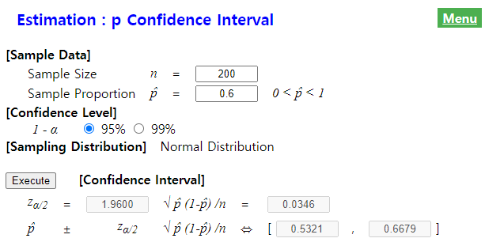{.imgFig600400}

::: figText
\<Figure 6.4.3\> 『eStatU』 Estimation of the population proportion
:::

In this module of 『eStatU』, a simulation experiment to investigate the
size of the confidence interval can be done by changing the sample size
$n$ and the confidence level 1 - α as in \<Figure 6.4.4\>. If you
increase $n$, the interval size becomes narrower. If you increase 1 - α,
the interval size becomes wider.

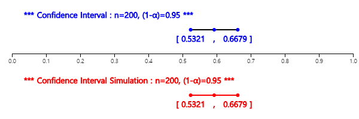{.imgFig500200}

::: figText
\<Figure 6.4.4\> Simulation for estimating the population proportion
:::
:::

::: mainTablePink

<input class="qrBtn" onclick="window.open(addrStr[99])" src="QR/eStatU670_ConfIntP.svg" type="image"/>

**Practice 6.4.1** 200 workers were selected to investigate the causes
of worker turnover. Of the 200, 140 said they moved because they could
not reconcile with their superiors. Find a 95% confidence interval in
the mobile rate for those who have transferred using 『eStatU』.

:::

::: mainTablePink
### Multiple Choice Exercise

Choose one answer and click Submit button

::: textL30M30
6.14 400 voters are randomly selected from a city and polled. 240 voters
answered 'yes' for an issue and the rest were against it. Obtain a 95%
confidence interval for the population proportion of 'yes'.
:::

<form name="Q14">
<label><input name="item" type="radio" value="1"/> \(0.55 \le p \le 0.65\)</label> 
<label><input name="item" type="radio" value="2"/> \(0.50 \le p \le 0.70\)</label> 
<label><input name="item" type="radio" value="3"/> \(0.45 \le p \le 0.75\)</label> 
<label><input name="item" type="radio" value="4"/> \(0.40 \le p \le 0.80\)</label> 

<input onclick="radio(6,14,Q14)" type="button" value="Submit"/>    
      <input id="ansQ14" size="15" type="text"/>

</form>

::: textL30M30
6.15 In a parliamentary election, 60 voters are selected randomly in a
district and 36 of them support the candidate A. Obtain a 95% confidence
interval that support the candidate A?
:::

<form name="Q15">
<label><input name="item" type="radio" value="1"/> \(0.576 \le p \le 0.760\)</label> 
<label><input name="item" type="radio" value="2"/> \(0.576 \le p \le 0.824\)</label> 
<label><input name="item" type="radio" value="3"/> \(0.440 \le p \le 0.760\)</label> 
<label><input name="item" type="radio" value="4"/> \(0.440 \le p \le 0.824\)</label> 

<input onclick="radio(6,15,Q15)" type="button" value="Submit"/>    
      <input id="ansQ15" size="15" type="text"/>

</form>

:::

             
:::

::: 

             

## Determination of the Sample Size

::: presentation-video-link
[presentation](pdf/0605.pdf){.presentation-link target="_blank"}   
[video](https://youtu.be/KmwDF6NGkBo){.video-link target="_blank"}
:::

::: mainTable
Until now, we have studied the estimation of a population parameter
using a given sample. However, it is often necessary to first determine
how large a sample should be before obtaining such a sample. This
problem is closely related to the precision of the estimate. We could
see in the previous section that the width of the confidence interval
was reduced if the sample size is larger. However, as sampling is
costly, it usually determines the minimum sample size required to
achieve this precision that would satisfy the researcher.
:::

### Determination of the Sample Size to Estimate the Population Mean

::: mainTable
The 100(1-α)% confidence interval of a population mean μ is as follows
as explained in section 6.2. $$
        \left[ \overline X - z_{\alpha/2} \frac {\sigma} {\sqrt{n}} , \overline X + z_{\alpha/2} \frac {\sigma} {\sqrt{n}} \right]
      $$ The term $z_{\alpha/2} \frac {\sigma} {\sqrt{n}}$ which is the
half size of the confidence interval is called the **maximum allowable
error bound** to estimate the population mean and is denoted as $d$.

If the maximum allowable error bound and the confidence level 1-α are
given, the sample size can be determined by solving the following
equation. $$
        z_{\alpha/2} \frac {\sigma} {\sqrt{n}} = d
      $$ The solution of $n$ in the above equation is as follows. $$
        n = {\left( \frac { z_{\alpha/2} {\sigma} } {d} \right)}^2
      $$
:::

::: mainTableYellow
**\[Theorem 6.5.1\]   Determination of the sample size to estimate the
population mean**

If the maximum allowable error bound $d$ and the confidence level
1-$\alpha$ are given, the sample size $n$ can be determined as follows:
$$
        n = {\left( \frac { z_{\alpha/2} {\sigma} } {d} \right)}^2
      $$
:::

::: mainTable
Since the population standard deviation σ in the above equation is
usually unknown, the estimated value from past experience or from data
obtained by a preliminary survey is used. The estimation of the
population standard deviation σ through a preliminary survey can be done
by using the range as follows: $$
        \hat \sigma = \frac {range}{4} = \frac {max - min}{4}
      $$
:::

::: mainTableGrey
**Example 6.5.1** The expected life of light bulbs produced at a plant
has a standard deviation 100 hours. In order to estimate the average
life of a bulb at the 95% confidence level, determine the sample size to
be within 20 hours of the allowable error bound. Check this calculation
using 『eStatU』.

**Answer**

$\qquad \small n = {\left( \frac { z_{\alpha/2} {\sigma} } {d} \right)}^2 = {\left( \frac { 1.96 \times 100} {20} \right)}^2 = 9.8^2 = 96.04$

Hence the sample size is 96 approximately.

In 『eStatU』, select the menu 'Estimation : μ - Sample Size '. Enter
the margin of Error $d$ = 20, the population standard deviation σ = 100
and confidence level 1-α = 0.95 as in \<Figure 6.5.1\>, then click the
\[Execute\] button to calculate the sample size $n$.

<input class="qrBtn" onclick="window.open(addrStr[97])" src="QR/eStatU65N_ConfIntMuN.svg" type="image"/>

{.imgFig500200}

::: figText
\<Figure 6.5.1\> Determination of sample size for estimating
:::

:::

::: mainTablePink

<input class="qrBtn" onclick="window.open(addrStr[97])" src="QR/eStatU65N_ConfIntMuN.svg" type="image"/>

**Practice 6.5.1** A company with 10,000 workers wants to estimate the
average time it takes to commute. The surveyor wants to estimate that
the maximum margin error bound is less than 5 minutes at the 95%
confidence level. If the estimate of the population variance obtained
from the preliminary study was $σ^2$ = 25, what size of the sample
should be extracted?

:::

### Determination of the Sample Size to Estimate the Population Proportion

::: mainTable
As explained in section 6.4, the 100(1-α)% confidence interval of a
population proportion $p$ is as follows. $$
        \left[ \hat p - z_{α/2} \sqrt{\frac{\hat p (1-\hat p)}{n} },  \hat p + z_{α/2} \sqrt{\frac{\hat p (1-\hat p)}{n} } \right]
      $$

The term $z_{α/2} \sqrt{\frac{\hat p (1-\hat p)}{n} }$ which is the half
size of the confidence interval is called the **maximum allowable error
bound** to estimate the population proportion and is denoted as $d$.

Therefore, if the maximum allowable error bound $d$ and the confidence
level 1-α are given, the sample size can be determined by solving the
following equation. $$
        z_{α/2} \sqrt{\frac{\hat p (1-\hat p)}{n} } = d
      $$ The solution of the above equation is as follows. $$
        n = \hat p (1-\hat p) {\frac{z_{α/2}}{d}}^2  
      $$
:::

::: mainTableYellow
**\[Theorem 6.5.2\]   Determination of the sample size to estimate the
population proportion.**

If the maximum allowable error bound $d$ and the confidence level 1 - α
are given, the sample size can be determined as follows: $$
        n = \hat p (1-\hat p) {\frac{z_{α/2}}{d}}^2  
      $$
:::

::: mainTable
In the above equation, the value of the sample proportion $\hat p$ is
usually used by the value of past experience or preliminary
investigation. If there is no information about the population
proportion, the value of 0.5 is usually used.
:::

::: mainTableGrey
**Example 6.5.2** For this year presidential election, a survey for
estimating the 95% confidence interval of a candidate's approval rating
is conducted. Determine the size of the sample to be within 2.5% of the
maximum allowable error bound. Check this calculation using 『eStatU』.

**Answer**

Since we do not have any information on the population proportion,
assume $\hat p$ = 0.5. Then the sample size can be calculated as
follows:

$\qquad \small n = \hat p (1-\hat p) {\frac{z_{α/2}}{d}}^2 = 0.5(1-0.5)\frac{1.96^2}{0.025^2} = 1536.6$

Therefore, samples must be extracted with at least 1537 persons to limit
the error bound to 2.5%. Various opinion polls conducted nationwide
often show that the size of the sample is around 1,500 which implies
that the margin of error does not exceed 3 percent.

In 『eStatU』, select the menu 'Estimation : $p$ - Sample Size $n$'.
Enter the margin of Error $d$ = 0.025, the estimate of the sample
proportion $\hat p$ = 0.5 (since we don't know $\hat p$, it is an
estimate), and the confidence level 1 - α = 0.95 as in \<Figure 6.5.2\>,
then click the \[Execute\] button to calculate the sample size .

<input class="qrBtn" onclick="window.open(addrStr[100])" src="QR/eStatU67N_ConfIntPN.svg" type="image"/>

{.imgFig500200}

::: figText
\<Figure 6.5.2\> Determination of sample size for estimating
:::

:::

::: mainTablePink

<input class="qrBtn" onclick="window.open(addrStr[100])" src="QR/eStatU67N_ConfIntPN.svg" type="image"/>

**Practice 6.5.2** When a university opens an online lecture this
semester, it tries to estimate the percentage of students enrolled in
this online class as 95 percent confidence intervals. How many students
should be surveyed to keep the maximum allowable error bound within
0.02?

:::

             
:::

::: 

## Exercise

::: mainTablePink
6.1 There are 70 workers in a factory. Ten persons will be selected by
simple random sampling to investigate the production amount per week.
Use the random number generator in 『eStatU』 for sampling.

6.2 List all cases in which three of the five people A, B, C, D are
sampled with replacement.

6.3 A telephone response service produces a report of the call time at
the end of each call. Nine reports were collected by simple random
sampling and their sample mean of the call time was 1.2 minutes. If the
population follows a normal distribution with a standard deviation of
0.6 minutes, find a 99% confidence interval of the population mean.

6.4 The quality manager of a large manufacturer wants to know the
average weight of 5,500 raw materials. 250 samples were collected by
simple random sampling and their sample mean is 65 kg. If the population
standard deviation is 15 kg, find a 95% confidence interval for the
unknown population mean.

6.5 A physical health researcher wants to measure the average amount of
oxygen consumed after a standard exercise for men between the ages of 17
and 21. Studies show that the population variance is 0.0512. The result
of a simple random sampling of 25 persons are as follows.

::: textLeft
2.87 2.05 2.90 2.41 2.93 2.94 2.26 2.21 2.20 2.88\
2.51 2.51 2.56 2.59 2.52 2.51 2.50 2.58 2.52 2.58\
2.44 2.48 2.43 2.46 2.46 (Liter/min)
:::

Obtain a 95% confidence interval of the population mean when oxygen
consumption follows a normal distribution.

6.6 An industrial psychologist wants to know the average age of female
workers in a particular population. The average age at which 60 samples
from the population by simple random sampling was 23.67. Obtain a 99%
confidence interval of the population mean when the population standard
deviation is 15.

6.7 In a study to determine whether a machine can use the flexible
plastic hose, an engineer tries to estimate the average pressure the
hose receives. The engineer measured the pressure nine times at
intervals of 24 hours. The mean and standard deviation of the samples
are 362, 45 respectively, and the pressure is approximately normal.
Obtain a 99% confidence interval for the average pressure.

6.8 Sixteen radio stations were collected by simple random sampling to
estimate the cost of radio broadcasting for 30 seconds of insertion
advertisement. The sample mean is 15 million US\$ and the sample
variance is 8. Obtain a 95% confidence interval for the population mean
when the advertising costs for all radio stations follow a normal
distribution.

6.9 The tension of a thread used to make a piece of cloth is examined.
Ten samples of this thread were collected by simple random sampling and
tested for tension, and the sample variance is 4. What assumptions do
you need for the interval estimation of the population variance? Find a
95% confidence interval of the population variance $\sigma^2$.

6.10 A production manager wants to know the time required to finish a
specific work in the product process. A sample of 25 observations by
simple random sampling was collected for analysis and the sample
variance is 0.32.

::: textL50M30
1\) Obtain a 95% confidence interval of the population variance
$\sigma^2$.\
:::

::: textL50M30
2\) Obtain a 99% confidence interval of the population variance
$\sigma^2$.\
:::

::: textL50M30
3\) Obtain a 90% confidence interval of the population variance
$\sigma^2$.\
:::

::: textL50M30
4\) What assumptions do you need to obtain a valid confidence interval?
:::

6.11 An ecologist seeks to measure the amount of certain pollutants that
contain 15 samples of water from the river where the factory area is
located. If the amount of contaminants is normally distributed and
$\sum{(x_i - \overline x)}^2$ = 508.06, obtain a 95% confidence interval
of the population variance.

6.12 The internal diameter of 12 ball bearings made in a manufacturing
process was measured by simple random sampling as follows:

3.01, 3.05, 2.99, 2.99, 3.00, 3.02, 2.98, 2.99, 2.97, 2.97, 3.02, 3.01

If diameters follow a normal distribution, obtain a 99% confidence
interval of the population variance.

6.13 A researcher wants to know whether office workers who change jobs
due to the monotony of work. 400 samples are collected by simple random
sampling from office workers who recently changed jobs. Of them, 200
said they changed jobs, because of the monotony of their jobs. Find a
95% confidence interval of the population proportion who have changed
jobs, because they are monotonous.

6.14 A manager of a production company would like to know the ratio of
workers who remember the safety management prints distributed to all
workers last week. 300 workers collected by simple random sampling and a
test was conducted to check whether they remembered the contents of the
printed material. Seventy-five of those who took the exam passed it.
Obtain a 95% confidence interval in the population proportion of workers
who remember the safety management.

6.15 200 workers were selected to investigate the causes of worker's
turnover. Of the 200, 140 said they moved, because they could not
reconcile with their superiors. For this reason, find a 95% confidence
interval in the mobile rate for those who have transferred.

6.16 A manufacturer guarantees a defect rate of less than 5% for a
customer company that regularly purchases the product. The customer
company collected 200 of the purchased products by simple random
sampling and inspected the samples to confirm the manufacturer's
claims. If 19 defective products of the 200 samples were found, what
would be the 95% confidence interval for the defect rate?

6.17 A candidate came from the Democratic Party in the mayoral election
of a metropolitan city. Polls showed 152 out of 284 samples collected by
simple random sampling support the candidate.

::: textL50M30
1\) Find a 95 percent confidence interval in the approval rating of the
candidate.
:::

::: textL50M30
2\) Find a 99 percent confidence interval in the approval rating of the
candidate.
:::

::: textL50M30
3\) To what extent do you think the election of the candidate of the
party is certain?
:::

::: textL50M30
4\) Explain whether the sampling method of the poll will affect the
result of 3) above.
:::

6.18 In question above, if 1,368 out of 2,556 samples collected by
simple random sampling were found to support the candidate, answer the
questions 1), 2), and 3) and compare the result.

6.19 The advertising manager of a company is trying to put the new
product on a one-minute commercial for a TV Saturday evening program. He
found from the TV station that the one-minute ad was priced as follows.

Price = 6500 + 350,000$\hat p$ (Unit: US\$)

::: textL30
where $\hat p$ is an estimate of the nationwide ratings of the program.
The station relies on a ratings survey of the M service station, which
has installed and operated devices in 1,500 homes nationwide. According
to records from the M Station, 360 households watched the program last
Saturday.
:::

::: textL50M30
1\) What's the price of this one-minute commercial?
:::

::: textL50M30
2\) What would you decide if the advertising manager had decided to buy
this commercial time only if he could believe that the actual viewing
rate was 0.2 or higher with 95 percent confidence level?
:::

6.20 In order to know the average strength of a plastic product produced
by a company, how many experiments do you need to do to have the maximum
allowable error bound within 20 (unit: psi) with a 99% confidence level?
Previous experience suggests that the estimate for $\sigma^2$ is 4900.

6.21 A company with 2,500 workers wants to estimate the average time it
takes to commute. The surveyor wants to estimate that the maximum
allowable error bound is less than 5 minutes at the 95% confidence
level. If the estimate of the population variance obtained from the
preliminary study was $\sigma^2$ = 25, what size of the sample should be
extracted?

6.22 The average IQ of an employee at a company is estimated to be
within 5 points of the maximum allowable error bound at a 95% confidence
level. Past experience shows that the IQ of this group follows a normal
distribution with a variance of 100. How many samples should be taken?

6.23 When a university opens a lecture Saturday, it tries to estimate
the percentage of students enrolled in the class as a 95 percent
confidence interval. How many students should be surveyed to keep the
maximum allowable error bound within 0.05?

6.24 Of all manufacturers, we would like to know the percentage of
companies that require a doctor's diagnosis from workers when they are
absent due to illness for more than three days. How many samples do you
need to estimate the maximum allowable error bound within 0.05% at the
95% confidence level?

6.25 I want to know what percentage of households in a region where at
least one member of the family sees advertisements in newspapers. I want
the maximum allowable error bound is 0.04 at the 95% confidence level.
When a preliminary survey of 20 households found that at least 35
percent of the responding households saw an advertisement, what should
the number of sample households be?

6.26 The consumer research group believes that TV tube life is normally
distributed with two years of standard deviation. How many TV sets
should be tested with 95% confidence level if the maximum allowable
error bound is two years? How many TV sets should be tested with 95%
confidence level if the maximum allowable error bound is one year?

6.27 If you want to reduce the length of the confidence interval by
half, should you double the size of the sample? Explain.

6.28 A school district had 100 samples by simple random sampling of the
5th grade elementary school students and took a math test with the
sample mean of 74.3 and the sample standard deviation of 9.2.

::: textL50M30
1\) Find a 99% confidence interval in the average score of all fifth
graders in this school district when they take the test.
:::

::: textL50M30
2\) If this sample mean 74.3 is used as an estimate of the population
mean of the math test for all fifth graders in this school district,
what is the maximum size of the error bound at the 95% confidence level?
:::

6.29 The average weight of 50 cans of peaches which are collected by
simple random sampling is 16.1 grams and their standard deviation is 0.4
grams. If the sample mean of 16.1 grams is used as an estimate of the
population mean weight of all peach cans, what is the probability that
the estimated error bound is less than 0.1 grams?
:::

:::
