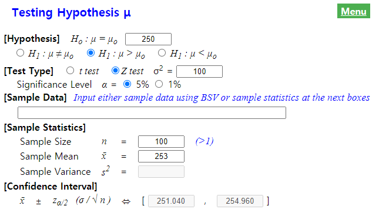
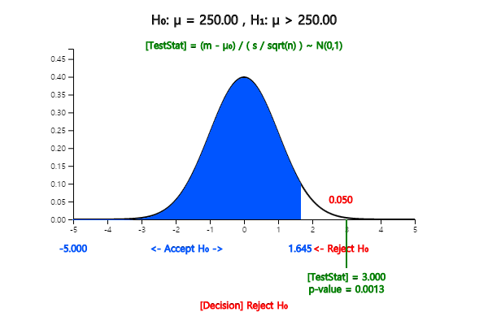
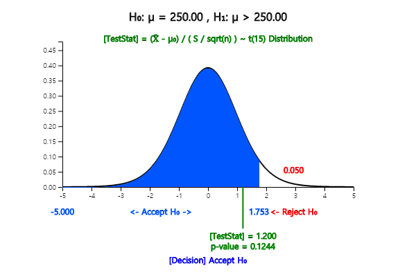

# Testing Hypothesis for Single Population Parameter

[book](pdf/book07.pdf){target="_blank"}
[eStat YouTube Channel](https://www.youtube.com/channel/UCw2Rzl9A4rXMcT8ue8GH3IA){target="_blank"}

**CHAPTER OBJECTIVES**

Estimation of population parameters using sample distributions was
discussed in Chapter 6.

However, one might be interested in which one of two hypothesis about
the population parameter is reasonable to accept.

This problem is called a testing hypothesis and we take samples and
calculate the sample statistics to decide by using the sampling
distributions discussed in Chapter 6.

In this chapter we discuss the testing hypothesis of the population
mean, population variance and population proportion.

A method of testing hypothesis which considers both type 1 and type 2
error is also introduced.

:::

::: 

      
:::

      

## Testing Hypothesis for a Population Mean

::: presentation-video-link
[presentation](pdf/0701.pdf){.presentation-link target="_blank"}   
[video](https://youtu.be/ba0JTGsChY8){.video-link target="_blank"}
:::

::: mainTable
Examples of testing hypothesis for a population mean are as follows.

::: textL30M10
- The weight of a cookie bag is indicated as 200g. Would there be
enough cookies as the indicated weight?

- At a light bulb factory, a newly developed light bulb advertises a
longer bulb life than the past one. Is this propaganda reliable?

- Immediately after completing this year's academic test, students
said that there will be 5 points increase in the average English score
higher than last year. How can you investigate if this is true?
:::

Testing hypothesis is the answer to the above questions (hypothesis).
That is, the testing hypothesis is to decide statistically which
hypothesis is to use for the two hypotheses about the unknown population
parameter using samples. In this section, we examine the test of the
population mean, population variance, and population proportion which
are most commonly used in testing hypothesis.

The following example explains the theory of testing hypothesis of the
population mean in single population.
:::

::: mainTableGrey
**Example 7.1.1** At a light bulb factory, the average life expectancy
of a light bulb made by a conventional production method is known to be
1500 hours and the standard deviation is 200 hours. Recently, the
company is trying to introduce a new production method, with the average
life expectancy of 1600 hours for light bulbs. To confirm this argument,
30 samples were taken from the new type of light bulbs by simple random
sampling and the sample mean was $\overline x$ = 1555 hours. Can you
tell me that the new type of light bulb has the average life of 1600
hours?

**Answer**

A statistical approach to the question of this issue is first to make
two assumptions about the different arguments for the population mean μ
. Namely, $$ \small
        \begin{multline}
        \shoveleft H_0 : μ = 1500 \\ 
        \shoveleft H_1 : μ = 1600
        \end{multline}
      $$ $\small H_0$ is called a null hypothesis and $\small H_1$ is an
alternative hypothesis. In most cases, the null hypothesis is defined as
an 'existing known fact', and the alternative hypothesis is defined as
'new facts or changes in current beliefs'. So when choosing between two
hypotheses, the basic idea of testing hypothesis is 'unless there is a
significant reason, we accept the null hypothesis (current fact) without
choosing the alternative hypothesis (the fact of the matter). This idea
of testing hypothesis is referred to as a 'conservative decision
making'.

A common sense criterion for choosing between two hypotheses would be
'which population mean of two hypothesis is closer in distance to the
sample mean'. Based on this common sense criteria which uses the
concept of distance, the sample mean of 1555 is closer to
$\small H_1 : μ = 1600$ so the alternative hypothesis will be chosen. A
statistical testing hypothesis is based not only on this common sense
criteria, but also on the sampling distribution of $\overline X$. In
other words, the statistical testing hypothesis is to select a critical
value $C$ based on the sampling distribution theory and to make a
decision rule as follows:

$\small  \qquad \text { ‘If \(\overline X$ is smaller than C, then the
null hypothesis $H_0$ will be chosen, else reject $H_0$'} \\)

The area of {$\small \overline X < C$} is called an acceptance region of
$\small H_0$ and the area {$\small \overline X ≥ C$} is called a
rejection region of $\small H_0$ ([Figure 7.1.1]{.figure-ref}).

{.imgFig400300}

::: figText
[Figure 7.1.1]{.figure-ref} Acceptance and rejection region of $H_{0}$
:::

If a hypothesis is chosen by this decision rule, there are always two
possible errors in the decision. One is a **Type 1 Error** which accepts
$\small H_1$ when $\small H_0$ is true, the other is a **Type 2 Error**
which accept $\small H_0$ when $\small H_1$ is true. These errors can be
summarized as [Table 7.1.1]{.table-ref}.

Table 7.1.1 Two types of errors in testing hypothesis

  -----------------------------------------------------------------------
                          Actual\                 Actual\
                          $\small H_0$ is true    $\small H_1$ is true
  ----------------------- ----------------------- -----------------------
  Decision : $\small H_0$ Correct                 Type 2 Error
  is true                                         

  Decision : $\small H_1$ Type 1 Error            Correct
  is true                                         
  -----------------------------------------------------------------------

If you try to reduce one type of error when the sample size is fixed,
then the other type of error is increasing. That is why we came up with
a conservative decision making method that defines the null hypothesis
$\small H_0$ as 'past or present facts' and 'accept the null
hypothesis unless there is a significance evidence for the alternative
hypothesis.' In this conservative way, we try to reduce the type 1
error as much as possible that selects $\small H_1$ when $\small H_0$ is
true, which would be more risky than the type 2 error. Testing
hypothesis determines the tolerance for the probability of the type 1
error, usually 5% or 1% for rigorous test, and use the selection
criteria that satisfy this limitation. The tolerance for the probability
that this type 1 error will occur is called the **significance level**
and is often expressed as α. The probability of the type 2 error is
expressed as β.

If the significance level is established, the decision rule for the two
hypotheses can be tested using the sampling distribution of all possible
sample means in Chapter 6. [Figure 7.1.2]{.figure-ref} shows the distribution of
populations for two hypotheses, and the distribution of all possible
sample means for each population.

{.imgFig400300}

::: figText
[Figure 7.1.2]{.figure-ref} Testing Hypothesis
:::

If the population corresponds to the distribution of $\small H_0$ : μ =
1500, the sampling distribution of all possible sample means is
approximated as $\small N(1500,200^2 )$ by the central limit theorem. If
the population corresponds to the distribution of $\small H_1$ : μ =
1600, the sampling distribution of all possible sample means is
approximated as $\small N(1600,200^2 )$. The standard deviation for each
population is assumed to be 200 from a historical data. Then the
decision rule becomes as follows:

$\small  \qquad \text {‘If \(\overline X < C$, then accept $H_{0}$, else
accept $H_{1}$ (i.e. reject $H_{0}$ )'} \\)

In Figure 7.1.2, the shaded area represents the probability of the type
1 error. If we set the significance level, which is the tolerance level
of the type 1 error, is 5%, i.e. $\small P(\overline X < C) = 0.95$, $C$
can be calculated by finding the percentile of the normal distribution
$\small N(1500,\frac{200^2}{30})$ as follows:

$\small  \qquad 1560+1.645 \frac{200}{\sqrt 30 } = 1560.06$

Therefore, the decision rule can be written as follows.

$\small  \qquad \text {‘If \(\overline X$ \< 1560.06, then accept $H_0$,
else reject $H_0$ (accept $H_1$ ).'} \\)

In this problem, the observed sample mean of the random variable
$\small \overline X$ is $\overline x$= 1555 and $\small H_0$ is
accepted. In other words, the hypothesis of $\small H_0$ : μ = 1500 is
judged to be correct, which contradicts the result of common sense
criteria that $\overline x$ = 1555 is closer to $\small H_1$ : μ = 1600
than $\small H_0$ : μ = 1500. This result can be interpreted that the
sample mean of 1555 is not a sufficient evidence to reject the null
hypothesis by a conservative decision making method.

The above decision rule is often written as follows, emphasizing that it
is the result from a conservative decision making method.

$\small  \qquad \text {‘If \(\overline X$ \< 1560.06, then do not reject
$H_0$, else reject $H_0$.'} \\)

In addition, this decision rule can be written for calculation purpose
as follows.

$\small  \qquad \text {‘If \(\frac{\overline X - 1500}{\frac {200}{\sqrt{30}}}$,
then accept $H_0$ , else reject $H_0$.'} \\)

In this case, since $\overline x$ = 1555,
$\frac{1555 - 1500}{\frac {200}{\sqrt{30}}}$ and it is less than 1.645.
Therefore, we accept $\small H_0$.
:::

::: mainTable
Since the testing hypothesis by the conservative decision making is only
based on the probability of the type 1 error as seen in \[Example
7.1.1\], even if the alternative hypothesis is $H_1 : μ > 1500$, we will
have the same decision rule.

Generally, there are three types of alternative hypothesis in the
testing hypothesis for the population mean as follows. $$ 
        \begin{align}
          & 1)\quad H_1 : \mu \gt \mu_0  \\
          & 2)\quad H_1 : \mu \gt \mu_0  \\
          & 3)\quad H_1 : \mu \ne \mu_0  \\
        \end{align}
      $$ Since 1) has the rejection region on the right side of the
sampling distribution of all possible sample means under the null
hypothesis, it is called a **right-sided test**. Since 2) has the
rejection region on the left side of the sampling distribution, it is
called a **left-sided test**. Since 3) has rejection regions on both
sides of the sampling distribution, it is called a **two-sided test**.
The decision rule for each type of three alternative hypothesis are
summarized in [Table 7.1.2]{.table-ref} when the population standard deviation is
known and α is the significance level.
:::

Table 7.1.2 Testing hypothesis for the population mean - known σ case

  ---------------------------------------------------------------------------------------------------------------------------
  Type of Hypothesis                  Decision Rule
  ----------------------------------- ---------------------------------------------------------------------------------------
  1\) $\; H_0 : \mu = \mu_0$\         If $\frac {\overline X - \mu_0}{ \frac {\sigma}{\sqrt{n}} } > z_{α}$, then reject $H_0$
  $\quad\,\, H_1 : \mu > \mu_0$       

  2\) $\; H_0 : \mu = \mu_0$\         If $\frac {\overline X - \mu_0}{ \frac {\sigma}{\sqrt{n}} } < - z_{1-α}$, then reject
  $\quad\,\, H_1 : \mu < \mu_0$       $H_0$

  3\) $\; H_0 : \mu = \mu_0$\         If
  $\quad\,\, H_1 : \mu \ne \mu_0$     $\left | \frac {\overline X - \mu_0}{ \frac {\sigma}{\sqrt{n}} } \right | > z_{α/2}$,
                                      then reject $H_0$
  ---------------------------------------------------------------------------------------------------------------------------

Note: The $H_0$ of 1) can be written as $\; H_0 : \mu \le \mu_0$ , 2) as
$\; H_0 : \mu \ge \mu_0$

::: mainTable
The following expression used for the decision rule is referred to as a
test statistic for testing hypothesis of the population mean. $$
        \frac {\overline X - \mu_0}{ \frac {\sigma}{\sqrt{n}} }
      $$

The population standard deviation σ of the test statistic is usually
unknown. However, if the sample is large enough (approximately 30 or
more), the hypothesis test can be performed using the sample standard
deviation $S$ instead of the population standard deviation σ.

In [Example 7.1.1]{.example-ref}, if the sample mean is either 1555 or 1540, the
null hypothesis can not be rejected, but degrees of evidence that the
null hypothesis is not rejected are different. The degree of evidence
that the null hypothesis is not rejected is measured by calculating the
probability of the type 1 error when the observed sample mean value is
considered as the critical value for decision, which is called the
$p$-value. That is, the $p$-value indicates where the observed sample
mean is located among all possible sample means by considering the
location of the alternative hypothesis. In [Example 7.1.1]{.example-ref}, the
$p$-value for $\overline X$ = 1540 is the probability of sample means
which is greater than $\overline X$ = 1540 by using
$N(1500, \frac{200^2}{30} )$. The higher the $p$-value, the stronger the
reason for not being rejected. If $H_0$ is rejected, the smaller the
$p$-value, the stronger the grounds for being rejected. Therefore, if
the $p$-value is less than the significance level considered by the
analyst, then $H_0$ is rejected, because it means that the sample mean
is in the rejection region. Statistical packages provide this $p$-value.
:::

::: mainTableYellow
**Decision rule using $p$-value**

If the $p$-value is less than the significance level, then $H_0$ is
rejected, else $H_0$ is accepted.
:::

::: mainTable
The calculation of the $p$-value depending on the type of the
alternative hypothesis is summarized as in [Table 7.1.3]{.table-ref}.
:::

Table 7.1.3 Calculation of $p$-value

  ----------------------------------------------------------------------------------
  Type of Hypothesis                  $p$-value
  ----------------------------------- ----------------------------------------------
  1\) $\; H_0 : \mu = \mu_0$\         $P ( \overline X > {\overline x}_{obs} )$
  $\quad\,\, H_1 : \mu > \mu_0$       

  2\) $\; H_0 : \mu = \mu_0$\         $P ( \overline X < {\overline x}_{obs} )$
  $\quad\,\, H_1 : \mu < \mu_0$       

  3\) $\; H_0 : \mu = \mu_0$\         If $\overline X > \mu_0$, then
  $\quad\,\, H_1 : \mu \ne \mu_0$     $2 P ( \overline X > {\overline x}_{obs} )$,
                                      else
                                      $2 P ( \overline X < {\overline x}_{obs} )$
  ----------------------------------------------------------------------------------

Note ${\overline x}_{obs}$ is the observed sample mean

::: mainTable
If the population standard deviation σ is unknown and the population is
a normal distribution, the test statistic $$
        \frac {\overline X - \mu_0}{ \frac {S}{\sqrt{n}} }
      $$ is a $t$ distribution with $(n-1)$ degrees of freedom. The
testing hypothesis for the population mean can be done as [Table 7.1]{.table-ref}.4
which replace the $Z$ distribution with the $t$ distribution in Table
7.1.2 and σ with $S$.
:::

Table 7.1.4 Testing hypothesis for a population mean - unknown σ case\
(Assume that the population is a normal distribution)

  ---------------------------------------------------------------------------------------------------------------------------
  Type of Hypothesis                  Decision Rule
  ----------------------------------- ---------------------------------------------------------------------------------------
  1\) $\; H_0 : \mu = \mu_0$\         If $\frac {\overline X - \mu_0}{ \frac {S}{\sqrt{n}} } > t_{n-1: α}$, then reject $H_0$
  $\quad\,\, H_1 : \mu > \mu_0$       

  2\) $\; H_0 : \mu = \mu_0$\         If $\frac {\overline X - \mu_0}{ \frac {S}{\sqrt{n}} } < - t_{n-1: α}$, then reject
  $\quad\,\, H_1 : \mu < \mu_0$       $H_0$

  3\) $\; H_0 : \mu = \mu_0$\         If
  $\quad\,\, H_1 : \mu \ne \mu_0$     $\left | \frac {\overline X - \mu_0}{ \frac {S}{\sqrt{n}} } \right | > t_{n-1; α/2}$,
                                      then reject $H_0$
  ---------------------------------------------------------------------------------------------------------------------------

Note: The $H_0$ of 1) can be written as $H_0 : \mu \le \mu_0$ , 2) as
$H_0 : \mu \ge \mu_0$

::: mainTable
If the sample size is large enough (approximately 30 or more), the $t$
distribution is approximated to the standard normal distribution, so the
testing hypothesis in [Table 7.1.4]{.table-ref} can be performed using the standard
normal distribution, $Z$ , instead of $t$ distribution.
:::

::: mainTableGrey
**Example 7.1.2** The weight of a bag of cookies is supposed to be 250
grams. Suppose the weight of all bags of cookies is a normal
distribution. In the survey of 100 samples of bags which were randomly
selected, the sample mean was 253 grams and the standard deviation was
10 grams.

::: textL20M20
1\) Test hypothesis whether the weight of the bag of cookies is 250g or
larger and find the $p$-value. α = 1％
:::

::: textL20M20
2\) Test hypothesis whether or not the weight of the bag of cookies is
250g and find the $p$-value. α = 1％
:::

::: textL20M20
3\) Use 『eStatU』 to test the hypothesis above.
:::

**Answer**

::: textL20M20
1\) The hypothesis is a right tail test as $\small H_0 : \mu;$ = 250,
$\small H_0 : \mu;$ \> 250. Since the sample size is large ($n$=100), we
can use $Z$ distribution instead of $t$ distribution. Decision rule is
as follows.
:::

$$ \small
        \begin{multline}
        \shoveleft \text{'If }  \frac {\overline X - \mu_0}{ \frac {S}{\sqrt{n}} } > z_{α} , \text{ then reject }  H_0  \text{ else accept } H_0 ’ \\
        \shoveleft \text{'If }  \frac {253 - 250}{ \frac {10}{\sqrt{100}} } > z_{0.01} , \text{ then reject }  H_0  \text{ else accept }  H_0 ’ \\
        \end{multline}
      $$

::: textL20
Since $\frac {253 - 250}{ \frac {10}{\sqrt{100}} }$ = 3 and $z_{0.01}$=
2.326, $\small H_0$ is rejected. We can write the above decision rule as
follows:
:::

$$ \small
        \begin{multline}
        \shoveleft \text{'If }  \overline X  > \mu_0 + z_{α} \frac {S}{\sqrt{n}} , \text{ then reject } H_0 \text{ else accept } H_0 ’ \\
        \shoveleft \text{'If }  \overline X  > 250 + 2.326 \frac {10}{\sqrt{100}} , \text{ then reject } H_0 \text{ else accept } H_0 ’ \\
        \shoveleft \text{'If }  \overline X  > 252.326 , \text{ then reject}  H_0 \text{ else accept } H_0 ’
        \end{multline}
      $$

::: textL20
Since the $p$-value is the probability of Type 1 error when the sample
mean is the critical value. it can be calculated by the probability of (
$\small P( \overline X$ \> 253). Since the distribution of
$\small \overline X$ is approximately $\small N(250, \frac{100}{100} )$
when $\small H_0 : \mu$ = 250 is true, the $p$-value is as follows:
:::

$\small  \qquad \qquad p\text{-value} = P( \overline X \gt 253) = P( Z \gt \frac{253-250}{\frac{10}{10}} ) = P( Z \gt 3) = 0.0013$

::: textL20M20
2\) The hypothesis is a two-sided test as
$\small H_0 : \mu = 250, H_1 \ne 250$. Since the sample size is large
($n$=100), we can use the $Z$ distribution instead of the $t$
distribution. Decision rule is as follows.
:::

$$ \small
        \begin{multline}
        \shoveleft \text{'If } \left| \frac {\overline X - \mu_0}{ \frac {S}{\sqrt{n}} } \right| > z_{α/2} , \text{ then reject }  H_0  \text{ else accept } H_0 ’ \\
        \shoveleft \text{'If } \left| \frac {253 - 250}{ \frac {10}{\sqrt{100}} } \right| > z_{0.005} , \text{ then reject }  H_0  \text{ else accept }  H_0 ’ \\
        \end{multline}
      $$

::: textL20
Since $\frac {253-250} {\frac{10}{10}} = 3$ and $z_{0.005}$ = 2.575,
$\small H_0$ is rejected. The $p$-value can be calculated as follows:
:::

$\small  \qquad \qquad p\text{-value} = 2 P(\overline X \gt 253) = 2 P(\overline X \gt \frac{253-250}{\frac{10}{10}} = 2 P( Z \gt 3) = 0.0026$

::: textL20M20
3\) In 『eStatU』 menu, select 'Testing Hypothesis μ', enter 250 at
the box of on \[Hypothesis\] and select the alternative hypothesis as
the right test in the window shown in [Figure 7.1.3]{.figure-ref}. Check \[Test
Type\] as Z test and check the significance level at 5%. At the \[Sample
Statistics\], enter sample size 100, sample mean 253, and sample
variance $10^2 = 100$. For the Z test, you must enter the population
variance, but you may enter the sample variance, because the sample size
is large enough.
:::

<input class="qrBtn" onclick="window.open(addrStr[101])" src="QR/eStatU700_TestMu.svg" type="image"/>

{.imgPhoto}

::: figText
[Figure 7.1.3]{.figure-ref} 『eStatU』 Testing Hypothes for μ
:::

::: textL20
If you click the [Execute]{.button-ref} button, the confidence Interval for μ is
calculated and the testing result using 『eStatU』 will appear as in
[Figure 7.1.4]{.figure-ref}.
:::

{.imgFig600400}

::: figText
[Figure 7.1.4]{.figure-ref} 『eStatU』 Testing Hypothes for μ - Right Tail Test
:::

::: textL20
If you select the two-tail test at \[Hypothesis\] of [Figure 7.1.3]{.figure-ref},
testing result using 『eStatU』 is as [Figure 7.1.5]{.figure-ref}.
:::

{.imgFig600400}

::: figText
[Figure 7.1.5]{.figure-ref} 『eStatU』 Testing Hypothes for μ - Two Tails Test
:::
:::

::: mainTableGrey
**Example 7.1.3** When the sample size is 16 and the sample variance is
100 in [Example 7.1.2]{.example-ref}, test whether the average weight of the cookie
bags is 250g or greater and obtain the $p$-value. Check the result using
『eStatU』

**Answer**

Since the population standard deviation is unknown and the sample size
is small, the decision rule is as follows. $$ \small
        \begin{multline}
        \shoveleft \text{'If }  \frac {\overline X - \mu_0} {\frac {S}{\sqrt{n}} } > t_{n-1: α} , \text{ then reject }  H_0  \text{ else accept } H_0 ’ \\
        \shoveleft \text{'If }  \frac {253 - 250}{ \frac {10}{\sqrt{16}} } > t_{16: 0.01} , \text{ then reject }  H_0  \text{ else accept }  H_0 ’ \\
        \end{multline}
      $$ Since the value of test statistic is
$\frac {253 - 250}{ \frac {10}{\sqrt{16}} } = 1.2$, and
$t_{15: 0.01} = 2.602$ , we accept $\small H_0$. Note that the decision
rule can be written as follows.

$\small  \qquad \qquad\text{'If } \overline X > 250 + 2.602 \frac {10}{\sqrt{16}} , \text{ then reject } H_0 \text{ else accept } H_0 ’ \\ $

In [Figure 7.1.3]{.figure-ref} of 『eStatU』 , select the right-sided test of
\[Hypothesis\], select the $t$-test on \[Test Type\] and enter sample
size $n$ = 16, then the test result is as [Figure 7.1.6]{.figure-ref} if you click
the [Execute]{.button-ref} button.

<input class="qrBtn" onclick="window.open(addrStr[101])" src="QR/eStatU700_TestMu.svg" type="image"/>

{.imgFig600400}

::: figText
[Figure 7.1.6]{.figure-ref} Testing hypothesis for μ with $t$ distribution using
『eStatU』
:::

Since the $p$-value is the probability that $t_{15}$ is greater than the
test statistics 1.200, the $p$-value is 0.124 by using the module of $t$
distribution in 『eStatU』.
:::

::: mainTableGrey
**Example 7.1.4** (Heights of college students)

10 male students are sampled in a university and examined their heights
as follows:

::: textLeft
172 175 178 182 176 180 169 185 173 177 (Unit cm)
:::

::: textLeft
Ex ⇨ eBook ⇨ EX070104_Height.csv.
:::

Test the hypothesis whether the population mean is 175cm or greater with
the significance level of 5%.

**Answer**

After entering data on a sheet as shown in [Figure 7.1.7]{.figure-ref} in 『eStat』
, clicking the testing hypothesis for the population mean and then
clicking variable name V1 for 'Analysis Var' in variable selection box
will result in a dot graph with 95% confidence interval as in \<Figure
7.1.8\>.

<input class="qrBtn" onclick="window.open(addrStr[24])" src="QR/EX070104.svg" type="image"/>

{.imgFig150200}

::: figText
[Figure 7.1.7]{.figure-ref} Data input
:::

{.imgFig600540}

::: figText
[Figure 7.1.8]{.figure-ref} Dot graph and confidence interval
:::

If you click \[Histogram\] button from option menu below the graph as in
[Figure 7.1.9]{.figure-ref}, the corresponding histogram is appeared as in \<Figure
7.1.10\>. The histogram together with the normal distribution graph can
be used to check whether the sample data comes from a normal
distribution. The options such as \[Normal Q-Q Plot\] and \[Normality
Test\] will be explained in chapter 11.

{.imgFig400100}

::: figText
[Figure 7.1.9]{.figure-ref} Options for testing hypothesis of population mean
:::

{.imgFig600540}

::: figText
[Figure 7.1.10]{.figure-ref} Histogram and Normal Distribution
:::

Enter $μ_0$ = 175 at the box of option menu, select the right sided test
and the significance level of 5%. Then press the \[t-Test\] button to
display the hypothesis test graph as shown in [Figure 7.1.11]{.figure-ref} and a
test result in the Log Area as in [Figure 7.1.12]{.figure-ref}.

{.imgFig600540}

::: figText
[Figure 7.1.11]{.figure-ref} Testing hypothesis for population mean
:::

{.imgFig400300}

::: figText
[Figure 7.1.12]{.figure-ref} Testing hypothesis for population mean
:::

You can select Z-test in the option menu, but you have to enter the
population standard deviation σ in this case.
:::

::: mainTablePink

<input class="qrBtn" onclick="window.open(addrStr[101])" src="QR/eStatU700_TestMu.svg" type="image"/>

**Practice 7.1.1** The following data are weights of the 7 employees
randomly selected who are working in the shipping department of a
wholesale food company.

::: textLeft
154, 186, 159, 174, 183, 163, 181 (unit pound)
:::

::: textLeft
Ex ⇨ eBook ⇨ PR070101_Height.csv.
:::

Based on this data, can you say that the average weight of employees
working in the shipping department is 160 or greater than 160? Use the
significance level of 5%.

:::

::: mainTable
The testing hypothesis of the population mean using the sample variance
requires the assumption that the population is normally distributed.
Testing whether sample data come from a normal population is called a
goodness of fit test which will be explained in Chapter 11.

In this section, we looked at the testing hypothesis for the population
mean when the sample size is already given and only consider the
significance level of the type 1 error. In this case, if we try to
reduce the probability of the type 1 error, then the probability of the
type 2 error will be increased and we can not reduce both types of
errors at the same time. Therefore, if the sample size was
predetermined, or if data were given, only the type 1 error was
considered as a conservative decision making to test the hypothesis.
However, if the sample size can be selected by a researcher, there is a
testing hypothesis that considers both types of errors together which
will be explained in detail in section 7.4.
:::

::: mainTablePink
### Multiple Choice Exercise

Choose one answer and click Submit button

::: textL30M30
7.1 What is the type 1 error?
:::

<form name="Q1">
<label><input name="item" type="radio" value="1"/> Error rejecting the null hypothesis when it is true</label> 
<label><input name="item" type="radio" value="2"/> Error accepting the null hypothesis when it is true</label> 
<label><input name="item" type="radio" value="3"/> Error rejecting the null hypothesis when it is not true</label> 
<label><input name="item" type="radio" value="4"/> Error accepting the null hypothesis when it is true</label> 

<input onclick="radio(7,1,Q1)" type="button" value="Submit"/>    
      <input id="ansQ1" size="15" type="text"/>

</form>

::: textL30M30
7.2 Which hypothesis is accepted when the null hypothesis is rejected?
:::

<form name="Q2">
<label><input name="item" type="radio" value="1"/> null hypothesis</label> 
<label><input name="item" type="radio" value="2"/> significant hypothesis</label> 
<label><input name="item" type="radio" value="3"/> alternative hypothesis</label> 
<label><input name="item" type="radio" value="4"/> basic hypothesis</label> 

<input onclick="radio(7,2,Q2)" type="button" value="Submit"/>    
      <input id="ansQ2" size="15" type="text"/>

</form>

::: textL30M30
7.3 Which of the following statements is true?
:::

<form name="Q3">
<label><input name="item" type="radio" value="1"/> The conclusion about a statistical test is always absolute.</label> 
<label><input name="item" type="radio" value="2"/> Rejecting null hypothesis implies we accept the alternative hypothesis.</label> 
<label><input name="item" type="radio" value="3"/> In order to reduce the type 1 error, significance level of 0.05 is better than 0.01.</label> 
<label><input name="item" type="radio" value="4"/> In order to reduce the type 1 error, significance level of 0.01 is better than 0.05.</label> 

<input onclick="radio(7,3,Q3)" type="button" value="Submit"/>    
      <input id="ansQ3" size="15" type="text"/>

</form>

::: textL30M30
7.4 What is the meaning of the significance level α = 0.05?
:::

<form name="Q4">
<label><input name="item" type="radio" value="1"/> 5% of decisions to reject the null hypothesis when it is true if the same test method was repeated repeatedly</label> 
<label><input name="item" type="radio" value="2"/> 5% of decisions to reject the alternative hypothesis when it is true if the same test method was repeated repeatedly</label> 
<label><input name="item" type="radio" value="3"/> The probability of accepting the null hypothesis is 0.05.</label> 
<label><input name="item" type="radio" value="4"/> The probability of accepting the alternative hypothesis is 0.05.</label> 

<input onclick="radio(7,4,Q4)" type="button" value="Submit"/>    
      <input id="ansQ4" size="15" type="text"/>

</form>

::: textL30M30
7.5 What is the critical value to reject the null hypothesis if the
alternative hypothesis is right sided when the sampling distribution to
test the population mean is the standard normal distribution?
:::

<form name="Q5">
<label><input name="item" type="radio" value="1"/> 2.58</label> 
<label><input name="item" type="radio" value="2"/> 1.64</label> 
<label><input name="item" type="radio" value="3"/> 2.33</label> 
<label><input name="item" type="radio" value="4"/> 1.96</label> 

<input onclick="radio(7,5,Q5)" type="button" value="Submit"/>    
      <input id="ansQ5" size="15" type="text"/>

</form>

::: textL30M30
7.6 If the null hypothesis is $\small H_0 ; \mu = \mu_0$, what is the
two-sided alternative hypothesis?
:::

<form name="Q6">
<label><input name="item" type="radio" value="1"/> \(\small H_1 ; \mu &gt; \mu_0 \)</label> 
<label><input name="item" type="radio" value="2"/> \(\small H_1 ; \mu &lt; \mu_0 \)</label> 
<label><input name="item" type="radio" value="3"/> \(\small H_1 ; \mu = \mu_0 \)</label> 
<label><input name="item" type="radio" value="4"/> \(\small H_1 ; \mu \ne \mu_0 \)</label> 

<input onclick="radio(7,6,Q6)" type="button" value="Submit"/>    
      <input id="ansQ6" size="15" type="text"/>

</form>

::: textL30M30
7.7 The following lists the sequence of a statistical hypothesis test.
What's the right order? a. Set a hypothesis. b. Determine the
significance level. c. Determine whether or not to accept the
hypothesis. d. Calculate the test statistic. e. Find the rejection
region
:::

<form name="Q7">
<label><input name="item" type="radio" value="1"/> a→d→e→b→c</label> 
<label><input name="item" type="radio" value="2"/> a→d→b→e→c</label> 
<label><input name="item" type="radio" value="3"/> b→e→d→a→c</label> 
<label><input name="item" type="radio" value="4"/> a→c→b→d→e</label> 

<input onclick="radio(7,7,Q7)" type="button" value="Submit"/>    
      <input id="ansQ7" size="15" type="text"/>

</form>

::: textL30M30
7.8 Which of the following statements is incorrect?
:::

<form name="Q8">
<label><input name="item" type="radio" value="1"/> The rejection of the null hypothesis means accepting the alternative hypothesis.</label> 
<label><input name="item" type="radio" value="2"/> The maximum allowable probability of the type 1 error is the significance level.</label> 
<label><input name="item" type="radio" value="3"/> Error accepting the null hypothesis when it is false is the type 1 error.</label> 
<label><input name="item" type="radio" value="4"/> Error accepting the alternative hypothesis when it is false is the type 2 error.</label> 

<input onclick="radio(7,8,Q8)" type="button" value="Submit"/>    
      <input id="ansQ8" size="15" type="text"/>

</form>

:::

      

      

::: 

      

      

## Testing Hypothesis for a Population Variance

::: presentation-video-link
[presentation](pdf/0702.pdf){.presentation-link target="_blank"}   
[video](https://youtu.be/3SDaVzGqPL0){.video-link target="_blank"}
:::

::: mainTable
Examples for testing hypothesis of a population variance are as follows.

::: textL30M10
- Bolts produced by a company are currently supplied to an automaker
and have an average diameter of 7mm and a variance of 0.25mm. Recently,
a rival company has applied for the supply, claiming that their
company's bolts have the same average diameter of 7 mm but a variance
of 0.16mm. How can I find out if this claim is true?

- The variance of scores in mathematics on the last year's college
scholastic aptitude test was 100. Questions in mathematics this year's
test are said to be much easier than last year's. How can I test
whether the variance of the mathematics score in this year is smaller
than the last year?
:::

If you understand the testing hypothesis for the population mean, the
testing hypothesis for the population variance differs only from the
sampling distribution and the test statistic, and the basic concept is
the same. In Chapter 6, we studied that the distribution of all possible
sample variances multiplied by a constant, $\frac{(n-1)S^2}{\sigma^2}$,
follows a chi-square distribution with $n-1$ degrees of freedom when the
population is a normal distribution with variance $\sigma^2$. Using this
theory, testing hypothesis for the population variance can be done as
follows.
:::

Table 7.2.1 Testing hypothesis of the population variance\
- the population is normally distributed -

  ---------------------------------------------------------------------------------------------------
  Type of Hypothesis                              Decision Rule
  ----------------------------------------------- ---------------------------------------------------
  1\) $\; H_0 : \sigma^{2} = \sigma^{2}_0$\       If $\frac{(n-1)S^2}{\sigma^2} > \chi^2_{n-1: α}$,
  $\quad\,\, H_1 : \sigma^{2} > \sigma^{2}_0$     then reject $H_0$, else accept $H_0$

  2\) $\; H_0 : \sigma^{2} = \sigma^{2}_0$\       If $\frac{(n-1)S^2}{\sigma^2} < \chi^2_{n-1: 1-α}$,
  $\quad\,\, H_1 : \sigma^{2} < \sigma^{2}_0$     then reject $H_0$, else accept $H_0$

  3\) $\; H_0 : \sigma^{2} = \sigma^{2}_0$\       If $\frac{(n-1)S^2}{\sigma^2} > \chi^2_{n-1: α/2}$
  $\quad\,\, H_1 : \sigma^{2} \ne \sigma^{2}_0$   or
                                                  $\frac{(n-1)S^2}{\sigma^2} < \chi^2_{n-1: 1-α/2}$
                                                  then reject $H_0$, else accept $H_0$
  ---------------------------------------------------------------------------------------------------

Note: The $\small H_0$ of 1) can be written as
$\small \; H_0 : \sigma^{2} \le \sigma^{2}_0$ , 2) as
$\small \; H_0 : \sigma^{2} \ge \sigma^{2}_0$

::: mainTableGrey
**Example 7.2.1** One company produces bolts for an automobile. If the
average diameter of bolts is 15mm and its variance is less than $0.1^2$,
it can be delivered to the automobile company. Twenty-five of the most
recent products were randomly sampled and their variance was $0.15^2$.
Assuming that the diameter of a bolt follows a normal distribution,

::: textL20M20
1\) Conduct testing hypothesis at the 5% significance level to determine
if the product can be delivered to the automotive company.
:::

::: textL20M20
2\) Check the result using 『eStatU』
:::

**Answer**

::: textL20M20
1\) The hypothesis of this problem is
$\small H_0 : \sigma^{2} \le 0.1^{2} , H_1 : \sigma^{2} > 0.1^{2}$ and
its decision rule is as follows.
:::

$\small  \qquad \qquad '\text{If } \frac{(n-1)S^2}{\sigma^2_{0}} \gt \chi^2_{n-1: α} , \text{ then reject } H_0 , \text{ else accept } H_0 ’$

::: textL20
Note that
$\small s^2 = 0.15^2 = 0.0225 , \frac {(25-1)×0.15^2}{0.1^2} = 54$ and
$\small \chi^2_{25-1: 0.05} = \chi^2_{24: 0.05} = 36.42$. Therefore,
$\small H_0$ is rejected.
:::

::: textL20M20
2\) Select 'Testing Hypothesis $\sigma^2$' in 『eStatU』. Enter
$\sigma^2_{0} = 0.1^2 = 0.01$, select the right sided test and the 5%
significance level as [Figure 7.2.1]{.figure-ref} in the input box. Then enter the
sample size $n$ = 25 and sample variance $\small s^2 = 0.15^2 = 0.0225$.
:::

<input class="qrBtn" onclick="window.open(addrStr[102])" src="QR/eStatU720_TestSigma.svg" type="image"/>

{.imgFig600400}

::: figText
[Figure 7.2.1]{.figure-ref} Testing hypothesis for $\sigma^2$ using 『eStatU』
:::

::: textL20
If you click the [Execute]{.button-ref} button, the confidence interval of
$\sigma^2$ is calculated and testing result will be shown as \<Figure
7.2.2\>.
:::

{.imgFig600400}

::: figText
[Figure 7.2.2]{.figure-ref} Testing hypothesis for $\sigma^2$
:::
:::

::: mainTableGrey
**Example 7.2.2** (Heights of college students)\
Using 『eStat』 and the height data of 10 male college students in
[Example 7.1.4]{.example-ref},

::: textLeft
172 175 178 182 176 180 169 185 173 177\
Ex ⇨ eBook ⇨ EX070104_Height.csv.
:::

test the hypothesis whether the population variance is greater than 25
at the significance level of 5%.

**Answer**

After entering data as shown in [Figure 7.2.3]{.figure-ref} on the sheet in
『eStat』 , click the icon of testing hypothesis for variance and select
'Height' as the Analysis Var to display a dot graph of data with
(average) ± (standard deviation) interval as in[Figure 7.2.4]{.figure-ref}.

<input class="qrBtn" onclick="window.open(addrStr[122])" src="QR/EX070104.svg" type="image"/>

{.imgFig150200}

::: figText
[Figure 7.2.3]{.figure-ref} 『eStat』 data input
:::

{.imgFig600400}

::: figText
[Figure 7.2.4]{.figure-ref} Dot graph and (Mean) ± (Std Dev) for Testing hypothesis
of $σ^2$
:::

In the option box under the Graph Area ([Figure 7.2.5]{.figure-ref}), enter
$\sigma^2_{0}$ = 25, and select the alternative hypothesis as
right-sided test, significance level as 5%. By clicking \[$\chi^2$
test\] button, the result of the testing hypothesis will be shown as
[Figure 7.2.6]{.figure-ref} and the result table as [Figure 7.2.7]{.figure-ref}.

{.imgFig500100}

::: figText
[Figure 7.2.5]{.figure-ref} Option menu for testing hypothesis for $\sigma^2$
:::

{.imgFig600540}

::: figText
[Figure 7.2.6]{.figure-ref} Testing hypothesis for $\sigma^2$
:::

{.imgFig600400}

::: figText
[Figure 7.2.7]{.figure-ref} Testing hypothesis for $\sigma^2$
:::
:::

::: mainTable
It is necessary to assume that the population is normally distributed to
test the hypothesis of the population variance. Testing whether the
population is normally distributed using sample data is called a
goodness of fit test which will be discussed in Chapter 11. You may test
the normality approximately by using a histogram with a normal
distribution which can be drawn from the option box in [Figure 7.2.5]{.figure-ref}.
In addition, \[Normal Q-Q Plot\] can be used to test the normality.
:::

::: mainTablePink

<input class="qrBtn" onclick="window.open(addrStr[102])" src="QR/eStatU720_TestSigma.svg" type="image"/>

**Practice 7.2.1** If the variance of the diameter of a metal washer
product is less than $0.05^2$, then the production process is under
control. 21 samples were randomly selected from the assembly line and
its variance is $0.06^2$. According to this data, is the assembly
process out of control with the significance level of 0.05?

:::

::: mainTablePink
### Multiple Choice Exercise

Choose one answer and click Submit button

::: textL30M30
7.9 If $\small H_0 ; \sigma^2 = \sigma^2_0$, what is the decision rule
of the two sided test with the significance level of α?
:::

<form name="Q9">
<label><input name="item" type="radio" value="1"/> If \( \frac {(n-1)S^{2}} {\sigma_{0}^{2}} &gt; \chi_{n-1: α }^{2}\), reject \(\small H_0\)</label> 
<label><input name="item" type="radio" value="2"/> If \( \frac {(n-1)S^{2}} {\sigma_{0}^{2}} &lt; \chi_{n-1: α }^{2}\), reject \(\small H_0\)</label> 
<label><input name="item" type="radio" value="3"/> If \( \frac {(n-1)S^{2}} {\sigma_{0}^{2}} &gt; \chi_{n-1: α/2 }^{2}\), reject \(\small H_0\)</label> 
<label><input name="item" type="radio" value="4"/> If \( \frac {(n-1)S^{2}} {\sigma_{0}^{2}} &gt; \chi_{n-1: α/2 }^{2}\) or \( \frac {(n-1)S^{2}} {\sigma_{0}^{2}} &gt; \chi_{n-1: 1-α/2 }^{2}\), reject \(\small H_0\)</label> 

<input onclick="radio(7,9,Q9)" type="button" value="Submit"/>    
      <input id="ansQ9" size="15" type="text"/>

</form>

:::

      

      
:::

::: 

             

## Testing Hypothesis for a Population Proportion

::: presentation-video-link
[presentation](pdf/0703.pdf){.presentation-link target="_blank"}   
[video](https://youtu.be/R4gwLC8emuM){.video-link target="_blank"}
:::

::: mainTable
Consider the following examples for testing hypothesis of the population
proportion.

::: textL30M10
- Will the approval rating of a particular candidate exceed 50 percent
in this year's presidential election?

- The unemployment rate was 7 percent last year. Has this year's
unemployment rate increased?

- 10,000 car accessories are imported by ship, of which 2 percent was
defective according to the past experience. Is the defective product 2%
this time again?
:::

When the sample size is large enough, the sampling distribution of all
possible sample proportions ($\hat p$) is approximated to a normal
distribution with the mean of population proportion ($p$) and the
variance of $\frac{p(1-p)}{n}$. Therefore, the testing hypothesis for
the population proportion is similar to the testing hypothesis for the
population mean as [Table 7.3.1]{.table-ref}. If $np$ \> 5 and $n(1-p)$ \> 5, it is
usually considered as a large sample.
:::

Table 7.3.1 Testing hypothesis for population proportion\
-- large sample case such as $np$ \> 5, $n(1-p)$ \> 5

  ----------------------------------------------------------------------------------------------------------------------------
  Type of Hypothesis                  Decision Rule
  ----------------------------------- ----------------------------------------------------------------------------------------
  1\) $\; H_0 : p = p_0$\             If $\frac {\hat p - p_0}{ \sqrt { \frac {p_0 (1-p_0)}{n} } } > z_{α}$, then reject
  $\quad\,\, H_1 : p > p_0$           $H_0$, else accept $H_0$

  2\) $\; H_0 : p = p_0$\             If $\frac {\hat p - p_0}{ \sqrt { \frac {p_0 (1-p_0)}{n} } } < - z_{α}$, then reject
  $\quad\,\, H_1 : p < p_0$           $H_0$, else accept $H_0$

  3\) $\; H_0 : p = p_0$\             If
  $\quad\,\, H_1 : p \ne p_0$         $\left | \frac {\hat p - p_0}{ \sqrt { \frac {p_0 (1-p_0)}{n} } } \right | > z_{α/2}$,
                                      then reject $H_0$, else accept $H_0$
  ----------------------------------------------------------------------------------------------------------------------------

Note: The $H_0$ of 1) can be written as $H_0 : p \le p_0$ , 2) as
$H_0 : p \ge p_0$

::: mainTableGrey
**Example 7.3.1** A survey was conducted last month for the election of
a national assembly member. According to the survey of the last month,
the approval rating of a particular candidate was 60 percent. In order
to see if there is a change in the approval rating, a sample survey of
100 people has been conducted and 55 people supported it.

::: textL20M20
1\) Test whether the current approval rating for a particular candidate
is changed comparing with the one of last month of 60%. Use 5%
significance level.
:::

::: textL20M20
2\) Check the result using 『eStatU』.
:::

**Answer**

::: textL20M20
1\) The hypothesis of this problem is
$\small H_0 : p = 0.6 , \, H_1 : p \ne 0.6$. Since $\small np_0$ = 60,
$\small n(1-p_0 )$ = 40, it can be considered as a large sample and the
decision rule is as follows:
:::

$\small  \qquad \qquad'\text{If } \left | \frac {\hat p - p_0}{ \sqrt { \frac {p_0 (1-p_0)}{n} } } \right | > z_{α/2} , \text{ then reject } H_0 , \text{ else accept } H_0 '$

::: textL20
Since $\hat p = \frac{55}{100} = 0.55$,
:::

$\small  \qquad \qquad \left | \frac {0.55 - 0.6}{ \sqrt { \frac {0.6 (1-0.6)}{100} } } \right | = 1.005$

::: textL20
and $z_{0.05/2} = z_{0.025}$ = 1.96, hence $\small H_0$ is accepted.
:::

::: textL20M20
2\) Select 'Testing Hypothesis $p$' at 『eStatU』 menu. Enter
$p_0 =0.6$, select the two sided test and the 5% significance level as
[Figure 7.3.1]{.figure-ref} in the input box window. Then enter the sample size $n$
= 100, and the sample proportion $\hat p = 0.55$. If you click the
[Execute]{.button-ref} button, the confidence interval of $p$ is calculated and
testing result will be shown as in [Figure 7.3.2]{.figure-ref}.
:::

<input class="qrBtn" onclick="window.open(addrStr[103])" src="QR/eStatU740_TestP.svg" type="image"/>

{.imgFig600400}

::: figText
[Figure 7.3.1]{.figure-ref} Data input for testing hypothesis of $p$ using
『eStatU』
:::

{.imgFig600400}

::: figText
[Figure 7.3.2]{.figure-ref} Testing hypothesis for $p$ using 『eStatU』
:::
:::

::: mainTablePink

<input class="qrBtn" onclick="window.open(addrStr[103])" src="QR/eStatU740_TestP.svg" type="image"/>

**Practice 7.3.1** A university wants to build a parking lot for
students. School authorities think more than 20 percent of students go
to school by car. 100 students were randomly selected and 18 of them
said that they go to school by car. Test at the significance level of
0.05 whether the school authorities' thinking is correct.

:::

::: mainTable
If the sample size is small, the testing hypothesis for population
proportion uses the binomial distribution and it will be explained in
the Sign Test in Chapter 10.
:::

::: mainTablePink
### Multiple Choice Exercise

Choose one answer and click Submit button

::: textL30M30
7.10 When a coin was thrown 10,000 times to check whether it was normal,
the front and back came out 5020 times and 4980 times. What is the
hypothesis you want to test?
:::

<form name="Q10">
<label><input name="item" type="radio" value="1"/> \(\small H_0 : \mu = 10000\)</label> 
<label><input name="item" type="radio" value="2"/> \(\small H_0 : \mu &gt; 5000\)</label> 
<label><input name="item" type="radio" value="3"/> \(\small H_0 : p &gt;  0.5\)</label> 
<label><input name="item" type="radio" value="4"/> \(\small H_0 : p \ne 0.5\)</label> 

<input onclick="radio(7,10,Q10)" type="button" value="Submit"/>    
      <input id="ansQ10" size="15" type="text"/>

</form>

:::

             
:::

::: 

             

## Testing Hypothesis with α and β simultaneously

::: presentation-video-link
[presentation](pdf/0704.pdf){.presentation-link target="_blank"}   
[video](https://youtu.be/yITE-O5zW70){.video-link target="_blank"}
:::

::: mainTable
Since the testing hypothesis we have learned so far is a conservative
decision making method, we first decide a critical value that reduces
the probability of the type 1 error α (the error that rejects the null
hypothesis even though it is true). This decision rule is intended to
keep the null hypothesis unless there is a sufficient evidence of the
alternative hypothesis which is a new fact or risky. Thus, the
probability of the type 2 error β was not considered at all in the
decision rule. However, sometimes it is unclear which one should be the
null hypothesis and which one should be the alternative hypothesis.
Depending on the problem, both types of errors are important and should
be considered simultaneously. If the analyst can determine the sample
size, a testing hypothesis that takes into account both α and β can be
performed.
:::

### Type 2 Error and Power of a Test

::: mainTable
Consider the following example to find out how to calculate the
probability of the type 2 error β.
:::

::: mainTableGrey
**Example 7.4.1** For the testing hypothesis of [Example 7.1.1]{.example-ref},
calculate the probability of the type 2 error β if the significance
level is 5%. Check this result using 『eStatU』.

**Answer**

The hypothesis in [Example 7.1.1]{.example-ref} is
$\small H_0 : \mu = 1500, H_1 : \mu = 1600$, the population standard
deviation is assumed σ = 200, the sample size is $n$ = 30 and hence the
decision rule is as follows if the significance level is 5%.

$\small  \qquad '\text{If } \overline X \lt 1500 + 1.645 \times \frac {200}{30} = 1560.06, \text{ reject } H_0,\text{ else accept } H_0’$

Hence the type 2 error which is the probability of '$\small H_0$ is
true when $\small H_1$ is true' can be calculated as follows:

$\small \qquad \beta = P(\overline X \lt 1560.06 | H_1$ is true)\
$\small \qquad \;\; = P(\frac {\overline X - 1600}{\frac{200}{\sqrt{30}} } < \frac {1560.06 - 1600}{\frac{200}{\sqrt{30}} } )$\
$\small \qquad \;\; = P( Z \lt -1.09 )$\
$\small \qquad \;\; = 0.137$

Select 'Testing $\mu - C, \beta$ ' at 『eStatU』 menu. Enter
$\small \mu_0 = 1500 , \mu_1 = 1600,  \sigma = 200, \alpha = 0.05, n = 30$
in the input box window as [Figure 7.4.1]{.figure-ref} and click the [Execute]{.button-ref}
button. The result of the testing hypothesis, the critical value $C$ and
the probability of the type 2 error β, will be shown as in \<Figure
7.4.2\>.

<input class="qrBtn" onclick="window.open(addrStr[104])" src="QR/eStatU750_TestMuAlpha.svg" type="image"/>

{.imgFig400300}

::: figText
[Figure 7.4.1]{.figure-ref} Testing hypothesis for μ with α using 『eStatU』
:::

{.imgFig600400}

::: figText
[Figure 7.4.2]{.figure-ref} Calculation of β and power using 『eStatU』
:::
:::

::: mainTableGrey
**Example 7.4.2** In [Example 7.1.1]{.example-ref}, if the null hypothesis is not
changed, but the alternative hypothesis is changed as follows:

$\qquad \small H_0 : \mu = 1500 ,\;\; H_1 : \mu = 1580$

::: textL20M20
1\) Calculate the probability of the type 2 error β if the significance
level is 5%.
:::

::: textL20M20
2\) Check this result using 『eStatU』.
:::

**Answer**

Although the alternative hypothesis has been changed to , the decision
rule will not be changed in case of the conservative decision making,
because the alternative hypothesis is the same type of .

$\qquad$'If
$\small \overline X \lt 1500 + 1.645 \times \frac {200}{30} = 1560.06$,
reject $\small H_0$, else accept $\small H_0$'

Hence the probability of type 2 error is as follows:

$\qquad \small \beta = P(\overline X \lt 1560.06 | H_1 is true)$\
$\qquad \small \;\;= P(\frac {\overline X - 1580}{\frac{200}{\sqrt{30}} } < \frac {1560.06 - 1580}{\frac{200}{\sqrt{30}} } )$\
$\qquad \small \;\;= P( Z \lt -0.546 ) = 0.283$

<input class="qrBtn" onclick="window.open(addrStr[104])" src="QR/eStatU750_TestMuAlpha.svg" type="image"/>

::: textL20M20
2\) In order to calculate β using 『eStatU』 , enter $\mu_1 = 1580$ in
[Figure 7.4.1]{.figure-ref} and click the [Execute]{.button-ref} button.
:::

:::

::: mainTablePink

<input class="qrBtn" onclick="window.open(addrStr[104])" src="QR/eStatU750_TestMuAlpha.svg" type="image"/>

**Practice 7.4.1** Calculate the followings using 『eStatU』.

::: textL20M20
1\) If
$H_0 : \mu = 50, H_1 : \mu = 52, n = 25, \sigma = 3, \alpha = 0.05,$
find $\beta$.
:::

::: textL20M20
2\) If
$H_0 : \mu = 50, H_1 : \mu = 54, n = 25, \sigma = 3, \alpha = 0.01,$
find $\beta$.
:::

::: textL20M20
3\) If
$H_0 : \mu = 50, H_1 : \mu = 56, n = 25, \sigma = 3, \alpha = 0.05,$
find $\beta$.
:::

:::

::: mainTable
Comparing [Example 7.4.1]{.example-ref} and [Example 7.4.2]{.example-ref}, the probability of
the type 2 error occurring when $H_1 : \mu = 1600$ is less than that of
$H_1 : \mu = 1580$, so the ability to judge is greater. In other words,
the closer the population mean of $H_1$ is to the population mean of
$H_0$, the less discriminating ability it becomes.

Generally, the discriminating ability of two hypothesis is compared by
using the following **power of a test**. $$ 
        \text {Power = 1 - (probability of the type 2 error) = 1 - } \beta
      $$ A large power increases the discriminating ability of the
hypothesis test.

The power of a test can be obtained for any $\mu_1$ of the alternative
hypothesis $H_1 : \mu = \mu_1$. It means that the power is a function
over the value of $\mu_1$ and it is called a **power function**.

A function of the probability that the null hypothesis is correct when
the null hypothesis is true is called an **operating characteristic
function**. $$ 
        \text {Operatiing characteristic function = 1 - (probability of the type 1 error) = 1 - }\alpha 
      $$
:::

::: mainTableGrey
**Example 7.4.3** In [Example 7.1.1]{.example-ref}, calculate the power of the
following alternative hypothesis. Use = 0.05. By using this, approximate
the power function.

::: textL20M20
1\) $\small H_1 : μ$ = 1500
:::

::: textL20M20
2\) $\small H_1 : μ$ = 1510
:::

::: textL20M20
3\) $\small H_1 : μ$ = 1520
:::

::: textL20M20
4\) $\small H_1 : μ$ = 1530
:::

::: textL20M20
5\) $\small H_1 : μ$ = 1540
:::

::: textL20M20
6\) $\small H_1 : μ$ = 1550
:::

::: textL20M20
7\) $\small H_1 : μ$ = 1560
:::

::: textL20M20
8\) $\small H_1 : μ$ = 1570
:::

::: textL20M20
9\) $\small H_1 : μ$ = 1580
:::

::: textL20M20
10\) $\small H_1 : μ$ = 1590
:::

::: textL20M20
11\) $\small H_1 : μ$ = 1600
:::

::: textL20M20
12\) $\small H_1 : μ$ = 1610
:::

**Answer**

Although the alternative hypotheses are different, the decision rule is
the same as follows:

$\qquad \small '\text{If } \overline X \lt 1500 + 1.645 \times \frac {200}{30} = 1560.06, \text{ reject } H_0,\text{ else accept } H_0’$

Hence if we calculate the probability of the type 2 error as \[Example
7.4.2\], the power of each test is as follows:

  ----------------------------------------------------------------------------
  Alternative Hypothesis       β                       Power = 1 - β
  ---------------------------- ----------------------- -----------------------
  1\)                          0.95\                   0.05\
  $\small H_1 : \mu = 1500$\   0.91\                   0.09\
  2)                           0.86\                   0.14\
  $\small H_1 : \mu = 1510$\   0.79\                   0.21\
  3)                           0.71\                   0.29\
  $\small H_1 : \mu = 1520$\   0.61\                   0.39\
  4)                           0.50\                   0.50\
  $\small H_1 : \mu = 1530$\   0.39\                   0.61\
  5)                           0.29\                   0.71\
  $\small H_1 : \mu = 1540$\   0.21\                   0.79\
  6)                           0.14\                   0.86\
  $\small H_1 : \mu = 1550$\   0.09                    0.91
  7)                                                   
  $\small H_1 : \mu = 1560$\                           
  8)                                                   
  $\small H_1 : \mu = 1570$\                           
  9)                                                   
  $\small H_1 : \mu = 1580$\                           
  10)                                                  
  $\small H_1 : \mu = 1590$\                           
  11)                                                  
  $\small H_1 : \mu = 1600$\                           
  12)                                                  
  $\small H_1 : \mu = 1610$                            

  ----------------------------------------------------------------------------

The power function can be approximated by connecting points of (, 1 - )
in each test as [Figure 7.4.3]{.figure-ref}.

{.imgFig600400}

::: figText
[Figure 7.4.3]{.figure-ref} Power function of [Example 7.4.1]{.example-ref}
:::
:::

::: mainTable
In case of a two sided test, the power function is a V-shaped, because
the type 2 error may appear on either side of the null hypothesis. If
the V-shaped valley is deep, it is generally considered to have highly
discriminating ability against the null hypotheses.
:::

::: mainTablePink

<input class="qrBtn" onclick="window.open(addrStr[104])" src="QR/eStatU750_TestMuAlpha.svg" type="image"/>

**Practice 7.4.2** If
$\small H_0 : \mu = 50, n = 25, \sigma = 5, \alpha = 0.05$, calculate
the power of the following alternative hypothesis. By using this,
approximate the power function.

::: textL20M20
1\) $\small H_1 : \mu = 51$
:::

::: textL20M20
2\) $\small H_1 : \mu = 52$
:::

::: textL20M20
3\) $\small H_1 : \mu = 53$
:::

::: textL20M20
4\) $\small H_1 : \mu = 54$
:::

::: textL20M20
5\) $\small H_1 : \mu = 55$
:::

::: textL20M20
6\) $\small H_1 : \mu = 56$
:::

:::

### Testing Hypothesis with α and β

::: mainTable
If the sample size is not predetermined and the analyst can determine
it, the testing hypothesis can be performed with the desired level of α
and β as following example.
:::

::: mainTableGrey
**Example 7.4.4** Consider the testing hypothesis on the bulb life such
as $\small H_0 : \mu = 1500, H_1 : \mu = 1570$. Find the sample size $n$
and the decision rule which satisfies α of 5% and β of 10%. Assume that
the population standard deviation σ is 200 hours. Check the result using
『eStatU』.

**Answer**

Let $n$ be the sample size and $\small C$ be the critical value of a
decision rule. The probability of the type 1 error α and the probability
of the type 2 error β are defined as follows: $$ \small
        \begin{multline}
        \shoveleft \alpha = P(\overline X \gt C | H_0 \text{ is true } ) \\
        \shoveleft \beta = P(\overline X \lt C | H_1 \text{ is true } ) \\
        \end{multline}
      $$ If $\small H_0$ is true, the sampling distribution of
$\small \overline X$ is $\small N(1500, \frac{200^2}{n})$ and if
$\small H_1$ is true, the sampling distribution of $\small \overline X$
is $\small N(1570, \frac{200^2}{n})$. If α = 0.05 and β = 0.10, then
$z_{0.05}$ = 1.645 and $z_{0.90}$ = -1.280. Hence $n$ and $\small C$
should satisfy both of the following equations and they can be
calculated by solving the two system of equations. $$ \small
        \begin{multline}
        \shoveleft C = 1500 + 1.645 \times \frac{200}{\sqrt{n}} \\
        \shoveleft C = 1570 - 1.280 \times \frac{200}{\sqrt{n}} \\
        \end{multline}
      $$ The solution is $n$ = 69.8, $\small C$ = 1539.4. i.e., the
sample size is 70 approximately and the decision rule is as follows:
$$ \small
        \begin{multline}
        \shoveleft '\text{If } \overline X \gt 1539.4, \text { then reject } H_0, \text { else accept } H_0’
        \end{multline}
      $$ Select 'Testing μ - $C, n$' at 『eStatU』 menu. Enter
$\mu_0 = 1500 ,\mu_1 = 1570 , \alpha = 0.05$, $\beta = 0.10$ in the
input box window as [Figure 7.4.4]{.figure-ref}.

<input class="qrBtn" onclick="window.open(addrStr[105])" src="QR/eStatU760_TestMuAlphaBeta.svg" type="image"/>

{.imgFig400300}

::: figText
[Figure 7.4.4]{.figure-ref} Testing hypothesis for with using 『eStatU』
:::

If you click the [Execute]{.button-ref} button, you will see the test result of
『eStatU』 as in [Figure 7.4.5]{.figure-ref}. The critical value and the sample
size are calculated.

{.imgFig600400}

::: figText
[Figure 7.4.5]{.figure-ref} Testing hypothesis for μ with α, β using 『eStatU』
:::
:::

::: mainTablePink

<input class="qrBtn" onclick="window.open(addrStr[105])" src="QR/eStatU760_TestMuAlphaBeta.svg" type="image"/>

**Practice 7.4.3** If
$H_0 : \mu = 50 , H_1 : \mu = 52 , \sigma = 3 , \alpha = 0.05 , \beta = 0.10$,
find $n, C$ using 『eStatU』.

:::

::: mainTablePink
### Multiple Choice Exercise

Choose one answer and click Submit button

::: textL30M30
7.11 What is the power of a test?
:::

<form name="Q11">
<label><input name="item" type="radio" value="1"/> α</label> 
<label><input name="item" type="radio" value="2"/> 1-α</label> 
<label><input name="item" type="radio" value="3"/> β</label> 
<label><input name="item" type="radio" value="4"/> 1-β</label> 

<input onclick="radio(7,11,Q11)" type="button" value="Submit"/>    
      <input id="ansQ11" size="15" type="text"/>

</form>

::: textL30M30
7.12 What is the operating characteristic probability?
:::

<form name="Q12">
<label><input name="item" type="radio" value="1"/> α</label> 
<label><input name="item" type="radio" value="2"/> 1-α</label> 
<label><input name="item" type="radio" value="3"/> β</label> 
<label><input name="item" type="radio" value="4"/> 1-β</label> 

<input onclick="radio(7,12,Q12)" type="button" value="Submit"/>    
      <input id="ansQ12" size="15" type="text"/>

</form>

:::

             
:::

::: 

## Exercise

::: mainTablePink
::: textL30M30
7.1 Assume that the distribution of a population is a normal
distribution with the standard deviation of 50. The sample mean of 25
samples randomly selected from the population is 70. Test the hypothesis
$\small H_0 : \mu = 100 , H_1 : \mu \ne 100$ with the significance level
of 0.01 and obtain the $p$-value.
:::

::: textL30M30
7.2 A bolt manufacturer claims that the average of bolt length is 4.5
cm, the standard deviation is 0.020 cm and it is normally distributed.
When 16 samples were taken randomly, the sample mean was 4.512. Can you
say that the actual average length of the bolt is different from that of
the manufacturer's claim? Assume that the significance level is 0.01.
:::

::: textL30M30
7.3 The amount of water needed in the process of producing a compound
with distilled water added to any component in a fixed amount depends on
the purity of the component. In the manufacturer's experience, the
water requirement for a normal production is 6 liters and the standard
deviation is 1 liter. A sample mean from samples of nine products was 7
liters. Can products be considered as a normal production at the
significance level of 0.05?
:::

::: textL30M30
7.4 A psychologist is working on physically disabled workers. Based on
the past experience, the psychologist believed that the average social
(relationship) score of these disabled workers was greater than 80.
Twenty employees were sampled from the score population to obtain the
following result:
:::

::: textLeft
99, 69, 91, 97, 70, 99, 72, 74, 74, 76,
:::

::: textLeft
96, 97, 68, 71, 99, 78, 76, 78, 83, 66.
:::

::: textL30
The psychologist wants to know if the average social score of the
population is right. Assume that the population follows a normal
distribution and its standard deviation is 10. Test with the
significance level of 0.05.
:::

::: textL30M30
7.5 The following is the weights of the 10 employees randomly selected
who are working in the shipping department of a wholesale food company.
:::

::: textLeft
154, 154, 186, 243, 159, 174, 183, 163, 192, 181 (unit pound)
:::

::: textL30
Based on this data, can you say that the average weight of employees
working in the shipping department is greater than 160 pound? Use the
significance level of 5%.
:::

::: textL30M30
7.6 A company that makes tar on a roof wants an average of less than 3
percent of impurities. By sampling 30 barrels of tar, can this data
suggest that the population mean is less than 3% when the proportion of
impurities is as follows? Use the significance level of 5%.
:::

::: textLeft
3 3 1 1 0.5 2 2 4 5 4 5 3 1 3 1
:::

::: textLeft
4 1 1 4 2 5 3 1 1 1 0.75 1.5 3 3 2
:::

::: textL30M30
7.7 In a large manufacturer, the manager of the company claims that the
average adaptation score of all unskilled workers is greater than 60. In
order to check this claim, 40 unskilled workers were randomly selected
and their test scores of adaptation scores were as follows.
:::

::: textLeft
73 57 96 78 74 42 55 44 91 91 50 65 46 63 82 60 97 79 85 79
:::

::: textLeft
92 50 42 46 86 81 81 83 64 76 40 57 78 66 84 96 94 70 70 81
:::

::: textL30
If the population variance is 280, test the hypothesis at the
significance level of 0.05 whether the manager's argument is correct.
What is the $p$-value?
:::

::: textL30M30
7.8 Existing tires of a company have an average life span of 54,000 km
and a standard deviation of 10,000 km. Two researchers conducted a
performance test for new tires independently. The first researcher
tested 25 tires and obtained an average life span of 48,000 km, while
the second researcher tested 100 to get 50,000 km. Which test result
gives more reliable statistical evidence that the average life span of a
new tire is less than the existing one? Assume that the standard
deviation has not changed.
:::

::: textL30M30
7.9 Suppose $n$ = 100 and $\sigma$ = 8.4 are given to test the
hypothesis $\small H_0 : \mu = 75.0 , H_1 : \mu \lt 75.0$.
:::

::: textL50M30
1\) If the null hypothesis is rejected when the sample mean is less than
73.0, what is the probability of the type 1 error?
:::

::: textL50M30
2\) If we test the alternative hypothesis $\small H_1 : \mu \gt 75$ and
the decision rule is the same as above, what is the probability of the
type 1 error?
:::

::: textL30M30
7.10 A random variable follows a normal distribution N(μ, 4). Test the
hypothesis $\small H_0 : \mu = 0$ with the significance level of 0.10 if
$n$ = 25 and $\overline x$ = 0.28. Does the 90% confidence interval
include μ = 0?
:::

::: textL30M30
7.11 A sample of size 21 was randomly taken from a population that
follows the normal distribution and its sample variance was 10. Test the
null hypothesis $\small H_0 : \sigma^2$ = 15 and the alternative
hypothesis $\small H_1 : \sigma^2$ ≠ 15 with the significance level of
0.05.
:::

::: textL30M30
7.12 If the variance of diameters of metal washer products is less than
$0.000005^2$, then the production process is under control. 31 samples
were randomly selected from the assembly line and its variance is
$0.000006^2$. According to this data, is the assembly process out of
control with the significance level of 0.05? What assumptions do you
need to get an answer?
:::

::: textL30M30
7.13 For a manufacturer to make a product, the variance of tensile
strength of the synthetic fiber must be less than or equal to five. When
25 samples are randomly selected from the new shipment and the variance
is seven. Does this data provide sufficient evidence for the
manufacturer to reject the shipment? Assume the significance level of
0.05 and that the tensile strength of the fiber follows approximately a
normal distribution.
:::

::: textL30M30
7.14 In a process of filling the container, the average weight is set to
8g and the variance of the weight shall be $\sigma^2$ = 4g to satisfy
the given tolerances. 25 container samples were randomly selected and
its standard deviation was 2.8g.
:::

::: textL50M30
1\) If the weight is assumed to follow a normal distribution, is the
population variance greater than the prescribed value $\sigma^2$? Test
at the significance level of 0.01.
:::

::: textL50M30
2\) What is the range of sample variances that can not be rejected? Are
these values symmetrical to the prescribed value of 2g? Why is that?
:::

::: textL30M30
7.15 A university wants to build a student parking lot. School
authorities think more than 20 percent of students go to school by car.
250 students are randomly selected and 65 of them said that they go to
school by car. Test at the significance level of 0.05 whether the school
authorities' thinking is correct.
:::

::: textL30M30
7.16 The accountant of a company thinks that more than 20% of the
statement of expenses includes at least one mistake. 400 statements of
expenses were randomly selected and found at least one mistake in 100
statements. Test whether the accountant's belief is correct with the
significance level of 0.05.
:::

::: textL30M30
7.17 A researcher met 200 office workers of a company who changed their
job last year. Thirty of them stated that they were changed to work,
because they could not expect for promotion. Can you say that less than
20% of the employees were changed their job, because of their promotion?
The significance level is 0.05.
:::

::: textL30M30
7.18 A statistician threw coins 24,000 times, with 12012 front and
1,1988 back. Does this data support the null hypothesis that there is
0.5 chance that the front face will appear? Test at the significance
level of 0.05.
:::

::: textL30M30
7.19 A high school student made dice from wood. It doesn't look like a
cube, so it's not one-sixth of a chance of six at the top. I rolled the
dice 18,000 times and got 3,126 of six at the top.
:::

::: textL50M30
1\) Determine whether these 3126 occurrences are statistically
significant by obtaining the $p-value$.
:::

::: textL50M30
2\) Since it is too much to demand that a hand-made dice have an exact
one-sixth chance of producing six, we decided to allow the error of 0.01
chance to be a fair dice. Using the above sample experiment, obtain a
confidence interval for the probability of a 6 and determine whether it
is acceptable to be viewed as a fair dice (Note: It is difficult to
distinguish between the statistical significance and the practical
significance by relying solely on testing hypothesis.)
:::

\*\* Obtain a power function for each of the following situations and
draw a graph:

7.20
$\small H_0 : \mu = 51 , H_1 : \mu < 51 , n = 25, \sigma = 3 , \alpha = 0.05$.

7.21
$\small H_0 : \mu = 516 , H_1 : \mu > 516 , n = 16, \sigma = 32 , \alpha = 0.05$.

7.22
$\small H_0 : \mu = 3 , H_1 : \mu \ne 3 , n = 100, \sigma = 1 , \alpha = 0.05$.

7.23
$\small H_0 : \mu = 4.25 , H_1 : \mu > 4.25 , n = 81, \sigma = 1.8 , \alpha = 0.01$.

7.24 On question 7.21, find $n, C$, and the decision rule when β = 0.10
and $\mu_1$ = 520.

7.25 On question 7.23, find $n, C$ , and the decision rule when β = 0.05
and $\mu_1$ = 4.52.

7.26 On question 7.23, find $n, C$ , and the decision rule when β = 0.03
and $\mu_1$ = 5.

::: textL30M30
7.27 The standard deviation of the resistance of a wire made by a
factory is known to be 0.02 ohms. An electronics company has decided not
to buy the wire if there is sufficient evidence that the average
resistance of the wire is greater than 0.4 ohms. The company's
management adheres to the policy of the significance level α = 0.05 and
the sample size $n$ = 100 in statistical tests.
:::

::: textL50M30
1\) Describe the proper null and alternative hypothesis.
:::

::: textL50M30
2\) Describe the type 1 and type 2 errors.
:::

::: textL50M30
3\) Obtain the rejection region of the test.
:::

::: textL50M30
4\) Draw the power function and operating characteristic curve.
:::

::: textL30M30
7.28 In order to test whether the coins were fair, the following
decision criteria were established:
:::

::: textL50M30
① If the number of fronts when a coin thrown 100 times is in between 40
and 60, the null hypothesis is adopted.
:::

::: textL50M30
② In other cases, the null hypothesis is rejected.
:::

::: textL50M30
1\) What is the null and alternative hypothesis?
:::

::: textL50M30
2\) What is the probability of the type 1 error in this test?
:::

::: textL50M30
3\) Mark the critical value of this test using the standard normal
distribution.
:::

::: textL50M30
4\) Calculate the probability of the type 2 error when $p$ = 0.1, 0.2,
0.3, 0.4, 0.5, 0.6, 0.7, 0.8 and 0.9.
:::
:::

:::
