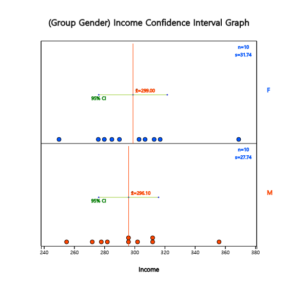
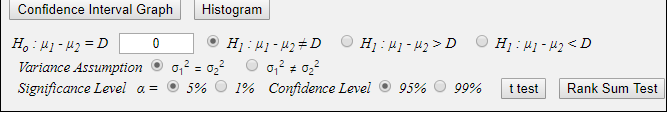
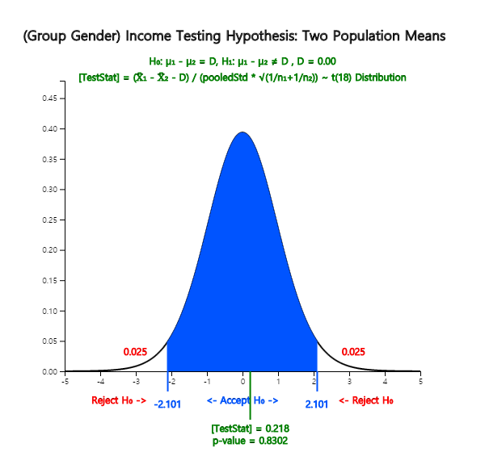
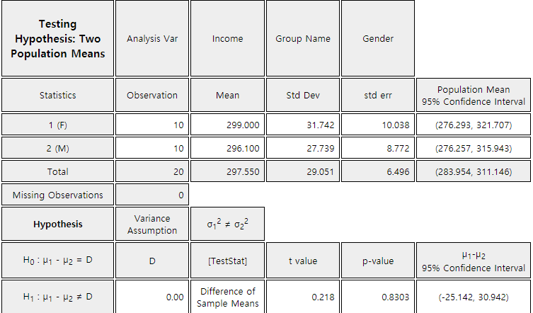
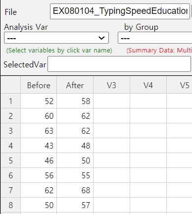
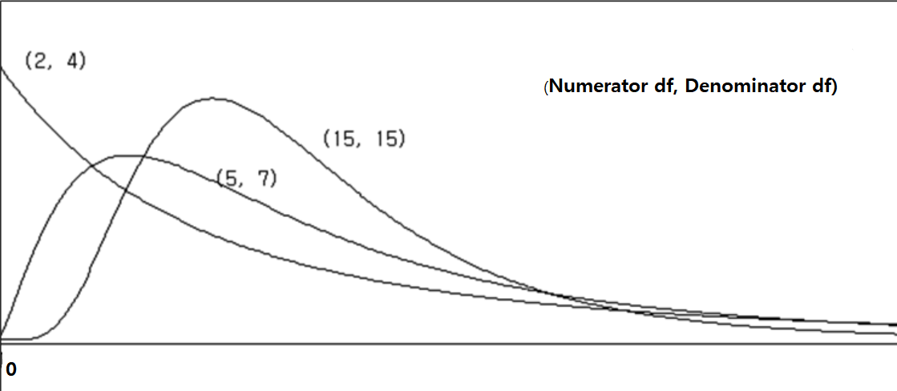

::: container-fluid
:::

::: {.col-sm-9 .col-sm-offset-3 .col-md-10 .col-md-offset-2 .main}
## Chapter 8. Testing Hypothesis for Two Population Parameters

       ❮   **Chapter 7**       

-   [8.1 Testing Hypothesis for Two Population
    Means](../chapter08/080101.html)
-   [  8.1.1 Two Independent Samples](../chapter08/080101.html)
-   [  8.1.2 Paired Sample](../chapter08/080102.html)
-   [8.2 Testing Hypothesis for Two Population
    Variances](../chapter08/0802.html)
-   [8.3 Testing Hypothesis for Two Population
    Proportions](../chapter08/0803.html)
-   [8.4 Exercise](../chapter08/0804.html)

###### [[\[book\]]{.underline}](book08.pdf){target="_blank"}    [[\[eStat YouTube Channel\]]{.underline}](https://www.youtube.com/channel/UCw2Rzl9A4rXMcT8ue8GH3IA){target="_blank"}

### CHAPTER OBJECTIVES

In Chapter 7, we discussed how to test hypotheses about parameters in a
single population.

In this chapter, we discuss testing hypothesis to compare population
parameters of two populations.

Section 8.1 discusses a t-test for testing hypothesis of two population
means when samples are independent and when samples are paired.

Section 8.2 discusses a F-test for testing hypothesis of two population
variances.

Section 8.3 discusses a Z-test for testing hypothesis of two population
proportions when samples are large enough.

       ❮   **Chapter 7**       
:::
::: container-fluid
:::

::: {.col-sm-9 .col-sm-offset-3 .col-md-10 .col-md-offset-2 .main}
## Chapter 8. Testing Hypothesis for Two Population Parameters

             

### 8.1 Testing Hypothesis for Two Population Means

::: presentation-video-link
[presentation](080101.pdf){.presentation-link target="_blank"}   
[video](https://youtu.be/S21BDljaOKM){.video-link target="_blank"}
:::

::: mainTable
There are many examples comparing means of two populations as follows:

::: textL30M10
\- Is there a difference between the starting salary of male graduates
and of female graduates in this year's college graduates?
:::

::: textL30M10
\- Is there a difference in the weight of the products produced in the
two production lines?
:::

::: textL30M10
\- Did the special training for typists to increase the speed of typing
really bring about an increase in the speed of typing?
:::

As such, a comparison of the two population means ( and ) is possible by
testing hypothesis that the difference in the population means is
greater than, or less than, or equal to zero. The comparison of two
population means differs depending on whether samples are extracted
independently from each population or not (referred to as paired
samples).
:::

#### 8.1.1 Two Independent Samples

::: mainTable
Generally, testing hypothesis for two population means can be divided
into three types, depending on the type of the alternative hypothesis as
follows. $$ 
        \begin{multline}
        \shoveleft 1)\quad H_0 : \mu_1 - \mu_2 = D_0 \qquad H_1 : \mu_1 - \mu_2 \gt D_0 \\
        \shoveleft 2)\quad H_0 : \mu_1 - \mu_2 = D_0 \qquad H_1 : \mu_1 - \mu_2 \lt D_0 \\
        \shoveleft 3)\quad H_0 : \mu_1 - \mu_2 = D_0 \qquad H_1 : \mu_1 - \mu_2 \ne D_0 \\
        \end{multline}
      $$ Here $D_0$ is the value for the difference in population means
to be tested.

When samples are selected independently from each other in the
population, the estimator of the difference of the population means
$\mu_1 - \mu_2$ is the difference in sample means
${\overline x}_1 - {\overline x}_2$. The sampling distribution of all
possible sample mean differences is approximately a normal distribution
with the mean $\mu_1 - \mu_2$ and variance
$\frac{\sigma^2_1}{n_1} + \frac{\sigma^2_2}{n_2}$ if both sample sizes
are large enough.

Since the population variances $\sigma^2_1$ and $\sigma^2_2$ are usually
unknown, estimates of these variances, $s^2_1$ and $s^2_2$, are used to
test the hypothesis. The test statistic differs slightly depending on
the assumption of two population variances. If two populations follow
normal distributions and their variances can be assumed the same, the
testing hypothesis for the difference of two population means uses the
following statistic. $$ 
        \frac { ({\overline x}_1 - {\overline x}_2 ) - D_0 }{\sqrt{\frac{s^2_p}{n_1} +\frac{s^2_p}{n_2} } } 
        \qquad \text{where } s^2_p  = \frac{(n_1 -1 )s^2_1 + (n_2 -1)s^2_2}{n_1 + n_2 -2}
      $$ $s^2_p$ is an estimator of the population variance called as a
**pooled variance** which is an weighted average of two sample variances
$s^2_1$ and $s^2_2$ by using the sample sizes as weights when population
variances are assumed to be the same.

The above statistic follows a $t$-distribution with $n_1 + n_2 -2$
degrees of freedom and it is used to test the difference of two
population means as follows:

Table 8.1.1 Testing hypothesis of two population means\
- independent samples, populations are normal distributions, two
population variances are assumed to be equal

  -------------------------------------------------------------------------------------------------------------------------------------------------------------------------------------------
  Type of Hypothesis                        Decision Rule
  ----------------------------------------- -------------------------------------------------------------------------------------------------------------------------------------------------
  1\) $\; H_0 : \mu_1 - \mu_2 = D_0$\       If $\frac { ({\overline x}_1 - {\overline x}_2 ) - D_0 }{\sqrt{\frac{s^2_p}{n_1} +\frac{s^2_p}{n_2} } } > t_{n_1 + n_2 -2; α}$, then reject
  $\quad\,\, H_1 : \mu_1 - \mu_2 > D_0$     $H_0$, else accept $H_0$

  2\) $\; H_0 : \mu_1 - \mu_2 = D_0$\       If $\frac { ({\overline x}_1 - {\overline x}_2 ) - D_0 }{\sqrt{\frac{s^2_p}{n_1} +\frac{s^2_p}{n_2} } } < - t_{n_1 + n_2 -2; α}$, then reject
  $\quad\,\, H_1 : \mu_1 - \mu_2 < D_0$     $H_0$, else accept $H_0$

  3\) $\; H_0 : \mu_1 - \mu_2 = D_0$\       If
  $\quad\,\, H_1 : \mu_1 - \mu_2 \ne D_0$   $\left | \frac { ({\overline x}_1 - {\overline x}_2 ) - D_0 }{\sqrt{\frac{s^2_p}{n_1} +\frac{s^2_p}{n_2} } } \right | > t_{n_1 + n_2 -2; α/2}$,
                                            then reject $H_0$, else accept $H_0$
  -------------------------------------------------------------------------------------------------------------------------------------------------------------------------------------------

Note: If sample sizes are large enough ($n_1 > 30, n_2 >30$),
$t$-distribution is approximately close to the standard normal
distribution and the decision rule may use the standard normal
distribution.
:::

::: mainTableGrey
**Example 8.1.1** Two machines produce cookies at a factory and the
average weight of a cookie bag should be 270g. Cookie bags were sampled
from each of two machines to examine the weight of the cookie bag. The
average weight of 15 cookie bags extracted from the machine 1 was 275g
and their standard deviation was 12g, and the average weight of 14
cookie bags extracted from the machine 2 was 269g and the standard
deviation was 10g. Test whether weights of cookie bags produced by two
machines are different at the 1% significance level. Check the test
result using 『eStatU』.

**Answer**

The hypothesis of this problem is
$\small H_0 : \mu_1 = \mu_2 ,\, H_1 : \mu_1 \ne \mu_2$. Hence the
decision rule is as follows. $$ \small
        \begin{multline}
        \shoveleft '\text{If } \left | \frac { ({\overline x}_1 - {\overline x}_2 ) - D_0 }{\sqrt{\frac{s^2_p}{n_1} +\frac{s^2_p}{n_2} } } \right | > t_{n_1 + n_2 -2; α/2} , \text{ then reject } H_0 ’ \\
        \end{multline}
      $$ where $\small D_0 = 0$ and the information in this example can
be summarized as follows. $$ \small
        \begin{multline}
        \shoveleft n_1 = 15,\quad \overline x_1 = 275,\quad s_1 = 12 \\
        \shoveleft n_2 = 14,\quad \overline x_2 = 269,\quad s_2 = 10 \\
        \end{multline}
      $$ Therefore, the calculation of the statistics are as follows.
$$ \small
        \begin{multline}
        \shoveleft s^2_p  = \frac{(n_1 -1 )s^2_1 + (n_2 -1)s^2_2}{n_1 + n_2 -2} 
          = \frac{(15 - 1 ) 12^2 + (14 - 1) 10^2}{15 + 14 -2} = 122.815 \\
        \shoveleft \left | \frac {275 - 269} { \sqrt{\frac{122.815}{15} +\frac{122.815}{14} } } \right | = 1.457 \\
        \shoveleft t_{15 + 14 -2; 0.01/2} = t_{27: 0.005} = 2.7707 \\
        \end{multline}
      $$ Since 1.457 \< 2.7707, $H_0$ can not be rejected.

In 『eStatU』 menu, select 'Testing Hypothesis $\mu_1 , \mu_2$', In the
window shown in \<Figure 8.1.1\>, check the alternative hypothesis of
not equal case at \[Hypothesis\], check the variance assumption of
\[Test Type\] as the equal case, check the significance level of 1%,
check the independent sample, and enter sample sizes $n_1 , n_2$, sample
means $\overline x_1 , \overline x_2$, and sample variances as in
\<Figure 8.1.1\>.

::: width:650

<input class="qrBtn" onclick="window.open(addrStr[106])" src="QR/eStatU800_TestMu12.svg" type="image"/>

{.imgFig600400}

::: figText
\<Figure 8.1.1\> Testing hypothesis for two population means using
『eStatU』
:::

:::

Click the \[Execute\] button will show the result of testing hypothesis
as \<Figure 8.1.2\>.

{.imgFig600400}

::: figText
\<Figure 8.1.2\> Testing hypothesis for two population means -- case of
the same population variances
:::
:::

::: mainTable
If variances of two populations are different, the test statistic $$ 
        \frac { ({\overline x}_1 - {\overline x}_2 ) - D_0 }{\sqrt{\frac{s^2_1}{n_1} +\frac{s^2_2}{n_2} } } 
      $$ do not follow a $t$-distribution even if populations are
normally distributed. The testing hypothesis for two population means
when their population variances are different is called a Behrens-Fisher
problem and several methods to solve this problem have been studied. The
Satterthwaite method approximates the degrees of freedom of the
$t$-distribution in the decision rule in Table 8.1.1 with $\phi$ as
follows. $$
        \phi = \frac { \left( \frac{s_1^2}{n_1} + \frac{s_2^2}{n_2} \right)^2 }
                     { \frac { \left( \frac{s_1^2}{n_1} \right)^2 } {n_1 -1} + \frac { \left( \frac{s_2^2}{n_2} \right)^2 } {n_2 -1} }  
      $$
:::

Table 8.1.2 Testing hypothesis of two population means\
- independent samples, populations are normal distributions, two
population variances are assumed to be different

  ------------------------------------------------------------------------------------------------------------------------------------------------------------------------------------
  Type of Hypothesis                        Decision Rule
  ----------------------------------------- ------------------------------------------------------------------------------------------------------------------------------------------
  1\) $\; H_0 : \mu_1 - \mu_2 = D_0$\       If $\frac { ({\overline x}_1 - {\overline x}_2 ) - D_0 }{\sqrt{\frac{s^2_1}{n_1} +\frac{s^2_2}{n_2} } } > t_{\phi ; α}$, then reject
  $\quad\,\, H_1 : \mu_1 - \mu_2 > D_0$     $H_0$, else accept $H_0$

  2\) $\; H_0 : \mu_1 - \mu_2 = D_0$\       If $\frac { ({\overline x}_1 - {\overline x}_2 ) - D_0 }{\sqrt{\frac{s^2_1}{n_1} +\frac{s^2_2}{n_2} } } < - t_{\phi ; α}$, then reject
  $\quad\,\, H_1 : \mu_1 - \mu_2 < D_0$     $H_0$, else accept $H_0$

  3\) $\; H_0 : \mu_1 - \mu_2 = D_0$\       If
  $\quad\,\, H_1 : \mu_1 - \mu_2 \ne D_0$   $\left | \frac { ({\overline x}_1 - {\overline x}_2 ) - D_0 }{\sqrt{\frac{s^2_1}{n_1} +\frac{s^2_2}{n_2} } } \right | > t_{\phi ; α/2}$,
                                            then reject $H_0$, else accept $H_0$
  ------------------------------------------------------------------------------------------------------------------------------------------------------------------------------------

::: mainTableGrey
**Example 8.1.2** If two population variances are assumed to be
different in \[Example 8.1.1\], test whether weights of cookie bags
produced from two machines are equal or not at a 1% significance level.
Check the test result using 『eStatU』.

**Answer**

Since the population variances are different, the degrees of freedom of
distribution is approximated as follows: $$ \small
        \begin{multline}
        \shoveleft \phi = \frac { \left( \frac{12^2}{15} + \frac{10^2}{14} \right)^2 }
                     { \frac { \left( \frac{12^2}{15} \right)^2 } {15 -1} + \frac { \left( \frac{10^2}{14} \right)^2 } {14 - 1} } = 26.67 \\
        \shoveleft t_{26.7; 0.01/2} = 2.773 \\
        \end{multline}
      $$ Since 1.457 \< 2.773, $H_0$ can not be rejected.

In order to practice using 『eStatU』, select the different population
variances assumption of \[Test Type\] in the window of \<Figure 8.1.1\>
and click the \[Execute\] button to see the result as shown in \<Figure
8.1.3\>.

{.imgFig600400}

::: figText
\<Figure 8.1.3\> Testing hypothesis for two population means -- Case of
two different population variances
:::
:::

::: mainTableGrey
**Example 8.1.3** (Monthly wages by male and female)

Samples of 10 male and female college graduates this year were randomly
taken and their monthly average wages were examined as follows: (Unit
10,000 KRW)

::: textLeft
Male 272 255 278 282 296 312 356 296 302 312\
Female 276 280 369 285 303 317 290 250 313 307\
Ex ⇨ eBook ⇨ EX080103_WageByGender.csv.
:::

Using 『eStat』, answer the following questions.

::: textL20M20
1\) If population variances are assumed to be the same, test the
hypothesis at the 5% significance level whether the average monthly wage
for male and female is the same.
:::

::: textL20M20
2\) If population variances are assumed to be different, test the
hypothesis at the 5% significance level whether the average monthly wage
for male and female is the same.
:::

**Answer**

::: textL20M20
1\) In 『eStat』, enter raw data of gender (M or F) and income as shown
in \<Figure 8.1.4\> on the sheet. This type of data input is similar to
all statistical packages. After entering the data, click the icon for
testing two population means and select \'Analysis Var\' as V2 and \'By
Group\' variable as V1. A 95% confidence interval graph that compares
sample means of two populations will be displayed as \<Figure 8.1.5\>.
:::

::: width:650

<input class="qrBtn" onclick="window.open(addrStr[25])" src="QR/EX080103.svg" type="image"/>

{.imgFig150200}

::: figText
\<Figure 8.1.4\> Data input for testing two population means
:::

:::

{.imgFig600540}

::: figText
\<Figure 8.1.5\> Dot graph and confidence Intervals by gender for
testing two population means
:::

In the options window as in \<Figure 8.1.6\> located at the below of the
Graph Area, enter the average difference $\small D = 0$ for the desired
test, select the variance assumption $\sigma_1^2 = \sigma_2^2$, select
the 5% significance level and click the \[t-test\] button. Then the
graphical result of testing hypothesis for two population means will be
shown as in \<Figure 8.1.7\> and the test result as in \<Figure 8.1.8\>.

{.imgFig400100}

::: figText
\<Figure 8.1.6\> Options to test for two population means
:::

{.imgFig600540}

::: figText
\<Figure 8.1.7\> Testing hypothesis for and -- case of the same
population variances
:::

{.imgFig600540}

::: figText
\<Figure 8.1.8\> result of testing hypothesis for two population means
if population variances are the same
:::

::: textL20M20
2\) Select the variance assumption $\sigma_1^2 \ne \sigma_2^2$ at the
option window and click \[t-test\] button under the graph to display the
graph of the hypothesis test and the test result table as in \<Figure
8.1.9\> and \<Figure 8.1.10\>.
:::

{.imgFig600540}

::: figText
\<Figure 8.1.9\> Testing hypothesis for and -- case of the different
population variances
:::

{.imgFig600540}

::: figText
\<Figure 8.1.10\> result of testing hypothesis for two population means
if population variances are different
:::
:::

::: mainTablePink
::: width:650px

<input class="qrBtn" onclick="window.open(addrStr[63])" src="QR/PR080101.svg" type="image"/>

**Practice 8.1.1** (Oral Cleanliness by Brushing Methods)\
Oral cleanliness scores were examined for 8 samples who are using the
basic brushing method (coded 1) and 7 samples who are using the rotation
method (coded 2). The data are saved at the following location of
『eStat』.

::: {clsss="textLeft"}
Ex ⇨ eBook ⇨ PR080101_ToothCleanByBrushMethod.csv
:::

::: textL20M20
1\) If population variances are the same, test the hypothesis at the 5%
significance level whether scores for both brushing methods are the same
using 『eStat』.
:::

::: textL20M20
2\) If population variances are different, test the hypothesis at the 5%
significance level whether scores for both brushing methods are the same
using 『eStat』.
:::

:::
:::

::: mainTablePink
#### Multiple Choice Exercise

\*\*\* Choose one answer and click \[Submit\] button

::: textL30M30
8.1 One professor claims that \'A student who studies in the morning
will get better math score than a student who studies in the evening.\'
Assume that $\mu_1$ is the average exam score of students who study in
the morning and $\mu_2$ is the average exam score of students who study
in the evening. What is the null hypothesis of this test?
:::

<form name="Q1">
<label><input name="item" type="radio" value="1"/> \(\mu_1 \gt \mu_2\)</label> 
<label><input name="item" type="radio" value="2"/> \(\mu_1 \ge \mu_2\)</label> 
<label><input name="item" type="radio" value="3"/> \(\mu_1 \ne \mu_2\)</label> 
<label><input name="item" type="radio" value="4"/> \(\mu_1 = \mu_2\)</label> 

<input onclick="radio(8,1,Q1)" type="button" value="Submit"/>    
      <input id="ansQ1" size="15" type="text"/>

</form>

::: textL30M30
8.2 What is the alternative hypothesis of the test of the above question
8.1?
:::

<form name="Q2">
<label><input name="item" type="radio" value="1"/> \(\mu_1 \gt \mu_2\)</label> 
<label><input name="item" type="radio" value="2"/> \(\mu_1 \ge \mu_2\)</label> 
<label><input name="item" type="radio" value="3"/> \(\mu_1 \ne \mu_2\)</label> 
<label><input name="item" type="radio" value="4"/> \(\mu_1 = \mu_2\)</label> 

<input onclick="radio(8,2,Q2)" type="button" value="Submit"/>    
      <input id="ansQ2" size="15" type="text"/>

</form>

::: textL30M30
8.3 A researcher claims that "After age of 40 and over, there is no
difference in weight between male and female." Assume the average weight
of males whose age is 40 and more is $\mu_1$ and the average weight of
females whose age is 40 and more is $\mu_2$. What is the alternative
hypothesis of the test?
:::

<form name="Q3">
<label><input name="item" type="radio" value="1"/> \(\mu_1 =   \mu_2\)</label> 
<label><input name="item" type="radio" value="2"/> \(\mu_1 \ne \mu_2\)</label> 
<label><input name="item" type="radio" value="3"/> \(\mu_1 \gt \mu_2\)</label> 
<label><input name="item" type="radio" value="4"/> \(\mu_1 \lt \mu_2\)</label> 

<input onclick="radio(8,3,Q3)" type="button" value="Submit"/>    
      <input id="ansQ3" size="15" type="text"/>

</form>

::: textL30M30
8.4 We want to test whether two population means are equal or not using
t-test. Which one of the following is not a required assumption?
:::

<form name="Q4">
<label><input name="item" type="radio" value="1"/> Populations are normal distributions.</label> 
<label><input name="item" type="radio" value="2"/> Two population variances are the same.</label> 
<label><input name="item" type="radio" value="3"/> Samples are selected independently.</label> 
<label><input name="item" type="radio" value="4"/> Samples are collected using cluster sampling method.</label> 

<input onclick="radio(8,4,Q4)" type="button" value="Submit"/>    
      <input id="ansQ4" size="15" type="text"/>

</form>

::: textL30M30
8.5 Which sampling distribution is used to test whether two population
means are equal or not when sample sizes are small?
:::

<form name="Q5">
<label><input name="item" type="radio" value="1"/> Normal distribution </label> 
<label><input name="item" type="radio" value="2"/> \(t\)-distribution</label> 
<label><input name="item" type="radio" value="3"/> chi-square distribution</label> 
<label><input name="item" type="radio" value="4"/> \(F\)-distribution</label> 

<input onclick="radio(8,5,Q5)" type="button" value="Submit"/>    
      <input id="ansQ5" size="15" type="text"/>

</form>

:::

             
:::
::: container-fluid
:::

::: {.col-sm-9 .col-sm-offset-3 .col-md-10 .col-md-offset-2 .main}
## Chapter 8. Testing Hypothesis for Two Population Parameters

             

#### 8.1.2 Paired Sample

::: presentation-video-link
[presentation](080102.pdf){.presentation-link target="_blank"}   
[video](https://youtu.be/LmjMNOvDB7A){.video-link target="_blank"}
:::

::: mainTable
The testing hypothesis for two population means in the previous section
is based on two samples extracted independently from each population.
However, in some cases it is difficult to extract samples independently,
or if samples are extracted independently, then the resulting analysis
may be meaningless, because characteristics of each sample differ too
much.

For example, you want to give typists a special education to increase
the speed of typing and want to see if this training has been effective
in the speed of typing. In this case, if different samples are extracted
before and after education, it is difficult to measure the effectiveness
of education, because individual differences are severe. In order to
overcome the individual difference for a typist who has sampled before
training education, if you measure the typing speed before and after the
training for the typist, the effect of special education can be well
understood.

A hypothesis test that uses same samples to perform similar experiments
to compare means of two populations is called a paired comparison. In
the paired comparison, we calculate the difference ($d_i$) between
paired data $x_{i1}$ and $x_{i2}$ as shown in Table 8.1.3 and obtain the
mean of differences ($\overline d$) and variance of differences
($s_{d}^2$).

Table 8.1.3 Data for a paired comparison

  -----------------------------------------------------------------------------------------------------
  Sample of population 1\ Sample of population 2\ Difference of pair\
  $x_{i1}$                $x_{i2}$                $d_{i} = x_{i1} - x{i2}$
  ----------------------- ----------------------- -----------------------------------------------------
  $x_{11}$\               $x_{12}$\               $d_1 = x_{11} - x_{12}$\
  $x_{21}$\               $x_{22}$\               $d_2 = x_{21} - x_{22}$\
  $\cdots$\               $\cdots$\               $\cdots$\
  $x_{n1}$                $x_{n2}$                $d_n = x_{n1} - x_{n2}$

                                                  Mean of $d_i$ : $\overline d = \frac{1}{n} \sum d_i$\
                                                  Variance of $d_i$ :
                                                  $s_d^2 = \frac{1}{n-1} \sum (d_i - \overline d )^2$
  -----------------------------------------------------------------------------------------------------

When two populations of normal distributions have the same mean, the
sample statistic $\frac{\overline d}{\frac{s_d}{\sqrt{n}}}$ follows a
$t$-distribution with the $n-1$ degrees of freedom. It allows the
testing of the difference between two population means in case of the
paired comparison as follows.
:::

Table 8.1.4 Testing hypothesis of two population means (paired
comparison)\
- two populations are normal distributions, and paired sample case

  -----------------------------------------------------------------------------------------------------------------------------
  Type of Hypothesis                        Decision Rule
  ----------------------------------------- -----------------------------------------------------------------------------------
  1\) $\; H_0 : \mu_1 - \mu_2 = D_0$\       If $\frac{\overline d - D_0}{\frac{s_d}{\sqrt{n}}} > t_{n-1; α}$, then reject
  $\quad\,\, H_1 : \mu_1 - \mu_2 > D_0$     $H_0$, else accept $H_0$

  2\) $\; H_0 : \mu_1 - \mu_2 = D_0$\       If $\frac{\overline d - D_0}{\frac{s_d}{\sqrt{n}}} < - t_{n-1; α}$, then reject
  $\quad\,\, H_1 : \mu_1 - \mu_2 < D_0$     $H_0$, else accept $H_0$

  3\) $\; H_0 : \mu_1 - \mu_2 = D_0$\       If
  $\quad\,\, H_1 : \mu_1 - \mu_2 \ne D_0$   $\left | \frac{\overline d - D_0}{\frac{s_d}{\sqrt{n}}} \right | > t_{n-1; α/2}$,
                                            then reject $H_0$, else accept $H_0$
  -----------------------------------------------------------------------------------------------------------------------------

::: mainTableGrey
**Example 8.1.4** The following is the result of a special training to
improve the typing speed of eight typists before and after the training.
Test whether or not the typing speed has increased at the 5%
significance level. Assume that the speed of typing follows a normal
distribution. Check the test result using 『eStat』 and 『eStatU』.

  -----------------------------------------------------------------------
  id                      Typing speed\           Typing speed\
                          before training\        after training\
                          (unit: words/min)       (unit: words/min)
  ----------------------- ----------------------- -----------------------
  1\                      52\                     58\
  2\                      60\                     62\
  3\                      63\                     62\
  4\                      43\                     48\
  5\                      46\                     50\
  6\                      56\                     55\
  7\                      62\                     68\
  8                       50                      57

  -----------------------------------------------------------------------

**Answer**

This problem is for testing the null hypothesis
$\small H_0 : \mu_1 - \mu_2 = 0$ to the alternative hypothesis
$\small H_1 : \mu_1 - \mu_2 < 0$ to compare the typing speed of typists
before training (population 1) and after training (population 2) using
paired samples. Therefore, the decision rule is as follows. $$ \small
        \begin{multline}
        \shoveleft \text{If } \frac{\overline d - D_0}{\frac{s_d}{\sqrt{n}}} < - t_{n-1; α}, \text{ then reject } H_0 \\
        \end{multline}
      $$ Calculated differences ($d_i$) of paired samples before and
after training, the mean ($\overline d$) and standard deviation ($s_d$)
of differences are as follows.

  -----------------------------------------------------------------------------
  id                Typing speed\     Typing speed\     Difference\
                    before training\  after training\   $d_i$
                    (unit: words/min) (unit: words/min) 
  ----------------- ----------------- ----------------- -----------------------
  1\                52\               58\               -6\
  2\                60\               62\               -2\
  3\                63\               62\               1\
  4\                43\               48\               -5\
  5\                46\               50\               -4\
  6\                56\               55\               1\
  7\                62\               68\               -6\
  8                 50                57                -7

                                                        Mean of $d_i$ :
                                                        $\overline d = -3.5$\
                                                        Standard deviation of
                                                        $d_i$ : $s_d = 3.16$
  -----------------------------------------------------------------------------

The test statistic is as follows: $$ \small
        \begin{multline}
        \shoveleft \frac{\overline d - D_0}{\frac{s_d}{\sqrt{n}}} = \frac{-3.5}{\frac{3.16}{\sqrt{8}}} \\
        \shoveleft - t_{n-1; α} = - t_{8-1: 0.05} = - t_{7: 0.05} = -1.8946 \\
        \end{multline}
      $$ Therefore, $\small H_0$ is rejected and conclude that the
training increased the typing speed.

In 『eStatU』 menu, select 'Testing Hypothesis: $\mu_1 , \mu_2$', select
the alternative hypothesis at \[Hypothesis\], check the 5% significance
level, check 'paired sample' at \[Test Type\], and enter data of sample
1 and sample 2 of paired samples at \[Sample Data\] as in \<Figure
8.1.11\>.

::: width:650

<input class="qrBtn" onclick="window.open(addrStr[106])" src="QR/eStatU800_TestMu12.svg" type="image"/>

{.imgFig600400}

::: figText
\<Figure 8.1.11\> Testing hypothesis for two population means using
『eStatU』 - paired sample
:::

:::

Click the \[Execute\] button to calculate the sample mean and sample
standard deviation of differences ($\overline d$ and $s_d^2$ ) and to
show the result of the hypothesis test as \<Figure 8.1.12\>.

{.imgFig600400}

::: figText
\<Figure 8.1.12\> Result of testing hypothesis for two population means
using 『eStatU』 - paired sample
:::

In 『eStat』, the paired data is entered in two columns as shown in
\<Figure 8.1.13\>. Click the icon for testing two population means and
select \'Analysis Var\' as V1 and \'by Group\' as V2 to show the dot
graph and the confidence interval for differences of paired data as in
\<Figure 8.1.14\>.

Ex ⇨ eBook ⇨ EX080104_TypingSpeedEducation.csv.

::: width:650

<input class="qrBtn" onclick="window.open(addrStr[26])" src="QR/EX080104.svg" type="image"/>

{.imgFig150200}

::: figText
\<Figure 8.1.13\> Data input of paired sample
:::

:::

{.imgFig600540}

::: figText
\<Figure 8.1.14\> Dot graph of difference data of paired sample
:::

Enter the mean difference $\small D$ = 0 for the desired test in the
options window below the graph, select the 5% significance level, and
press the \[t-test\] button to display the result of the hypothesis test
for paired samples such as \<Figure 8.1.15\> and \<Figure 8.1.16\>.

{.imgFig600540}

::: figText
\<Figure 8.1.15\> Testing hypothesis for two population means using
『eStat』 - paired sample
:::

{.imgFig600600}

::: figText
\<Figure 8.1.16\> Result of testing hypothesis for two population means
using 『eStat』 - paired sample
:::
:::

::: mainTablePink
::: width:650px

<input class="qrBtn" onclick="window.open(addrStr[64])" src="QR/PR080102.svg" type="image"/>

**Practice 8.1.2** Randomly sampled data of (wife age, husband age) for
8 couples are as follows.

::: textLeft
(28, 28) (29, 30) (18, 21) (29, 33) (22, 22) (18, 21) (40, 35) (24, 29)
:::

::: textLeft
Ex ⇨ eBook ⇨ PR080102_CoupleAge.csv.
:::

Test whether the population mean of wife's age is the same as the
population mean husband's age or not. Use the significance level of
0.05.

:::
:::

::: mainTablePink
#### Multiple Choice Exercise

\*\*\* Choose one answer and click \[Submit\] button

::: textL30M30
8.6 16 couples are randomly selected to compare their ages as follows:
What is the name of this kind of data?
:::

::: textLeft
(woman age, man age)
:::

::: textLeft
(28, 28) (29, 30) (18, 21) (29, 33) (22, 22) (18, 21) (40, 35) (24, 29)
:::

::: textLeft
(21, 31) (20, 24) (20, 34) (23, 25) (33, 39) (33, 35) (40, 29) (39, 40)
:::

<form name="Q6">
<label><input name="item" type="radio" value="1"/> independent data</label> 
<label><input name="item" type="radio" value="2"/> paired data</label> 
<label><input name="item" type="radio" value="3"/> random data</label> 
<label><input name="item" type="radio" value="4"/> cluster data</label> 

<input onclick="radio(8,6,Q6)" type="button" value="Submit"/>    
      <input id="ansQ6" size="15" type="text"/>

</form>

:::

             
:::
::: container-fluid
:::

::: {.col-sm-9 .col-sm-offset-3 .col-md-10 .col-md-offset-2 .main}
## Chapter 8. Testing Hypothesis for Two Population Parameters

             

### 8.2 Testing Hypothesis for Two Population Variances

::: presentation-video-link
[presentation](0802.pdf){.presentation-link target="_blank"}   
[video](https://youtu.be/y5x9ZOQ-F0o){.video-link target="_blank"}
:::

::: mainTable
Consider following examples to compare two population variances.

::: textL30M10
\- When comparing two population means in the previous section, we
studied that if the sample size was small, the decision rule for testing
hypothesis were different depending on whether two population variances
were the same or different. So how can we test if two population
variances are the same?
:::

::: textL30M10
\- The quality of bolts used to assemble cars depends on the strict
specification for their diameters. Average diameters of bolts produced
by two factories were said to be the same and if the variance of
diameters is smaller, it is considered as superior production. How can
you compare variances of the diameter?
:::

When comparing variances ($\sigma_1^2$ and $\sigma_2^2$) of two
populations, the ratio ($\frac{\sigma_1^2}{\sigma_2^2}$) of variances is
calculated instead of comparing the difference in variances. If the
ratio of variances is greater, smaller, or equal to 1, you can see that
$\sigma_1^2$ is greater, smaller, or equal to $\sigma_2^2$. The reason
for using the ratio of variances instead of the difference of variances
is that it is easy to find the sampling distribution of the ratio of
variances mathematically. If two populations follow normal
distributions, and if $n_1$ and $n_2$ samples are collected randomly
from each population, the ratio of two sample variances $S_1^2$ and
$S_2^2$ such as $$
        \frac{ \left( \frac{S_1^2}{\sigma_1^2} \right) } { \left( \frac{S_2^2}{\sigma_2^2} \right) }
      $$ follows a $F$-distribution with the numerator degrees of
freedom $n_1 - 1$ and the denominator degrees of freedom $n_2 - 1$.
Using this fact, we can perform testing hypothesis on the ratio of
population variances.

$F$-distribution is an asymmetrical distribution group with two
parameters, the numerator degrees of freedom and denominator degrees of
freedom. \<Figure 8.2.1\> shows $F$-distributions for different
parameters.

{.imgFig400300}

::: figText
\<Figure 8.2.1\> $F$-distribution of different degrees of freedom.
:::

Testing hypothesis for two population variances can be performed using
the $F$-distribution as following Table 8.2.1.
:::

Table 8.2.1 Testing hypothesis for two population variances\
- Two populations are normally distributed -

  --------------------------------------------------------------------------------------------------
  Type of Hypothesis                            Decision Rule
  --------------------------------------------- ----------------------------------------------------
  1\) $\; H_0 : \sigma_1^2 = \sigma_2^2$\       If $\frac {S_1^2}{S_2^2} > F_{n_1 -1, n_2 -1; α}$,
  $\quad\,\, H_1 : \sigma_1^2 \gt \sigma_2^2$   then reject $H_0$, else accept $H_0$

  2\) $\; H_0 : \sigma_1^2 = \sigma_2^2$\       If $\frac {S_1^2}{S_2^2} < F_{n_1 -1, n_2 -1; 1-α}$,
  $\quad\,\, H_1 : \sigma_1^2 \lt \sigma_2^2$   then reject $H_0$, else accept $H_0$

  3\) $\; H_0 : \sigma_1^2 = \sigma_2^2$\       If
  $\quad\,\, H_1 : \sigma_1^2 \ne \sigma_2^2$   $\frac {S_1^2}{S_2^2} < F_{n_1 -1, n_2 -1; 1-α/2}$
                                                or $\frac {S_1^2}{S_2^2} > F_{n_1 -1, n_2 -1; α/2}$,
                                                then reject $H_0$, else accept $H_0$
  --------------------------------------------------------------------------------------------------

::: mainTableGrey
**Example 8.2.1** A company that produces a bolt has two plants. One
day, ten bolts produced in Plant 1 were sampled randomly and the
variance of diameter was $0.11^2$. 12 bolts produced in Plant 2 were
sampled randomly and the variance of diameter was $0.13^2$. Test whether
variances of the bolt from two plants are the same or not with the 5%
significance level. Check the test result using 『eStatU』.

**Answer**

The hypothesis of this problem is
$\small H_0 : \sigma_1^2 = \sigma_2^2 ,\; H_1 : \sigma_1^2 \ne \sigma_2^2$,
and its decision rule is as follows: $$ \small
        \begin{multline}
        \shoveleft \text{If } \frac {S_1^2}{S_2^2} < F_{n_1 -1, n_2 -1; 1-α/2}  \text{ or } 
             \frac {S_1^2}{S_2^2} > F_{n_1 -1, n_2 -1; α/2} \text{ then reject } H_0  
        \end{multline}
      $$ The test statistic using two sample variances and the
percentile of $\small F$-distribution is as follows. $$ \small
        \begin{multline}
        \shoveleft  \frac {S_1^2}{S_2^2} = \frac{0.0121}{0.0169} = 0.716 \\ 
        \shoveleft   F_{n_1 -1, n_2 -1; 1-α/2} = F_{11,9;0.975} = 0.279 \\  
        \shoveleft   F_{n_1 -1, n_2 -1; α/2}   = F_{11,9;0.025} = 3.912 \\  
        \end{multline}
      $$ Hence the hypothesis $\small H_0$ can not be rejected and
conclude that two variances are equal.

In 『eStatU』 menu, select 'Testing Hypothesis
$\sigma_1^2 , \sigma_2^2$. At the window shown in \<Figure 8.2.2\>,
enter $n_1 = 12, n_2 = 10, s_1^2 = 0.0121, s_2^2 = 0.0169$. Click the
\[Execute\] button to reveal the hypothesis test result shown in
\<Figure 8.2.3\>.

::: width:650

<input class="qrBtn" onclick="window.open(addrStr[107])" src="QR/eStatU820_TestSigma12.svg" type="image"/>

{.imgFig600400}

::: figText
\<Figure 8.2.2\> Data input for testing hypothesis of two population
variances using 『eStatU』
:::

:::

{.imgFig600400}

::: figText
\<Figure 8.2.3\> Testing hypothesis for two population variances using
『eStatU』
:::
:::

::: mainTableGrey
**Example 8.2.2** (Income of college graduates, data of \[Example
8.1.3\])

Samples of 10 male and 10 female graduates of the college this year were
taken and the average monthly income were examined as follows: Test
whether variances of two populations are equal.

::: textLeft
Male 272 255 278 282 296 312 356 296 302 312
:::

::: textLeft
Female 276 280 369 285 303 317 290 250 313 307 (Unit 10000 KRW)
:::

::: textLeft
Ex ⇨ eBook ⇨ EX080103_WageByGender.csv.
:::

**Answer**

In 『eStat』, enter the gender and income in two columns on the sheet as
shown in \<Figure 8.2.4\>. This type of data input is similar to all
statistical packages. Once you entered the data, click on the icon for
testing two population variances and select \'Analysis Var\' as V2 and
\'By Groups\' as V1. Then a mean-standard deviation graph for each group
will be appeared as in \<Figure 8.2.5\>.

::: width:650

<input class="qrBtn" onclick="window.open(addrStr[123])" src="QR/EX080202.svg" type="image"/>

{.imgFig150200}

::: figText
\<Figure 8.2.4\> Data input for testing two population variances
:::

:::

{.imgFig600540}

::: figText
\<Figure 8.2.5\> Dot graph and mean-standard deviation interval of each
group
:::

If you click the \[F-Test\] button int the options window below the
graph, a test result graph using $F$-distribution such as \<Figure
8.2.6\> is appeared in the Graph Area and the result table is appeared
as in \<Figure 8.2.7\> appears in the Log Area.

{.imgFig600540}

::: figText
\<Figure 8.2.6\> Testing hypothesis for two population variances
:::

{.imgFig600400}

::: figText
\<Figure 8.2.7\> Result table of testing two population variances
:::
:::

::: mainTablePink
::: width:650px

<input class="qrBtn" onclick="window.open(addrStr[107])" src="QR/eStatU820_TestSigma12.svg" type="image"/>

**Practice 8.2.1** Tire products from two companies are known to have
the same average life span of 80,000km. However, there seems to be a
difference in the variance. Sixteen tires from each of the two companies
were randomly selected and run under similar conditions to measure their
life span. The sample variance was 4,500 and 2,500, respectively.

Using 『eStatU』, test the null hypothesis that the variances of the
tire life of two products are the same at the 5% significance level.

:::
:::

::: mainTablePink
#### Multiple Choice Exercise

\*\*\* Choose one answer and click \[Submit\] button

::: textL30M30
8.7 Which sampling distribution is used to test whether two population
variances are equal or not when populations are normally distributed?
:::

<form name="Q7">
<label><input name="item" type="radio" value="1"/> Normal distribution </label> 
<label><input name="item" type="radio" value="2"/> \(t\)-distribution</label> 
<label><input name="item" type="radio" value="3"/> chi-square distribution</label> 
<label><input name="item" type="radio" value="4"/> \(F\)-distribution</label> 

<input onclick="radio(8,7,Q7)" type="button" value="Submit"/>    
      <input id="ansQ7" size="15" type="text"/>

</form>

:::

             
:::
::: container-fluid
:::

::: {.col-sm-9 .col-sm-offset-3 .col-md-10 .col-md-offset-2 .main}
## Chapter 8. Testing Hypothesis for Two Population Parameters

             

### 8.3 Testing Hypothesis for Two Population Proportions

::: presentation-video-link
[presentation](0803.pdf){.presentation-link target="_blank"}   
[video](https://youtu.be/-lI78tN44X8){.video-link target="_blank"}
:::

::: mainTable
Consider the following examples which compare two population
proportions.

::: textL30M10
\- Is there a gender gap in the approval rating for a particular
candidate in this year\'s presidential election?
:::

::: textL30M10
\- A factory has two machines that make products. Do two machines have
different defect rates?
:::

Comparing proportions $p_1$ and $p_2$ of two populations is possible by
testing the difference between two proportions $p_1 - p_2$ as the
comparison of two population means. The difference in sample proportions
${\hat p}_1 - {\hat p}_2$ from two populations follows a normal
distribution with the mean $p_1 - p_2$ and variance
$\frac{p_1 (1-p_1 )}{n_1} + \frac{p_2 (1-p_2 )}{n_2}$ when two sample
sizes are large enough. Since we do not know population proportions
$p_1$ and $p_2$ to estimate the variance, weighted average value
$\overline p$ for two sample proportions ${\hat p}_1$ and ${\hat p}_2$
by using sample sizes as weights is used as follows:

$$
         \overline p = \frac { n_1 {\hat p}_1 + n_2 {\hat p}_2 } {n_1 + n_2 }
      $$ The testing hypothesis for two population proportions uses the
following test statistic. $$
        \frac { {\hat p}_1 - {\hat p}_2 } { \sqrt{ \frac{\overline p (1 - \overline p )}{n_1 } + \frac{\overline p (1 - \overline p ) }{n_2 }  } } 
      $$

Table 8.3.1 Testing hypothesis for two population proportions\
- two independent large samples -

  -------------------------------------------------------------------------------------------------------------------------------------------------------------------------------------------------------------
  Type of Hypothesis                  Decision Rule
  ----------------------------------- -------------------------------------------------------------------------------------------------------------------------------------------------------------------------
  1\) $\; H_0 : p_1 = p_2$\           If $\frac { {\hat p}_1 - {\hat p}_2 } { \sqrt{ \frac{\overline p (1 - \overline p )}{n_1 } + \frac{\overline p (1 - \overline p ) }{n_2 } } } > z_{α}$, then reject $H_0$
  $\quad\,\, H_1 : p_1 > p_2$         

  2\) $\; H_0 : p_1 = p_2$\           If $\frac { {\hat p}_1 - {\hat p}_2 } { \sqrt{ \frac{\overline p (1 - \overline p )}{n_1 } + \frac{\overline p (1 - \overline p ) }{n_2 } } } < - z_{α}$, then reject
  $\quad\,\, H_1 : p_1 < p_2$         $H_0$

  3\) $\; H_0 : p_1 = p_2$\           If
  $\quad\,\, H_1 : p_1 \ne p_2$       $\left | \frac { {\hat p}_1 - {\hat p}_2 } { \sqrt{ \frac{\overline p (1 - \overline p )}{n_1 } + \frac{\overline p (1 - \overline p ) }{n_2 } } } \right | > z_{α/2}$,
                                      then reject $H_0$
  -------------------------------------------------------------------------------------------------------------------------------------------------------------------------------------------------------------
:::

::: mainTableGrey
**Example 8.3.1** A survey was conducted for a presidential election and
samples were selected independently from both male and female
populations. 54 out of 225 samples from the male population supported
the candidate A and 52 out of 175 samples from the female population
supported the candidate A. Test whether there is a difference in
approval ratings of the male and female populations with the 5%
significance level. Check the result using 『eStatU』.

**Answer**

The hypothesis of this problem is
$\small \; H_0 : p_1 = p_2 , H_1 : p_1 \ne p_2$, and its decision rule
is as follows: $$ \small
        \begin{multline}
        \shoveleft '\text{If } \left | \frac { {\hat p}_1 - {\hat p}_2 } { \sqrt{ \frac{\overline p (1 - \overline p )}{n_1 } + \frac{\overline p (1 - \overline p ) }{n_2 }  } }  \right | > z_{α/2}, \text{ then reject } H_0
        \end{multline}
      $$ Since ${\hat p}_1 = \frac{54}{225}$ = 0.240,
${\hat p}_2 = \frac{52}{175} = 0.297,\; \overline p$ and the test
statistic can be calculated as follows: $$ \small
        \begin{multline}
        \shoveleft \overline p = \frac{54 + 52}{ 225 + 175} = \frac{106}{400} = 0.265 \\
        \shoveleft \left | \frac { {\hat p}_1 - {\hat p}_2 } { \sqrt{ \frac{\overline p (1 - \overline p )}{n_1 } + \frac{\overline p (1 - \overline p ) }{n_2 }  } }  \right |  
           = \left | \frac { {0.240} - {0.297} } { \sqrt{ \frac{0.265(1 - 0.265)}{225} + \frac{0.265(1 - 0.265)}{175}  } }  \right | = 1.28\\
        \shoveleft z_{α/2} = z_{0.05/2} = z_{0.025} = 1.96 \\
        \end{multline}
      $$ Therefore, the hypothesis $\small H_0$ can not be rejected and
we conclude that there is not enough evidence that the approval ratings
of male and female are different.

In 『eStatU』 menu, select 'Testing Hypothesis $p_1 , p_2$' and enter
$n_1 = 225,\; {\hat p}_1 = 0.240,\; n_2 = 175,\; {\hat p}_2 = 0.297$ as
shown in \<Figure 8.3.1\>. Clicking the \[Execute\] button will show the
result of the hypothesis test as shown in \<Figure 8.3.2\>.

::: width:650

<input class="qrBtn" onclick="window.open(addrStr[108])" src="QR/eStatU840_TestP12.svg" type="image"/>

{.imgFig600400}

::: figText
\<Figure 8.3.1\> Data input for testing two population proportions in
『eStatU』
:::

:::

{.imgFig600400}

::: figText
Result of testing hypothesis for two population proportions using
『eStatU』
:::
:::

::: mainTableGrey
**Example 8.3.2** In 2000, a simple random sampling of 1,000 people aged
15 to 29 across the country examined the status of marriage, and 63.5
percent were single. In 2020, another 1,000 people were surveyed
independently, with 69.8 percent of them being single. From this fact,
can you say that there has been a tendency to get married late in recent
years? In other words, test at the 5% significance level whether the
population aged 15 to 29 in 2020 is more likely to be single than in
2000. What is the p-value of this test?

**Answer**

The hypothesis of this problem is
$\small \; H_0 : p_1 = p_2 , \; H_1 : p_1 < p_2$ , and its decision rule
is as follows. $$ \small
        \begin{multline}
        \shoveleft '\text{If } \frac { {\hat p}_1 - {\hat p}_2 } { \sqrt{ \frac{\overline p (1 - \overline p )}{n_1 } + \frac{\overline p (1 - \overline p ) }{n_2 }  } }  < - z_{α},  \text{ then reject } H_0 ' \\
        \end{multline}
      $$ Since ${\hat p}_1 = 0.635$ and ${\hat p}_2 = 0.698$,
$\overline p$ and the test statistic are as follows: $$ \small
        \begin{multline}
        \shoveleft \overline p = \frac{1000 \times 0.635 + 1000 \times 0.698}{1000 + 1000} = \frac{0.635 + 0.698}{2} = 0.667 \\
        \shoveleft \frac { {\hat p}_1 - {\hat p}_2 } { \sqrt{ \frac{\overline p (1 - \overline p )}{n_1 } + \frac{\overline p (1 - \overline p ) }{n_2 }  } }    
           =  \frac { {0.635} - {0.698} } { \sqrt{ \frac{0.667(1 - 0.667)}{1000} + \frac{0.667(1 - 0.667)}{1000}  } }  = -2.989\\
        \shoveleft - z_{α} = - z_{0.05} = -1.645 \\
        \end{multline}
      $$ Therefore, $\small H_0$ is rejected. and conclude that the
proportion of unmarried people in 2020 has been increased. $p$-value can
be calculated as follows: $$ \small
        \begin{multline}
        \shoveleft p-\text{value} = P(Z \lt -2.989) = 0.0014 \\
        \end{multline}
      $$
:::

::: mainTablePink
::: width:650px

<input class="qrBtn" onclick="window.open(addrStr[108])" src="QR/eStatU840_TestP12.svg" type="image"/>

**Practice 8.3.1** In a company, the labor union found that 63 percent
of 200 salesmen who did not receive a college education wanted to take
it back even now. The company did a similar study 10 years ago and it
was only 58 percent of 100 salesmen wanted it. Test the null hypothesis
that the desire for college education is not different from 10 years ago
using the significance level of 0.05. Samples were selected
independently.

:::
:::

::: mainTable
In the previous two examples of comparing two population proportions,
two sample proportions were calculated from independent samples.

Suppose two candidates ran in an election and one thousand samples were
selected to test whether there was any difference on the candidate\'s
approval rating. The approval ratings $p_1$ and $p_2$ of two candidates
obtained from the sample are not independent, because unlike two
previous examples they are calculated from one set of samples. So the
test method should be different. The following statistic are used to
test whether there is a difference in approval ratings of two
candidates. $$
        \frac{{\hat p}_1 - {\hat p}_2}{\sigma_{{\hat p}_1 - {\hat p}_2}},\quad 
        \text{ where } \sigma_{{\hat p}_1 - {\hat p}_2} = \sqrt{\frac{p_1 (1-p_1) + p_2 (1-p_2) +2p_1 p_2}{n}}
      $$ Here, $\sigma_{{\hat p}_1 - {\hat p}_2}$ is the standard error
of ${\hat p}_1 - {\hat p}_2$.

Assuming that two population proportions are equal, the estimated value
$\sigma_{{\hat p}_1 - {\hat p}_2}$ is as follows $$
        \sigma_{{\hat p}_1 - {\hat p}_2} = \sqrt{\frac{2 \overline p}{n}}, \text { where } \overline p = \frac{{\hat p}_1 + {\hat p}_2}{2} 
      $$ If the sample size is large, the test statistic follows a
normal distribution which allows proper testing hypothesis according to
the form of the alternative hypothesis. As such, it is important to
distinguish between sample proportions from independent samples and not
independent samples when we compare two population proportions.
:::

::: mainTablePink
#### Multiple Choice Exercise

\*\*\* Choose one answer and click \[Submit\] button

::: textL30M30
8.8 Which sampling distribution is used to test whether two population
proportions are equal or not when sample sizes are large enough?
:::

<form name="Q8">
<label><input name="item" type="radio" value="1"/> Normal distribution </label> 
<label><input name="item" type="radio" value="2"/> \(t\)-distribution</label> 
<label><input name="item" type="radio" value="3"/> chi-square distribution</label> 
<label><input name="item" type="radio" value="4"/> \(F\)-distribution</label> 

<input onclick="radio(8,8,Q8)" type="button" value="Submit"/>    
      <input id="ansQ8" size="15" type="text"/>

</form>

::: textL30M30
8.9 In a company, a comparative study was conducted on leisure
activities of sales staffs and managing staffs. 400 staffs selected
independently from each of sales staffs and management staffs and
surveyed. We found that 288 sales staffs and 260 managing staffs
answered that they usually spend their leisure time on sports
activities. Which of the following is the null hypothesis for comparing
two groups?
:::

<form name="Q9">
<label><input name="item" type="radio" value="1"/> \(p_1 =  p_2\)</label> 
<label><input name="item" type="radio" value="2"/> \(p_1 \ne p_2\)</label> 
<label><input name="item" type="radio" value="3"/> \(p_1 \gt p_2\)</label> 
<label><input name="item" type="radio" value="4"/> \(p_1 \lt p_2\)</label> 

<input onclick="radio(8,9,Q9)" type="button" value="Submit"/>    
      <input id="ansQ9" size="15" type="text"/>

</form>

::: textL30M30
8.10 Which of the following is the alternative hypothesis in question
8.9?
:::

<form name="Q10">
<label><input name="item" type="radio" value="1"/> \(p_1 =  p_2\)</label> 
<label><input name="item" type="radio" value="2"/> \(p_1 \ne p_2\)</label> 
<label><input name="item" type="radio" value="3"/> \(p_1 \gt p_2\)</label> 
<label><input name="item" type="radio" value="4"/> \(p_1 \lt p_2\)</label> 

<input onclick="radio(8,10,Q10)" type="button" value="Submit"/>    
      <input id="ansQ10" size="15" type="text"/>

</form>

:::

             
:::
::: container-fluid
:::

::: {.col-sm-9 .col-sm-offset-3 .col-md-10 .col-md-offset-2 .main}
## Chapter 8. Testing Hypothesis for Two Population Parameters

              **Chapter 9**   ❯

### 8.4 Exercise

::: mainTablePink
::: textL30M30
8.1 An analyst studies two types of advertising methods (A and B) tried
by retailers. The variable is the sum of the amount spent on advertising
over the past year. The following is the sample statistics extracted
independently from retailers of each type. (Unit million USD)

::: textLeft
Type A: $n_1 = 60, \; {\overline x}_1 = 14.8, \; s_1^2 = 0.180$
:::

::: textLeft
Type B: $n_1 = 70, \; {\overline x}_2 = 14.5, \; s_2^2 = 0.133$
:::

::: textLeft
From these data, can you conclude that type A retailers have invested
more in advertising than type B retailers? (Significance level = 0.05)
:::

8.2 Paper making plants are looking to buy one of two forests. The
followings are diameters of 50 trees sampled from each forest. From
these data, test at the significance level of 0.05 whether the trees in
area B are on average smaller than those in area A. What is the p-value
of this test?

::: textLeft
Area A: ${\overline x}_1 = 28.25, \; s_1^2 = 25$
:::

::: textLeft
Area B: ${\overline x}_2 = 22.50, \; s_2^2 = 16$
:::

8.3 In order to check the period of residence at the current house in
region A and B, the following statistics were examined from simple
random samples of 100 households in A and 150 households in B. From this
data, can households in A area live shorter on average than those in B?
(Significance level = 0.05)

::: textLeft
Region A: ${\overline x}_1 = 33 months, \; s_1^2 = 900$
:::

::: textLeft
Region B: ${\overline x}_2 = 49 months, \; s_2^2 = 1050$
:::

8.4 An advertising analyst surveyed how much working men and housewives
were exposed to advertisements on radio, TV, newspaper and magazines.
The survey item was the number of advertisements that each group
encountered in a particular week and the sample mean and standard
deviation of each group are as shown in the table below. From these
data, can you say that housewives are exposed to more advertisements on
average than working men? (Significance level = 0.05)

::: textLeft
Working Men: $\,n_1 = 100, \; {\overline x}_1 = 200, \; s_1 = 50$
:::

::: textLeft
Housewives: $\quad n_2 = 144, \; {\overline x}_2 = 225, \; s_2 = 60$
:::

8.5 One company wants to test whether a female employee uses the phone
longer than a male employee. A sample survey of 10 males and 10 females
for one-day call time measurement are as follows. Is there a difference
in the average call time between male and female? Use the 5%
significance level.

::: textLeft
Male: 8 6 4 6 2 2 4 8 10 10
:::

::: textLeft
Female: 4 4 10 2 8 4 10 8 13 14 (unit minutes)
:::

8.6 One factory tries to compare the adhesion of motor oil from two
companies. Among the products of each company, 32 products were randomly
selected and tested as follows: Based on these data, can you conclude
that the adhesion means of the two company products are different?
(Significance level = 0.05.)

::: textLeft
Company A: 13 21 60 35 38 10 36 24 35 35 45 19 42 11 35 39 25 17 51 25
52 25 11 11 55 44 25 41 16 47 50 18
:::

::: textLeft
Company B: 46 52 66 65 71 67 47 48 58 42 66 69 60 80 45 47 69 75 43 46
74 73 43 70 51 72 65 45 76 48 56 64
:::

8.7 An industrial psychologist thinks that the big factor that workers
change jobs is self-esteem to workers\' individual work. The scholar
thinks that workers who change jobs frequently (group A) have lower
self-esteem than those who do not (group B). The following data are used
to measure the score of self-esteem by sampling each group
independently.

::: textLeft
Group A: 60 45 42 62 68 54 52 55 44 41
:::

::: textLeft
Group B: 70 72 74 74 76 91 71 78 78 83 50 52 66 65 53 52
:::

::: textL30
Can this data support the psychologist\'s idea? Assume that scores of
the population are normally distributed and that the population variance
is not known but the same. (Significance level = 0.01)
:::

8.8 In a business administration department of a university, a debate
arose over claims that men have more knowledge of the stock market than
women. To calm the dispute, the instructor sampled each of 15 men and
women independently and tested them for knowledge of the stock market.
The result is as follows.

::: textLeft
Women: 73 96 74 55 91 50 46 82 79 79 50 46 81 83
:::

::: textLeft
Men: 57 78 42 44 91 65 63 60 97 85 92 42 86 81 64
:::

::: textL30
According to the data, on average, can you say that men have more
knowledge of the stock market than women? Use the significance level of
0.05. What assumptions do you need?
:::

8.9 An oil company has developed a gasoline additive that will improve
the fuel mileage of gasoline. We used 16 pairs of cars to compare the
fuel mileage to see if it actually improved. Each pair of cars has the
same details as its structure, model, engine size, and other
relationship characteristics. When driving the test course using
gasoline, one of the pair selected randomly and added additives, the
other of the pair was driving the same course using gasoline without
additives. The following table shows the km per liter for each of pairs.
Is this data a basis for saying that additives increase fuel mileage?
Assume that the fuel mileage is normally distributed. Use 5%
significance level.

  -----------------------------------------------------------------------
  pair                    Additive $X_1$          No Additive $X_2$
  ----------------------- ----------------------- -----------------------
  1\                      17.1\                   16.3\
  2\                      12.7\                   11.6\
  3\                      11.6\                   11.2\
  4\                      15.8\                   14.9\
  5\                      14.0\                   12.8\
  6\                      17.8\                   17.1\
  7\                      14.7\                   13.4\
  8\                      16.3\                   15.4\
  9\                      10.8\                   10.1\
  10\                     14.9\                   13.7\
  11\                     19.7\                   18.3\
  12\                     11.4\                   11.0\
  13\                     11.4\                   10.5\
  14\                     9.3\                    8.7\
  15\                     19.0\                   17.9\
  16                      10.1                    9.4

  -----------------------------------------------------------------------

::: figText
(unit: km / liter)
:::

8.10 A study deals with a survey on whether car accidents in a village
can be reduced effectively by increasing the number of street lamps. The
following table shows the average number of accidents per night, one
year before and one year after putting street lamps on 12 locations.
Does this data provide evidence that street lamps have reduced nightly
car accidents? Use the 5% significance level.

  -----------------------------------------------------------------------
  Location                Before                  After
  ----------------------- ----------------------- -----------------------
  A\                      8\                      5\
  B\                      12\                     3\
  C\                      5\                      2\
  D\                      4\                      1\
  E\                      6\                      4\
  F\                      3\                      2\
  G\                      4\                      2\
  H\                      3\                      4\
  I\                      2\                      3\
  J\                      6\                      5\
  K\                      6\                      4\
  L                       9                       3

  -----------------------------------------------------------------------

8.11 The survey result of (wife's age, husband's age) by sampling 16
couples are as follows .

::: textLeft
(28, 28) (29, 30) (18, 21) (29, 33) (22, 22) (18, 21) (40, 35) (24, 29)
:::

::: textLeft
(21, 31) (20, 24) (20, 34) (23, 25) (33, 39) (33, 35) (40, 29) (39, 40)
:::

::: textL30
Test whether the wife's age is the same as the husband's age or not. Use
the significance level of 0.05.
:::

8.12 One person is considering the use of a test to compare between two
population means. 16 samples are randomly taken from two populations and
their sample variances are 28.5 and 9.5. Is this data shows evidence
that two population variances are the same? (Significance level = 0.05)

8.13 Certain studies have been planned to compare the two relaxing drugs
for office workers in stressful jobs. A medical team sampled eight
workers for each of two drugs and collected data on the strain. Two
sample variances are $s_1^2$ = 2916 and $s_2^2$ = 4624. Using the
significance level of 0.05, can this data be said to differ in two
population variances of tension? Explain necessary assumptions.

8.14 Let and be the number of days it takes for a plant to sprout its
wide leaves and narrow leaves, respectively. The measured data are as
follows.

::: textLeft
$n_x = 13, \; {\overline x} = 18.97, \; s_x^2 = 9.88$
:::

::: textLeft
$n_y = 9, \; {\overline y} = 23.20, \; s_y^2 = 4.08$
:::

::: textL30
If $X \sim N(\mu_x , \sigma_x^2 )$ and $Y \sim N(\mu_y , \sigma_y^2 )$,
test the following hypothesis using the 5% significance level.
:::

$$ \small
        H_0 : \frac{\sigma_x^2}{\sigma_y^2} = 1, H_1 : \frac{\sigma_x^2}{\sigma_y^2} > 1 
      $$

8.15 Both tire products are known to have an average life span of 80,000
km. However, there seems to be a difference in the variance. Sixteen
tires from each of two companies were randomly selected and run under
similar conditions to measure their life span. Sample variances were
4,500 and 2,200, respectively.

::: textL20M20
1\) Test the null hypothesis that variances of the tire life of two
products are the same at the significance levels of both 0.10 and 0.05.
:::

::: textL20M20
2\) Obtain 90% and 95% confidence intervals of the ratio
$\frac{\sigma_1^2}{\sigma_2^2}$.
:::

8.16 A carpet manufacturer is looking for materials that can withstand
temperature above 250 degree Fahrenheit. One of two materials is a
natural material and the other is a cheap artificial material, which
both have the same properties except for heat-resistant levels. As a
result of a heat-resistant experiment by independently selecting 250
samples from each of two materials, 36 samples from natural materials
and 45 samples from man-made materials failed at temperatures above 250
degrees Fahrenheit. Is there a difference in the heat resistance of two
materials from this data using the significance level is 0.05?

8.17 A labor union of a company found that 63 percent of 150 salespeople
who did not receive a college education wanted to take it back even now.
The company did a similar study 10 years ago, when only 58 percent of
160 people wanted it. Test the null hypothesis that the desire for
college education is not different from 10 years ago using the
significance level of 0.05. Samples were selected independently.

8.18 When we extracted 200 companies of the type A and examined them, we
found that 12% of them spent more than 1% of their total sales on
advertising. The other 200 companies of the type B independently
selected and examined, we found 15% of them spent more than 1% of their
total sales on advertising. Test the following hypotheses with the
significance level of 0.05. $$ \small
        H_0 : p_B \le p_A , H_1 : p_B \gt p_A 
      $$

8.19 In a company, a study was conducted on the leisure activities of
sales staffs and managing staffs. 400 persons were selected
independently from each of sales and managing staffs. 288 sales and 260
managing staffs answered that they usually spend their leisure time on
sports activities. From this data, can you say that the percentage of
two groups for the leisure time spent on sports activities is the same?
Use the significance level of 0.05.

8.20 In September 2013, a research institute surveyed 260 men and 263
women about a political issue and the response result is as follows. Do
you think there are significant differences in their way of thinking on
the political issue?\' Specify the null hypothesis and the alternative
hypothesis and test at the 5% significance level.

        Men   Women
  ----- ----- -------
  Yes   57%   65%
  No    43%   35%

8.21 In order to see whether the unemployment rate in two cities are
different, samples of 500 people were randomly selected from two cities
and found unemployment persons were 35 and 25 respectively. Can you say
that the unemployment rate in two cities is different? Describe the
necessary assumptions and calculate the $p$-value.
:::
:::

              **Chapter 9**   ❯
:::
