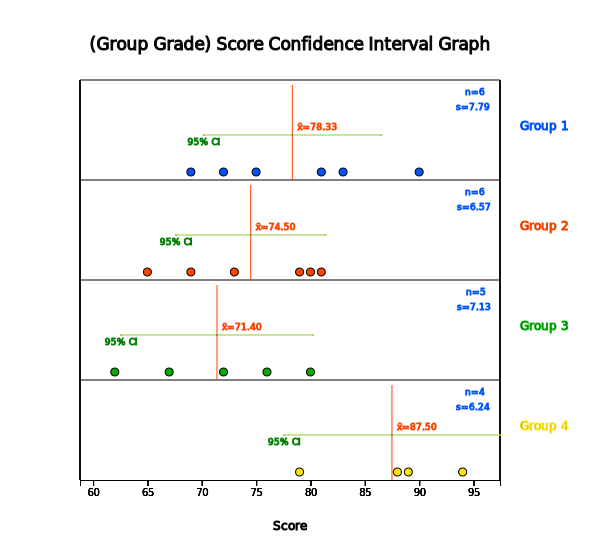
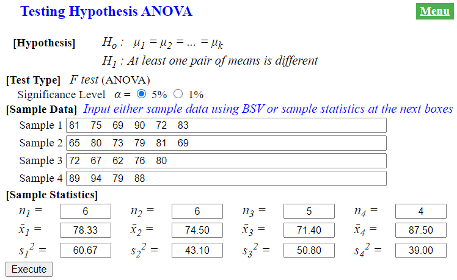
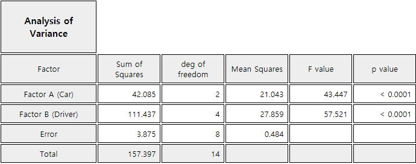

 
# Testing Hypothesis for Several Population Means

[book](pdf/book09.pdf){target="_blank"}
[eStat YouTube Channel](https://www.youtube.com/channel/UCw2Rzl9A4rXMcT8ue8GH3IA){target="_blank"}

**CHAPTER OBJECTIVES**

In testing hypothesis of the population mean described in chapters 7 and
8, the number of populations was one or two. However, many cases are
encountered where there are three or more population means to compare.

The analysis of variance (ANOVA) is used to test whether several
population means are equal or not. The ANOVA was first published by
British statistician R. A. Fisher as a test method applied to the study
of agriculture, but today its principles are applied in many
experimental sciences, including economics, business administration,
psychology and medicine.

In section 9.1, the one-way ANOVA for single factor is introduced. In
section 9.2, experimental designs for experiments are introduced. In
section 9.2, the two-way ANOVA for two factors experiments is
introduced.

:::

::: 

      
:::

      

## Analysis of Variance for Single Factor Experiments

::: presentation-video-link
[presentation](pdf/0901.pdf){.presentation-link target="_blank"}   
[video](https://youtu.be/az6KJp26dFA){.video-link target="_blank"}
:::

::: mainTable
In section 8.1, we discussed how to compare means of two populations
using the testing hypothesis. This chapter discusses how to compare
means of several populations. There are many examples of comparing means
of several populations as follows:

::: textL30M10
- Are average hours of library usage for each grade the same?

- Are yields of three different rice seeds equal?

- In a chemical reaction, are response rates the same at four different
temperatures?

- Are average monthly wages of college graduates the same at three
different cities?
:::

The group variable used to distinguish groups of the population, such as
the grade or the rice, is called a factor.
:::

::: mainTableYellow
**Factor**

The group variable used to distinguish groups of the population is
called a **factor**.
:::

::: mainTable
This section describes the one-way analysis of variance (ANOVA) which
compares population means when there is a single factor. Section 9.2
describes how the experiment is designed to extract sample data. Section
9.3 describes the two-way ANOVA to compare several population means when
there are two factors. Let\'s take a look at the following example.
:::

::: mainTableGrey
**Example 9.1.1** In order to compare the English proficiency of each
grade at a university, samples were randomly selected from each grade to
take the same English test, and data are as in Table 9.1.1. The last row
is a calculation of the average ${\overline y}_{1\cdot}$,
${\overline y}_{2\cdot}$, ${\overline y}_{3\cdot}$,
${\overline y}_{4\cdot}$ for each grade.

::: textLeft
Table 9.1.1 English Proficiency Score by Grade
:::

  Socre     Student 1   Student 2   Student 3   Student 4   Student 5   Student 6   Student Average
  --------- ----------- ----------- ----------- ----------- ----------- ----------- -------------------------------
  Grade 1   81          75          69          90          72          83          ${\overline y}_{1\cdot}$=78.3
  Grade 2   65          80          73          79          81          69          ${\overline y}_{2\cdot}$=74.5
  Grade 3   72          67          62          76          80                      ${\overline y}_{3\cdot}$=71.4
  Grade 4   89          94          79          88                                  ${\overline y}_{4\cdot}$=87.5

\[Ex\] ⇨ eBook ⇨ EX090101_EnglishScoreByGrade.csv.

::: textL20M20
1\) Using 『eStat』 , draw a dot graph of test scores for each grade and
compare their averages.
:::

::: textL20M20
2\) We want to test a hypothesis whether average scores of each grade
are the same or not. Set up a null hypothesis and an alternative
hypothesis.
:::

::: textL20M20
3\) Apply the one-way analysis of variances to test the hypothesis in
question 2).
:::

::: textL20M20
4\) Use 『eStat』 to check the result of the ANOVA test.
:::

**Answer**

::: textL20M20
1\) If you draw a dot graph of English scores by each grade, you can see
whether scores of each grade are similar. If you plot the 95% confidence
interval of the population mean studied in Chapter 6 on each dot graph,
you can see a more detailed comparison.\
In order to draw a dot graph with data shown in Table 9.1.1 using
『eStat』 , enter data on the sheet and set variable names to \'Grade\'
and \'Score\' as shown in \<Figure 9.1.1\>. In the variable selection
box which appears by clicking the ANOVA icon on the main menu of
『eStat』 , select \'Analysis Var\' as 'Score' and \'By Group\' as
'Grade'. The dot graph of English scores by each grade and the 95%
confidence interval are displayed as shown in \<Figure 9.1.2\>.
:::

::: width:650px

<input class="qrBtn" onclick="window.open(addrStr[27])" src="QR/EX090101.svg" type="image"/>

{.imgFig600400}

::: figText
\<Figure 9.1.1\> 『eStat』 data input for ANOVA
:::

:::

{.imgFig600400}

::: figText
\<Figure 9.1.2\> 95% Confidence Interval by grade
:::

::: textL20
To review the normality of the data, pressing the \[Histogram\] button
under this graph (\<Figure 9.1.3\>) will draw the histogram and normal
distribution together, as shown in \<Figure 9.1.4\>.
:::

{.imgFig600400}

::: figText
\<Figure 9.1.3\> Options of ANOVA
:::

{.imgFig600400}

::: figText
\<Figure 9.1.4\> Histogram of English score by grade
:::

\

::: textL20
\<Figure 9.1.2\> shows sample means as ${\overline y}_{1\cdot}$= 78.3,
${\overline y}_{2\cdot}$ = 74.5, ${\overline y}_{3\cdot}$ = 71.4,
${\overline y}_{1\cdot}$ = 87.5. The sample mean of the 4th grader is
relatively large and the order of the sample means in English is
${\overline y}_{3\cdot} \lt {\overline y}_{2\cdot} \lt {\overline y}_{1\cdot} \lt {\overline y}_{4\cdot}$.
${\overline y}_{2\cdot}$ and ${\overline y}_{3\cdot}$ are similar, but
${\overline y}_{4\cdot}$ is much greater than the other three.
Therefore, it can be expected that the population mean $\mu_{2}$ and
$\mu_{3}$ would be the same and $\mu_{4}$ will differ from three other
population means. However, we need to test whether this difference by
sample means is statistically significant.
:::

::: textL20M20
2\) In this example, the null hypothesis to test is that population
means of English scores of the four grades are all the same, and the
alternative hypothesis is that population means of the English scores
are not the same. In other words, if are the population means of English
scores for each grade, the hypothesis to test can be written as follows,

::: textL30
Null hypothesis $\small \qquad \qquad \; H_0$:
$\mu_1 = \mu_2 = \mu_3 = \mu_4$
:::

::: textL30
Alternative hypothesis $\quad \small H_1$: at least one pair of $\mu_i$
is not the same
:::
:::

::: textL20M20
3\) A measure that can be considered first as a basis for testing
differences in multiple sample means would be the distance from each
mean to the overall mean. In other words, if the overall sample mean for
all 21 students is expressed as $\overline y_{\cdot \cdot}$, the
distance from each sample mean to the overall mean is as follows when
the number of samples in each grade is weighted. This distance is called
the between sum of squares (SSB) or the treatment sum of squares (SSTr).

::: textL30
$\small SSTr = 6(78.3 - {\overline y}_{\cdot \cdot})^2 + 6(74.5 - {\overline y}_{\cdot \cdot})^2 + 5(71.4 - {\overline y}_{\cdot \cdot})^2 + 4(87.5 - {\overline y}_{\cdot \cdot})^2$
= 643.633
:::
:::

::: textL20
If the distance $\small SSTr$ is close to zero, all sample means of
English scores for four grades are similar.

However, this treatment sum of squares can be larger if the number of
populations increases. It requires modification to become a test
statistic to determine whether several population means are equal. The
distance from each observation to its sample mean of the grade is called
the within sum of squares (SSW) or the error sum of squares (SSE) as
defined below.

::: textL30
$\small SSE = (81 -{\overline y}_{1 \cdot})^2 + (75 -{\overline y}_{1 \cdot})^2 + \cdots + (83 -{\overline y}_{1 \cdot})^2$\
$\small \qquad + (65 -{\overline y}_{2 \cdot})^2 + (80 -{\overline y}_{2 \cdot})^2 + \cdots + (69 -{\overline y}_{2 \cdot})^2$\
$\small \qquad + (72 -{\overline y}_{3 \cdot})^2 + (67 -{\overline y}_{3 \cdot})^2 + \cdots + (80 -{\overline y}_{3 \cdot})^2$\
$\small \qquad + (89 -{\overline y}_{4 \cdot})^2 + (94 -{\overline y}_{4 \cdot})^2 + \cdots + (88 -{\overline y}_{4 \cdot})^2$\
= 839.033
:::

If population distributions of English scores in each grade follow
normal distributions and their variances are the same, the following
test statistic has the distribution.

::: textL30
$\small F_{0} = \frac { \frac{SSTr}{(4-1)} } { \frac{SSE}{(21-4)} }$
:::

This statistic can be used to test whether population English scores of
four grades are the same or not. In the test statistic, the numerator
$\frac{SSTr}{4-1}$ is called the treatment mean square (MSTr) which
implies a variance between grade means. The denominator
$\frac{SSE}{21-4}$ is called the error mean square (MSE) which implies a
variance within each grade. Thus, the above test statistics are based on
the ratio of two variances which is why the test of multiple population
means is called an analysis of variance (ANOVA).

Calculated test statistic which is the observed $\small F$ value,
$\small F_{0}$ , using data of English scores for each grade is as
follows.

::: textLeft
$F_{0} = \frac { \frac{SSTr}{(4-1)} } { \frac{839.033}{(21-4)} } = \frac { \frac{643.633}{(4-1)} } { \frac{SSE}{(21-4)} } = 4.347$
:::

Since $\small F_{3,17; 0.05}$ = 3.20, the null hypothesis that
population means of English scores of each grade are the same,
$\small H_0 : \mu_1 = \mu_2 = \mu_3 = \mu_4$ , is rejected at the 5%
significance level. In other words, there is a difference in population
means of English scores of each grade.

The following ANOVA table provides a single view of the above
calculation.
:::

  Factor      Sum of Squares   Degree of freedom   Mean Squares               F ratio
  ----------- ---------------- ------------------- -------------------------- ---------------
  Treatment   SSTr=643.633     4-1                 MSTr=$\frac{643.633}{3}$   $F_0 = 4.347$
  Error       SSE= 839.033     21-4                MSE=$\frac{839.033}{17}$   
  Total       SST = 1482.666   20                                             

::: textL20M20
4\) In \<Figure 9.1.3\>, if you select the significance level of 5%,
confidence level of 95%, and click \[ANOVA F test\] button, a graph
showing the location of the test statistic in the F distribution is
appeared as shown in \<Figure 9.1.5\>. Also, in the Log Area, the mean
and confidence interval tables and test result for each grade are
appeared as in\<Figure 9.1.6\>.
:::

::: textL20
{.imgFig600400}

::: figText
\<Figure 9.1.5\> 『eStat』 ANOVA F test
:::

{.imgFig600400}

::: figText
\<Figure 9.1.6\> 『eStat』 Basic Statistics and ANOVA table
:::

\
The analysis of variance is also possible using 『eStatU』. Entering the
data as \<Figure 9.1.7\> and clicking the \[Execute\] button will have
the same result as in \<Figure 9.1.5\>.

{.imgFig600400}

::: figText
\<Figure 9.1.7\> ANOVA data input at 『eStatU』
:::
:::
:::

::: mainTable
The above example refers to two variables, the English score and grade.
The variable such as the English score is called as an analysis variable
or a response variable. The response variable is mostly a continuous
variable. The variable used to distinguish populations such as the grade
is called a group variable or a factor variable which is mostly a
categorical variable. Each value of a factor variable Is called a level
of the factor and the number of these levels is the number of
populations to be compared. In the above example, the factor has four
levels, 1st, 2nd, 3rd and 4th grade. The term \'response\' or \'factor\'
was originated to analyze data through experiments in engineering,
agriculture, medicine and pharmacy.

The analysis of variance method that examines the effect of single
factor on the response variable is called the one-way ANOVA. Table 9.1.2
shows the typical data structure of the one-way ANOVA when the number of
levels of a factor is $k$ and the numbers of observation at each level
are $n_1 , n_2 , ... , n_k$.
:::

::: textLeft
Table 9.1.2 Notation of the one-way ANOVA
:::

  Factor     Observed values of sample                Average
  ---------- ---------------------------------------- ------------------------
  Level 1    $Y_{11} \; Y_{12}\; \cdots \;Y_{1n_1}$   $\overline Y_{1\cdot}$
  Level 2    $Y_{21} \; Y_{22}\; \cdots \;Y_{2n_2}$   $\overline Y_{2\cdot}$
  $\cdots$   $\cdots$                                 $\cdots$
  Level k    $Y_{k1} \; Y_{k2}\; \cdots \;Y_{kn_k}$   $\overline Y_{k\cdot}$

::: mainTable
Statistical model for the one-way analysis of variance is given as
follows: $$
         \begin{align}
           Y_{ij} &= \mu_i + \epsilon_{ij} \\
                  &= \mu + \alpha_i + \epsilon_{ij}, i=1,2,...,k; j=1,2,..., n_i  \\
         \end{align}
        $$ $Y_{ij}$ represents the $j^{th}$ observed value of the
response variable for the $i^{th}$ level of factor. The population mean
of the $i^{th}$ level, $\mu_{i}$, is represented as $\mu + \alpha_{i}$
where $\mu$ is the mean of entire population and $\alpha_{i}$ is the
effect of $i^{th}$ level for the response variable. $\epsilon_{ij}$
denotes an error term of the $j^{th}$ observation for the $i^{th}$ level
and the all error terms are assumed independent of each other and follow
the same normal distribution with the mean 0 and variance $\sigma^{2}$.

The error term $\epsilon_{ij}$ is a random variable in the response
variable due to reasons other than levels of the factor. For example, in
the English score example, differences in English performance for each
grade can be caused by other variables besides the variables of grade,
such as individual English study hours, gender and IQ. However, by
assuming that these changes are relatively small compared to changes due
to differences in grade, the error term can be interpreted as the sum of
these various reasons.

The hypothesis to test can be represented using $\alpha_{i}$ instead of
$\mu_{i}$ as follows:

::: textL20
Null hypothesis $\qquad \quad \;\;\; H_0$:
$\alpha_1 = \alpha_2 = \alpha_3 = \alpha_4$ = 0\
:::

::: textL20
Alternative hypothesis $\quad H_1$: at least one $\alpha_i$ is not equal
to 0
:::

In order to test the hypothesis, the analysis of variance table as Table
9.1.3 is used.
:::

::: textLeft
Table 9.1.3 Analysis of variance table of the one-way ANOVA
:::

  Factor      Sum of Squares   Degree of freedom   Mean Squares              F ratio
  ----------- ---------------- ------------------- ------------------------- --------------------------
  Treatment   SSTr             $k-1$               MSTr=$\frac{SSTr}{k-1}$   $F_0 = \frac{MSTr}{MSE}$
  Error       SSE              $n-k$               MSE=$\frac{SSE}{n-k}$     
  Total       SST              $n-1$                                         

::: textL20
$\qquad n = \sum_{i=1}^{n} \; n_i$\
:::

::: mainTable
The three sum of squares for the variance analysis can be described as
follows: For an explanation, first define the following statistics:

::: textL20
${\overline Y}_{i \cdot} \;$ Mean of observations at the $i^{th}$ level\
${\overline Y}_{\cdot \cdot} \;$ Mean of total observations
:::

**SST** =
$\sum_{i=1}^{k} \sum_{j=1}^{n_i} ( Y_{ij} - {\overline Y}_{\cdot \cdot} )^2 \;$
:\
The sum of squared distances between observed values of the response
variable and the mean of total observations is called the **total sum of
squares** (SST).

**SSTr** =
$\sum_{i=1}^{k} \sum_{j=1}^{n_i} ( {\overline Y}_{i \cdot} - {\overline Y}_{\cdot \cdot} )^2 \;$
:\
The sum of squared distances between the mean of each level and the mean
of total observations is called the **treatment sum of squares** (SSTr).
It represents the variation between level means.

**SSE** =
$\sum_{i=1}^{k} \sum_{j=1}^{n_i} ( {Y}_{ij} - {\overline Y}_{i \cdot} )^2 \;$
:\
The sum of squared distances between observations of the $i^{th}$ level
and the mean of the $i^{th}$ level is referred to as \'within
variation,\' and is called the **error sum of squares** (SSE).

The degree of freedom of each sum of squares is determined by the
following logic: The SST consists of $n$ number of squares,
$( Y_{ij} - {\overline Y}_{\cdot \cdot} )^2$, but
${\overline Y}_{\cdot \cdot}$ should be calculated first, before SST is
calculated, and hence the degree of freedom of SST is $n-1$. The SSE
consists of $n$ number of squares,
$( {Y}_{ij} - {\overline Y}_{i \cdot} )^2$, but the number of values,
${\overline Y}_{1 \cdot}, {\overline Y}_{2 \cdot}, ... , {\overline Y}_{k \cdot}$
should be calculated first, before SSE is calculated, and hence the
degree of freedom of SSE is $n-k$. The degree of freedom of SSTr is
calculated as the degree of freedom of SST minus the degree of freedom
of SSE which is . In the one-way analysis of variance, the following
facts are always established:
:::

::: mainTableYellow
**Partition of sum of squares and degrees of freedom**

Sum of squares: SST = SSTr + SSE\
Degrees of freedom: $(n-1) = (k-1) + (n-k)$
:::

::: mainTable
The sum of squares divided by the corresponding degrees of freedom is
referred to as the mean squares and Table 9.1.3 defines the treatment
mean squares (MSTr) and error mean squares (MSE). As in the meaning of
the sum of squares, the treatment mean square implies the average
variation between each level of the factor, and the error mean square
implies the average variation within observations in each level.
Therefore, if MSTr is relatively much larger than MSE, we can conclude
that the population means of each level, $\mu_i$, are not the same. So
by what criteria can you say it is relatively much larger?

The calculated $F$ value, $F_0$, in the last column of the ANOVA table
represents the relative size of MSTr and MSE. If the assumptions of
$\epsilon_{ij}$ based on statistical theory are satisfied, and if the
null hypothesis $\small H_0 : \alpha_1 = \alpha_2 = \cdots = \alpha_k$ =
0 is true, then the below test statistic follows a F distribution with
degrees of freedoms $k-1$ and $n-k$. $$
        F_{0} = \frac { \frac{SSTr}{(k-1)} } { \frac{SSE}{(n-k)} } 
      $$ Therefore, when the significance level is $\alpha$ for a test,
if the calculated value $F_0$ is greater than the value of
$F_{k-1,n-k; α}$, then the null hypothesis is rejected. That is, it is
determined that the population means of each factor level are not all
the same.
:::

::: mainTableYellow
**One-way analysis of variance test**

::: textL20
Null hypothesis $\qquad \qquad \; H_0$:
$\alpha_1 = \alpha_2 = \alpha_3 = \alpha_4$\
:::

::: textL20
Alternative hypothesis $\quad H_1$: at least one $\alpha_i$ is not equal
to 0
:::

::: textL20
Test Statistic
$\;\; F_{0} = \frac { \frac{SSTr}{(k-1)} } { \frac{SSE}{(n-k)} }$
:::

::: textL20
Decision Rule If $\;\; F_0 > F_{k-1,n-k; α}$, then reject $H_0$
:::

(Note: 『eStat』 calculates the $p$-value of this test. Hence if the
$p$-value is smaller than the significance level $\alpha$, then reject
the null hypothesis. )
:::

::: mainTablePink
::: width:650px

<input class="qrBtn" onclick="window.open(addrStr[65])" src="QR/PR090101.svg" type="image"/>

**Practice 9.1.1** **(Plant Growth by Condition)**\
Results from an experiment to compare yields (as measured by dried
weight of plants) obtained under a control (leveled 'ctrl') and two
different treatment conditions (leveled 'trt1' and 'trt2'). The weight
data with 30 observations on control and two treatments ('crtl', 'trt1',
'trt2'), are saved at the following location of 『eStat』. Answer the
followings using 『eStat』 ,

::: textLeft
\[Ex\] ⇨ eBook ⇨ PR090101_Rdatasets_PlantGrowth.csv
:::

::: textL20M20
1\) Draw a dot graph of weights for each control and treatments.
:::

::: textL20M20
2\) Test a hypothesis whether the weights are the same or not. Use the
5% significance level.
:::

:::
:::

      

      

::: 

             

### Multiple Comparison

::: presentation-video-link
[presentation](pdf/090101-02.pdf){.presentation-link target="_blank"}   
[video](https://youtu.be/Re_gHPIkeNE){.video-link target="_blank"}
:::

::: mainTable
If the F test of the one-way ANOVA does not show a significant
difference between each level of the factor, it can be concluded that
there is no difference between each level of populations. However, if
you conclude that there are significant differences between each level
as shown in \[Example 9.1.1\], you need to examine which levels are
different from each other.

The analysis of differences between population means after ANOVA
requires several tests for the mean difference to be performed
simultaneously and it is called as the multiple comparison. The
hypothesis for the multiple comparison to test whether the level means,
$\mu_i$ and $\mu_j$, are equal is as follows: $$
        H_0 : \mu_i = \mu_j , \quad H_1 : \mu_i \ne \mu_j \quad i=1,2,...,k-1,\; j=i+1,i+2,...,k  
      $$ It means that there are $_{k}C_{2}$ tests to be done
simultaneously for the multiple comparisons if there is $k$ level of the
factor.

There are many multiple comparison tests, but Tukey\'s Honestly
Significant Difference (HSD) test is most commonly used. The statistic
for Tukey\'s HSD test to compare means $\mu_i$ and $\mu_j$ is the sample
mean difference ${\overline y}_i - {\overline y}_j$ and the decision
rule to test $H_0 : \mu_i = \mu_j$ is as follows:

::: textL20
If $|{\overline y}_{i\cdot} - {\overline y}_{j\cdot} | > HSD_{ij}$, then
reject $H_0$\
where
$HSD_{ij} = q_{k,n-k; α} \cdot \sqrt{\frac{1}{2} ( \frac{1}{n_i } + \frac{1}{n_j} ) MSE }$,
$n_i$ and $n_j$ are the number of samples (repetitions) in $i^{th}$
level and $j^{th}$ level, $MSE$ is the mean squared error,
$q_{k,n-k; α}$ is the right tail 100$\times \alpha$ percentile of the
studentized range distribution with parameter $k$ and $n-k$ degrees of
freedom. (It can be found at『eStatU』 (\<Figure 9.1.8\>)).
:::

::: width:650px

<input class="qrBtn" onclick="window.open(addrStr[120])" src="QR/eStatU995_StudentRangeD.svg" type="image"/>

{.imgFig600400}

::: figText
\<Figure 9.1.8\>『eStatU』HSD percentile table
:::

:::
:::

::: mainTableGrey
**Example 9.1.2** In \[Example 9.1.1\], the analysis variance of English
scores by the grade concluded that the null hypothesis was rejected and
the average English scores for each grade were not all the same. Now
let\'s apply the multiple comparisons to check where the differences
exist among each school grade with the significance level of 5%. Use
『eStat』 to check the result.

**Answer**

The hypothesis of the multiple comparisons is
$\small H_0 : \mu_i = \mu_j , \quad H_1 : \mu_i \ne \mu_j$ and the
decision rule is as follows:

::: textL20
\'If
$\small |{\overline y}_{i\cdot} - {\overline y}_{j\cdot}| > HSD_{ij}$,
then reject $\small H_0$\'
:::

Since there are four school grades ($k=4$), $_{4}C_{2}$ = 6 multiple
comparisons are possible as follows. The 5 percentile from the right
tail of HSD distribution which is used to test is
$q_{k,n-k; α} = q_{4,21-4; 0.05}$ = 4.02.

1\) $\small H_0 : \mu_1 = \mu_2 , \quad H_1 : \mu_1 \ne \mu_2$

::: textL20
$\small |{\overline y}_{1\cdot} - {\overline y}_{2\cdot} | =|78.3 - 74.5|$
= 3.8\
$\small HSD_{12} = q_{k,n-k; α} \cdot \sqrt{\frac{1}{2} ( \frac{1}{n_1 } + \frac{1}{n_2} ) MSE }$
=
$\small q_{4,21-4; 0.05} \cdot \sqrt{\frac{1}{2} ( \frac{1}{6} + \frac{1}{6} ) 49.355 }$
= 11.530\
Therefore, accept $\small H_0$
:::

2\) $\small H_0 : \mu_1 = \mu_3 , \quad H_1 : \mu_1 \ne \mu_3$

::: textL20
$\small |{\overline y}_{1\cdot} - {\overline y}_{3\cdot} | =|78.3 - 71.4|$
= 6.9\
$\small HSD_{13} = q_{k,n-k; α} \cdot \sqrt{\frac{1}{2} ( \frac{1}{n_1 } + \frac{1}{n_3} ) MSE }$
=
$\small q_{4,21-4; 0.05} \cdot \sqrt{\frac{1}{2} ( \frac{1}{6} + \frac{1}{5} ) 49.355 }$
= 12.092\
Therefore, accept $\small H_0$
:::

3\) $\small H_0 : \mu_1 = \mu_4 , \quad H_1 : \mu_1 \ne \mu_4$

::: textL20
$\small |{\overline y}_{1\cdot} - {\overline y}_{4\cdot} | =|78.3 - 88.5|$
= 10.2\
$\small HSD_{14} = q_{k,n-k; α} \cdot \sqrt{\frac{1}{2} ( \frac{1}{n_1 } + \frac{1}{n_4} ) MSE }$
=
$\small q_{4,21-4; 0.05} \cdot \sqrt{\frac{1}{2} ( \frac{1}{6} + \frac{1}{4} ) 49.355 }$
= 12.891\
Therefore, accept $\small H_0$
:::

4\) $\small H_0 : \mu_2 = \mu_3 , \quad H_1 : \mu_2 \ne \mu_3$

::: textL20
$\small |{\overline y}_{2\cdot} - {\overline y}_{3\cdot} | =|74.5 - 71.4|$
= 3.1\
$\small HSD_{23} = q_{k,n-k; α} \cdot \sqrt{\frac{1}{2} ( \frac{1}{n_2 } + \frac{1}{n_3} ) MSE }$
=
$\small q_{4,21-4; 0.05} \cdot \sqrt{\frac{1}{2} ( \frac{1}{6} + \frac{1}{5} ) 49.355 }$
= 12.092\
Therefore, accept $\small H_0$
:::

5\) $\small H_0 : \mu_2 = \mu_4 , \quad H_1 : \mu_2 \ne \mu_4$

::: textL20
$\small |{\overline y}_{2\cdot} - {\overline y}_{4\cdot} | =|74.5 -88.5|$
= 14\
$\small HSD_{24} = q_{k,n-k; α} \cdot \sqrt{\frac{1}{2} ( \frac{1}{n_2 } + \frac{1}{n_4} ) MSE }$
=
$\small q_{4,21-4; 0.05} \cdot \sqrt{\frac{1}{2} ( \frac{1}{6} + \frac{1}{4} ) 49.355 }$
= 12.891\
Therefore, reject $\small H_0$
:::

6\) $\small H_0 : \mu_3 = \mu_4 , \quad H_1 : \mu_3 \ne \mu_4$

::: textL20
$\small |{\overline y}_{3\cdot} - {\overline y}_{4\cdot} | =|71.4 - 88.5|$
= 17.1\
$\small HSD_{34} = q_{k,n-k; α} \cdot \sqrt{\frac{1}{2} ( \frac{1}{n_3 } + \frac{1}{n_4} ) MSE }$
=
$\small q_{4,21-4; 0.05} \cdot \sqrt{\frac{1}{2} ( \frac{1}{5} + \frac{1}{4} ) 49.355 }$
= 13.396\
Therefore, reject $\small H_0$
:::

The result of the above multiple comparisons shows that there is a
difference between $\mu_2$ and $\mu_4$, $\mu_3$ and $\mu_4$ as can be
seen in the dot graph with average in \<Figure 9.1.1\>. It also shows
that $\mu_1$ has no significant difference from other means.

If you click \'Multiple Comparison\' in the options of the ANOVA as in
\<Figure 9.1.3\>, 『eStat』shows the result of Tukey\'s multiple
comparisons as shown in \<Figure 9.1.9\>. 『eStat』also shows the mean
difference and 95% HSD value for the sample mean combination after
rearranging levels of rows and columns in ascending order of the sample
means.

The next table shows that, if the HSD test result for the combination of
the two levels is significant with the 5% significance level, then \*
will be marked and if it is significant with the 1% significance level,
then \*\* will be marked, if it is not significant, then the cell is
left blank.

{.imgFig600400}

::: figText
\<Figure 9.1.9\> HSD Multiple Comarisons
:::

For the analysis of mean differences, confidence intervals for each
level may also be used. \<Figure 9.1.2\> shows the 95% confidence
interval for the mean for each level. This confidence interval is
created using the formula described in Chapter 6, but the only
difference is that the estimate of the variance for the error,
$\sigma^2$, is the pooled variance using overall observations rather
than the sample variance of observed values at each level. In the ANOVA
table, MSE is the pooled variance.

In post-analysis using these confidence intervals, there is a difference
between means if the confidence intervals are not overlapped, so the
same conclusion can be obtained as in the previous HSD test.
:::

::: mainTablePink
::: width:650px

<input class="qrBtn" onclick="window.open(addrStr[65])" src="QR/PR090101.svg" type="image"/>

**Practice 9.1.2** By using the data of \[Practice 9.1.1\]

::: textLeft
\[Ex\] ⇨ eBook ⇨ PR090101_Rdatasets_PlantGrowth.csv
:::

apply the multiple comparisons to check where differences exist among
Control and two treatments with the significance level of 5%.
Use『eStat』 .

:::
:::

### Residual Analysis

::: mainTable
Another statistical analysis related to the ANOVA is a residual
analysis. Various hypothesis tests in the ANOVA are performed on the
condition that assumptions hold about the error term $\epsilon_{ij}$.
Assumptions about error terms include independence ($\epsilon_{ij}$ are
independent of each other), homoscedasticity (each variance of
$\epsilon_{ij}$ is constant as $\sigma^2$), normality (each
$\epsilon_{ij}$ is normally distributed), etc. The validity of these
assumptions should always be investigated. However, since
$\epsilon_{ij}$ can not be observed, the residual as the estimate of
$\epsilon_{ij}$ is used to check the assumptions. The residuals in the
ANOVA are defined as the deviations used in the equation of the error
sum of squares, for example, $Y_{ij} - {\overline Y}_{i \cdot}$ in the
one-way variance analysis.
:::

::: mainTableGrey
**Example 9.1.3** In \[Example 9.1.1\] of English score comparison by
the grade, apply the residual analysis using『eStat』.

**Answer**

If you click on 'Standardized Residual Plot' of the ANOVA option in
\<Figure 9.1.3\>, a scatter plot of residuals versus fitted values
appears as shown in \<Figure 9.1.10\>. In this scatter plot, if the
residuals show no unusual tendency around zero and appear randomly, then
the assumptions of independence and homoscedasticity are valid. There is
no unusual tendency in this scatter plot. Normality of the residuals can
be checked by drawing the histogram of residuals.

{.imgFig600400}

::: figText
\<Figure 9.1.10\> Residual plot of the ANOVA
:::
:::

::: mainTablePink
::: width:650px

<input class="qrBtn" onclick="window.open(addrStr[65])" src="QR/PR090101.svg" type="image"/>

**Practice 9.1.3** By using the data of \[Practice 9.1.1\]

::: textLeft
\[Ex\] ⇨ eBook ⇨ PR090101_Rdatasets_PlantGrowth.csv
:::

apply the residual analysis using 『eStat』.

:::
:::

::: mainTablePink
### Multiple Choice Exercise

Choose one answer and click Submit button

::: textL30M30
9.1 Who first announced the ANOVA method?
:::

<form name="Q1">
<label><input name="item" type="radio" value="1"/> Laspeyres</label> 
<label><input name="item" type="radio" value="2"/> Paasche</label> 
<label><input name="item" type="radio" value="3"/> Fisher</label> 
<label><input name="item" type="radio" value="4"/> Edgeworth</label> 

<input onclick="radio(9,1,Q1)" type="button" value="Submit"/>    
      <input id="ansQ1" size="15" type="text"/>

</form>

::: textL30M30
9.2 What are the abbreviation of the analysis of variance?
:::

<form name="Q2">
<label><input name="item" type="radio" value="1"/> ANOVA</label> 
<label><input name="item" type="radio" value="2"/> t</label> 
<label><input name="item" type="radio" value="3"/> F</label> 
<label><input name="item" type="radio" value="4"/> Chi-square</label> 

<input onclick="radio(9,2,Q2)" type="button" value="Submit"/>    
      <input id="ansQ2" size="15" type="text"/>

</form>

::: textL30M30
9.3 Which areas are not the area of application for the analysis of
variance?

<form name="Q3">
<label><input name="item" type="radio" value="1"/> marketing survey</label> 
<label><input name="item" type="radio" value="2"/> quality control  </label> 
<label><input name="item" type="radio" value="3"/> economy forecasting</label> 
<label><input name="item" type="radio" value="4"/> medical experiment</label> 

<input onclick="radio(9,3,Q3)" type="button" value="Submit"/>    
      <input id="ansQ3" size="15" type="text"/>

</form>

::: textL30M30
9.4 Which sampling distribution is used for the analysis of variance?
:::

<form name="Q4">
<label><input name="item" type="radio" value="1"/> t-distribution</label> 
<label><input name="item" type="radio" value="2"/> F-distribution</label> 
<label><input name="item" type="radio" value="3"/> Chi-square distribution</label> 
<label><input name="item" type="radio" value="4"/> Normal distribution</label> 

<input onclick="radio(9,4,Q4)" type="button" value="Submit"/>    
      <input id="ansQ4" size="15" type="text"/>

</form>

::: textL30M30
9.5 Which is the correct process for the one-way ANOVA?
:::

::: textLeft
a\. Calculate Total SS, Treatment SS, Error SS
:::

::: textLeft
b\. Set the hypothesis
:::

::: textLeft
c\. Test the hypothesis
:::

::: textLeft
d\. Calculate the variance ration in the ANOVA table
:::

::: textLeft
e\. Find the value in the F distribution table
:::

<form name="Q5">
<label><input name="item" type="radio" value="1"/> a → b → c → d → e</label> 
<label><input name="item" type="radio" value="2"/> b → d → e → a → c</label> 
<label><input name="item" type="radio" value="3"/> b → a → d → e → c</label> 
<label><input name="item" type="radio" value="4"/> b → e → d → a → c</label> 

<input onclick="radio(9,5,Q5)" type="button" value="Submit"/>    
      <input id="ansQ5" size="15" type="text"/>

</form>

::: textL30M30
9.6 Which is the correct relationship between the total sum of squares
(SST), between sum of squares (SSB), error sum of squares (SSE)?
:::

<form name="Q6">
<label><input name="item" type="radio" value="1"/> SST = SSB + SSE</label> 
<label><input name="item" type="radio" value="2"/> SST = SSB - SSE</label> 
<label><input name="item" type="radio" value="3"/> SST = SSE - SSB</label> 
<label><input name="item" type="radio" value="4"/> SST = SSB * SSE</label> 

<input onclick="radio(9,6,Q6)" type="button" value="Submit"/>    
      <input id="ansQ6" size="15" type="text"/>

</form>

::: textL30M30
9.7 If $F_{4,30: 0.05} = 2.87$ and the observed $F$ ratio is 6.90 in the
ANOVA table, what is your conclusion with the 5％ significance level?
:::

<form name="Q7">
<label><input name="item" type="radio" value="1"/> significantly different</label> 
<label><input name="item" type="radio" value="2"/> no significant difference</label> 
<label><input name="item" type="radio" value="3"/> very similar</label> 
<label><input name="item" type="radio" value="4"/> unknown</label> 

<input onclick="radio(9,7,Q7)" type="button" value="Submit"/>    
      <input id="ansQ7" size="15" type="text"/>

</form>

::: textL30M30
9.8 Which is not appeared in the analysis of variance table?
:::

<form name="Q8">
<label><input name="item" type="radio" value="1"/> sum of squares</label> 
<label><input name="item" type="radio" value="2"/> F ratio</label> 
<label><input name="item" type="radio" value="3"/> degrees of freedom</label> 
<label><input name="item" type="radio" value="4"/> standard deviation</label> 

<input onclick="radio(9,8,Q8)" type="button" value="Submit"/>    
      <input id="ansQ8" size="15" type="text"/>

</form>

:::
:::

             
:::

::: 

             

## Design of Experiments for Sampling

::: presentation-video-link
[presentation](pdf/0902.pdf){.presentation-link target="_blank"}   
[video](https://youtu.be/wj_uwiO1JVg){.video-link target="_blank"}
:::

::: mainTable
Data such as English scores by the grade in \[Example 9.1.1\] are not so
difficult to collect samples from each of the grade population. However,
obtaining samples through experiments such as engineering, medicine, or
agriculture are often difficult to collect a large number of samples due
to the influence of many other external factors, and should be very
cautious about sampling. This section discusses how to design
experiments for collecting small number of data from experiments.

::: mainTable
### Completely Randomized Design

::: mainTable
In order to identify the differences accurately that may exist among
each level of a factor, you should design experiments such as little
influence from other factors. One method to do this is to make the whole
experiments random. For example, consider experiments to compare a fuel
mileage per liter for three types of cars A, B and C. We want to measure
the fuel mileage for five different cars of each type. One driver may
try to drive all 15 cars. However, if only five cars can be measured per
day, the measurement will take place over a total of three days. In this
case, changes in daily weather, wind speed and wind direction can
influence the fuel mileage which makes it a question of which car should
be measured for fuel mileage on each day.

If five drivers (1, 2, 3, 4, 5) plan to drive the car to measure the
fuel mileage of all cars a day, the fuel mileage of the vehicle may be
affected by the driver. One solution would be to allocate 15 cars
randomly to five drivers and then to randomize the sequence of
experiments as well. For example, each car is numbered from 1 to 15 and
then, the experiment of the fuel mileage is conducted in the order of
numbers that come out using drawing a random number. Such an experiment
would reduce the likelihood of differences caused by external factors
such as the driver, daily wind speed and wind direction, because
randomized experiments make all external factors equally affecting the
all observed measurement values. This method of experiments is called a
completely randomized design of experiments. Table 9.2.1 shows an
example allocation of experiments by this method. Symbols A, B and C
represent the three types of cars.

::: textLeft
Table 9.2.1 Example of completely randomized design of experiments
:::

  Driver     1   2   3   4   5
  ---------- --- --- --- --- ---
  Car Type   B   A   B   C   A
             B   C   A   A   C
             C   B   A   B   C

In general, in order to achieve the purpose of the analysis of variance,
it is necessary to plan experiments thoroughly in advance for obtaining
data properly. The completely randomized design method explained as
above is studied in detail at the Design of Experiments area in
Statistics. From the standpoint of the experimental design, the one-way
analysis of variance technique is called an analysis of the single
factor design.
:::

### Randomized Block Design

::: mainTable
In the experiments of completely randomized design for measuring the
fuel mileage explained in the previous section, 15 cars were randomly
allocated to five drivers. However, one example allocation as inTable
9.2.1 shows a problem of this completely randomized design. For example,
Driver 1 will only experiment with B and C types of cars and Driver 3
will only experiment A and B types of cars so that the variable between
drivers will not be averaged in the test. Thus, if there is a
significant variation between drivers for measuring the fuel mileage,
the error term of the analysis of variance may not be a simple
experimental error. In order to eliminate this problem, each driver may
be required to experiment with each type of the car at least once which
is known as a randomized block design. Table 9.2.2 shows an example of
possible allocation in this case. In this table, the values in
parentheses are the values of the observed fuel mileage.

::: textLeft
Table 9.2.2 Example of randomized block design
:::

  Driver          1         2         3         4         5
  --------------- --------- --------- --------- --------- ---------
  Car Type        A(22.4)   B(12.6)   C(18.7)   A(21.1)   A(24.5)
  (gas mileage)   C(20.2)   C(15.2)   A(19.7)   B(17.8)   C(23.8)
                  B(16.3)   A(16.1)   B(15.9)   C(18.9)   B(21.0)

Table 9.2.2 shows that the total observed values are divided into five
groups by driver, called blocks so that they have the same
characteristics. The variable representing blocks, such as the driver,
is referred to as a block variable. A block variable is considered
generally if experimental results are influenced significantly by this
variable which is different from the factor. For example, when examining
the yield resulting from rice variety, if the fields of the rice paddy
used in the experiment do not have the same fertility, divide the fields
into several blocks which have the same fertility and then all varieties
of rice are planted in each block of the rice paddy. This would
eliminate the influence of the rice paddy which have different fertility
and would allow for a more accurate examination of the differences in
yield between rice varieties.

Statistical model of the randomized block design with $b$ blocks can be
represented as follows: $$
        Y_{ij} = \mu + \alpha_i + B_j + \epsilon_{ij}, \quad i=1,2, ... ,k, \; j=1,2, ... ,b
      $$ In this equation, $B_j$ is the effect of $j^{th}$ level of the
block variable to the response variable. In the randomized block design,
the variation resulting from the difference between levels of the block
variable can be separated from the error term of the variation of the
factor independently. In the randomized block design, the total
variation is divided into as follows: $$
        Y_{ij} - {\overline Y}_{\cdot \cdot} = (Y_{ij} - {\overline Y}_{i \cdot} - {\overline Y}_{\cdot j} + {\overline Y}_{\cdot \cdot}) + ({\overline Y}_{i \cdot} - {\overline Y}_{\cdot \cdot}) +({\overline Y}_{\cdot j} - {\overline Y}_{\cdot \cdot})
      $$ If you square both sides of the equation above and then combine
for all $i$ and $j$, you can obtain several sums of squares as in the
one-way analysis of variance as follows:

**Total sum of squares** :\
**SST** =
$\sum_{i=1}^{k} \sum_{j=1}^{b} ( Y_{ij} - {\overline Y}_{\cdot \cdot} )^2$
,    degrees of freedom ; $bk - 1$

**Error sum of squares** :\
**SSE** =
$\sum_{i=1}^{k} \sum_{j=1}^{b} ( {Y}_{ij} - {\overline Y}_{i \cdot} - {\overline Y}_{\cdot j} + {\overline Y}_{\cdot \cdot})^2$
,    degrees of freedom ; $(b-1)(k-1)$

**Treatment sum of squares** :\
**SSTr** =
$\sum_{i=1}^{k} \sum_{j=1}^{b} ( {\overline Y}_{i \cdot} - {\overline Y}_{\cdot \cdot} )^2$
=
$b\sum_{i=1}^{k} ( {\overline Y}_{i \cdot} - {\overline Y}_{\cdot \cdot} )^2$
,    degrees of freedom ; $k - 1$

**Block sum of squares** :\
**SSB** =
$\sum_{i=1}^{k} \sum_{j=1}^{b} ( {\overline Y}_{\cdot j} - {\overline Y}_{\cdot \cdot} )^2$
=
$k \sum_{j=1}^{b} ( {\overline Y}_{\cdot j} - {\overline Y}_{\cdot \cdot} )^2$,
   degrees of freedom ; $b - 1$

The following facts are always established in the randomized block
design.
:::

::: mainTableYellow
**Division of the sum of squares and degrees of freedom**

Sum of squares : SST = SSE + SSTr + SSB\
Degrees of freedom : $bk -1 = (b-1)(k-1) + (k-1) + (b-1)$
:::

::: mainTable
Table 9.2.3 shows the ANOVA table of the randomized block design. In
this ANOVA table, if you combine the sum of squares and degrees of
freedom of the block variable and the error variation, it becomes the
sum of squares and degrees of freedom of the error term in the one-way
ANOVA table 9.1.3.

::: textLeft
Table 9.2.3 Analysis of Variance Table of the randomized block design
:::

  Variation   Sum of Squares   Degree of freedom   Mean Squares                   F value
  ----------- ---------------- ------------------- ------------------------------ --------------------------
  Treatment   SSTr             $k-1$               MSTr=$\frac{SSTr}{k-1}$        $F_0 = \frac{MSTr}{MSE}$
  Block       SSB              $b-1$               MSB=$\frac{SSB}{b-1}$          
  Error       SSE              $(b-1)(k-1)$        MSE=$\frac{SSE}{(b-1)(k-1)}$   
  Total       SST              $bk-1$                                             

In the randomized block design, the entire experiments are not
randomized unlike the completely randomized design, but only the
experiments in each block are randomized.

Another important thing to note in the randomized block design is that,
although the variation of the block variable was separated from the
error variation, the main objective is to test the difference between
levels of a factor as in the one-way analysis of variance. The test for
differences between the levels of the block variable is not important,
because the block variable is used to reduce the error variation and to
make the test for differences between the levels of the factor more
accurate.

In addition, the error mean square (MSE) does not always decrease,
because although the block variation is separated from the error
variation of the one-way analysis of variance, the degrees of freedom
are also reduced.
:::

::: mainTableGrey
**Example 9.2.1** Table 9.2.4 is the rearrangement of the fuel mileage
data in Table 9.2.2 measured by five drivers and car types.

::: textLeft
Table 9.2.4 Fuel mileage data by five drivers and three car types
:::

  Driver                             1       2       3       4       5       Average($\overline y_{i \cdot}$)
  ---------------------------------- ------- ------- ------- ------- ------- ----------------------------------
  Car Type A                         22.4    16.1    19.7    21.1    24.5    20.76
  Car Type B                         16.3    12.6    15.9    17.8    21.0    16.72
  Car Type C                         20.2    15.2    18.7    18.9    23.8    19.36
  Average($\overline y_{\cdot j}$)   19.63   14.63   18.10   19.27   23.10   18.947

::: figText
\[Ex\] ⇨ eBook ⇨ EX090201_GasMilage.csv
:::

::: textL20M20
1\) Assuming that this data have been measured by the completely
randomized design, use 『eStat』 to do the analysis of variance whether
the three car types have the same fuel mileage.
:::

::: textL20M20
2\) Assuming that this data have been measured by the randomized block
design, use 『eStat』 to do the analysis of variance whether the three
car types have the same fuel mileage.
:::

**Answer**

::: textL20M20
1\) In 『eStat』, enter data as shown in \<Figure 9.2.1\> and click the
icon of analysis of variance . Select \'Analysis Var\' as Miles and \'By
Group\' as Car in the variable selection box, then the confidence
interval graph for each type of cars will appear such as \<Figure
9.2.2\>.

::: width:650px

<input class="qrBtn" onclick="window.open(addrStr[28])" src="QR/EX090201.svg" type="image"/>

{.imgFig600400}

::: figText
\<Figure 9.2.1\> Data input for randomized block design for 『eStat』
ANOVA
:::

:::

{.imgFig600400}

::: figText
\<Figure 9.2.2\> Dot graph and 95% confidence interval for population
mean of each car type
:::
:::

::: textL20
Click the \[ANOVA F-test\] button in the option below the graph to
reveal the ANOVA graph as in \<Figure 9.2.3\> and the ANOVA table as in
\<Figure 9.2.4\>. The result of the ANOVA is that there is no difference
in fuel mileage between the cars of each company. The same is true for
the multiple comparison tests in \<Figure 9.2.5\>.

{.imgFig600400}

::: figText
\<Figure 9.2.3\> ANOVA of gas milage
:::

{.imgFig600400}

::: figText
\<Figure 9.2.4\> ANOVA table of gas milage
:::

{.imgFig600400}

::: figText
\<Figure 9.2.5\> Multiple comparisons by car
:::
:::

::: textL20M20
2\) If this data have been extracted using the randomized block design,
the block sum of squares will be separated from the error sum of
squares. Adding Driver variable to \'by Group\' in the variable
selection box of『eStat』will give you a scatter plot of driver-specific
fuel mileage for each car type as shown in \<Figure 9.2.6\>. This
scatter plot shows a significant difference in fuel mileage per driver.

{.imgFig600400}

::: figText
\<Figure 9.2.6\> Fuel mileages for each driver
:::
:::

::: textL20
Click the \[ANOVA F-Test\] button in the options window below the graph
to reveal the two-way mean table shown in \<Figure 9.2.7\> and the ANOVA
table shown in \<Figure 9.2.8\>. This ANOVA table clearly shows a
decrease in error sum of squares and reduces significantly the mean
squares of errors. This is due to the large variation between drivers
being separated from the error variation. Factor B (driver) represents
the block sum of squares separated from error term. The $p$-value shows
that, the block (driver) effect is statistically significant. The
$\small F$ value for the hypothesis
$\small H_0 : \alpha_1 = \alpha_2 = \alpha_3 = 0$ of fuel mileage by
Factor A (car type) is 43.447 and is greater than $\small F_{2,8,0.05}$
= 4.46, so you can reject the $\small H_0$ at the significance level of
0.05. Consequently, significant differences in fuel mileages between car
types can be found by removing the variation of the block in the error
term.

{.imgFig600400}

::: figText
\<Figure 9.2.7\> Two-way mean table by car and driver\
(There is no standard deviation of single data and denoted as NaN)
:::

{.imgFig600400}

::: figText
\<Figure 9.2.8\> ANOVA table for randomized block design
:::

In average, car type A has the best fuel mileage than other car types.
In order to examine more about the differences between car types, the
multiple comparison test in the previous section can be applied. In this
example, you can use one HSD value for all mean comparisons, because the
number of repetitions at each level is the same.

$\quad \small HSD = q_{3,8; 0.05} \sqrt {\frac{MSE}{r}} = (4.041) \sqrt{\frac{0.484}{5}}$
= 1.257

Therefore, there is a significant difference in fuel mileage between all
three types of cars, since the differences between the mean values
(4.04, 1.40, 2.64) are all greater than the critical value of 1.257.
:::
:::

::: mainTablePink
::: width:650px

<input class="qrBtn" onclick="window.open(addrStr[66])" src="QR/PR090201.svg" type="image"/>

**Practice 9.2.1** The following is the result of an agronomist\'s
survey of the yield of four varieties of wheat by using the randomized
block design of the three cultivated areas (block). Test whether the
mean yields of the four wheats are the same or not with 5% significance
level.

                 Area 1   Area 2   Area 3
  -------------- -------- -------- --------
  Wheat Type A   50       60       56
  Wheat Type B   59       52       51
  Wheat Type C   55       55       52
  Wheat Type D   58       58       55

::: figText
\[Ex\] ⇨ eBook ⇨ PR090201_WheatAreaYield.csv
:::

:::
:::

::: mainTablePink
### Multiple Choice Exercise

Choose one answer and click Submit button

::: textL30M30
9.9 What is the name of variable which effects response variable in the
experimental design?
:::

<form name="Q9">
<label><input name="item" type="radio" value="1"/> cause element</label> 
<label><input name="item" type="radio" value="2"/> independent variable</label> 
<label><input name="item" type="radio" value="3"/> dependent variable</label> 
<label><input name="item" type="radio" value="4"/> factor</label> 

<input onclick="radio(9,9,Q9)" type="button" value="Submit"/>    
      <input id="ansQ9" size="15" type="text"/>

</form>

::: textL30M30
9.10 In order to compare the fuel mileage of three types of cars, three
drivers would like to drive cars, but fuel mileage may be affected by
the driver. What is the name of variable like drivers?
:::

<form name="Q10">
<label><input name="item" type="radio" value="1"/> block variable</label> 
<label><input name="item" type="radio" value="2"/> independent variable</label> 
<label><input name="item" type="radio" value="3"/> dependent variable</label> 
<label><input name="item" type="radio" value="4"/> factor</label> 

<input onclick="radio(9,10,Q10)" type="button" value="Submit"/>    
      <input id="ansQ10" size="15" type="text"/>

</form>

::: textL30M30
9.11 When we compare the fuel mileage of three types of cars, which
experimental design is used to reduce the effect of drivers?
:::

<form name="Q11">
<label><input name="item" type="radio" value="1"/> completely randomized design</label> 
<label><input name="item" type="radio" value="2"/> latin square method</label> 
<label><input name="item" type="radio" value="3"/> two-way ANOVA</label> 
<label><input name="item" type="radio" value="4"/> randomized block design</label> 

<input onclick="radio(9,11,Q11)" type="button" value="Submit"/>    
      <input id="ansQ11" size="15" type="text"/>

</form>

:::

             
:::
:::
:::

::: 

             

## Analysis of Variance for Two Factors

::: presentation-video-link
[presentation](pdf/0903.pdf){.presentation-link target="_blank"}   
[video](https://youtu.be/Cp5_Qydpb74){.video-link target="_blank"}
:::

::: mainTable
If there are two factors affecting the response variable, the analysis
is called a two-way analysis of variances. This technique is frequently
used in experiments such as engineering, medicine and agriculture. The
response variable is observed at each combination of levels of two
factors (denoted as A and B). In general, it is advisable to repeat at
least two experiments at each combination of levels of two factors, if
possible, in order to increase the reliability of the experimental
results.

When data are obtained from repeated experiments at each factor level,
the two-way ANOVA tests whether the population means of each level of
factor A are the same (called the main effect test of the factor A) as
the one-way ANOVA, or tests whether the population means of each level
of factor B are the same (called the main effect test of the factor B).
In addition, the two-way ANOVA tests whether the effect of one factor A
is influenced by each level of the other factor B (called the
interaction effect test). For example, in a chemical process, if the
higher the pressure when the temperature is low, the greater the amount
of products, and the lower the pressure when the temperature is high,
the greater the amount of products, the interaction effect exists
between the two factors of temperature and pressure. The interaction
effect exists where the effects of one factor change with changes in the
level of another factor.
:::

::: mainTableYellow
**Main effect and Interaction effect**

When data are obtained from repeated experiments at each factor level,
the two-way ANOVA tests whether the population means of each level of
factor A (called the main effect test of the factor A) are the same as
the one-way ANOVA, or tests whether the population means of each level
of factor B are the same (called the **main effect** test of the factor
B).

The two-way ANOVA also tests whether the effect of one factor A is
influenced by each level of the other factor B (called the **interaction
effect** test).
:::

::: mainTableGrey
**Example 9.3.1** Table 9.3.1 shows the yield data of three repeated
agricultural experiments for each combination of four fertilizer levels
and three rice types to investigate the yield of rice.

::: textLeft
Table 9.3.1 Yield of rice by fertilizers and types of rice (unit kg)
:::

  Fertilizer   Rice type 1   Rice type 2   Rice type 3
  ------------ ------------- ------------- -------------
  1            64, 66, 70    72, 81, 64    74, 51, 65
  2            65, 63, 58    57, 43, 52    47, 58, 67
  3            59, 68, 65    66, 71, 59    58, 45, 42
  4            58, 50, 49    57, 61, 53    53, 59, 38

::: textLeft
\[Ex\] ⇨ eBook ⇨ EX090301_YieldByRiceFertilzer.csv
:::

::: textL20M20
1\) Find the average yield for each combination of fertilizers and rice
types.
:::

::: textL20M20
2\) Using 『eStat』, draw a scatter plot with the rice types (1, 2 and
3) as X-axis and the yield as Y-axis. Separate the color of dots in the
scatter plot by the type of fertilizer. Then, show the average of the
combinations at each level on the scatter plot and connect them with
lines for each type of fertilizer to observe.
:::

::: textL20M20
3\) Test the main effects of fertilizers and rice types and test the
interaction effect of the two factors.
:::

::: textL20M20
4\) Using『eStat』, check the result of the two-way analysis of
variance.
:::

**Answer**

::: textL20M20
1\) For convenience, let us call the fertilizer as the factor A and the
rice type as factor B. The averages of the rice yield for each level
combination of two factors are shown in Table 9.3.2. Denote the $k^{th}$
rice yield, $y_{ijk}$, and average ${\overline y}_{ij\cdot}$ of each
combination of $j^{th}$ level of factor A and $i^{th}$ level of factor
B. Also, denote the average of $j^{th}$ level of factor A as
${\overline y}_{\cdot j \cdot}$, the average of $i^{th}$ level of factor
B as ${\overline y}_{i \cdot \cdot}$, and the global average as
${\overline y}_{\cdot \cdot \cdot}$.
:::

::: textLeft
Table 9.3.2 Average yield of rice by fertilizers and types of rice (unit
kg)
:::

  ------------------------------------------------------------------------------------------------------------------------------------------
  (Factor B)\    (Factor A)\                   (Factor A)\                   (Factor A)\                   Row Average
  Fertilizer     Rice type 1                   Rice type 2                   Rice type 3                   
  -------------- ----------------------------- ----------------------------- ----------------------------- ---------------------------------
  1              $\overline y_{11\cdot}$ =     $\overline y_{12\cdot}$ =     $\overline y_{13\cdot}$ =     $\overline y_{1\cdot\cdot}$ =
                 66.7                          72.3                          63.3                          67.4

  2              $\overline y_{21\cdot}$ =     $\overline y_{22\cdot}$ =     $\overline y_{23\cdot}$ =     $\overline y_{2\cdot\cdot}$ =
                 62.0                          50.7                          57.3                          56.7

  3              $\overline y_{31\cdot}$ =     $\overline y_{32\cdot}$ =     $\overline y_{33\cdot}$ =     $\overline y_{3\cdot\cdot}$ =
                 64.0                          65.3                          48.3                          59.2

  4              $\overline y_{41\cdot}$ =     $\overline y_{42\cdot}$ =     $\overline y_{43\cdot}$ =     $\overline y_{4\cdot\cdot}$ =
                 52.3                          57.0                          50.0                          53.1

  Column Average $\overline y_{\cdot1\cdot}$ = $\overline y_{\cdot2\cdot}$ = $\overline y_{\cdot3\cdot}$ = $\overline y_{\cdot\cdot\cdot}$ =
                 61.3                          61.3                          54.8                          59.1
  ------------------------------------------------------------------------------------------------------------------------------------------

::: textL20M20
2\) To draw a scatter plot for the two-way ANOVA using 『eStat』, enter
data as \<Figure 9.3.1\> where the fertilizer is variable 1, the rice
type is variable 2 and the rice yield is variable 3.

::: width:650px

<input class="qrBtn" onclick="window.open(addrStr[29])" src="QR/EX090301.svg" type="image"/>

{.imgFig600400}

::: figText
\<Figure 9.3.1\> Data input for two-way ANOVA of 『eStat』
:::

:::
:::

::: textL20
In the variable selection box which appears by clicking the ANOVA icon
on the main menu, select \'Analysis Var\' as Yield and \'By Group\' as
Rice and Fertilizer, then the scatter plot of the yield by rice type
will appear as in \<Figure 9.3.2\>. In addition, the average yields at
each rice type by fertilizer are marked as dots linking them with lines
by fertilizer. In this graph, rice type 1 always yields more than rice
type 3 regardless of the fertilizer used. Rice type 2 varies in yield
depending on the type of fertilizer used, which shows the existence of
interaction, and the use of fertilizer 1 usually results in a high yield
regardless of the rice types.

{.imgFig600400}

::: figText
\<Figure 9.3.2\> Yields by rice types and fertilizer types
:::
:::

::: textL20M20
3\) Testing the factor A, which is to test the main effect of rice
types, implies to test the following null hypothesis.
:::

::: textL20
$\quad \small H_0$ : The average yields of the three rice types are the
same.

If the null hypothesis is rejected, we conclude that the main effect of
rice types exists. In order to test the main effect of rice types, as in
the one-way analysis of variance, the sum of squared distances from each
average yield ${\overline y}_{\cdot j \cdot}$ of rice type to the
overall average yield ${\overline y}_{\cdot \cdot \cdot}$.

$\quad \small {SSA} = 12(61.3-{\overline y}_{\cdot \cdot \cdot})^2 + 12(61.3-{\overline y}_{\cdot \cdot \cdot})^2 + 12(54.8-{\overline y}_{\cdot \cdot \cdot})^2$
= 342.39

where the weight of 12 of each sum of squares is the number of data for
each rice type. Since there are 3 rice types, the degrees of freedom of
$\small SSA$ is (3-1) and we call the sum of squares $\small SSA$
divided by (3-1), $\frac{SSA}{(3-1)}$, is the mean squares of factor A,
$\small MSA$.

Testing the factor B, which is to test the main effect of fertilizer
types, implies to test the following null hypothesis.

$\quad \small H_0$ : The average yields of the four fertilizer types are
the same.

If the null hypothesis is rejected, we conclude that the main effect of
fertilizer types exists. In order to test the main effect of fertilizer
types, as in the one-way analysis of variance, the sum of squared
distances from each average yield ${\overline y}_{i \cdot \cdot}$ of
fertilizer type $i$ to the overall average yield
${\overline y}_{\cdot \cdot \cdot}$,

$\quad \small {SSB} = 9(67.4 - {\overline y}_{\cdot \cdot \cdot})^2 + 9(56.7 - {\overline y}_{\cdot \cdot \cdot} )^2 + 9(59.2 - {\overline y}_{\cdot \cdot \cdot})^2 + 9(53.1 - {\overline y}_{\cdot \cdot \cdot})^2$
= 1002.89

where the weight of 9 of each sum of squares is the number of data for
each fertilizer type. Since there are 4 fertilizer types, the degrees of
freedom of $\small SSB$ is (4-1) and we call the sum of squares
$\small SSB$ divided by (4-1), $\frac{SSB}{(4-1)}$, is the mean squares
of factor B, $\small MSB$.

Testing the interaction effect of rice and fertilizer (represented as
factor AB) is to test the following null hypothesis.

$\quad \small H_0$ : There is no interaction effect between rice type
and fertilizer type.

If the null hypothesis is rejected, we conclude that there is an
interaction effect between rice types and fertilizer types. In order to
test the interaction effect, the sum of squared distances from each
average yield ${\overline y}_{ij \cdot}$ subtracting the average yield
${\overline y}_{i \cdot \cdot}$ of fertilizer type $i$, subtracting the
average yield ${\overline y}_{\cdot j \cdot}$ of rice type $j$, adding
the overall average yield ${\overline y}_{\cdot \cdot \cdot}$.

$\quad$
$\small {SSAB} = 3(66.7- {\overline y}_{1 \cdot \cdot} - {\overline y}_{\cdot 1 \cdot} +{\overline y}_{\cdot \cdot \cdot})^2 + 3(72.3- {\overline y}_{1 \cdot \cdot} -{\overline y}_{\cdot 2 \cdot} +{\overline y}_{\cdot \cdot \cdot})^2 + 3(63.3- {\overline y}_{1 \cdot \cdot} - {\overline y}_{\cdot 3 \cdot} +{\overline y}_{\cdot \cdot \cdot})^2$\
$\qquad$
$\small + 3(62.0- {\overline y}_{2 \cdot \cdot} - {\overline y}_{\cdot 1 \cdot} +{\overline y}_{\cdot \cdot \cdot})^2 + 3(50.7- {\overline y}_{2 \cdot \cdot} - {\overline y}_{\cdot 2 \cdot} +{\overline y}_{\cdot \cdot \cdot})^2 + 3(57.3- {\overline y}_{2 \cdot \cdot} -{\overline y}_{\cdot 3 \cdot} +{\overline y}_{\cdot \cdot \cdot})^2$\
$\qquad$
$\small + 3(64.0- {\overline y}_{3 \cdot \cdot} - {\overline y}_{\cdot 1 \cdot} +{\overline y}_{\cdot \cdot \cdot})^2 + 3(65.3- {\overline y}_{3 \cdot \cdot} - {\overline y}_{\cdot 2 \cdot} +{\overline y}_{\cdot \cdot \cdot})^2 + 3(48.3- {\overline y}_{3 \cdot \cdot} - {\overline y}_{\cdot 3 \cdot} +{\overline y}_{\cdot \cdot \cdot})^2$\
$\qquad$
$\small + 3(52.3- {\overline y}_{4 \cdot \cdot} - {\overline y}_{\cdot 1 \cdot} +{\overline y}_{\cdot \cdot \cdot})^2 + 3(57.0- {\overline y}_{4 \cdot \cdot} - {\overline y}_{\cdot 2 \cdot} +{\overline y}_{\cdot \cdot \cdot})^2 + 3(50.0- {\overline y}_{4 \cdot \cdot} -{\overline y}_{\cdot 3 \cdot} +{\overline y}_{\cdot \cdot \cdot})^2$\

where the weight of 3 of each sum of squares is the number of data for
each cell of rice and fertilizer type. The degrees of freedom of
$\small SSAB$ is (3-1)(4-1) and we call the sum of squares $\small SSAB$
divided by (3-1)(4-1), $\small \frac {SSAB}{(3-1)(4-1)}$ is the mean
squares of interaction AB, $\small MSAB$.

It is not possible to test each effect immediately using these sum of
squares, but the error sum of squares should be calculated. In order to
calculate the error sum of squares, first we calculate the total sum of
squares which is the sum of the squared distances from each data to the
overall average.

$\quad \small {SST} = ( 64 -{\overline y}_{\cdot \cdot \cdot})^2 + ( 66 -{\overline y}_{\cdot \cdot \cdot})^2 + ( 70 -{\overline y}_{\cdot \cdot \cdot})^2 + \cdots +  ( 53 -{\overline y}_{\cdot \cdot \cdot})^2 + ( 59 -{\overline y}_{\cdot \cdot \cdot})^2 + ( 38 -{\overline y}_{\cdot \cdot \cdot})^2 = 3267.56$

This total sum of squares can be proven mathematically to be the sum of
the other sums of squares as follows:

$\quad \small {SST} = SSA + SSB + SSAB + SSE$

Therefore, the error sum of squares can be calculated as follows:

$\quad \small {SSE} = SST - (SSA + SSB + SSAB)$

If the yields on each rice type or fertilizer type are assumed to be
normal and the variances are the same, the statistic which divides the
each mean squares by the error mean squares follows $F$ distribution.
Therefore, the main effects and interaction effect can be tested using
$F$ distributions. If the interaction effect is separated, we test them
first. Testing results using the 5% significance level are as follows:

① Testing of the interaction effect on rice and fertilizer:

$\qquad \small F_0 = \frac {MSAB}{MSE} = \frac { \frac{SSAB}{(3-1)(4-1)} } {\frac {SSE}{24}}$
= 1.77\
$\qquad \small F_{6,24; 0.05}$ = 2.51

::: textL20
Since $\small F_0$ \< $\small F_{6,24; 0.05}$, we conclude that there is
no interaction. The interaction on rice and fertilizer in \<Figure
9.3.2\> is so small which is not statistically significant and it may
due to other kind of random error. The calculated $p$-value of
$\small F_0$ = 1.77 using 『eStat』 is 0.1488.
:::

② Testing of the main effect on rice types (Factor A):

$\qquad \small F_0 = \frac {MSA}{MSE} = \frac { \frac{SSA}{(3-1)} } {\frac {SSE}{24}}$
= 3.08\
$\qquad \small F_{2,24; 0.05}$ = 3.40

::: textL20
Since $\small F_0$ \< $\small F_{2,24; 0.05}$, we can not reject the
null hypothesis that average yields of rice types are the same. There is
not enough evidence statistically that average yields are different
depending on rice types. The calculated $p$-value of $\small F_0$ = 3.08
using 『eStat』 is 0.0644
:::

③ Testing of the main effect on fertilizer types (Factor B):

$\qquad \small F_0 = \frac {MSB}{MSE} = \frac { \frac{SSB}{(4-1)} } {\frac {SSE}{24}}$
= 6.02\
$\qquad \small F_{3,24; 0.05}$ = 3.01

::: textL20
Since $\small F_0$ \> $\small F_{3,24; 0.05}$, we reject the null
hypothesis that average yields of fertilizer types are the same. There
is enough statistical evidence which shows that average yields are
different depending on fertilizer types. Since there is no interaction
effect by 1), we can conclude that fertilizer 1 produces more yields
than other fertilizer. The calculated $p$-value of $\small F_0$ = 6.02
using 『eStat』 is 0.0033.
:::

The result of the two-way analysis of variances is as Table 9.3.3.
:::

::: textLeft
Table 9.3.3 two-way analysis of variance of yields by rice and
fertilizer types
:::

  Factor            Sum of Squares   Degree of freedom   Mean Squares   F value   p value
  ----------------- ---------------- ------------------- -------------- --------- ---------
  Rice Type         342.3889         2                   171.1944       3.0815    0.0644
  Fertilizer Type   1002.8889        3                   334.2963       6.0173    0.0033
  Interaction       588.9444         6                   98.1574        1.7668    0.1488
  Error             1333.3333        24                  55.5556                  
  Total             3267.5556        35                                           

::: textL20M20
4\) If you press the \[ANOVA F-test\] button in the options window below
\<Figure 9.3.2\> of『eStat』, the two-dimensional table of means /
standard deviations for each level combination as in \<Figure 9.3.3\>
and the two-way analysis of variance table as in \<Figure 9.3.4\> will
appear in the Log Area.
:::

{.imgFig600400}

::: figText
\<Figure 9.3.3\> Two dimensional mean / standard deviation table
:::

{.imgFig600400}

::: figText
\<Figure 9.3.4\> two-way analysis of variance table
:::
:::

::: mainTable
Let\'s generalize the theory of the two-way analysis of variance
discussed in the example above. Let $Y_{ijk}$ be the random variable
representing the $k^{th}$ observation at the $i^{th}$ level of factor A,
which has $a$ number of levels, and $j^{th}$ level of factor B, which
has $b$number of levels. A statistical model of the two-way analysis of
variances is as follows: $$
          Y_{ijk} = \mu + \alpha_i + \beta_j + \gamma_{ij} + \epsilon_{ijk} , \quad i=1,2, ... ,a ; \;  j=1,2, ... , b ; \;  k=1,2, ... , r
        $$

::: textL20
$\quad \mu$ : total mean\
$\quad \alpha_i$ : effect of $i^{th}$ level of factor A\
$\quad \beta_j$ : effect of $j^{th}$ level of factor B\
$\quad \gamma_{ij}$ : interaction effect of $i^{th}$ level of factor A
and $j^{th}$ level of factor B\
$\quad \epsilon_{ijk}$ : error terms which are independent and follow
N(0,$\sigma^{2}$).
:::

Assume that experiments are repeated $r$ times equally at the $i^{th}$
level of factor A and $j^{th}$ level of factor B. Therefore, the total
number of observations is $n = abr$.

The total sum of squared distances from each observation to the total
mean can be partitioned as following sum of squares similar to the
one-way analysis of variance.

**Total sum of squares** :\
**SST** =
$\sum_{i=1}^{a} \sum_{j=1}^{b} \sum_{k=1}^{r}( Y_{ijk} - {\overline Y}_{\cdot \cdot \cdot} )^2$
,    degrees of freedom ; $n - 1$

**Factor A sum of squares** :\
**SSA** =
$br \sum_{i=1}^{a} ( {\overline Y}_{i \cdot \cdot} - {\overline Y}_{\cdot \cdot \cdot} )^2$
,    degrees of freedom ; $a - 1$

**Factor B sum of squares** :\
**SSB** =
$ar \sum_{j=1}^{b} ( {\overline Y}_{\cdot j \cdot} - {\overline Y}_{\cdot \cdot \cdot} )^2$
,    degrees of freedom ; $b - 1$

**Interaction sum of squares** :\
**SSAB** =
$r \sum_{i=1}^{a} \sum_{j=1}^{b} ( {\overline Y}_{ij \cdot} - {\overline Y}_{i \cdot \cdot} - {\overline Y}_{\cdot j \cdot} + {\overline Y}_{\cdot \cdot \cdot} )^2$
,    degrees of freedom ; $(a - 1)(b - 1)$

**Error sum of squares** :\
**SSE** =
$\sum_{i=1}^{a} \sum_{j=1}^{b} \sum_{k=1}^{r} ( {Y}_{ijk} - {\overline Y}_{ij \cdot})^2$
,    degrees of freedom ; $n-ab$
:::

::: mainTableYellow
**Partition of Sum of Squares and degrees of freedom**

Sum of Squares: $\qquad SST = SSA + SSB + SSAB + SSE$\
degrees of freedom: $(n-1) = (a-1) + (b-1) + (a-1)(b-1) + (n-ab)$
:::

::: mainTable
The two-way analysis of variance is summarized as Table 9.3.4.

::: textLeft
Table 9.3.4 two-way analysis of variance table
:::

  Factor        Sum of Squares   Degree of freedom   Mean Squares                     F value
  ------------- ---------------- ------------------- -------------------------------- --------------------------
  Factor A      SSA              $a-1$               MSA=$\frac{SSA}{a-1}$            $F_1 = \frac{MSA}{MSE}$
  Factor B      SSB              $b-1$               MSB=$\frac{SSB}{b-1}$            $F_2 = \frac{MSB}{MSE}$
  Interaction   SSAB             $(a-1)(b-1)$        MSAB=$\frac{SSAB}{(a-1)(b-1)}$   $F_3 = \frac{MSAB}{MSE}$
  Error         SSE              $n-ab$              MSE=$\frac{SSE}{(n-ab)}$         
  Total         SST              $n-1$                                                
:::

::: mainTableYellow
**Two-way analysis of variance without repetition of experiments**

If there is no repeated observation at each level combination of two
factors, the interaction effect can not be estimated and the row of
interaction factor is deleted from the above two-way ANOVA table. In
this case, the analysis of variance table is the same as the randomized
block design as Table 9.2.3.
:::

::: mainTable
Testing hypothesis for the main effects and interaction effect of factor
A and factor B are as follows. If the interaction effect is separated,
it is reasonable to test the interaction effect first. This is because,
depending on the significance of the interaction effect, the method of
interpreting the result of the main effect test of each factor can be
different.

1\) Test for the interaction effect:

::: textL20
$H_0 : \gamma_{ij} = 0,\; i=1,2,...,a;\; j=1,2,...,b$\
If $\frac{MSAB}{MSE} \gt F_{(a-1)(b-1),n-ab; α}$, then reject $H_0$
:::

2\) Test for the main effect of factor A:

::: textL20
$H_0 : \alpha_1 = \alpha_2 = \cdots = \alpha_a = 0$\
If $\frac{MSA}{MSE} \gt F_{(a-1),n-ab; α}$, then reject $H_0$
:::

3\) Test for the main effect of factor B:

::: textL20
$H_0 : \beta_1 = \beta_2 = \cdots = \beta_b = 0$\
If $\frac{MSB}{MSE} \gt F_{(b-1),n-ab; α}$, then reject $H_0$
:::

(『eStat』 calculates the $p$-value for each of these tests and tests
them using it. That is, for each test, if the $p$-value is less than the
significance level, the null hypothesis $H_0$ is rejected.)

If the test for interaction effect is not significant, a test of the
main effects of each factor can be performed to test significant
differences between levels. However, if there is a significant
interaction effect, the test for the main effects of each factor is
meaningless, so an analysis should be made on which level combinations
of factors show differences in the means.

If you conclude that significant differences between the levels of a
factor as in the one-way analysis of variance exist there, you can
compare confidence intervals at each level to see which level of the
differences appears. And a residual analysis is necessary to investigate
the validity of the assumption.
:::

::: mainTablePink
::: width:650px

<input class="qrBtn" onclick="window.open(addrStr[67])" src="QR/PR090301.svg" type="image"/>

**Practice 9.3.1** The result of an experiment at a production plant of
an electronic component to investigate the life of the product due to
changes in temperature ($T_1 , T_2$) and humidity ($H_1 , H_2$) is as
follows. Analyze data using the analysis of variance with 5%
significance level.

  -----------------------------------------------------------------------
  (Unit: Time)            Humidity $H_1$          Humidity $H_2$
  ----------------------- ----------------------- -----------------------
  Time $T_1$              6.29\                   5.95\
                          6.38\                   6.05\
                          6.25                    5.89

  Time $T_2$              5.80\                   6.32\
                          5.92\                   6.44\
                          5.78                    6.29
  -----------------------------------------------------------------------

::: textLeft
\[Ex\] ⇨ eBook ⇨ PR090301_LifeByTemperatureHumidity.csv
:::

:::
:::

::: mainTableYellow
**Design of experiments for the two-way analysis of variances**

Even in the two-way analysis of variance, obtaining sample data at each
level of two factors in engineering or in agriculture can be influenced
by other factors and should be careful in sampling. In order to
accurately identify the differences that may exist between each level of
a factor, it is advisable to make as few as possible influences from
other factors. One of the most commonly used methods of doing this is
completely randomized design which makes the entire experiments random.
There are many other experimental design methods, and for more
information, refer to the references to the experimental design of
several factors.
:::

::: mainTablePink
### Multiple Choice Exercise

Choose one answer and click Submit button

::: textL30M30
9.12 What is called the effect of a factor A that varies depending on
the level of the factor B?
:::

<form name="Q12">
<label><input name="item" type="radio" value="1"/> main effect of factor A</label> 
<label><input name="item" type="radio" value="2"/> main effect of factor B</label> 
<label><input name="item" type="radio" value="3"/> two-way ANOVA</label> 
<label><input name="item" type="radio" value="4"/> interaction effect</label> 

<input onclick="radio(9,12,Q12)" type="button" value="Submit"/>    
      <input id="ansQ12" size="15" type="text"/>

</form>

:::

             
:::

::: 

## Exercise

::: mainTablePink
::: textL30M30
9.1 Complete the following ANOVA table.
:::

  Factor      SS         df   MS   F ratio
  ----------- ---------- ---- ---- ---------
  Treatment   154.9199   4         
  Error                            
  Total       200.4773   39        

::: textL30M30
9.2 Answer the following questions based on this ANOVA table.
:::

  Factor      SS         df   MS        F ratio
  ----------- ---------- ---- --------- ---------
  Treatment   5.05835    2    2.52917   1.0438
  Error       65.42090   27   2.4230    

::: textL50M30
1\) How many levels of treatment are compared?
:::

::: textL50M30
2\) How many total number of observations are there?
:::

::: textL50M30
3\) Can you conclude that the levels of treatment are significantly
different with the 5% significance level? Why?
:::

::: textL30M30
9.3 In order to test customers\' responses to new products, four
different exhibition methods (A, B, C and D) were used by a company.
Each exhibition method was used in nine stores by selecting 36 stores
that met the company\'s criteria. The total sales in USD for the weekend
are shown in the following table.
:::

  Method A   Method B   Method C   Method D
  ---------- ---------- ---------- ----------
  5          2          2          6
  6          2          2          6
  7          2          3          7
  7          3          3          8
  8          3          2          8
  6          2          2          8
  7          3          2          6
  7          3          3          6
  6          2          3          6

::: textL50M30
1\) Draw a scatter plot of sales (y axis) and exhibition method (x
axis). Mark the average sales of each exhibition method and connect them
with a line.
:::

::: textL50M30
2\) Test that the sales by each exhibition method are different in the
amount of sales with the 5% significance level. Can you conclude that
one of the exhibition methods shows significant effect on sales?
:::

::: textL30M30
9.4 The following table shows mileages in km per liter obtained from
experiments to compare three brands of gasoline. In this experiment,
seven cars of the same type were used in a similar situation to reduce
the variation of the car.
:::

  Gasoline A   Gasoline B   Gasoline C
  ------------ ------------ ------------
  14           20           20
  19           21           26
  19           18           23
  16           20           24
  15           19           23
  17           19           25
  20           18           23

::: textL50M30
1\) Calculate the average mileages of each gasoline brand. Draw a
scatter plot of gas milage (y axis) and gasoline brand (x axis) to
compare.
:::

::: textL50M30
2\) From this data, test whether there are differences between gasoline
brands for gas milage with the 5% significance level.
:::

::: textL30M30
9.5 The result of a survey on job satisfaction of three companies (A, B,
and C) is as follows: Test whether the averages of job satisfaction of
the three companies are different with the 5% significance level.
:::

  Company A   Company B   Company C
  ----------- ----------- -----------
  69          56          71
  67          63          72
  65          55          70
  59          59          68
  68          52          74
  61          57          
  66                      

::: textL30M30
9.6 Psychologists were asked to investigate the job satisfaction of
salespeople in three companies: A, B and C. Ten salespeople were
randomly selected from each company and a test to measure the job
satisfaction was conducted. Test scores are as follows: From this data,
can we claim that the average scores of the job satisfaction of three
companies are different with the significance level of 0.05?
:::

  Company A   Company B   Company C
  ----------- ----------- -----------
  67          66          87
  65          68          80
  59          55          67
  59          59          89
  58          61          80
  61          66          84
  66          62          78
  53          65          65
  51          64          72
  64          74          85

::: textL30M30
9.7 An advertising agency experimented to find out the effects of
various forms (A, B, C, D and E) of TV advertising. Fifty television
viewers were shown five forms of TV commercials for a cold medicine in
random order one by one. The effect of advertising after viewing was
measured and recorded as follows: Test an appropriate hypothesis with
the 5% significance level.
:::

  Method A   Method B   Method C   Method D   Method E
  ---------- ---------- ---------- ---------- ----------
  20         28         33         33         49
  23         27         34         29         41
  21         22         25         31         41
  23         28         26         29         39
  26         23         27         27         41
  24         29         33         25         48
  26         27         25         26         43
  23         25         32         26         43
  20         28         25         33         46
  24         21         34         32         35

::: textL30M30
9.8 The following is the result of an agronomist\'s survey of the yield
of four varieties of wheat by using the randomized block design of three
cultivated areas (block). Test whether the mean yields of the four
wheats are the same or not with the 5% significance level.
:::

  Wheat Type   Area 1   Area 2   Area 3   Average
  ------------ -------- -------- -------- ---------
  Wheat A      60       61       56       59
  Wheat B      59       52       51       54
  Wheat C      55       55       52       54
  Wheat D      58       58       55       57

::: textL30M30
9.9 Answer the following questions based on the following ANOVA table.
:::

  Factor   SS        df   MS       F ratio   p-value
  -------- --------- ---- -------- --------- ----------
  A        12.3152   2    6.1575   29.4021   \< 0.005
  B        19.7844   3    6.5948   31.4898   \< 0.005
  AB       8.9416    6    1.4902   7.1159    \< 0.005
  Error    10.0525   48   0.2094             
  Total    51.0938   59                      

::: textL50M30
1\) What method of analysis was used?
:::

::: textL50M30
2\) What conclusions can be obtained from the above analysis table? The
significance level is 0.05.
:::

::: textL30M30
9.10 Research was conducted to compare the job satisfaction of workers
in the assembly process with different working conditions. Another
concern is the relationship between the job satisfaction and years of
service. Observers would like to investigate the interaction effect
between the years of service and working conditions. The following table
shows the level of the job satisfaction obtained from the survey.
Analyze the data using an appropriate methodology.
:::

  -----------------------------------------------------------------------
  Years of service  Good              Fair              Bad
  ----------------- ----------------- ----------------- -----------------
  \< 5              12\               10\               8\
                    15\               10\               7\
                    15\               9\                7\
                    14\               10\               8\
                    12                9                 6

  5 - 10            12\               10\               10\
                    14\               10\               11\
                    12\               14\               12\
                    10\               14\               10\
                    11                10                14

  11 or more        9\                10\               12\
                    10\               11\               14\
                    9\                10\               15\
                    9\                10\               15\
                    10                12                15
  -----------------------------------------------------------------------

::: textL30M30
9.11 The following table shows the degree of stress in the work and the
level of anxiety among 27 workers classified as years of service.
Analyze data using the analysis of variance with the 5% significance
level.
:::

  -----------------------------------------------------------------------
  Factor A\         Job Pressure\     Job Pressure\     Job Pressure\
  Years of Service  Good              Fair              Bad
  ----------------- ----------------- ----------------- -----------------
  \< 5              25\               18\               17\
                    28\               23\               24\
                    22                19                19

  5 - 10            28\               16\               18\
                    32\               24\               22\
                    30                20                20

  11 or more        25\               14\               10\
                    35\               16\               8\
                    30                15                12
  -----------------------------------------------------------------------

::: textL30M30
9.12 A fertilizer manufacturer hired a research team to study the yields
of three grain seeds (A, B, C) and three types of fertilizer (1, 2, 3).
Three grain seeds in combination of three types of fertilizer were used
and the experiment were repeated three times at each combination of
treatments. Each combination of treatments was randomly assigned to 27
different regions. Analyze data using the analysis of variance with the
5% significance level.
:::

  -----------------------------------------------------------------------
  Seed Type         Fertilizer 1      Fertilizer 2      Fertilizer 3
  ----------------- ----------------- ----------------- -----------------
  A                 5\                8\                10\
                    8\                8\                9\
                    7                 10                10

  B                 6\                10\               15\
                    8\                12\               14\
                    6                 11                14

  C                 7\                12\               16\
                    8\                12\               10\
                    10                14                18
  -----------------------------------------------------------------------

::: textL30M30
9.13 The result of a fertilizer manufacturer\'s experiment with the
production of soybeans on two seeds using three types of fertilizer (A,
B, and C) is as follows: Each fertilizer and seed were tested four
times. Analyze data using the analysis of variance with the 5%
significance level.
:::

  -----------------------------------------------------------------------
                    Fertilizer A      Fertilizer B      Fertilizer C
  ----------------- ----------------- ----------------- -----------------
  Seed 1            5\                8\                10\
                    8\                8\                12\
                    7\                10\               10\
                    6                 10                10

  Seed 2            8\                12\               14\
                    6\                11\               16\
                    8\                12\               16\
                    10                14                18
  -----------------------------------------------------------------------
:::

:::

