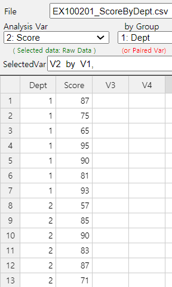
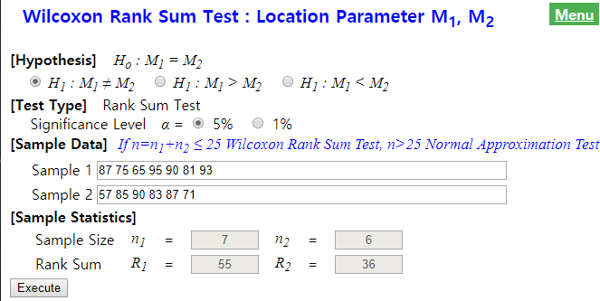
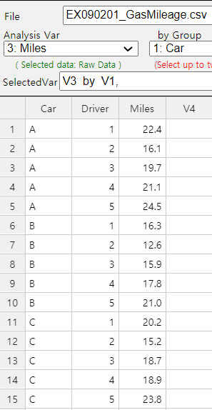
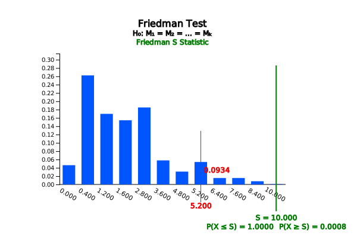

# Chapter 10. Nonparametric Testing Hypothesis

[book](pdf/book10.pdf){target="_blank"}
[eStat YouTube Channel](https://www.youtube.com/channel/UCw2Rzl9A4rXMcT8ue8GH3IA){target="_blank"}

**CHAPTER OBJECTIVES**

The hypothesis tests from Chapters 7 through 9 are based on assumptions
such that the populations of continuous data follow the normal
distributions. However, in real-world data, such assumptions may not be
satisfied.

This chapter introduces the nonparametric methods for testing hypothesis
by converting data such as rankings which do not require assumptions on
the population distribution.

Section 10.1 introduces tests for the location parameter of single
population such as the Sign Test and Signed Rank Test.

Section 10.2 introduces tests for comparing location parameters of two
populations such as the Wilcoxon Rank Sum Test.

Section 10.3 introduces tests for comparing location parameter of
several populations such as the Kruskal-Wallis Test and Friedman Test.

:::

::: 

             

## 10.1 Nonparametric Test for Location of Single Population

::: presentation-video-link
[presentation](pdf/1001.pdf){.presentation-link target="_blank"}   
[video](https://youtu.be/NLHCId7YoqM){.video-link target="_blank"}
:::

::: mainTable
The hypothesis test for a population mean in Chapter 7 can be done using
t distribution in the case of a small sample if the population is
assumed as a normal distribution. As such, if we make some assumptions
about a population distribution and test a population parameter using
sample data, it is called a parametric test. The hypothesis tests for
two population parameters in Chapter 8 and the analysis variance in
Chapter 9 are also parametric tests, because they assume that
populations are normal distributions.

However, real world data may not be appropriate to assume that a
population follows a normal distribution, or there may not be enough
number of samples to assume a normal distribution. In some cases, data
collected are not continuous or can be ordinal such as rank, then the
parametric tests are not appropriate. In such cases, methods to test
population parameters by converting the data into signs or ranks without
assuming on population distributions are called the distribution-free or
nonparametric tests.

Since the nonparametric test utilizes the converted data such as signs
or ranks, there may be some loss of information about the data.
Therefore, if a population can be assumed as a normal distribution,
there is no reason to use the nonparametric tests. In fact, when a
population follows a normal distribution, a nonparametric test has a
higher probability of the type 2 error at the same significance level.
However, a nonparametric test would be more appropriate if the data are
from a population that do not follow a normal distribution.

The hypothesis test for a population mean in Chapter 7 is based on the
theory of the central limit theorem for the sampling distribution of all
possible sample means. However, the nonparametric test use signs by
examining whether data values are small or large from the central
location parameter of the population (the Sign Test of 10.1.1), or use
ranks by calculating the ranking of the data (the Wilcoxon Signed Rank
Test of Section 10.1.2). Here, the central location parameter can be the
population mean or the population median, but usually referring to the
population median that is not affected by an extreme point of the data.

Estimation of a population parameter can also be made by using a
nonparametric method, but this chapter only introduces nonparametric
hypothesis tests. Those interested in the nonparametric estimation
should refer to the relevant literature.
:::

### 10.1.1 Sign Test

::: mainTable
Let\'s take a look at the sign test with the following examples.
:::

::: mainTableGrey
**Example 10.1.1** A bag of cookies is marked with a weight of 200g. Ten
bags are randomly selected from several retailers and examined their
weights as follows. Can you say that there are as many cookies in the
bag as the weight marked?

::: textLeft
203 204 197 195 201 205 198 199 194 207
:::

::: textLeft
\[Ex\] ⇨ eBook ⇨ EX100101_CookieWeight.csv
:::

::: textL20M20
1\) Draw a histogram of the data to check whether a testing hypothesis
using a parametric method can be performed.
:::

::: textL20M20
2\) Test the hypothesis by using a nonparametric method which utilizes
the sign data by examining whether data values are smaller or larger
than 200 with the significance level of 5%.
:::

::: textL20M20
3\) Check the result of the above test using『eStatU』.
:::

**Answer**

::: textL20M20
1\) The null and alternative hypothesis to test the population mean can
be written as follows:
:::

::: textL20
$\quad \small \quad H_0 : \mu = 200 ,\;\; H_1 : \mu \ne 200$:

In order to test the hypothesis using the parametric t-test in Chapter
7, it is necessary to assume that the population is normally
distributed, because the sample size of 10 is small. Let us check
whether the sample data is a normal distribution by using a histogram.
Enter data in『eStat』 as shown in \<Figure 10.1.1\>
:::

<input class="qrBtn" onclick="window.open(addrStr[30])" src="QR/EX100101.svg" type="image"/>

{.imgFig600400}

::: figText
\<Figure 10.1.1\> Data input for cookie weight
:::

::: textL20
Click icon of the testing hypothesis for the population mean and select
'Weight' as the analysis variable in the variable selection box. A dot
graph with the 95% confidence interval will appear as \<Figure 10.1.2\>.
If you click the \[Histogram\] button in the options window below the
graph, a histogram as shown in \<Figure 10.1.3\> will appear. If you
look at the histogram, it is not sufficient to assume that the
population follows a normal distribution. In such cases, applying the
parametric hypothesis test may lead to errors.
:::

{.imgFig600400}

::: figText
\<Figure 10.1.2\> Dot graph of the cookie weight
:::

{.imgFig600400}

::: figText
\<Figure 10.1.3\> Histogram of the cookie weight
:::

::: textL20M20
2\) In this case, the sample data can be converted to sign data only by
examining whether the weight of cookie bag is greater than 200g (+
marked) or not (- marked).
:::

  sample data   sign data
  ------------- -----------
  203           \+
  204           \+
  197           \-
  195           \-
  201           \+
  205           \+
  198           \-
  199           \-
  194           \-
  207           \+

::: textL20
If the number of + signs and -- signs are similar, the weight of cookie
bag would be 200g approximately. If the number of + signs is larger than
-- signs, then the weight of cookie bag is greater than 200g. If the
number of -- signs is larger than + signs, then the weight of cookie bag
is less than 200g.
:::

::: textL20
Since the above sign data only investigate whether a data is larger and
smaller than 200 and never use a concept of the mean, it can be
considered as testing for the population median ($\small M$) as follows:

$\quad \small \quad H_0 : M = 200 ,\;\; H_1 : M \ne 200$:

In the sign data above, 'the number of + signs' (denote it as $n_+$) or
the number of -- signs' (denote as $n_+$) follows a binomial
distribution with parameters of $n$=10, $p$=0.5 (\<Figure 10.1.4\>).
:::

<input class="qrBtn" onclick="window.open(addrStr[82])" src="QR/eStatU420_Binomial.svg" type="image"/>

{.imgFig600400}

::: figText
\<Figure 10.1.4\> Binomial distribution when =10, =0.5
:::

::: textL20
Therefore, if $\small H_0$ is correct, the number of + signs may be the
most likely to be 5 and 0, 1 or 9, 10 are very unlikely to be present.
In order to test $\small H_0 : M$ = 200 with 5% significance level,
since it is a two-sided test, rejection region should have the 2.5%
probability at both ends of the binomial distribution, so it is
approximately as follows:
:::

::: textL30
\'If the number of + signs ($n_+$) is either 0, 1 (cumulated probability
from left is 0.011) or 9, 10 (cumulated probability from right is
0.011), then reject $\small H_0$.\'
:::

::: textL20
This rejection region has a total probability of 2\*0.011 = 0.022 which
is smaller than the significance level of 0.05. When we use a discrete
distribution such as binomial distribution, it may be difficult to find
a rejection region which is exactly the same as the significance level.
If we include one more values in the rejection region, the decision rule
is as follows:
:::

::: textL30
\'If the number of + signs ($n_+$) is either 0, 1, 2 (cumulated
probability from left is 0.055) or 8, 9, 10 (cumulated probability from
right is 0.055), then reject $\small H_0$.\'
:::

::: textL20
This rejection region has a total probability of 2\*0.055 = 0.110 which
is greater than the significance leve of 0.05. Therefore, the middle
values 1.5 (of 1 and 2) and 8.5 (of 8 and 9) can be used in the decision
rule as follows:
:::

::: textL30
\'If the number of + signs $n_+$ \< 1.5 or $n_+$ \> 8.5, then reject
$\small H_0$.\'
:::

::: textL20
This method may also be approximate. In the case of testing using a
discrete distribution, it is not possible to say \'what is right\' among
the above decision rules and the analyst should select the critical
value near the significance level. In this example, the number of +
signs ($n_+$) is 5 and you can not reject the null hypothesis. In other
words, the median of the weight of the cookie bag is 200g.
:::

::: textL20M20
3\) Enter data as shown in \<Figure 10.1.5\> in 『eStatU』and press the
\[Execute\] button to show the test result as in \<Figure 10.1.6\>. It
shows the critical lines for values containing the significance level of
5% (2.5% for both tests). For a discrete distribution such as the
binomial distribution, the choice of the final reject region shall be
determined by the analyst.
:::

<input class="qrBtn" onclick="window.open(addrStr[112])" src="QR/eStatU940_TestSign.svg" type="image"/>

{.imgFig600400}

::: figText
\<Figure 10.1.5\> Data input for sign test in 『eStatU』
:::

{.imgFig600400}

::: figText
\<Figure 10.1.6\> Result of sign test using『eStatU』
:::
:::

::: mainTablePink

<input class="qrBtn" onclick="window.open(addrStr[112])" src="QR/eStatU940_TestSign.svg" type="image"/>

**Practice 10.1.1** A psychologist has selected 9 handicap workers
randomly from production workers employed at various factories in a
large industrial complex and their work competency scores are examined
as follows. The psychologist wants to test whether the population median
score is 40. Assume the population distribution is symmetrical about the
mean.

::: textLeft
32, 52, 21, 39, 23, 55, 36, 27, 37
:::

::: textLeft
\[Ex\] ⇨ eBook ⇨ PR100101_CompetencyScore.csv
:::

::: textL20M20
1\) Check whether a parametric test is possible.
:::

::: textL20M20
2\) Apply the sign test with the significance level of 5%.
:::

:::

::: mainTable
When the population median is $M$, the sign test is to test whether
$M = M_0$ or $M \gt M_0$ (or $M \lt M_0$, or $M \ne M_0$). However, if
the population distribution is symmetrical to the mean, the sign test is
the same as the test of the population mean, because mean and median are
the same in this case.

When there are $n$ number of samples, the test statistic for the sign
test uses the number of data which are greater than $M_0$ ($n_+$). The
sign test uses the random variable of 'the number of + signs ($n_+$)'
which follows a binomial distribution with parameters $n$ and $p$=0,5,
I.e., $B(n,0.5)$ when the null hypothesis is true. You can use the
number of data which are less than $M_0$( $n_- = n - n_+$ ), also follow
a binomial distribution. Let us use $n_+$ in this section.
$B(n,0.5)_{\alpha}$ represents the 100$\times \alpha$ right 100
percentile, but the accurate percentile value may not exist, because it
is a discrete distribution. In this case, middle value of two nearest
percentile is often used. Table 10.1.1 summarizes the decision rule for
each type of hypothesis of the sign test.
:::

::: textLeft
Table 10.1.1 Decision rule of the sign test
:::

  --------------------------------------------------------------------------------------------------------
  \                                   Decision Rule\
  Type of Hypothesis                  Test Statistic $n_{+}$= \'number of plus sign data\'
  ----------------------------------- --------------------------------------------------------------------
  1\) $\; H_0 : M = M_0$\             If $n_{+} > B(n, 0.5)_{α}$, then reject $H_0$
  $\quad\,\, H_1 : M > M_0$           

  2\) $\; H_0 : M = M_0$\             If $n_{+} < B(n, 0.5)_{1-α}$, then reject $H_0$
  $\quad\,\, H_1 : M < M_0$           

  3\) $\; H_0 : M = M_0$\             If
  $\quad\,\, H_1 : M \ne M_0$         $n_{+} < B(n, 0.5)_{1-α/2} \quad or\quad n_{+} > B(n, 0.5)_{α/2}$,
                                      then reject $H_0$
  --------------------------------------------------------------------------------------------------------

::: mainTableYellow
**☞ If the observed value is the same as $M_0$?**

If any of the observations has the same value as $M_0$, they are not
used in the sign test. In other words, reduce $n$.
:::

::: mainTable
As studied in Chapter 5, the binomial distribution $B(n,0.5)$ is
approximated to the normal distribution $N(0.5n,0.5^2 n)$ if $n$ is
sufficiently large. Therefore, if the sample size is large, the test
statistic $n_+$ = \'the number of plus sign data\' can be tested using
the normal distribution $N(0.5n,0.5^2 n)$. Table 10.1.2 summarizes the
decision rule for each hypothesis of the sign test in the case of large
samples.
:::

::: textLeft
Table 10.1.2 Decision rule of the sign test (large sample case)
:::

  -----------------------------------------------------------------------------------------------------------------------------------------
  Type of Hypothesis                  Decision Rule\
                                      Test Statistic $N_{+}$= \'number of plus sign data\'
  ----------------------------------- -----------------------------------------------------------------------------------------------------
  1\) $\; H_0 : M = M_0$\             If $\frac{n_{+} -0.5n}{\sqrt{0.25n}} > z_{α}$, then reject $H_0$
  $\quad\,\, H_1 : M > M_0$           

  2\) $\; H_0 : M = M_0$\             If $\frac{n_{+} -0.5n}{\sqrt{0.25n}} < z_{1-α}$, then reject $H_0$
  $\quad\,\, H_1 : M < M_0$           

  3\) $\; H_0 : M = M_0$\             If
  $\quad\,\, H_1 : M \ne M_0$         $\left | \frac{n_{+} -0.5n}{\sqrt{0.25n}} \right| < z_{α/2} \quad or\quad n_{+} > B(n, 0.5)_{α/2}$,
                                      then reject $H_0$
  -----------------------------------------------------------------------------------------------------------------------------------------

             
:::

::: 

             

### 10.1.2 Wilcoxon Signed Rank Sum Test

::: presentation-video-link
[presentation](pdf/100102.pdf){.presentation-link target="_blank"}   
[video](https://youtu.be/2pMOLvDTth8){.video-link target="_blank"}
:::

::: mainTable
The sign test described in the previous section converted sample data to
either + or - symbols by examining whether the data were larger or
smaller than the medium $M_0$. In this case, most of the information
that the original sample data have is lost. In order to apply the
Wilcoxon signed rank test, we subtract $M_0$ first from the sample data
and take the absolute value of this data. Assign ranks on these absolute
values and calculate the sum of the larger ranks than $M_0$ and the sum
of the smaller ranks than $M_0$. If two rank sums are similar, we
conclude that the population median is equal to $M_0$. This signed rank
sum test is the most widely used nonparametric method for testing the
central location parameter of a population. This test takes into account
the relative size of the sample data as well as the larger and smaller
than $M_0$.
:::

::: mainTableGrey
**Example 10.1.2** Using the cookie weight data of \[Example 10.1.1\],
apply the signed rank test to see whether the weight of the cookie bag
is 200g or not with the significance level of 5%

::: textLeft
203 204 197 195 201 205 198 199 194 207
:::

::: textLeft
\[Ex\] ⇨ eBook ⇨ EX100101_CookieWeight.csv
:::

Check the result of the signed rank test using『eStatU』.

**Answer**

The hypothesis for this problem is to test whether the population
median() is 200g or not.

::: textL20
$\quad \small H_0 : M = 200, \quad \quad H_1 : M \ne 200$
:::

The signed rank sum test examines not only checking the sample data are
greater than $\small M_0$ = 200g (+ sign) or not (- sign), but also
checking the rank of values of \|data -- 200\|. If there are tied
values, assign the average rank to each of tied values. For example,
since there are two tied values of '1' which is the smallest among
\|data -- 200\|, the corresponding ranks of 1 and 2 are averaged which
is 1.5 and assign the averaged rank to each of value '1'.

  -------------------------------------------------------------------------- --------------------------------- ----- ----- ----- ----- ----- ----- ----- ----- -----
  Sample data                                                                203                               204   197   195   201   205   198   199   194   207
  Sign data                                                                  \+                                \+    \-    \-    \+    \+    \-    \-    \-    \+
  \|data -- 200\|                                                            3                                 4     3     5     1     5     2     1     6     7
  Rank of \|data -- 200\|                                                    4.5                               6     4.5   7.5   1.5   7.5   3     1.5   9     10
  Rank sum of ['+']{style="color:red"} sign ([$R_{+}$]{style="color:red"})   4.5 + 6 + 1.5 + 7.5 + 10 = 29.5                                                   
  -------------------------------------------------------------------------- --------------------------------- ----- ----- ----- ----- ----- ----- ----- ----- -----

The sum of all ranks is 1 + 2 + $\cdots$ + 10 = $\frac{10(10+1)}{2}$ =
55. If the rank sum of + sign data ([$\small R_{+}$]{style="color:red"})
and the rank sum of -- sign data ($\small R_-$) are similar
(approximately 27.5 or so), the null hypothesis $\small H_0 : M$ = 200g
would be true. In this example, [$\small R_{+}$]{style="color:red"} =
29.5 and $\small R_-$ = 25.5. Since [$\small R_{+}$]{style="color:red"}
is greater than $\small R_{-}$, the weight data which are greater than
200g appears to be dominant. What kind of large difference is
statistically significant?

To investigate how large a value is statistically significant when the
null hypothesis is true, the distribution of random variable
[$\small R_{+}$]{style="color:red"} = \'rank sum of + sign data\' (or
$\small R_-$ = \'rank sum of -- sign data\') should be known. If
$\small H_0$ is true, the number of cases for
[$\small R_{+}$]{style="color:red"} is shown in Table 10.1.3. It is not
easy to examine all of these possible rankings to create a distribution
table. 『eStatU』shows the distribution of Wilcoxon signed rank sum as
shown in \<Figure 10.1.7\> and its table as in Table 10.1.4.

::: textLeft
Table 10.1.3 All possible cases of [$\small R_{+}$]{style="color:red"} =
\'rank sum of + sign data\'
:::

  ------------------------------------------------------------------------------
  Number of data with +   All possible            All possible rank sum of
  sign                    combination of ranks    [$R_{+}$]{style="color:red"}
  ----------------------- ----------------------- ------------------------------
  0                       0                       0

  1                       {1}, {2}, \... , {10}   1, 2, \... , 10

  2                       {1,2}, {1,3}, \... ,    3, 4, \... , 11,\
                          {1,10},\                5, \... , 12,\
                          {2,3}, \... , {2,10},\  $\cdots$\
                          $\cdots$\               19
                          {9,10}                  

  $\cdots$                $\cdots$                $\cdots$

  10                      {1,2, \... ,10}         55
  ------------------------------------------------------------------------------

<input class="qrBtn" onclick="window.open(addrStr[113])" src="QR/eStatU95D_TestSignedRankD.svg" type="image"/>

{.imgFig600400}

::: figText
\<Figure 10.1.7\> Distribution of Wilcoxon signed rank sum when $n$=10
:::

::: textLeft
Table 10.1.4 Distribution of Wilcoxon signed rank sum when $n$ = 10
:::

  Wilcoxon Signed Rank Sum Distribution   n = 10                      
  --------------------------------------- ------------ -------------- --------------
  $x$                                     $P(X = x)$   $P(X \le x)$   $P(X \ge x)$
  0                                       0.0010       0.0010         1.0000
  1                                       0.0010       0.0020         0.9990
  2                                       0.0010       0.0029         0.9980
  3                                       0.0020       0.0049         0.9971
  4                                       0.0020       0.0068         0.9951
  5                                       0.0029       0.0098         0.9932
  6                                       0.0039       0.0137         0.9902
  7                                       0.0049       0.0186         0.9863
  8                                       0.0059       0.0244         0.9814
  9                                       0.0078       0.0322         0.9756
  $\cdots$                                $\cdots$     $\cdots$       $\cdots$
  47                                      0.0059       0.9814         0.0244
  48                                      0.0049       0.9863         0.0186
  49                                      0.0039       0.9902         0.0137
  50                                      0.0029       0.9932         0.0098
  51                                      0.0020       0.9951         0.0068
  52                                      0.0020       0.9971         0.0049
  53                                      0.0010       0.9980         0.0029
  54                                      0.0010       0.9990         0.0020
  55                                      0.0010       1.0000         0.0010

Since it is a two-sided test with the 5% significance level, if you find
a 2.5% percentile at both ends, $P(X \le 8)$ = 0.0244, $P(X \ge 47)$ =
0.0244. In case of a discrete distribution, we cannot find the exact 2.5
percentile from both ends. Therefore, the decision rule can be written
as follows:

::: textL20
'If $\small R_+ \le$ 8.5 or $\small R_+ \ge$ 46.5, then reject
$\small H_0$'
:::

Since $\small R_+$ = 29.5 in this problem, we can not reject
$\small H_0$.

After entering the data in『eStatU』as in \<Figure 10.1.8\>, pressing
the \[Execute\] button will calculate the sample statistics and show the
test result as in \<Figure 10.1.9\>. The critical lines are the value
for containing 5% significance level from both sides (the probability of
each end is 2.5%). For a discrete distribution, the choice of the final
reject region should be determined by the analyst.

<input class="qrBtn" onclick="window.open(addrStr[114])" src="QR/eStatU950_TestSignedRank.svg" type="image"/>

{.imgFig600400}

::: figText
\<Figure 10.1.8\> 『eStatU』Signed rank sum test
:::

{.imgFig600400}

::: figText
\<Figure 10.1.9\> Signed rank sum test in 『eStatU』
:::

The signed rank sum test can be done using 『eStat』. If you enter the
data as shown in \<Figure 10.1.10\>, select \'Weight\' as the analysis
variable in the variable selection box and click the icon of testing the
population mean. Then a dot graph with the 95% confidence interval for
the population mean will appear as \<Figure 10.1.11\>.

{.imgFig600400}

::: figText
\<Figure 10.1.10\> Data input for cookie weight
:::

{.imgFig600400}

::: figText
\<Figure 10.1.11\> Dot graph and confidence interval of cookie weight
:::

Enter a value of 200 from the options below the graph and click the
\[Wilcoxon Signed Rank Sum Test\] button to display the same test result
graph and result table as in \<Figure 10.1.12\>.

{.imgFig600400}

::: figText
\<Figure 10.1.12\> Result of the Wilicoxon Signed Rank Sum Test
:::
:::

::: mainTable
If we denote the population median as $M$, the signed rank sum test is
to test whether the population median is $M_0$ or greater than (or less
than or not equal to) . However, if the population distribution is
symmetric about the mean, the signed rank sum test becomes to test about
the population mean, because the population median and mean are the
same. The basic statistical model is as follows: $$
        X_i = M_0 + \epsilon_{i}, \quad i=1,2,...,n
      $$ where $\epsilon_i$'s are independent, symmetric about the mean
0 and follow the same distribution.

If $x_1 , x_2 , ... , x_n$ are sample data, ranks of $|x_i - M_0|$ are
calculated first and the sum of ranks for the data which are greater
than $M_0$ (+ sign data of $x_1 , x_2 , ... , x_n$), denoted as $R_+$,
is calculated. $R_+$ is the test statistic for the signed rank sum test
and the sampling distribution of $R_+$, denoted as $w_{+}(n)$, is
calculated for testing hypothesis by considering all possible
cases.『eStatU』provides $w_{+}(n)$ until $n$ = 22. $w_{+}(n)_{α}$
denotes right 100$\times α$ percentile of the $w_{+}(n)$ distribution,
but it is not easy to find the exact percentile, because $w_{+}(n)$ is a
discrete distribution and is usually used to approximate the two
adjacent values. Table 10.1.5 summarizes the decision rule for the
Wilcoxon signed rank sum test for each type of hypothesis.
:::

::: textLeft
Table 10.1.5 Decision rule of Wilcoxon signed rank sum test
:::

  ------------------------------------------------------------------------------------------------------
  \                                   Decision Rule\
  Type of Hypothesis                  Test Statistic $R_{+}$= \'Rank sum of + sign data of
                                      $|x_{i} – M_{0} |$
  ----------------------------------- ------------------------------------------------------------------
  1\) $\; H_0 : M = M_0$\             If $R_{+} > w_{+}(n)_{α}$, then reject $H_0$
  $\quad\,\, H_1 : M > M_0$           

  2\) $\; H_0 : M = M_0$\             If $R_{+} < w_{+}(n)_{1-α}$, then reject $H_0$
  $\quad\,\, H_1 : M < M_0$           

  3\) $\; H_0 : M = M_0$\             If
  $\quad\,\, H_1 : M \ne M_0$         $R_{+} < w_{+}(n)_{1-α/2} \quad or\quad R_{+} > w_{+}(n)_{α/2}$,
                                      then reject $H_0$
  ------------------------------------------------------------------------------------------------------

::: mainTableYellow
**☞ If the observed value is the same as $M_0$?**

If any of the observed values has the same value as , they are not used
in the test. In other words, reduce .
:::

::: mainTablePink

<input class="qrBtn" onclick="window.open(addrStr[114])" src="QR/eStatU950_TestSignedRank.svg" type="image"/>

**Practice 10.1.2** A psychologist has selected 9 handicap workers
randomly from production workers employed at various factories in a
large industrial complex and their work competency scores are examined
as follows. The psychologist wants to test whether the population median
score is 45. Assume the population distribution is symmetrical about the
mean.

::: textLeft
32, 52, 21, 39, 23, 55, 36, 27, 37
:::

::: textLeft
\[Ex\] ⇨ eBook ⇨ PR100101_CompetencyScore.csv
:::

::: textL20M20
1\) Check whether a parametric test is possible.
:::

::: textL20M20
2\) Apply the Wilcoxon signed rank test with the significance level of
5%.
:::

::: textL20M20
) Compare this test result with the sign test of \[Practice 10.1.1\].
:::

:::

::: mainTable
If the sample size is large enough, the test statistic $R_+$ is
approximated to a normal distribution with the following mean $E(R_{+})$
and variance $V(R_{+})$ when the null hypothesis is true. $$
        \begin{align}
          E(R_+ ) &= \frac {n(n+1)}{4} \\
          V(R_+ ) &= \frac {n(n+1)(2n+1)} {24}
        \end{align}
      $$

Table 10.1.6 summarizes the decision rule of the signed rank sum test
for each type of hypothesis.
:::

::: textLeft
Table 10.1.6 Decision rule of Wilcoxon signed rank sum test (large
sample case)
:::

  -----------------------------------------------------------------------------------------------------------
  Type of Hypothesis                  Decision Rule\
                                      Test Statistic $R_{+}$= \'Rank sum of + sign data of $|x_{i} – M_{0} |$
  ----------------------------------- -----------------------------------------------------------------------
  1\) $\; H_0 : M = M_0$\             If $\frac{R_{+} - E(R_{+})}{\sqrt{V(R_{+})}} > z_{α}$, then reject
  $\quad\,\, H_1 : M > M_0$           $H_0$

  2\) $\; H_0 : M = M_0$\             If $\frac{R_{+} - E(R_{+})}{\sqrt{V(R_{+}}} < z_{1-α}$, then reject
  $\quad\,\, H_1 : M < M_0$           $H_0$

  3\) $\; H_0 : M = M_0$\             If
  $\quad\,\, H_1 : M \ne M_0$         $\left | \frac{R_{+} - E(R_{+})}{\sqrt{V(R_{+}}} \right | > z_{α/2}$,
                                      then reject $H_0$
  -----------------------------------------------------------------------------------------------------------

::: mainTable
The distribution of $w_{+}(n)$ is independent of the population
distribution. In other words, the Wilcoxon signed rank sum test is a
distribution free test. For example, if $n$ = 3, the distribution of
$w_{+}(3)$ can be obtained as follows:
:::

  Rank 1   Rank 2   Rank 3   Possible value of $R_{+}$
  -------- -------- -------- ---------------------------
  \-       \-       \-       0
  \+       \-       \-       1
  \-       \+       \-       2
  \-       \-       \+       3
  \+       \+       \-       3
  \+       \-       \+       4
  \-       \+       \+       5
  \+       \+       \+       6

::: mainTable
Therefore, the distribution of $w_{+}(3)$ can be calculated as follows
which is independent of the population distribution.
:::

  $R_{+} = x$   $P(R_{+} = x)$
  ------------- ----------------
  0             $\frac{1}{8}$
  1             $\frac{1}{8}$
  2             $\frac{1}{8}$
  3             $\frac{2}{8}$
  4             $\frac{1}{8}$
  5             $\frac{1}{8}$
  6             $\frac{1}{8}$

::: mainTable
If there is a tie on the value of $|x_i - M_0|$, the average rank is
calculated when the ranking is obtained. In this case, the variance of
$R_+$ in case of large sample is calculated using the following modified
formula. $$
         V(R_+ ) = \frac{1}{24 } [n(n+1)(2n+1) - \frac{1}{2} \sum_{j=1}^{g}  t_{j}(t_{j}-1)({t}_{j}+1) ]
      $$ Here $g$ = (number of groups of tie), $t_j$ = (size of $j^{th}$
tie group, i.e., number of observations in the tie group). if there is
no tie, size of $j^{th}$ tie group is 1 and $t_j$ = 1.
:::

::: mainTablePink
### Multiple Choice Exercise

Choose one answer and click Submit button

::: textL30M30
10.1 What is NOT the reason to have a nonparametric test?
:::

<form name="Q1">
<label><input name="item" type="radio" value="1"/> Population is not normally distributed.</label> 
<label><input name="item" type="radio" value="2"/> Ordinal data. </label> 
<label><input name="item" type="radio" value="3"/> Data follows a normal distribution.</label> 
<label><input name="item" type="radio" value="4"/> There is an extreme point in sample. </label> 

<input onclick="radio(10,1,Q1)" type="button" value="Submit"/>    
      <input id="ansQ1" size="15" type="text"/>

</form>

::: textL30M30
10.2 Which of the following nonparametric tests is for testing the
location parameter of single population?
:::

<form name="Q2">
<label><input name="item" type="radio" value="1"/> Wilcoxon signed rank sum test</label> 
<label><input name="item" type="radio" value="2"/> Wilcoxon rank sum test</label> 
<label><input name="item" type="radio" value="3"/> Kruskal-Wallis test</label> 
<label><input name="item" type="radio" value="4"/> Friedman test</label> 

<input onclick="radio(10,2,Q2)" type="button" value="Submit"/>    
      <input id="ansQ2" size="15" type="text"/>

</form>

::: textL30M30
10.3 What is the sign test?
:::

<form name="Q3">
<label><input name="item" type="radio" value="1"/> Test for the location parameter of single population</label> 
<label><input name="item" type="radio" value="2"/> Test for two location parameters of two populations</label> 
<label><input name="item" type="radio" value="3"/> Test for several location parameters of multiple populations</label> 
<label><input name="item" type="radio" value="4"/> Test for the randomized block design</label> 

<input onclick="radio(10,3,Q3)" type="button" value="Submit"/>    
      <input id="ansQ3" size="15" type="text"/>

</form>

::: textL30M30
10.4 What is the transformation of data that is often used for
nonparametric tests?
:::

<form name="Q4">
<label><input name="item" type="radio" value="1"/> log transformation</label> 
<label><input name="item" type="radio" value="2"/> exponential transformation</label> 
<label><input name="item" type="radio" value="3"/> (0-1) transformation</label> 
<label><input name="item" type="radio" value="4"/> ranking transformation</label> 

<input onclick="radio(10,4,Q4)" type="button" value="Submit"/>    
      <input id="ansQ4" size="15" type="text"/>

</form>

::: textL30M30
10.5 What is the test statistic used for the sign test?
:::

<form name="Q5">
<label><input name="item" type="radio" value="1"/> rank</label> 
<label><input name="item" type="radio" value="2"/> (number of + signs) -  (number of - signs)</label> 
<label><input name="item" type="radio" value="3"/> degrees of freedom</label> 
<label><input name="item" type="radio" value="4"/> (number of + signs)</label> 

<input onclick="radio(10,5,Q5)" type="button" value="Submit"/>    
      <input id="ansQ5" size="15" type="text"/>

</form>

:::

             
:::

::: 

             

## 10.2 Nonparametric Test for Comparing Locations of Two Populations

::: presentation-video-link
[presentation](pdf/1002.pdf){.presentation-link target="_blank"}   
[video](https://youtu.be/_w0ebMxObrg){.video-link target="_blank"}
:::

::: mainTable
The testing hypothesis for the two population means in Chapter 8 used
the t-distribution in case of a small sample, if each population could
be assumed to be a normal distribution. However, the assumption that the
population follows a normal distribution may not be appropriate for real
world data, or that there may not be enough sample data to assume a
normal distribution. Alternatively, if data collected may be ordinal
such as ranking, then the parametric t-test is not appropriate. In such
cases, a nonparametric method is used to test parameters by converting
data to ranks without assuming the distribution of the population. This
section introduces the Wilcoxon rank sum test.

Nonparametric tests convert data into ranks, so there may be some loss
of information about the data. Therefore, if data are normally
distributed, there is no reason to apply a nonparametric test. However,
a nonparametric method would be a more appropriate method if the data do
not follow a normal distribution.

As in Chapter 8, this section introduces nonparametric tests for testing
location parameters of two populations for the samples drawn
independently from each population and for the samples drawn as paired.
:::

### 10.2.1 Independent Samples: Wilcoxon Rank Sum Test

::: mainTable
Let\'s take a look at the Wilcoxon rank sum test with the following
example.
:::

::: mainTableGrey
**Example 10.2.1** A professor of a university teaches the Statistics
courses to students in the Department of Economics and the Department of
Management. In order to compare exam scores of students in the two
departments, seven students were randomly sampled from the Economics
Department and six students from the Management Department and their
scores were as follows:

::: textLeft
Department of Economics 87 75 65 95 90 81 93
:::

::: textLeft
Department of Management 57 85 90 83 87 71
:::

::: textLeft
\[Ex\] ⇨ eBook ⇨ EX100201_ScoreByDepartment.csv
:::

::: textL20M20
1\) Draw a histogram of the data to verify that the testing hypothesis
can be performed using a parametric method.
:::

::: textL20M20
2\) Apply the Wilcoxon rank sum test with the significance level of 5%.
:::

::: textL20M20
3\) Check the result of the Wilcoxon rank sum test using『eStat』.
:::

**Answer**

::: textL20M20
1\) The hypothesis of this problem to test two population means and are
as follows:
:::

::: textL20
$\quad \small \quad H_0 : \mu_1 = \mu_2 , \quad H_1 : \mu_1 \ne \mu_2$

Since the sample sizes, $n_1$ = 7 and $n_2$ = 6, are small from each
population, it is necessary to assume that the populations are normally
distributed in order to apply the parametric $t$-test. In order to check
whether each sample data follows a normal distribution, let us draw a
histogram using 『eStat』. Enter data in 『eStat』 as shown in \<Figure
10.2.1\>.

<input class="qrBtn" onclick="window.open(addrStr[31])" src="QR/EX100201.svg" type="image"/>

{.imgFig600400}

::: figText
\<Figure 10.2.1\> Data input at『eStat』
:::

Click icon for testing two population means in the main menu. Select
'Score' as \'Analysis Var\' and 'Dept' as 'By Group' variable. Then, two
dot graphs together with 95% confidence intervals for each population
mean will appear as in \<Figure 10.2.2\>. Average score of students in
the Economics Department appears to be higher than the average score of
students in the Management Department, but it should be tested for
statistical significance. Pressing the \[Histogram\] button in the
options window below the graph will reveal the histogram and normal
distribution curves for each department, as in\<Figure 10.2.3\>.
:::

{.imgFig600400}

::: figText
\<Figure 10.2.2\> Dot graph and confidence interval by department
:::

{.imgFig600400}

::: figText
\<Figure 10.2.3\> Histogram by department
:::

::: textL20M20
2\) Looking at the histogram, the small number of data is not sufficient
to assume that the population follows a normal distribution. In such
case, applying the parametric t-test may lead to error. In case of a
nonparametric test, we test the location parameter of the population
such as median which is not so sensitive to extreme values. The
hypothesis for this problem is to test whether the median values
$\small M_1$ and $\small M_2$ of the two populations are equal or not as
follows:

$\quad \small \quad \quad H_0 : M_1 = M_2 , \quad H_1 : M_1 \ne M_2$
:::

::: textL20
The Wilcoxon rank sum test calculates ranks of each data by combining
two samples first and then calculate the sum of ranks in each sample. If
there is a tie, then the averaged rank shall be used. To obtain the
ranks of the combined sample, it is convenient to arrange each sample
data in ascending order as shown in Table 10.2.1. The sum of ranks
$\small R_1$ and $\small R_2$ in each sample will be used as the test
statistic for the Wilcoxon rank sum test.
:::

::: textLeft
Table 10.2.1 A table to calculate ranks in a combined sample
:::

  Sorted Data of Sample 1   Sorted Data of Sample 2   Ranks of Sample 1   Ranks of Sample 2
  ------------------------- ------------------------- ------------------- -------------------
                            57                                            1
  65                                                  2                   
                            71                                            3
  75                                                  4                   
  81                                                  5                   
                            83                                            6
                            85                                            7
  87                        87                        8.5                 8.5
  90                        90                        10.5                10.5
  93                                                  12                  
  95                                                  13                  
                            Sum of ranks              $\small R_{1}=55$   $\small R_{2}=36$

::: textL20
The sum of all ranks is 1 + 2 + $\cdots$ + 13 = $\frac{13(13+1)}{2}$ =
91. The sum of ranks in sample 1 is $\small R_{1}$ = 55 and the sum of
ranks in sample 2 is $\small R_{2}$ = 36. Note that $\small R_{1}$ +
$\small R_{2}$ = 91. If $\small R_{1}$ and $\small R_{2}$ are similar,
the null hypothesis that two population medians are the same is
accepted. In this example $\small R_{1}$ is larger than $\small R_{2}$
and it seems the median of the population 1 is larger than the median of
the population 2. But how much difference in the rank sum would be
statistically significant if you consider the sample sizes?
:::

::: textL20
To investigate how large a difference in the rank sum is statistically
significant when the null hypothesis is true, the distribution of the
random variable $\small R_{2}$ = \'Rank sum of sample 2\' (or
$\small R_{1}$ = \'Rank sum of sample 1\') should be known. If
$\small H_0$ is true, the number of cases for $\small R_{2}$ is
${}_{13}P_{6}$ = 1716 as shown in Table 10.2.2. It is not easy to
examine all of these possible rankings to find the distribution table.
『eStatU』provides the Wilcoxon rank sum distribution and its table as
shown in \<Figure 10.2.4\>.
:::

::: textLeft
Table 10.2.2 All possible ranks for six data in sample 2 if n = 13
:::

  All possible permutation of ranks   Sum of ranks, $R_{2}$
  ----------------------------------- -----------------------
  {1,2,3,4,5,6}                       21
  {1,2,3,4,5,7}                       22
  $\quad \cdots$                      $\cdots$
  {8,9,10,11,12,13}                   63

<input class="qrBtn" onclick="window.open(addrStr[115])" src="QR/eStatU96D_TestRankSumD.svg" type="image"/>

{.imgFig600400}

::: figText
\<Figure 10.2.4\> Wilcoxon rank sum distribution when =7, =6
:::

::: textLeft
Table 10.2.3 Wilcoxon rank sum distribution when $n_1 = 7, n_2 = 6$
:::

  Wilcoxon Rank Sum Distribution   n = 10                      
  -------------------------------- ------------ -------------- --------------
  $x$                              $P(X = x)$   $P(X \le x)$   $P(X \ge x)$
  21                               0.0006       0.0006         1
  22                               0.0006       0.0012         0.9994
  23                               0.0012       0.0023         0.9988
  24                               0.0017       0.0041         0.9977
  25                               0.0029       0.007          0.9959
  26                               0.0041       0.0111         0.993
  27                               0.0064       0.0175         0.9889
  28                               0.0082       0.0256         0.9825
  29                               0.0111       0.0367         0.9744
  $\cdots$                         $\cdots$     $\cdots$       $\cdots$
  55                               0.0111       0.9744         0.0367
  56                               0.0082       0.9825         0.0256
  57                               0.0064       0.9889         0.0175
  58                               0.0041       0.993          0.0111
  59                               0.0029       0.9959         0.007
  60                               0.0017       0.9977         0.0041
  61                               0.0012       0.9988         0.0023
  62                               0.0006       0.9994         0.0012
  63                               0.0006       1              0.0006

::: textL20
Since the hypothesis requires a two sided test with the significance
level of 5%, so if you find a 2.5 percentile at both ends,
$\small P(X \le 28) = 0.0256, P(X \ge 56)$ = 0.0256. Since it is a
discrete distribution, there is no exact value of the 2.5 percentile.
Therefore, the decision rule can be set as follows:

$\quad \small$'If $\small R_2 \le$ 27.5 or $\small R_2 \ge$ 56.5, then
reject $\small H_0$'

In this problem $\small R_2$ = 36, and therefore, we can not reject
$\small H_0$ which means the difference between $\small R_1$ and
$\small R_2$ is not statistically significant.
:::

::: textL20M20
3\) In『eStatU』, enter the data as \<Figure 10.2.5\> and click the
\[Execute\] button. It will calculate the sample statistics and show the
test result graph as \<Figure 10.2.6\>. The two critical lines which
correspond to 2.5% from the end are shown here. For a discrete
distribution such as this, the choice of the final rejection region
should be determined by the analyst.
:::

<input class="qrBtn" onclick="window.open(addrStr[116])" src="QR/eStatU960_TestRankSum.svg" type="image"/>

{.imgFig600400}

::: figText
\<Figure 10.2.5\> Data input for the Wilcoxon rank sum test at『eStatU』
:::

{.imgFig600400}

::: figText
\<Figure 10.2.6\> Wilcoxon rank sum test using 『eStatU』
:::

::: textL20
The rank sum test can be performed using『eStat』. After you saw
\<Figure 10.2.2\>, click the \[Wilcoxon Rank Sum Test\] button in the
options window below the graph. Then a test result graph as shown in
\<Figure 10.2.6\> will appear in the Graph Area and a test result table
as in \<Figure 10.2.7\> will appear in the Log Area.
:::

{.imgFig600400}

::: figText
\<Figure 10.2.7\> Result table of Wilcoxon rank sum test
:::
:::

::: mainTable
Let\'s generalize the Wilcoxon rank sum test described in \[Example
10.2.1\]. Denote random samples selected independently from each of the
two populations as follows. The sample sizes are $n_1$ and $n_1$
respectively, and $n = n_1 + n_2$.

::: textLeft
Sample 1 $\quad X_1 , X_2, ... , X_{n_1}$\
Sample 2 $\quad Y_1 , Y_2, ... , Y_{n_2}$
:::

For convenience, assume $n_1 \ge n_2$. If $n_1 < n_2$, you can swap
between $X$ and $Y$ .

The statistical model of the Wilcoxon rank sum test is as follows: $$
        \begin{align}
          X_i &= M_1 + \epsilon_i & i=1,2, ... , n_i\\
          Y_j &= M_1 + \Delta + \epsilon_j & j=1,2, ... , n_j \\
        \end{align}
      $$ $Y_j$ can also be written as $Y_j = M_2 + \epsilon_j$ where
$M_2 = M_1 +\Delta$. Here $\Delta$ is the difference between location
parameters. $\epsilon_i$'s are independent and follow the same
continuous distribution which is symmetric about 0.

The test statistic for the Wilcoxon rank sum test is the sum of ranks,
$R_2$, for $Y_1 , Y_2, ... , Y_{n_2}$ based on the combined sample of
$X_1 , X_2, ... , X_{n_1}$,$Y_1 , Y_2, ... , Y_{n_2}$. The distribution
of the random variable $R_2$ = 'Sum of the ranks for $Y$ sample' can be
obtained by investigating all possible cases of ranks for $Y$ which is
${}_{n}P_{n_2}$ and is denoted as $w_{2}(n_{1},n_{2})$. 『eStatU』
provides the Wilcoxon rank sum distribution $w_{2}(n_{1},n_{2})$ and its
table up to $n$ = 25. $w_{2}(n_{1},n_{2})_{α}$ denotes the right tail
100$\times α$ percentile, but it might not be able to find the accurate
percentile, because $w_{2}(n_{1},n_{2})$ is a discrete distribution. In
this case, middle value of two percentiles near $w_{2}(n_{1},n_{2})_{α}$
is often used as an approximation. Table 10.2.4 summarizes the decision
rule for each type of hypothesis.
:::

::: textLeft
Table 10.2.4 Wilcoxon rank sum test
:::

  ----------------------------------------------------------------------------------------------------------------------
  Type of Hypothesis                  Decision Rule\
                                      Test Statistic $R_{2}$= \'Sum of ranks assigned samples of $Y$\'
  ----------------------------------- ----------------------------------------------------------------------------------
  1\) $\; H_0 : M_1 = M_2$\           If $R_{2} > w_{2}(n_1 , n_2)_{α}$, then reject $H_0$
  $\quad\,\, H_1 : M_1 > M_2$         

  2\) $\; H_0 : M_1 = M_2$\           If $R_{2} < w_{2}(n_1 , n_2)_{1-α}$, then reject $H_0$
  $\quad\,\, H_1 : M_1 < M_2$         

  3\) $\; H_0 : M_1 = M_2$\           If
  $\quad\,\, H_1 : M_1 \ne M_2$       $R_{2} < w_{2}(n_1 , n_2)_{1-α/2} \quad or\quad R_{2} > w_{2}(n_1 , n_2)_{α/2}$,
                                      then reject $H_0$
  ----------------------------------------------------------------------------------------------------------------------

::: mainTableYellow
**☞ If there is a tie in the combined sample, assign the average rank.**
:::

::: mainTablePink

<input class="qrBtn" onclick="window.open(addrStr[116])" src="QR/eStatU960_TestRankSum.svg" type="image"/>

**Practice 10.2.1** A company wants to compare two methods of obtaining
information about a new product. Among company employees, 17 employees
were randomly selected and divided into two groups. The first group
learned about the new product by the method A, and the second group
learned by the method B. At the end of the experiment, the employees
took a test to measure their knowledge of the new product and their test
scores are as follows:

::: textLeft
Method A: 50 59 60 71 80 78 72 77 73
:::

::: textLeft
Method B: 52 54 58 78 65 61 60 72
:::

::: textLeft
\[Ex\] ⇨ eBook ⇨ PR100201_ScoreByMethod.csv
:::

::: textL20M20
1\) Can we apply a parametric test to conclude that population means of
the two groups are different?
:::

::: textL20M20
2\) Apply a nonparmetric test to conclude that the median values of the
two groups are different. Test with the significance level of 0.05.
:::

:::

::: mainTable
When the null hypothesis is true, if the sample is large enough, the
test statistic is approximated to the normal distribution with the
following mean $E(R_2 )$ and variance $V(R_2 )$: $$
        \begin{align}
          E(R_2 ) &= \frac {n_2 (n_1 + n_2 +1 ) } {2} \\
          V(R_2 ) &= \frac {n_1 n_2 (n_1 + n_2 +1)} {12}
        \end{align}
      $$ Table 10.2.5 summarizes the decision rule for each hypothesis
type of the Wilcoxon rank sum test if the sample is large enough.
:::

::: textLeft
Table 10.2.5 Wilcoxon rank sum test (large sample case)
:::

  ---------------------------------------------------------------------------------------------------------------
  Type of Hypothesis                  Decision Rule\
                                      Test Statistic $R_{2}$= \'Sum of ranks assigned samples of $Y$\'
  ----------------------------------- ---------------------------------------------------------------------------
  1\) $\; H_0 : M = M_0$\             If $\frac{ R_{2} - E(R_{2}) } {\sqrt{V(R_{2})}} > z_{α}$, then reject $H_0$
  $\quad\,\, H_1 : M > M_0$           

  2\) $\; H_0 : M = M_0$\             If $\frac{ R_{2} - E(R_{2}) } {\sqrt{V(R_{2})}} < z_{1-α}$, then reject
  $\quad\,\, H_1 : M < M_0$           $H_0$

  3\) $\; H_0 : M = M_0$\             If
  $\quad\,\, H_1 : M \ne M_0$         $\left | \frac{ R_{2} - E(R_{2}) } {\sqrt{V(R_{2})}} \right | > z_{α/2}$,
                                      then reject $H_0$
  ---------------------------------------------------------------------------------------------------------------

::: mainTable
The distribution of rank sum statistic, $w_{2}(n_{1},n_{2})$, is not
dependent on the population distribution. That is, the rank sum test is
a distribution free test. For example, if $n_1$ = 3 and $n_2$ = 2, the
distribution $w_{2}(3, 2)$ can be found as follows. All possible cases
of ranks for $R_2$ is ${}_{5}C_{2}$ = 10.
:::

  -----------------------------------------------------------------------
  All                                                         \
  possible                                                    Value of
  ranks for                                                   $R_2$
  combined                                                    
  sample                                                      
  ----------- ----------- ----------- ----------- ----------- -----------
  $X_1$       $X_2$       $X_3$       $Y_1$       $Y_2$       

  3           4           5           1           2           3

  2           4           5           1           3           4

  2           3           5           1           4           5

  2           3           4           1           5           6

  1           4           5           2           3           5

  1           3           5           2           4           6

  1           3           4           2           5           7

  1           2           5           3           4           7

  1           2           4           3           5           8

  1           2           3           4           5           9
  -----------------------------------------------------------------------

::: mainTable
Therefore, the distribution $w_{2}(3, 2)$ is given regardless of the
population distribution as follows:
:::

  $R_{2} = x$   $P(R_{2} = x)$
  ------------- ----------------
  3             $\frac{1}{10}$
  4             $\frac{1}{10}$
  5             $\frac{2}{10}$
  6             $\frac{2}{10}$
  7             $\frac{2}{10}$
  8             $\frac{1}{10}$
  9             $\frac{1}{10}$

::: mainTable
If there is a tie in the combined sample, the average rank is assigned
to each data. In this case, the variance of $R_2$ should be modified in
case of large sample as follows: $$
         V(R_2 ) = \frac{n_1 n_2} {12} \left[n_1 + n_2 + 1 - \frac{ \sum_{j=1}^{g} {t}_{j} ({t}_{j}-1)({t}_{j}+1) } {(n_1 + n_2 ) (n_1 + n_2 - 1) } \right]
      $$ Here $g$ = (number of tied groups), $g$ = (size of $j^{th}$ tie
group, i.e., number of observations in the tie group). If there is no
tie, size of $j^{th}$ tie group is 1 and $t_j$ = 1.
:::

             
:::

::: 

             

### 10.2.2 Paired Samples: Wilcoxon Signed Rank Sum Test

::: presentation-video-link
[presentation](pdf/100202.pdf){.presentation-link target="_blank"}   
[video](https://youtu.be/tCXKHkEJalU){.video-link target="_blank"}
:::

::: mainTable
Section 8.1.2 discussed the testing hypothesis for two population means
using paired samples. Paired samples are used when it is difficult to
extract samples independently from two populations, or if independently
extracted, the characteristics of each sample object are so different
that the resulting analysis is meaningless. If two populations are
normally distributed, the t-test was applied for the difference data of
the paired samples as described in Section 8.1.2. However, if the
normality assumption of two populations can not be satisfied, the
Wilcoxon signed rank sum test in Section 10.1.2, which is a
nonparametric test, can be applied to the difference data of the paired
samples.

In case of the paired samples, first calculate the differences
($d_i = x_{i1} -x_{i2}$) for each paired sample as shown in Table
10.2.6. For the data of differences, we examine the normality to check
whether the parametric test can be applicable or not. If it is not
applicable, we apply the Wilcoxon signed rank sum test on the
differences.
:::

::: textLeft
Table 10.2.6 Data of differences for paired samples
:::

  -----------------------------------------------------------------------------------
  Pair number       Sample of         Sample of         Difference\
                    population 1\     population 2\     ($d_{i} = x_{i1} - x_{i2}$)
                    ($x_{i1}$)        ($x_{i2}$)        
  ----------------- ----------------- ----------------- -----------------------------
  1                 ($x_{11}$)        ($x_{12}$)        ($d_{1} = x_{11} - x_{12}$)

  2                 ($x_{21}$)        ($x_{22}$)        ($d_{2} = x_{21} - x_{22}$)

  $\cdots$          $\cdots$          $\cdots$          $\cdots$

  n                 ($x_{n1}$)        ($x_{n2}$)        ($d_{n} = x_{n1} - x_{n2}$)
  -----------------------------------------------------------------------------------

::: mainTable
Let\'s take a look at the next example.
:::

::: mainTableGrey
**Example 10.2.2** The following is the survey result of eight samples
from young couples. The husband's age and wife's age of each couple are
recorded.

::: textLeft
\[(28, 28) (30, 29) (34, 31) (29, 32) (28, 29) (31, 33) (39, 35) (34,
29)
:::

::: textLeft
\[Ex\] ⇨ eBook ⇨ EX100202_AgeOfCouple.csv
:::

::: textL20M20
1\) Calculate data of differences in each pair and draw their histogram
to check whether a parametric test is applicable or not.
:::

::: textL20M20
2\) Apply the Wilcoxon signed rank sum test to see whether the husband's
age is greater than the wife's age with the significance level of 0.05.
:::

::: textL20M20
3\) Check the result of the above signed rank sum test using 『eStat』.
:::

**Answer**

::: textL20M20
1\) The data of age differences between husband and wife are as follows:
:::

::: textLeft
Table 10.2.7 Data of age differences between husband and wife
:::

  -----------------------------------------------------------------------------------
  Pair number       Husband Age\      Wife Age\         Difference\
                    ($x_{i1}$)        ($x_{i2}$)        ($d_{i} = x_{i1} - x_{i2}$)
  ----------------- ----------------- ----------------- -----------------------------
  1                 28                28                0

  2                 30                29                1

  3                 34                31                3

  4                 29                32                -3

  5                 28                29                -1

  6                 31                33                -2

  7                 39                35                4

  8                 34                29                5
  -----------------------------------------------------------------------------------

::: textL20
The histogram for the data of differences by using『eStat』 (the testing
hypothesis for a population mean) is as in \<Figure 10.2.8\>. If you
look at the histogram, it is not sufficient evidence that the data of
differences follow a normal distribution, because the number of data is
small. In such a case, applying the parametric hypothesis test may lead
to errors. An appropriate nonparametric method for this problem is the
Wilcoxon signed rank sum test on the data of differences.
:::

<input class="qrBtn" onclick="window.open(addrStr[32])" src="QR/EX100202.svg" type="image"/>

{.imgFig600400}

::: figText
\<Figure 10.2.8\> Histogram of age difference
:::

::: textL20M20
2\) The hypothesis to test is that the population median of the
husband's age ($\small M_1$) is the same as the population median of the
wife's age ($\small M_2$) or not as follows:
:::

::: textL20
$\quad \small \quad H_0 : M_1 = M_2, \quad \quad H_1 : M_1 \ne M_2$

Since it is a paired sample, the hypothesis can be written whether the
population median of differences ($\small M_d = M_1 - M_2$) is equal to
0 or not as follows:

$\quad \small \quad H_0 : M_d = 0, \quad \quad H_1 : M_d \ne 0$
:::

::: textL20
In order to apply the signed rank sum test on the data of differences,
we count the number of differences which is greater than 0 (denote as +
sign) or not (denote as -- sign) and assign ranks on \|difference --
0\|. Then calculate the sum of ranks with + sign and the sum of ranks
with -- sign. If the difference data is 0, omit the data. If there are
ties on the difference data, assign the average rank.
:::

  ------------------------- ---------------------------------- ----- ----- ----- ---- ---- ----
  Difference data           1                                  3     -3    -1    -2   4    5
  Sign data                 \+                                 \+    \-    \-    \-   \+   \+
  \| data -- 0 \|           1                                  3     3     1     2    4    5
  Rank of \| data -- 0 \|   1.5                                4.5   4.5   1.5   3    6    7
  Rank sum of '+' sign ()   $R_{+}$ = 1.5 + 4.5 + 6 + 7 = 19                               
  ------------------------- ---------------------------------- ----- ----- ----- ---- ---- ----

::: textL20
In『eStatU』, the distribution of the Wilcoxon signed rank sum when is
shown in \<Figure 10.2.9\> and Table 10.2.8.
:::

::: textLeft
Table 10.2.8 Wilcoxon signed rank sum distribution when $n = 7$
:::

  Wilcoxon Signed Rank Sum Distribution   $n$ = 7                     
  --------------------------------------- ------------ -------------- --------------
  $x$                                     $P(X = x)$   $P(X \le x)$   $P(X \ge x)$
  0                                       0.0078       0.0078         1.0000
  1                                       0.0078       0.0156         0.9922
  2                                       0.0078       0.0234         0.9844
  3                                       0.0156       0.0391         0.9766
  $\cdots$                                $\cdots$     $\cdots$       $\cdots$
  25                                      0.0156       0.9766         0.0391
  26                                      0.0078       0.9844         0.0234
  27                                      0.0078       0.9922         0.0156
  28                                      0.0078       1.0000         0.0078

::: textL20
Since it is a two-sided test with the significance level of 5%, if a 2.5
percentile is found at both ends,
$\small P(X \le 2) = 0.0234, P(X \ge 26) = 0.0234$. Since it is a
discrete distribution, there is no exact value of the 2.5 percentile.
Therefore, the decision rule is as follows:

::: textL30
$\quad$If $\small R_+ \le 2.5$ or $R_+ \ge 25.5$, reject $\small H_0$
:::

Since $\small R_+$ = 19 in this problem, we can not reject the null
hypothesis $\small H_0$ and conclude that the husband's age and the
wife's age are the same.
:::

::: textL20M20
3\) Enter the data as shown in \<Figure 10.2.9\> in『eStat』and click
the icon which is the test for a population mean. If you select the
variable 'Difference' as the analysis variable, a dot graph with the 95%
confidence interval for the population mean difference will appear.
:::

::: textL20
If you enter 0 for testing value in the hypothesis option and click the
\[Execute\] button, you will see the test result as in\<Figure 10.2.10\>
and \<Figure 10.2.11\>. Two critical lines for values containing 2.5
percentile from both sides are shown here. For a discrete distribution,
the choice of the final decision rule should be determined by the
analyst.
:::

<input class="qrBtn" onclick="window.open(addrStr[32])" src="QR/EX100202.svg" type="image"/>

{.imgFig600400}

::: figText
\<Figure 10.2.9\> Data difference
:::

{.imgFig600400}

::: figText
\<Figure 10.2.10\> 『eStat』Signed rank sum test
:::

{.imgFig600400}

::: figText
\<Figure 10.2.11\> Result of Wilcoxon signed rank sum test
:::
:::

::: mainTable
The Wilcoxon signed rank test for the paired samples is to test whether
the population median of the differences between two populations, $M_d$,
is zero or not. If we denote the paired samples as
$(x_1 , y_1 ), (x_2 , y_2 ) , ... , (x_n , y_n )$, the Wilcoxon signed
rank sum test calculate the difference $d_i = x_i - y_i$ first and
assign ranks on $|d_i|$. The sum of ranks of $|d_i|$ which has + sign of
$d_i$, $R_+$, is used as the test statistic. 『eStatU』 provides the
distribution of $R_+$, denoted as $w_{+}(n)$, up to $n$ = 22.
$w_{+}(n)_{α}$ refers to the right-hand 100 $\times α$ percentile of
this distribution which may not have an accurate percentile value,
because it is a discrete distribution. In this case the average of two
values near $w_{+}(n)_{α}$ is used approximately. Table 10.2.9
summarizes the decision rule of the Wilcoxon signed rank sum test for
paired samples by the type of hypothesis.
:::

::: textLeft
Table 10.2.9 Wilcoxon signed rank sum test for paired samples
:::

  ------------------------------------------------------------------------------------------------------
  Type of Hypothesis                  Decision Rule\
                                      Test Statistic $R_{+}$= \'Sum of ranks on $|d_{i} |$ with + sign
  ----------------------------------- ------------------------------------------------------------------
  1\) $\; H_0 : M_d = 0$\             If $R_{+} > w_{+}(n)_{α}$, then reject $H_0$
  $\quad\,\, H_1 : M_d > 0$           

  2\) $\; H_0 : M_d = 0$\             If $R_{+} < w_{+}(n)_{1-α}$, then reject $H_0$
  $\quad\,\, H_1 : M_d < 0$           

  3\) $\; H_0 : M_d = 0$\             If
  $\quad\,\, H_1 : M_d \ne 0$         $R_{+} < w_{+}(n)_{1-α/2} \quad or\quad R_{+} > w_{+}(n)_{α/2}$,
                                      then reject $H_0$
  ------------------------------------------------------------------------------------------------------

::: mainTableYellow
**☞ If there is 0 on the differences of paired samples?**

If there is 0 on the differences of paired samples, the data is omitted
for further analysis. That is, $n$ is decreased.
:::

::: mainTablePink

<input class="qrBtn" onclick="window.open(addrStr[70])" src="QR/PR100202.svg" type="image"/>

**Practice 10.2.2** An oil company has developed a gasoline additive
that will improve the fuel mileage of gasoline. We used 8 pairs of cars
to compare the fuel mileage to see if it is actually improved. Each pair
of cars has the same details as its structure, model, engine size, and
other relationship characteristics. When driving the test course using
gasoline, one of the pair selected randomly and added additives, the
other of the pair was driving the same course using gasoline without
additives. The following table shows the km per liter for each of pairs.

Pair number

:::
:::

Additive\
($x_{i1}$)

No Additive\
($x_{i2}$)

Difference\
($d_{i} = x_{i1} - x_{i2}$)

1

17.1

16.3

0.8

2

12.7

11.6

1.1

3

11.6

11.2

0.4

4

15.8

14.9

0.9

5

14.0

12.8

1.2

6

17.8

17.1

0.7

7

14.7

13.4

1.3

8

16.3

15.4

0.9

::: textLeft
\[Ex\] ⇨ eBook ⇨ PR100202_DifferenceOfMileage.csv
:::

Apply a nonparametric test to check whether the additive increase fuel
mileage. Use the significance level of 0.05.

::: mainTable
If the sample size of the paired sample is large, use the normal
distribution approximation formula shown in Table 10.1.6.
:::

::: mainTablePink
### Multiple Choice Exercise

Choose one answer and click Submit button

::: textL30M30
10.6 Which of the following nonparametric tests is for testing the
location parameters of two populations?

<form name="Q6">
<label><input name="item" type="radio" value="1"/> Wilcoxon signed rank sum test</label> 
<label><input name="item" type="radio" value="2"/> Wilcoxon rank sum test</label> 
<label><input name="item" type="radio" value="3"/> Kruskal-Wallis test</label> 
<label><input name="item" type="radio" value="4"/> Friedman test</label> 

<input onclick="radio(10,6,Q6)" type="button" value="Submit"/>    
      <input id="ansQ6" size="15" type="text"/>

</form>

::: textL30M30
10.7 What is the test statistic used for testing two location parameters
of two populations using a nonparametric test?
:::

<form name="Q7">
<label><input name="item" type="radio" value="1"/> (number of + signs)</label> 
<label><input name="item" type="radio" value="2"/> sum of ranks in sample 2</label> 
<label><input name="item" type="radio" value="3"/> (number of - signs)</label> 
<label><input name="item" type="radio" value="4"/> (sum of ranks in sample 1) - (sum of ranks in sample 2)</label> 

<input onclick="radio(10,7,Q7)" type="button" value="Submit"/>    
      <input id="ansQ7" size="15" type="text"/>

</form>

:::
:::

             

::: 

             

## 10.3 Nonparametric Test for Comparing Locations of Several Populations

::: presentation-video-link
[presentation](pdf/1003.pdf){.presentation-link target="_blank"}   
[video](https://youtu.be/iXLAS-UTiIk){.video-link target="_blank"}
:::

::: mainTable
The testing hypothesis for several population means in Chapter 9 was
possible if each population could be assumed to be a normal distribution
and has the same population variance. However, the assumption that the
population follows a normal distribution may not be true for real-world
data, or that there may not be enough data to assume a normal
distribution. Alternatively, if data are ordinal such as ranks, then the
parametric test is not appropriate. In this case, a nonparametric test
is used by converting data into ranks without making assumptions about
the population distribution. This section introduces the Kruskal-Wallis
test corresponding to the completely randomized design of experiments
and the Friedman test corresponding to the randomized block design of
experiments in Chapter 9.

Since nonparametric tests are done by using the converted data such as
ranks, there may be some loss of information about the data. Therefore,
if data are normally distributed, there is no reason to apply a
nonparametric test. However, a nonparametric test would be a more
appropriate method if data were selected from a population that did not
follow a normal distribution.
:::

### 10.3.1 Completely Randomized Design: Kruskal-Wallis Test

::: mainTable
The Kruskal--Wallis test extends the Wilcoxon rank sum test for two
populations. Consider the following example.
:::

::: mainTableGrey
**Example 10.3.1** The result of a survey of the job satisfaction by
sampling employees of three companies are as follows. From this data,
can you say that the three companies have different job satisfaction?
(unit: points out of 100 scores)

::: textLeft
Company A 69 67 65 59
:::

::: textLeft
Company B 56 63 55
:::

::: textLeft
Company C 71 72 70
:::

::: textLeft
\[Ex\] ⇨ eBook ⇨ EX100301_JobSatisfaction.csv
:::

::: textL20M20
1\) Draw a histogram of the data to see whether the comparison of the
job satisfaction for the three companies can be made using a parametric
test.
:::

::: textL20M20
2\) Using the Kruskal-Wallis test, which is a nonparametric test, find
whether the three companies have the same job satisfaction or not with
the significance level of 5%
:::

::: textL20M20
3\) Check the above result of the Kruskal-Wallis test using『eStat』.
:::

**Answer**

::: textL20M20
1\) The parametric method for testing the hypothesis that three
population means are the same is the one-way analysis of variance
studied in Chapter 9 and it requires the assumption that the populations
are normal distributions. Since the sample sizes are small, $n_1$ = 4,
$n_2$ = 3, $n_3$ =3, in each of the population respectively we need to
examine if each sample data satisfy the normality assumption.
:::

::: textL20
Enter the data as shown in \<Figure 10.3.1\> in『eStat』.
:::

<input class="qrBtn" onclick="window.open(addrStr[33])" src="QR/EX100301.svg" type="image"/>

{.imgFig600400}

::: figText
\<Figure 10.3.1\> 『eStat』data input
:::

::: textL20
Click the ANOVA icon . Select 'Score' as 'Analysis Var' and 'Company' as
'by Group' variable in the variable selection box. Then a dot graph with
the 95% confidence interval of each population mean will appear as in
\<Figure 10.3.2\>. Company C has the high average of satisfaction
scores, followed by Company A and Company B. However, it should be
tested if these differences are statistically significant. Clicking the
\[Histogram\] button in the options window below the graph will reveal
the histogram and its normal distribution curve for each company, as
in\<Figure 10.3.3\>.
:::

{.imgFig600400}

::: figText
\<Figure 10.3.2\> Dot graph and the confidence interval by company
:::

{.imgFig600400}

::: figText
\<Figure 10.3.3\> Histogram by company
:::

::: textL20
Looking at the histogram, the data are not sufficient to assume that the
population follows a normal distribution, because the number of data is
so small. In such a case, applying the parametric hypothesis test such
as the ANOVA F-test may lead to errors. The hypothesis for this problem
is to test whether the location parameters $\small M_1$, $\small M_2$,
$\small M_3$ of the three populations are the same or not as follows:

$\qquad \small H_0 : M_1 = M_2 = M_3$\
$\qquad \small H_1 :$ At least one pair of location parameters is not
the same.
:::

::: textL20
The Kruskal--Wallis test combines all three samples into a single set of
data and calculate ranks of this data. If there is a tie, then the
average rank will be assigned. Then the sum of the ranks in each sample,
$\small R_1 , R_2 , R_3$, is calculated. The test statistic $\small H$
for the Kruskal--Wallis test is similar to the $\small F$-test by
converting sample data into ranks as follows:

$\qquad \small H = \frac{12}{n(n+1)} \sum_{j=1}^{3} \frac{R_j^2}{n_j} - 3(n+1)$

To obtain ranks of the combined sample, it is convenient to arrange the
data in ascending order separately and then rank the whole data as shown
in Table 10.3.1.
:::

::: textLeft
Table 10.3.1 A table to calculate the sum of ranks in each sample
:::

  Sorted Data of Sample 1   Sorted Data of Sample 2   Sorted Data of Sample 3   Ranks of Sample 1   Ranks of Sample 2   Ranks of Sample 3
  ------------------------- ------------------------- ------------------------- ------------------- ------------------- -------------------
                            55                                                                      1                   
                            56                                                                      2                   
  59                                                                            3                                       
                            63                                                                      4                   
  65                                                                            5                                       
  67                                                                            6                                       
  69                                                                            7                                       
                                                      70                                                                8
                                                      71                                                                9
                                                      72                                                                10
                                                      Sum of ranks              $R_{1}=21$          $R_{2}=7$           $R_{3}=27$

::: textL20
The total sum of ranks is 1 + 2 + $\cdots$ + 10 = $\frac{10(10+1)}{2}$ =
55. The sum of ranks for sample 1 is $\small R_1$ = 21, for sample 2 is
$\small R_2$ = 7, and for sample 3 is $\small R_3$ = 27. When the number
of data in each sample is taken into account, if $\small R_1$,
$\small R_2$, and $\small R_3$ are similar, the null hypothesis that
three population location parameters are the same would be accepted. In
this example, despite of the small sample size for sample 3,
$\small R_3$ is larger thant $\small R_1$ or $\small R_2$. Also
$\small R_1$ is larger than $\small R_2$. Based on these differences,
can you conclude that the three population location parameters are
statistically different?

In the above example, the $\small H$ statistic is as follows:

$\qquad \small H = \frac{12}{10(10+1)} ( \frac{21^2}{4} + \frac{7^2}{3} + \frac{27^2}{3} ) - 3(10+1)$
= 7.318

If the null hypothesis is true, the distribution of the test statistic
should be known to investigate how large a value of $\small H$ is
statistically significant. If $n$ = 10, the number of cases for ranking
{1,2,3, \... , 10} is 10! = 3,628,800. It is not easy to examine all of
these possible rankings to create a distribution table of $\small H$.
『eStatU』 shows the distribution of the Kruskal--Wallis for $n_1$ = 4,
$n_2$ = 3, and $n_3$ = 3 as shown in \<Figure 10.3.4\>, and a part of
the distribution table as in Table 10.3.2. As shown in the figure, the
distribution of $\small H$ is an asymmetrical distribution.
:::

<input class="qrBtn" onclick="window.open(addrStr[117])" src="QR/eStatU98D_TestKruskalD.svg" type="image"/>

{.imgFig600400}

::: figText
\<Figure 10.3.4\> Kruskal Wallis H distribution when
$n_1 = 4, n_2 = 3, n_3 = 3$
:::

::: textLeft
Table 10.3.2 Kruskal Wallis H distribution when
$n_1 = 4, n_2 = 3, n_3 = 3$
:::

Kruskal Wallis H distribution
:::
:::

$k = 3$

$n_1 = 4$

$n_2 = 3$

$n_3 = 3$

$x$

$P(X = x)$

$P(X \le x)$

$P(X \ge x)$

0.018

0.0162

0.0162

1.0000

0.045

0.0133

0.0295

0.9838

$\cdots$

$\cdots$

$\cdots$

$\cdots$

5.727

0.0048

0.9543

0.0505

5.791

0.0095

0.9638

0.0457

5.936

0.0019

0.9657

0.0362

5.982

0.0076

0.9733

0.0343

6.018

0.0019

0.9752

0.0267

6.155

0.0019

0.9771

0.0248

6.300

0.0057

0.9829

0.0229

6.564

0.0033

0.9862

0.0171

6.664

0.0010

0.9871

0.0138

6.709

0.0029

0.9900

0.0129

6.745

0.0038

0.9938

0.0100

7.000

0.0019

0.9957

0.0062

7.318

0.0019

0.9976

0.0043

7.436

0.0010

0.9986

0.0024

8.018

0.0014

1.0000

0.0014

::: textL20
$\small H$ test is a right tail test and the 5 percentile from the right
corresponding to the significance level is approximately
$\small P(X \ge 5.727)$ = 0.0505. Note that there is no exact 5
percentile in case of a discrete distribution. Hence, the decision rule
to test the null hypothesis is as follows:

$\qquad$ 'If $\small H \gt$ 5.727, then reject $\small H_0$ '

Since $\small H$ = 7.318 in this example, we reject $\small H_0$.
:::

::: textL20M20
3\) In 『eStatU』, enter data as \<Figure 10.3.5\> and click the
\[Execute\] button. Then the sample statistics are calculated and the
test result is shown as in \<Figure 10.3.6\>. The critical line for
values containing 5 percentile of the significance level is shown here.
For a discrete distribution, the choice of the final rejection region
shall be determined by the analyst.
:::

<input class="qrBtn" onclick="window.open(addrStr[118])" src="QR/eStatU98D_TestKruskalD.svg" type="image"/>

{.imgFig600400}

::: figText
\<Figure 10.3.5\> 『eStatU』 Kruskal-Wallis test
:::

{.imgFig600400}

::: figText
\<Figure 10.3.6\> Kruskal-Wallis test
:::

::: textL20
『eStat』 can also be used to conduct the Kruskal--Wallis $\small H$
test. Enter data as \<Figure 10.3.1\> and click the ANOVA icon. Select
'Score' as 'Analysis Var' and 'Company' as 'by Group' variable in the
variable selection box. Then a dot graph with the 95% confidence
interval of the population mean in each company will appear as \<Figure
10.3.2\>. If you press the \[Kruskal--Wallis test\] button in the
options window below the graph, the same test graph and test result
table will appear as in \<Figure 10.3.7\>.
:::

{.imgFig600400}

::: figText
\<Figure 10.3.7\> Result of the Kruskal-Wallis test
:::

::: mainTable
Let us generalize the Kruskal--Wallis $H$ test described so far with an
example. Denote random samples collected independently from the $k$
populations (at each level of one factor) when their sample sizes are
$n_1 , n_2 , ... , n_k$ as follows: ($n = n_1 + n_2 + \cdots + n_k$).
:::

::: textLeft
Table 10.3.3 Notation for random samples from each level
:::

  Lebel 1                         Lebel 2                         $\cdots$   Lebel $k$                       
  ------------------------------- ------------------------------- ---------- ------------------------------- ------------------------------------------
  $X_{11}$                        $X_{21}$                        $\cdots$   $X_{k1}$                        
  $X_{12}$                        $X_{22}$                        $\cdots$   $X_{k2}$                        
  $\cdots$                        $\cdots$                        $\cdots$   $\cdots$                        
  $X_{1n_{1}}$                    $X_{2n_{2}}$                    $\cdots$   $X_{kn_{k}}$                    
  Mean ${\overline X}_{1\cdot}$   Mean ${\overline X}_{2\cdot}$   $\cdots$   Mean ${\overline X}_{k\cdot}$   Total Mean ${\overline X}_{\cdot \cdot}$

::: mainTable
The statistical model of the Kruskal-Wallis test is as follows: $$
        X_{ij} = \mu + \tau_i +  \epsilon_{ij}, \quad i=1,2,... k; j=1,2,...,n_i \; \text{where} \sum_{i=1}^{k} \tau_i = 0. 
      $$ Here $\tau_i$ represents the effect of the level $i$ and
$\epsilon_{ij}$'s are independent and follow the same continuous
distribution. The hypothesis of the Kruskal-Wallis test is as follows:
$$
        \begin{align}
          H_0 &: \tau_1 = \tau_2 = \cdots = \tau_k \\
          H_1 &: \text{At least one pair of } \tau_i \text{ is not equal.}
        \end{align}
      $$ For the Kruskal--Wallis test, ranking data for the combined
sample must be created. Table 10.3.4 is a notation of ranking data for
each level.
:::

::: textLeft
Table 10.3.4 Notation of ranking data in each level
:::

                  Lebel 1                         Lebel 2                         $\cdots$   Lebel $k$                       
  --------------- ------------------------------- ------------------------------- ---------- ------------------------------- ----------------------------------------------------------
                  $R_{11}$                        $R_{21}$                        $\cdots$   $R_{k1}$                        
                  $R_{12}$                        $R_{22}$                        $\cdots$   $R_{k2}$                        
                  $\cdots$                        $\cdots$                        $\cdots$   $\cdots$                        
                  $R_{1n_{1}}$                    $R_{2n_{2}}$                    $\cdots$   $R_{kn_{k}}$                    
  Sum of ranks    Sum ${R}_{1\cdot}$              Sum ${R}_{2\cdot}$              $\cdots$   Sum ${R}_{k\cdot}$              
  Mean of ranks   Mean ${\overline R}_{1\cdot}$   Mean ${\overline R}_{2\cdot}$   $\cdots$   Mean ${\overline R}_{k\cdot}$   Total Mean ${\overline R}_{\cdot \cdot} = \frac{n+1}{2}$

::: mainTable
The sum of squares for the one-way analysis of variance studied in
Chapter 9 by using the ranking data in Table 10.3.4 are as follows: $$
        \begin{align}
          SST  & = \sum_{i=1}^k \sum_{j=1}^{n_i} ( R_{ij} - {\overline R}_{\cdot \cdot} )^2 = \sum_{k=1}^n (k -{\overline R}_{\cdot \cdot} )^2 = n(n+1)(n-1) \\
          SSTr & = \sum_{i=1}^k \sum_{j=1}^{n_i} ( {\overline R}_{i \cdot} - {\overline R}_{\cdot \cdot} )^2 \\
          SSE  & = SST - SSTr \\
        \end{align}
      $$ Also, the statistic for the $F$-test is as follows: $$
        F = \frac {MSTr}{MSE} = \frac { \frac{SSTr}{k-1}} {\frac{SSE}{n-k}} = \frac {\frac{SSTr}{k-1}} {\frac{SST-SSTr}{n-k}} = \frac{\frac{n-k}{k-1}} {\frac{SST}{SSTr} -1}
      $$ Since $SST$ is a constant, the statistic for the $F$-test is
proportional to $SSTr$.

The statistic for the Kruskal-Wallis test $H$ is proportional to $SSTr$
as follows: $$
        \begin{align}
          H  & = \frac {12}{n(n+1)} \sum_{i=1}^{k} n_{i} ( {\overline {R}}_{i \cdot} - {\overline {R}}_{\cdot \cdot} )^{2} \\
             & = \frac{12}{n(n+1)} \sum_{i=1}^{k} \frac{{R}_{i \cdot}^2}{n_i} - 3(n+1) \\
        \end{align}
      $$

The multiplication constant $\frac{12}{n(n+1)}$ in the definition of $H$
statistics is intended to ensure that the statistic follows
approximately the chi-square distribution with $k-1$ degrees of freedom.

The distribution of the Kruskal-Wallis test statistic $H$, denoted as
$h(n_1 ,n_2 , ... , n_k )$, can be obtained by considering all possible
cases of ranks {1, 2, ,$n$} which is $n!$. 『eStatU』 provides the table
of $h(n_1 ,n_2 , ... , n_k )$ up to $n$ = 10.
$h(n_1 ,n_2 , ... , n_k )_α$ denotes the right end 100$\times α$
percentile, but it might not have the exact value of this percentile,
because $h(n_1 ,n_2 , ... , n_k )$ is a discrete distribution. In this
case, the middle of two adjacent values of 100$\times α$ percentile is
often used. The decision rule of the Kruskal-Wallis test is as Table
10.3.5.
:::

::: textLeft
Table 10.3.5 Kruskal-Wallis test
:::

  ------------------------------------------------------------------------------------------
  Hypothesis                                            Decision Rule\
                                                        Test Statistic $H$
  ----------------------------------------------------- ------------------------------------
  $\; H_0 : {\tau}_1 = {\tau}_2 = \cdots = {\tau}_k$\   If
  $\; H_1 : \text{At least one pair of } {\tau}_i$ is   $H > h(n_1 , n_2 , ... n_k )_{α}$,
  not equal                                             then reject $H_0$

  ------------------------------------------------------------------------------------------

::: mainTableYellow
**☞ If there are tied values in the combined sample, assign the average
of ranks.**
:::

::: mainTable
The distribution of the Kruskal-Wallis $H$ statistic is independent of a
population distribution. In other words, the Kruskal-Wallis test is a
distribution-free test.

If the null hypothesis is true and the sample size is large enough, the
test statistic $H$ is approximated by the chi-square distribution with
$k-1$ degrees of freedom. Table 10.3.6 summarizes the decision rule for
the Kruskal-Wallis test in case of large samples.
:::

::: textLeft
Table 10.3.6 Kruskal-Wallis test in case of large samples.
:::

  -----------------------------------------------------------------------------------------
  Hypothesis                                            Decision Rule\
                                                        Test Statistic $H$
  ----------------------------------------------------- -----------------------------------
  $\; H_0 : {\tau}_1 = {\tau}_2 = \cdots = {\tau}_k$\   If $H > {\chi}^2_{k-1; α}$, then
  $\; H_1 : \text{At least one pair of } {\tau}_i$ is   reject $H_0$
  not equal                                             

  -----------------------------------------------------------------------------------------

::: mainTable
If there is a tie in the combined sample, the average rank is assigned
to each data. In this case, the statistic $H$ shall be modified as
follows: $$
        H' =  \frac{H} {1 - \sum_{j=1}^{g} \frac{T_j}{n^3 - n} } 
      $$ Here $g$= (number of tied groups),
$T_j = \sum_{j=1}^{g} {t}_{j} ({t}_{j}-1)({t}_{j}+1)$ where $t_j$ = (the
size of the $j^{th}$ tie group, i.e., the number of observations in the
tie group). If there is no tie, the size of the $j^{th}$ tie group is 1
and $t_j$ = 1.
:::

::: mainTablePink

<input class="qrBtn" onclick="window.open(addrStr[118])" src="QR/eStatU98D_TestKruskalD.svg" type="image"/>

**Practice 10.3.1** A bread maker wants to compare the three new mixing
methods of ingredients. 15 breads were made by each mixing method (A, B,
C) of 5 pieces, and a group of judges who did not know the difference in
material mixing ratio gave the following points. Test the null
hypothesis that there is no difference in taste according to the mixing
methods at the significance level of 0.05.

::: textLeft
Mixing ratio:
:::

::: textLeft
Method A: 72 88 70 87 71
:::

::: textLeft
Method B: 85 89 86 82 90
:::

::: textLeft
Method C: 94 94 88 87 89
:::

::: textLeft
\[Ex\] ⇨ eBook ⇨ PR100301_ScoreByMixingMethod.csv
:::

:::

             

::: 

             

### 10.3.2 Randomized block design: Friedman Test

::: presentation-video-link
[presentation](pdf/100302.pdf){.presentation-link target="_blank"}   
[video](https://youtu.be/eNWkdslAKLg){.video-link target="_blank"}
:::

::: mainTable
In Section 9.2, we studied the randomized block design to measure the
fuel mileage of three types of cars which reduce the impact of the block
factor, i.e., driver. If each population follows a normal distribution,
sample data are analyzed using the F-test based on the two-way analysis
of variance without the interaction. However, the assumption that a
population follows a normal distribution may not be appropriate for
real-world data, or that there may not be enough data to assume a normal
distribution. Alternatively, if the data collected might not be
continuous and are ordinal such as ranks, then the parametric test is
not appropriate. In such cases, nonparametric tests are used to test
parameters by converting data to ranks without assuming the distribution
of the population. This section introduces the Friedman test
corresponding to the randomized block design experiments in Section
9.2.2.

Let us take a look at the Friedman test using \[Example 9.2.1\] which
was the car fuel mileage measurement problem.
:::

::: mainTableGrey
**Example 10.3.2** The fuel mileage of the three types of cars (A, B and
C) is measured using the randomized block design as Table 9.2.4 and it
is rearranged in Table 10.3.7.

::: textLeft
Table 10.3.7 Fuel mileage of the three types of cars
:::

  Block      Car A   Car B   Car C
  ---------- ------- ------- -------
  Driver 1   22.4    16.3    20.2
  Driver 2   16.1    12.6    15.2
  Driver 3   19.7    15.9    18.7
  Driver 4   21.1    17.8    18.9
  Driver 5   24.5    21.0    23.8

::: textLeft
\[Ex\] ⇨ eBook ⇨ EX090201_GasMileage.csv
:::

::: textL20M20
1\) Draw a histogram of the data to see if the fuel mileage of the three
cars can be tested by a parametric method.
:::

::: textL20M20
2\) Using the Friedman test which is a nonparametric method of the
randomized block design, test whether the fuel mileage of the three
types of cars are different with the significance level of 5%.
:::

::: textL20M20
3\) Check the result of the above Friedman test using『eStatU』.
:::

**Answer**

::: textL20
1\) Enter data in『eStat』as shown in \<Figure 10.3.8\>.
:::

<input class="qrBtn" onclick="window.open(addrStr[28])" src="QR/EX090201.svg" type="image"/>

{.imgFig600400}

::: figText
\<Figure 10.3.8\> 『eStat』Data input
:::

::: textL20
Click icon of the analysis of variance. Select 'Miles' as \'Analysis
Var\' and 'Car' as 'by Group'. Then the dot graph by car type and the
95% confidence interval for the population mean will appear. Again,
clicking the \[Histogram\] button in the options window below the graph
will show the histogram and normal distribution curve for each car type
as shown in \<Figure 10.3.9\>.
:::

{.imgFig600400}

::: figText
\<Figure 10.3.9\> Histogram of fuel mileage by car
:::

::: textL20
Looking at the histogram, it is not sufficient to assume that each
population follows a normal distribution, because of the small number of
data. In such case, applying the parametric $F$-test may lead to errors.

The hypothesis for this problem is to test whether or not the location
parameters $\small M_1 , M_2 , M_3$ of the three populations are the
same.

$\small \quad H_0 : M_1 = M_2 = M_3$\
$\small \quad H_1 :$ At least one pair of location parameters is not
equal.

The Friedman test calculates the sum of ranks, $\small R_1 , R_2 , R_3$
for each of the three types of cars after the ranking is calculated for
the fuel mileage measured for each driver (block) (Table 10.3.8). If
there is a tie, then the average of ranks is assigned.
:::

::: textLeft
Table 10.3.8 Ranking in each of the block
:::

  Block          Car A               Car B              Car C
  -------------- ------------------- ------------------ -------------------
  Driver 1       3                   1                  2
  Driver 2       3                   1                  2
  Driver 3       3                   1                  2
  Driver 4       3                   1                  2
  Driver 5       3                   1                  2
  Sum of ranks   $\small R_1 = 15$   $\small R_2 = 5$   $\small R_3 = 10$

::: textL20
The sum of ranks for Car A is $\small R_1$ = 15, for Car B is
$\small R_2$ = 5, for Car C is $\small R_3$ = 10. The sum of ranks looks
different. Are the differences statistically significant?

The Friedman test statistic $\small S$ can be considered as the
$\small F$ statistic in the two-way analysis of variance to these
ranking data as follows:

$\small \quad S = \frac{12}{nk(k+1)} \sum_{j=1}^{k} {R_j ^2 } - 3n(k+1)$

where $k$ is the number of population. In this example, $k$ = 3 and the
$\small S$ statistic is as follows:

$\small \quad S = \frac{12}{5 \times 3(3+1)} (15^2 + 5^2 + 10^2 ) - 3 \times 5(3+1) = 10$

The distribution of the test statistic $\small S$, when the null
hypothesis is true, should be known to investigate how large a value of
$\small S$ is statistically significant. Since the number of cases of
ranking when $n$ = 5, $k$ = 3 is $(3!)^5 = 7776$, it is not easy to
examine all of these possible rankings to obtain a distribution.
『eStatU』 provides the distribution of the test statistic $\small S$ in
the case of $n$ = 5, $k$ = 3 as in \<Figure 10.3.10\> and its
distribution table as Table 10.3.9. As shown in the graph, the
distribution of $n$ = 5, $k$ = 3 is an asymmetrical distribution.
:::

<input class="qrBtn" onclick="window.open(addrStr[119])" src="QR/eStatU99D_TestFriedmanD.svg" type="image"/>

{.imgFig600400}

::: figText
\<Figure 10.3.10\> Friedman S distribution when ,
:::

::: textLeft
Table 10.3.9 Friedman S distribution when $k = 3, n = 5$
:::

  Friedman S distribution   $k = 3$      $n = 5$        
  ------------------------- ------------ -------------- --------------
  $x$                       $P(X = x)$   $P(X \le x)$   $P(X \ge x)$
  0.000                     0.0463       0.0463         1.0000
  0.400                     0.2623       0.3086         0.9537
  1.200                     0.1698       0.4784         0.6914
  1.600                     0.1543       0.6327         0.5216
  2.800                     0.1852       0.8179         0.3673
  3.600                     0.0579       0.8758         0.1821
  4.800                     0.0309       0.9066         0.1242
  5.200                     0.0540       0.9606         0.0934
  6.400                     0.0154       0.9761         0.0394
  7.600                     0.0154       0.9915         0.0239
  8.400                     0.0077       0.9992         0.0085
  10.000                    0.0008       1.0000         0.0008

::: textL20
The Friedman test is a right sided test. If we look for the five
percentile from the right corresponding to significance level, the
nearest value is $\small P(X \ge 6.4)$ = 0.0394. Since it is a discrete
distribution, there is no exact value of five percentile. Hence, the
rejection region with the significance level of 5% can be written as
follows:

::: textL30
'If $\small S \ge 6.4$, then reject $\small H_0$'
:::

Since $\small S$ = 10 in this example, $\small H_0$ is rejected.
:::

::: textL20M20
3\) Enter data in『eStatU』as in \<Figure 10.3.11\> and click the
\[Execute\] button. The sample statistics and test graph will be shown
as in \<Figure 10.3.12\>. The critical line which contains 5% of the
significance level is shown here. For a discrete distribution, the
choice of the final rejection region should be determined by the
analyst.
:::

<input class="qrBtn" onclick="window.open(addrStr[121])" src="QR/eStatU990_TestFriedman.svg" type="image"/>

{.imgFig600400}

::: figText
\<Figure 10.3.11\> Data input for Friedman test at『eStatU』
:::

{.imgFig600400}

::: figText
\<Figure 10.3.12\> Result of Friedman test using『eStatU』
:::
:::

::: mainTable
Let\'s generalize the Friedman test described so far using the above
example. Assume that there are $k$ number of levels and denote the rank
of $n$ number of data as follows:
:::

::: textLeft
Table 10.3.10 Notation of n random samples for k number of levels with
randomized block design
:::

             Lebel 1                         Lebel 2                         $\cdots$   Lebel $k$                       
  ---------- ------------------------------- ------------------------------- ---------- ------------------------------- ------------------------------------------
  Block 1    $X_{11}$                        $X_{21}$                        $\cdots$   $X_{k1}$                        
  Block 2    $X_{12}$                        $X_{22}$                        $\cdots$   $X_{k2}$                        
  $\cdots$   $\cdots$                        $\cdots$                        $\cdots$   $\cdots$                        
  Block k    $X_{1n}$                        $X_{2n}$                        $\cdots$   $X_{kn}$                        
  Mean       Mean ${\overline X}_{1\cdot}$   Mean ${\overline X}_{2\cdot}$   $\cdots$   Mean ${\overline X}_{k\cdot}$   Total Mean ${\overline X}_{\cdot \cdot}$

::: mainTable
A statistical model of the Friedman test is as follows: $$
        X_{ij} =  \mu + \tau_{i} +  \beta_{j} + \epsilon_{ij}, \quad i=1,2,...,k; \;\; j=1,2,...,n 
      $$ Here $\tau_i$ is the effect of level $i$ which satisfies
$\sum_{i=1}^{k} \tau_{i} = 0$ and $\beta_{j}$ is the effect of block $j$
which satisfies $\sum_{j=1}^{n} \beta_{j} = 0$. $\epsilon_{ij}$ 's are
independent and follows the same continuous distribution.

The hypothesis of the Friedman test is as follows: $$
        \begin{align}
          H_0 &: \tau_1 = \tau_2 = \cdots = \tau_k \\
          H_1 &: \text{At least one pair of } \tau_i \text{ is not equal.}
        \end{align}
      $$ For the Friedman test, ranking data for each block must be
created. Table 10.3.11 is the notation of ranking data for each level.
:::

::: textLeft
Table 10.3.11 Notation of rank data in each level
:::

                 Lebel 1                    Lebel 2                    $\cdots$   Lebel $k$                  
  -------------- -------------------------- -------------------------- ---------- -------------------------- ----------------------------------------------------------------
  Block 1        $R_{11}$                   $R_{21}$                   $\cdots$   $R_{k1}$                   
  Block 2        $R_{12}$                   $R_{22}$                   $\cdots$   $R_{k2}$                   
  $\cdots$       $\cdots$                   $\cdots$                   $\cdots$   $\cdots$                   
  Block k        $R_{1n}$                   $R_{2n}$                   $\cdots$   $R_{kn}$                   
  Sum of ranks   ${R}_{1\cdot}$             ${R}_{2\cdot}$             $\cdots$   ${R}_{k\cdot}$             
  Mean           ${\overline R}_{1\cdot}$   ${\overline R}_{2\cdot}$   $\cdots$   ${\overline R}_{k\cdot}$   Average of Ranks ${\overline R}_{\cdot \cdot} = \frac{k+1}{2}$

::: mainTable
If we apply the analysis of variance for the rank data of Table 10.3.11
instead of the observation data in Section 9.2, the total sum of
squares, $SST$, and the block sum of squares $SSB$ are constants. The
treatment sum of squares $SSTr$ is as follows: $$
        \begin{align}
          SSTr &= \sum_{i=1}^{k} n( {\overline R}_{i \cdot} - {\overline R}_{\cdot \cdot} )^2 \\
          SST  &= SSTr + SSE
        \end{align}
      $$ Therefore, the $F$-test statistic can be written as follows: $$
        F = \frac{MSTr}{MSE} = c \frac{ {SSTr }  } { {SST - SSTr - SSE }  }
      $$ Here $c$ is a constant. That is, since $SST$ is a constant,
$F$-test statistic is proportional to $SSTr$.

The Friedman test statistic $S$ is proportional to $SSTr$ as follows: $$
        \begin{align}
          S &= \frac{12}{k(k+1)}  SSTr = \frac{12 n}{k(k+1)} \sum_{i=1}^{k}  ({\overline R}_{i \cdot} - {\overline R}_{\cdot \cdot} )^2  \\
            &= \frac{12}{nk(k+1)} \sum_{i=1}^{k} {R}_{i \cdot} ^2 - 3n(k+1)
        \end{align}
      $$

The reason $S$ statistic has the constant multiplication of
$\frac{12}{k(k+1)}$ is to make $S$ which follows a chi-square
distribution with $k-1$ degrees of freedom.

The distribution of the Friedman test statistic $S$ is denoted as
$S(k,n)$.『eStatU』 provides the distribution of $S(k,n)$ up to
$n \le 8$ if $k = 3$ and up to $n \le 6$ if $k = 4$. $S(k,n)_{α}$
denotes the right tail 100$\times α$ percentile, but there might not be
the exact percentile, because it is a discrete distribution. In this
case, the middle value of two nearest $S(k,n)_{α}$ is often used
approximately. Table 10.3.12 is the summary of decision rule of the
Friedman test.
:::

::: textLeft
Table 10.3.12 Friedman Test
:::

  -----------------------------------------------------------------------------------------
  Hypothesis                                            Decision Rule\
                                                        Test Statistic $S$
  ----------------------------------------------------- -----------------------------------
  $\; H_0 : {\tau}_1 = {\tau}_2 = \cdots = {\tau}_k$\   If $S > s(k, n)_{α}$, then reject
  $\; H_1 : \text{At least one pair of } {\tau}_i$ is   $H_0$
  not equal                                             

  -----------------------------------------------------------------------------------------

::: mainTableYellow
**☞ If there are tied values on each block, use the average rank.**
:::

::: mainTable
The distribution of the Friedman statistic $S$ is independent of the
population distribution. In other words, the Friedman test is a
distribution-free test.

If the null hypothesis is true and if the sample is large enough, the
test statistic $S$ is approximated by the chi-square distribution with
$k-1$ degrees of freedom. Table 10.3.13 summarizes the decision rule for
the Friedman test in case of large sample.
:::

::: textLeft
Table 10.3.13 Friedman Test -- large sample case
:::

  -----------------------------------------------------------------------------------------
  Hypothesis                                            Decision Rule\
                                                        Test Statistic $S$
  ----------------------------------------------------- -----------------------------------
  $\; H_0 : {\tau}_1 = {\tau}_2 = \cdots = {\tau}_k$\   If $S > {\chi}^2_{k-1; α}$, then
  $\; H_1 : \text{At least one pair of } {\tau}_i$ is   reject $H_0$
  not equal                                             

  -----------------------------------------------------------------------------------------

::: mainTable
If there is a tie in the block, the average rank is assigned to each
data. In this case, the statistic $S$ shall be modified as follows: $$
        S' = \frac{S}{1 - \sum_{j=1}^{g} \frac{T_j}{np(p^2 -1)} } 
      $$ Here $g$ = (number of tied groups),
$T_{j} = \sum_{j=1}^{g} {t}_{j} ({t}_{j}-1)({t}_{j}+1)$ where $t_j$ =
(the size of the $j^{th}$ tie group, i.e., the number of observations in
the tie group) If there is no tie, the size of the $j^{th}$ tie group is
1 and $t_j$ = 1.
:::

::: mainTablePink

<input class="qrBtn" onclick="window.open(addrStr[121])" src="QR/eStatU990_TestFriedman.svg" type="image"/>

**Practice 10.3.2** The following is the result of an agronomist\'s
survey of the yield of four varieties of wheat by using the randomized
block design of the three cultivated areas (block). Apply the Friedman
test whether the mean yields of the four wheats are the same or not with
the 5% significance level.

::: textLeft
Table 10.3.8 Ranking in each of the block
:::

                 Area 1   Area 2   Area 3
  -------------- -------- -------- --------
  Wheat Type A   50       60       56
  Wheat Type B   59       52       51
  Wheat Type C   55       55       52
  Wheat Type D   58       58       55

::: textLeft
\[Ex\] ⇨ eBook ⇨ PR100302_WheatAreaYield.csv
:::

:::

::: mainTablePink
### Multiple Choice Exercise

Choose one answer and click Submit button

::: textL30M30
10.8 Which of the following nonparametric tests is for tesing the
location parameters of multiple populations?
:::

<form name="Q8">
<label><input name="item" type="radio" value="1"/> Wilcoxon signed rank sum test</label> 
<label><input name="item" type="radio" value="2"/> Wilcoxon rank sum test</label> 
<label><input name="item" type="radio" value="3"/> Kruskal-Wallis test</label> 
<label><input name="item" type="radio" value="4"/> Friedman test</label> 

<input onclick="radio(10,8,Q8)" type="button" value="Submit"/>    
      <input id="ansQ8" size="15" type="text"/>

</form>

::: textL30M30
10.9 Which of the following nonparametric tests is appropriate for
testing of the randomized block design method?
:::

<form name="Q9">
<label><input name="item" type="radio" value="1"/> Wilcoxon signed rank sum test</label> 
<label><input name="item" type="radio" value="2"/> Wilcoxon rank sum test</label> 
<label><input name="item" type="radio" value="3"/> Kruskal-Wallis test</label> 
<label><input name="item" type="radio" value="4"/> Friedman test</label> 

<input onclick="radio(10,9,Q9)" type="button" value="Submit"/>    
      <input id="ansQ9" size="15" type="text"/>

</form>

::: textL30M30
10.10 What is the theoretical basis for the statistic used for the
Kruskal-Wallis test?
:::

<form name="Q10">
<label><input name="item" type="radio" value="1"/> Within sum of squares of rank data</label> 
<label><input name="item" type="radio" value="2"/> Error sum of squares of rank data    </label> 
<label><input name="item" type="radio" value="3"/> Total sum of squares of rank data</label> 
<label><input name="item" type="radio" value="4"/> Treatment sum of squares of rank data</label> 

<input onclick="radio(10,10,Q10)" type="button" value="Submit"/>    
      <input id="ansQ10" size="15" type="text"/>

</form>

:::

             
:::

::: 

## 10.4 Exercise

::: mainTablePink
::: textL30M30
10.1 A psychologist has selected 12 handicap workers randomly from
production workers employed at various factories in a large industrial
complex and their work competency scores are examined as follows: The
psychologist wants to test whether the population average score is 45.
Assume the population distribution is symmetrical about the mean.
:::

32, 52, 21, 39, 23, 55, 36, 27, 37, 41, 34, 51

::: textL50M30
1\) Check whether a parametric test is possible.
:::

::: textL50M30
2\) Apply the sign test with the significance level of 5%.
:::

::: textL50M30
3\) Apply the Wilcoxon signed rank test with the significance level of
5%.
:::

::: textL30M30
10.2 A tire production company wants to test whether a new manufacturing
process can produce a more durable tire than the existing process. The
tire by a new process was tested to obtain the following data: (unit:
1000)
:::

  -----------------------------------------------------------------------
  Existing Process                    New Process
  ----------------------------------- -----------------------------------
  62\                                 73\
  76\                                 53\
  61\                                 61\
  90\                                 65\
  74\                                 60\
  74\                                 53\
  75\                                 70\
  63                                  63

  -----------------------------------------------------------------------

::: textL50M30
1\) Check whether a parametric test is possible.
:::

::: textL50M30
2\) Apply the Wilcoxon rank sum test whether the new process and the
existing process have the same durability or not with the significance
level of 5%.
:::

::: textL30M30
10.3 A company wants to compare two methods of obtaining information
about a new product. Among company employees, 19 were randomly selected
and divided into two groups. The first group learned about the new
product by the method A, and the second group learned by the method B.
At the end of the experiment, the employees took a test to measure their
knowledge of the new product and their test scores are as follows: Can
we conclude from these data that the median values of the two groups are
different? Test with the significance level of 0.05.
:::

  -----------------------------------------------------------------------
  Method A                            Method B
  ----------------------------------- -----------------------------------
  50\                                 52\
  59\                                 54\
  60\                                 58\
  71\                                 78\
  80\                                 65\
  78\                                 61\
  72\                                 60\
  77\                                 72\
  73\                                 60
  75                                  

  -----------------------------------------------------------------------

::: textL30M30
10.4 10 men and 10 women working in the same profession were selected
independently and surveyed their monthly salaries. Can you say that a
man in this profession earns more than a woman. Test with the
significance level of 0.05. (Unit: 10USD)
:::

  -----------------------------------------------------------------------
  Man                                 Woman
  ----------------------------------- -----------------------------------
  381\                                284\
  294\                                279\
  296\                                288\
  389\                                383\
  281\                                489\
  194\                                287\
  193\                                496\
  286\                                393\
  384\                                277\
  494                                 371

  -----------------------------------------------------------------------

::: textL30M30
10.5 To find out the fuel mileage improvement effect of a new gasoline
additive, 10 cars of the same state were selected. The gas mileage was
tested without gasoline additives and with additives running the same
road at the same speed and obtain the following data. Test whether the
new gasoline additive is effective in improving the fuel mileage with
the significance level of 0.05. (gas mileage unit: km/liter)
:::

  -----------------------------------------------------------------------
  With additives                      Without additives
  ----------------------------------- -----------------------------------
  11.7\                               10.3\
  13.8\                               12.9\
  11.2\                               12.5\
  7.7\                                9.5\
  8.2\                                11.2\
  16.3\                               14.6\
  14.2\                               15.9\
  19.4\                               18.5\
  13.9\                               12.0\
  15.5                                15.1

  -----------------------------------------------------------------------

::: textL30M30
10.6 In order to determine the efficacy of the new pain reliever, seven
persons were tested with the aspirin and new pain reliever. The
experimental time of the two pain relievers were sufficiently spaced,
and the order of the medication experiment was randomly determined. The
time (in minutes) until feeling pain relief was measured as follows: Do
the data indicate that the new pain reliever has faster pain relief than
aspirin? Test with the significance level of 0.05.
:::

  -----------------------------------------------------------------------
  id                      Aspirin                 New pain reliever
  ----------------------- ----------------------- -----------------------
  1\                      15\                     7\
  2\                      20\                     14\
  3\                      12\                     13\
  4\                      20\                     11\
  5\                      17\                     10\
  6\                      14\                     16\
  7                       17                      11

  -----------------------------------------------------------------------

::: textL30M30
10.7 A person was asked to taste 15 coffee samples to rank from 1 (hate
first) to 15 (best). The 15 samples are taken from each of the three
types of coffee (A, B, C) and are tasted in random order. The following
table shows the ranking of preference by the coffee type. Test the null
hypothesis that there is no difference in three types of coffee
preferences at the significance level of 0.05.
:::

  -----------------------------------------------------------------------
  Coffee A                Coffee B                Coffee C
  ----------------------- ----------------------- -----------------------
  9\                      14\                     2\
  10\                     1\                      3\
  11\                     5\                      4\
  12\                     7\                      15\
  13                      8                       6

  -----------------------------------------------------------------------

::: textL30M30
10.8 A bread maker wants to compare the four new mix of ingredients. 5
breads were made by each mixing ratio of ingredients, a total of 20
breads, and a group of judges who did not know the difference in mixing
ratio of ingredients were given the following points. Test the null
hypothesis that there is no difference in taste according to the mixing
ratio of ingredients at the significance level of 0.05.
:::

  -----------------------------------------------------------------------
  Method A          Method B          Method C          Method D
  ----------------- ----------------- ----------------- -----------------
  72\               85\               94\               91\
  88\               89\               94\               93\
  70\               86\               88\               92\
  87\               82\               87\               95\
  71                90                89                96

  -----------------------------------------------------------------------
:::

:::
