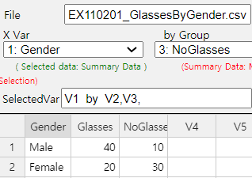

::: container-fluid
:::

::: {.col-sm-9 .col-sm-offset-3 .col-md-10 .col-md-offset-2 .main}
# Chapter 11. Testing Hypothesis for Categorical Data

       ❮   **Chapter 10**       

-   [11.1 Goodness of Fit Test](../chapter11/1101.html)
-   [  11.1.1 Goodness of Fit Test for Categorical
    Distribution](../chapter11/1101.html)
-   [  11.1.2 Goodness of Fit Test for Continuous
    Distribution](../chapter11/110102.html)
-   [11.2 Testing Hypothesis for Contingency
    Table](../chapter11/1102.html)
-   [  11.2.1 Independence Test](../chapter11/1102.html)
-   [  11.2.2 Homogeneity Test](../chapter11/110202.html)
-   [11.3 Exercise](../chapter11/1103.html)

##### [[\[book\]]{.underline}](book11.pdf){target="_blank"}    [[\[eStat YouTube Channel\]]{.underline}](https://www.youtube.com/channel/UCw2Rzl9A4rXMcT8ue8GH3IA){target="_blank"}

## CHAPTER OBJECTIVES

The hypothesis tests that we have studied from Chapter 7 to Chapter 10
are for continuous data. In this chapter, we describe testing hypothesis
for categorical data.

Section 11.1 describes the goodness of fit test for the frequency table
of categorical data.

Section 11.2 describes the independence and homogeneity tests for the
contingence table of two categorical data.

       ❮   **Chapter 10**       
:::
::: container-fluid
:::

::: {.col-sm-9 .col-sm-offset-3 .col-md-10 .col-md-offset-2 .main}
# Chapter 11. Testing Hypothesis for Categorical Data

             

## 11.1 Goodness of Fit Test

::: presentation-video-link
[presentation](1101.pdf){.presentation-link target="_blank"}   
[video](https://youtu.be/yMDHeJOkeU0){.video-link target="_blank"}
:::

::: mainTable
The frequency table of categorical data discussed in Chapter 4 counts
the frequency of possible values of a categorical variable. If this
frequency table is for sample data from a population, we are curious
what would be the frequency distribution of the population. The goodness
of fit test is a test on the hypothesis that the population follows a
particular distribution based on the sample frequency distribution. In
this section, we discuss the goodness of fit test for categorical
distributions (Section 11.1.1) and the goodness of fit test for
continuous distribution (Section 11.1.2).
:::

### 11.1.1 Goodness of Fit Test for Categorical Distribution

::: mainTable
Consider the goodness of fit test for a categorical distribution using
the example below.
:::

::: mainTableGrey
**Example 11.1.1** The result of a survey of 150 people before a local
election to find out the approval ratings of three candidates is as
follows. Looking at this frequency table alone, it seems that A
candidate has a 40 percent approval rating, higher than the other
candidates. Based on this sample survey, perform the goodness of fit
test whether three candidates have the same approval rating or not.
Use『eStatU』with the 5% significance level.

::: textLeft
Table 11.1.1 Frequency table of survey result in an election.
:::

  Candidate   Number of Supporters   Percent
  ----------- ---------------------- ---------
  A           60                     40.0％
  B           50                     33.3％
  C           40                     25.7％
  Total       150                    100%

**Answer**

Assume each of candidate A, B, and C's approval rating is
$p_1 , p_2 , p_3$ respectively. The hypothesis for this problem is as
follows:

::: textLeft
$\small H_0$ : The three candidates have the same approval rating.
(i.e.,$p_1 = p_2 = p_3 = \frac{1}{3}$ )
:::

::: textLeft
$\small H_1$ : The three candidates have different approval ratings.
:::

If the null hypothesis $\small H_0$ is true that the three candidates
have the same approval rating, each candidate will have 50 (=
150$\times \frac{1}{3}$ ) supporters out of total 150 people. It is
referred to as the 'expected frequency' of each candidate when
$\small H_0$ is true. For each candidate, the number of observed
supporters in the sample is called the \'observed frequency\'. If
$\small H_0$ is true, the observed and expected number of supporters can
be summarized as the following table.

  -----------------------------------------------------------------------
  Candidate               Observed frequency\     Expected frequency\
                          (denoted as $O_i$)      (denoted as $E_i$)
  ----------------------- ----------------------- -----------------------
  A                       $O_1 = 60$              $E_1 = 50$

  B                       $O_2 = 50$              $E_2 = 50$

  C                       $O_3 = 40$              $E_3 = 50$

  Total                   150                     150
  -----------------------------------------------------------------------

If $\small H_0$ is true, the observed frequency ($\small O_i$) and the
expected frequency ($\small E_i$) will coincide. Therefore, in order to
test the hypothesis, a statistic which uses the difference between
$\small O_i$ and $\small E_i$ is used. Specifically, the statistic to
test the hypotheses is as follows:

::: textLeft
${\chi}_{obs}^2 = \frac {(O_1 - E_1 )^2} {E_1} + \frac {(O_2 - E_2 ) ^2} {E_2} + \frac {(O_3 - E_3 )^2} {E_3}$
:::

If the observed value of this test statistic is close to zero, it can be
considered that $\small H_0$ is true, because $\small O_i$ is close to
$\small E_i$. If the observed value is large, $\small H_0$ will be
rejected. The question is, \'How large value of the test statistic would
be considered as the statistically significant one?\' It can be shown
that this test statistic approximately follows the chi-square
distribution with $k-1$ degrees of freedom if the expected frequency is
large enough. Here $k$ is the number of categories (i.e., candidates) in
the table and it is 3 in this example. Therefore, the decision rule to
test the hypotheses is as follows:

::: textLeft
'If $\chi_{obs}^2 > \chi_{k-1; α}^2$ , reject $\small H_0$, else do not
reject $\small H_0$'
:::

The statistic $\chi_{obs}^2$ can be calculated as follows:

::: textLeft
${\chi}_{obs}^2 = \frac {(60 - 50)^2} {50} + \frac {(50 - 50 ) ^2} {50} + \frac {(40 - 50)^2} {50}$
:::

Since the significance level α is 5％, the critical value can be found
from the chi-square distribution as follows:

::: textLeft
$\chi_{k-1 ; α}^{2} = \chi_{3-1 ; 0.05}^{2} = \chi_{2 ; 0.05}^{2} = 5.991$
:::

Therefore, $\small H_0$ can not be rejected. In other words, although
the above sample frequency table shows that the approval ratings of the
three candidates differ, this difference does not provide sufficient
evidence to conclude that the three candidates have different approval
ratings.

Using each candidate\'s sample approval rating
$\hat p_1 = \frac{60}{150}$ = 0.40, $\hat p_2 = \frac{50}{150}$ = 0.33,
$\hat p_1 = \frac{40}{150}$ = 0.27, 95% confidence intervals for the
population proportion of each candidate\'s approval rating using the
formula (${{\hat p}} ± 1.96 \sqrt { \hat p (1- \hat p ) / n }$) (refer
Chapter 6.4) are as follows:

::: textLeft
A:
$\quad 0.40 \pm 1.96 \sqrt { \frac {0.40 \times 0.60} {150} } \quad \quad \Leftrightarrow \quad$
\[0.322, 0.478\]\
B:
$\quad 0.33 \pm 1.96 \sqrt { \frac {0.33 \times 0.67} {150} } \quad \quad \Leftrightarrow \quad$
\[0.255, 0.405\]\
C:
$\quad 0.27 \pm 1.96 \sqrt { \frac {0.27 \times 0.73} {150} } \quad \quad \Leftrightarrow \quad$
\[0.190, 0.330\]\
:::

The overlapping of the confidence intervals on the three candidates\'
approval ratings does not mean that one candidate\'s approval rating is
completely different from the other.

In the Input box that appears by selecting the \'Goodness of Fit Test\'
of 『eStatU』, enter the \'Observed Frequency\' and \'Expected
Probability\' data as shown in \<Figure 11.1.1\>. After entering the
data, select the significance level and click \[Execute\] button to
calculate the \'Expected Frequency\' and to see the result of the
chi-square test. Be sure that this chi-square goodness of fit test
should be applied when the expected frequency of each category is at
least 5.

<input class="qrBtn" onclick="window.open(addrStr[110])" src="QR/eStatU910_TestFit.svg" type="image"/>

{.imgFig600400}

::: figText
\<Figure 11.1.1\> Goodness of fit test in 『eStatU』
:::

{.imgFig600400}

::: figText
\<Figure 11.1.2\> 『eStatU』Chi-square Goodness of Fit Test
:::
:::

::: mainTable
Consider a categorical variable X which has number of possible values
and their probabilities are respectively. In other words, the
probability distribution for the categorical variable X is as follows:

  $X$        $P(X = x)$
  ---------- ------------
  $x_1$      $p_1$
  $x_2$      $p_2$
  $\cdots$   $\cdots$
  $x_k$      $p_k$
  Total      1

When random samples are collected from the population of the categorical
random variable X and their observed frequencies are
($O_1 , O_2 , ... , O_k$), the hypothesis to test the population
probability distribution of ($p_1 , p_2 , ... , p_k$) =
($p_{10} , p_{20} , ... , p_{k0}$) is as follows:

::: textLeft
$H_0$ : Data $O_1 , O_2 , ... , O_k$ are from the distribution
($p_1 , p_2 , ... , p_k$) = ($p_{10} , p_{20} , ... , p_{k0} )$\
$H_1$ : Data $O_1 , O_2 , ... , O_k$ are not from the distribution
($p_1 , p_2 , ... , p_k$) = ($p_{10} , p_{20} , ... , p_{k0} )$\
:::

If the total number of samples $n$ is large enough, the above hypothesis
can be tested using the following decision rule of the chi-square test
statistic. $$
        \text{‘If } \chi_{obs}^{2} = \sum_{i=1}^{k} \frac { (O_{i} - E_{i} )^{2}} {E_{i}} > \chi_{k-m-1 ; α}^{2}, \text{ then reject } H_0 ’   
      $$ Here, ($E_1 , E_2 , ... , E_k$) =
($np_{10} , np_{20} , ... , np_{k0}$) are expected frequencies, $m$ is
the number of population parameters estimated from the sample data. In
\[Example 11.1.1\], since there was not a population parameter estimated
from the sample, $m$ = 0 .
:::

::: mainTableYellow
**Goodness of Fit Test**

Consider a categorical variable $X$ which has $k$ number of possible
values $x_1 , x_2 , ... , x_k$ and there probabilities are
$p_1 , p_2 , ... , p_k$ respectively. Let observed frequencies for each
value of $X$ from $n$ samples are ($O_1 , O_2 , ... , O_k$), expected
frequencies for each value of $X$ from $n$ samples are
$( E_1 , E_2 , ... , E_k )$ = $(np_{10} , np_{20} , ... , np_{k0} )$ and
the significance level is α.

**Hypothesis:**

::: textLeft
$H_0$ : Distribution of $O_1 , O_2 , ... , O_k$ follows
$(p_{10} , p_{20} , ... , p_{k0} )$\
$H_1$ : Distribution of $O_1 , O_2 , ... , O_k$ does not follow
$(p_{10} , p_{20} , ... , p_{k0} )$\
:::

**Decision Rule:**

::: textLeft
'If
$\chi_{obs}^{2} = \sum_{i=1}^{k} \frac { (O_{i} - E_{i} )^{2}} {E_{i}} > \chi_{k-m-1 ; α}^{2}$,
then reject $H_0$ '\
where $m$ is the number of population parameters estimated from the
samples.
:::
:::

::: mainTableYellow
**$\clubsuit$ In order to use the chi-square Goodness of Fit test, all
expected frequencies $E_i$ should be greater than 5.**

$\clubsuit$ A category which has an expected frequency less than 5 can
be merged with other category.
:::

::: mainTablePink

<input class="qrBtn" onclick="window.open(addrStr[110])" src="QR/eStatU910_TestFit.svg" type="image"/>

**Practice 11.1.1** Market shares of toothpaste A, B, C and D are known
to be 0.3, 0.6, 0.08, and 0.02 respectively. The result of a survey of
100 people for the toothpaste brands are as follows. Can you conclude
from these data that the known market share is incorrect? Use
『eStatU』. $\alpha$ = 0.05.

  Brand   Number of Customers
  ------- ---------------------
  A       192
  B       342
  C       44
  D       22
  Total   600

:::

             
:::
::: container-fluid
:::

::: {.col-sm-9 .col-sm-offset-3 .col-md-10 .col-md-offset-2 .main}
# Chapter 11. Testing Hypothesis for Categorical Data

             

### 11.1.2 Goodness of Fit Test for Continuous Distribution

::: presentation-video-link
[presentation](110102.pdf){.presentation-link target="_blank"}   
[video](https://youtu.be/Zhdv1QwFfcE){.video-link target="_blank"}
:::

::: mainTable
The goodness of fit test for categorical data using the chi-square
distribution can also be used for continuous data. The following is an
example of the goodness of fit test in which data are derived from a
population of a normal distribution. The parametric statistical tests
from Chapter 6 to Chapter 9 require the assumption that the population
is normally distributed and the goodness of fit test in this section can
be used to test for normality.
:::

::: mainTableGrey
**Example 11.1.2** The age of 30 people who visited a library in the
morning is as follows. Test the hypothesis that the population is
normally distributed at the significance level of 5%.

::: textLeft
28 55 26 35 43 47 47 17 35 36 48 47 34 28 43
:::

::: textLeft
20 30 53 27 32 34 43 18 38 29 44 67 48 45 43
:::

::: textLeft
\[Ex\] ⇨ eBook ⇨ EX110102_AgeOfLibraryVisitor.csv
:::

**Answer**

Age is a continuous variable, but you can make a frequency distribution
by dividing possible values into intervals as we studied in histogram of
Chapter 3. It is called a categorization of the continuous data.

Let\'s find a frequency table which starts at the age of 10 with the
interval size of 10. The histogram of『eStat』makes this frequency table
easy to obtain.

If you enter the data as shown in \<Figure 11.1.3\>, click the histogram
icon and select Age from the variable selection box, then the histogram
as \<Figure 11.1.4\> will appear.

<input class="qrBtn" onclick="window.open(addrStr[34])" src="QR/EX110102.svg" type="image"/>

{.imgFig600400}

::: figText
\<Figure 11.1.3\> Data input at『eStat』
:::

{.imgFig600400}

::: figText
\<Figure 11.1.4\> Default histogram of age
:::

If you specify \'start interval\' as 10 and \'interval width\' as 10 in
the options window below the histogram, the histogram of \<Figure
11.1.4\> is adjusted as \<Figure 11.1.5\>. If you click \[Frequency
Table\] button, the frequency table as shown in \<Figure 11.1.6\> will
appear in the Log Area. The designation of interval size can be
determined by a researcher.

{.imgFig600400}

::: figText
\<Figure 11.1.5\> Adjusted histogram of age
:::

{.imgFig600400}

::: figText
\<Figure 11.1.6\> Frequency table of the adjusted histogram
:::

Since the normal distribution is a continuous distribution defined at
$-\infty \lt x \lt \infty$ , the frequency table of \<Figure 11.1.6\>
can be written as follows:

::: textLeft
Table 11.1.2 Frequency table of age with adjusted interval
:::

  Interval id   Interval          Observed frequency
  ------------- ----------------- --------------------
  1             $X < 20$          2
  2             $20 \le X < 30$   7
  3             $30 \le X < 40$   7
  4             $40 \le X < 50$   9
  5             $50 \le X < 60$   3
  6             $X \ge 60$        2

The frequency table of sample data as Table 11.1.2 can be used to test
the goodness of fit whether the sample data follows a normal
distribution using the chi-square distribution. The hypothesis of this
problem is as follows:

::: textLeft
$\small H_0$ Sample data follows a normal distribution
:::

::: textLeft
$\small H_1$ Sample data does not follow a normal distribution
:::

This hypothesis does not specify what a normal distribution is and
therefore, the population mean $\mu$ and the population variance
$\sigma^2$ should be estimated from sample data. Pressing the \'Basic
Statistics\' icon on the main menu of『eStat』will display a table of
basic statistics in the Log Area, as shown in \<Figure 11.1.7\>. The
sample mean is 38.567 and the sample standard deviation is 12.982.

{.imgFig600400}

::: figText
\<Figure 11.1.7\> Descriptive statistics of age
:::

Hence, the above hypothesis can be written in detail as follows:

::: textLeft
$\small H_0$ Sample data follows $N(38.567, 12.982^2 )$
:::

::: textLeft
$\small H_1$ Sample data does not follow $N(38.567, 12.982^2 )$
:::

In order to find the expected frequency of each interval when
$\small H_0$ is true, the expected probability of each interval is
calculated first using the normal distribution
$\small N(38.567, 12.982^2 )$ as follows. The normal distribution module
of 『eStatU』 makes it easy to calculate this probability of an
interval. At the normal distribution module of 『eStatU』, enter the
mean of 38.567 and the standard deviation of 12.982. Click the second
radio button of P(X \< x) type and enter 20, then press the \[Execute\]
button to calculate the probability as shown in \<Figure 11.1.8\>.

::: textLeft
$P(X \lt 20) = P(Z \lt \frac {20-38.567} {12.982} ) = P(Z \lt -1.430)=0.075$
:::

<input class="qrBtn" onclick="window.open(addrStr[88])" src="QR/eStatU520_Normal.svg" type="image"/>

{.imgFig600400}

::: figText
\<Figure 11.1.8\> Calculation of normal probability using『eStatU』
:::

Similarly you can calculate the following probabilities.

::: textLeft
$P(20 \le X \lt 30) = P(\frac{20-38.567}{12.982} \le Z \lt \frac {30-38.567}{12.982} ) = P(-1.430 \le Z \lt -0.660) = 0.178$
:::

::: textLeft
$P(30 \le X \lt 40) = P(\frac{30-38.567}{12.982} \le Z \lt \frac {40-38.567}{12.982} ) = P(-0.660 \le Z \lt 0.110) = 0.289$
:::

::: textLeft
$P(40 \le X \lt 50) = P(\frac{40-38.567}{12.982} \le Z \lt \frac {50-38.567}{12.982} ) = P( 0.110 \le Z \lt 0.881) = 0.267$
:::

::: textLeft
$P(50 \le X \lt 60) = P(\frac{50-38.567}{12.982} \le Z \lt \frac {60-38.567}{12.982} ) = P( 0.881 \le Z \lt 1.651) = 0.140$
:::

::: textLeft
$P( X \ge 60) = P( Z \ge \frac {60-38.567}{12.982} ) = P( Z \ge 1.651) = 0.049$
:::

Expected frequency can be calculated by multiplying the sample size of
30 to the expected probability of each interval obtained above. The
observed frequencies, expected probabilities, and expected frequencies
for each interval can be summarized as the following table.

::: textLeft
Table 11.1.3 Observed and expected frequencies of each interval of
distribution
:::

  Interval id   Interval          Observed frequency   Expected probability   Expected frequency
  ------------- ----------------- -------------------- ---------------------- --------------------
  1             $X < 20$          2                    0.075                  2.25
  2             $20 \le X < 30$   7                    0.178                  5.34
  3             $30 \le X < 40$   7                    0.289                  8.67
  4             $40 \le X < 50$   9                    0.267                  8.01
  5             $50 \le X < 60$   3                    0.140                  4.20
  6             $X \ge 60$        2                    0.049                  1.47

Since the expected frequencies of the 1st and 6th interval are less than
5, the intervals should be combined with adjacent intervals for testing
the goodness of fit using the chi-square distribution as Table 11.1.4.
The expected frequency of the last interval is still less than 5, but,
if we combine this interval, there are only three intervals, we
demonstrate the calculation as it is. Note that, due to computational
error, the sum of the expected probabilities may not be exactly equal to
1 and the sum of the expected frequencies may not be exactly 30 in Table
11.1.4.

::: textLeft
Table 11.1.4 Revised table after combining interval of small expected
frequency
:::

  Interval id   Interval          Observed frequency   Expected probability   Expected frequency
  ------------- ----------------- -------------------- ---------------------- --------------------
  1             $X < 30$          9                    0.253                  7.59
  2             $30 \le X < 40$   7                    0.289                  8.67
  3             $40 \le X < 50$   9                    0.267                  8.01
  4             $X \ge 50$        5                    0.189                  5.67
                Total             30                   0.998                  29.94

The test statistic for the goodness of fit test is as follows:

::: textLeft
$\chi_{obs}^{2} = \frac{(9-7.59)^{2}}{7.59} + \frac{(7-8.67)^{2}}{8.67} + \frac{(9-8.01)^{2}}{8.01} + \frac{(5-5.67)^{2}}{5.67} = 0.785$
:::

Since the number of intervals is 4, $k$ becomes 4, and $m$=2, because
two population parameters $\mu$ and $\sigma^2$ are estimated from the
sample data. Therefore, the critical value is as follows:

::: textLeft
$\chi_{k-m-1; α}^{2} = \chi_{4-2-1; 0.05}^{2} = \chi_{1; 0.05}^{2} = 3.841$
:::

The observed test statistic is less than the critical value, we can not
reject the null hypothesis that the sample data follows
$\small N(38.567, 12.982^2 )$ .

Test result can be verified using \'Goodness of Fit Test\' in
『eStatU』. In the Input box that appears by selecting the \'Goodness of
Fit Test\' module, enter the data for \'observation frequency\' and
\'expected probability\' in Table 11.1.4, as shown in \<Figure 11.1.9\>.
After entering the data, select the significance level and press the
\[Execute\] button to calculate the \'expected frequency\' and produce a
chi-square test result (\<Figure 11.1.10\>).

<input class="qrBtn" onclick="window.open(addrStr[110])" src="QR/eStatU910_TestFit.svg" type="image"/>

{.imgFig600400}

::: figText
\<Figure 11.1.9\> Data input for goodness of fit test in 『eStatU』
:::

{.imgFig600400}

::: figText
\<Figure 11.1.10\> Chi-square goodness of fit test using『eStatU』
:::
:::

::: mainTablePink

<input class="qrBtn" onclick="window.open(addrStr[110])" src="QR/eStatU910_TestFit.svg" type="image"/>

**Practice 11.1.2** **(Otter length)**\
Data of 30 otter lengths can be found at the following location
of『eStat』.

::: textLeft
\[Ex\] ⇨ eBook ⇨ PR110102_OtterLength.csv
:::

Test the hypothesis that the population is normally distributed at the
significance level of 5% using『eStat』.

:::

::: mainTablePink
### Multiple Choice Exercise

\*\*\* Choose one answer and click \[Submit\] button

::: textL30M30
11.1 What tests do you need to investigate whether the sample data
follow a theoretical distribution?
:::

<form name="Q1">
<label><input name="item" type="radio" value="1"/> Goodness of fit test</label> 
<label><input name="item" type="radio" value="2"/> ndependence test</label> 
<label><input name="item" type="radio" value="3"/> Test for population proportion</label> 
<label><input name="item" type="radio" value="4"/> Test for two population means</label> 

<input onclick="radio(11,1,Q1)" type="button" value="Submit"/>    
      <input id="ansQ1" size="15" type="text"/>

</form>

::: textL30M30
11.2 In order to test whether sample data of a continuous variable
follow a distribution, what is the first necessary work for the goodness
of fit test?
:::

<form name="Q2">
<label><input name="item" type="radio" value="1"/> log transformation</label> 
<label><input name="item" type="radio" value="2"/> frequency distribution of interval</label> 
<label><input name="item" type="radio" value="3"/> [0,1] transformation </label> 
<label><input name="item" type="radio" value="4"/> frequency distribution</label> 

<input onclick="radio(11,2,Q2)" type="button" value="Submit"/>    
      <input id="ansQ2" size="15" type="text"/>

</form>

:::

             
:::
::: container-fluid
:::

::: {.col-sm-9 .col-sm-offset-3 .col-md-10 .col-md-offset-2 .main}
# Chapter 11. Testing Hypothesis for Categorical Data

             

## 11.2 Testing Hypothesis for Contingency Table

::: presentation-video-link
[presentation](1102.pdf){.presentation-link target="_blank"}   
[video](https://youtu.be/ywGsZrMH-Wo){.video-link target="_blank"}
:::

::: mainTable
The contingency table or cross table discussed in Chapter 4 was a table
that placed the possible values of two categorical variables in rows and
columns, respectively, and examined frequencies of each cell in which
the values of the two variables intersect. If this contingency table is
for sample data taken from a population, it is possible to predict what
would be the contingency table of the population. The test for the
contingency table is usually an analysis of the relation between two
categorical variables and it can be divided into the independence test
and homogeneity test according to the sampling method for obtaining the
data.
:::

### 11.2.1 Independence Test

::: mainTable
The independence test of the contingency table is to investigate whether
two categorical variables are independent when samples are extracted
from one population. Consider the independence test with the following
example.
:::

::: mainTableGrey
**Example 11.2.1** In order to investigate whether college students who
are wearing glasses are independent by gender, a sample of 100 students
was collected and its contingency table was prepared as follows:

::: textLeft
Table 11.2.1 Wearing glasses by gender
:::

          Wear Glasses   No Glasses   Total
  ------- -------------- ------------ -------
  Men     40             10           50
  Women   20             30           50
  Total   60             40           100

::: textLeft
\[Ex\] ⇨ eBook ⇨ EX110201_GlassesByGender.csv.
:::

::: textL20M20
1\) Using『eStat』, draw a line graph of the use of eyeglasses by men
and women.
:::

::: textL20M20
2\) Test the hypothesis at 5% of the significance level to see if the
gender variable and the wearing of glasses are independent or related to
each other.
:::

::: textL20M20
3\) Check the result of the independence test using『eStatU』.
:::

**Answer**

::: textL20M20
1\) Enter data in 『eStat』 as shown in \<Figure 11.2.1\>.

<input class="qrBtn" onclick="window.open(addrStr[35])" src="QR/EX110201.svg" type="image"/>

{.imgFig600400}

::: figText
\<Figure 11.2.1\> Data input
:::

:::

::: textL20
Select \'Line Graph\' icon from the main menu. If you click variables
'Gender', 'Glasses', 'NoGlasses' one by one, then a line graph as shown
in \<Figure 11.2.2\> will appear in the Graph Area. If you look at the
line graph, you can see that the ratio of wearing glasses for men and
women are different. For men, there are many students who do not wear
glasses (80% of men) and for women, 60% of women do. In such cases, the
gender variable and the wearing of glasses are considered related. As
such, when two variables are related, two lines of the line graph
intersect to each other.

{.imgFig600400}

::: figText
\<Figure 11.2.2\> Line graph of wearing glasses by gender
:::
:::

::: textL20M20
2\) If two variables are not related (i.e., if the two variables are
independent of each other), the contingency table in Table 11.2.1 will
show that the proportion of wearing glasses by men or women is equal to
60% which is the proportion of all students wearing glasses. In other
words, if two variables are independent, the contingency table should be
as follows:
:::

::: textLeft
Table 11.2.2 Contingency table when gender and wearing glasses are
independent
:::

          Wear Glasses   No Glasses   Total
  ------- -------------- ------------ -------
  Men     30             20           50
  Women   30             20           50
  Total   60             40           100

::: textL20
If there is little difference between the observed contingency table and
the contingency table in the case of independence, two categorical
variables are said to be independent of each other. If the differences
are very large, two categorical variables are related to each other. The
independence test is a statistical method for determining that two
categorical variables of the population are independent of each other by
using the observed contingency table obtained from the sample. The
independent test uses the chi-square distribution and the hypothesis is
as follows:
:::

::: textLeft
$\small H_0 :$ Two variables of the contingency table are independent of
each other.
:::

::: textLeft
$\small H_1 :$ Two variables of the contingency table are related.
:::

::: textL20
The test statistic for testing this hypothesis utilizes the difference
between the observed frequency of the contingency table in the sample
and the expected frequency of the contingency table when two variables
are assumed to be independent which is similar to the goodness of fit
test. The test statistic in this example is as follows:
:::

::: textLeft
$\chi_{obs}^{2~} = \frac{(40-30)^{2}}{30} + \frac{(10-20)^{2}}{20} + \frac{(20-30)^{2}}{30} + \frac{(30-20)^{2}}{20}$
= 16.67
:::

::: textL20
This test statistic follows a chi-square distribution with $(r-1)(c-1)$
degrees of freedom where $r$ is the number of rows (number of possible
values of row variable) and $c$ is the number of columns (number of
possible values of column variable). Therefore, the decision rule to
test the hypothesis is as follows:
:::

::: textLeft
\'If $\chi_{obs}^{2} > \chi_{(r-1)(c-1); α}^{2}$, then reject
$\small H_0$.\'
:::

::: textL20
In this example, $\chi_{obs}^{2}$ = 16.67 is greater than the critical
value
$\chi_{(r-1)(c-1); α}^{2} = \chi_{(2-1)(2-1); 0.05}^{2} = \chi_{1; 0.05}^{2}$
= 3.841. Therefore, the null hypothesis that two variables are
independent each other is rejected and we conclude that the gender and
wearing glasses are related.
:::

::: textL20M20
3\) In the independence test of『eStatU』, enter data as shown in
\<Figure 11.2.3\> and press the \[Execute\] button to display the result
of the chi-square test as shown in \<Figure 11.2.4\>.
:::

<input class="qrBtn" onclick="window.open(addrStr[111])" src="QR/eStatU920_TestIndependence.svg" type="image"/>

{.imgFig600400}

::: figText
\<Figure 11.2.3\> 『eStatU』Test of Independence
:::

{.imgFig600400}

::: figText
\<Figure 11.2.4\>『eStatU』Chi-square test of independence
:::
:::

::: mainTable
Assume that there are $r$ number of attributes of the variable $A$ such
as $A_1 , A_2 , ... , A_r$ , and $c$ number of attributes of the
variable $B$ such as $B_1 , B_2 , ... , B_c$. Let $p_{ij}$ denote the
probability of the cell of $A_i$ and $B_j$ attribute in the contingency
table of $A$ and $B$ as Table 11.2.3. Here
$p_{i\cdot} = p_{i1} + p_{i2} + \cdots + p_{ic}$ denotes the probability
of $A_i$ and $p_{\cdot j} = p_{1j} + p_{2j} + \cdots + p_{rj}$ denotes
the probability of $B_j$.
:::

::: textLeft
Table 11.2.3 Notation of probabilities in $r \times c$ contingency table
:::

  Variable A \| Variable B   $B_1$           $B_2$           $\cdots$   $B_c$           Total
  -------------------------- --------------- --------------- ---------- --------------- --------------
  $A_1$                      $p_{11}$        $p_{12}$        $\cdots$   $p_{1c}$        $p_{1\cdot}$
  $A_2$                      $p_{21}$        $p_{22}$        $\cdots$   $p_{2c}$        $p_{2\cdot}$
  $\cdots$                   $\cdots$        $\cdots$        $\cdots$   $\cdots$        $\cdots$
  $A_r$                      $p_{r1}$        $p_{r2}$        $\cdots$   $p_{rc}$        $p_{r\cdot}$
  Total                      $p_{\cdot 1}$   $p_{\cdot 2}$   $\cdots$   $p_{\cdot c}$   1

::: mainTable
If two events $A_i$ and $B_j$ are independent,
$P(A_{i} \cap B_{j} ) = P(A_{i})·P(B_{j} )$ and hence,
$p_{ij} = p_{i \cdot} p_{\cdot j}$. If two variables $A$ and $B$ are
independent, all $A_i$ and $B_j$ should satisfy the above property which
is called the independent test.
:::

::: textLeft
$H_0 :$ Variable $A$ and $B$ are independent.
:::

::: textLeft
$H_1 :$ Variable $A$ and $B$ are not independent.
:::

::: mainTable
In order to test whether two variables of the population are
independent, let us assume the observed frequencies, $O_{ij}$\'s, of the
contingency table from $n$ samples are as follows:
:::

::: textLeft
Table 11.2.4 Observed frequency of contingency table
:::

  Variable A \| Variable B   $B_1$           $B_2$           $\cdots$   $B_c$           Total
  -------------------------- --------------- --------------- ---------- --------------- --------------
  $A_1$                      $O_{11}$        $O_{12}$        $\cdots$   $O_{1c}$        $T_{1\cdot}$
  $A_2$                      $O_{21}$        $O_{22}$        $\cdots$   $O_{2c}$        $T_{2\cdot}$
  $\cdots$                   $\cdots$        $\cdots$        $\cdots$   $\cdots$        $\cdots$
  $A_r$                      $O_{r1}$        $O_{r2}$        $\cdots$   $O_{rc}$        $T_{r\cdot}$
  Total                      $T_{\cdot 1}$   $T_{\cdot 2}$   $\cdots$   $T_{\cdot c}$   n

::: mainTable
If the null hypothesis $H_0 :$ is true, i.e., if two variables are
independent of each other, the expected frequency of the sample data
will be $n p_{i \cdot} p_{\cdot j}$. Since we do not know the population
$p_i$ and $p_j$, if we use the estimates of $\frac {T_{i \cdot}}{n}$ and
$\frac {T_{\cdot j}}{n}$, then the estimate of the expected frequency,
$E_{ij}$, is as follows: $$
        E_{ij} = n( \frac {T_{i\cdot}} {n} )( \frac {T_{\cdot j}} {n} ) = T_{i\cdot} ( \frac {T_{\cdot j}} {n} )
      $$ The expected frequencies in case of independent can be
explained that the proportions of each attribute of the B variable,
$( \frac {T_{\cdot 1}} {n}, \frac {T_{\cdot 2}} {n}, ... , \frac {T_{\cdot r}} {n} )$,
are maintained in each attribute of the $A$ variable.
:::

::: textLeft
Table 11.2.5 Expected frequency of contingency table
:::

  Variable A \\ Variable B   $B_1$                                                 $B_2$                                                 $\cdots$   $B_c$
  -------------------------- ----------------------------------------------------- ----------------------------------------------------- ---------- -----------------------------------------------------
  $A_1$                      $E_{11} = T_{1\cdot} \times \frac {T_{\cdot 1}}{n}$   $E_{12} = T_{1\cdot} \times \frac {T_{\cdot 2}}{n}$   $\cdots$   $E_{1c} = T_{1\cdot} \times \frac {T_{\cdot c}}{n}$
  $A_2$                      $E_{21} = T_{2\cdot} \times \frac {T_{\cdot 1}}{n}$   $E_{22} = T_{2\cdot} \times \frac {T_{\cdot 2}}{n}$   $\cdots$   $E_{2c} = T_{2\cdot} \times \frac {T_{\cdot c}}{n}$
  $\cdots$                   $\cdots$                                              $\cdots$                                              $\cdots$   $\cdots$
  $A_r$                      $E_{r1} = T_{r\cdot} \times \frac {T_{\cdot 1}}{n}$   $E_{r2} = T_{r\cdot} \times \frac {T_{\cdot 2}}{n}$   $\cdots$   $E_{rc} = T_{r\cdot} \times \frac {T_{\cdot c}}{n}$

::: mainTable
The test statistic utilizes the difference between $O_{ij}$ and $E_{ij}$
as follows: $$
        \sum_{i=1}^{r} \sum_{j=1}^{c} \frac {(O_{ij} - E_{ij} )^2} {E_{ij}}
      $$

This test statistic follows approximately a chi-square distribution with
$(r-1)(c-1)$ degrees of freedom. Therefore, the decision rule to test
the hypothesis with significance level of $\alpha$ is as follows: $$
        \text{'If}\quad \chi_{obs}^2 = \sum_{i=1}^{r} \sum_{j=1}^{c} \frac {(O_{ij} - E_{ij} )^2} {E_{ij}} \gt \chi_{(r-1)(c-1); α}^2,\; \text{then reject}\;\; H_0'
      $$
:::

::: mainTableYellow
**Independence Test**

**Hypothesis:**\

::: textLeft
$H_0 :$ Variable $A$ and $B$ are independent.\
      i.e.,
$p_{ij} = p_{i·} \cdot p_{·j}, i=1,2, ... , r, \;\; j=1,2, ... , c$
:::

::: textLeft
$H_1 :$ Variable $A$ and $B$ are not independent.
:::

**Decision Rule:**\
$$
        \text{‘If}\quad \chi_{obs}^2 = \sum_{i=1}^{r} \sum_{j=1}^{c} \frac {(O_{ij} - E_{ij} )^2} {E_{ij}} \gt \chi_{(r-1)(c-1); α}^2,\; \text{then reject}\;\; H_0 ’
      $$ where $r$ is the number of attributes of row variable and $c$
is the number of attributes of column variable.
:::

::: mainTableYellow
**$\clubsuit$ In order to use the chi-square distribution for the
independence test, all expected frequencies are at least 5 or more.**

$\clubsuit$ If an expected frequency of a cell is smaller than 5, the
cell is combined with adjacent cell for analysis.
:::

::: mainTable
Consider an example of the independent test with many rows and columns.
:::

::: mainTableGrey
**Example 11.2.2** A market research institute surveyed 500 people on
how three beverage products (A, B and C) are preferred by region and
obtained the following contingency table.

::: textLeft
Table 11.2.6 Survey for preference of beverage by region
:::

  Region \\ Beverage   A     B     C     Total
  -------------------- ----- ----- ----- -------
  New York             52    64    24    140
  Los Angels           60    59    52    171
  Atlanta              50    65    74    189
  Total                162   188   150   500

::: textLeft
\[Ex\] ⇨ eBook ⇨ EX110202_BeverageByRegion.csv.
:::

::: textL20M20
1\) Draw a line graph of beverage preference by region using『eStat』and
analyze the graph.
:::

::: textL20M20
2\) Test whether the beverage preference by the region is independent of
each other at the significance level of 5%.
:::

::: textL20M20
3\) Check the result of the independence test using『eStatU』.
:::

**Answer**

::: textL20M20
1\) Enter the data in『eStat』 as shown in \<Figure 11.2.5\>.
:::

<input class="qrBtn" onclick="window.open(addrStr[36])" src="QR/EX110202.svg" type="image"/>

{.imgFig600400}

::: figText
\<Figure 11.2.5\> Data input
:::

::: textL20
Select \'Line Graph\' and click variables 'Region', 'A', 'B', and 'C' in
order, then the line graph shown in \<Figure 11.2.6\> will appear. If
you look at the line graph, you can see the cross-section of the lines
from region to region, and the regional preference is different. Can you
statistically conclude that the region and beverage preference are
related?
:::

{.imgFig600400}

::: figText
\<Figure 11.2.6\> Line graph by region and beverage
:::

::: textL20M20
2\) The hypothesis for the independence test is as follows:
:::

::: textL20
$\small\qquad H_0$: Region and beverage preference are independent.\
$\small\qquad H_1$: Region and beverage preference are not independent.
:::

::: textL20
In order to calculate the expected frequencies, we first calculate the
proportions of each beverage preference without considering the region
as follows:

$\qquad ( \frac{162}{500}, \frac{88}{500}, \frac{50}{500} )$
:::

::: textL20
If two variables are independent, these proportions should be kept in
each region. Hence, the expected frequencies in each region can be
calculated as follows:

$\small\qquad E_{11} = 140 \times \frac{162}{500} = 45.36, \quad E_{12} = 140 \times \frac{188}{500} = 52.64, \quad E_{13} = 140 \times \frac{150}{500} = 42.00$
$\small\qquad E_{21} = 171 \times \frac{162}{500} = 55.40, \quad E_{22} = 171 \times \frac{188}{500} = 64.30, \quad E_{23} = 171 \times \frac{150}{500} = 51.30$
$\small\qquad E_{31} = 189 \times \frac{162}{500} = 61.24, \quad E_{32} = 189 \times \frac{188}{500} = 71.06, \quad E_{33} = 189 \times \frac{150}{500} = 56.70$
:::

::: textL20
The chi-square test statistic and critical value are as follows:

$\qquad \chi_{obs}^2 = \sum_{i=1}^3 \sum_{j=1}^3 \; \frac{(O_{ij} - E_{ij} )^2 }{E_{ij}} = \frac{(52 -45.36)^2}{45.36} + \frac{(60-55.40)^2}{55.40} + \cdots + \frac{(74-56.70)^2}{56.70}$
= 18.825

$\qquad \chi_{(r-1)(c-1); α}^2 = \chi_{(3-1)(3-1); 0.05}^2 = \chi_{4; 0.05}^2$
= 9.488
:::

::: textL20
Therefore, the null hypothesis $\small H_0$ is rejected at the
significance level of 5％ and conclude that the region and beverage are
related.
:::

::: textL20M20
3\) In the independence test of『eStatU』, enter data as shown in
\<Figure 11.2.7\> and click the \[Execute\] button to display the result
of the chi-square test as shown in \<Figure 11.2.8\>.
:::

<input class="qrBtn" onclick="window.open(addrStr[111])" src="QR/eStatU920_TestIndependence.svg" type="image"/>

{.imgFig600400}

::: figText
\<Figure 11.2.7\> Data input for Independence Test at『eStatU』
:::

{.imgFig600400}

::: figText
\<Figure 11.2.8\> Chi-square Independence Test at『eStatU』
:::
:::

::: mainTable
As described in Chapter 4, if a contingency table is made using raw data
(\<Figure 11.2.9\>), 『eStat』provides the result of the independence
test as shown in \<Figure 11.2.10\>. In this case, if a cell of the
contingency table has a small expected number, the test result should be
interpreted carefully.

{.imgFig600400}

::: figText
\<Figure 11.2.9\> Raw data input for independence test
:::

{.imgFig600400}

::: figText
\<Figure 11.2.10\>『eStat』contingency table and independence test
:::
:::

::: mainTablePink

<input class="qrBtn" onclick="window.open(addrStr[111])" src="QR/eStatU920_TestIndependence.svg" type="image"/>

**Practice 11.2.1** A guidance counselor surveyed 100 high school
students for reading and watching TV. The following table was obtained
by classifying each item as high and low. Using the significance level
of 0.05, are these data sufficient to claim that the reading and TV
viewing are related? Check the test result using『eStatU』.

  TV View \\ Reading   High   Low   Total
  -------------------- ------ ----- -------
  High                 40     18    58
  Low                  31     11    42
  Total                71     29    100

::: textLeft
\[Ex\] ⇨ eBook ⇨ EX110201_TV_Reading.csv.
:::

:::

             
:::
::: container-fluid
:::

::: {.col-sm-9 .col-sm-offset-3 .col-md-10 .col-md-offset-2 .main}
# Chapter 11. Testing Hypothesis for Categorical Data

             

### 11.2.2 Homogeneity Test

::: presentation-video-link
[presentation](110202.pdf){.presentation-link target="_blank"}   
[video](https://youtu.be/vZhgpWGFhVI){.video-link target="_blank"}
:::

::: mainTable
The independence test described in the previous section were for the
contingency table of two categorical variables based on sample data from
one population. However, similar contingency table may be taken from
several populations, where each sample is drawn from such a different
population. It can often be seen when the research is more efficiently
to be done or when time and space constraints are imposed. For example,
if you want to compare the English scores of freshman, sophomore, junior
and senior students in a university, it is reasonable to take samples
from each grade and analyze them. In this case, the contingency table is
as follows:
:::

::: textLeft
Table 11.2.7 A contingency table of English score by grade level
:::

  Score \\ Grade   Freshman   Sophomore   Junior   Senior
  ---------------- ---------- ----------- -------- --------
  A                \-         \-          \-       \-
  B                \-         \-          \-       \-
  C                \-         \-          \-       \-
  D                \-         \-          \-       \-

::: mainTable
If this contingency table is derived from each grade population, the
question we are curious is not an independence of the English score and
grade level, but four distributions of English scores are equal. The
hypothesis for a contingency table of samples drawn from multiple
populations is as follows. It is called the homogeneity test.

::: textL20
$H_0$: Distributions of several populations for a categorical variable
are homogeneous.\
$H_1$: Distributions of several populations for a categorical variable
are not homogeneous.
:::

The test statistic for the homogeneity test is the same as the
independence test as follows: $$
        \chi_{obs}^2 = \sum_{i=1}^{r} \sum_{j=1}^{c} \frac {(O_{ij} - E_{ij} )^2} {E_{ij}} 
      $$ Here $r$ is the number of attributes of row variable and $c$ is
the number of populations.
:::

::: mainTableYellow
**Homogeneity Test**

**Hypothesis:**

::: textL20
$H_0$: Distributions of several populations for a categorical variable
are homogeneous.\
$H_1$: Distributions of several populations for a categorical variable
are not homogeneous.
:::

**Decision Rule:** $$
        \text{‘If}\quad \chi_{obs}^2 = \sum_{i=1}^{r} \sum_{j=1}^{c} \frac {(O_{ij} - E_{ij} )^2} {E_{ij}} \gt \chi_{(r-1)(c-1); α}^2,\; \text{then reject}\;\; H_0 ’
      $$ Here $r$ is the number of attributes of row variable and $c$ is
the number of populations.
:::

::: mainTableYellow
**$\clubsuit$ In order to use the chi-square distribution for the
homogeneity test, all expected frequencies are at least 5 or more.**

$\clubsuit$ If an expected frequency of a cell is smaller than 5, the
cell is combined with adjacent cell for analysis.
:::

::: mainTableGrey
**Example 11.2.3** In order to investigate whether viewers of TV
programs are different by age for three programs (A, B and C), 200, 100
and 100 samples were taken separately from the population of young
people(20s), middle-aged people (30s and 40s), and older people (50s and
over) respectively. Their preference of the program were summarized as
follows. Test whether TV program preferences vary by age group at the
significance level of 5%.

::: textLeft
Table 11.2.8 Preference of TV program by age group
:::

  TV Program \\ Age Group   Young   Middle Aged   Older   Total
  ------------------------- ------- ------------- ------- -------
  A                         120     10            10      140
  B                         30      75            30      135
  C                         50      15            60      125
  Total                     200     100           100     400

**Answer**

The hypothesis of this problem is as follows:

::: textL20
$\quad \small H_0$: TV program preferences for different age groups are
homogeneous.\
$\quad \small H_1$: TV program preferences for different age groups are
not homogeneous.
:::

Proportions of the number of samples for each age group are as follows:

::: textL20
$\quad ( \frac{200}{400}, \frac{100}{400}, \frac{100}{400} )$
:::

Therefore, the expected frequencies of each program when is true are as
follows:

If two variables are independent, these proportions should be kept in
each region. Hence, the expected frequencies in each region can be
calculated as follows:

::: textL20
$\small \quad E_{11} = 140 \times \frac{200}{400} = 70.00, \quad E_{12} = 140 \times \frac{100}{400} = 35.00, \quad E_{13} = 140 \times \frac{100}{400} = 35.00$
$\small \quad E_{21} = 135 \times \frac{200}{400} = 67.50, \quad E_{22} = 135 \times \frac{100}{400} = 33.75, \quad E_{23} = 135 \times \frac{100}{400} = 33.75$
$\small \quad E_{31} = 125 \times \frac{200}{400} = 62.50, \quad E_{32} = 125 \times \frac{100}{400} = 31.25, \quad E_{33} = 125 \times \frac{100}{400} = 31.25$
:::

The chi-square test statistic and critical value are as follows:

$\qquad \chi_{obs}^2 = \sum_{i=1}^3 \sum_{j=1}^3 \; \frac{(O_{ij} - E_{ij} )^2 }{E_{ij}} = \frac{(120-70)^2}{70} + \frac{(10-35)^2}{35} + \cdots + \frac{(60-31.25)^2}{31.25}$
= 180.495

$\qquad \chi_{(r-1)(c-1); α}^2 = \chi_{(3-1)(3-1); 0.05}^2 = \chi_{4; 0.05}^2$
= 9.488

Since $\chi_{obs}^2$ is greater than the critical value, $\small H_0$ is
rejected. TV programs have different preferences for different age
groups.
:::

::: mainTablePink

<input class="qrBtn" onclick="window.open(addrStr[121])" src="QR/eStatU990_TestFriedman.svg" type="image"/>

**Practice 11.2.2** To evaluate the effectiveness of typing training,
100 documents by company employees who received type training and 100
documents by employees who did not receive typing training were
evaluated. Evaluated documents are classified as good, normal, and low.
The following table shows a classification of the evaluation for total
200 documents according to whether or not they received training. Test
the null hypothesis that distributions of the document evaluation are
the same In both populations. Use $\alpha$ = 0.05 and check your test
result using 『eStatU』.

  Evaluation \\ Training   Typing training   No training   Total
  ------------------------ ----------------- ------------- -------
  Good                     48                12            60
  Normal                   39                26            65
  Low                      13                62            75
  Total                    100               100           200

:::

::: mainTablePink
### Multiple Choice Exercise

\*\*\* Choose one answer and click \[Submit\] button

::: textL30M30
11.3 How do you test the hypothesis that the two categorical variables
of a sample from a population have no relation?
:::

<form name="Q3">
<label><input name="item" type="radio" value="1"/> Goodness of fit test</label> 
<label><input name="item" type="radio" value="2"/> Independence test</label> 
<label><input name="item" type="radio" value="3"/> Test for population proportion</label> 
<label><input name="item" type="radio" value="4"/> Test for homogeneity</label> 

<input onclick="radio(11,3,Q3)" type="button" value="Submit"/>    
      <input id="ansQ3" size="15" type="text"/>

</form>

::: textL30M30
11.4 How do you test the hypothesis that the samples from two
categorical populations have the same distribution?
:::

<form name="Q4">
<label><input name="item" type="radio" value="1"/> Goodness of fit test</label> 
<label><input name="item" type="radio" value="2"/> Independence test</label> 
<label><input name="item" type="radio" value="3"/> Test for population proportion</label> 
<label><input name="item" type="radio" value="4"/> Test for homogeneity</label> 

<input onclick="radio(11,4,Q4)" type="button" value="Submit"/>    
      <input id="ansQ4" size="15" type="text"/>

</form>

::: textL30M30
11.5 Which of the following statistical distributions ise used to test
for a contingency table?
:::

<form name="Q5">
<label><input name="item" type="radio" value="1"/> t-distribution</label> 
<label><input name="item" type="radio" value="2"/> chi-square distribution</label> 
<label><input name="item" type="radio" value="3"/> binomial distribution</label> 
<label><input name="item" type="radio" value="4"/> normal distribution</label> 

<input onclick="radio(11,5,Q5)" type="button" value="Submit"/>    
      <input id="ansQ5" size="15" type="text"/>

</form>

:::

             
:::
::: container-fluid
:::

::: {.col-sm-9 .col-sm-offset-3 .col-md-10 .col-md-offset-2 .main}
# Chapter 11. Testing Hypothesis for Categorical Data

              **Chapter 12**   ❯

## 11.3 Exercise

::: mainTablePink
::: textL30M30
11.1 300 customers selected randomly are asked on which day of the week
they usually went to the grocery store and received the following votes.
Can you conclude that the percentage of days customers prefer is
different? Use the 5% significance level. Check the test result using
『eStatU』.

  Day     Number of Customers
  ------- ---------------------
  Mon     10
  Tue     20
  Wed     40
  Thr     40
  Fri     80
  Sat     60
  Sun     50
  Total   300

11.2 The market shares of toothpaste brands A, B, C and D are known to
be 0.3, 0.6, 0.08, and 0.02 respectively. The result of a survey of 600
people for the toothpaste brands are as follows. Can you conclude from
these data that the existing market share is incorrect? Use and check
your test result using 『eStatU』.

  Brand   Number of Customers
  ------- ---------------------
  A       192
  B       342
  C       44
  D       22
  Total   600

11.3 The following table shows the distribution by score by conducting
an aptitude test on 223 workers at a plant. The mean and variance from
the sample data are 75 and 386 respectively. Test whether the scores of
the aptitude test follow a normal distribution. Use and check your test
result using 『eStatU』.

  Score interval      Number of Workers
  ------------------- -------------------
  X \< 40             10
  40 $\le$ X \< 50    12
  50 $\le$ X \< 60    17
  60 $\le$ X \< 70    37
  70 $\le$ X \< 80    55
  80 $\le$ X \< 90    51
  90 $\le$ X \< 100   34
  X $\ge$ 100         7
  Total               223

11.4 The following data shows the highest temperature of a city during
the month of August. Test whether the temperature data follow a normal
distribution with the 5% significance level. (Unit: °C)

::: textLeft
29, 29, 34, 35, 35, 31, 32, 34, 38, 34, 33, 31, 31, 30, 34, 35,
:::

::: textLeft
34, 32, 32, 29, 28, 30, 29, 31, 29, 28, 30, 29, 29, 27, 28.
:::

11.5 For market research, a company obtained data on the educational
level and socio-economic status of 375 housewives and summarized a
contingency table as follows. Test the null hypothesis that social and
economic status and educational level are independent at the
significance level of 0.05. Check the test result using 『eStatU』.

  Socio-economic status   Elementary   Middle   High   College   Above   Total
  ----------------------- ------------ -------- ------ --------- ------- -------
  1                       10           7        3      4         1       25
  2                       14           10       7      4         2       37
  3                       9            25       13     18        3       68
  4                       7            9        38     44        6       104
  5                       3            8        14     18        62      105
  6                       2            3        8      10        13      36
  Total                   45           62       83     98        87      375

11.6 Government agencies surveyed workers who wanted to get a job and
classified 532 respondents according to the gender and technical level
as follows. Does these data provide sufficient evidence that the
technical level and gender are related? Use and check your test result
using 『eStatU』.

  Technical Level       Male   Female   Total
  --------------------- ------ -------- -------
  Skilled worker        106    6        112
  Semi-skilled worker   93     39       132
  Unskilled worker      215    73       288
  Total                 414    118      532

11.7 A guidance counselor surveyed 110 high school students for reading
and watching TV. The following table was obtained by classifying each
item as high and low. At the significance level of 0.05, are these data
sufficient to claim that the reading and TV viewing are related? Check
the test result using 『eStatU』.

                    Reading High   Reading Low   Total
  ----------------- -------------- ------------- -------
  TV viewing High   40             18            58
  TV viewing Low    41             11            52
  Total             81             29            110

11.8 165 defective products produced in two plants operated by the same
company were classified depending on whether they were due to low
occupational awareness or low quality raw materials by each plant. Test
the null hypothesis that the cause of the defect and production plant
are independent with the significance level of 0.05. Check the test
result using 『eStatU』.

  Cause of Defect              Plant A   Plant B   Total
  ---------------------------- --------- --------- -------
  Low occupational awareness   21        72        93
  Low quality raw materials    46        26        72
  Total                        67        98        165

11.9 To evaluate the effectiveness of typing training, 110 documents by
company employees who received type training and 120 documents by
employees who did not receive typing training were evaluated. Evaluated
documents are classified as good, normal, and low. The following table
shows a classification of the evaluation for total 230 documents
according to whether or not they received training. Test the null
hypothesis that typing training and document evaluation are independent.
Use and check your test result using 『eStatU』.

                       Good   Normal   Low   Total
  -------------------- ------ -------- ----- -------
  Typing training      48     39       23    110
  No typing training   12     36       72    120
  Total                60     75       95    230

11.10 A company with three large plants applied different working
conditions and wage systems to three plants to ask them for satisfaction
with the new system six months later. 250 workers from each of three
plants were randomly selected and the survey results were as follows. Is
there sufficient evidence that workers at each plant have different
satisfaction levels? Test with the significance level of 0.05. Check the
test result using 『eStatU』.

  Plant     Very satisfied   Satisfied   Average   Not Satisfied   Total
  --------- ---------------- ----------- --------- --------------- -------
  Plant 1   135              70          25        20              250
  Plant 2   145              80          15        10              250
  Plant 3   140              75          20        15              250
  Total     420              225         60        45              750
:::
:::

              **Chapter 12**   ❯
:::
