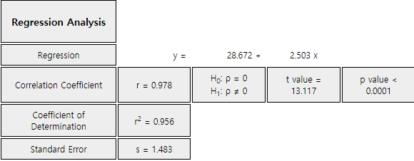
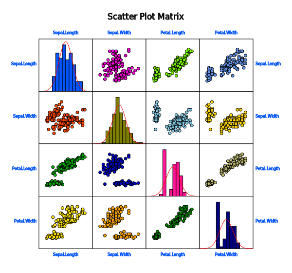
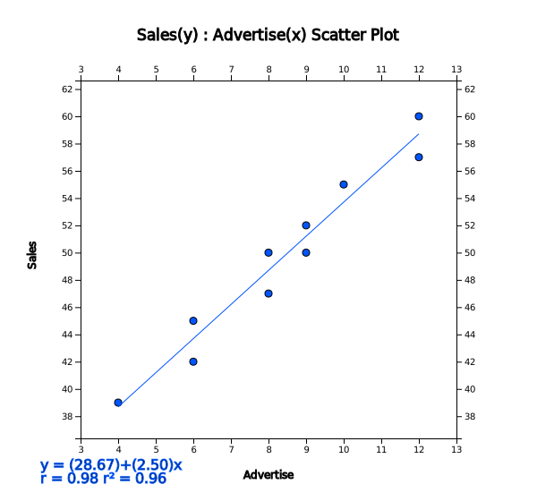
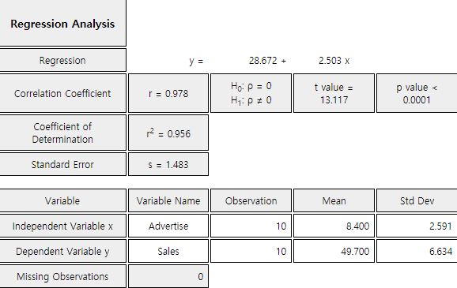
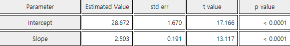
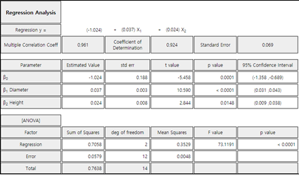

::: container-fluid
:::

::: {.col-sm-9 .col-sm-offset-3 .col-md-10 .col-md-offset-2 .main}
# Chapter 12. Correlation and Regression Analysis

       ❮   **Chapter 11**       

-   [12.1 Correlation Analysis](../chapter12/1201.html)
-   [12.2 Simple Linear Regression Analysis](../chapter12/1202.html)
-   [12.3 Multiple Linear Regression Analysis](../chapter12/1203.html)
-   [12.4 Exercise](../chapter12/1204.html)

##### [[\[book\]]{.underline}](book12.pdf){target="_blank"}    [[\[eStat YouTube Channel\]]{.underline}](https://www.youtube.com/channel/UCw2Rzl9A4rXMcT8ue8GH3IA){target="_blank"}

## CHAPTER OBJECTIVES

From Chapter 7 to Chapter 10, we discussed the estimation and the
testing hypothesis of parameters such as population mean and variance
for single variable.

This chapter describes a correlation analysis for two or more variables.

If variables are related with each other, then a regression analysis is
described to see how this association can be used. Simple linear
regression analysis and multiple regression analysis are discussed.

       ❮   **Chapter 11**       
:::
::: container-fluid
:::

::: {.col-sm-9 .col-sm-offset-3 .col-md-10 .col-md-offset-2 .main}

             

## 12.1 Correlation Analysis

::: presentation-video-link
[presentation](1201.pdf){.presentation-link target="_blank"}   
[video](https://youtu.be/dPCZ1w59Vm8){.video-link target="_blank"}
:::

::: mainTable
The easiest way to observe the relation of two variables is to draw a
scatter plot with one variable as X axis and the other as Y axis. If two
variables are related, data will gather together with a certain pattern,
and if not related, data will be scattered around. The correlation
analysis is a method of analyzing the degree of linear relationship
between two variables. It is to investigate how linearly the other
variable increases or decreases as one variable increases.
:::

::: mainTableGrey
**Example 12.1.1** Based on the survey of advertising costs and sales
for 10 companies that make the same product, we obtained the following
data as Table 12.1.1. Using 『eStat』 , draw a scatter plot for this
data and investigate the relation of the two variables.

::: textLeft
Table 12.1.1 Advertising costs and sales (unit: 1 million USD)
:::

  Company   Advertise (X)   Sales (Y)
  --------- --------------- -----------
  1         4               39
  2         6               42
  3         6               45
  4         8               47
  5         8               50
  6         9               50
  7         9               52
  8         10              55
  9         12              57
  10        12              60

::: textLeft
\[Ex\] ⇨ eBook ⇨ EX120101_SalesByAdvertise.csv.
:::

**Answer**

Using 『eStat』 , enter data as shown in \<Figure 12.1.1\>. If you
select the Sales as \'Y Var\' and the Advertise \'by X Var\' in the
variable selection box that appears when you click the scatter plot icon
on the main menu, the scatter plot will appear as shown in \<Figure
12.1.2\>. As we can expect, the scatter plot show that the more
investments in advertising, the more sales increase, and not only that,
the form of increase is linear.

<input class="qrBtn" onclick="window.open(addrStr[37])" src="QR/EX120101.svg" type="image"/>

{.imgFig600400}

::: figText
\<Figure 12.1.1\> Data input in 『eStat』
:::

::: figText
\<Figure 12.1.2\> Scatter plot of sales by advertise
:::
:::

::: mainTable
The relation between two variables can be roughly investigated using a
scatter plot like this. However, a measure of the extent of the relation
can be used together to provide a more accurate and objective view of
the relation between two variables. As a measure of the relation between
two variables, there is a covariance. The population covariance of the
two variables $X$ and $Y$ is denoted as $Cov(X,Y)$. When the random
samples of two variables are given as
$(X_1 , Y_1 ) , (X_2 , Y_2 ), ... , (X_n , Y_n )$, the estimate of the
population covariance using samples, which is called the sample
covariance, $s_{XY}$, is defined as follows: $$
        \begin{align}
          s_{XY} &= \frac{1}{n-1} \sum_{i=1}^{n} ( X_i - \overline X )( Y_i - \overline Y ) \\
                 &= \frac{1}{n-1} ( \sum_{i=1}^{n} X_i  Y_i - n {\overline X}{\overline Y} )
        \end{align}
      $$ In the above equation, $\overline X$ and $\overline Y$
represent the sample means of $X$ and $Y$ respectively.

In order to understand the meaning of covariance, consider a case that
$Y$ increases if $X$ increases. If the value of $X$ is larger than
$\overline X$ and the value of $Y$ is larger than $\overline Y$, then
$(X - \overline X)(Y- \overline Y)$ always has a positive value. Also,
if the value of $X$ is smaller than $\overline X$ and the value of $Y$
is smaller than $\overline Y$, then $(X - \overline X)(Y- \overline Y)$
has a positive value. Therefore, their mean value which is the
covariance tends to be positive. Conversely, if the value of the
covariance is negative, the value of the other variable decreases as the
value of one variable increases. Hence, by calculating covariance, we
can see the relation between two variables: positive correlation (i.e.,
increasing the value of one variable will increase the value of the
other) or negative correlation (i.e., decreasing the value of the
other).

Covariance itself is a good measure, but, since the covariance depends
on the unit of $X$ and $Y$, it makes difficult to interpret the
covariance according to the size of the value and inconvenient to
compare with other data. Standardized covariance which divides the
covariance by the standard deviation of $X$ and $Y$, $\sigma_{X}$ and
$\sigma_{Y}$, to obtain a measurement unrelated to the type of variable
or specific unit, is called the population correlation coefficient and
denoted as $\rho$.

$$
        \text{Population Correlation Coefficient: } \rho = \frac{Cov (X, Y)} { \sigma_X \sigma_Y } 
      $$

\<Figure 12.1.3\> shows different scatter plots and its values of the
correlation coefficient.

{.imgFig600400}

::: figText
\<Figure 12.1.3\> Different scatter plots and their correlation
coefficients.
:::

The correlation coefficient $\rho$ is interpreted as follows:

::: textL20M20
1\) $\rho$ has a value between -1 and +1. A $\rho$ value closer to +1
indicates a strong positive linear relation and a $\rho$ value closer to
-1 indicates a strong negative linear relation. Linear relationship
weakens as the value of $\rho$ is close to 0.
:::

::: textL20M20
2\) If all the corresponding values of $X$ and $Y$ are located on a
straight line, the value of $\rho$ has either +1 (if the slope of the
straight line is positive) or -1 (if the slope of the straight line is
negative).
:::

::: textL20M20
3\) The correlation coefficient $\rho$ is only a measure of linear
relationship between two variables. Therefore, in the case of $\rho$ =
0, there is no linear relationship between the two variables, but there
may be a different relationship. (see the scatter plot (f) in \<Figure
12.1.3\>)
:::

『eStatU』 provides a simulation of scatter plot shapes for different
correlations as in \<Figure 12.1.4\>.

<input class="qrBtn" onclick="window.open(addrStr[79])" src="QR/eStatU310_Correlation.svg" type="image"/>

{.imgFig600400}

::: figText
\<Figure 12.1.4\> Simulation of correlation coefficient at 『eStatU』
:::

An estimate of the population correlation coefficient using samples of
two variables is called the sample correlation coefficient and denoted
as $r$. The formula for the sample correlation coefficient $r$ can be
obtained by replacing each parameter with the estimates in the formula
for the population correlation coefficient. $$
        r = \frac {s_{XY}} { s_X s_Y } 
      $$ where $s_{XY}$ is the sample covariance and $s_{X}$, $s_{Y}$
are the sample standard deviations of $X$ and $Y$ as follows: $$
        \begin{align}
          s_{XY} &= \frac{1}{n-1} \sum_{i=1}^{n} (X_i - \overline X )(Y_i - \overline Y )  \\
          s_X^2    &= \frac{1}{n-1} \sum_{i=1}^{n} (X_i - \overline X )^{2}  \\
          s_Y^2    &= \frac{1}{n-1} \sum_{i=1}^{n} (Y_i - \overline Y )^{2}  \\
        \end{align}
      $$ Therefore, the formula $r$ can be written as follows $$
        \begin{align}
        r &= \frac {\sum_{i=1}^{n} (X_i - \overline X )(Y_i - \overline Y )} { \sqrt{\sum_{i=1}^{n} (X_i - \overline X )^{2} \sum_{i=1}^{n} (Y_i - \overline Y )^{2} } } \\
          &= \frac {\sum_{i=1}^{n} X_i Y_i - n \overline X \overline Y } { \sqrt{\left (\sum_{i=1}^{n} X_{i}^{2} - n {\overline X}^2 \right) \left( \sum_{i=1}^{n} Y_{i}^{2} - n {\overline Y}^{2} \right) } } 
        \end{align}
      $$
:::

::: mainTableGrey
**Example 12.1.2** Find the sample covariance and correlation
coefficient for the advertising costs and sales of \[Example 12.1.1\].

**Answer**

To calculate the sample covariance and correlation coefficient, it is
convenient to make the following table. This table can also be used for
calculations in regression analysis.

::: textLeft
Table 12.1.2 A table for calculating the covariance
:::

  Number   $X$   $Y$    $X^2$   $Y^2$   $XY$
  -------- ----- ------ ------- ------- ------
  1        4     39     16      1521    156
  2        6     42     36      1764    252
  3        6     45     36      2025    270
  4        8     47     64      2209    376
  5        8     50     64      2500    400
  6        9     50     81      2500    450
  7        9     52     81      2704    468
  8        10    55     100     3025    550
  9        12    57     144     3249    684
  10       12    60     144     3600    720
  Sum      64    497    766     25097   4326
  Mean     8.4   49.7                   

Terms which are necessary to calculate the covariance and correlation
coefficient are as follows:

$\small \quad SXX = \sum_{i=1}^{n} (X_i - \overline X )^{2} = \sum_{i=1}^{n} X_{i}^2 - n{\overline X}^{2} = 766 - 10×8.4^2 = 60.4$\
$\small \quad SYY = \sum_{i=1}^{n} (Y_i - \overline Y )^{2} = \sum_{i=1}^{n} Y_{i}^2 - n{\overline Y}^{2} = 25097 - 10×49.7^2 = 396.1$\
$\small \quad SXY = \sum_{i=1}^{n} (X_i - \overline X )(Y_i - \overline Y ) = \sum_{i=1}^{n} X_{i}Y_{i} - n{\overline X}{\overline Y} = 4326 - 10×8.4×49.7 = 151.2$

$\small SXX, SYY, SXY$represent the sum of squares of $\small X$, the
sum of squares of $\small Y$, the sum of squares of $\small XY$. Hence,
the covariance and correlation coefficient are as follows:

$\small \quad s_{XY} = \frac{1}{n-1} \sum_{i=1}^{n} (X_i - \overline X )(Y_i - \overline Y ) = \frac{151.2}{10-1} = 16.8$
$\small \quad r = \frac {\sum_{i=1}^{n} (X_i - \overline X )(Y_i - \overline Y )} { \sqrt{\sum_{i=1}^{n} (X_i - \overline X )^{2} \sum_{i=1}^{n} (Y_i - \overline Y )^{2} } } = \frac{151.2} { \sqrt{ 60.4 × 396.1 } } = 0.978$

This value of the correlation coefficient is consistent with the scatter
plot which shows a strong positive correlation of the two variables.
:::

::: mainTable
Sample correlation coefficient $r$ can be used for testing hypothesis of
the population correlation coefficient. The main interest in testing
hypothesis of $\rho$ is $H_0 : \rho = 0$ which tests the existence of
linear correlation. This test can be done using $t$ distribution as
follows:
:::

::: mainTableYellow
**Testing the population correlation coefficient $\rho$:**

Null Hypothesis: $H_0 : \rho = 0$

Test Statistic: $\qquad t_0 = \sqrt{n-2} \frac{r}{\sqrt{1 - r^2 }}$,
$\quad t_0$ follows $t$ distribution with $n-2$ degrees of freedom

Rejection Region of $H_0$:\
$\qquad 1)\; H_1 : \rho < 0 , \;\;$ Reject if $\; t_0 < -t_{n-2; α}$\
$\qquad 2)\; H_1 : \rho > 0 , \;\;$ Reject if $\; t_0 > t_{n-2; α}$\
$\qquad 3)\; H_1 : \rho \ne 0 , \;\;$ Reject if
$\; |t_0 | > t_{n-2; α/2}$
:::

::: mainTableGrey
**Example 12.1.3** In the Example 12.1.2, test the hypothesis that the
population correlation coefficient between advertising cost and the
sales amount is zero at the significance level of 0.05. (Since the
sample correlation coefficient is 0.978 which is close to 1, this test
will not be required in practice.)

**Answer**

The value of the test statistic $t$ is as follows:

$\qquad \small t_0 = \sqrt{10-2} \frac{0.978}{\sqrt{1 - 0.978^2 }}$ =
13.26

Since it is greater than $t_{8; 0.025}$ = 2.306, $\small H_0 : \rho = 0$
should be rejected.

With the selected variables of 『eStat』 as \<Figure 12.1.1\>, click the
regression icon on the main menu, then the scatter plot with a
regression line will appear. Clicking the \[Correlation and Regression\]
button below this graph will show the output as \<Figure 12.1.5\> in the
Log Area with the result of the regression analysis. The values of this
result are slightly different from the textbook, which is the error
associated with the number of digits below the decimal point. The same
conclusion is obtained that the p-value for the correlation test is
0.0001, less than the significance level of 0.05 and therefore, the null
hypothesis is rejected.

{.imgFig600400}

::: figText
\<Figure 12.1.5\> Testing hypothesis of correlation using 『eStat』
:::
:::

::: mainTablePink

<input class="qrBtn" onclick="window.open(addrStr[74])" src="QR/PR120101.svg" type="image"/>

**Practice 12.1.1** A professor of statistics argues that a student's
final test score can be predicted from his/her midterm. Ten students
were randomly selected and their mid-term and final exam scores are as
follows:

  id   Mid-term X   Final Y
  ---- ------------ ---------
  1    92           87
  2    65           71
  3    75           75
  4    83           84
  5    95           93
  6    87           82
  7    96           98
  8    53           42
  9    77           82
  10   68           60

::: textLeft
\[Ex\] ⇨ eBook ⇨ PR120101_MidtermFinal.csv.
:::

::: textL20M20
1\) Draw a scatter plot of this data with the mid-term score on X axis
and final score on Y axis. What do you think is the relationship between
mid-term and final scores?
:::

::: textL20M20
2\) Find the sample correlation coefficient and test the hypothesis that
the population correlation coefficient is zero with the significance
level of 0.05.
:::

:::

::: mainTable
If there are more than three variables in the analysis, the relationship
can be viewed using the scatter plots for each combination of two
variables and the sample correlation coefficients can be obtained.
However, to make it easier to see the relationship between the
variables, the correlations between the variables can be arranged in a
matrix format which is called a correlation matrix. 『eStat』 shows the
result of a correlation matrix and the significance test for those
values. The result of the test shows the t value and p-value.
:::

::: mainTableGrey
**Example 12.1.4** Draw a scatter plot matrix and correlation
coefficient matrix using four variables of the iris data saved in the
following location of 『eStat』.

::: textLeft
\[Ex\] ⇨ eBook ⇨ EX120104_Iris.csv
:::

The variables are Sepal.Length, Sepal.Width, Petal.Length, and
Petal.Width. Test the hypothesis whether the correlation coefficients
are equal to zero.

**Answer**

From 『eStat』, load the data and click the \'Regression\' icon. When
the variable selection box appears, select the four variables of
Sepal.Length, Sepal.Width, Petal.Length, and Petal.Width, then the
scatter plot matrix will be shown as \<Figure 12.1.6\>.

It is observed that the Sepal.Length and the Petal.Length, and the
Petal.Length and the Petal.Width are related.

<input class="qrBtn" onclick="window.open(addrStr[38])" src="QR/EX120104.svg" type="image"/>

{.imgFig600400}

::: figText
\<Figure 12.1.6\> Scatter plot matrix using 『eStat』
:::

When selecting \[Regression Analysis\] button from the options below the
graph, the basic statistics and correlation coefficient matrix such as
\<Figure 12.1.7\> appear in the Log Area with the test result. It can be
seen that all correlations are significant except the correlation
coefficient between the Sepal.Length and Sepal.Width.

{.imgFig600400}

{.imgFig600400}

::: figText
\<Figure 12.1.7\> Descriptive statistics and correlation matrix using
『eStat』
:::
:::

::: mainTablePink

<input class="qrBtn" onclick="window.open(addrStr[75])" src="QR/PR120102.svg" type="image"/>

**Practice 12.1.2** A health scientist randomly selected 20 people to
determine the effects of smoking and obesity on their physical strength
and examined the average daily smoking rate (, number/day), the ratio of
weight by height (, kg/m), and the time to exercise with a certain
intensity (, in hours). Draw a scatterplot matrix and test whether there
is a correlation among smoking, obesity and exercising time with a
certain intensity.

  -----------------------------------------------------------------------
  smoking rate\           ratio of weight by      time to exercise\
  $x_1$                   height\                 $y$
                          $x_2$                   
  ----------------------- ----------------------- -----------------------
  24                      53                      11

  0                       47                      22

  25                      50                      7

  0                       52                      26

  5                       40                      22

  18                      44                      15

  20                      46                      9

  0                       45                      23

  15                      56                      15

  6                       40                      24

  0                       45                      27

  15                      47                      14

  18                      41                      13

  5                       38                      21

  10                      51                      20

  0                       43                      24

  12                      38                      15

  0                       36                      24

  15                      43                      12

  12                      45                      16
  -----------------------------------------------------------------------

::: textLeft
\[Ex\] ⇨ eBook ⇨ PR120102_SmokingObesityExercis.csv.
:::

:::

::: mainTablePink
### Multiple Choice Exercise

\*\*\* Choose one answer and click \[Submit\] button

::: textL30M30
12.1 The variables X and Y have a strong relationship with a quadratic
equation () as shown in the following table. What is their sample
correlation coefficient?
:::

  X      Y
  ------ ------
  \...   \...
  -3     9
  -2     4
  -1     1
  0      0
  1      1
  2      4
  3      9
  \...   \...

<form name="Q1">
<label><input name="item" type="radio" value="1"/> 1</label> 
<label><input name="item" type="radio" value="2"/> 0</label> 
<label><input name="item" type="radio" value="3"/> -1</label> 
<label><input name="item" type="radio" value="4"/> 1/2</label> 

<input onclick="radio(12,1,Q1)" type="button" value="Submit"/>    
      <input id="ansQ1" size="15" type="text"/>

</form>

::: textL30M30
12.2 Which is a wrong description of the sample correlation coefficient
$r$?
:::

<form name="Q2">
<label><input name="item" type="radio" value="1"/> \(-1 &lt; r &lt; 1\)</label> 
<label><input name="item" type="radio" value="2"/> if \( r = 1 \), perfect negative correlation</label> 
<label><input name="item" type="radio" value="3"/> if \( r = 0 \), no linear correlation</label> 
<label><input name="item" type="radio" value="4"/> if \( r &lt; 0 \), negative correlation</label> 

<input onclick="radio(12,2,Q2)" type="button" value="Submit"/>    
      <input id="ansQ2" size="15" type="text"/>

</form>

::: textL30M30
12.3 Which is a right description of the sample correlation coefficient
$r$?

<form name="Q3">
<label><input name="item" type="radio" value="1"/> if \( r &gt; 1 \), there is strong positive correlation between \(x\) and \(y\).</label> 
<label><input name="item" type="radio" value="2"/> if \( | r | \) closes to 0, there exist a weak linear correlation between \(x\) and \(y\).</label> 
<label><input name="item" type="radio" value="3"/> If \( r  \) is negative, then \(y\) is increasing when \(x\) increases. </label> 
<label><input name="item" type="radio" value="4"/> If \( r  \) is near -1, there exist a weak linear correlation between \(x\) and \(y\).</label> 

<input onclick="radio(12,3,Q3)" type="button" value="Submit"/>    
      <input id="ansQ3" size="15" type="text"/>

</form>

::: textL30M30
12.4 If the sample correlation coefficient between $x$ and $y$ is $r$,
what is the sample correlation coefficient between $2x$ and $3y +1$?
:::

<form name="Q4">
<label><input name="item" type="radio" value="1"/> \(r\)</label> 
<label><input name="item" type="radio" value="2"/> \(2r\)</label> 
<label><input name="item" type="radio" value="3"/> \(3r\)</label> 
<label><input name="item" type="radio" value="4"/> \(3r+1\)</label> 

<input onclick="radio(12,4,Q4)" type="button" value="Submit"/>    
      <input id="ansQ4" size="15" type="text"/>

</form>

::: textL30M30
12.5 Find the sample correlation coefficient between $x$ and $y$ of the
following data.
:::

  $x$   $y$
  ----- -----
  10    2
  20    4
  30    6
  40    8

<form name="Q5">
<label><input name="item" type="radio" value="1"/> 1</label> 
<label><input name="item" type="radio" value="2"/> 0.3</label> 
<label><input name="item" type="radio" value="3"/> 0.4</label> 
<label><input name="item" type="radio" value="4"/> 0.5</label> 

<input onclick="radio(12,5,Q5)" type="button" value="Submit"/>    
        <input id="ansQ5" size="15" type="text"/>

</form>

::: textL30M30
12.6 If the correlation coefficient of two variables $x, y$ is 0, what
is the right description?
:::

<form name="Q6">
<label><input name="item" type="radio" value="1"/> There is no linear relationship between two variables \(x, y\).</label> 
<label><input name="item" type="radio" value="2"/> There is a linear relationship between two variables \(x, y\)</label> 
<label><input name="item" type="radio" value="3"/> Two variables \(x, y\) has a strong relationship.</label> 
<label><input name="item" type="radio" value="4"/> Two variables \(x, y\) has a strong linear relationship.</label> 

<input onclick="radio(12,6,Q6)" type="button" value="Submit"/>    
      <input id="ansQ6" size="15" type="text"/>

</form>

::: textL30M30
12.7 Which one of the following descriptions on the sample correlation
coefficient $r$ is not right?
:::

<form name="Q7">
<label><input name="item" type="radio" value="1"/> \(r\) is a random variable.</label> 
<label><input name="item" type="radio" value="2"/> \(-1 \le r \le 1\)</label> 
<label><input name="item" type="radio" value="3"/> \(r\) is a measure of linear relationship between two variables.</label> 
<label><input name="item" type="radio" value="4"/> Distribution of \(r\) is a normal distribution.</label> 

<input onclick="radio(12,7,Q7)" type="button" value="Submit"/>    
      <input id="ansQ7" size="15" type="text"/>

</form>

::: textL30M30
12.8 Find the sample correlation coefficient between $x$ and $y$ of the
following data.
:::

  $x$   $y$
  ----- -----
  1     5
  2     4
  3     3
  4     2
  5     1

<form name="Q8">
<label><input name="item" type="radio" value="1"/> -1</label> 
<label><input name="item" type="radio" value="2"/> -1/2</label> 
<label><input name="item" type="radio" value="3"/> 0</label> 
<label><input name="item" type="radio" value="4"/> 1/2</label> 

<input onclick="radio(12,8,Q8)" type="button" value="Submit"/>    
      <input id="ansQ8" size="15" type="text"/>

</form>

::: textL30M30
12.9 If $X$ and $Y$ are independent, what is the sample correlation
coefficient $r$?
:::

<form name="Q9">
<label><input name="item" type="radio" value="1"/> 1</label> 
<label><input name="item" type="radio" value="2"/> 1/2</label> 
<label><input name="item" type="radio" value="3"/> 0</label> 
<label><input name="item" type="radio" value="4"/> -1/2</label> 

<input onclick="radio(12,9,Q9)" type="button" value="Submit"/>    
      <input id="ansQ9" size="15" type="text"/>

</form>

::: textL30M30
12.10 Which one of the followings is not right for description of the
sample correlation coefficient $r$ between $X$ and $Y$?
:::

<form name="Q10">
<label><input name="item" type="radio" value="1"/> \(-1 \le r \le 1\)</label> 
<label><input name="item" type="radio" value="2"/> Distribution of \(r\) is a normal distribution.</label> 
<label><input name="item" type="radio" value="3"/> \(r\) is a random variable.</label> 
<label><input name="item" type="radio" value="4"/> The formula to calculate \(r\) is \(r = \frac{\sum (x_i -\overline x)(y_i - \overline y)}{\sqrt{{\sum(x_i -   \overline x)^2}{\sum(y_i - \overline y)^2}}}\)</label> 

<input onclick="radio(12,10,Q10)" type="button" value="Submit"/>    
      <input id="ansQ10" size="15" type="text"/>

</form>

::: textL30M30
12.11 Which one of the followings has positive correlation?
:::

<form name="Q11">
<label><input name="item" type="radio" value="1"/> height of mountain and pressure</label> 
<label><input name="item" type="radio" value="2"/> weight and height</label> 
<label><input name="item" type="radio" value="3"/> monthly income and Engel's coefficient</label> 
<label><input name="item" type="radio" value="4"/> amount of production and price</label> 

<input onclick="radio(12,11,Q11)" type="button" value="Submit"/>    
      <input id="ansQ11" size="15" type="text"/>

</form>

::: textL30M30
12.12 Find the sample covariance between $x$ and $y$ of the following
data.
:::

  $x$   $y$
  ----- -----
  1     5
  2     5
  3     5
  4     5

<form name="Q12">
<label><input name="item" type="radio" value="1"/> 1</label> 
<label><input name="item" type="radio" value="2"/> 0</label> 
<label><input name="item" type="radio" value="3"/> 0.5</label> 
<label><input name="item" type="radio" value="4"/> -1</label> 

<input onclick="radio(12,12,Q12)" type="button" value="Submit"/>    
      <input id="ansQ12" size="15" type="text"/>

</form>

::: textL30M30
12.13 Find the sample covariance between $x$ and $y$ of the following
data.

##### 

  $x$   $y$
  ----- -----
  1     6
  2     8
  3     10
  4     12
  5     14

<form name="Q13">
<label><input name="item" type="radio" value="1"/> 3</label> 
<label><input name="item" type="radio" value="2"/> 4</label> 
<label><input name="item" type="radio" value="3"/> 10</label> 
<label><input name="item" type="radio" value="4"/> 20</label> 

<input onclick="radio(12,13,Q13)" type="button" value="Submit"/>    
      <input id="ansQ13" size="15" type="text"/>

</form>

::: textL30M30
12.14 If the standard deviations of the $X$ and $Y$ variables are 4.06
and 2.65 respectively, the covariance is 10.50, what is the sample
correlation coefficient $r$?
:::

<form name="Q14">
<label><input name="item" type="radio" value="1"/> 10.759</label> 
<label><input name="item" type="radio" value="2"/> 0.532</label> 
<label><input name="item" type="radio" value="3"/> 1.025</label> 
<label><input name="item" type="radio" value="4"/> 0.976</label> 

<input onclick="radio(12,14,Q14)" type="button" value="Submit"/>    
      <input id="ansQ14" size="15" type="text"/>

</form>

:::
:::
:::

             
:::
::: container-fluid
:::

::: {.col-sm-9 .col-sm-offset-3 .col-md-10 .col-md-offset-2 .main}

             

## 12.2 Simple Linear Regression Analysis

::: presentation-video-link
[presentation](1202.pdf){.presentation-link target="_blank"}   
[video](https://youtu.be/wn0Dl3dLgko){.video-link target="_blank"}
:::

::: mainTable
Regression analysis is a statistical method that first establishes a
reasonable mathematical model of relationships between variables,
estimates the model using measured values of the variables, and then
uses the estimated model to describe the relationship between the
variables, or to apply it to the analysis such as forecasting. For
example, a mathematical model of the relationship between sales ($Y$)
and advertising costs ($X$) would not only explain the relationship
between sales and advertising costs, but would also be able to predict
the amount of sales that a given investment.
:::

::: mainTableYellow
**Regression Analysis**

Regression analysis is a statistical method that first establishes a
reasonable mathematical model of relationships between variables,
estimates the model using measured values of the variables, and then
uses the estimated model to describe the relationship between the
variables, or to apply it to the analysis such as forecasting.
:::

::: mainTable
As such, the regression analysis is intended to investigate and predict
the degree of relation between variables and the shape of the relation.
In regression analysis, a mathematical model of the relation between
variables is called a **regression equation**, and the variable affected
by other related variables is called a **dependent variable**. The
dependent variable is the variable we would like to describe which is
usually observed in response to other variables, so it is also called a
**response variable**. In addition, variables that affect the dependent
variable are called **independent variables**. The independent variable
is also referred to as the **explanatory variable**, because it is used
to describe the dependent variable. In the previous example, if the
objective is to analyse the change in sales amounts resulting from
increases and decreases in advertising costs, the sales amount is a
dependent variable and the advertising cost is an independent variable.

If the number of independent variables included in the regression
equation is one, it is called a **simple linear regression**. If the
number of independent variables are two or more, it is called a
**multiple linear regression**.
:::

### 12.2.1 Simple Linear Regression Model

::: mainTable
Simple linear regression analysis has only one independent variable and
the regression equation is shown as follows: $$
        Y = f(X,\alpha,\beta) = \alpha + \beta X
      $$ In other words, the regression equation is represented by the
linear equation of the independent variable, and $\alpha$ and $\beta$
are unknown parameters which represent the intercept and slope
respectively. The $\alpha$ and $\beta$ are called the **regression
coefficients**. The above equation represents an unknown linear
relationship between $Y$ and $X$ in population and is therefore,
referred to as the population regression equation.

In order to estimate the regression coefficients $\alpha$ and $\beta$,
observations of the dependent and independent variable are required,
i.e., samples. In general, all of these observations are not located in
a line. This is because, even if the $Y$ and $X$ have an exact linear
relation, there may be a measurement error in the observations, or there
may not be an exact linear relationship between $Y$ and $X$. Therefore,
the regression formula can be written by considering these errors
together as follows: $$
        Y_i = \alpha + \beta X_i + \epsilon_{i}, \quad i=1,2,...,n
      $$ where $i$ is the subscript representing the $i^{th}$
observation, and $\epsilon_i$ is the random variable indicating an error
with a mean of zero and a variance $\sigma^2$ which is independent of
each other. The error $\epsilon_i$ indicates that the observation $Y_i$
is how far away from the population regression equation. The above
equation includes unknown population parameters $\alpha$, $\beta$ and
$\sigma^2$, and is therefore, referred to as a population regression
model.

If $a$ and $b$ are the estimated regression coefficients using samples,
the fitted regression equation can be written as follows: It is referred
to as the sample regression equation. $$
        {\hat Y}_i = a + b X_i 
      $$ In this expression, ${\hat Y}_i$ represents the estimated value
of $Y$ at $X=X_i$ as predicted by the appropriate regression equation.
These predicted values can not match the actual observed values of $Y$,
and differences between these two values are called residuals and
denoted as $e_i$. $$
        \text{Residuals} \qquad e_i = Y_i - {\hat Y}_i , \quad i=1,2,...,n
      $$ The regression analysis makes some assumptions about the
unobservable error $\epsilon_i$. Since the residuals $e_i$ calculated
using the sample values have similar characteristics as $\epsilon_i$,
they are used to investigate the validity of these assumptions. (Refer
to Section 12.2.6 for residual analysis.)
:::

### 12.2.2 Estimation of Regression Coefficient

::: mainTable
When sample data, $(X_1 , Y_1 ) , (X_2 , Y_2 ) , ... , (X_n , Y_n )$,
are given, a straight line representing it can be drawn in many ways.
Since one of the main objectives of regression analysis is prediction,
we would like to use the estimated regression line that would make the
residuals smallest that the error occurs when predicting the value of Y.
However, it is not possible to minimize the value of the residuals at
all points, and it should be chosen to make the residuals \'totally\'
smaller. The most widely used of these methods is the method which
minimizes the total sum of squared residuals, that is called the method
of least squares regression.
:::

::: mainTableYellow
**Method of Least Squares Regression**

A method of estimating regression coefficients so that the total sum of
the squared errors occurring in each observation is minimized. i.e.,

$\quad$ Find $\alpha$ and $\beta$ which minimize

$$
        \sum_{i=1}^{n} \epsilon_{i}^2  =  \sum_{i=1}^{n} ( Y_i - \alpha - \beta X_i  )^2 
      $$
:::

::: mainTable
To obtain the values of $\alpha$ and $\beta$ by the least squares
method, the sum of squares above should be differentiated partially with
respect to $\alpha$ and $\beta$, and equate them zero respectively. If
the solution of $\alpha$ and $\beta$ of these equations is $a$ and $b$,
the equations can be written as follows: $$
        \begin{align}
          a \cdot n + b \sum_{i=1}^{n} X_i  &= \sum_{i=1}^{n} Y_i \\ 
          a \sum_{i=1}^{n} X_i + b \sum_{i=1}^{n} X_i^2  &= \sum_{i=1}^{n} X_i Y_i \\
        \end{align}
      $$

The above expression is called a **normal equation**. The solution $a$
and $b$ of this normal equation is called the **least squares
estimator** of $\alpha$ and $\beta$ and is given as follows:
:::

::: mainTableYellow
**Least Squares Estimator of $\alpha$ and $\beta$**

$\small  \quad b = \frac {\sum_{i=1}^{n} (X_i - \overline X ) (Y_i - \overline Y )} { \sum_{i=1}^{n} (X_i - \overline X )^2 }$

$\small \quad a = \overline Y - b \overline X$
:::

::: mainTable
If we divide both the numerator and the denominator of $b$ by $n-1$, $b$
can be written as $b = \frac{s_{XY}}{s_{X}^2}$. Since the correlation
coefficient is $r = \frac{s_{XY}}{s_X s_Y}$ and therefore, the slope $b$
can also be calculated by using the correlation coefficient as follows:
$$
        b = \frac{s_{XY}}{s_X ^2} = \frac{ r s_X s_Y } {s_X ^2 } =  r \frac{s_Y}{s_X}
      $$
:::

::: mainTableGrey
**Example 12.2.1** In \[Example 12.1.1\], find the least squares
estimate of the slope and intercept if the sales amount is a dependent
variable and the advertising cost is an independent variable. Predict
the amount of sales when you have spent on advertising by 10.

**Answer**

In \[Example 12.1.1\], the calculation required to obtain the intercept
and slope has already been made. The intercept and slope using this are
as follows:

$\quad b = \small \frac {\sum_{i=1}^{n} (X_i - \overline X ) (Y_i - \overline Y )} { \sum_{i=1}^{n} (X_i - \overline X )^2 } \\  = \frac {151.2}{60.4} = 2.503$
$\quad a = \small \overline Y - b \overline X = 49.7 - 2.503 \times 8.4 = 28.672$

Therefore, the fitted regression line is
$\small \hat Y_i = 28.672 + 2.503 X_i$.

\<Figure 12.2.1\> shows the fitted regression line on the original data.
The meaning of slope value, 2.5033, is that, if advertising cost
increases by one (i.e., one million), sales increases by about 2.5
million.

{.imgFig600400}

::: figText
\<Figure 12.2.1\> Simple linear regression using 『eStat』
:::

Prediction of the sales amount of a company with an advertising cost of
10 can be obtained by using the fitted sample regression line as
follows:

$\quad \small 28.672 + (2.503)(10) = 53.702$

In other words, sales of 53.705 million are expected. That is not to say
that all companies with advertising costs of 10 million USD have sales
of 53.705 million USD, but that the average amount of their sales is
about that. Therefore, there may be some differences in individual
companies.
:::

::: mainTablePink
**Practice 12.2.1** Using the data of \[Practice 12.1.1\] for the
mid-term and final exam score, find the least squares estimate of the
slope and intercept if the final exam score is a dependent variable and
the mid-term score is an independent variable. Predict the final exam
score when you have a mid-term score of 80.
:::

### 12.2.3 Goodness of Fit for Regression Line

::: mainTable
After estimating the regression line, it should be investigated how
valid the regression line is. Since the objective of a regression
analysis is to describe a dependent variable as a function of an
independent variable, it is necessary to find out how much the
explanation is. A residual standard error and a coefficient of
determination are used for such validation studies.

Residual standard error $s$ is a measure of the extent to which
observations are scattered around the estimated line. First, you can
define the sample variance of residuals as follows: $$
        s^2 = \frac{1}{n-2} \sum_{i=1}^{n} ( Y_i -  {\hat Y}_i )^2 
      $$ The residual standard error $s$ is defined as the square root
of $s^2$. The $s^2$ is an estimate of $\sigma^2$ which is the extent
that the observations $Y$ are spread around the population regression
line. A small value of $s$ or $s^2$ indicates that the observations are
close to the estimated regression line, which in turn the regression
line represents well the relationship between the two variables.

However, it is not clear how small the residual standard error $s$ is,
although the smaller value is the better. In addition, the size of the
value of $s$ depends on the unit of $Y$. To eliminate this shortcoming,
a relative measure called the coefficient of determination is defined.
The **coefficient of determination** is the ratio of the variation
described by the regression line over the total variation of observation
$Y_i$, so that it is a relative measure that can be used regardless of
the type and unit of the variable.

As in the analysis of variance in Chapter 9, the following partitions of
the sum of squares and degrees of freedom are formed in the regression
analysis:
:::

::: mainTableYellow
**Partitions of the sum of squares and degrees of freedom**

$\qquad$ Sum of squares: $\qquad SST = SSE + SSR$\
$\qquad$ Degrees of freedom: $(n-1) = (n-2) + 1$
:::

::: mainTable
Description of the above three sums of squares is as follows:

**Total Sum of Squares** :
$\small SST = \sum_{i=1}^{n} ( Y_i - {\overline Y} )^2$\
The total sum of squares indicating the total variation in observed
values of $Y$ is called the total sum of squares ($SST$). This $SST$ has
the degree of freedom, $n-1$, and if $SST$ is divided by the the degree
of freedom, it becomes the sample variance of $Y_i$.

**Error Sum of Squares** :
$\small SSE = \sum_{i=1}^{n} ( Y_i - {\hat Y}_i )^2$\
The error sum of squares ($SSE$) of the residuals represents the
unexplained variation of the total variation of the $Y$. Since the
calculation of this sum of squares requires the estimation of two
parameters $\alpha$ and $\beta$, $SSE$ has the degree of freedom $n-2$.
This is the reason why, in the calculation of the sample variance of
residuals $s^2$, it was divided by $n-2$.

**Regression Sum of Squares** :
$\small SSR = \sum_{i=1}^{n} ( {\hat Y}_i - {\overline Y} )^2$\
The regression sum of squares ($SSR$) indicates the variation explained
by the regression line among the total variation of $Y$. This sum of
squares has the degree of freedom of 1.

If the estimated regression equation fully explains the variation in all
samples (i.e., if all observations are on the sample regression line),
the unexplained variation $SSE$ will be zero. Thus, if the portion of
$SSE$ is small among the total sum of squares $SST$, or if the portion
of $SSR$ is large, the estimated regression model is more suitable.
Therefore, the ratio of $SSR$ to the total variation $SST$, called the
coefficient of determination, is defined as a measure of the suitability
of the regression line as follows: $$
        R^2 = \frac{Explained \;\; Variation}{Total \;\; Variation} = \frac{SSR}{SST}
      $$ The value of the coefficient of determination is always between
0 and 1 and the closer the value is to 1, the more concentrated the
samples are around the regression line, which means that the estimated
regression line explains the observations well.
:::

::: mainTableGrey
**Example 12.2.2** Calculate the value of the residual standard error
and the coefficient of determination in the data on advertising costs
and sales.

**Answer**

To obtain the residual standard error and the coefficient of
determination, it is convenient to make the following Table 12.2.1.
Here, the estimated value $\small {\hat Y}_i$ of the sales from each
value of $\small {X}_i$ uses the fitted regression line.

$\qquad \small {\hat Y}_i = 28.672 + 2.503 X_i$

::: textLeft
Table 12.2.1 Useful calculations for the residual standard error and
coefficient of determination
:::

Number
:::
:::

$\small X_i$

$\small Y_i$

$\small {\hat Y}_i$

$\small SST$\
$\small (Y_i - {\overline Y}_i )^2$

$\small SSR$\
$\small ({\hat Y}_i - {\overline Y}_i )^2$

$\small SSE$\
$\small (Y_i - {\hat Y}_i )^2$

1

4

39

38.639

114.49

122.346

0.130

2

6

42

43.645

59.29

36.663

2.706

3

6

45

43.645

22.09

36.663

1.836

4

8

47

48.651

7.29

1.100

2.726

5

8

50

48.651

0.09

1.100

1.820

6

9

50

51.154

0.09

2.114

1.332

7

9

52

51.154

5.29

2.114

0.716

8

10

55

53.657

28.09

15.658

1.804

9

12

57

58.663

53.29

80.335

2.766

10

12

60

58.663

106.09

80.335

1.788

Sum

64

497

496.522

396.1

378.429

17.622

Average

8.4

49.7

In Table 12.2.1, $\small SST$ = 396.1, $\small SSR$ = 378.429,
$\small SSE$ = 17.622. Here, the relationship of
$\small SST = SSE + SSR$ does not exactly match because of the error in
the number of digits calculation. The sample variance of residuals is as
follows:

$\qquad \small s^2 = \frac{1}{n-2} \sum_{i=1}^{n} ( Y_i - {\hat Y}_i )^2 = \frac{17.622}{(10-2)} = 2.203$

Hence, the residual standard error is $s$ = 1.484. The coefficient of
determination is as follows:

$\qquad \small R^2 = \frac{SSR}{SST} = \frac{378.429}{396.1} = 0.956$

This means that 95.6% of the total variation in the observed 10 sales
amounts can be explained by the simple linear regression model using a
variable of advertising costs, so this regression line is quite useful.

Click the \[Correlation and Regression\] button in the option below the
graph of \<Figure 12.2.1\> to show the coefficient of determinations and
estimation errors shown in \<Figure 12.2.2\>.

{.imgFig600400}

::: figText
\<Figure 12.2.2\> Correlation and descriptive statistics
:::

::: mainTablePink
**Practice 12.2.2** Using the data of \[Practice 12.1.1\] for the
mid-term and final exam scores, calculate the value of the residual
standard error and coefficient of determination.
:::

### 12.2.4 Analysis of Variance for Regression

::: mainTable
If we divide three sums of squares obtained in the above example by its
degrees of freedom, each one becomes a kind of variance. For example, if
you divide the $SST$ by $n-1$ degrees of freedom, then it becomes the
sample variance of the observed values $Y_1 , Y_2 , ... , Y_n$. If you
divide the $SSE$ by $n-2$ degrees of freedom, it becomes $s^2$ which is
an estimate of the variance of error $\sigma^2$. For this reason,
addressing the problems associated with the regression using the
partition of the sum of squares is called the ANOVA of regression.
Information required for ANOVA, such as calculated sum of squares and
degrees of freedom, can be compiled in the ANOVA table as shown in Table
12.2.2.
:::

::: textLeft
Table 12.2.2 Analysis of variance table for simple linear regression
:::

  Source       Sum of squares   Degrees of freedom   Mean Squares              F value
  ------------ ---------------- -------------------- ------------------------- -------------------------
  Regression   SSR              1                    MSR =$\frac{SSR}{1}$      $F_0 = \frac{MSR}{MSE}$
  Error        SSE              $n-2$                MSE = $\frac{SSE}{n-2}$   
  Total        SST              $n-1$                                          

::: mainTable
The sum of squares divided by its degrees of freedom is referred to as
mean squares, and Table 12.2.2 defines the regression mean squares
($MSR$) and error mean squares ($MSE$) respectively. As the expression
indicates, $MSE$ is the same statistic as $s^2$ which is the estimate of
$\sigma^2$.

The $F$ value given in the last column are used for testing hypothesis
$H_0: \beta = 0 ,\; H_1 : \beta \ne 0$. If $\beta$ is not 0, the $F$
value can be expected to be large, because the assumed regression line
is valid and the variation of $Y$ is explained in large part by the
regression line. Therefore, we can reversely decide that $\beta$ is not
zero if the calculated $F$ ratio is large enough. If the assumptions
about the error terms mentioned in the population regression model are
valid and if the error terms follows a normal distribution, the
distribution of $F$ value, when the null hypothesis is true, follows
distribution with 1 and $n-2$ degrees of freedom. Therefore, if
$F_0 > F_{1,n-2; α}$, then we can reject $H_0 : \beta = 0$ .
:::

::: mainTableYellow
**$F$ Test for simple linear regression:**

$\quad$ Hypothesis: $H_0 : \beta = 0, \;\; H_1 : \beta \ne 0$\
$\quad$ Decision rule: If ${F_0} = \frac{MSR}{MSE} > F_{1, n-2; α}$,
then reject $H_0$

(In 『eStat』, the $p$-value for this test is calculated and the
decision can be made using this $p$-value. That is, if the $p$-value is
less than the significance level, the null hypothesis $H_0$ is
rejected.)
:::

::: mainTableGrey
**Example 12.2.3** Prepare an ANOVA table for the example of advertising
cost and test it using the 5% significance level.

**Answer**

Using the sum of squares calculated in \[Example 12.2.2\], the ANOVA
table is prepared as follows:

  Source       Sum of squares   Degrees of freedom   Mean Squares                        $\small F$ value
  ------------ ---------------- -------------------- ----------------------------------- -----------------------------
  Regression   378.42           1                    MSR = $\frac{378.42}{1}$ = 378.42   $F_0 = \frac{378.42}{2.20}$
  Error        17.62            10-2                 MSE = $\frac{17.62}{8} = 2.20$      
  Total        396.04           10-1                                                     

Since the calculated $\small F$ value of 172.0 is much greater than
$\small F_{1,8; 0.05} = 5.32$, we reject the null hypothesis
$\small H_0 : \beta = 0$ with the significance level $\alpha$ = 0.05.

Click the \[Correlation and Regression\] button in the options window
below the graph \<Figure 12.2.1\> to show the result of the ANOVA as
shown in \<Figure 12.2.3\>.

{.imgFig600400}

::: figText
\<Figure 12.2.3\> Regression Analysis of Variance using 『eStat』
:::
:::

::: mainTablePink
**Practice 12.2.3** Using the data of \[Practice 12.1.1\] for the
mid-term and final exam scores, prepare an ANOVA table and test it using
the 5% significance level.
:::

### 12.2.5 Inference for Regression

::: mainTable
One assumption of the error term $\epsilon$ in the population regression
model is that it follows a normal distribution with the mean of zero and
variance of $\sigma^2$. Under this assumption the regression
coefficients and other parameters can be estimated and tested. Note
that, under the assumption above, the regression model
$Y = \alpha + \beta X + \epsilon$ follows a normal distribution with the
mean $\alpha + \beta X$ and variance $\sigma^2$.
:::

::: textL20M20
**1) Inference for the parameter**
:::

::: textL20
The parameter $\beta$, which is the slope of the regression line,
indicates the existence and extent of a linear relationship between the
dependent and the independent variables. The inference for $\beta$ can
be summarized as follows: Especially, the test for hypotheses
$H_0 : \beta = 0$ is used whether the independent variable describes the
dependent variable significantly. The $F$ test for the hypothesis
$H_0 : \beta = 0$ described in the ANOVA of regression is theoretically
the same as in the test below. 『eStat』 calculates the $p$-value under
the null hypothesis. If this $p$-value is less than the significance
level, the null hypothesis is rejected and the regression line is said
to be significant.
:::

::: mainTableYellow
**Inference for the parameter $\; \beta$**

Point estimate:
$\quad b = \frac {\sum_{i=1}^{n} (X_i - \overline X) (Y_i - \overline Y)} { \sum_{i=1}^{n} (X_i - \overline X)^2 } , \quad b \sim N(\beta, \frac{\sigma^2} {\sum_{i=1}^{n} (X_i - \overline X )^2 } )$

Standard error of estimate $b$:
$\quad SE(b) = \frac{s}{\sqrt {{\sum_{i=1}^{n} (X_i - \overline X)^2} } }$

Confidence interval of $\; \beta$:
$\quad b \pm t_{n-2; α/2} \cdot SE(b)$

Testing hypothesis:\
$\quad$ Null hypothesis: $\quad H_0 : \beta = \beta_0$\
$\quad$ Test statistic: $\quad t = \frac{b - \beta_0 } { SE (b) }$\
$\quad$ rejection region:\
$\qquad$ if $H_1 : \beta \lt \beta_0$, then $\; t < - t_{n-2; α}$\
$\qquad$ if $H_1 : \beta \gt \beta_0$, then $\; t > t_{n-2; α}$\
$\qquad$ if $H_1 : \beta \ne \beta_0$, then $\; |t| > t_{n-2; α/2}$\
:::

::: textL20M20
**2) Inference for the parameter $\alpha$**
:::

::: textL20
The inference for the parameter $\alpha$, which is the intercept of the
regression line, can be summarized as below. The parameter $\alpha$ is
not much of interest in most of the analysis, because it represents the
average value of the response variable when an independent variable is
0.
:::

::: mainTableYellow
**Inference for the parameter $\; \alpha$**

Point estimate:
$\quad \small a = \overline Y - b \overline X , \quad a \sim N( \alpha, ( \frac{1}{n} + \frac {{\overline X }^2} { \sum_{i=1}^{n} (X_i - \overline X )^2 } ) \cdot \sigma^2 )$

Standard error of estimate $a$:
$\quad SE(a) = s \cdot \sqrt {\frac{1}{n} + \frac {{\overline X }^2} { \sum_{i=1}^{n} (X_i - \overline X )^2 } ) }$

Confidence interval of $\; \alpha$:
$\quad a \pm t_{n-2; α/2} \cdot SE(a)$

Testing hypothesis:\
$\quad$ Null hypothesis: $\quad H_0 : \alpha = \alpha_0$\
$\quad$ Test statistic: $\quad t = \frac{a - \alpha_0 } { SE (a) }$\
$\quad$ rejection region:\
$\qquad$ if $H_1 : \alpha \lt \alpha_0$, then $\; t < - t_{n-2; α}$\
$\qquad$ if $H_1 : \alpha \gt \alpha_0$, then $\; t > t_{n-2; α}$\
$\qquad$ if $H_1 : \alpha \ne \alpha_0$, then $\; |t| > t_{n-2; α/2}$\
:::

::: textL20M20
**3) Inference for the average of $Y$**
:::

::: textL20
At any point in $X = X_0$, the dependent variable $Y$ has an average
value $\mu_{Y|x} = \alpha + \beta X_0$. Estimation of $\mu_{Y|x}$ is
also considered as an important parameter, because it means predicting
the mean value of $Y$ .
:::

::: mainTableYellow
**Inference for the average value $\; \mu_{Y|x} = \alpha + \beta X_0$**

Point estimate: $\quad {\hat Y}_0 = a + b X_0$

Standard error of estimate ${\hat Y}_0$:
$\quad SE({\hat Y}_0) = s \cdot \sqrt { \frac{1}{n} + \frac { (X_0 - \overline X )^2} { \sum_{i=1}^{n} (X_i - \overline X )^2 } }$

Confidence interval of $\; \mu_{Y|x}$:
$\quad {\hat Y}_0 \pm t_{n-2; α/2} \cdot SE ({\hat Y}_0 )$
:::

::: textL20
The confidence interval formula of the mean value $\mu_{Y|x}$ depends on
the value of the $X$ given the standard error of the estimate, so the
width of the confidence interval depends on the value of the given $X$.
As the formula for the standard error shows, this width is the narrowest
at a time $X = \overline X$, and if $X$ is the farther away from
$\overline X$, the wider it becomes. If we calculate the confidence
interval for the mean value of $Y$ at each point of $X$, and then if we
connect the upper and lower limits to each other, we have a **confidence
band** of the regression line on the above and below of the sample
regression line.
:::

::: mainTableGrey
**Example 12.2.4** Let\'s make inferences about each parameter with the
result of a regression analysis of the previous data for the sales
amount and advertising costs. Use 『eStat』 to check the test result and
confidence band.

**Answer**

::: textL20M20
1\) Inference for $\beta$
:::

::: textL20
The point estimate of $\beta$ is $b$ = 2.5033 and the standard error of
$b$ is as follows:

$\quad \small SE(b) = \frac{s}{\sqrt {{\sum_{i=1}^{n} (X_i - \overline X)^2} } } = \frac{1.484}{\sqrt 60.4} = 0.1908$

Hence, the 95% confidence interval of $\beta$ using $t_{8; 0.025}$ =
2.056 is as follows:

$\quad \small 2.5033 \pm (2.056)(0.1908)$\
$\quad \small 2.5033 \pm 0.3922$\
$\quad$ i.e. the interval (2.1110, 2.8956).

The test statistic for the hypothesis $\small H_0 : \beta = 0$, is as
follows:

$\quad t= \frac{2.5033 - 0}{0.1908}$ = 13.12

Since $t_{8; 0.025}$ = 2.056, the null hypothesis
$\small H_0 : \beta = 0$ is rejected with the significance level of
$\alpha$ = 0.05. This result of two sided test can be obtained from the
confidence interval. Since 95％ confidence interval (1.7720, 3.2346) do
not include 0, the null hypothesis $\small H_0 : \beta = 0$ can be
rejected.
:::

::: textL20M20
2\) Inference for $\alpha$
:::

::: textL20
The point estimate of $\alpha$ is $a$ = 29.672 and its standard error is
as follows:

$\quad \small SE(a) = s \cdot \sqrt {\frac{1}{n} + \frac {{\overline X }^2} { \sum_{i=1}^{n} (X_i - \overline X )^2 } } = 1.484 \cdot \sqrt { \frac{1}{10} + \frac{8.4^2}{60.4} }$
= 1.670

Since the value of $t$ statistic is $\frac{29.672}{1.67}$ = 17.1657 and
$t_{8; 0.025}$ = 2.056, the null hypothesis $\small H_0 : \alpha = 0$ is
also rejected with the significance level $\alpha$ = 0.05.
:::

::: textL20M20
3\) Inference for the average value of $\small Y$
:::

::: textL20
In 『eStat』 , the standard error of $\small \hat Y$, which is the
estimate of $\mu_{Y|x}$, is calculated at each point of $\small X$. For
example, the point estimate of $\small Y$ at $\small X$ = 8 is
$\small \hat Y$ = 28.672 + 2.503 × 8 = 48.696 and its standard error is
0.475.

$\small \quad SE({\hat Y}_0) = s \cdot \sqrt { \frac{1}{n} + \frac { (X_0 - \overline X )^2} { \sum_{i=1}^{n} (X_i - \overline X )^2 } }$\
$\small \qquad \qquad \; = 1.484 \cdot \sqrt { \frac{1}{10} + \frac { (8 - 8.4)^2} {60.4 } }= 0.475$

Hence, the 95% confidence interval of $\mu_{Y|x}$ is as follows:

$\quad \small 48.696 \pm (2.056)×(0.475)$\
$\quad \small 48.696 \pm 0.978$\
$\quad$ i.e., the inteval is (47.718, 49.674).

We can calculate the confidence interval for other value of $\small X$
in a similar way as follows:

$\quad$ At
$\small \;X = 4, \quad 38.684 \pm (2.056)×(0.962) \Rightarrow (36.705, 40.663)$\
$\quad$ At
$\small \;X = 6, \quad 47.690 \pm (2.056)×(0.656) \Rightarrow (42.341, 45.039)$\
$\quad$ At
$\small \;X = 9, \quad 51.199 \pm (2.056)×(0.483) \Rightarrow (50.206, 52.192)$\
$\quad$ At
$\small \;X =12, \quad 58.708 \pm (2.056)×(0.832) \Rightarrow (56.997, 60.419)$\

As we discussed, the confidence interval becomes wider as $\small X$ is
far from $\small \overline X$.

If you select the \[Confidence Band\] button from the options below the
regression graph of \<Figure 12.2.1\>, you can see the confidence band
graph on the scatter plot together with regression line as \<Figure
12.2.4\>. If you click the \[Correlation and Regression\] button, the
inference result of each parameter will appear in the Log Area as shown
in \<Figure 12.2.5\>.
:::

{.imgFig600400}

::: figText
\<Figure 12.2.4\> Confidence band using 『eStat』
:::

{.imgFig600400}

::: figText
\<Figure 12.2.5\> Testing hypothesis of regression coefficients
:::
:::

::: mainTablePink
**Practice 12.2.4** Using the data in \[Practice 12.1.1\] for the
mid-term and final exam scores, make inferences about each parameter
using 『eStat』 and draw the confidence band.
:::

### 12.2.6 Residual Analysis

::: mainTable
The inference for each regression parameter in the previous section is
all based on some assumptions about the error term $\epsilon$ included
in the population regression model. Therefore, the satisfaction of these
assumptions is an important precondition for making a valid inference.
However, because the error term is unobservable, the residuals as
estimate of the error term are used to investigate the validity of these
assumptions which are referred to as a residual analysis.

First, let\'s look at the assumptions in the regression model.

$\quad$ Assumptions in regression model\
$\quad \;\; A_1$: The assumed model $Y = \alpha + \beta X + \epsilon$ is
correct.\
$\quad \;\; A_2$: The expectation of error terms $\epsilon_i$ is 0.\
$\quad \;\; A_3$: (Homoscedasticity) The variance of $\epsilon_i$ is
$\sigma^2$ which is the same for all $X$.\
$\quad \;\; A_4$: (Independence) Error terms $\epsilon_i$ are
independent.\
$\quad \;\; A_5$: (Normality) Error terms $\epsilon_i$'s are normally
distributed.\

Review the references for the meaning of these assumptions. The validity
of these assumptions is generally investigated using scatter plots of
the residuals. The following scatter plots used primarily for each
assumption:

\\(\\quad \\)1) Residuals versus predicted values (i.e., $e_i$ vs $Y_i$)
: $\quad A_3$\
\\(\\quad \\)2) Residuals versus independent variables (i.e., $e_i$ vs
$X_i$) : $\quad A_1$\
\\(\\quad \\)3) Residuals versus observations (i.e., $e_i$ vs $i$) :
$\quad A_2 , A4$\

In the above scatter plots, if the residuals show no particular trend
around zero, and appear randomly, then each assumption is valid.

The assumption that the error term $\epsilon$ follows a normal
distribution can be investigated by drawing a histogram of the residuals
in case of a large amount of data to see if the distribution is similar
to the shape of the normal distribution. Another method is to use the
quantile--quantile (Q-Q) scatter plot of the residuals. In general, if
the Q-Q scatter plot of the residuals forms a straight line, it can be
considered as a normal distribution.

Since residuals are also dependent on the unit of the dependent
variable, standardized values of the residuals are used for consistent
analysis of the residuals, which are called standardized residuals. Both
the scatter plots of the residuals described above and the Q-Q scatter
plot are created using the standardized residuals. In particular, if the
value of the standardized residuals is outside the \\(\\pm\\)2, an
anomaly value or an outlier value can be suspected.
:::

::: mainTableGrey
**Example 12.2.5** Draw a scatter plot of residuals and a Q-Q scatter
plot for the advertising cost example.

**Answer**

When you click the \[Residual Plot\] button from the options below the
regression graph of \<Figure 12.2.1\>, the scatter plot of the
standardized residuals and predicted values are appeared as shown in
\<Figure 12.2.6\>. If you click \[Residual Q-Q Plot\] button, \<Figure
12.2.7\> is appeared. Although the scatter plot of the residuals has no
significant pattern, the Q-Q plot deviates much from the straight line
and so, the normality of the error term is somewhat questionable. In
such cases, the values of the response variable need to be re-analyzed
by taking logarithmic or square root transformation.

{.imgFig600400}

::: figText
\<Figure 12.2.6\> Residual plot
:::

{.imgFig600400}

::: figText
\<Figure 12.2.7\> Residual Q-Q Plot
:::
:::

::: mainTablePink
**Practice 12.2.5** Using the data in \[Practice 12.1.1\] for the
mid-term and final exam scores, draw a scatter plot of the residuals and
a Q-Q scatter plot.
:::

::: mainTable
In 『eStatU』 , it is possible to do experiments on how much a
regression line is affected by an extreme point (\<Figure 12.2.8\>). A
point can be created by clicking the mouse on the screen in the link
below. If you create multiple dots, you can see how much the regression
line changes each time. You can observe how sensitive the correlation
coefficient and the coefficient of determination are as you move a point
along with the mouse.

<input class="qrBtn" onclick="window.open(addrStr[80])" src="QR/eStatU320_RegressionSim.svg" type="image"/>

{.imgFig600400}

::: figText
\<Figure 12.2.8\> Simulation experiment of regression analysis at
『eStatU』
:::

:::

::: mainTablePink
### Multiple Choice Exercise

\*\*\* Choose one answer and click \[Submit\] button

::: textL30M30
12.15 Find the regression line between $x$ and $y$ using the following
data.
:::

  $x$   $y$
  ----- -----
  1     1
  2     4
  3     7
  4     10
  5     13

<form name="Q15">
<label><input name="item" type="radio" value="1"/> \(y-7 = 3(x-3)\)</label> 
<label><input name="item" type="radio" value="2"/> \(y-7 = 2(x-3)\)</label> 
<label><input name="item" type="radio" value="3"/> \(y-3 = 3(x-7)\)</label> 
<label><input name="item" type="radio" value="4"/> \(y-3 = 2(x-7)\)</label> 

<input onclick="radio(12,15,Q15)" type="button" value="Submit"/>    
      <input id="ansQ15" size="15" type="text"/>

</form>

::: textL30M30
12.16 If we know the sample correlation coefficient $r$ and the standard
deviations of $X$ and $Y$, $s_x$ and $s_y$ respectively, what is the
regression line equation?
:::

<form name="Q16">
<label><input name="item" type="radio" value="1"/> \(y = \overline y +\frac{s_y}{s_x} r(x-\overline x)\)</label> 
<label><input name="item" type="radio" value="2"/> \(y = \overline x +\frac{s_y}{s_x} r(y-\overline y)\)</label> 
<label><input name="item" type="radio" value="3"/> \(y = \overline y +\frac{s_x}{s_y} r(x-\overline x)\)</label> 
<label><input name="item" type="radio" value="4"/> \(y = \overline x +\frac{s_x}{s_y} r(y-\overline y)\)</label> 

<input onclick="radio(12,16,Q16)" type="button" value="Submit"/>    
      <input id="ansQ16" size="15" type="text"/>

</form>

::: textL30M30
12.17 If the sample correlation coefficient of two random variables $x$
and $y$ is $r$ = 0.5, the sample means are
$\overline x = 10, \overline y = 14$, and the sample standard deviations
are $s_x = 2, s_y = 3$, what is the regression line of $y$ on $x$?
:::

<form name="Q17">
<label><input name="item" type="radio" value="1"/> \(y = \frac{3}{4} +\frac{13}{2}\)</label> 
<label><input name="item" type="radio" value="2"/> \(y = \frac{3}{4} -\frac{13}{4}\)</label> 
<label><input name="item" type="radio" value="3"/> \(y = \frac{3}{x} -1\)</label> 
<label><input name="item" type="radio" value="4"/> \(y = \frac{3}{4}x +1\)</label> 

<input onclick="radio(12,17,Q17)" type="button" value="Submit"/>    
      <input id="ansQ17" size="15" type="text"/>

</form>

::: textL30M30
12.18 Find the regression coefficient of the regression line using the
following data.
:::

        sample mean   sample standard deviation   correlation coefficient
  ----- ------------- --------------------------- -------------------------
  $X$   40            4                           0.75
  $Y$   30            3                           

<form name="Q18">
<label><input name="item" type="radio" value="1"/> 0.56</label> 
<label><input name="item" type="radio" value="2"/> 0.07</label> 
<label><input name="item" type="radio" value="3"/> 1.00</label> 
<label><input name="item" type="radio" value="4"/> 1.53</label> 

<input onclick="radio(12,28,Q18)" type="button" value="Submit"/>    
      <input id="ansQ18" size="15" type="text"/>

</form>

::: textL30M30
12.19 Which one of the following statements is true about the regression
line of two variables $\small X$ and $\small Y$, the regression line of
$\small Y$ on $\small X$ and the regression line of $\small X$ on
$\small Y$?
:::

<form name="Q19">
<label><input name="item" type="radio" value="1"/> The two regression lines are always consistent.</label> 
<label><input name="item" type="radio" value="2"/> The two regression lines are always parallel.</label> 
<label><input name="item" type="radio" value="3"/> The two regression lines meet at one point (\(\small \overline X, \overline Y\))  and do not match.</label> 
<label><input name="item" type="radio" value="4"/> The two regression lines are always perpendicular.</label> 

<input onclick="radio(12,19,Q19)" type="button" value="Submit"/>    
      <input id="ansQ19" size="15" type="text"/>

</form>

::: textL30M30
12.20 Find the regression coefficient $b$ of the regression line
$\small Y = a + bX$ using the following data.
:::

               sample mean   sample standard deviation   correlation coefficient
  ------------ ------------- --------------------------- -------------------------
  $\small X$   12            3                           0.6
  $\small Y$   13            4                           

<form name="Q20">
<label><input name="item" type="radio" value="1"/> 0.6</label> 
<label><input name="item" type="radio" value="2"/> 0.7</label> 
<label><input name="item" type="radio" value="3"/> 0.8</label> 
<label><input name="item" type="radio" value="4"/> 0.9</label> 

<input onclick="radio(12,20,Q20)" type="button" value="Submit"/>    
      <input id="ansQ20" size="15" type="text"/>

</form>

::: textL30M30
12.21 Which one is a wrong explanation about the regression coefficient
$b$ and the sample correlation coefficient $r$?
:::

<form name="Q21">
<label><input name="item" type="radio" value="1"/> If \(b = 0\), \(r = 0\) (no correlation)</label> 
<label><input name="item" type="radio" value="2"/> If \(b &gt; 0\), \(r &gt; 0\) (positive correlation)</label> 
<label><input name="item" type="radio" value="3"/> If \(b = 1\), \(r = 1\) (perfect correlation)</label> 
<label><input name="item" type="radio" value="4"/> If \(b &lt; 0\), \(r &lt; 0\) (negative correlation)</label> 

<input onclick="radio(12,21,Q21)" type="button" value="Submit"/>    
      <input id="ansQ21" size="15" type="text"/>

</form>

::: textL30M30
12.22 If a regression line is $\small Y = 4 + 0.4X$ and the sample
standard deviations of $\small X$ and $\small Y$ are 4, 2 respectively,
what is the value of the sample correlation coefficient $r$?
:::

<form name="Q22">
<label><input name="item" type="radio" value="1"/> 1</label> 
<label><input name="item" type="radio" value="2"/> 0.8</label> 
<label><input name="item" type="radio" value="3"/> 0.5</label> 
<label><input name="item" type="radio" value="4"/> 0.4</label> 

<input onclick="radio(12,22,Q22)" type="button" value="Submit"/>    
      <input id="ansQ22" size="15" type="text"/>

</form>

:::

             
::: container-fluid
:::

::: {.col-sm-9 .col-sm-offset-3 .col-md-10 .col-md-offset-2 .main}

             

## 12.3 Multiple Linear Regression Analysis

::: presentation-video-link
[presentation](1203.pdf){.presentation-link target="_blank"}   
[video](https://youtu.be/TPj8hNA3RGU){.video-link target="_blank"}
:::

::: mainTable
For actual applications of the regression analysis, the multiple
regression models with two or more independent variables are more
frequently used than the simple linear regression with one independent
variable. This is because it is rare for a dependent variable to be
sufficiently explained by a single independent variable, and in most
cases, a dependent variable has a relationship with several independent
variables. For example, it may be expected that sales will be
significantly affected by advertising costs, which are examples of
simple linear regression, but will also be affected by product quality
ratings, the number and size of stores sold. The statistical model used
to identify the relationship between one dependent variable and several
independent variables is called a multiple linear regression analysis.
However, the simple linear regression and multiple linear regression
analysis differ only in the number of independent variables involved,
and there is no difference in the method of analysis.
:::

### 12.3.1 Multiple Linear Regression Model

::: mainTable
In the multiple linear regression model, it is assumed that the
dependent variable $Y$ and $k$ number of independent variables have the
following relational formulas: $$
          Y_i = \beta_0 + \beta_1 X_{i1} +  \cdots + \beta_k X_{ik} + \epsilon_i
      $$ This means that the dependent variable is represented by the
linear function of independent variables and a random variable that
represents the error term as in the simple linear regression model. The
assumption of the error terms is the same as the assumption in the
simple linear regression. In the above equation, $\beta_0$ is the
intercept of $Y$ axis and $\beta_i$ is the slope of the Y axis and $X_i$
which indicates the effect of $X_i$ to $Y$ when other independent
variables are fixed.
:::

::: mainTableGrey
**Example 12.3.1** When logging trees in forest areas, it is necessary
to investigate the amount of timber in those areas. Since it is
difficult to measure the volume of a tree directly, we can think of ways
to estimate the volume using the diameter and height of a tree that is
relatively easy to measure. The data in Table 12.3.1 are the values for
measuring diameter, height and volume after sampling of 15 trees in a
region. (The diameter was measured at a point 1.5 meters above the
ground.) Draw a scatter plot matrix of this data and consider a
regression model for this problem.

::: textLeft
Table 12.3.1 Diameter, height and volume of tree
:::

  Diameter($cm$)   Height($m$)   Volume($m^3$)
  ---------------- ------------- ---------------
  21.0             21.33         0.291
  21.8             19.81         0.291
  22.3             19.20         0.288
  26.6             21.94         0.464
  27.1             24.68         0.532
  27.4             25.29         0.557
  27.9             20.11         0.441
  27.9             22.86         0.515
  29.7             21.03         0.603
  32.7             22.55         0.628
  32.7             25.90         0.956
  33.7             26.21         0.775
  34.7             21.64         0.727
  35.0             19.50         0.704
  40.6             21.94         1.084

::: textLeft
\[Ex\] ⇨ eBook ⇨ EX120301_TreeVolume.csv.
:::

**Answer**

Load the data saved at the following location of 『eStat』.

::: textLeft
\[Ex\] ⇨ eBook ⇨ EX120301_TreeVolume.csv
:::

In the variable selection box which appears by selecting the regression
icon, select \'Y variable\' by volume and select 'by X variable' as the
diameter and height to display a scatter plot matrix as shown in
\<Figure 12.3.1\>. It can be observed that there is a high correlation
between volume and diameter, and that volume and height, and diameter
and height are also somewhat related.

<input class="qrBtn" onclick="window.open(addrStr[39])" src="QR/EX120301.svg" type="image"/>

{.imgFig600400}

::: figText
\<Figure 12.3.1\> Scatterplot matrix
:::

{.imgFig600400}

::: figText
\<Figure 12.3.2\> Correlation matrix
:::

Since the volume is to be estimated using the diameter and height of the
tree, the volume is the dependent variable $\small Y$, and the diameter
and height are independent variables $\small X_1 , X_2$ respectively,
and the following regression model can be considered.

$\quad Y_i = \beta_0 + \beta_1 X_{i1} + \beta_2 X_{i2} + \epsilon_i , \quad i=1,2,...,15$
:::

::: mainTablePink

<input class="qrBtn" onclick="window.open(addrStr[76])" src="QR/PR120301.svg" type="image"/>

**Practice 12.3.1** A health scientist randomly selected 20 people to
determine the effect of smoking and obesity on their physical strength
and examined the average daily smoking rate ($x_1$, number/day), the
ratio of weight by height ($x_2$, kg/m), and the time to continue to
exercise with a certain intensity ($y$, in hours). Draw a scatter plot
matrix of this data and consider a regression model for this problem.

  -----------------------------------------------------------------------
  smoking rate\           ratio of weight by      time to continue to
  $x_1$                   height\                 exercise\
                          $x_2$                   $y$
  ----------------------- ----------------------- -----------------------
  24                      53                      11

  0                       47                      22

  25                      50                      7

  0                       52                      26

  5                       40                      22

  18                      44                      15

  20                      46                      9

  0                       45                      23

  15                      56                      15

  6                       40                      24

  0                       45                      27

  15                      47                      14

  18                      41                      13

  5                       38                      21

  10                      51                      20

  0                       43                      24

  12                      38                      15

  0                       36                      24

  15                      43                      12

  12                      45                      16
  -----------------------------------------------------------------------

::: textLeft
\[Ex\] ⇨ eBook ⇨ PR120301_SmokingObesityExercis.csv.
:::

:::

::: mainTable
In general, matrix and vectors are used to facilitate expression of
formula and calculation of expressions. For example, if there are $k$
number of independent variables, the population multiple regression
model at the observation point $i=1,2,...,n$ is presented in a simple
manner as follows: $$
        \mathbf {Y  = X} \boldsymbol{\beta + \epsilon}
      $$

Here $\mathbf {Y, X}, \boldsymbol{\beta , \epsilon}$ are defined as
follows: $$
        {\bf Y} = \left[ \matrix{ Y_1 \\ Y_2 \\ \cdot \\ \cdot \\ Y_n } \right], \quad
        {\bf X} = \left[ \matrix{ 1 & X_{11} & X_{12} & \cdots & X_{1k} \\
                                  1 & X_{21} & X_{22} & \cdots & X_{2k} \\ 
                                    &        &         \cdots \\
                                    &        &         \cdots \\
                                  1 & X_{n1} & X_{n2} & \cdots & X_{nk} } \right], \quad
        {\boldsymbol \beta} = \left[ \matrix{ \beta_0 \\ \beta_1 \\ \cdot \\ \cdot \\ \beta_k } \right], \quad
        {\boldsymbol \epsilon} = \left[ \matrix{ \epsilon_1 \\ \epsilon_2 \\ \cdot \\ \cdot \\ \epsilon_n } \right]
      $$
:::

### 12.3.2 Estimation of Regression Coefficient

::: mainTable
In a multiple regression analysis, it is necessary to estimate the $k+1$
number of regression coefficients $\beta_0 , \beta_1 , ... , \beta_k$
using samples. In this case, the least squares method which minimizes
the sum of the squared errors is also used. We find $\boldsymbol \beta$
which minimizes the following sum of the error squares as follows: $$
        S =  \sum_{i=1}^{n} \epsilon_{i}^2 = {\boldsymbol \epsilon ' \boldsymbol \epsilon} = ( \bf Y - \bf X' \boldsymbol \beta )'( \bf Y - \bf X' \boldsymbol \beta )
      $$ As in the simple linear regression, the above error sum of
squares is differentiated with respect to $\boldsymbol \beta$ and then
equate to zero which is called a normal equation. The solution of the
equation, denoted as $\bf b$ which is called the least squares estimate
of $\boldsymbol \beta$, should satisfy the following normal equation. $$
        \bf {(X'X) b = X'y} 
      $$ Therefore, if there exists an inverse matrix of $\bf {X'X}$,
the least squares estimator of $\boldsymbol \beta$, $\bf b$, is as
follows: $$
        \bf {b = (X'X)^{-1} X'y} 
      $$ (Note: Statistical packages uses a different formula, because
the above formula causes large amount of computing error)

If the estimated regression coefficients are
${\bf b} = (b_0 , b_1 , ... , b_k )$, the estimate of the response
variable $Y$ is as follows: $$
        {\hat Y}_i = Y_i - (b_0 + b_1 X_{i1} + \cdots + b_k X_{ik} ) 
      $$ The residuals are as follows: $$
        \begin{align}
          e_i &= Y_i - {\hat Y}_i \\
              &= Y_i - (b_0 + b_1 X_{i1} + \cdots + b_k X_{ik} ) 
        \end{align}
      $$ By using a vector notation, the residual vector $\bf e$ can be
defined as follows: $$
        \bf {e = Y - X b} 
      $$
:::

### 12.3.3 Goodness of Fit for Regression and Analysis of Variance

::: mainTable
In order to investigate the validity of the estimated regression line in
the multiple regression analysis, the standardized residual error and
coefficient of determination are also used. In the simple linear
regression analysis, the computational formula for these measures was
given as a function of the residuals, i.e., observed value of $Y$ and
its predicted value, there is nothing to do with the number of
independent variables. Therefore, the same formula can be used in the
multiple linear regression and there is only a difference in the value
of the degrees of freedom that each sum of squares has.

In the multiple linear regression analysis, the standard error of
residuals is defined as follows: $$
        s = \sqrt { \frac{1}{n-k-1} \sum_{i=1}^{n} (Y_i - {\hat Y}_i )^2}
      $$ The difference from the simple linear regression is that the
degrees of freedom for residuals is $n-k-1$, because the $k$ number of
regression coefficients must be estimated in order to calculate
residuals. As in simple linear regression, $s^2$ is a statistic such as
the residual mean squares ($MSE$). The coefficient of determination is
given in $R^2 = \frac{SSR}{SST}$ and its interpretation is as shown in
the simple linear regression.

The sum of squares is defined by the same formula as in the simple
linear regression, and can be divided with corresponding degrees of
freedom as follows and the table of the analysis of variance is shown in
Table 12.3.2.

$\quad$ Sum of squares $\quad \quad \;\;SST = SSE + SSR$\
$\quad$ Degrees of freedom $\quad (n-1) = (n-k-1) + k$\
:::

::: textLeft
Table 12.3.2 Analysis of variance table for multiple linear regression
analysis
:::

  Source       Sum of squares   Degrees of freedom   Mean Squares                F value
  ------------ ---------------- -------------------- --------------------------- -------------------------
  Regression   SSR              $k$                  MSR = $\frac{SSR}{k}$       $F_0 = \frac{MSR}{MSE}$
  Error        SSE              $n-k-1$              MSE = $\frac{SSE}{n-k-1}$   
  Total        SST              $n-1$                                            

::: mainTable
The $F$ value in the above ANOVA table is used to test the significance
of the regression equation, where the null hypothesis is that all
independent variables are not linearly related to the dependent
variables. $$
        \begin{align}
          H_0 &: \beta_1 = \beta_2 = \cdots = \beta_k = 0 \\
          H_1 &: \text{At least one of } k \text { number of } \beta_i \text{s is not equal to 0}
        \end{align}
      $$ Since $F_0$ follows $F$ distribution with $k$ and $(n-k-1)$
degrees of freedom under the null hypothesis, we can reject $H_0$ at the
significance level $\alpha$ if $F_0 \gt F_{k,n-k-1 ; α}$. Each $\beta_i$
can also be tested which is described in the following sections. (Also,
『eStat』 calculates the $p$-value for this test, so use this $p$-value
to test. That is, if the $p$-value is less than the significance level,
the null hypothesis is rejected.)
:::

### 12.3.4 Inference for Multiple Linear Regression

::: mainTable
Parameters that are of interest in multiple linear regression, as in the
simple linear regression, are the expected value of Y and each
regression coefficients $\beta_0 = \beta_1 = \cdots = \beta_k$. The
inference of these parameters $\beta_0 = \beta_1 = \cdots = \beta_k$ is
made possible by obtaining a probability distribution of the point
estimates $b_i$. Under the assumption that the error terms $\epsilon_i$
are independent and all have a distribution of $N(0, \sigma^2 )$, it can
be shown that the distribution of $b_i$ is as follows: $$
        b_i \sim N( \beta_i , c_{ii} \cdot \sigma^2 ), \quad i=0,1,2,...,k
      $$ The above $c_{ii}$ is the $i^{th}$ diagonal element of the
$(k+1)\times (k+1)$ matrix $\bf {(X'X)^{-1}}$. In addition, using an
estimate $s^2$ instead of a parameter $\sigma^2$, you can make
inferences about each regression coefficient using the $t$ distribution.
:::

::: mainTableYellow
**Inference on regression coefficient $\; \beta_i$**

Point estimate: $\quad b_i$

Standard error of estimate $b$: $\quad SE(b_i) = \sqrt c_{ii} \cdot s$

Confidence interval of $\; \beta_i$:
$\quad b_i \pm t_{n-k-1; α/2} \cdot SE(b_i)$

Testing hypothesis:\
$\quad$ Null hypothesis: $\quad H_0 : \beta_i = \beta_{i0}$\
$\quad$ Test statistic:
$\quad t = \frac{b_i - \beta_{i0} } { SE (b_i) }$\
$\quad$ rejection region:\
$\qquad$ if $\; H_1 : \beta_i \lt \beta_{i0}$, then
$\; t < - t_{n-k-1; α}$\
$\qquad$ if $\; H_1 : \beta_i \gt \beta_{i0}$, then
$\; t > t_{n-k-1; α}$\
$\qquad$ if $\; H_1 : \beta_i \ne \beta_{i0}$, then
$\; |t| > t_{n-k-1; α/2}$\
(Since 『eStat』 calculates the $p$-value under the null hypothesis
$H_0 : \beta_i = \beta_{i0}$, $p$-value is used for testing hypothesis.
)
:::

::: mainTable
Residual analysis of the multiple linear regression is the same as in
the simple linear regression.
:::

::: mainTableGrey
**Example 12.3.2** For the tree data of \[Example 12.3.1\], obtain the
least squares estimate of each coefficient of the proposed regression
equation using 『eStat』 and apply the analysis of variance, test for
goodness of fit and test for regression coefficients.

**Answer**

In the options window below the scatter plot matrix in \<Figure
12.3.1\>, click \[Regression Analysis\] button. Then you can find the
estimated regression line, ANOVA table as shown in \<Figure 12.3.3\> in
the Log Area. The estimated regression equation is as follows:

$\quad \small {\hat Y}_i = -1.024 + 0.037 X_1 + 0.024 X_2$

In the above equation, 0.037 represents the increase of the volume of
the tree when the diameter ($\small X_1$) increases 1(cm).

The $p$-value calculated from the ANOVA table in \<Figure 12.3.3\> at
$\small F$ value of 73.12 is less than 0.0001, so you can reject the
null hypothesis $\small H_0 : \beta_1 = \beta_{2} = 0$ at the
significance level $\alpha$ = 0.05. The coefficient of determination,
$\small R^2$ = 0.924, implies that 92.4% of the total variances of the
dependent variable are explained by the regression line. Based on the
above two results, we can conclude that the diameter and height of the
tree are quite useful in estimating the volume.

{.imgFig600400}

::: figText
\<Figure 12.3.3\> Result of Multiple Linear Regression
:::

Since $\small {SE}(b_1 ) = 0.003, \; {SE} (b_2 ) = 0.008$ and
$t_{12; 0.025}$ = 2.179 from the result in \<Figure 12.3.3\>, the 95%
confidence intervals for each regression coefficients can be calculated
as follows: The difference between this result and the \<Figure 12.3.3\>
due to the error in the calculation below the decimal point.

$\quad$ 95% confidence interval for $\beta_1 : \;\;$ 0.037 $\pm$
(2.179)(0.003) $\Rightarrow$ (0.029, \~0.045)\
$\quad$ 95% confidence interval for $\beta_2 : \;\;$ 0.024 $\pm$
(2.179)(0.008) $\Rightarrow$ (0.006,\~ 0.042)

In the hypothesis test of
$\small H_0 : \beta_i = 0 , \;\; H_1 : \beta_i \ne 0$ , each $p$-value
is less than the significance level of 0.05, so you can reject each null
hypothesis.

The scatter plot of the standardized residuals is shown in \<Figure
12.3.4\> and the Q-Q scatter plot is shown in \<Figure 12.3.5\>. There
is no particular pattern in the scatter plot of the standardized
residuals, but there is one outlier value, and the Q-Q scatter plot
shows that the assumption of normality is somewhat satisfactory.

{.imgFig600400}

::: figText
\<Figure 12.3.4\> Residual analysis of multiple linear regression
:::

{.imgFig600400}

::: figText
\<Figure 12.3.5\> Q-Q plot of multiple linear regression
:::
:::

::: mainTablePink
**Practice 12.3.2** Apply a multiple regression model by using 『eStat』
on the regression model of \[Practice 12.3.1\]. Obtain the least squares
estimate of each coefficient of the proposed regression equation and
apply the analysis of variance, test for goodness of fit and test for
regression coefficients.
:::

             
:::
::: container-fluid
:::

::: {.col-sm-9 .col-sm-offset-3 .col-md-10 .col-md-offset-2 .main}

              **Chapter 13**   ❯

## 12.4 Exercise

::: mainTablePink
::: textL30M30
12.1 A survey was conducted on the level of education($\small X$, the
period after graduating a high school, unit: year) for 10 businessmen
and annual income ($\small Y$, unit: one thousand USD) after graduating
from the high school.
:::

  -----------------------------------------------------------------------
  id                      Education period\       Annual income\
                          ($\small X$)            ($\small Y$)
  ----------------------- ----------------------- -----------------------
  1                       4                       50

  2                       2                       37

  3                       0                       35

  4                       3                       45

  5                       4                       57

  6                       4                       49

  7                       5                       60

  8                       5                       47

  9                       2                       39

  10                      2                       50
  -----------------------------------------------------------------------

::: textL50M30
1\) Draw a scatter plot of data and interpret.
:::

::: textL50M30
2\) Calculate the sample correlation coefficient.
:::

::: textL50M30
3\) Apply the regression analysis with annual income as the dependent
variable and the level of education as the independent variable.
:::

::: textL30M30
12.2 The following data shows studying time for a week ($\small X$) and
the grade ($\small Y$) of six students.
:::

  Studying time ($\small X$)   Grade ($\small Y$)
  ---------------------------- --------------------
  15                           2.0
  28                           2.7
  13                           1.3
  20                           1.9
  4                            0.9
  10                           1.7

::: textL50M30
1\) Find a regression line and 95% confidence interval for (it is a
further grade score that is expected to be raised when a student studies
one more hour a week.)
:::

::: textL50M30
2\) Calculate a 99% confidence interval in the average score of a
student who studies an average of 12 hours a week.
:::

::: textL50M30
3\) Test for hypothesis
$\small H_0 : \beta = 0.10 , H_1 : \beta < 0.10$, (significance level α
= 0.01).
:::

::: textL30M30
12.3 A professor of statistics argues that a student's final test score
can be predicted from his/her midterm. Five students were randomly
selected and their mid-term and final exam scores are as follows:
:::

  id   Midterm ($\small X$)   Final ($\small Y$)
  ---- ---------------------- --------------------
  1    92                     87
  2    65                     71
  3    75                     75
  4    83                     84
  5    95                     93

::: textL50M30
1\) Draw a scatter plot of this data with mid-term score on X axis and
final score on Y axis. What do you think is the relationship between
mid-term and final scores?
:::

::: textL50M30
2\) Find the regression line and analyse the result.
:::

::: textL30M30
12.4 An economist argues that there is a clear relationship between
coffee and sugar prices. \'When people buy coffee, they will also buy
sugar. Isn\'t it natural that the higher the demand, the higher the
price?\' We collected the following sample data to test his theory.
:::

  Year   Coffee price   Sugar Price
  ------ -------------- -------------
  1985   0.68           0.245
  1986   1.21           0.126
  1987   1.92           0.092
  1988   1.81           0.086
  1989   1.55           0.101
  1990   1.87           0.223
  1991   1.56           0.212

::: textL50M30
1\) Prepare a scatter plot with the coffee price on $\small X$ axis and
sugar price on $\small Y$ axis. Is this data true to this economist\'s
theory?
:::

::: textL50M30
2\) Test this economist\'s theory by using a regression analysis.
:::

::: textL30M30
12.5 A rope manufacturer thinks that the strength of the rope is
proportional to the nylon content of the rope. Ten ropes are randomly
selected and their data are as follows:
:::

  \% Nylon ($\small X$)   AStrength (psi) ($\small Y$)
  ----------------------- ------------------------------
  0                       260
  10                      360
  20                      490
  20                      510
  30                      600
  30                      600
  40                      680
  50                      820
  60                      910
  70                      990

::: textL50M30
1\) Draw a scatter plot with the % Nylon on X axis and strength on Y
axis. Find a regression line using the least squares method. Draw this
estimated regression line on the scatter plot.
:::

::: textL50M30
2\) Estimate the strength of a rope in case of 33% nylon.
:::

::: textL50M30
3\) Estimate the strength of a rope in case of 66% nylon.
:::

::: textL50M30
4\) The strength of two ropes in case of 20% nylon on the data are
different. How can you explain this variation in a regression model?
:::

::: textL50M30
5\) Estimate the strength of a rope in case of 0% nylon. Why is this
estimate different from the observed value of 260?
:::

::: textL50M30
6\) Obtain a 95% confidence interval for the strength of the 0% nylon
rope.
:::

::: textL50M30
7\) If the observed strength of the 0% nylon rope was outside the
confidence interval in 6), how would you interpret this result?
:::

::: textL30M30
12.6 A health scientist randomly selected 20 people to determine the
effects of smoking and obesity on their physical strength and examined
the average daily smoking rate ($x_1$, number/day), the ratio of weight
by height ($x_2$, kg/m), and the time to continue to exercise with a
certain intensity ($y$, in hours). Test whether smoking and obesity can
affect your exercising time with a certain intensity. Apply a multiple
regression model by using 『eStat』.
:::

  -----------------------------------------------------------------------
  smoking rate\           ratio of weight by      Atime to continue to
  $x_1$                   height\                 exercise\
                          $x_2$                   $y$
  ----------------------- ----------------------- -----------------------
  24                      53                      11

  0                       47                      22

  25                      50                      7

  0                       52                      26

  5                       40                      22

  18                      44                      15

  20                      46                      9

  0                       45                      23

  15                      56                      15

  6                       40                      24

  0                       45                      27

  15                      47                      14

  18                      41                      13

  5                       38                      21

  10                      51                      20

  0                       43                      24

  12                      38                      15

  0                       36                      24

  15                      43                      12

  12                      45                      16
  -----------------------------------------------------------------------

::: textL30M30
12.7 The price of old watches in an antique auction is said to be
determined by the year of making the watch and the number of bidders. In
order to see if this is true, the 32 recently auctioned alarm clocks
were examined for the elapsed period (in years) after manufacture, the
number of bidders and the auction price (in 1,000USD) as follows: Test
the hypothesis that the auction price of the alarm clock increases with
the increase in the number of bidders using the multiple linear
regression model. (significance level: 0.05)
:::

  -----------------------------------------------------------------------
  Elapsed Period\         Number of bidders\      Auction Price\
  $x_1$                   $x_2$                   $y$
  ----------------------- ----------------------- -----------------------
  127                     13                      1235

  115                     12                      1080

  127                     7                       845

  150                     9                       1522

  156                     6                       1047

  182                     11                      1979

  156                     12                      1822

  132                     10                      1253

  137                     9                       1297

  113                     9                       946

  137                     15                      1713

  117                     11                      1024

  137                     8                       1147

  153                     6                       1092

  117                     13                      1152

  126                     10                      1336

  170                     14                      2131

  182                     8                       1550

  162                     11                      1884

  184                     10                      2041

  143                     6                       854

  159                     9                       1483

  108                     14                      1055

  175                     8                       1545

  108                     6                       729

  179                     9                       1792

  111                     15                      1175

  187                     8                       1593

  111                     7                       785

  115                     7                       744

  194                     5                       1356

  168                     7                       1262
  -----------------------------------------------------------------------
:::

              **Chapter 13**   ❯
:::
