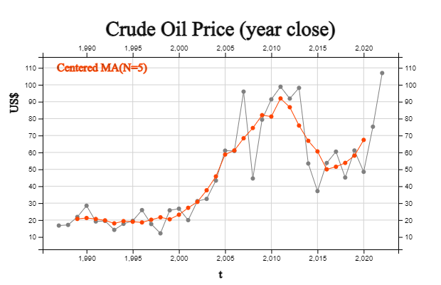
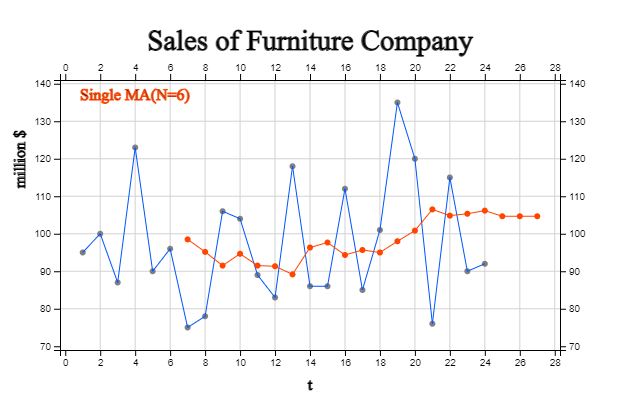
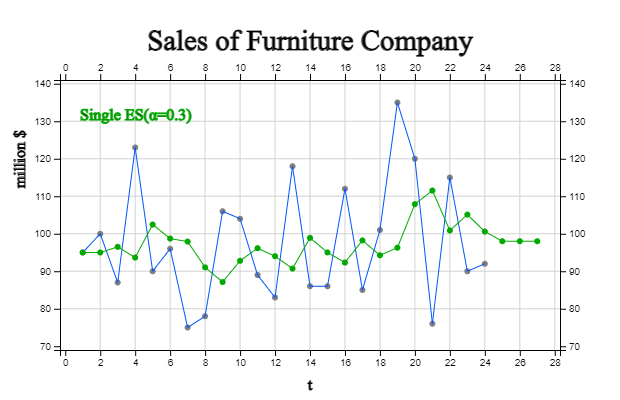
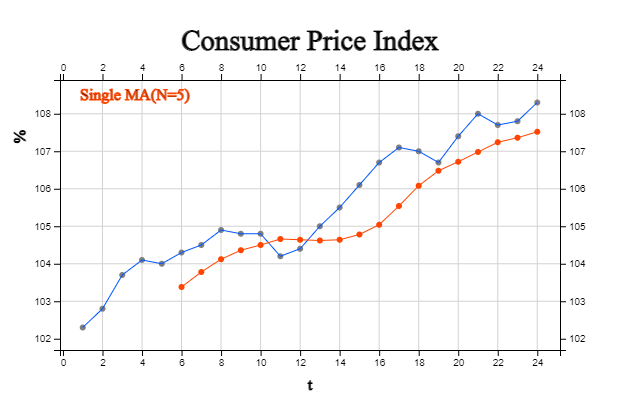
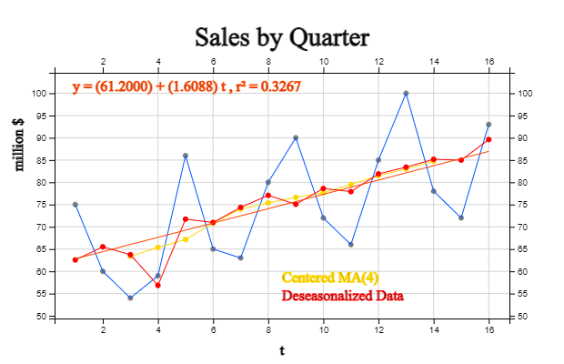

::: container-fluid
:::

::: {.col-sm-9 .col-sm-offset-3 .col-md-10 .col-md-offset-2 .main}
# Chapter 13. Time Series Analysis

       ❮   **Chapter 12**       

-   [13.1 What is Time Series Analysis?](../chapter13/1301.html)
-   [13.2 Smoothing of Time Series](../chapter13/1302.html)
-   [13.3 Transformation of Time Series](../chapter13/1303.html)
-   [13.4 Regression Model and Forecasting](../chapter13/1304.html)
-   [13.5 Exponential Smoothing Model and
    Forecasting](../chapter13/1305.html)
-   [13.6 Seasonal Model and Forecasting](../chapter13/1306.html)
-   [13.7 Exercise](../chapter13/1307.html)

##### [[\[book\]]{.underline}](book13.pdf){target="_blank"}   

## CHAPTER OBJECTIVES

In this chapter, we study data observed over time, time series, and
introduce about:.

\-\-- What is time series analysis and what are types of time series
models?\
\-\-- How to smooth a time series.\
\-\-- How to transform a time series.\
\-\-- Prediction method using regression model.\
\-\-- Prediction method using exponential smoothing model.\
\-\-- Prediction method for seasonal time series.

We will be mainly focused on descriptive methods and simple models, and
discussion of the Box-Jenkins model and other theoretical models will
not be discussed.

       ❮   **Chapter 12**       
:::
::: container-fluid
:::

::: {.col-sm-9 .col-sm-offset-3 .col-md-10 .col-md-offset-2 .main}
# Chapter 13. Time Series Analysis

             

## 13.1 What is Time Series Analysis?

::: mainTable
**Time series** refers to data recorded according to changes in time. In
general, observations are made at regular time intervals such as year,
season, month, or day, and this is called a **discrete time series**.
There may be time series that are continuously observed, but this book
will only deal with the analysis of discrete time series.

An example of a discrete time series is the population of Korea as shown
in \[Table 13.1.1\]. This data is from the census conducted every five
years in Korea from 1925 to 2020 (except for 1944 and 1949).

::: textLeft
\[Table 13.1.1\] Population of Korea
:::

  -----------------------------------------------------------------------
  Year                                Population
  ----------------------------------- -----------------------------------
  1925\                               19020030\
  1930\                               20438108\
  1935\                               22208102\
  1940\                               23547465\
  1944\                               25120174\
  1949\                               20166756\
  1955\                               21502386\
  1960\                               24989241\
  1966\                               29159640\
  1970\                               31435252\
  1975\                               34678972\
  1980\                               37406815\
  1985\                               40419652\
  1990\                               43390374\
  1995\                               44553710\
  2000\                               45985289\
  2005\                               47041434\
  2010\                               47990761\
  2015\                               51069375\
  2020\                               51829136\

  -----------------------------------------------------------------------

As shown in the table above, it is not easy to understand the overall
shape of the time series displayed in numbers. The first step in time
series analysis is to observe the time series by drawing a time series
plot with the X axis as time and the Y axis as time series values. For
example, the time series plot of the total population in Korea is shown
in \<Figure 13.1.1\>.

+-----------------------------------------------------------------------+
| {.imgFig600400}                           |
|                                                                       |
| ::: figText                                                           |
| \<Figure 13.1.1\>Time Series of Korea Population                      |
| :::                                                                   |
+-----------------------------------------------------------------------+

Observing this figure, Korea\'s population has an overall increasing
trend, but the population decreased sharply in 1944-1949 due to World
War II. It can be seen that the population expanded rapidly after the
Korean war in 1953 and slowed since 1990. It can be seen that the growth
has slowed further in the last 10 years. By observing the time series in
this way, trends, change points, and outliers can be observed, and it is
helpful in selecting an analysis model or method suitable for the data.

Time series that we frequently encounter include monthly sales of
department stores and companies, daily composite stock index, annual
crop production, yearly export and import time series, and yearly
national income and economic growth rate, and so on.

\[Table 13.1.2\] shows the percent increase in monthly sales of the US
toy/game industry for the past 6 years, and \<Figure 13.1.2\> is a plot
of this time series. As it is the rate of change from the previous
month, it can be observed that it is seasonal data showing a large
increase in November and December every year, moving up and down based
on 0. However, May 2020 is an extreme with an increase rate of 211%
unlike other years. For time series, you can better examine the
characteristics of the data by converting the raw time series into the
rate of change.

::: textLeft
\[Table 13.1.2\] Percent Increase, Monthly Sales of Toy/Game in US(%)
(Source: Bureau of Census, US)
:::

  -----------------------------------------------------------------------
  Year.month                          Percent Increase
  ----------------------------------- -----------------------------------
  2016.01\                            -66.7\
  2016.02\                            2.5\
  2016.03\                            12.5\
  2016.04\                            -9.0\
  2016.05\                            -0.6\
  2016.06\                            -4.4\
  2016.07\                            4.3\
  2016.08\                            0.0\
  2016.09\                            6.1\
  2016.10\                            8.6\
  2016.11\                            56.4\
  2016.12\                            53.6\
  2017.01\                            -65.6\
  2017.02\                            -0.1\
  2017.03\                            14.7\
  2017.04\                            -5.7\
  2017.05\                            -2.4\
  2017.06\                            -5.5\
  2017.07\                            1.3\
  2017.08\                            4.2\
  2017.09\                            8.4\
  2017.10\                            7.2\
  2017.11\                            54.9\
  2017.12\                            45.5\
  2018.01\                            -63.6\
  2018.02\                            3.6\
  2018.03\                            39.8\
  2018.04\                            -21.0\
  2018.05\                            5.9\
  2018.06\                            -12.4\
  2018.07\                            -16.9\
  2018.08\                            5.2\
  2018.09\                            7.5\
  2018.10\                            8.5\
  2018.11\                            54.9\
  2018.12\                            5.8\
  2019.01\                            -46.2\
  2019.02\                            -3.8\
  2019.03\                            16.3\
  2019.04\                            -8.4\
  2019.05\                            6.6\
  2019.06\                            -5.3\
  2019.07\                            0.8\
  2019.08\                            7.7\
  2019.09\                            -1.2\
  2019.10\                            12.2\
  2019.11\                            46.7\
  2019.12\                            11.7\
  2020.01\                            -49.1\
  2020.02\                            2.2\
  2020.03\                            -28.2\
  2020.04\                            -58.2\
  2020.05\                            211.1\
  2020.06\                            26.8\
  2020.07\                            -0.8\
  2020.08\                            7.0\
  2020.09\                            4.9\
  2020.10\                            5.8\
  2020.11\                            44.1\
  2020.12\                            8.5\
  2021.01\                            -37.1\
  2021.02\                            -12.2\
  2021.03\                            37.0\
  2021.04\                            -10.3\
  2021.05\                            -0.5\
  2021.06\                            -2.0\
  2021.07\                            4.6\
  2021.08\                            1.8\
  2021.09\                            5.2\
  2021.10\                            6.4\
  2021.11\                            40.0\
  2021.12\                            10.6\

  -----------------------------------------------------------------------

+-----------------------------------------------------------------------+
| {.imgFig600400}                           |
|                                                                       |
| ::: figText                                                           |
| \<Figure 13.1.2\>Percent Increase, Monthly Sales of Toy/Game in US(%) |
| :::                                                                   |
+-----------------------------------------------------------------------+

Most time series have four components: trend, seasonal, cycle, and other
irregular factors. **Trend** is a case in which a time series has a
certain trend, such as a line or a curved shape as time elapses, and
there are various types of trends. Trends can be understood as a
consumption behavior, population variations, and inflation that appear
in time series over a long period of time. **Seasonal** factors are
short-term and regular fluctuation factors that exist quarterly,
monthly, or by day of the week. Time series such as monthly rainfall,
average temperature, and ice cream sales have seasonal factors. Seasonal
factors generally have a short cycle, but fluctuations when the cycle
occurs over a long period of time rather than due to the season is
called a **cycle** factor. By observing these cyclical factors, it is
possible to predict the boom or recession of a periodic economy.
\<Figure 13.1.3\> shows the US S&P 500 Index from 1997 to 2016, and a
six-year cycle can be observed.

+-----------------------------------------------------------------------+
| {.imgFig600400}                           |
|                                                                       |
| ::: figText                                                           |
| \<Figure 13.1.3\>\] US S&P500 Index (1997- 2016)                      |
| :::                                                                   |
+-----------------------------------------------------------------------+

Other factors that cannot be explained by trend, season, or cyclical
factors are called **irregular** or **random** factors, which refer to
variable factors that appear due to random causes regardless of regular
movement over time.
:::

### 13.1.1 Time Series Model

By observing the time series, you can predict how this time series will
change in the future by building a time series model that fits the
probabilistic characteristics of this data. Because the time series
observed in reality has a very diverse form, the time series model is
also very diverse, from simple to very complex. In general, time series
models for a single variable can be divided into the following four
categories.

##### A. Regression Model

A model that explains data or predicts the future by expressing a time
series in the form of a function related to time is the most intuitive
and easy to understand model. That is, when a time series is an
observation of a random variable, $Y_1 , Y_2 , ... , Y_n$, it is
expressed as the following model: $$
      Y_t \;=\; f(t) \;+\; \epsilon _ t , \,\, t=1,2, ... , n
      $$ Here $\epsilon_t$ is the error of the time series that cannot
be explained by a function $f(t)$. In general $\epsilon_t$ is assumed
independent, $E(\epsilon_t ) = 0$ , and $Var(\epsilon_t ) = \sigma^2)$
which is called a white noise. For example, the following model can be
applied to a time series in which the data is horizontal or has a linear
trend.

$\qquad \text{Horizontal:} \qquad Y_t \;=\; \mu \;+\; \epsilon _ t$\
$\qquad \text{Linear Trend:}\quad Y_t \;=\; a \;+\; b\, t \;+\; \epsilon _ t$

##### B. Decomposition Model

The model that decomposes the time series into four factors, i.e.,
trend($T_t$), cycle($C_t$), seasonal($S_t$), and irregular($I_t$), is an
analysis method that has been used for a long time based on empirical
facts. It can be divided into additive model and multiplicative model.

$\qquad \text{Additive Model:} \qquad \qquad Y_t \;=\; T_t \;+\; C_t \;+\; S_t \;+\; I_t$\
$\qquad \text{Multiplicative Model:}\qquad Y_t \;=\; T_t \;\times\; C_t \;\times\; S_t \;\times \; I_t$

Here $T_t$, $C_t$, $S_t$ are deterministic function, $I_t$ is a random
variable. If we take the logarithm of a multiplicative model, it becomes
an additive model. If the number of data is not enough, the cycle factor
can be omitted in the model.

##### C. Exponential Smoothing Model

Time series data are often more related to recent data than to past
data. The above two types of models are models that do not take into
account the relationship between the past time series data and the
recent time series data. Models using moving averages and exponential
smoothing are often used to explain and predict data using the fact that
time series forecasting is more related to recent data.

##### D. Box-Jenkins ARIMA Model

The above models are not methods that can be applied to all types of
time series, and the analyst selects and applies them according to the
type of data. Box and Jenkins presented the following general ARIMA
model that can be applied to all time series of stationary or
nonstationary type as follows: $$
      Y _{t} \,=\, \mu \,+\,  \phi_{1} \, Y  _{t-1} \,+\, \phi  _{2} \, Y_{t-2} \,+\, \cdots \,+\,  \epsilon  _{t} \,+\, \theta  _{1} \, \epsilon  _{t-1} \,+\, \theta  _{2} \, \epsilon  _{t-2} \,+\, \cdots   
    $$ The ARIMA model considers the observed time series as a sample
extracted from a population time series, studies the probabilistic
properties of each model, and establishes an appropriate time series
model through parameter estimation and testing. For the ARIMA model,
autocorrelation coefficients between time lags are used to identify a
model. The ARIMA model is beyond the scope of this book, so interested
readers are encouraged to consult the bibliography.

In the above time series model, the regression model and ARIMA model are
systematic models based on statistical theory, and the decomposition
model and exponential smoothing model are methods based on experience
and intuition. In general, regression models using mathematical
functions and models using decomposition are known to be suitable for
predicting slow-changing time series, whereas exponential smoothing and
ARIMA models are known to be effective in predicting very rapidly
changing time series.

For all time series models, it is impossible to predict due to sudden
changes. And because time series has so many different forms, it cannot
be said that one time series model is always superior to another.
Therefore, rather than applying only one model to a time series, it is
necessary to establish and compare several models, combine different
models, or make an effort to determine the final model by combining
opinions of experts familiar with the time series.

### 13.1.2 Evaluation of Time Series Model

Let the time series be the observed values of the random variables
$Y_1 , Y_2 , ... , Y_n$ and $\hat Y_1 , \hat Y_2 , ... , \hat Y_n$ be
the values predicted by the model. If the model agrees exactly, the
observed and predicted values are the same, and the model error
$\epsilon_t$ is zero. In general, it is assumed that the error
$\epsilon_t$'s of the time series model are independent random variables
which follow the same normal distribution with a mean of 0 and a
variance of $\sigma^2$. The accuracy of a time series model can be
evaluated using residual, $Y_t \,-\, {\hat Y}_t$, which is a measure by
subtracting the predicted value from the observed value. In general, the
following mean squared error (MSE) is commonly used for the accuracy of
a model and the smaller the MSE value, the more appropriate the
predicted model is judged. $$
      {MSE} \,=\, \frac{ \sum_{t=1}^n \, ( Y_t\,-{\hat Y}_t \,)^{2}  } {n}     
    $$ The mean square error is used as an estimator for the variance
$\sigma^2$ of the error $\epsilon_t$. Since MSE can have a large value,
the root mean squared error (RMSE) is often used. $$
      {RMSE} \,=\, \sqrt{MSE  }     
    $$

             
:::
::: container-fluid
:::

::: {.col-sm-9 .col-sm-offset-3 .col-md-10 .col-md-offset-2 .main}
# Chapter 13. Time Series Analysis

             

## 13.2 Smoothing of Time Series

::: mainTable
Original time series data can be used to make a time series model by
observing trends, but in many cases, time series can be observed after
smoothing to unerstand better. In a time series such as stock price, it
is often difficult to find a trend because of temporary or short-term
fluctuations due to accidental coincidences or cyclical factors. In this
case, smoothing techniques are used as a method to effectively grasp the
overall long-term trend by removing temporary or short-term
fluctuations. The centered moving average method and the exponential
smoothing method are widely used.
:::

### 13.2.1 Centered Moving Average

::: mainTable
The time series in \[Table 13.2.1\] is the world crude oil price based
on the closing price every year from 1987 to 2022. Looking at \<Figure
13.2.1\>, it can be seen that the short-term fluctuations in the time
series are large. However, causes such as oil shocks are short-term and
not continuous, so if we are interested in the long-term trend of
gasoline consumption, it would be more effective to look at the
fluctuations caused by short-term causes.

::: textLeft
\[Table 13.2.1\] Price of Crude Oil (End of Year Price, US\$) and
5-point Centered Moving Average
:::

  -----------------------------------------------------------------------
  Year                    Price of Oil            5-point Centered Moving
                                                  Average
  ----------------------- ----------------------- -----------------------
  1987\                   16.74\                  \
  1988\                   17.12\                  \
  1989\                   21.84\                  20.666\
  1990\                   28.48\                  21.216\
  1991\                   19.15\                  20.630\
  1992\                   19.49\                  19.816\
  1993\                   14.19\                  18.028\
  1994\                   17.77\                  19.378\
  1995\                   19.54\                  19.010\
  1996\                   25.90\                  18.600\
  1997\                   17.65\                  20.198\
  1998\                   12.14\                  21.634\
  1999\                   25.76\                  20.446\
  2000\                   26.72\                  23.158\
  2001\                   19.96\                  27.232\
  2002\                   31.21\                  30.752\
  2003\                   32.51\                  37.620\
  2004\                   43.36\                  45.798\
  2005\                   61.06\                  58.746\
  2006\                   60.85\                  61.164\
  2007\                   95.95\                  68.370\
  2008\                   44.60\                  74.434\
  2009\                   79.39\                  82.030\
  2010\                   91.38\                  81.206\
  2011\                   98.83\                  91.920\
  2012\                   91.83\                  86.732\
  2013\                   98.17\                  75.882\
  2014\                   53.45\                  66.866\
  2015\                   37.13\                  60.592\
  2016\                   53.75\                  49.988\
  2017\                   60.46\                  51.526\
  2018\                   45.15\                  53.804\
  2019\                   61.14\                  58.096\
  2020\                   48.52\                  67.394\
  2021\                   75.21\                  \
  2022\                   106.95\                 \

  -----------------------------------------------------------------------

<input class="qrBtn" onclick="window.open(addrStr[134])" src="QR/eStatU330_TimeseriesSmoothing.svg" type="image"/>

{.imgFig600400}

::: figText
\<Figure 13.2.1\> Price of Crude Oil and 5-point Moving Average
:::

The N-point **centered moving average** of a time series refers to the
average of N data from a single point in time. For example, in crude oil
price data, the value of the five-point moving average for a specific
year is the average of the data for two years before the specific year,
that year, and the data for the next two years. Expressed as an
expression, if $M_t$ is a moving average in time $t$, the 5-point
centered moving average is as follows: $$
        M_t = \frac{Y_{t-2} \,+\, Y_{t-1} \,+\, Y_{t} \,+\, Y_{t+1} \,+\,  Y_{t+2} } {5 }   
      $$ For example, the 5-point centered moving average for 1989 is as
follows.

$\qquad M_{1989} \,=\, \frac {Y_{1987} + Y_{1988} +Y_{1989} + Y_{1990} + Y_{1991} } {5 }$\
$\qquad \qquad \quad =\, \frac {16.74 + 17.12 + 21.84 + 28.48 + 19.15} {5} \,=\, 20.6660$

\[Table 13.2.2\] shows the values ​​of all 5-points centered moving
averages obtained in this way and \<Figure 13.2.1\> is the graph of
5-points moving average. Note that the moving averages for the first two
years and the last two years cannot be obtained here. It can be seen
that the graph of the moving average is better for grasping the
long-term trend than the graph of the original data because short-term
fluctuations are removed.

The choice of a value N for the N-point moving average is important. A
large value of N will provide a smoother moving average, but it has the
disadvantage of losing more points at both ends and insensitive to
detecting important trend changes. On the other hand, if you choose
small N, you will lose less data at both ends, but you may not be able
to get the smoothing effect because you will not sufficiently eliminate
short-term fluctuations. In general, try a few values N​​ to reflect
important changes that should not be missed, while achieving a smoothing
effect and balancing the points not to lose too much at both ends.

If the value of N is an even number, there is a difficulty in obtaining
a central moving average with the same number of data on both sides of
the base year. For example, the center of the four-point moving average
from 1987 to 1990 is between 1988 and 1989. If you denote this as
$M_{1988.5}$, it can be calculated as follows:

$\qquad M_{1988.5} \,=\, \frac {Y_{1987} + Y_{1988} +Y_{1989} + Y_{1990} } {4 }$\
$\qquad \qquad \quad \,=\, \frac {16.74 + 17.12 + 21.84 + 28.48 } {4} \,=\, 21.045$

The 4-point moving average obtained in this way is called a non-central
4-points moving average. In the case of this even number N, the
non-central moving average does not match the observation year of the
original data, which is inconvenient. In the case of this even number N,
it is calculated as the average of the noncentral moving average values
of two adjacent non-central moving averages. In other words, the central
four-point moving average in 1989 is the average of $M_{1988.5}$ and
$M_{1989.5}$ as follows:

$\qquad M_{1989} \,=\, \frac {M_{1988.5} \,+\, M_{1989.5} } {2 }$\
$\qquad \qquad \quad =\, \frac {21.0450 \,+\, 21.6475 } {2} \,=\, 21.3463$

If the time series is quarterly or monthly, a 4-point central moving
average or a 12-point central moving average is an average of one year,
so it is often used to observe data without seasonality.
:::

### 13.2.2 Exponential Smoothing

::: mainTable
3-point moving average can be considered the weighted average of three
data with each weight $\frac{1}{3}$ as follows: $$
        M_t \,=\, \frac{Y_{t-1} \,+\, Y_{t} \,+\, Y_{t+1} } {3 } \,=\, \frac{1}{3}Y_{t-1} \,+\, \frac{1}{3}Y_{t} \,+\, \frac{1}{3}Y_{t+1}
      $$ When the weights are $w_1 , w_2 , ... , w_n$, the weighted
moving average $M_t$ of the time series is defined as follows: $$
        M_t \,=\, \sum_{i=1}^{n} w_i Y_{i}
      $$ where $n$ is the number of data, $w_i \ge 0$ and
$\sum_{i=1}^{n} w_i = 1$.

Various weighted averages with different weights can be used depending
on the purpose. Among them, a smoothing method that gives more weight to
data closer to the present and smaller weights as it is farther from the
present is called **exponential smoothing**. The exponential smoothing
method is determined by an **exponential smoothing constant** $\alpha$
that has a value between 0 and 1. The exponentially smoothed data $E_t$
is calculated as follows:

$\qquad E_{1} \,=\, \alpha \,Y_{1} \,+\, (1- \alpha)\, E_{0}$\
$\qquad E_{2} \,=\, \alpha \,Y_{2} \,+\, (1- \alpha)\, E_{1}$\
$\qquad E_{3} \,=\, \alpha \,Y_{3} \,+\, (1- \alpha)\, E_{2}$\
$\qquad \cdots$\
$\qquad E_{t} \,=\, \alpha \,Y_{t} \,+\, (1- \alpha)\, E_{t}$\

Here, an initial value $E_{0}$ is required, and $Y_1$ is usually used a
lot, and the average value of the data can also be used. The
exponentially smoothed value $E_t$ at the point in time $t$ gives weight
$\alpha$ to the current data, and the $1-\alpha$ weight to the previous
smoothed data is given. The exponentially smoothed value $E_t$ can be
represented with the original data $Y_t$ as follows: $$
        E_t \,=\, \alpha Y_t + (1-\alpha) Y_{t-1} + \alpha(1-\alpha)^2 Y_{t-2} + \cdots + \alpha(1-\alpha)^{t-2} Y_2 + (1-\alpha)^{t-1} Y_1    
      $$ Therefore, the exponential smoothing method uses all data from
the present and the past, but gives the current data the highest weight
α, and gives a lower weight as the distance from the present time
increases.

Exponential smoothing of the crude oil price in \[Table 13.2.1\] with
the initial value $E _{1986} = Y _{1987}$ and exponential smoothing
constant $\alpha$ = 0.3 is as follows.

$\qquad E_{1986} \,=\, E_{1987} = 16.74$\
$\qquad E_{1987} \,=\, 0.3 \,Y_{1987} \,+\, (1- 0.3)\, E_{1986} \,=\, (0.3)(16.74)+(0.7)(16.74)=16.74$\
$\qquad E_{1988} \,=\, 0.3 \,Y_{1988} \,+\, (1- 0.3)\, E_{1987} \,=\, (0.3)(17.12)+(0.7)(16.74)=16.854$\

All data exponentially smoothed with $\alpha$ = 0.3 are given in \[Table
13.2.2\]. It can be seen that, in the exponential smoothing method,
there is no loss of data at both ends, unlike the moving average method.
The crude oil price time series and exponentially smoothed data are
shown in \<Figure 13.2.2\>. It can be seen that the smoothed data are
not significantly different from the original data. If the value
of$\alpha$ is small, more weight is given to the past data than to the
present, making it less sensitive to sudden changes in the present data.
Conversely, the closer the value of $\alpha$ is to 1, that is, the more
weight is given to the current data, the more the smoothed data
resembles the original data, and the smoothing effect disappears.

::: textLeft
\[Table 13.2.2\] Price of Crude Oil and Exponential Smoothing with α
=0.3
:::

  -----------------------------------------------------------------------
  Year                    Price of Oil            Exponential Smoothing\
                                                  α=0.3
  ----------------------- ----------------------- -----------------------
  1987\                   16.74\                  16.740\
  1988\                   17.12\                  16.854\
  1989\                   21.84\                  18.350\
  1990\                   28.48\                  21.389\
  1991\                   19.15\                  20.717\
  1992\                   19.49\                  20.349\
  1993\                   14.19\                  18.501\
  1994\                   17.77\                  18.282\
  1995\                   19.54\                  18.659\
  1996\                   25.90\                  20.832\
  1997\                   17.65\                  19.877\
  1998\                   12.14\                  17.556\
  1999\                   25.76\                  20.017\
  2000\                   26.72\                  22.028\
  2001\                   19.96\                  21.408\
  2002\                   31.21\                  24.348\
  2003\                   32.51\                  26.797\
  2004\                   43.36\                  31.766\
  2005\                   61.06\                  40.554\
  2006\                   60.85\                  46.643\
  2007\                   95.95\                  61.435\
  2008\                   44.60\                  56.385\
  2009\                   79.39\                  63.286\
  2010\                   91.38\                  71.714\
  2011\                   98.83\                  79.849\
  2012\                   91.83\                  83.443\
  2013\                   98.17\                  87.861\
  2014\                   53.45\                  77.538\
  2015\                   37.13\                  65.416\
  2016\                   53.75\                  61.916\
  2017\                   60.46\                  61.479\
  2018\                   45.15\                  56.580\
  2019\                   61.14\                  57.948\
  2020\                   48.52\                  55.120\
  2021\                   75.21\                  61.146\
  2022\                   106.95\                 74.888\

  -----------------------------------------------------------------------

<input class="qrBtn" onclick="window.open(addrStr[134])" src="QR/eStatU330_TimeseriesSmoothing.svg" type="image"/>

{.imgFig600400}

::: figText
\<Figure 13.2.2\> Price of Crude Oil and Exponential Smoothing with
α=0.3
:::

:::

### 13.2.3 Filtering by Moving Median

::: mainTable
The N-point **centered moving median** of a time series refers to the
median of N data from a single point in time $t$. For example, in crude
oil price data, the value of a five-point moving median for a specific
year is the median of data for two years before a certain year, that
year, and data for two years thereafter. If data are denoted by
$Y_{t-2} ,Y_{t-1} , Y_{t} , Y_{t+1} , Y_{t+2}$, and the data are sorted
from smallest to largest, and expressed as
$Y_{(t-2)} ,Y_{(t-1)} , Y_{(t)} , Y_{(t+1)} , Y_{(t+2)}$, the median
value is $Moving Median_t \,=\, Y_{(t)}$.

For example, the 1989 5-point central moving median for crude oil prices
in \[Table 13.2.3\] is as follows:

$\qquad MovingMedian_{1989} \,=\, median \{ Y_{1987} , Y_{1988} ,Y_{1989} , Y_{1990} , Y_{1991} \}$
$\qquad \qquad \qquad \qquad \qquad \;\;=\, median \{16.74, 17.12 , 21.84 , 28.48,19.15 \} \,=\, 19.15$

\[Table 13.2.3\] and \<Figure 13.2.3\> show all the five-point moving
median values obtained in this way and their graphs. Note that the
moving median for the first two years and the last two years are not
available here. Because the centered moving medians remove extreme
values, it is called a filtering and the time series is much smoother
than the original data.

::: textLeft
\[Table 13.2.3\] Price of Crude Oil and 5-point Centered Moving Median
:::

  -----------------------------------------------------------------------
  Year                    Price of Oil            5-point Centered Moving
                                                  Median
  ----------------------- ----------------------- -----------------------
  1987\                   16.74\                  \
  1988\                   17.12\                  \
  1989\                   21.84\                  19.15\
  1990\                   28.48\                  19.49\
  1991\                   19.15\                  19.49\
  1992\                   19.49\                  19.15\
  1993\                   14.19\                  19.15\
  1994\                   17.77\                  19.49\
  1995\                   19.54\                  17.77\
  1996\                   25.90\                  17.77\
  1997\                   17.65\                  19.54\
  1998\                   12.14\                  25.76\
  1999\                   25.76\                  19.96\
  2000\                   26.72\                  25.76\
  2001\                   19.96\                  26.72\
  2002\                   31.21\                  31.21\
  2003\                   32.51\                  32.51\
  2004\                   43.36\                  43.36\
  2005\                   61.06\                  60.85\
  2006\                   60.85\                  60.85\
  2007\                   95.95\                  61.06\
  2008\                   44.60\                  79.39\
  2009\                   79.39\                  91.38\
  2010\                   91.38\                  91.38\
  2011\                   98.83\                  91.83\
  2012\                   91.83\                  91.83\
  2013\                   98.17\                  91.83\
  2014\                   53.45\                  53.75\
  2015\                   37.13\                  53.75\
  2016\                   53.75\                  53.45\
  2017\                   60.46\                  53.75\
  2018\                   45.15\                  53.75\
  2019\                   61.14\                  60.46\
  2020\                   48.52\                  61.14\
  2021\                   75.21\                  \
  2022\                   106.95\                 \

  -----------------------------------------------------------------------

<input class="qrBtn" onclick="window.open(addrStr[134])" src="QR/eStatU330_TimeseriesSmoothing.svg" type="image"/>

{.imgFig600400}

::: figText
\<Figure 13.2.3\> Price of Crude Oil and 5-point Centered Moving Median
:::

If the value of N is an even number, there is a difficulty in obtaining
the central moving median having the same number of data on both sides
of the base year. For example, the center of the four-point moving
median from 1987 to 1990 is between 1988 and 1989. If you denote this as
$Median_{1988.5}$, it can be calculated as follows:

$\qquad MovingMedian_{1988.5} \,=\, median \{Y_{1987} , Y_{1988} , Y_{1989} , Y_{1990} \}$
$\qquad \qquad \qquad \qquad \qquad \;=\, median \{16.74 , 17.12 , 21.84 , 28.48 \} \,=\, \frac {17.12 +21.84} {2} = 19.48$

The 4-point moving median obtained in this way is called the non-central
4-point moving median. As such, the non-central moving average in the
case of this even number N does not match the observation year of the
original data, which is inconvenient. In the case of this even number,
it is calculated as the average of the values of the two non-central
moving medians that are adjacent to each other. In other words, the
central four-point moving median in 1989 is the mean of
$MovingMedian_{1988.5}$ and $MovingMedian_{1989.5}$.
:::

             
:::
::: container-fluid
:::

::: {.col-sm-9 .col-sm-offset-3 .col-md-10 .col-md-offset-2 .main}
# Chapter 13. Time Series Analysis

             

## 13.3 Transformation of Time Series

::: mainTable
Time series can be viewed by drawing the raw data directly, but in order
to examine various characteristics, change in percentage increase or
decrease is examined, and an index that is a percentage with respect to
base time is alse examined. In addition, in order to examine the
relation of the previous data, it is compared with a time lag or
converted into horizontal data using the difference. When the variance
of the time series increases with time, it is sometimes converted into a
form suitable for applying the time series model by using logarithmic,
square root, or Box-Cox transformation.
:::

### 13.3.1 Percentage Change

::: mainTable
##### A. Percent Change

In a time series, you can examine the increase or decrease of a value,
but you can easily observe the change by calculating the percentage
increase or decrease. When the time series is expressed as
$Y_1 , Y_2 , ... , Y_n$ , the percentage increase or decrease $P_t$
compared to the previous data is as follows. $$
          P_{t} \,=\, \frac {Y _{t} - Y_{t-1}} {Y_{t-1}} \times 100 , \quad t=2,3, ... , n
      $$ \[Table 13.3.1\] shows the number of houses in Korea from 2010
to 2020, and \<Figure 13.3.1\> shows the percentage increase or decrease
compared to the previous data. Looking at this rate of change, it can be
easily observed that the original time series has an overall increasing
trend, but the rate of change of the previous year has many changes. In
other words, it can be observed that there was a 2.23% increase in the
number of houses in 2014 compared to the previous year, and a 2.48%
increase in the number of houses in 2018 as well.

$\qquad P_{2014} \,=\, \frac{19161.2 - 18742.1} {18742.1} \times 100 \,=\, 2.23$

::: textLeft
\[Table 13.3.1\] Number of Houses in Korea and Percent Change\
(Korea National Statistical Office, unit 1000)
:::

  -----------------------------------------------------------------------
  Year                    Number of Houses        \% change
  ----------------------- ----------------------- -----------------------
  2010\                   17738.8\                \
  2011\                   18082.1\                1.93\
  2012\                   18414.4\                1.83\
  2013\                   18742.1\                1.77\
  2014\                   19161.2\                2.23\
  2015\                   19559.1\                2.07\
  2016\                   19877.1\                1.62\
  2017\                   20313.4\                2.19\
  2018\                   20818.0\                2.48\
  2019\                   21310.1\                2.36\
  2020\                   21673.5\                1.70\

  -----------------------------------------------------------------------

<input class="qrBtn" onclick="window.open(addrStr[135])" src="QR/eStatU340_TimeseriesTransformation.svg" type="image"/>

{.imgFig600400}

::: figText
\<Figure 13.3.1\> Number of Houses in Korea and Percent Change
:::

:::

### B. Simple Index

::: mainTable
Another way to use percentages to easily characterize changes over time
is to calculate an index number. An **index** $I_t$ is a number that
indicates the change over time of a time series. The index number
$Index_t$ of a time series at a certain point in time is the percentage
of the total time series data for a predetermined time point $t_0$
called the base period. $$
         Index_{t} \,=\, \frac {Y _{t}} {Y_{t_0}} \times 100  , \quad t=1,2,..., n
       $$ The most commonly used indices in the economic field are the
price index and the quantity index. For example, the consumer price
index is a price index indicating the price change of a set of goods
that can reflect the total consumer price, and the index indicating the
change in total electricity consumption every year is the quantity
index. There are several methods of calculating the index, which are
broadly divided into simple index number when the number of items
represented by the index is one, and composite index number when there
are several as in the consumer price index.

\[Table 13.3.2\] is a simple index for the number of houses in Korea
from 2010 to 2020, with the base time being 2010. If you look at the
figure for the index, you can see that in this case, there is no
significant change from the original time series and trend. It can be
seen that there is a 22.18% increase in the number of houses in 2020
compared to 2010.

$\qquad Index_{2020} \,=\, \frac{Y _{2020}} {Y_{2010}} \times 100 \,=\, \frac{21673.5} {17738.8} \times 100 \,=\, 122.18$

::: textLeft
\[Table 13.3.2\] Simple Index of Number of Houses in Korea\
(Korea National Statistical Office, unit 1000)
:::

  -----------------------------------------------------------------------
  Year                    Number of Houses        Simple Index\
                                                  Base: 2010
  ----------------------- ----------------------- -----------------------
  2010\                   17738.8\                100.00\
  2011\                   18082.1\                101.94\
  2012\                   18414.4\                103.81\
  2013\                   18742.1\                105.66\
  2014\                   19161.2\                108.02\
  2015\                   19559.1\                110.26\
  2016\                   19877.1\                112.05\
  2017\                   20313.4\                114.51\
  2018\                   20818.0\                117.36\
  2019\                   21310.1\                120.13\
  2020\                   21673.5\                122.18

  -----------------------------------------------------------------------

<input class="qrBtn" onclick="window.open(addrStr[135])" src="QR/eStatU340_TimeseriesTransformation.svg" type="image"/>

{.imgFig600400}

::: figText
\<Figure 13.3.2\> Simple Index of Number of Houses in Korea
:::

:::

### C. Composite Index

::: mainTable
**Composite index** is a method in which the change in price or quantity
of several goods is set at a specific time point as the base period, and
then the data at each time point is calculated as a percentage value
compared to the base period. An example of the most used composite index
is the consumer price index, which reflects price fluctuations of about
500 products in Korea that affect consumer prices. Other commonly used
composite indices include the comprehensive stock index, which examines
the price fluctuations of all listed stocks traded in the stock market.

For the composite index, a weighted composite index that is calculated
by weighting the price of each product with the quantity consumed is
often used. When calculating such a weighted composite index, the case
where the quantity consumption at the base time is used as a weight is
called the **Laspeyres method**, and the case where the quantity
consumption at the current time is used as the weight is called the
**Paasche method**. In general, the Laspeyres method of weighted
composite index is widely used, and the consumer price index is a
representative example. The price index of the Paasche method is used
when the consumption of goods used as weights varies greatly over time,
and can be used only when the consumption at each time point is known.
It is expensive to examine the quantity consumption at each point in
time.

Assuming that $P_{1t} , \cdots , P_{kt}$ are the prices of $k$ number of
products at the time point $t$, and $Q_{1t_0} , \cdots , Q_{kt_0}$ are
the quantities of each product consumpted at the base time, the formula
for calculating each composite index is as follows:

$\qquad \text{Laspeyres Index:} \quad Index_t \,=\, \frac { Q_{1t_0} P_{1t} + \cdots + Q_{kt_0} P_{kt} } {Q_{1t_0} P_{1t_0}+ \cdots + Q_{kt_0} P_{kt_0} } \times 100$\
$\qquad \text{Paasche Index:} \qquad Index_t \,=\, \frac { Q_{1t} P_{1t} + \cdots + Q_{kt} P_{kt} } {Q_{1t} P_{1t_0} + \cdots + Q_{kt} P_{kt_0} } \times 100$

The data in \[Table 13.3.3\] shows the price and quantity of three
metals by month in 2020.

::: textLeft
\[Table 13.3.3\] Composite Index of three Metal Prices(\$/ton) and
Production Quantity(ton)
:::

  --------------------------------------------------------------------------
  \              Copper\        Metal\         Lead\          \
  Month          Price          Price          Price          Laspeyres
                 Quantity       Quantity       Quantity       Paasche
  -------------- -------------- -------------- -------------- --------------
  1\             1361.6         213    4311\   530.0    46.1\ 100.00   
  2\             100.7\         213    4497\   520.0    47.0\ 100.00\
  3\             1399.0         213    5083\   529.0    51.0\ 100.31   
  4\             95.1\          213    5077\   540.0    23.0\ 100.28\
  5\             1483.6         213    5166\   531.0    26.5\ 101.13   
  6\             104.0\         213    4565\   580.0    13.5\ 101.01\
  7\             1531.6         213    4329\   642.8    27.4\ 101.63   
  8\             95.6\          213    4057\   602.6    25.8\ 101.35\
  9\             1431.2         213    3473\   513.6    20.5\ 100.65   
  10\            103.3\         213    3739\   480.8    24.6\ 100.57\
  11\            1383.8         213    3817\   528.4    21.5\ 100.42   
  12\            106.9\         213    3694\   462.2    27.9\ 100.27\
                 1326.8                                       100.16   
                 95.9\                                        99.98\
                 1328.8                                       100.00   
                 96.7\                                        99.87\
                 1307.8                                       99.43   
                 95.7\                                        99.38\
                 1278.4                                       99.01   
                 89.1\                                        99.07\
                 1354.2                                       99.92   
                 100.5\                                       99.92\
                 1305.2                                       99.18   
                 96.9\                                        99.21\

  --------------------------------------------------------------------------

In \[Table 13.3.3\], the Laspeyres index for the data for February with
January as the base time is as follows.

$\qquad Index_t \,=\, \frac { Q_{1t_0} P_{1t} + \cdots + Q_{kt_0} P_{kt} } {Q_{1t_0} P_{1t_0}+ \cdots + Q_{kt_0} P_{kt_0} } \times 100$\
$\qquad \quad \,=\, \frac {(100.7)(1399.0)+(4311)(213)+(46.1)(520) } {(100.7)(1361.6)+(4311)(213)+(47.0)(530) } \,=\, 100 .31$

Similarly, Paasche index is as follows:

$\qquad Index_t \,=\, \frac { Q_{1t} P_{1t} + \cdots + Q_{kt} P_{kt} } {Q_{1t} P_{1t_0} + \cdots + Q_{kt} P_{kt_0} } \times 100$\
$\qquad \quad \,=\, \frac {(95.1)(1399.0)+(4497)(213)+(47.0)(520) } {(95.1)(1361.6)+(4497)(213)+(47.0)(530) } \,=\, 100.28$

In \[Table 13.3.3\], it can be seen that the production quantity of iron
and lead in the last 4 quarters is significantly different from the
production quantity in January, which is the base time. In this way,
when the quantity fluctuates greatly and the quantity at each time is
known, the Pasche index can be said to be the best index because it
appropriately reflects the price change at that time.
:::

### 13.3.2 Time Lag and Difference

##### A. Time Lag

::: mainTable
In a time series, current data can usually be related to past data.
**Lag** means a transformation for comparing data of the present time
and observation values ​​at one time point or a certain past time point.
That is, when the observed time series is $Y_1 , Y_2 , ... , Y_n$, the
time series with lag 1 becomes $- , Y_1 , Y_2 , ... , Y_{n-1}$ . Note
that, in case of lag k, there are no data for the first $k$ number than
the original data.

The correlation coefficient between the time lag data and the raw data
is called the **autocorrelation coefficient**. If the average of time
series is $\small \overline Y$ , the k-lag autocorrelation $r_k$ is
defined as follows: $$ \small
        r_k =  \frac { \sum_{t = k+1}^ n (Y_t - \overline Y ) (Y_{t-k} - \overline Y ) }   { \sum _{t =1}^n (Y_t - \overline Y )^2 }, \quad k=0, 1, 2, ..., n-1
      $$ $r_1 , r_2 , ... , r_k$ are called an **autocorrelation
function** and are used to determine a time series model.

\[Table 13.3.4\] shows the monthly consumer price index for the past two
years and time lag 1 to 12 for this data, and the autocorrelation
coefficients are shown in \[Table 13.3.5\]. \<Figure 13.3.3\> shows the
original time series and the autocorrelation function.

::: textLeft
\[Table 13.3.4\] Monthly Consumer Price Index and Time Lag 1, Lag 2,
\... Lag 12
:::

  ------------------------------------------------------------------------------
  t          Year.Month   CPI        lag 1      lag 2      \...       lag 12
  ---------- ------------ ---------- ---------- ---------- ---------- ----------
  1\         2020.01\     102.3\     \          \          \          \
  2\         2020.02\     102.8\     102.3\     \          \          \
  3\         2020.03\     103.7\     102.8\     102.3\     \          \
  4\         2020.04\     104.1\     103.7\     102.8\     \          \
  5\         2020.05\     104.0\     104.1\     103.7\     \          \
  6\         2020.06\     104.3\     104.0\     104.1\     \          \
  7\         2020.07\     104.5\     104.3\     104.0\     \          \
  8\         2020.08\     104.9\     104.5\     104.3\     \          \
  9\         2020.09\     104.8\     104.9\     104.5\     \          \
  10\        2020.10\     104.8\     104.8\     104.9\     \          \
  11\        2020.11\     104.2\     104.8\     104.8\     \...\      \
  12\        2020.12\     104.4\     104.2\     104.8\     \          \
  13\        2021.01\     105.0\     104.4\     104.2\     \          102.3\
  14\        2021.02\     105.5\     105.0\     104.4\     \          102.8\
  15\        2021.03\     106.1\     105.5\     105.0\     \          103.7\
  16\        2021.04\     106.7\     106.1\     105.5\     \          104.1\
  17\        2021.05\     107.1\     106.7\     106.1\     \          104.0\
  18\        2021.06\     107.0\     107.1\     106.7\     \          104.3\
  19\        2021.07\     106.7\     107.0\     107.1\     \          104.5\
  20\        2021.08\     107.4\     106.7\     107.0\     \          104.9\
  21\        2021.09\     108.0\     107.4\     106.7\     \          104.8\
  22\        2021.10\     107.7\     108.0\     107.4\     \          104.8\
  23\        2021.11\     107.8\     107.7\     108.0\     \          104.2\
  24         2021.12      108.3      107.8      107.7      \          104.4

  ------------------------------------------------------------------------------

::: textLeft
\[Table 13.3.5\] Autocorrelation Function
:::

  -----------------------------------------------------------------------
  time                                autocorrelation
  ----------------------------------- -----------------------------------
  1\                                  0.8318\
  2\                                  0.6772\
  3\                                  0.5651\
  4\                                  0.4479\
  5\                                  0.3333\
  6\                                  0.2547\
  7\                                  0.1647\
  8\                                  0.0755\
  9\                                  -0.0143\
  10\                                 -0.0854\
  11\                                 -0.1737\

  -----------------------------------------------------------------------

<input class="qrBtn" onclick="window.open(addrStr[135])" src="QR/eStatU340_TimeseriesTransformation.svg" type="image"/>

{.imgFig600400}

::: figText
\<Figure 13.3.3\> Autocorrelation Function Graph
:::

:::

##### B. Differencing

::: mainTable
Since the price index in \[Table 13.3.4\] has a linear trend, a model
for this trend can be built, but in some cases, a model can be created
by changing the time series to a horizontal trend. The way to transform
a linear trend into a horizontal trend is to use a **differencing**.
When the time series is $Y_1 , Y_2 , ... , Y_n$, the first order
difference $▽ Y_t$ is as follows: $$
          ▽ Y_t \,=\, Y_t \,-\, Y_{t-1}, \quad t=2,3,...,n
      $$ If the raw data is a linear trend, the first-order differencing
of time series is a horizontal time series because it means a change in
slope. If we make differencing on the first-order difference $▽ Y_t$, it
becomes the second-order difference as follows: $$
          ▽^2 Y_t \,=\, ▽Y_t \,-\, ▽Y_{t-1} \,=\,  ( Y_t \,-\, Y_{t-1} ) - ( Y_{t-1} \,-\, Y_{t-2}), \quad t=3,4,...,n
      $$ If the raw data has a trend with a quadratic curve, the
second-order differencing of time series becomes a horizontal time
series.

\<Figure 13.3.4\> shows the first order differencing of \[Table 13.3.4\]
time series and it becomes horizontal series.

<input class="qrBtn" onclick="window.open(addrStr[135])" src="QR/eStatU340_TimeseriesTransformation.svg" type="image"/>

{.imgFig600400}

::: figText
\<Figure 13.3.4\> 1st Order Differencing of Consumer Price Index
:::

:::

### 13.3.3 Mathematical Transformation

::: mainTable
If the original data of the time series is used as it is, modeling may
not be easy or it may not satisfy various assumptions. In this case, we
can fit the model we want by performing an appropriate functional
transformation, such as log transformation. The functions commonly used
for mathematical transformations are as follows.

$\qquad \text{Log function } \qquad\qquad \qquad W = log(Y)$\
$\qquad \text{Square root function} \qquad\quad W = \sqrt(Y)$\
$\qquad \text{Square function } \qquad\quad \qquad W = Y^2$\
$\qquad \text{Box-Cox Transformation} \quad \; W = \frac {Y^p - 1 }{p}$
if p ≠ 0, else log(Y)

\[Table 13.3.6\] is a toy company\'s quarterly sales, and \<Figure
13.3.5\> is a diagram of this data. It is a seasonal data by quarter,
but, as time goes on, dispersion of sales increases over time. It is not
easy to apply a time series model to data with this increasing
dispersion over time. In this case, log transformation $W = log(Y)$ can
reduce the dispersion as time increases, as shown in \<Figure 13.3.5\>,
so that a model can be applied. After predicting by applying the model
to log-transformed data, exponential transformation $Y = exp(W)$ is
performed again to predict the raw data.

::: textLeft
\[Table 13.3.6\] Quarterly Sales of a Toy Company (unit million \$)
:::

  -----------------------------------------------------------------------
  time                    Year                    Sales
  ----------------------- ----------------------- -----------------------
  1\                      2017 Quarter 1\         38.0\
  2\                      2017 Quarter 2\         53.6\
  3\                      2017 Quarter 3\         57.5\
  4\                      2017 Quarter 4\         200.0\
  5\                      2018 Quarter 1\         56.5\
  6\                      2018 Quarter 2\         75.8\
  7\                      2018 Quarter 3\         78.3\
  8\                      2018 Quarter 4\         269.7\
  9\                      2019 Quarter 1\         70.2\
  10\                     2019 Quarter 2\         92.7\
  11\                     2019 Quarter 3\         101.8\
  12\                     2019 Quarter 4\         332.6\
  13\                     2020 Quarter 1\         97.3\
  14\                     2020 Quarter 2\         123.7\
  15\                     2020 Quarter 3\         132.9\
  16\                     2020 Quarter 4\         429.4\
  17\                     2021 Quarter 1\         138.3\
  18\                     2021 Quarter 2\         167.6\
  19\                     2021 Quarter 3\         189.9\
  20\                     2021 Quarter 4\         545.9\

  -----------------------------------------------------------------------

<input class="qrBtn" onclick="window.open(addrStr[135])" src="QR/eStatU340_TimeseriesTransformation.svg" type="image"/>

{.imgFig600400}

::: figText
\<Figure 13.3.5\> Log Transformation of Toy Sales
:::

The square root transform is used for a similar purpose to the log
transform, and the square transform can be used when the variance
decreases with time. The Box-Cox transform is a general transformation.
:::

             
:::
::: container-fluid
:::

::: {.col-sm-9 .col-sm-offset-3 .col-md-10 .col-md-offset-2 .main}
# Chapter 13. Time Series Analysis

             

## 13.4 Regression Model and Forecasting

::: mainTable
If there is a trend factor that shows a continuous increase or decrease
in the time series, the regression model learned in Chapter 12 can be
applied. For example, if the time series shows a linear trend, the
linear regression model is applied with the time series as the
observation values of the random variable $Y_1 , Y_2 , ... , Y_n$ and
time as 1, 2, \... , $n$ as follows. $$
        Y_t \,=\, \beta_0 \,+\, \beta_1 t \,+\, \epsilon_t
     $$ Here $\epsilon_t$ is ther error term with mean 0 and variance
$\sigma^2$. A characteristic of the linear model is that it increases by
a slope $\beta_1$ of a certain magnitude over time.

When the estimated regression coefficients are $\beta_0 , \beta_1$, the
validity test of the linear regression model is the same as the method
described in Chapter 12. The standard error of estimate and coefficient
of determination are often used. In a linear trend model, $\sigma$
represents the degree to which observations can be scattered around the
estimated regression line at each time point. As an estimate of this
$\sigma$, the following standard error is used. $$
       s \,=\, \sqrt { \frac{1} {n-2} \sum_{t=1}^n ( Y_t -  {\hat Y}_t )^2 }  
     $$ A smaller standard error $s$ value indicates that the observed
values are close to the estimated regression line, which means that the
regression line model is well fitted.

The coefficient of determination is the ratio of the regression sum of
squares, RSS, which is explained out of the total sum of squares, TSS.
$$
         R^2 \,=\, \frac{RSS}{TSS}
     $$ The value of the coefficient of determination is always between
0 and 1, and the closer the value is to 1, the more dense the samples
are around the regression line, which means that the estimated
regression equation explains the observations well.

As explained in Chapter 12, since it is difficult to determine the
absolute criteria for adequacy of the standard error or the coefficient
of determination, a hypothesis test is used to determine whether the
trend parameter $\beta_1$ is zero or not.

$\qquad \text{Hypothesis: } \qquad \,\, H_0 : \beta_1 = 0, H_1: \beta_1 \ne 0$\
$\qquad \text{Test statistic:} \qquad t_{obs} = \frac {{\hat \beta}_1 } { SE ({{\hat \beta}_1 }) }$
, Here,
$SE( \hat{ \beta_1} ) \,=\, \frac{ s} { \sqrt { \sum_{i=1}^ n (i - \overline t )^2 } }$\
$\qquad \text{Rejection region:} \quad If \,\; |t_{obs}| \,>\, t_{n-2,\alpha/2}, \,\,reject\,\, H_0$
with significance level $\alpha$\

If the null hypothesis $H_0$ is not rejected, the model cannot be
considered valid.

The assumption for error $\epsilon_t$ is tested using the residual,
which is the difference between the observed time series value and the
predicted value which is called residual analysis. Residual analysis
usually examines whether assumptions about error terms such as
independence and equal variance between errors are satisfied by drawing
a scatter plot of the residuals over time or a scatter plot of the
residuals and predicted values. In the scatterplots, if the residuals do
not show a specific trend around 0 and appear randomly, it means that
each assumption is valid. To examine the normality assumption of the
error term, draw a normal probability plot of the residuals, and if the
points on the figure show the shape of a straight line, it is judged
that the assumption of the normal distribution is appropriate.

If the linear regression model is suitable, the predicted value
${\hat Y}_{t_0} \,=\, {\hat \beta}_0 \,+\, {\hat \beta}_1 \cdot t_0$ at
the time point $t_0$ can be interpreted as a point estimate for the mean
of the random variable $Y_{t_0}$ at the time point, and the confidence
interval for the mean of ${\hat Y}_{t_0}$ at this time $t_0$ is as
follows: $$
        {\hat Y}_{t_0}  \,±\, t_{n-2,\alpha/2} \cdot  SE ({\hat Y}_{t_0}  ) \;\;  where \;\, SE ( {\hat Y}_{t_0} )  \,=\, s \cdot \sqrt {  \frac{1}{n} + \frac {(t_0 - \overline t )^2} { \sum_{i=1}^n (i - \overline t )^2 } }   
     $$

If the trend is in the form of a quadratic, cubic or higher polynomial,
the following multiple linear regression model can be assumed.

$\qquad \text{Quadratic} \qquad Y_t = \beta_0 + \beta_1 \cdot t + \beta_2 \cdot t^2 + \epsilon _t$\
$\qquad \text{Cubic} \qquad \qquad Y_t = \beta_0 + \beta_1 \cdot t + \beta_2 \cdot t^2 + \beta_3 \cdot t^3 + \epsilon _t$

The prediction method is similar to the above simple linear regression
model.

If the trend is not a polynomial model as above, the following model can
also be considered.

$\qquad \text{Square root} \qquad Y_t = \beta_0 + \beta_1 \cdot \sqrt{t} + \epsilon _t$\
$\qquad \text{Log} \qquad \qquad \quad \; Y_t = \beta_0 + \beta_1 \cdot log(t) + \epsilon _t$

These models are the same as the linear regression model if $\sqrt{t}$
or $log(t)$ are replaced with the independent variable X in the simple
linear regression and the prediction method is similar.

In addition, the function types to which the linear regression model can
be applied by transformation are as follows.

$\qquad \text{Power} \qquad \qquad Y _{t} = \beta_{0} \cdot t ^{\beta _{1}} + \epsilon _{t}$\
$\qquad \text{Exponential} \quad \;\; Y_t = \beta_0 \cdot e^ {( \beta_1 t)} + \epsilon _t$

In the case of these two models, the parameters should be estimated
using the nonlinear regression model, but if the error term is ignored,
the linear model can be estimated approximately as follows:

$\qquad \text{Power} \qquad \qquad log(Y_{t}) = log(\beta_{0}) +{\beta _{1}} \cdot log(t)$\
$\qquad \text{Exponential} \quad \;\; log(Y_t) = log(\beta_0) + \beta_1 \cdot t$

Korea\'s GDP from 1986 to 2021 is shown in \[Table 13.4.1\]. \<Figure
13.4.1\> shows the application of three regression models to this data.
Among these models, the quadratic model has the largest value of $r^2$ =
0.9591, so it can be said that the time series is the most suitable
model. However, additional validation of the model is required.

::: textLeft
\[Table 13.4.1\] GDP of Korea
:::

  -----------------------------------------------------------------------
  Year                                GDP (billion \$)
  ----------------------------------- -----------------------------------
  1991\                               330.65\
  1992\                               355.53\
  1993\                               392.67\
  1994\                               463.62\
  1995\                               566.58\
  1996\                               610.17\
  1997\                               569.76\
  1998\                               383.33\
  1999\                               497.51\
  2000\                               576.18\
  2001\                               547.66\
  2002\                               627.25\
  2003\                               702.72\
  2004\                               793.18\
  2005\                               934.9\
  2006\                               1053.22\
  2007\                               1172.61\
  2008\                               1047.34\
  2009\                               943.67\
  2010\                               1143.98\
  2011\                               1253.16\
  2012\                               1278.43\
  2013\                               1370.8\
  2014\                               1484.32\
  2015\                               1465.77\
  2016\                               1499.36\
  2017\                               1623.07\
  2018\                               1725.37\
  2019\                               1651.42\
  2020\                               1638.26\

  -----------------------------------------------------------------------

<input class="qrBtn" onclick="window.open(addrStr[136])" src="QR/eStatU350_TimeseriesRegression.svg" type="image"/>

{.imgFig600400}

::: figText
\<Figure 13.4.1\> GDP of Korea and Three Regression Model
:::

:::

             
:::
::: container-fluid
:::

::: {.col-sm-9 .col-sm-offset-3 .col-md-10 .col-md-offset-2 .main}
# Chapter 13. Time Series Analysis

             

## 13.5 Exponential Smoothing Model and Forecasting

::: mainTable
When the time series moves in a trend, the future can be predicted well
with the regression model. However, it may not be appropriate to predict
a time series that is dynamically moving hourly, daily, etc. In this
case, a moving average model or an exponential smoothing model can be
used. The time series model is explained into two cases where the trend
is stationary and linear.
:::

### 13.5.1 Stationary Time Series

::: mainTable
A time series is called **stationary** if the statistical properties
such as mean, variance and covariance are consistent over time. When a
time series is the observed values of random variables
$Y_1 , Y_2 , ... , Y_T$, a stationary time series is the following model
that changes around a constant value $\mu$. $$
        Y_i \;=\; \mu \;+\; \epsilon_i , \quad i=1,2,..., T    
      $$ Here $\mu$ is unknown parameter and $\epsilon_i$ is an error
term which is independent with mean 0 and variance $\sigma^2$.
:::

##### A. Single Moving Average Model

::: mainTable
In a stationary time series model, the estimated value of $\mu$,
$\hat \mu$, is the mean of the data. . $$
        {\hat \mu} \;=\; \frac{1}{T} \sum_{ i=1}^T Y_i      
      $$ Using this model, the prediction after $\tau$ time points ahead
at the current time $T$ denoted as ${\hat Y}_{T+\tau}$, is as follows:
$$
        {\hat Y}_{T+\tau} \;=\; \hat \mu, \quad \tau=1,2,...  
      $$ It is called a **simple average model**.

The simple average model uses all observations until the current time.
However, the unknown parameter $\mu$ may shift slightly over time, so it
would be reasonable to give more weight to recent data than to past data
for prediction. If a weight $\frac{1}{N}$ is given to only the most
recent $N$ observations at the present time $T$ and the weight of the
remaining observations is set to 0, the estimated value of $\mu$ is as
follows. \$\$ {\\hat \\mu} \\;=\\; \\frac{1}{N} \\sum\_{ i=T-N+1}\^T Y_i
\\;=\\; \\frac{1}{N} ( Y\_{T-N+1} + Y\_{T-N+2} + \\cdots + Y_T ) \$\$
This is called a **single moving average** at the time point $T$ and it
is denoted by $M_T$. The single moving average means the average of the
$N$ observations adjacent to the time point $T$. Notice that
$Y_1, Y_2 , ... , Y_T$ are independent of each other by assumption, but
$M_1, M_2 , ... , M_T$ are not independent of each other, but are
correlated.

The value of the single moving average varies depending on the size of
$N$. When the value of $N$ is large, it becomes insensitive to the
fluctuations of the original time series, so it changes gradually, and
when the value of $N$ is small, it becomes sensitive to fluctuations.
Therefore, when the fluctuation of the original time series is small, it
is common to set the small value of $N$, and when the fluctuation is
large, it is common to set the value of large $N$.

Using the single moving average model at the time point $T$, the
predicted value and the mean and variance of the predicted value at the
time point $T+\tau$ are as follows.

$\qquad {\hat Y}_{T+\tau} \;=\; M_T , \quad \tau=1,2, ...$\
$\qquad E( {\hat Y}_{T+\tau} ) \;=\; E(M_T ) \;=\; \mu$\
$\qquad Var({\hat Y}_{T+\tau} )\;=\; Var(M_t ) \;=\; \frac{ \sigma ^2} {N }$\

When the single moving average model is used, the 95% confidence
interval estimation of the predicted value is approximately as follows.

$\qquad {\hat{Y}} _{T+ \tau } \;±\; 1.96 \sqrt {Var( {\hat{Y}} _{T+ \tau } )}$\
$\qquad M_{T} \;±\; 1.96 \sqrt{ \frac{MSE} {N} }$\

The monthly sales for the last two years of a furniture company are as
shown in \[Table 13.5.1\], and the residual between the raw data and the
predicted value of one point in time was calculated by obtaining a
six-point moving average. \<Figure 13.5.1\> shows the time series for
this. This time series fluctuates up and down based on approximately 95,
and such a time series is called a stationary time series.

When $N$ = 6, the moving average for the first 5 time points cannot be
obtained. The moving average at time 6 is as follows: $$
        M_6 \;=\; \frac{95+100+87+123+90+96} {6} \;=\; 98.50    
      $$ Therefore, one time prediction at time 6 becomes
${\hat Y}_{6+1} = 98.50$ and the residual at time 7 is as follows: $$
        e_{7} \;=\; Y_{7} \;-\; {\hat{Y}}_{6+1} \;=\; 75-98.50 \;=\; -23.50
      $$ In the same way, the moving average of the remaining time
points, the predicted values ​​after one time point, and the residuals are
as shown in \[Table 13.5.1\], so the mean square error is as follows: $$
        { MSE} \;=\; \frac { \sum_{ i=7}^{ 24} ( Y_i \;-\; {\hat Y}_i )^{2}  }  {18} \;=\;331.22    
      $$ Sales for the next three months are the last moving average
$M_{24}$, and the 95% confidence interval for the forecast is as
follows:

$\qquad {\hat Y}_{24+1} \;=\; {\hat Y}_{24+2} \;=\; {\hat Y}_{24+3} \;=\; M_{24} \;=\; 104.67$\
$\qquad M_T \;±\; 1.96 \sqrt \frac{MSE}{N }$\
$\qquad 104.67 \;±\; 1.96 \sqrt \frac{331.22}{6}$\
$\qquad [90.10, 119.23]$\

::: textLeft
\[Table 13.5.1\] Montly Sales of a Furniture Company and 6-point Moving
Average, One Time Forecast and Residuals
:::

\
time\
$t$
:::
:::

Sales\
(unit million \$)\
$Y_t$

6-pt Moving\
Average\
$M_t$

One Time\
Forecast\
${\hat Y}_t$

\
Residual\
$e_t = Y_t - {\hat Y}_t$

1\
2\
3\
4\
5\
6\
7\
8\
9\
10\
11\
12\
13\
14\
15\
16\
17\
18\
19\
20\
21\
22\
23\
24\

95\
100\
87\
123\
90\
96\
75\
78\
106\
104\
89\
83\
118\
86\
86\
112\
85\
101\
135\
120\
76\
115\
90\
92\

\
\
\
\
\
98.50\
95.17\
91.50\
94.67\
91.50\
91.33\
89.17\
96.34\
97.67\
94.34\
95.67\
95.00\
98.00\
100.84\
106.50\
104.84\
105.34\
106.17\
104.67\

\
\
\
\
\
\
98.50\
95.17\
91.50\
94.67\
91.50\
91.33\
89.17\
96.34\
97.67\
94.34\
95.67\
95.00\
98.00\
100.84\
106.50\
104.84\
105.34\
106.17\

\
\
\
\
\
\
-23.50\
-17.17\
14.50\
9.33\
-2.50\
-8.33\
28.83\
-10.33\
-11.67\
17.67\
-10.67\
6.00\
37.00\
19.17\
-30.50\
10.17\
-15.33\
-14.17\

<input class="qrBtn" onclick="window.open(addrStr[137])" src="QR/eStatU360_TimeseriesHeuristic.svg" type="image"/>

{.imgFig600400}

::: figText
\<Figure 13.5.1\> Montly Sales of a Furniture Company and 6-point Moving
Average and One Time Forecast
:::

##### ※ Moving average at initial period

Since the $N$-point single moving average cannot be obtained before the
time point $N$, the prediction model cannot be applied. When there are
many time series, this may not be a big problem, but when the number of
data is small, it can affect the prediction. In order to solve this
problem, the moving average at initial period can be obtained as follows
until the time point $N-1$.

$\qquad t=1 \qquad \quad M_1 = Y_1$\
$\qquad t=2 \qquad \quad M_2 = \frac{Y_1 + Y_2 } {2}$\
$\qquad \cdots$\
$\qquad t=N-1 \quad M_{N-1} = \frac{Y_1 + Y_2 + \cdots + Y_{N-1} } {N - 1}$\

##### B. Single Exponential Smoothing Model

::: mainTable
In the single moving average model, the same weight $\frac{1}{N}$ is
given to only the latest $N$ observations, and the previous observations
are completely ignored by setting the weight to 0. The **single
exponential smoothing method** compensates for the shortcomings of the
moving average model by assigning weights to all observations when
predicting future values from past observations, but giving more weight
to recent data. This single exponential smoothing model uses the value
of the exponential smoothing method as the predicted value.

The single exponential smoothing model calculates the weighted average
of the exponential smoothing estimator ${\hat \mu}_{t-1}$ at the
immediately preceding time point and the observation value $Y_t$ at the
time point $t$. Assuming that the exponential smoothing estimated value
at the time point $t$ is $S_t \;=\; {\hat \mu}_t$ and $\alpha$ is a real
number between 0 and 1, the single exponential smoothing value $S_t$ is
defined as follows:

$\qquad S_1 \;=\; \alpha \;Y_1 \;+\; (1-\alpha) S_0$\
$\qquad S_2 \;=\; \alpha \;Y_2 \;+\; (1-\alpha) S_1$\
$\qquad \cdots$\
$\qquad S_t \;=\; \alpha \;Y_t \;+\; (1-\alpha) S_{t-1}$\

Here, $\alpha$ is called the **smoothing constant**, and the single
exponential smoothing value $S_t$ is the weighted average value given
the weight $\alpha$ of the most recent observation $Y_t$ and the weight
(1-$\alpha$) of the exponential smoothing value $S_{t-1}$ at the time
$t-1$. You can better understand the meaning of exponential smoothing if
you write down the recursive equation as follows:

$\qquad S_t \;=\; \alpha \;Y_t \;+\; (1-\alpha) S_{t-1}$\
$\qquad \;=\; \alpha \; Y_t + (1- \alpha )\;( \alpha Y_{t-1} + (1- \alpha ) S_{t-2} )$\
$\qquad \;=\; \alpha Y_t + \alpha (1- \alpha ) Y_t-1 + (1- \alpha )^2 S_t-2$\
$\qquad \;=\; \alpha Y_t + \alpha (1- \alpha ) Y_t-1 + \alpha(1- \alpha )^2 Y_t-2 \;+\cdots\; + \alpha (1- \alpha )^{(t-1)} Y_1 +(1- \alpha )^t S_0$

In other words, for the single exponential smoothing value $S_t$, the
most recent observation $Y_t$ is given a weight $\alpha$, and the next
most recent observation is given $\alpha(1-\alpha)$, the next is
$\alpha(1-\alpha)^2$ and so on, a gradually smaller weight. Therefore,
if the size of $\alpha$ is small, the current observation value is given
a small weight, and the exponential smoothing value is insensitive to
the fluctuations of the time series. if the size of $\alpha$ is large,
the current observation value is given a large weight, and the
exponential smoothing value is sensitive to the fluctuations of the time
series. In general, a value between 0.1 and 0.3 is often used as the
value of $\alpha$.

In order to obtain a single exponential smoothing value, an initial
smoothing value $S_0$ is required, and the first observation value or
the sample average of several initial data or the overall sample average
can be used. The exponential smoothing method has the advantage of being
less affected by extreme point or intervention than the ARIMA model and
easy to use, although the selection of the smoothing constant is
arbitrary and it is difficult to obtain a prediction interval.

The predicted value, average and variance of the predicted value at the
time point $T+\tau$ using the single exponential smoothing model are as
follows:

$\qquad {\hat Y}_{T+\tau} \;=\;S_T$\
$\qquad E( {\hat Y}_{T+\tau} )\;=\;E(S_T )\;=\; \mu$\
$\qquad Var( {\hat{Y}}_{T+ \tau } )\;=\; Var(S_{T} )\;=\; \frac{\alpha } {2- \alpha } \sigma^{2}$\

Therefore, when the single exponential smoothing model is used, the 95%
interval estimation in the predicted value is approximately as follows.

$\qquad {\hat Y}_{T+\tau} \;±\; 1.96 \sqrt { Var ({\hat Y}_{T+\tau})}$\
$\qquad S_{T} \;±\;1.96\; \sqrt { \frac{\alpha } {2- \alpha } MSE}$\

To the data of \[Table 13.5.1\], predict sales for the next three months
by a single exponential smoothing model with smoothing constant $\alpha$
= 0.1. Lets use the first observed value for the initial value of
exponential smoothing, that is $S_0 = Y_1 = 95$. The exponential
smoothing value for the first three time series are as follows:

$\qquad S_{1} \;=\;0.1\; \times \;Y _{1} \;+\;(1-0.1\;)\; \times \;S _{0} \;=\;\;0.1\; \times \;95\;+\;0.9\; \times \;95\;=\;95$\
$\qquad S_{2} \;=\;0.1\; \times\;Y_2 \;+\; (1-0.1\;)\;\times\; S_1 \;=\; \;0.1\;\times\;100\;+\;0.9 \;\times \;95 \;=\; 95.50$\
$\qquad S_{3} \;=\;0.1\; \times \;Y _{3} \;+\;(1-0.1\;)\; \times \;S _{2} \;=\;\;0.1\; \times \;87\;+\;0.9\; \times \;95.5\;=\;94.65$\
$\qquad \cdots$\

At each time point, the prediction after one point in time is as
follows:

$\qquad {\hat Y}_{0+1} \;=\; S_0 \;=\;95.00$\
$\qquad {\hat Y}_{1+1} \;=\; S_1 \;=\;95.00$\
$\qquad {\hat Y}_{2+1} \;=\; S_2 \;=\;95.50$\

Hence the residuals using the above estimated values are as follows:

$\qquad e_1 \;=\; Y_1\;-\;{\hat Y}_{0+1} \;=\; 95.00 - 95.00 \;=\; 0$\
$\qquad e_2 \;=\; Y_2\;-\;{\hat Y}_{1+1} \;=\; 100.00 - 95.00 \;=\; 5.00$\
$\qquad e_3 \;=\; Y_3\;-\;{\hat Y}_{2+1} \;=\; 87.00-95.50\;=\;-8.50$\

In the same way, the single exponential smoothing of the remaining time
points, the predicted values after one time point, and the residuals are
as shown in \[Table 13.5.2\]. Therefore, the mean square error is as
follows:

$\qquad {MSE} \;= \; \frac{1}{24} \sum_{i=1}^{24} \; ( Y_i \;-{\hat Y}_i )^{2} \;=\;269.72$\

In terms of mean square error, the MSE of the 6-point single moving
average model is 331.22, so it can be said that the exponential
smoothing model has better fit.

Sales for the next three months are the last moving average $S_24$, and
the 95% confidence interval for the forecast is as follows:

$\qquad {\hat Y}_{24+1} \;=\; {\hat Y}_{24+2} \;=\; {\hat Y}_{24+3} \;=\; S_{24} \;=\; 98.66$\
$\qquad S_{T} \;±\; 1.96\; \sqrt { \frac{\alpha } {2- \alpha} } MSE$\
$\qquad 98.66 \;±\; 1.96 \; \sqrt { \frac{0.1} {2-0.1} 269.72 }$\
$\qquad [65.27, 132.05]$\

\[Table 13.5.2\] summarizes the above equations, and \<Figure 13.5.2\>
shows the prediction after one time point and the prediction for the
next 3 months using the single exponential smoothing model with $\alpha$
= 0.1.

::: textLeft
\[Table 13.5.2\] Exponential Smoothing with α = 0.1, One Time Forecast
and Residual
:::

  --------------------------------------------------------------------------------------
  \              Sales\         Exponential\   One Time\      \
  time\          (unit million  Smoothing\     Forecast\      Residual\
  $t$            \$)\           $S_t$          ${\hat Y}_t$   $e_t = Y_t - {\hat Y}_t$
                 $Y_t$                                        
  -------------- -------------- -------------- -------------- --------------------------
  1\             95\            95.00\         95.00\         0.00\
  2\             100\           95.50\         95.00\         5.00\
  3\             87\            94.65\         95.50\         -8.50\
  4\             123\           97.48\         94.65\         28.35\
  5\             90\            96.74\         97.48\         -7.48\
  6\             96\            96.66\         96.74\         -0.74\
  7\             75\            94.50\         96.66\         -21.66\
  8\             78\            92.85\         94.50\         -16.50\
  9\             106\           94.16\         92.85\         13.15\
  10\            104\           95.15\         94.16\         9.84\
  11\            89\            94.53\         95.15\         -6.15\
  12\            83\            93.38\         94.53\         -11.53\
  13\            118\           95.84\         93.38\         24.62\
  14\            86\            94.86\         95.84\         -9.84\
  15\            86\            93.97\         94.86\         -8.86\
  16\            112\           95.77\         93.97\         18.03\
  17\            85\            94.70\         95.77\         -10.77\
  18\            101\           95.33\         94.70\         6.30\
  19\            135\           99.29\         95.33\         39.67\
  20\            120\           101.36\        99.29\         20.71\
  21\            76\            98.83\         101.36\        -25.36\
  22\            115\           100.45\        98.83\         16.17\
  23\            90\            99.40\         100.45\        -10.45\
  24\            92\            98.66\         99.40\         -7.40\

  --------------------------------------------------------------------------------------

<input class="qrBtn" onclick="window.open(addrStr[137])" src="QR/eStatU360_TimeseriesHeuristic.svg" type="image"/>

{.imgFig600400}

::: figText
\<Figure 13.5.2\> Exponential Smoothing with α = 0.1 and One Time
Forecast
:::

##### ※ Initial value of exponential smoothing

Since the initial exponential smoothing value $S_0$ at the time point
$t=1$ cannot be obtained, the following three methods are commonly used.

1\) The first observation, i.e., $S_0 \;=\; Y_1$\
2) Partial average using the initial $n$ observation values, i.e.,\
$\qquad S_0 \;=\; \frac{1}{n} ({Y_1 + Y_2 + \cdots + Y_n })$\
3) The mean up to the entire time point $T$, i.e.,\
$\qquad S_0 \;=\; \frac{1}{T} ({Y_1 + Y_2 + \cdots + Y_T })$

##### ※ Initial smoothing constant

The same smoothing constant $\alpha$ can be applied to all time series,
but the following method is also used to reduce the effect of the
initial value $S_0$.

$\qquad \alpha_t \;=\; \frac{1}{t} , \quad until \; \alpha_t \; reaches\; \alpha$
:::

### 13.5.2 Linear Trend Time Series

##### A. Double Moving Average Model

::: mainTable
In the previous section, we examined that the single moving average
model can be applied to a stationary time series. What would happen if
the single moving average model was applied to a time series with a
linear trend? That is, for a time series with a linear trend
$Y_t \;=\; \beta_0 \;+\; \beta_1 \cdot t \;+\; \epsilon _t$, the
$N$-point single moving average at time $T$ is as follows: $$
         M_T \;= \; \frac{1}{N} ( Y_{T-N+1} \;+\; Y_{T-N+2} \;+\; \cdots \;+\; Y_T )    
      $$ The expected value can be shown as follows: $$
         E(M_T) \;=\; \beta_0 + \beta_1 T - \frac{N-1} {2} \beta_1    
      $$ That is, in the case of a linear trend model, it can be seen
that the single moving average $M_t$ is biased by
$\frac{N-1}{2} \beta_1$. For example, if the consumer price index with a
linear trend in \[Table 13.5.3\] is predicted after one point in time
using the 5-point single moving average, it is as shown in \<Figure
13.5.3\>. It can be seen that the predicted value using $M_t$ is under
estimated value of the time series .

<input class="qrBtn" onclick="window.open(addrStr[137])" src="QR/eStatU360_TimeseriesHeuristic.svg" type="image"/>

{.imgFig600400}

::: figText
\<Figure 13.5.3\> 5-pt Moving Average of Consumer Price Index with
Linear Trend
:::

In the case of a linear trend, one way to eliminate the bias of the
single moving average model is the **double moving average**, which
obtains the moving average again for the single moving average. The
$N$-point double moving average $M_T^{(2)}$ at the time $T$ and its
expected value are as follows: $$
        \begin{align}
          M_T^{(2)}    &\;=\; \frac{1}{N} (M_T \;+\; M_{T-1} \;+\; \cdots \;+\; M_{T-N+1})    \\ 
          E(M_T^{(2)}) &\;=\; \beta_0 \;+\; \beta_1 T \;-\; (N-1) \beta_1    
        \end{align}
      $$ Since $E(M_T )$ and $E(M_T ^{(2)} )$ have the same number of
parameters, $\beta_0 ,\;\beta_1$ can be estimated by solving the system
of two equations as follows: $$
        \begin{align}
          {\hat{\beta }}_{1} &\;=\; \frac{2}{N-1} \; (M_{T} \;-\; M_{T}^{(2)} )   \\
          {\hat{\beta }}_{0} &\;=\; 2M_{T} \;-\; M_{T}^{(2)} \;-\; {\hat{\beta }}_{1} \;T\;
        \end{align}
      $$ Therefore, the predicted value at the time point $T+\tau$ using
the double moving average at time $T$ as follows: $$
         {\hat Y}_{T+\tau} \;=\; 2 M_T \;-\; {M_T ^{(2)}} \;+\; \tau \;\; (\frac {2}{N-1} ) \;\; (M_T\;-\; M_T^{(2)})    
      $$ Such a double moving average model can be said to be a kind of
heuristic method. That is, although logical, it is not based on any
optimization such as least squares method. However, it can be
approximated by the least-squares method, which we will omit in this
book.

\[Table 13.5.3\] is a calculation table for predicting the consumer
price index using the 5-point double moving average model. Note that the
third column is a 5-point single moving average $M_T$, but the single
moving average cannot be calculated from time points 1 to 4. The fourth
column is the calculation of the 5-point double moving average
$M_t^{(2)}$, but the double moving average cannot be calculated until 5
single moving averages have been calculated, that is, from time points 1
to 8. Using $M_9$ and $M_9^{(2)}$ to obtain the prediction after time 1
from time 9, ${\hat Y}_{9+1}$ is as follows: $$
        \begin{align}
          {\hat Y}_{9+1} &\;=\; 2M_9 \;- M_9^{(2)} \;+ 1 \;\; (\frac{2}{5-1}) \;\;(M_9\;-\;M_9 ^{(2)})    \\
                         &\;=\; 2 \times 104.50\;-104.028\;+1\;\; ( \frac{2}{5-1} ) \;\;(104.50\;-104.028)\;=\;105.2080  
        \end{align}
      $$ The predicted values calculated in the same way are shown in
the fifth column.

::: textLeft
\[Table 13.5.3\] Double Moving Average of Consumer Price Index and One
Time Forecast
:::

\
time\
$t$
:::

\
CPI\
$Y_t$

5-pt Single\
Moving Average\
$M_t$

5-pt Double\
Moving Average\
$M_t ^(2)$

\
One Time Forecast${\hat Y}_{(t-1)+1}$

1\
2\
3\
4\
5\
6\
7\
8\
9\
10\
11\
12\
13\
14\
15\
16\
17\
18\
19\
20\
21\
22\
23\
24\

102.3\
102.8\
103.7\
104.1\
104.0\
104.3\
104.5\
104.9\
104.8\
104.8\
104.2\
104.4\
105.0\
105.5\
106.1\
106.7\
107.1\
107.0\
106.7\
107.4\
108.0\
107.7\
107.8\
108.3\

\
\
\
\
103.38\
103.78\
104.12\
104.36\
104.50\
104.66\
104.64\
104.62\
104.64\
104.78\
105.04\
105.54\
106.08\
106.48\
106.72\
106.98\
107.24\
107.36\
107.52\
107.84\

\
\
\
\
\
\
\
\
104.028\
104.284\
104.456\
104.556\
104.612\
104.668\
104.744\
104.924\
105.216\
105.584\
105.972\
106.36\
106.70\
106.956\
107.164\
107.388\

\
\
\
\
\
\
\
\
\
105.2080\
105.2240\
104.9160\
104.7160\
104.6820\
104.9480\
105.4840\
106.4640\
107.3760\
107.8240\
107.8420\
107.9100\
108.0500\
107.9660\
108.0540\

<input class="qrBtn" onclick="window.open(addrStr[137])" src="QR/eStatU360_TimeseriesHeuristic.svg" type="image"/>

{.imgFig600400}

::: figText
\<Figure 13.5.4\> Forecast using Double Moving Average of Consumer Price
Index
:::

##### B. Holt Double Exponential Smoothing Model

::: mainTable
Holt proposed a model for a linear time series
$Y_t \;=\; \beta_0 \;+\; \beta_1 \cdot t \;+\; \epsilon_t$ which uses a
smoothing constant for the level and a smoothing constant for the trend.
This is called **Holt\'s linear trend exponential smoothing model** or
two-parameters double exponential smoothing model. Let ${\hat b}_0$ and
${\hat b}_1$ be the initial values of the intercept and slope, and
$\alpha$ be the smoothing constant of the level and $\gamma$ is the
smoothing constant of the trend. The predicted values ${\hat Y}_t$,
level ${\hat \beta}_0 (t)$ and trend ${\hat \beta}_1 (t)$ are as
follows: $$
        \begin{align}
          & \text{Predicted value:} \quad {\hat Y}_t \;=\; {\hat \beta}_0 (t-1) + {\hat \beta}_1 (t-1)     \\
          & \text{Level:} \qquad\qquad  \; {\hat \beta}_{0}(t) \;=\; \alpha Y_t   + (1-\alpha) {\hat Y}_t       \\
          & \text{Trend:} \qquad\qquad   {\hat \beta}_{1}(t) \;=\; {\gamma} \{ {\hat \beta}_0 (t) - {\hat \beta}_0 (t-1) \} + (1-\gamma) {\hat \beta}_1 (t-1)    
        \end{align}
      $$ That is, the level is the weighted average of the current
observed value $Y_t$ and the predicted value ${\hat Y}_t$, and the trend
is the weighted average of the level difference
${\hat \beta}_0 (t) - {\hat \beta}_0 (t-1)$ between the time points $t$
and $(t-1)$ and the trend ${\hat \beta}_1 (t-1)$ at the time point
$(t-1)$. For this model, initial values of level ${\hat \beta}_0 (0)$
and slope ${\hat \beta}_1 (0)$ are required and the intercept and slope
of the simple regression analysis of all observed values are widely used
as initial estimates. Similar to the single exponential smoothing model,
a value between 0.1 and 0.3 is often used to determine the smoothing
constants $\alpha$ and $\gamma$.

The predicted values for the time point $T+\tau$ at time $T$ using the
trend exponential smoothing model are as follows: $$
        {\hat Y}_{T+\tau} \;=\; {\hat Y}_T + \tau {\hat \beta}_1 (T)    
      $$ Such a trend exponential smoothing model is also a kind of
heuristic method. That is, although logical, it is not based on any
optimization such as least squares method.

The result of simple linear regression model to all data in \[Table
13.5.4\] is as follows: $$
        {\hat{Y}}_{t} =102.574 \;+\; 0.2344 \;\;t
      $$ \[Table 13.5.4\] is a calculation table for predicting the
consumer price index with the Holt double exponential smoothing model
using this initial values. The third column is the predicted value of
the level ${\hat \beta}_0 (t)$, the fourth column is the trend
${\hat \beta}_ (t)$, and the fifth column is the prediction
${\hat Y}_t = {\hat \beta}_0 (t-1) + {\hat \beta}_1 (t-1)$ obtained one
time after each time point. Therefore, the forecast of the consumer
price index for the next three months is as follows: $$
        \begin{align}
          & t=25 \qquad {\hat{Y}} _{24+1} \;=\; {\hat{Y}} _{24} \;+\; 1\; \times  {\hat{\beta}} _{1} (24)\;=\;108.19 +0.237\;=\;108.42       \\
          & t=26 \qquad {\hat{Y}} _{24+2} \;=\; {\hat{Y}} _{24} \;+\; 2\; \times  {\hat{\beta}} _{1} (24)\;=\;108.19 + 2 \times0.237\;=\;108.66         \\
          & t=27 \qquad {\hat{Y}} _{24+3} \;=\; {\hat{Y}} _{24} \;+\; 3\; \times  {\hat{\beta}} _{1} (24)\;=\;108.19 + 3 \times0.237\;=\;108.90      
        \end{align}
      $$

::: textLeft
\[Table 13.5.4\] Forecasting using Holt Double Exponential Smoothing
Model of Consumer Price Index
:::

time\
$t$
:::

CPI\
$Y_t$

Constant\
${\hat \beta}_0 (t)$

Trend\
${\hat \beta}_1 (t)$

One Time Forecast${\hat Y}_{(t-1)+1}$

0\
1\
2\
3\
4\
5\
6\
7\
8\
9\
10\
11\
12\
13\
14\
15\
16\
17\
18\
19\
20\
21\
22\
23\
24\

\
102.3\
102.8\
103.7\
104.1\
104.0\
104.3\
104.5\
104.9\
104.8\
104.8\
104.2\
104.4\
105.0\
105.5\
106.1\
106.7\
107.1\
107.0\
106.7\
107.4\
108.0\
107.7\
107.8\
108.3\

102.57\
102.76\
102.97\
103.25\
103.54\
103.80\
104.07\
104.33\
104.61\
104.85\
105.07\
105.20\
105.33\
105.50\
105.70\
105.93\
106.20\
106.49\
106.75\
106.96\
107.21\
107.50\
107.73\
107.95\
108.20\

0.234\
0.229\
0.227\
0.232\
0.239\
0.241\
0.243\
0.245\
0.249\
0.248\
0.245\
0.234\
0.224\
0.218\
0.216\
0.218\
0.223\
0.230\
0.233\
0.230\
0.232\
0.238\
0.237\
0.236\
0.237\

\
102.81\
102.99\
103.20\
103.48\
103.78\
104.04\
104.31\
104.58\
104.86\
105.10\
105.31\
105.44\
105.56\
105.72\
105.91\
106.15\
106.43\
106.72\
106.98\
107.19\
107.44\
107.73\
107.97\
108.19\

\<Figure 13.5.5\> shows the predicted values using the Holt's double
exponential smoothing model.

<input class="qrBtn" onclick="window.open(addrStr[137])" src="QR/eStatU360_TimeseriesHeuristic.svg" type="image"/>

{.imgFig600400}

::: figText
\<Figure 13.5.5\> Forecasting using Holt Double Exponential Smoothing
Model of CPI
:::

             
::: container-fluid
:::

::: {.col-sm-9 .col-sm-offset-3 .col-md-10 .col-md-offset-2 .main}
# Chapter 13. Time Series Analysis

             

## 13.6 Seasonal Model and Forecasting

::: mainTable
As a seasonal time series model, a multiplicative model using a central
moving average and a Holt-Winters model are introduced.
:::

### 13.6.1 Seasonal Multiplicative Model

::: mainTable
Assume that a time series $Y_t$ with a seasonal period $L$ can be
expressed as the product of a trend ($T$), a seasonal ($S$), and an
irregular component ($I$) as follows: $$
        Y_t \;=\; T_t  \cdot S_t \cdot I_t     
      $$ The **ratio to moving average method** removes the trend and
irregular components to obtain the seasonal component as follows

(Step 1) For the time series, find the $L$-point centered moving
average. This moving average represents the trend component $T_t$ after
removing seasonal component and irregular component from the time
series.

(Step 2) Divide the time series $Y_t$ by the trend component $T_t$
obtained in Step 1. This value implies the seasonal component and the
irregular component ${S_t \cdot I_t}$, and is called the seasonal ratio.

$$
        \frac{Y_t} {T_t  } \;=\; S_t \cdot I_t    
      $$ (Step 3) Calculate the trimmed average for each seasonal ratio
obtained in Step 2. This is the seasonal index $S_t$, but the
normalization should be performed so that the sum of the seasonal
indices is $L$.

After obtaining the seasonal index as shown, dividing the original time
series data by the seasonal index. The results is called a **deseasonal
time series**.

$\qquad \text{Deseasonal time series:} \qquad D_t \;=\; \frac{Y_t} {S_t } = T \cdot I$

This deseasonal time series $D_t$ implies $T \cdot I$. An appropriate
time series model is applied to this deseasonal data and predict the
future vaules. Then multiply the corresponding seasonal index to obtain
the final predicted value of the desired season.

\[Table 13.6.1\] shows a company\'s quarterly sales. Since the seasonal
period is 4, the 4-point centered moving average is as shown in column 4
of the table. By dividing the original time series by a 4-point centered
moving average, the seasonal ratio in column 5 can be calculated. $$
        \frac{Y_t} {T_t } \;=\; S_t \cdot I_t    
      $$

::: textLeft
\[Table 13.6.1\] Quarterly Sales of a Company
:::

  ----------------------------------------------------------------------------------
             ①\             ②\         ③\         ④\         ⑤\         ⑥\
             Year Quarter   Sales\     4-point MA Centered   Seasonal   Deseasonal
                                                  4-point MA Ratio      Data $D_t$
  ---------- -------------- ---------- ---------- ---------- ---------- ------------
  1\         2018 Quarter   75\        \          \          \          61.292\
  2\         1\             60\        \          \          \          64.915\
  3\         2018-Quarter   54\        62.000\    63.375\    0.852\     63.759\
  4\         2\             59\        64.750\    65.375\    0.902\     58.700\
  5\         2018-Quarter   86\        66.000\    67.125\    1.281\     70.281\
  6\         3\             65\        68.250\    70.875\    0.917\     70.324\
  7\         2018-Quarter   63\        73.500\    74.000\    0.851\     74.385\
  8\         4\             80\        74.500\    75.375\    1.061\     79.593\
  9\         2019 Quarter   90\        76.250\    76.625\    1.175\     73.550\
  10\        1\             72\        77.000\    77.625\    0.928\     77.898\
  11\        2019-Quarter   66\        78.250\    79.500\    0.830\     77.928\
  12\        2\             85\        80.750\    81.500\    1.043\     84.567\
  130\       2019-Quarter   100\       82.250\    83.000\    1.205\     81.722\
  14\        3\             78\        83.750\    84.750\    0.920\     84.389\
  15\        2019-Quarter   72\        85.750\    \          \          85.012\
  16\        4\             93\        \          \          \          92.527\
             2020 Quarter                                               
             1\                                                         
             2020 Quarter                                               
             2\                                                         
             2020 Quarter                                               
             3\                                                         
             2020 Quarter                                               
             4\                                                         
             2021 Quarter                                               
             1\                                                         
             2021 Quarter                                               
             2\                                                         
             2021 Quarter                                               
             3\                                                         
             2021 Quarter                                               
             4\                                                         

  ----------------------------------------------------------------------------------

\[Table 13.6.2\] shows the seasonal ratio by year and quarter. If the
maximum and minimum values are removed for each quarter and the average
is obtained (trimmed average), it is the seasonal index in column 6.
Since the sum of these values is 4.0197, the seasonal index in column is
normalized as in column 7. $$
        {\hat S}_1 \;=\; 1.1991,\quad {\hat S}_2 \;=\; 0.9159,\quad {\hat S}_3 \;=\; 0.8472,\quad {\hat S}_4 \;=\; 1.0378
      $$

::: textLeft
\[Table 13.6.2\] Seasonal Index
:::

+---------+---------+---------+---------+---------+---------+---------+
| ①\      | ②\      | ③\      | ④\      | ⑤\      | ⑥\      | ⑦\      |
|         | 2018    | 2019    | 2020    | 2021    | Trimmed | S       |
| Year    |         |         |         |         | Mean    | easonal |
|         |         |         |         |         |         | Index\  |
| Quarter |         |         |         |         |         | $s_t$   |
+=========+=========+=========+=========+=========+=========+=========+
| 1st     | \       | 1.281\  | 1.175\  | 1.205\  | 1.2050\ | 1.1991\ |
| Q       | \       | 0.917\  | 0.928\  | 0.920\  | 0.9204\ | 0.9159\ |
| uarter\ | 0.852\  | 0.851\  | 0.830\  | \       | 0.8514\ | 0.8472\ |
| 2nd     | 0.902\  | 1.061\  | 1.043\  | \       | 1.0429\ | 1.0378\ |
| Q       |         |         |         |         |         |         |
| uarter\ |         |         |         |         |         |         |
| 3rd     |         |         |         |         |         |         |
| Q       |         |         |         |         |         |         |
| uarter\ |         |         |         |         |         |         |
| 4th     |         |         |         |         |         |         |
| Q       |         |         |         |         |         |         |
| uarter\ |         |         |         |         |         |         |
+---------+---------+---------+---------+---------+---------+---------+
|         |         |         |         |         | sum     |         |
|         |         |         |         |         | 4.0197  |         |
+---------+---------+---------+---------+---------+---------+---------+

Column 6 of \[Table 13.6.1\] shows the non-seasonal data $D_t$ obtained
by dividing the original data by the seasonal index of each quarter. The
linear regression line for this non-seasonal data is as follows
(\<Figure 13.6.1\>)., $$
         D_{t} \;=\;  61.2000 \;+\; 1.6088 \cdot t  
      $$ Therefore, the forecast for the next one year is as follows. $$
        \begin{align}
          & \text{Time 17 :} \quad{\hat Y}_{17} \;=\; (61.2000 \;+\; 1.6088 \times 17) \times 1.1991 \;=\; 108.354 \\    
          & \text{Time 18 :} \quad{\hat Y}_{18} \;=\; (61.2000 \;+\; 1.6088 \times 18) \times 0.9159 \;=\; 83.332  \\
          & \text{Time 19 :} \quad{\hat Y}_{19} \;=\; (61.2000 \;+\; 1.6088 \times 19) \times 0.8472 \;=\; 77.721  \\
          & \text{Time 20 :} \quad{\hat Y}_{20} \;=\; (61.2000 \;+\; 1.6088 \times 20) \times 1.0378 \;=\; 93.853  \\
        \end{align}
      $$ \<Figure 13.6.2\> is a graph of seasonal forecasts.

<input class="qrBtn" onclick="window.open(addrStr[138])" src="QR/eStatU370_TimeseriesSeasonal.svg" type="image"/>

{.imgFig600400}

::: figText
\<Figure 13.6.1\> Forcasting Model of Deseasonal Sales of a Company
:::

<input class="qrBtn" onclick="window.open(addrStr[138])" src="QR/eStatU370_TimeseriesSeasonal.svg" type="image"/>

{.imgFig600400}

::: figText
\<Figure 13.6.2\> Forcasting of Quarterly Sales of a Company
:::

:::

### 13.6.2 Holt-Winters Model

::: mainTable
Assume that a time series with a seasonal period $L$ is observed over
$m$ cycles as follows:
:::
:::

Season 1

Season 2

$\cdots$

Season $L$

Cycle 1\
Cycle 2\
$\cdots$\
Cycle $m$\

$Y_{1}$\
$Y_{L+1}$\
$\cdots$\
$Y_{(m-1)L+1}$\

$Y_{2}$\
$Y_{L+2}$\
$\cdots$\
$Y_{(m-1)L+2}$\

$\cdots$\
$\cdots$\
$\cdots$\
$\cdots$\

$Y_{L}$\
$Y_{2L}$\
$\cdots$\
$Y_{mL}$\

The **Holt-Winters model** is an extension of Holt\'s linear double
exponential smoothing method studied in the previous section to a
seasonal model. It consists of a level component $l_t$, a trend
component $b_t$, and a seasonal component $s_t$. There are additive
model and multiplicative model, but only the multiplication model is
introduced here. $$
        \begin{align}
          {\hat{Y}}_{t+h} &\;=\; (l_{t} \;+\; h \cdot b_{t} ) \cdot s_{t+h-m(k+1)} \\
          l_{t} &\;=\; \alpha \frac{y_t}{s_{t-m} } + (1-\alpha)(l_{t-1} + b_{t-1} )   \\
          b_{t} &\;=\; \beta (l_{t} - l_{t-1} )+(1- \beta ) b_{t-1}   \\
          s_{t} &\;=\; \gamma \;\; \frac{y_{t}}{l_{t-1} + b_{t-1}} \;+\; (1- \gamma ) s_{t-m} 
        \end{align}
      $$ Here $k$ is integer part of $(h-1)/m$. $l_t$ is a time series
level, which means the exponential smoothing of the current level
($\frac{y_t}{s_{t-m} }$ ) with seasonality removed and the value
predicted one time ago $(l_{t-1} + b_{t-1} )$. $b_t$ is the slope which
is the exponential smoothing of the slope of the current time point
$(l_t - l_{t-1} )$ and the previous time point ($b_{t-1}$). $s_t$ is a
seasonal index which is the exponential smoothing of the current
seasonal component ($\frac {y_t}{l_{t-1} + b_{t-1} }$) and the seasonal
component of the previous season $s_{t-m}$.

\[Table 13.6.3\] calculates exponential smoothing values of level,
slope, and seasonal indices using the Holt-Winters model with α = 0.3, β
= 0.3, γ = 0.3 to the quarterly sales of a company. The last column is
one time prediction at time $t-1$, ${\hat Y}_{(t-1)+1}$. The initial
values $l_0$ and $b_0$ are the intercept and slope of the linear
regression model for all data, and the initial values of the seasonal
index are calculated by the model $Y \;=\; T \times S \times I$.

::: textLeft
\[Table 13.6.3\] Holt-Winters Forecasting Model of Quarterly Sales
:::

  ---------------------------------------------------------------------------------------------
  time       Year Quarter   Sales\      Level\     Slope\     Seasonal\   One Time Forecast\
                            $Y_t$       $l_t$      $b_t$      $s_t$       $\hat Y _{(t-1)+1}$
  ---------- -------------- ----------- ---------- ---------- ----------- ---------------------
  -3\        \              \           \          \          1.1991\     \
  -2\        \              \           \          \          0.9159\     \
  -1\        \              \           \          \          0.8472\     \
  0\         \              61.2\       1.61\      1.61\      1.0378\     \
  1\         2018 Quarter   62.7312\    1.5863\    1.5863\    1.1976\     75.315\
  2\         1\             64.6753\    1.6937\    1.6937\    0.9210\     58.908\
  3\         2018-Quarter   65.5795\    1.4568\    1.4568\    0.8371\     56.230\
  4\         2\             63.9809\    0.5402\    0.5402\    0.9905\     69.570\
  5\         2018-Quarter   66.7081\    1.1963\    1.1963\    1.2382\     77.270\
  6\         3\             68.7061\    1.4368\    1.4368\    0.9319\     62.539\
  7\         2018-Quarter   71.6766\    1.8969\    1.8969\    0.8555\     58.720\
  8\         4\             75.7320\    2.5445\    2.5445\    1.0195\     72.874\
  9\         2019 Quarter   76.5997\    2.0414\    2.0414\    1.2117\     96.920\
  10\        1\             78.2283\    1.9176\    1.9176\    0.9270\     73.282\
  11\        2019-Quarter   79.2477\    1.6481\    1.6481\    0.8459\     68.561\
  12\        2\             81.6382\    1.8708\    1.8708\    1.0289\     82.477\
  13\        2019-Quarter   83.21580\   1.7829\    1.7829\    1.2074\     01.184\
  14\        3\             84.7427\    1.7061\    1.7061\    0.9242\     78.791\
  15\        2019-Quarter   86.0501\    1.5865\    1.5865\    0.8420\     73.124\
  16         4\             88.4618     1.8341     1.8341     1.0386      90.169
             2020 Quarter                                                 
             1\                                                           
             2020 Quarter                                                 
             2\                                                           
             2020 Quarter                                                 
             3\                                                           
             2020 Quarter                                                 
             4\                                                           
             2021 Quarter                                                 
             1\                                                           
             2021 Quarter                                                 
             2\                                                           
             2021 Quarter                                                 
             3\                                                           
             2021 Quarter 4                                               

  ---------------------------------------------------------------------------------------------

\<Figure 13.6.3\> is the Holt-Winters forecast for the next one year and
is calculated as follows: $$
        \begin{align}
          & \text{Time 17 :} \quad {\hat Y}_{16+1} \;=\;\; (l_{16} + 1 \times\;b_{16} ) \cdot s_{13} \;=\;(88.4618 + 1.8341)\times1.2074 \;=\;109.024   \\    
          & \text{Time 18 :} \quad {\hat Y}_{16+2} \;=\;\; (l_{16} + 2 \times\;b_{16} ) \cdot s_{14} \;=\;(88.4618+2 \times 1.8341) \times 0.9242\;=\;85.144  \\
          & \text{Time 19 :} \quad {\hat Y}_{16+3} \;=\;\; (l_{16} + 3 \times\;b_{16} ) \cdot s_{15} \;=\;(88.4618+3 \times 1.8341) \times 0.9420\;=\;79.115    \\
          & \text{Time 20 :} \quad {\hat Y}_{16+4} \;=\;\; (l_{16} + 4 \times\;b_{16} ) \cdot s_{16} \;=\;(88.4618+4 \times 1.8341) \times 1.0386\;=\;99.495   \\
        \end{align}
      $$

<input class="qrBtn" onclick="window.open(addrStr[139])" src="QR/eStatU380_TimeseriesHoltWinter.svg" type="image"/>

{.imgFig600400}

::: figText
\<Figure 13.6.3\> Holt-Winters Forecasting of Quarterly Sales
:::

             
::: container-fluid
:::

::: {.col-sm-9 .col-sm-offset-3 .col-md-10 .col-md-offset-2 .main}
# Chapter 13. Time Series Analysis

      

## 13.7 Exercise

For the next exercise (13.1 -- 13.4), draw graph of the time series
data, Apply an appropriate smoothing method and transformation, Find an
appropriate prediction model to predict the next year.

::: mainTablePink
::: textL30M30
13.1 The following table provides data on the number of items damaged in
shipment during 2001 - 2014 for a manufacturer.
:::

  -----------------------------------------------------------------------
  Year                                Item
  ----------------------------------- -----------------------------------
  2001\                               533\
  2002\                               373\
  2003\                               132\
  2004\                               555\
  2005\                               168\
  2006\                               281\
  2007\                               175\
  2008\                               291\
  2009\                               228\
  2010\                               204\
  2011\                               349\
  2012\                               234\
  2013\                               209\
  2014\                               176\

  -----------------------------------------------------------------------

::: textL30M30
13.2 The following table shows the sales volume (in thousands of
dollars) of a retail store between 2001-2014.
:::

  -----------------------------------------------------------------------
  Year                                Sales
  ----------------------------------- -----------------------------------
  2001\                               815\
  2002\                               1276\
  2003\                               4752\
  2004\                               7535\
  2005\                               10122\
  2006\                               9642\
  2007\                               14100\
  2008\                               12529\
  2009\                               12824\
  2010\                               13777\
  2011\                               15379\
  2012\                               18705\
  2013\                               17632\
  2014\                               16571\

  -----------------------------------------------------------------------

::: textL30M30
13.3 The following table shows the number of items repaired during a
company\'s warranty period between 2001 and 2014.
:::

  -----------------------------------------------------------------------
  Year                                Items
  ----------------------------------- -----------------------------------
  2001\                               749\
  2002\                               709\
  2003\                               700\
  2004\                               678\
  2005\                               611\
  2006\                               641\
  2007\                               631\
  2008\                               611\
  2009\                               600\
  2010\                               574\
  2011\                               559\
  2012\                               543\
  2013\                               534\
  2014\                               524\

  -----------------------------------------------------------------------

::: textL30M30
13.4 The following table shows the annual sales (unit: billion \$) of a
company for 11 years.
:::

  -----------------------------------------------------------------------
  Year                                Sales
  ----------------------------------- -----------------------------------
  2012\                               12\
  2013\                               14\
  2014\                               18\
  2015\                               20\
  2016\                               18\
  2017\                               16\
  2018\                               20\
  2019\                               22\
  2020\                               27\
  2021\                               24\
  2022\                               30\

  -----------------------------------------------------------------------

::: textL30M30
13.5 The following data show the price of silver and crude oil between
2000 and 2015, respectively. Find the percentage change of silver and
crude oil and the price indices and overlay them on one picture.
:::

  -----------------------------------------------------------------------
  Year                    Silver\                 Crude Oil\
                          (\$/ounce)              (\$/barrel)
  ----------------------- ----------------------- -----------------------
  2000\                   1.771\                  1.80\
  2001\                   1.546\                  2.18\
  2002\                   1.684\                  2.48\
  2003\                   2.558\                  5.18\
  2004\                   4.708\                  10.46\
  2005\                   4.419\                  11.51\
  2006\                   4.353\                  11.51\
  2007\                   4.620\                  12.70\
  2008\                   5.440\                  15.40\
  2009\                   11.090\                 18.00\
  2010\                   20.633\                 28.00\
  2011\                   10.481\                 32.00\
  2012\                   7.950\                  34.00\
  2013\                   11.439\                 30.00\
  2014\                   8.141\                  26.00\
  2015\                   6.192\                  26.00\

  -----------------------------------------------------------------------

::: textL30M30
13.6 The following table shows the number of skis sold by a sports
merchandise seller in 2017-2021. 1) Predict the next year with a
multiplicative seasonal model. 2) Predict the next year using the
Holt-Winters seasonal model.
:::

  -----------------------------------------------------------------------
  Year.Month                          Sales
  ----------------------------------- -----------------------------------
  2017.1\                             0\
  2017.2\                             2\
  2017.3\                             10\
  2017.4\                             4\
  2017.5\                             89\
  2017.6\                             33\
  2017.7\                             11\
  2017.8\                             4\
  2017.9\                             17\
  2017.10\                            5\
  2017.11\                            17\
  2017.12\                            0\
  2018.1\                             3\
  2018.2\                             0\
  2018.3\                             5\
  2018.4\                             4\
  2018.5\                             14\
  2018.6\                             23\
  2018.7\                             7\
  2018.8\                             11\
  2018.9\                             11\
  2018.10\                            4\
  2018.11\                            4\
  2018.12\                            8\
  2019.1\                             9\
  2019.2\                             2\
  2019.3\                             46\
  2019.4\                             11\
  2019.5\                             14\
  2019.6\                             30\
  2019.7\                             22\
  2019.8\                             4\
  2019.9\                             7\
  2019.10\                            4\
  2019.11\                            0\
  2019.12\                            2\
  2020.1\                             13\
  2020.2\                             4\
  2020.3\                             56\
  2020.4\                             30\
  2020.5\                             90\
  2020.6\                             20\
  2020.7\                             15\
  2020.8\                             11\
  2020.9\                             6\
  2020.10\                            5\
  2020.11\                            1\
  2020.12\                            7\
  2021.1\                             4\
  2021.2\                             12\
  2021.3\                             6\
  2021.4\                             10\
  2021.5\                             17\
  2021.6\                             32\
  2021.7\                             24\
  2021.8\                             9\
  2021.9\                             10\
  2021.10\                            5\
  2021.11\                            17\
  2021.12\                            1\

  -----------------------------------------------------------------------
:::

      
:::
