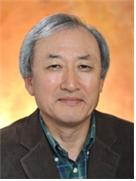
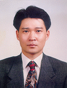
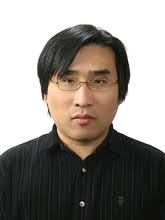

This book introduces elementary statistical analysis and data science using an educational software 『eStat』 designed for students in undergraduate level.

This work is in the public domain. Therefore, it can be copied and reproduced without limitation.

However, we would appreciate a citation where possible. (<http://www.estat.me>)

# 『eStat』 ? {.unnumbered}

『eStat』 is a web-based freeware for statistics education which can be used anytime and anywhere using PC, tablet, or mobile phone.

[『eStat』](http://www.estat.me/index.html)

[Basic Operation of 『eStat』](http://www.estat.me/estat/eLearning/en/eStatBasicOperation.html)

[pdf: 『eStat』Basic Operation](http://www.estat.me/estat/eLearning/en/eStatBasicOperation.pdf)

[youTube](https://www.youtube.com/watch?v=jjfCqdDZZ6Q)

Project Leader: Professor Jung Jin Lee, Soongsil University, Korea, ADA University, Azerbaijan, [jjlee\@ssu.ac.kr](mailto:jjlee@ssu.ac.kr){.email}

## Preface {.unnumbered}

Over the last half century, Computer Science has been evolved at a tremendous rate, bringing about previously unimaginable changes in many areas of our society and enriching our lives. Recent merging of Computer Sciences with Communication Technologies has created a digital revolution called the 4th industrial revolution that will lead for another future change.

The 4th Industrial Revolution aims at super-connectedness, super-intelligence and super-forecasting and many new changes will occur in our lives revolutionary. The revolution would help us to solve many problems, but it would also give us new challenges to be solved at the same time. The biggest challenge is analysis and utilization of Big Data.

The analysis of Big Data can be done by multi-disciplinary areas such as Statistics, Computer Science and Management etc which is called Data Science.

Data Science is primarily based on traditional statistical methods which have been applied now in almost all fields of study such as natural science, engineering, medicine, agriculture, economics, business administration, and sociology etc.

Data Science requires lots of data manipulation using computer software. However, statistical softwares such as R, SAS and SPSS which are widely used require some training from professionals. Authors of this book have been developed 『eStat』 for years which can help all level of students to learn Statistics easily and to introduce Data Science by using the software.

This book introduces basic statistical methods which are widely used in many areas and enables user to practice the methods using 『eStat』. We hope this book will serve as a useful primer for those interested in Statistics and Data Science.

Part I (Chapter 1 through 4) describes how to visualize data and summarize data using 『eStat』. This part can be easily understood and utilized by secondary school students. Part II (Chapter 5 and 6) describes probabilities, probability distribution functions, and estimations. Part III (Chapter 7 to 11) describes testing hypothesis for parameters of single and multiple populations. Chapters 7 to 9 describe traditional parametric hypothesis tests, Chapter 10 describes non-parametric hypothesis tests, and Chapter 11 describes hypothesis tests of categorical data. Part IV, Chapter 12 describes correlation and regression analysis. Chapter 13 describes time series analysis

I appreciate all of you who have developed 『eStat』 together over the past few years. I appreciate also to all internet communities who have helped us during the development of『eStat』. Special thanks should be given to Ms. Kamala Omarova for her careful reading of this manuscript.

Spring 2022

Professor Jung Jin Lee, [jjlee\@ssu.ac.kr](mailto:jjlee@ssu.ac.kr){.email}

## About the Authors {.unnumbered}

-   Jung Jin Lee, Professor, Soongsil University, Korea, ADA University, Azerbaijan

    {.imgPhoto}

    -   B.S. and M.S., Seoul National University,
    -   Ph.D., Case Western Reserve University,
    -   President, Korean Statistical Society,
    -   Vice President, International Association for Statistical Computing,
    -   Council Member, International Statistical Institute (ISI)

-   Tae Rim Lee, Professor, Korea National Open University

    {.imgPhoto}

    -   B.S. and M.S., Seoul National University,
    -   Ph.D., Choongang University,
    -   Vice President, Korean Statistical Society,
    -   Vice President, International Association for Statistics Education,
    -   Vice President, International Biometric Society

-   Geunseog Kang, Professor, Soongsil University, Korea

    {.imgPhoto}

    -   B.S. and M.S., Seoul National University,
    -   Ph.D., University of Wisconsin - Madison

-   Sung Soo Kim, Professor, Korea National Open University

    {.imgPhoto}

    -   B.S., M.S., Ph.D., Seoul National University,

-   Heon Jin Park, Professor, Inha University

    {.imgPhoto}

    -   B.S. and M.S., Seoul National University,
    -   Ph.D., Iowa Stat University,
    -   President, Korean Data Mining Society

-   Song Yong Sim, Professor, Hallym University

    {.imgPhoto}

    -   B.S. and M.S., Seoul National University,
    -   Ph.D., University of Wisconsin - Madison

-   Yoon Dong Lee, Professor, Sogang University

    {.imgPhoto}

    -   B.S. and M.S., Seoul National University,
    -   Ph.D., Iowa State University

-   Hyun Jo You, Professor, Seoul National University,

    {.imgPhoto}

    -   B.S., M.S., Ph.D,, Seoul National University,
    -   Ph.D., Soongsil University
